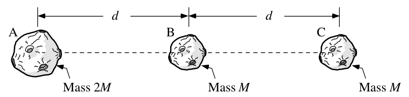
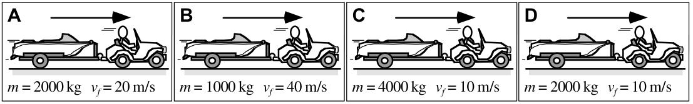
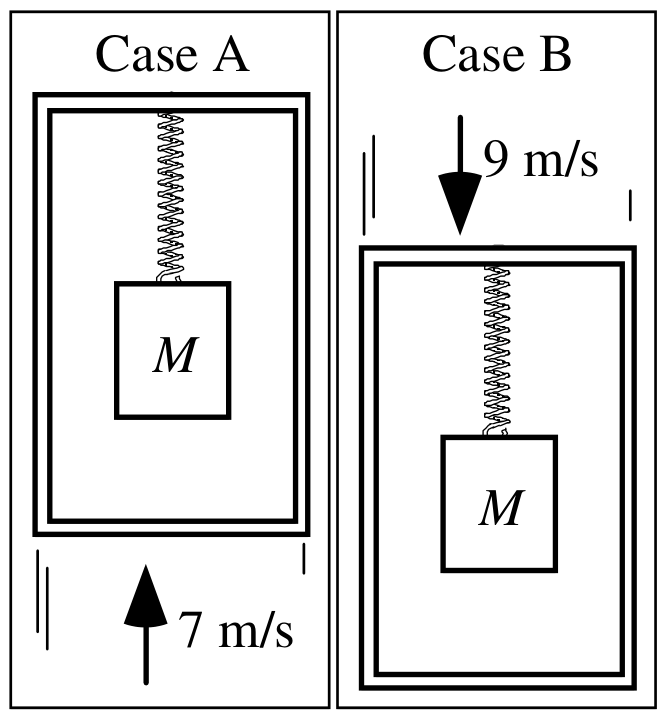
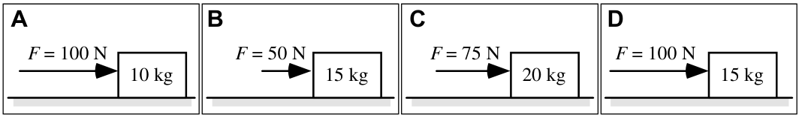
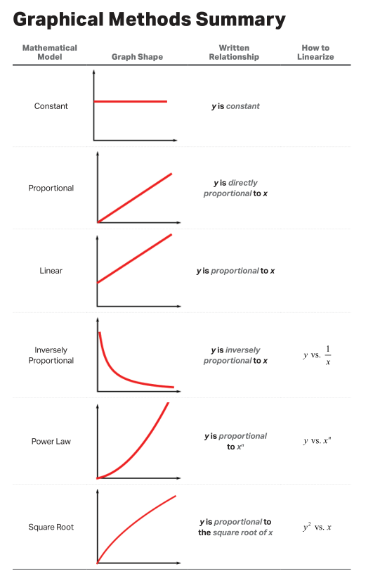
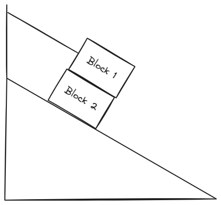
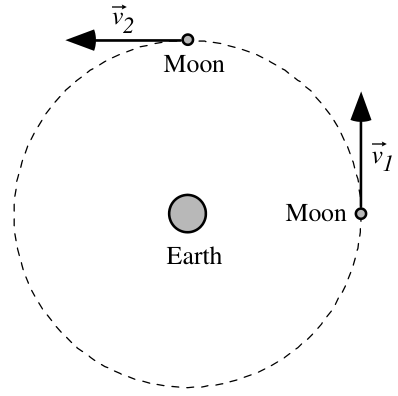
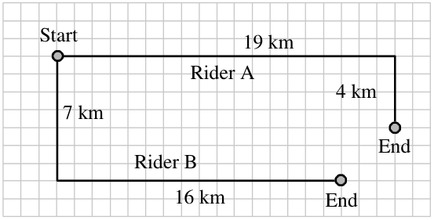
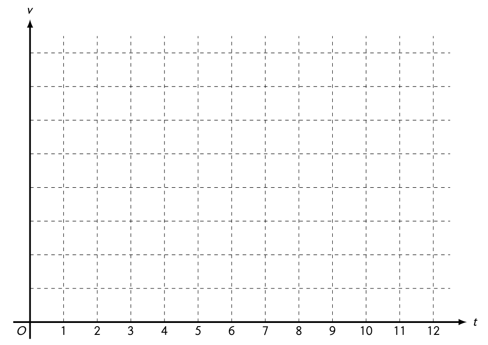
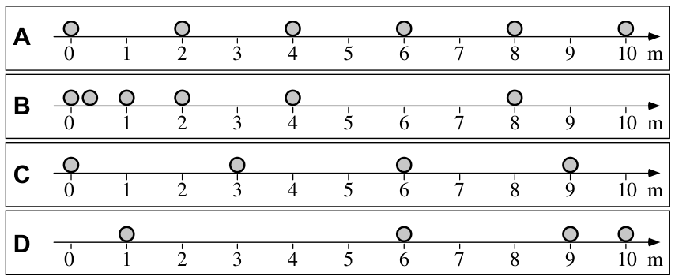

# AP Physics 🔭 <!---fit--->

# **2023-2024** Agendas

## 👨‍🏫 Mr. Porter

---

### 2024.02.29 **AP Physics** Do Now 

A block of mass $M$ is released from rest at point 1, as shown in the figure. The block slides without frictional forces along the circular arc but encounters frictional forces as soon as it reaches the horizontal portion of the track at point 2. The block travels a distance $D$ along the horizontal track before coming to rest at point 3. Consider the block-Earth system. In terms of the mechanical energy of the system, which of the following claims is correct, and why?

1. The system is open, because there is a net force exerted on the block.
2. The system is open, because the block’s velocity is zero at points 1 and 3.
3. The system is closed, because there is a net force exerted on the block.
4. The system is closed, because the block’s velocity is 0 at points 1 and 3.

---

### 2024.02.29 **AP Physics** Do Now 2

An object is released from rest at a height $H$ near and above the surface of Earth. As the object falls toward the surface, Earth’s atmosphere exerts a resistive force on the object such that it reaches a terminal velocity before it reaches the ground. Which of the following claims is true? Select two answers.

1. The system consisting of only the object is an open system.
2. Earth’s atmosphere does negative work on the object as it falls toward the surface.
3. The change in the object’s kinetic energy from the instant it is released from rest, to the instant it reaches terminal velocity, is zero.
4. The total mechanical energy of the object-Earth system remains constant at all times in which the object is in motion.

---

<!-- _footer: 🤔 Did you get better at physics today? Did you help make someone else better today? --->

# 2024.02.29 **AP Physics** 

##### **❓ of the 📅**: 

#### 📋 Agenda

1. Do Now
2. Spring Launcher Lab
3. AP Workbook 4A & 4B

#### 🎯 Goals 

🥅 _Define Conservation of Energy_

🥅 _Represent Energy Graphically_

#### 🚨 Notices

HW: Circular Motion AP Classroom Unit Review MC 1

---

<!-- _footer: 🤔 Did you get better at physics today? Did you help make someone else better today? --->

# 2024.02.27 **AP Physics** 

##### **❓ of the 📅**: How do you feel about clowns 🤡?

#### 📋 Agenda

1. Energy Notes 
2. Energy Bar Graphs 📊

#### 🎯 Goals 

🥅 _Define Conservation of Energy_

🥅 _Represent Energy Graphically_

#### 🚨 Notices

HW: Circular Motion AP Classroom Unit Review MC 1

---

<!--- _footer:  --->

A baseball is thrown from point S in right field to home plate. The dashed line shows the path of the ball.

Treat up as the positive vertical direction and to the left as the positive horizontal direction, and with the origin at home plate.

Select the graph from the choices below that best represents:

1. horizontal velocity versus time graph 
2. horizontal acceleration versus time graph
3. vertical velocity versus time graph
4. vertical acceleration versus time graph

---

<!-- _footer: 🤔 Did you get better at physics today? Did you help make someone else better today? --->

# 2024.02.26 **AP Physics** 

##### **❓ of the 📅**: How was your February Break?

#### 📋 Agenda

1. Do Now
2. Einstein Bungee Jumper
3. Hot Wheels Demo & Discussion
4. [Energy Notes](https://www.mrporterphysics.com/Presentations/APETM/talks/energy2024.html)

#### 🎯 Goals 

🥅 _Define Energy_

🥅 _Represent Energy Graphically_

#### 🚨 Notices

HW: Circular Motion AP Classroom Unit Review MC 1

---

<!-- _footer: 🤔 Did you get better at physics today? Did you help make someone else better today? --->

# 2024.02.16 **AP Physics** 

##### **❓ of the 📅**: What are your plans for break?

#### 📋 Agenda

1. Mini Lab
2. Projectiles at an angle

#### 🎯 Goals 

🥅 _Learn about freefall motion & projectiles_

#### 🚨 Notices

---

# Horizontal Projectile Lab 

1. Determine Launch Speed of your ball when launching from table. 
2. Use that information to predict where the ball will land when launched from the cabinets

---

# Physics Valentines 💟 <!--fit--->

Research your scientist and be prepared to share out a quick summary and your valentine pun

---

<!-- _footer: 🤔 Did you get better at physics today? Did you help make someone else better today? --->

# 2024.02.14 **AP Physics** 

##### **❓ of the 📅**: What is the best board game?

#### 📋 Agenda

1. Physics Valentine
2. Solving Horizontal Projectile Problems
3. AP Workbook 1.M, 1.N, 1.O
4. Mini Lab

#### 🎯 Goals 

🥅 _Learn about freefall motion & projectiles_

#### 🚨 Notices

---

<!-- _footer: 🤔 Did you get better at physics today? Did you help make someone else better today? --->

# 2024.02.13 **AP Physics** 

##### **❓ of the 📅**: What's the most unusual thing you've ever eaten?

#### 📋 Agenda

1. Astro Problem - AP Classroom
1. Horizontal Projectiles 
2. Mini Lab

#### 🎯 Goals 

🥅 _Learn about freefall motion & projectiles_

#### 🚨 Notices

---

<!-- _footer: 🤔 Did you get better at physics today? Did you help make someone else better today? --->

# 2024.02.12 **AP Physics** 

##### **❓ of the 📅**: What was your Super Bowl highlight? Halftime show? Snack? Play in the game? Commercial? Not watching?

#### 📋 Agenda

1. Free-Fall

#### 🎯 Goals 

🥅 _Learn about freefall motion & projectiles_

#### 🚨 Notices

---

<!-- _footer: 🤔 Did you get better at physics today? Did you help make someone else better today? --->

# 2024.02.08 **AP Physics** 

##### **❓ of the 📅**: What animal would you want for a non-traditional pet? (i.e. not a dog, fish or cat)

#### 📋 Agenda

1. Quiz
2. Free-Fall

#### 🎯 Goals 

🥅 _Apply N2L to Circular Motion_

🥅 _Learn about freefall motion & projectiles_

#### 🚨 Notices
- ***Week 22 HW to posted on Canvas*** - AP Classroom Work Included

---

# 2024.02.07 **AP Physics** Do Now 

At the instant shown, three asteroids are in a line, and the distance between A and B is the same as the distance between B and C. Asteroids B and C have the same mass, while asteroid A has twice the mass.

**Rank the magnitude of the net force on each asteroid due to the other two asteroids.**

---

<!-- _footer: 🤔 Did you get better at physics today? Did you help make someone else better today? --->

# 2024.02.07 **AP Physics** 

##### **❓ of the 📅**: Is your glass half full or half empty?

#### 📋 Agenda

1. Do Now
2. Universal Law of Gravitation 
3. AP Workbook: 3.M, 3.N

### 👀 Notes:

- 11/20 students _did **not**_ complete AP Classroom practice last week. **Why**?

#### 🎯 Goals 

🥅 _Apply N2L to Circular Motion_

🥅 _Learn Universal Law of Gravivation_

#### 🚨 Notices
- ***Week 22 HW to posted on Canvas*** - AP Classroom Work Included
- Quiz ***Thursday*** on _Circular Motion_ 

---

# 2024.02.06 **AP Physics** Dow Now 

## What, if anything, is wrong in this Twitter (X) Video?

[🔗Video🔗](https://x.com/TheFigen_/status/1754140214472151245?s=20)

<iframe src = "https://x.com/TheFigen_/status/1754140214472151245?s=20" width = "500ox" height = "500px" ></iframe>

---

<!-- _footer: 🤔 Did you get better at physics today? Did you help make someone else better today? --->

# 2024.02.06 **AP Physics** 

##### **❓ of the 📅**: If you had a boat, what would you name it?

#### 📋 Agenda

1. Do Now
2. Artificial Gravity: AP Workbopok 3.L
2. Universal Law of Gravitation 
3. AP Workbook: 3.M, 3.N

### 👀 Notes:

- 11/20 students _did **not**_ complete AP Classroom practice last week. **Why**?

#### 🎯 Goals 

🥅 _Apply N2L to Circular Motion_

🥅 _Learn Universal Law of Gravivation_

#### 🚨 Notices
- ***Week 22 HW to posted on Canvas*** - AP Classroom Work Included
- Quiz ***Thursday*** on _Circular Motion_ 

---

<!-- _footer: 🤔 Did you get better at physics today? Did you help make someone else better today? --->

# 2024.02.02 **AP Physics** 

##### **❓ of the 📅**: Are you happy that Punxsutawney Phil _did not_ see his shadow?

#### 📋 Agenda

1. AP Physics FRQ Practice Problem with your table partner. 
2. AP Quiz 
3. Universal Law of Gravitation

#### 🎯 Goals 

🥅 _Apply N2L to Circular Motion_

🥅 _Learn Universal Law of Gravivation_

#### 🚨 Notices
- ***Week 21 HW to posted on Canvas***
- Quiz ***Friday*** on _Circular Motion_ - Similar to workbook and HW

---

<!-- _footer: 🤔 Did you get better at physics today? Did you help make someone else better today? --->

# 2024.02.01 **AP Physics** 

##### **❓ of the 📅**: What was (still is?) your favorite animal growing up?

#### 📋 Agenda

1. Flying Animals Lab
2. Work on W21 HW & Prep for Tomorrow's quiz

#### 🎯 Goals 

🥅 _Learn circular motion terms_

🥅 _Start considering **centripetal forces**_

🥅 _Apply N2L to Circular Motion_

#### 🚨 Notices
- ***Week 21 HW to posted on Canvas***
- Quiz ***Friday*** on _Circular Motion_ - Similar to workbook and HW

---

# Flying 🐄 🐖 🦇

The buffalo farm has recently acquired some flying animals and needs to test the length of the flying animals' leashes. The farm is trying to find a way to predict how long it takes for the animals to complete one circle while attached to their loop (in physics, we call this the "period" or time for one event of repeating events to happen and use the symbol $T$.) 

**Your goal is to predict the time it takes for your animal to take 10 swings based on the length of your animal's string.**

---

<!--- _footer:   --->

A student conducts an experiment in which a $0.5 \textrm{ kg}$ ball is spun in a vertical circle from a string of length $1 \textrm{ m}$, as shown in the figure. The student uses the following equation to predict the force of tension exerted on the ball whenever it reaches the lowest point of its circular path at a known tangential speed for various trials.

$$ F_{Tension} = m \frac{v^2}{r}$$

When the experiment is conducted, the student uses a force probe to measure the actual force of tension exerted on the ball. Why is the predicted force of tension different than the actual force of tension?

**2024.01.31 AP Do Now**

| Trial | Tangential Speed ($\frac{\textrm{m}}{\textrm{s}}$) | Predicted Tension ($\textrm{N}$) | Actual Tension ($\textrm{N}$) |
| ---- | ---- | ---- | ---- |
| 1 | 1 | 0.5 | 5.5 |
| 2 | 2 | 2 | 7 |
| 3 | 3 | 4.5 | 9.5 |

---

<!-- _footer: 🤔 Did you get better at physics today? Did you help make someone else better today? --->

# 2024.01.31 **AP Physics** 

##### **❓ of the 📅**: 

#### 📋 Agenda

1. Do Now
2. Workbook Day:
    - AP Workbook 3.D through 3.H
    - Work with table/partner and check with Mr. Porter

#### 🎯 Goals 

🥅 _Learn circular motion terms_

🥅 _Start considering **centripetal forces**_

🥅 _Apply N2L to Circular Motion_

#### 🚨 Notices
- ***Week 21 HW to posted on Canvas***
- Quiz ***Friday*** on _Circular Motion _- Similar to workbook and HW

---

<!-- _footer: 🤔 Did you get better at physics today? Did you help make someone else better today? --->

# 2024.01.29 **AP Physics** 

##### **❓ of the 📅**: What was your childhood dream job? Is it still your dream job?

#### 📋 Agenda

1. Do Nows 
2. AP Workbook 3.C - Work at Table, whiteboard & discuss
3. AP Workbook 3.D & 3.E - Work at table and check with Mr. Porter

#### 🎯 Goals 

🥅 _Learn circular motion terms_

🥅 _Start considering **centripetal forces**_

🥅 _Apply N2L to Circular Motion_

#### 🚨 Notices
- ***Week 21 HW to be posted on Canvas***

---

# 2024.01.26 **AP Physics** Do Now 

All the trailers and cars shown are identical but the boat trailers have different loads. In each case, the car and boat trailer accelerate at $1\textrm{ m/s}^2$ from rest to the final speed shown.

**Rank the difference between the strength (magnitude) of the force the car exerts on the boat trailer and the strength of the force the trailer exerts on the car while the cars and trailers are accelerating.** Explain your reasoning

---

# 2024.01.26 **AP Physics** Do Now 

A hockey puck is tied to a string that is attached to a stake in the ice. The puck is given a single push perpendicular to the string causing the puck to circle the stake at a constant speed.
1) Draw a picture of the physical situation from the top.
2) Sketch a free-body diagram of the puck.
3) What forces are exerted on the puck as it circles the stake?

---

# To the **MUF** for a Demo <!--fit--->

---

<!-- _footer: 🤔 Did you get better at physics today? Did you help make someone else better today? --->

# 2024.01.26 **AP Physics** 

##### **❓ of the 📅**: What's the longest you've gone without sleep (and why)?

#### 📋 Agenda

1. Do Nows 
2. Centripetal Force
    - Demo
    - Notes
3. AP Workbook 3.C
4. AP Workbook 3.D

#### 🎯 Goals 

🥅 _Learn circular motion terms_

🥅 _Start considering **centripetal forces**_

🥅 _Apply N2L to Circular Motion_

#### 🚨 Notices

---

# Circular Motion Lab Groups 

- Hawks: Sophia, Leah, Ben, Evan 
- Eagles: Hannah, Henry, Emma, Emily
- Buzzards: Eve, John, Kaden, Alivia
- Osprey: Liam, Ruby, Brynn, Zach
- Falcons: Sydney, Fiona, Ethan, Adam

---

<!-- _footer: 🤔 Did you get better at physics today? Did you help make someone else better today? --->

# 2024.01.23 **AP Physics** 

##### **❓ of the 📅**: Do you like amusement park rides? Rollercoasters? Merry-go-rounds? Ferris Wheel? Scrambler?

#### 📋 Agenda

1. New Lab Groups 
2. AP Workbook 3.A & 3.B
3. Circular Motion Notes 
4. AP Workbook 3.C

#### 🎯 Goals 

🥅 _Learn circular motion terms_

🥅 _Start considering **centripetal forces**_

#### 🚨 Notices

- Corrections due Friday 
- Buffet Quiz Thursday 

---

<!-- _footer: 🤔 Did you get better at physics today? Did you help make someone else better today? --->

# 2024.01.17 **AP Physics** 

##### **❓ of the 📅**: What did you want to be when you were in elementary school? Has that changed?

#### 📋 Agenda

1. Review Quiz
2. Test Prep - with partner of _your choice_
    1. AP Workbook 2.J
    1. Questions from packet on vertical whiteboard

#### 🎯 Goals 

🥅 _Prepare for test_

---

<!-- _footer: 🤔 Did you get better at physics today? Did you help make someone else better today? --->

# 2024.01.12 **AP Physics** 

##### **❓ of the 📅**: Have you seen any good movies lately?

#### 📋 Agenda

1. Quiz 
2. Systems Questions
4. 2.K Acceleration of Systems 
5. Modified Atwood Machine Notes & Discussion
6. 2.J Modified Atwood Machines

#### 🎯 Goals 

🥅 _I can solve force problems with N2L_

🥅 _I can use N2L with systems of objects_

#### 📆 Future:

- Quiz 01.16 - ? Maybe
- Test 01.19 - All Dynamics 

---

<!--- _footer:   --->

### 2024.01.10 **AP Physics** Do Now -  Complete ***on your own*** in your notebook. 

A person pushes a large block on a horizontal ice surface in a straight line to the right with constant speed, as shown above. The mass of the block is and frictional forces between the block and the ice are negligible. However, the block has a wide cross-sectional area such that air resistance acting on the block cannot be neglected. The opposite is true for the person: air resistance on the person is negligible, but the person’s shoes do not slip on the ice. The table shows the force exerted by the person on the block for several values of constant speed.

1. A student claims that the data show that the magnitude of the force of air resistance is proportional to the speed of the object, within experimental uncertainty. Use physics principles to explain whether the claim is correct.
2. As the person pushes the block, the person moves with the same constant speed as the block. Consider the scenario in which the person’s speed is 5.00 m/s. Draw and label the forces (not components) exerted on the person. Each force must be represented by a distinct arrow starting on, and pointing away from, the dot.

| Force of person's push (N) | Constant speed of block $\pm 0.05$ |
| ---- | ---- |
| 20 | 1.25 |
| 40 | 2.51 |
| 60 | 3.73 |
| 80 | 5.00 |

3. The person now stops and releases the block. Determine the magnitude and direction of the block’s acceleration at the instant the block is released. (For scenario in which the person's speed is 5.00 m/s.)

---

<!-- _footer: 🤔 Did you get better at physics today? Did you help make someone else better today? --->

# 2024.01.10 **AP Physics** 

##### **❓ of the 📅**: Are you related or distantly related to anyone famous?

#### 📋 Agenda

1. Do Now
2. AP Workbook 2.I, 2.M
3. Individual Practice 

#### 🚨 Upcoming:

- Quiz 1.10: N2L, Friction, Ramps

#### 🎯 Goals 

🥅 _I can solve force problems with N2L_

🥅 _I can find components of gravity on inclined planes and use in problems._

#### 📆 Future:

- Quiz 01.16 - N2L Systems, Friction, Ramps
- Test 01.19 - All Dynamics 

---
<!-- _class: invert --->

## Choose your level

### Level 1 - Mild 🫑 :
- [Inclined Planes - Componets of Fg](https://www.physicsclassroom.com/calcpad/launch/CPF2D9)
- [Friction and mu 1](https://www.physicsclassroom.com/calcpad/launch/CPNL11)
- [Friciton and mu 2](https://www.physicsclassroom.com/calcpad/launch/CPNL12)

### Level 2 - Medium 🌶️: 
- [F = ma with Angled Forces](https://www.physicsclassroom.com/calcpad/launch/CPF2D6)
- [Inclined Plane Problems 1](https://www.physicsclassroom.com/calcpad/launch/CPF2D10)
- [Inclined Plane Problems 2 CV](https://www.physicsclassroom.com/calcpad/launch/CPF2D11)
- [Inclined Plane Problems 3 CA](https://www.physicsclassroom.com/calcpad/launch/CPF2D12)
- [F = ma with Kinematics 2](https://www.physicsclassroom.com/calcpad/launch/CPNL18)

### Level 3 - Spicy 🌶️🌶️: 
- [F = ma with Angled Forces 2](https://www.physicsclassroom.com/calcpad/launch/CPF2D7)
- [F = ma with Angled Forces 3](https://www.physicsclassroom.com/calcpad/launch/CPF2D8)
- [F = ma with kinematics 3](https://www.physicsclassroom.com/calcpad/launch/CPNL19)

### Level 4 - Fire 🔥🥵:
- Old AP Questions (see Porter for handout)
- [Inclined Plane with Kinematics](https://www.physicsclassroom.com/calcpad/launch/CPF2D13)

---

<!-- _footer: 🤔 Did you get better at physics today? Did you help make someone else better today? --->

# 2024.01.09 **AP Physics** 

##### **❓ of the 📅**: What's your favorite fast food chain?

#### 📋 Agenda

1. Inclined Plane Notes
2. Inclined Plane Calculation Practice 
3. AP Workbook 2.H, 2.I, 2.M

#### 🚨 Upcoming:

- Quiz 1.10: N2L, Friction, Ramps

#### 🎯 Goals 

🥅 _I can solve force problems with N2L_

🥅 _I can find components of gravity on inclined planes and use in problems._

#### 📆 Future:

- Quiz 01.16 - N2L Systems, Friction, Ramps
- Test 01.19 - All Dynamics 

---

# **Week 18** (01.08-01.12)

### 🎯 Week Goals

1. Master Inclined Planes 
2. Learn how to solve problems involving accelerating systems 
3. Wrap up Forces

### 📝 Assessments This Week

- Quiz 1.10: N2L, Friction, Ramps

 

### 🏡 Outside Work 

1. AP Classroom Dynamics Unit Review 
    - MC Part A, MC Part B
    - FRQ
2. Start completing reassessments (You have two weeks!)

### 🚨 Upcoming

- Quiz 01.16 - N2L Systems, Friction, Ramps
- Test 01.19 - All Dynamics 

---

<!-- _footer: 🤔 Did you get better at physics today? Did you help make someone else better today? --->

# 2024.01.08 **AP Physics** 

##### **❓ of the 📅**: What was the last book you read?

#### 📋 Agenda

1. Finish Forces on Ramps 
2. Inclined Plane Notes 
3. AP Workbook 2.H, 2.I, 2.M

#### 🚨 Upcoming:

- Quiz 1.10: N2L, Friction, Ramps

#### 🎯 Goals 

🥅 _I can solve force problems with N2L_

🥅 _I can apply friction to N2L and use the equation for Friction_

#### 📆 Future:

- Quiz 01.16 - N2L Systems, Friction, Ramps
- Test 01.19 - All Dynamics 

---

<!-- _footer: 🤔 Did you get better at physics today? Did you help make someone else better today? --->

# 2024.01.04 **AP Physics** 

##### **❓ of the 📅**: Who is excited for snow this weekend? 🎿 🏂

#### 📋 Agenda

1. Quiz 
2. Forces on Ramps Pivot & Notes 

#### 🚨 Upcoming:

- Quiz 1.10: N2L, Friction, Ramps

#### 🎯 Goals 

🥅 _I can solve force problems with N2L_

🥅 _I can apply friction to N2L and use the equation for Friction_

#### 📆 Future:

- Quiz 01.16 - N2L Systems, Friction, Ramps
- Test 01.19 - All Dynamics 

---

<!-- _footer: 🤔 Did you get better at physics today? Did you help make someone else better today? --->

# 2024.01.03 **AP Physics** 

##### **❓ of the 📅**: Who makes the best pizza 🍕?

#### 📋 Agenda

1. [Friction Notes](../../../Presentations/Forces/talks/Dynamics2023.html#88)
2. Practice with Friction
    1. Porter Slide Questions
    1. Workbook 2G, 2I, 2M

#### 🚨 Upcoming:

- Quiz Thursday 1.04: N2L (no angled forces), N3L

#### 🎯 Goals 

🥅 _I can solve force problems with N2L_

🥅 _I can apply friction to N2L and use the equation for Friction_

#### 📆 Future:

- Quiz 01.10 - N2L, Friction
- Quiz 01.16 - N2L Systems 
- Test 01.19 - All Dynamics 

---

### 2024.01.02 **AP Physics** Do Now 

A race car has a mass of $710 \textrm{ kg}$. It starts from rest and travels $40.0 \textrm{ m}$ in $3.0 \textrm{ s}$. The car is uniformly accelerated during the entire time. 

1. Find the acceleration of the car using kinematics.
1. What is the magnitude of the net force acting on the car?
    - Make a quantitative force diagram. 
    - Write a net force equation for the axis along which forces are not balanced.

---

### 2024.01.02 **AP Physics** Do Now 2 

Renee is on Spring Break and pulling her $30 \textrm{-kg}$ suitcase through the airport at a constant speed of $0.4 \textrm{ m/s}$. She pulls on the strap with $120 \textrm{ N}$ of force at an angle of $40^\circ$ above the horizontal.

1. Determine the normal force experienced by the suitcase.
2. Determine the total frictional forces experienced by the suitcase

---

<!-- _footer: 🤔 Did you get better at physics today? Did you help make someone else better today? --->

# 2024.01.02 **AP Physics** 

##### **❓ of the 📅**: Do you make New Year's Resolutions? If so what are yours?

#### 📋 Agenda

1. Do Now 
2. AP Workbook 2.F - with Lab Group 
3. Choose your practice 

#### 🚨 Upcoming:

- Quiz Thursday 1.04: N2L (no angled forces), N3L

#### 🎯 Goals 

🥅 _I can solve force problems using Newton's Second Law_

#### 📆 Future:

- Quiz 01.10 - N2L, Friction
- Quiz 01.16 - N2L Systems 
- Test 01.19 - All Dynamics 

---

<!--- footer:  --->

# Leveled Practice 

1. Level 1: No angles
	1. [NL8 - Newton's Second Law Horizontal Acceleration](https://www.physicsclassroom.com/calcpad/launch/CPNL8)
	2. [NL9 - Newton's Second Law Vertical Acceleration](https://www.physicsclassroom.com/calcpad/launch/CPNL9)
	3. [NL10 - Newton's Second Law: Unknown Force](https://www.physicsclassroom.com/calcpad/launch/CPNL10)
2. Level 2: Angled Forces
	1. [F2D6 - Fnet = ma with Angled Forces 1](https://www.physicsclassroom.com/calcpad/launch/CPF2D6)
3. Level 3: Two Body Problems
	1. [NL20 - Two-Body Problems](https://www.physicsclassroom.com/calcpad/launch/CPNL20)
4. Level 4: New Stuff - Friction  (you will have to click the read link to learn about $F_f \le \mu F_N$)
	1. [NL11 - Friction and Mu 1](https://www.physicsclassroom.com/calcpad/launch/CPNL11)
	2. [F2D6 - Fnet = ma with Angled Forces 2](https://www.physicsclassroom.com/calcpad/launch/CPF2D7)

---

### 2023.12.21 AP Physics Do Now 

A spring is attached to the ceiling of an elevator, and a block of mass $M$ is suspended from the spring. The cases are identical except that in Case A the elevator is moving upward with a constant speed of 7 m/s, while in Case B the elevator is moving downward with a constant speed of 9 m/s.

**Will the spring be stretched (i) *more* in Case A, (ii) *more* in Case B, or (iii) the *same* in both cases?** 

Explain your reasoning.

---

### 2023.12.21 AP Physics Do Now #2 

The figure above shows the forces exerted on a block that is sliding on a rough horizontal surface: The weight of the block is $500 \textrm{ N}$, the normal force is $500 \textrm{ N}$, the frictional force is $100 \textrm{ N}$, and there is an unknown force exerted to the right. The acceleration of the block is $0.4 \textrm{ m/s}^2$.

**What is the magnitude of the unknown force?**

---

<!--- _class: winter --->

# 2023.12.21 **AP Physics** ⛄

##### **❓ of the 📅**: What type of cookies do you leave out for Santa? 🎅

#### 📋 Agenda

1. Do Now 
2. Finish AP Workbook 2.D
3. AP Workbook 2.C & 2.E
4. Choose your practice

#### 🎯 Goals 

🥅 _I can solve force problems using Newton's Second Law_

🤔 Did you get better at physics today? Did you help make someone else better today?

---

## 2023.12.20 AP Do Now

Various similar boxes are being pushed for 10 m across a floor by a net horizontal force as shown below. The mass of the boxes and the net horizontal force for each case are given in the indicated figures. All boxes have the same initial velocity of 10 m/s to the right.

**Rank the acceleration of the boxes.**

---

<!--- _class: winter --->

# 2023.12.20 **AP Physics** ⛄

##### **❓ of the 📅**: What is the best holiday treat?

#### 📋 Agenda

1. Do Now 
2. Elevator Problems 
3. N2L Application 
4. AP Workbook: 2.C, 2.D, and 2.E

#### 🎯 Goals 

🥅 _Derive N2L Experimentally_ 

🥅 _Apply N2L to elevator problmes_

🥅 _Use all of Newton's Laws to solve problems._

🤔 Did you get better at physics today? Did you help make someone else better today?

---

### 2023.12.19 **AP Physics** Do Now 

A person pulls a block across a rough horizontal surface at a constant speed by applying a force F at a slight angle as shown. A free-body diagram is drawn for the block. The arrows in the diagram correctly indicate the directions but not necessarily the magnitudes of the various forces on the block. A student makes the following claim about this free-body diagram:

_"The velocity of the block is constant, so the net force acting on the block must be zero. Thus the normal force $F_N$ equals the weight $W$, and the force of friction $f_k$ equals the applied force $F$."_

**What, if anything, is wrong with this statement?**

---

<!--- _class: winter --->

# 2023.12.19 **AP Physics** ⛄

##### **❓ of the 📅**: Would you rather have a pet dragon or a pet unicorn?

#### 📋 Agenda

1. Do Now 
2. Fan Cart Lab Board Meeting 
3. Elevator Problems 
4. AP Workbook: 2.C, 2.D, and 2.E

#### 🎯 Goals 

🥅 _Derive N2L Experimentally_ 

🥅 _Apply N2L to elevator problmes_

🥅 _Use all of Newton's Laws to solve problems._

🤔 Did you get better at physics today? Did you help make someone else better today?

---

# Before the Board Meeting...

## Find a way to measure the force of your fan for each of the three settings

### List of Classroom Materials Avaiable:

- Spring Scales and springs with known $k$ values
- Electronic Force Sensors
    - Dynamics Cart (teal smart carts)
    - Wired Hooked Sensors
- Force Plates
- Electronic Balance

---

# 2023.12.15 **AP Physics** ⛄

##### **❓ of the 📅**: Have you finished your holiday shopping yet?

#### 📋 Agenda

1. Porter's notes on your Fan Cart Data 
2. Finish Collecting Fan Cart Data
3. Graph, Whiteboard and Discuss

#### 🎯 Goals 

🥅 _Use force diagrams to solve equilibrium problems._

🥅 _Find components of forces on inclined planes._

🤔 Did you get better at physics today? Did you help make someone else better today?

---

## Porter Notes 📋

- Why the velocity columns? What velocity are you recording? Initial? Final? Average?
    - We are looking at the **acceleration** of the cart -- can find with *slope* of the VT graphs
- You will need to separate out your data from **each fan setting** (i.e. an acceleration column for each fan setting)
    - You can fix this by downloading the data and manipulating in Google Sheets with copy and paste
- Groups with zero acceleration? We will need to discuss whats happening there (if you have zero acceleration forces are balanced and fan isn't working?)
- You ***must include*** the *cart's mass* in your mass column

---

## Reminder - Linearization (This should be in your notes)

- When we have curved data we need to manipulate our data to make a new plot
- What does it look like?

---

# Board Meeting 

### Whiteboard results, write down equations 

### Board Meeting Ideas:

- What does the slope represent (what is your _for every_ statement)? What are the slope units?
- Is the intercept negligible or non-negligible?
- What do the different fan settings to do your slope?

---

# 🤔 How can you measure the **fan force**?

What tools can you use?

- Force Sensors?
- Force Plates?
- Scales?

What conditions need to be met to ensure you are measuring the fan force? _(Friction/frictionless? Surface level/unlevel? String attached level? Zero the scale? etc)_

---

# [Newton's Second Law](../../../Presentations/Forces/talks/Dynamics2023.html#77) 

---

# 2023.12.13 **AP Physics** ⛄

##### **❓ of the 📅**: What is your song of the year?

#### 📋 Agenda

1. Finish Force Stations 
2. Fan Cart Lab

#### 🎯 Goals 

🥅 _Use force diagrams to solve equilibrium problems._

🥅 _Find components of forces on inclined planes._

🤔 Did you get better at physics today? Did you help make someone else better today?

---

<!--- _class: winter --->

# 2023.12.11 **AP Physics** ⛄

##### **❓ of the 📅**: What smell brings back great memories?

#### 📋 Agenda

1. Questions from Friday?
1. Plicker Check for Understanding Questions
2. Balanced Force Stations

#### 🎯 Goals 

🥅 _Solve quantitative balanced force problems_

#### 🚨 Homework:

- Assignment will be posted on canvas 
- Expect a quiz Friday, but I need to hand back old quizzes first....

🤔 Did you get better at physics today? Did you help make someone else better today?

---

# Balanced Force Stations:

## For Each Station...

### In your notebook:

1. Draw the Free Body Diagram and Vector addition diagram for the object of interest. 
2. Use the diagrams to find the missing value (force, mass, spring constant, etc). 

---

<!--- _class: winter --->

# 2023.12.07 **AP Physics** ⛄

##### **❓ of the 📅**: What smell brings back great memories?

#### 📋 Agenda

1. [Force Questions](../../../Presentations/Forces/talks/Dynamics2023.html#57) 
2. Force Pair Demos & Discussions
2. Pivot - Forces during collisions
1. Solving Quantitative Force Problems

#### 🎯 Goals 

🥅 _Find the relationship between $F_s$ and stretch_

🥅 _Solve quantitative balanced force problems_

🤔 Did you get better at physics today? Did you help make someone else better today?

---

<!--- _class: winter --->

# 2023.12.05 **AP Physics** ⛄

##### **❓ of the 📅**: If you had to be a villian from a movie, which movie would you pick?

#### 📋 Agenda

1. Finish $F_s$ Lab
    - Collect Data
    - Whiteboard & Board Meeting
2. Solving Quantitative Force Problems

#### 🎯 Goals 

🥅 _Find the relationship between $F_s$ and stretch_

🥅 _Solve quantitative balanced force problems_

🤔 Did you get better at physics today? Did you help make someone else better today?

---

### 2023.12.04 AP Phyiscs **Do Now**

Two blocks are stacked on a ramp with the top block being attached to the wall with a string. The system is at rest. 

1. Draw the interaction diagram for the system.
2. Draw the Free Body diagram and Vector Addition Diagram for Block 2
2. Draw the Free Body diagram and Vector Addition Diagram for Block 1

---

<!--- _class: winter--->

# **Week 14** (12.04-12.10)

### 🎯 Week Goals

1. Identify Forces
2. Draw Force Diagrams
3. Solve Static Force Problems
4. Describe Force Pairs

### 🚨 Notes & Upcoming...

Quiz TBD

 

### 🏡 Outside Work 

1. Solving Force Problems Quantitatively

---

<!--- _class: winter --->

# 2023.12.04 **AP Physics** ⛄

##### **❓ of the 📅**: Is it OK to ask the genie for infinite wishes? 🧞

#### 📋 Agenda

1. Force of Gravity Lab
2. $F_g$ Board Meeting 
3. Spring Force Lab 
4. Spring Force Board Meeting

#### 🎯 Goals 

🥅 _Find relationship between mass and weight ($F_g$)_

🥅 _Find the relationship between $F_s$ and stretch_

🤔 Did you get better at physics today? Did you help make someone else better today?

---

# Force of Gravity $(F_g)$ Lab 

## **Essential Question:** How is **mass** related to the force of gravity?

---

# $F_g$ Lab 

## Notes:

* Weight == $F_g$ == Force of Gravity...so $F_g = mg$
* Weight is a **FORCE**, mass is scalar quantity
* $g$ is the gravitational field strength
    * Measured in N/kg 
    * changes based on planet and location on that planet
    * _near the surface of the Earth_ $g = 9.8 \textrm{ N/kg}$

---

# Spring Force Lab 

## **Essential Question:** How is the displacement (stretch) of the spring related to the spring force?

### Notes:

- Use known masses and your knowledge of the Force of gravity on those masses as your "force sensor" 

---

<!--- _class: winter--->

# **Week 12** (11.27-12.01)

### 🎯 Week Goals

1. Identify Forces
2. Draw Force Diagrams
3. Confidently find vector components
3. Confidently Add Vectors

### 🚨 Notes & Upcoming...

_Quiz Friday_: Vector addition, drawing force diagrams 

 

### 🏡 Outside Work 

1. Vector Addition Practice 
2. Drawing FBDs Practice 

---

<!--- _class: winter --->

# 2023.12.01 **AP Physics** ⛄

##### **❓ of the 📅**: Is it OK to ask the genie for infinite wishes? 🧞

#### 📋 Agenda

1. Quiz
2. Gravity Lab
3. Spring Force Lab

#### 🎯 Goals 

🥅 _Identify Forces_

🥅 _Identify FBD, VAD, and Interaction Diagrams_

🥅 _Create our own Force Diagrams_

🤔 Did you get better at physics today? Did you help make someone else better today?

---

<!--- _class: winter --->

# 2023.11.29 **AP Physics** ⛄

##### **❓ of the 📅**: What superstition do you think is ridiculous?

#### 📋 Agenda

1. Force Diagrams: FBDs & VADs
2. Practice with Force Diagrams 
    - Card Sort
    - Individual Practice - 🐒 (Assignment in Canvas, draw in your notebook)

#### 🎯 Goals 

🥅 _Identify Forces_

🥅 _Identify FBD, VAD, and Interaction Diagrams_

🥅 _Create our own Force Diagrams_

🤔 Did you get better at physics today? Did you help make someone else better today?

---

<!--- _class: winter --->

# 2023.11.28 **AP Physics** ⛄

##### **❓ of the 📅**: What is your favorite winter activity?

#### 📋 Agenda

1. Share out Interaction Stations
2. [Force Definitions (Notes)](../../../Presentations/Forces/talks/Dynamics2023.html#42)
3. Force Diagrams (How to, notes)
4. Force Diagram Card Sort
5. Practice Drawing your own force diagrams 

#### 🎯 Goals 

🥅 _Identify Forces_

🥅 _Identify FBD, VAD, and Interaction Diagrams_

🥅 _Create our own Force Diagrams_

🤔 Did you get better at physics today? Did you help make someone else better today?

---

<!--- _class: winter --->

# 2023.11.27 **AP Physics** 🦃

##### **❓ of the 📅**: What is your ideal burger 🍔 (or veggie burger)?

#### 📋 Agenda

0. Leah's First Law
1. Interaction Types
2. Interaction Stations
3. Force Names & Definitions 
4. Force Diagrams 

#### 🎯 Goals 

🥅 _Define the reason(s) for constant velocity motion and constant acceleration motion_

🤔 Did you get better at physics today? Did you help make someone else better today?

---

# Leah's First Law:

##  **_If the sum of forces is not zero then it will accelerate in the direction of the sum of forces_** - McIntosh et al

[Slides](../../../Presentations/Forces/talks/Dynamics2023.html#36)

---

<!--- _class: thanksgiving --->

# 2023.11.20 **AP Physics** 🦃

## Do Now

Javar is at the dog park with Roscoe, his Labrador Retriever. Roscoe catches a scent of interest and walks 25.4 meters south, then 24.3 meters at an angle 31.3 degree north of east, and finally 41.8 meters west.

What is their displacement?

---

<!--- _class: thanksgiving --->

# 2023.11.20 **AP Physics** 🦃

## Do Now

A pack of three Artic wolves are fighting over a snack. A top view of the magnitude and direction of the three forces is shown in the diagram to the right.

Force A: 226 N, West

Force B: 761 N, 45° North of East

Force C: 720 N, South

What is the magnitude of the resultant force?

---

<!--- _class: thanksgiving --->

# 2023.11.20 **AP Physics** 🦃

##### **❓ of the 📅**: Do you have any Thanksgiving traditions?

#### 📋 Agenda

1. Do Now
3. Mallet Ball Discussion
4. [Dueling Fan Carts](../../../Presentations/Forces/talks/Dynamics2023.html#29)
5. [PHET Simulation](https://phet.colorado.edu/sims/html/forces-and-motion-basics/latest/forces-and-motion-basics_all.html): Tug-of-War

#### 🎯 Goals 

🥅 _Define the reason(s) for constant velocity motion and constant acceleration motion_

🤔 Did you get better at physics today? Did you help make someone else better today?

---

<!--- _class: thanksgiving--->

# **Week 11-12** (11.13-11.21)

### 🎯 Week Goals

1. Learn Vector Math
2. Introduction to Forces 
3. Define Force Laws

### 🚨 Notes & Upcoming...
- We need to do a rotational kinematics quiz -- Thursday?

 

### 🏡 Outside Work 

1. Physics Classroom Vector Practice:
	1. [Vector Components 2](https://www.physicsclassroom.com/calcpad/launch/CPVP4)
	2. [Adding 3 or more perpendicular vectors](https://www.physicsclassroom.com/calcpad/launch/CPVP6)
	3. [Vector Component Analysis 2](https://www.physicsclassroom.com/calcpad/launch/CPVP7)

---

<!--- _class: thanksgiving --->

# 2023.11.16 **AP Physics** 🦃

##### **❓ of the 📅**: Would you rather have unlimited battery life on all of your devices or have free WiFi wherever you go?

#### 📋 Agenda

1. Rotational Motion Quiz 
3. Mallet Ball Discussion
4. [Dueling Fan Carts](../../../Presentations/Forces/talks/Dynamics2023.html#29)
5. [PHET Simulation](https://phet.colorado.edu/sims/html/forces-and-motion-basics/latest/forces-and-motion-basics_all.html): Tug-of-War

#### 🎯 Goals 

🥅 _Define the reason(s) for constant velocity motion and constant acceleration motion_

🤔 Did you get better at physics today? Did you help make someone else better today?

---

<!--- _class: thanksgiving --->

# AP Physics **Do Now** 2023.11.14

The position and velocity of the moon are shown at two times, about seven
days apart.

**Find the direction of the change in velocity of the moon in this time
interval. If the change in velocity is zero, state that explicitly.** 

**Explain your reasoning _with a vector addition diagram._**

Hints: $\Delta v = v-v_0$  

---

<!--- _class: thanksgiving --->

# 2023.11.14 **AP Physics** 🦃

##### **❓ of the 📅**: Should you bite or lick your ice cream? 🍨 🍦

#### 📋 Agenda

1. Do Now 
2. [CV or CA](../../../Presentations/Forces/talks/Dynamics2023.html#17)? How?
3. Mallet Ball
4. Dueling Fan Carts 
5. [PHET Simulation](https://phet.colorado.edu/sims/html/forces-and-motion-basics/latest/forces-and-motion-basics_all.html): Tug-of-War

#### 🎯 Goals 

🥅 _Define the reason(s) for constant velocity motion and constant acceleration motion_

🤔 Did you get better at physics today? Did you help make someone else better today?

---

<!--- _class: thanksgiving --->

# AP Physics **Do Now** 2023.11.13

1. Is the magnitude of the displacement of the rider (i) greater in case A, (ii) greater in case B, or (iii) the same
in both cases? Explain your reasoning.
2. Is the magnitude of the average velocity of the rider (i) greater in case A, (ii) greater in case B, or (iii) the same in both cases? Explain your reasoning.

---

<!--- _class: thanksgiving --->

# 2023.11.13 **AP Physics** 🦃

##### **❓ of the 📅**: If you could live anywhere, where would it be?

1. Do Now
2. Vector Practice - rotating partners
	1. [Vector Components 1](https://www.physicsclassroom.com/calcpad/launch/CPVP3)
	2. [Adding 2 Perpendicular Vectors](https://www.physicsclassroom.com/calcpad/launch/CPVP5)
	3. [Vector Component Analysis 1](https://www.physicsclassroom.com/calcpad/launch/CPVP7)

---

<!--- _class: thanksgiving--->

# **Week 10** (11.06-11.00)

### 🎯 Week Goals

1. Learn Vector Math
2. Introduction to Forces 
3. Correct Tests

### 🚨 Notes & Upcoming...

 

### 🏡 Outside Work 

1. Test Corrections 
2. Quiz Reassessments

---

<!--- _class: thanksgiving --->

# 2023.11.09 **AP Physics** 🦃

##### **❓ of the 📅**: What’s the longest trip you’ve been on?

1. Finish Vectors Pivot 
2. Remainder of class for test corrections
3. If you finish both you can start Physics Classroom Vector Practice:
	1. [Vector Components 1](https://www.physicsclassroom.com/calcpad/launch/CPVP3)
	2. [Adding 2 Perpendicular Vectors](https://www.physicsclassroom.com/calcpad/launch/CPVP5)
	3. [Vector Component Analysis 1](https://www.physicsclassroom.com/calcpad/launch/CPVP7)

---

<!--- _class: thanksgiving --->

# 2023.11.07 **AP Physics** 🦃

##### **❓ of the 📅**: 

1. Test Corrections 

---

<!--- _class: thanksgiving --->

# **Test Corrections**

1. Determine correct answer for questions answered incorrectly
    + For FRQ you need to correct the entire part (i.e. part (a)) if you lost *any* points
    + No you cannot see what you put before - start from scratch
2. For MC questions you must provide a justification for your answers
    - Start with a fact of physics "slope of VT is acceleration" or "area of VT is displacement"
    - Draw a diagram to help (i.e. draw a VT graph)
    - Try to use a claim evidence reasoning format to write your justification
4. Finally, compare your new, correct answers to your test and determine if your mistake was one of the 4 C's: clueless, careless, conceptual, or calculation.

---

<!--- _class: thanksgiving --->

# **Test Corrections Summary**

4. Look for trends about what your test performance:
    - Were there certain types of questions you missed?
    - Do you need to review/relearn/learn some material that was tested?
        - What learning mastery standard do you think that material aligns with?
    - Was there a common mistake you made?
    - Summarize
5. Meet with Mr. Porter to discuss the trends **before** you turn in your corrections.

---

<!--- _class: thanksgiving --->

# 2023.11.06 **AP Physics** 🦃

##### **❓ of the 📅**: Should there be a sarcasm font?

0. You will get your tests back next class. *I am not done grading, so don't ask*.
    - About Test Corrections...
1. [Vectors](../../../Presentations/Forces/talks/Dynamics2023.html)
2. Vector Exploration in Pivot 

---

<!--- _class: halloween--->

# **Week 9** (10.30-11.03)

### 🎯 Week Goals

1. Wrap up kinematics:
    - Linear
    - Rotational
2. Check our understanding of kinematics

### 🚨 Notes & Upcoming...

- Test Friday 11/3 on Kinematics 
    - **Mandatory** review will be posted on AP Classroom (some questions will be skipped)

 

### 🏡 Homework 

1. AP Classroom Test Review (Posted in Canvas)

---

<!--- _class: thanksgiving--->

# 2023.11.01 **AP Physics** 🦃

##### **❓ of the 📅**: Should there be a sarcasm font?

1. Rolling Ball Ranking Task
2. Rocket Ship Paragraph
3. Test Preview
4. Texting and Driving

---

The following situations illustrate the position of two different balls at different times. The first ball (a through f) rolls with constant velocity across a horizontal surface, while the second ball (g through l) rolls with constant acceleration down an inclined ramp. Both objects are at position zero at time = 0, and both are at position = d at time = 6 s.

1. On the graph to the right plot the velocity vs. time for each ball. Indicate where they are at position $d$.

---

The following situations illustrate the position of two different balls at different times. The first ball (a through f) rolls with constant velocity across a horizontal surface, while the second ball (g through l) rolls with constant acceleration down an inclined ramp. Both objects are at position zero at time = 0, and both are at position = d at time = 6 s.

2. Rank each situation (a through l...yes, all 12 together, not two separate lists) according to the position along the surface of the ball at the indicated time. Write your answer on a single line, using the > and = signs to show the relationships. NOTE: The pictures are not drawn to scale, so you cannot rely on them to show which ball is ahead.

---

### As a space shuttle burns up its fuel after take-off, it gets lighter and lighter and its acceleration larger and larger. Between the moment it takes off and the time at which it has consumed nearly all of its fuel, is the magnitude of the average velocity larger than, equal to, or smaller than half its final speed? 

### In a clear, paragraph-length response, explain why. [Hint: you can draw a diagram and refer to it in your paragraph. (Maybe a velocity-time graph would help you visualize this answer)]

---

## Tips for Paragraph Length Response:

#### ABCD: ***Answer***, Basic Physics, Cite information, Draw it together

**Answer the Question** (Claim)

* DO: State whether something increases, decreases, or stays the same.
  - If given two or more cases to choose from, state which case answers the question, or clearly state that both cases are the same.
* DON'T: Just say that something “changes”. We need to know how it changes. Talk about how it could be either case or both. You need to commit to an answer.

---

## Tips for Paragraph Length Response:

#### ABCD: Answer, ***Basic Physics***, Cite information, Draw it together

**Basic Physics** (Evidence)

* Your explanation needs to include at least one statement of basic physics. You'll know that this is a statement of basic physics because a statement of basic physics is true all the time, every day, and in all situations. Basic physics can be the name of a law of physics, like "Newton’s Third Law", or it can be a statement of the law itself, such as "when the horse pulls the cart, the cart pulls back on the horse with the same force."

---

## Tips for Paragraph Length Response:

#### ABCD: Answer, Basic Physics, ***Cite information***, Draw it together

**Cite Important Information** (Evidence)

* This is when you point out important aspects of this particular situation that are relevant to your explanation. The Cite Information sentence should start with the words “in this situation” or “in Case 1” or “for the small cart, ...” and proceed to say something about the particular problem you are presented with.

--- 

## Tips for Paragraph Length Response:

#### ABCD: Answer, Basic Physics, Cite information, ***Draw it together***

**Draw It All Together** (Reasoning)

* This is when you take your statements of basic physics and the important information that you cited from this situation and show how it logically leads to the correct answer. Depending on how well you do your B’s and C’s, your “Draw it Together” might only be a single sentence.

---

## More Tips for Paragraph Length Response:

* Do NOT use "it", "they", "them". Use good nouns (you know the words on your reference table)
* Use good verbs that talk about what the nouns are doing
  - (Objects will speed up, slow down, change direction, gain/lose/transfer energy, gain/lose/transfer momentum, exert or experience forces, etc.)
* You do not need to restate the question.
* Don't write more than you mean to
* Don't write just "force" - state the specific force
* Don't write "it moves"!!

---

### As a space shuttle burns up its fuel after take-off, it gets lighter and lighter and its acceleration larger and larger. Between the moment it takes off and the time at which it has consumed nearly all of its fuel, is the magnitude of the average velocity larger than, equal to, or smaller than half its final speed? 

### In a clear, paragraph-length response, explain why. [Hint: you can draw a diagram and refer to it in your paragraph. (Maybe a velocity-time graph would help you visualize this answer)]

---

# Calculated Estimation

### As a lab group, on your whiteboard...

How far do you travel ***if you were to hypothetically*** you text 'lol' while driving on Maple Hill Road and then react to an object in your path and slam on the brakes?

Assumptions:

- You have to **read** and **respond** to a text message
- You are driving at Maple Hill Road (speed limit 18 m/s)
- You can brake with an acceleration of 5 m/s/s

Use graphs, diagrams, and equations to explain your answer.

---

<!--- _class: halloween--->

## 2023.10.31  **AP Physics** Do Now 

Recall...

1. What is the ***slope*** of ____ represent:
    - Position vs. time graph?
    - Velocity vs. time graph?
2. What does the ***area*** of ___ represent:
    - Velocity vs. time graph?
    - Acceleration vs. time graph?
3. How do you find ***instantaneous velocity*** on a XT Graph?
4. How do you find ***final position*** from a VT Graph?

5. What does a ***concave up*** XT Graph mean? ***Concave down***?
6. When is $x_f$, $\Delta x$, and distance different? The same?
7. What does ***uniform motion*** mean?
8. How do the direction of ***velocity*** and ***acceleration*** compare when an object is ***slowing***? 
9. What is ***acceleration***?
10. How do you convert from ***rotational*** quantities to the equivalent ***linear*** quantities?

---

<!--- _class: halloween--->

## 2023.10.31  **AP Physics** Do Now 

In each case, a sphere is moving from left to right next to a tape marked in meters. A  strobe (flash) photograph is taken every second, and the location of the sphere is recorded. The total time intervals shown are not the same for all spheres.

 

1. Rank the magnitude of the ***displacement*** over the first 3 seconds.
2. Rank the magnitude of the ***average velocity*** over the first 2 seconds.
3. What is the ***acceleration*** of ball A?
4. What is the ***acceleration*** of ball B? (Assume starts from rest)
5. What is ball B's ***position at 10 seconds***? (assume uniform motion)

---

<!--- _class: halloween--->

# 2023.10.31 **AP Physics** 👽

##### **❓ of the 📅**: Are you trick or treating tonight?

1. Do Nows 
1. Brain Dump 🧠
2. Free Response Practice 

### 🚨 Test Friday

- Test Preview tomorrow...Each group gets 2 copies of the test **without** the question, but everything else (diagrams, situation descriptions, etc)
 

--- 

# Brain Dump 🧠

## Make A Whiteboard Summary of Kinematics

Your board should...

- Be visible from across the room (no super tiny writing!)
- Utilize multiple colors for clarity
- Include diagrams and equations
- Summarize our constant velocity and constant acceleration models

_Try to do this from **memory** first and then refer to your notes and add to your whiteboard_

---

### 2023.10.30  **AP Physics** Do Now 

A weight is tied to a rope that is wrapped around a pulley. The pulley is initially rotating counterclockwise and is pulling the weight up. The tension in the rope creates a torque on the pulley that opposes this rotation. The weight slows down, stops momentarily, and then moves back downward. Assume uniform motion. 

1. **Graph of the angular velocity $(\omega)$ versus time for the period from the initial instant shown until the weight comes back down to the same height.** Take the initial angular velocity as positive.
2. **Graph the angular acceleration $(\alpha)$ versus time for the same time period.**

---

<!--- _class: halloween--->

# 2023.10.30 **AP Physics** 🕷️🕸️

##### **❓ of the 📅**:  What is the funniest/most unique thing you've gotten trick or treating?

1. Do Now 
2. Complete Card Sort 
3. Rotational Kinematics Practice
	1. [Using Angular Acceleration to Calculate Values](https://www.physicsclassroom.com/calcpad/launch/CPRK5)
	2. [Using the Big 4 to Solve Segmented Problems](https://www.physicsclassroom.com/calcpad/launch/CPRK6)
    3. [Using the Big 4 Eqns and Linear Relationships](https://www.physicsclassroom.com/calcpad/launch/CPRK8)

---

<!--- _class: halloween--->

# **Week 8** (10.24-10.27)

### 🎯 Week Goals

1. Identify and determine angular values
2. Use kinematics for angular values
3. Translate between angular and linear equivalents

### 🚨 Notes & Upcoming...

- Test Friday 11/3 on Kinematics 
    - **Mandatory** review will be posted on AP Classroom (some questions will be skipped)

 

### 🏡 Homework 

1. Quiz Thursday - Stacks of Graphs, Graph Calculations, Word Problems 
2. [Velocity Time Graph Challenges (if not finished)](https://www.physicsclassroom.com/calcpad/launch/CPK12)
3. Rotational Kinematics Practice
	1. [Using Angular Acceleration to Calculate Values](https://www.physicsclassroom.com/calcpad/launch/CPRK5)
	2. [Using the Big 4 to Solve Segmented Problems](https://www.physicsclassroom.com/calcpad/launch/CPRK7)

---

<!--- _class: halloween--->

### 2023.10.26  **AP Physics** Do Now 

1. ***Describe the the motion of the bicycle wheel reflector*** (the white thing below the feet of the person in the wheel) ***in terms of angular position $(\theta)$, angular velocity $(\omega)$, and angular acceleration $(\alpha)$***
2. ***Sketch the angular graphs of motion for the reflector.***

Note: $\theta = 0$ radians is the due right (+x-axis) and counterclockwise 🔄 is the positive direction

---

<!--- _class: halloween--->

# 2023.10.26 **AP Physics** 🍫

##### **❓ of the 📅**: What is the best fry shape? 🍟

1. Do Now 
2. Quiz 
3. Rotational Kinematics Card Sort
    - **$\theta = 0$ radians is the due right (+x-axis) and counterclockwise 🔄 is the positive direction**
4. Practice with Angular And Linear Values (semi-independent work):
    - [Determining Angular and Linear Values 1](https://www.physicsclassroom.com/calcpad/launch/CPRK1)
    - [Determining Angular and Linear Values 2](https://www.physicsclassroom.com/calcpad/launch/CPRK2)

---

<!--- _class: halloween--->

# 2023.10.25 **AP Do Now** 

The graph shows the angular velocity as a function of time  for a point on a rotating disk. What is the magnitude of the angular acceleration of the disk?

<!--- 1.5 rad/s--->

---

<!--- _class: halloween--->

# AP Do Now 

The figures below show hollow spheres (not drawn to scale) that are rolling at a constant rate without slipping. The spheres all have the same mass, but their radii as well as their linear and angular speeds vary.

**Rank the radius of the spheres from greatest to least**

Explain your reasoning.

<!--- B > C = D = F > A = E--->

---

<!--- _class: halloween--->

# 2023.10.25 **AP Physics** 🍫

##### **❓ of the 📅**: Hanging out by a campfire, bonfire, or fireplace?

1. Do Now
1. Finish Pivot
2. Reviewing the Pivot 
3. [Rotational Kinematics - Notes](../../../Presentations/APCAPM/talks/Rotational_Kinematics202324.html)
3. [Using the Big 4 to Solve Problems](https://www.physicsclassroom.com/calcpad/launch/CPRK7)

---

<!--- _class: halloween--->

## AP **Do Now**

An object revolves around a central axis of rotation. The motion of the object is described by the following equation.

$$\omega^2 = (10 \textrm{ rad/s})^2 - (4 \textrm{ rad/s}^2)\theta$$

Which two of the following graphs correctly shows the angular motion of the object? Select two answers.

A. 

B. 

C. 

D. 

<!--- B & C are correct --->

---

<!--- _class: halloween--->

# 2023.10.24 **AP Physics** 🎃

##### **❓ of the 📅**: If you were so wealthy you didn’t need to work, what would you do with your time?

1. Pivot - Intro to Rotating Objects & Measuring 
2. [Rotational Kinematics](../../../Presentations/APCAPM/talks/Rotational_Kinematics202324.html)
3. Determining Linear and Angular Values
    - [Practice 1](https://www.physicsclassroom.com/calcpad/launch/CPRK1)
    - [Practice 2](https://www.physicsclassroom.com/calcpad/launch/CPRK2)
    - [Using the Big 4 to Solve Problems](https://www.physicsclassroom.com/calcpad/launch/CPRK7)

---

<!--- _class: halloween--->

# **Week 7** (10.16-10.19)

### 🎯 Week Goals

1. Translate between multiple representations for changing velocity motion. 
2. Interpret and make calculations from Velocity vs. Time Graphs
3. Use Kinematic Equations & the Cross Diagram to make predictions about uniform motion

 

### 🏡 Homework 

1. [Velocity Time Graph Challenges](https://www.physicsclassroom.com/calcpad/launch/CPK12)
3. [Kinematic Equations 4](https://www.physicsclassroom.com/calcpad/launch/CPK16)

---

<!--- _class: halloween--->

## 2023.10.19 **AP Physics** 🎃 Do Now

The graph shown is for an object in one-dimensional motion. The vertical axis is not determined, so it is not labeled.

1. If the vertical axis is position, does the object ever change
direction? If so, at what time or times does this change in direction occur?
Explain your reasoning.
2. If the vertical axis is velocity, does the object ever change direction?
If so, at what time or times does this change in direction occur?
Explain your reasoning.

---

#### 2023.10.19 **AP Physics** 🎃 Do Now

At time $t=0$, a moving cart on a horizontal track is at position $0.5 \textrm{ m}$. Using a motion sensor, students generate a graph of the cart's velocity as a function of time, as show to the right. At $t=2.5 \textrm{ s}$, the cart's position is most nearly

1. $0.5 \textrm{ m}$
2. $1.25 \textrm{ m}$
3. $1.75 \textrm{ m}$
4. $2 \textrm{ m}$

<!---ANSWER IS C --->

---

<!--- _class: halloween--->

# 2023.10.19 **AP Physics** 🎃

##### **❓ of the 📅**: What is a dealbreaker for you on a first date?

1. Do Now 
2. Continued practice with Kinematic Equations
    - [Kinematic Equations 1](https://www.physicsclassroom.com/calcpad/launch/CPK13)
    - [Kinematic Equations 2](https://www.physicsclassroom.com/calcpad/launch/CPK14)
    - [Kinematic Equations 3](https://www.physicsclassroom.com/calcpad/launch/CPK15)
3. [Two stage motion & the cross diagram](../../../Presentations/APCAPM/talks/CAPM2023.html#55)
    - Whiteboard with lab groups, check on one person's computer:
        - [Kinematic Equations 5](https://www.physicsclassroom.com/calcpad/launch/CPK17)

---

<!--- _class: halloween--->

## 2023.10.18 **AP Physics** 👻 Do Now

The position-time graph shown represents the motion of two children, Ariel and Byron, who are moving along a narrow, straight hallway.

1. Do either of the children ever change ***direction***?
2. Are the two children ever at the same ***position*** along the hallway?
3. Do the two children ever have the same ***speed***?
4. Do the two children ever have the same ***acceleration***?

---

<!--- _class: halloween--->

# 2023.10.18 **AP Physics** 👻

##### **❓ of the 📅**: What is your favorite road trip snack?

1. [The Kinematic Equations](../../../Presentations/APCAPM/talks/CAPM2023.html#47)
3. The Cross Diagram tool
3. Solving Word Problems with Equations
    - [Kinematic Equations 1](https://www.physicsclassroom.com/calcpad/launch/CPK13)
    - [Kinematic Equations 2](https://www.physicsclassroom.com/calcpad/launch/CPK14)
    - [Kinematic Equations 3](https://www.physicsclassroom.com/calcpad/launch/CPK15)

### 🚨 AP Exam Check Due 10/19 ***THURSDAY***❗ 
- $90, checks made to Schodack Central Schools

---

<!--- _class: halloween--->

# 2023.10.17 **AP Physics** 👻

##### **❓ of the 📅**: What are two pet peeves you have?

1. Problem-Solving with VT Graphs 
2. [The Kinematic Equations](../../../Presentations/APCAPM/talks/CAPM2023.html#47)
3. The Cross Diagram tool

### 🚨 AP Exam Check Due 10/19 ***FRIDAY***❗ 
- $90, checks made to Schodack Central Schools

---

# **Week 6** (10.10-10.13)

### 🎯 Week Goals

1. Translate between multiple representations for changing velocity motion. 
2. Interpret and make calculations from Velocity vs. Time Graphs
3. Use Kinematic Equations & the Cross Diagam to make predictions about uniform motion

 

### 🏡 Homework 

1. [Velocity Time Graphs 1](https://www.physicsclassroom.com/calcpad/launch/CPK10)
2. [Velocity Time Graphs 2](https://www.physicsclassroom.com/calcpad/launch/CPK11)
3. [Kinematic Equations 1](https://www.physicsclassroom.com/calcpad/launch/CPK13)
4. **Quiz Friday**: Stacks of Graphs, VT Graph Calculations, Word Problems(?)

---

# 2023.10.13 **AP Physics**

##### **❓ of the 📅**: Do you believe Friday the 13th is a bad luck day?

1. Quiz
2. [Problem-Solving with VT Graphs](../../../Presentations/APCAPM/talks/CAPM2023.html#32)
    - Arrange desks into a rectangle/square, 3 desks per side

### 🚨 AP Exam Check Due 10/19❗ 
- $90, checks made to Schodack Central Schools

---

# 2023.10.12 **AP Physics** Do Now

## Recall Practice...

1. What is the difference between **distance** and **displacement**?
2. What is **average speed** vs. **average velocity**?
3. What is the slope of a **position vs. time** graph represent?
4. What is the slope of a **velocity vs. time** graph represent?
5. What is *area under the curve* of a **velocity vs. time** graph represent?

---

# 2023.10.12 **AP Physics**

##### **❓ of the 📅**: What's your favorite family recipe?

1. Stacks of Graphs - Whiteboard and Review
2. [VT Graphs](../../../Presentations/APCAPM/talks/CAPM2023.html#32)
3. Solving word problems with VT Graphs 

---

<!--- _footer: . --->

### 2023.10.11 **AP PHYSICS** Do Now

1. For which of these cases, if any, is the position zero at the indicated point? 
2. For which of these cases, if any, is the position negative at the indicated point?
3. For which of these cases, if any, is the velocity zero at the indicated point?
4. For chich of these cases, if any, is the velocity negative at the indicated point?
5. For which of these cases, if any, is the acceleration zero at the indicated point?
6. For which of these cases, if any, is the acceleration negative at the indicated point?

---

# 2023.10.11 - **AP Physics**

##### **❓ of the 📅**: If one superhero was real, which one should it be? 🦸 🦸‍♀️

1. Do Now 
2. Week Goals 
3. Graphs Card Sort 2 & Stacks of Graphs Practice 
3. [Graphs Review & Summary](../../../Presentations/APCAPM/talks/CAPM2023.html#21)
4. VT Graphs 

---

# **Week 5** (10.02-10.06)

### 🎯 Week Goals

1. Identify patterns in changing velocity motion. 
2. Define Changing Velocity
3. Translate between multiple representations for changing velocity motion. 
4. Interpret and make calculations from Velocity vs. Time Graphs

 

### 🏡 Homework 

1. Finish Lab in Pivot
1. TBD - Need to see how long the lab takes

---

# 2023.10.06 - **AP Physics**

##### **❓ of the 📅**: What is the number one feature you would want in your dream house?

1. Finish Carts and Ramps
    1. Check with smart carts (check acceleration graphs)
    2. Whiteboard assigned motion
    3. Complete summary chart 
2. Card Sort #2 
3. [Notes](../../../Presentations/APCAPM/talks/CAPM2023.html#21) and Summaries of Constant Acceleration
4. Stacks of graphs practice (in handout)

---

# 2023.10.05 - **AP Physics**

##### **❓ of the 📅**: What household chore do you actually enjoy?

1. [Linearizing](../../../Presentations/APCAPM/talks/CAPM2023.html#15) and finding the position time relationship for constant acceleration
2. Lab Summary
3. Carts and Ramps
    1. Card Sort
    2. Smart Carts to check card sort

---

# 2023.10.04 - **AP Physics**

##### **❓ of the 📅**: What secrets do you think your pet would spill about you, if they could talk?

1. Finish Collecting/Graphing data from Fan Cart Lab
2. Whiteboard Results
3. Board Meeting
4. [Additional Analysis of Fan Cart Data](../../../Presentations/APCAPM/talks/CAPM2023.html)

---

# 2023.10.02 - **AP Physics**

##### **❓ of the 📅**: What celebrity would you like to meet for a cup of coffee?

0. New Lab Groups - Sort yourselves with the cards
1. [Changing Speed Lab](../../../Presentations/APCAPM/talks/CAPM2023.html)
    i. Lab Intro 
    ii. New Lab Tools - Choose One 
    iii. Collect Data and Whiteboard 
    iv. Board Meeting
2. Making VT Graphs
3. Linearizing

---

<!--- _footer: . --->

# Week 4 (09.26-09.29)

### 🎯 Week Goals

1. Use and interpret multiple representations for motion: Graphical, mathematical, pictorial
2. Calculate *speed*, *velocity*, *average* *speed*, *average* *velocity*, and *instantaneous* *velocity* 
3. Create and interpret velocity vs. time graphs 
4. Use constant velocity equations ($x = \bar{v}t + x_0$ and $\bar{v}=\frac{\Delta x}{\Delta t}$) to solve problems

 

### 🏡 Homework 

1. Quiz Friday
    - Graphs, average vs. instantaneous, using CV Equation
2. [Position-Time Graphs 2](https://www.physicsclassroom.com/calcpad/launch/CPK9)
3. Applying the CV Model (PDF)

---

### 2023.09.29 **AP Physics** Do Now

The position time graph below represents the motion of a car driven by a high schooler driving in a perfectly straight
driveway.

1. Draw a motion map for the driver. 
2. Provide a written description of the motion
3. Determine the driver's **displacement** over the 8 seconds. 
4. Determine the driver's **average velocity**
5. Determine the driver's **average speed**

---

# 2023.09.29 - **AP Physics**

##### **❓of the 📅**: You can have an unlimited supply of one thing for the rest of your life, what is it? Sushi? Scotch Tape? You can't pick money...

1. Do Now 
2. Quiz 
2. Working with VT Graphs - [Summary](../../../Presentations/APCVPM/talks/CVPM2023.html#43)
3. [Changing Speed Lab](../../../Presentations/APCAPM/talks/CAPM2023.html)

### 🚨 AP Exam Check Due 10/19❗ 
- $90, checks made to Schodack Central Schools

---

# 2023.09.28 - **AP Physics**

##### **❓of the 📅**: Would you rather be a dragon or own a dragon? 🐉

1. [Using CV Equation](../../../Presentations/APCVPM/talks/CVPM2023.html#38)
2. Working with VT Graphs 
3. [Changing Speed Lab](../../../Presentations/APCAPM/talks/CAPM2023.html)

### 🚨 AP Exam Check Due 10/19❗ 
- $90, checks made to Schodack Central Schools

---

# 2023.09.26 - **AP Physics**

##### **❓of the 📅**: *Would you rather travel 100 years forward or back in time*?

1. [Interpreting Position vs. time graphs](../../../Presentations/APCVPM/talks/CVPM2023.html#32)
2. Using CV Equation 
3. Working with Velocity vs. Time Graphs

---

# Week 3

## 🎯 Week Goals

1. Define Motion Quantities: *speed*, *velocity*, *distance*, *displacement*, *position*, *average*, *instantaneous*
2. Use and interpret multiple representations for motion:
    - Graphical, mathematical, pictorial
3. Calculate *speed*, *velocity*, *average* *speed*, *average* *velocity*, and *instantaneous* *velocity*

 

## 🏡 Homework 

1. Quiz Friday 
2. Physics Classroom Calc Pad Practice
    i. [Distance vs. Displacement](https://www.physicsclassroom.com/calcpad/launch/CPK1)
    ii. [Distance Speed Time: Red Car vs. Green Car](https://www.physicsclassroom.com/calcpad/launch/CPK5)
    iii. [Position-Time Graphs 2](https://www.physicsclassroom.com/calcpad/launch/CPK9)

---

# 2023.09.22 - **AP Physics**

##### **❓of the 📅**: What is the best thing that you have gifted?

1. Do Now - Finish Motion Sensor Lab (including velocity graphs)
3. Quiz 
4. [Interpreting Position vs. time graphs](../../../Presentations/APCVPM/talks/CVPM2023.html#32)
5. [Physics Classroom: Position-Time Graphs 2](https://www.physicsclassroom.com/calcpad/launch/CPK9) 

### 🚨 AP Exam Check Due 10/19❗ 
- $90, checks made to Schodack Central Schools

---

# 2023.09.20 - **AP Physics** Do Now

## In your notebook...

### 1. Describe a motion where **distance**, **displacement**, and **final position** are all ***the same***.
### 2. Describe a motion where **distance**, **displacement**, and **final position** are all ***different***.
### 3. Sketch a position vs. time graph for each of the examples. 

### When completed, Google "Graphical Analysis" and download the chrome extension (or version for your computer)

---

# 2023.09.20 - **AP Physics**

##### **❓of the 📅**: Which animal would be the scariest super-sized?

0. Do Now 
1. [Motion Maps](../../../Presentations/APCVPM/talks/CVPM2023.html#21)
2. Interpreting Position vs. Time Graphs 
3. Motion Sensor Activity

#### HW:

- Week Assignment - Skip XT Graphs, Car Comparison - you may need help
- Quiz Friday - Multiple Representations (i.e. given a xt graphs, motion maps, narrative descriptions)

---

# 2023.09.19 - **AP Physics**

##### **❓of the 📅**: Which of the five senses would you say is your strongest?

0. [Week Goals](#week-3)
2. Notes 
3. [CER & CV](../../../Presentations/APCVPM/talks/CVPM2023.html)
4. Pictorial Representations - Motion Maps 
5. Using CV Equation 

---

# 2023.09.18 - **AP Physics**

##### **❓of the 📅**:  Does your family have a “motto” – spoken or unspoken?

0. [Week Goals](#week-3)
1. Review Buggy Lab - What did you do? How did you do it? What did you find?
2. Buggy Lab Board Meeting 
3. [Motion Definitions](../../../Presentations/APCVPM/talks/CVPM2023.html) from the Buggy Lab 
4. CER & Does it move with CV?

#### HW: 
- Week 3 in Canvas -- will mostly likely need tomorrow's class to complete some of this

---

# Buggy Lab 

## **How did you do your lab? What did you find?**

### Questions to consider:

1. Does your buggy move "in a ***consistent*** manner"?
2. What does your slope represent?
    - What does a steeper slope mean?
    - What does a negative slope mean?
3. What does your vertical intercept represent?
4. Do your lines intersect? What does that tell you?
5. How could you use your results to predict the motion of your toy car? 

---

# 2023.09.14 **AP Physics** Agenda

##### **❓of the 📅**: If you had a pet parrot 🦜, what would you want it to say?

1. Finish Buggy Lab 
3. Whiteboard Results and Board Meeting 
4. [Motion Definitions](../../../Presentations/APCVPM/talks/CVPM2023.html) from the Buggy Lab 

---

# 2023.09.13 **AP Physics** Do Now

## Answer in your notebook, on your own, to the best of your memory...

1. What is the 8 by 10 rule?
2. How can you tell if a y-intercept has physical significance?
3. What is one way to limit experimental uncertainty when designing an experiment?

---

# 2023.09.13 **AP Physics** Agenda

##### **❓of the 📅**: Is cake better than ice cream?

1. Do Now 
2. Linear Modeling and writing Physics equations
3. Buggy Lab

---

# Linear Model

### Equation from Math Class:

$$ y = mx + b$$ 

or 

$$ y = 12x + 4$$ 

---

# The Physics Models...

* Math: $y = mx + b$

* Specific Model: $strength = (7.5\textrm{rocks/strand})strands - 12 \textrm{ rocks}$

* Generic Model: $marbles = (strength \textrm{ } ratio) strands - cup mass$ 

* Specific Model: $bounce = (0.4 \textrm{cm/cm})drop + 4 \textrm{ cm}$ 

* Generic Model: $b_h = r  d_h + d_{ball}$

---

# Buggy Lab 🚗 <!--fit--->

---

# Buggy Lab 🚗

Create a descriptive (both verbal and mathematical) model of the motion of toy cars.
    
-  How is **position** related to **time** for your toy car?
-  Remember to use starting positions on card situations
-  Take data for one car at a time
-  **Time** is your independent variable
-  Graph the motion of both cars on the SAME graph (you can add another data set to the vertical axis that goes with the

---

# 2023.09.12 **AP Physics** Agenda

##### **❓of the 📅**: What smells bring you back to a different time? 👃 🌲

## 📋 Agenda

1. Whiteboard Ball Bounce Results 
2. Ball Bounce Board Meeting 
3. Buggy Lab - Creating a model to describe & predict motion

## Week 🎯: 

🥅 Describe motion mathematically, graphically, and narratively.

🥅 Create mathematical models from data. 

---

# Linear Modeling

### Ball Bounce Lab

- What does the slope represent?
  - For every statement: "The &lt; **quantity on vertical axis** &gt; goes up &lt; **slope value with vertical units** &gt; for every 1 &lt; **horizontal unit** &gt; of &lt; **quantity on horizontal axis** &gt;."
- What does the intercept mean?

---

# 🚗 Buggy Lab <!--fit-->

---

# 2023.09.09 **Do Now**

1. Join AP Classroom
    - 🔗: [https://myap.collegeboard.org/](https://myap.collegeboard.org/)
    - 🔑: **2RN34Y**
2. Join Pivot Interactives Class
    - Join through Canvas by opening *Ball Bounce Lab* (Modules ➡️ Kinematics ➡️ Ball Bounce Lab)

---

# 2023.09.08 **AP Physics** Agenda

##### **❓of the 📅**: What is your most used emoji? 🤔

## 📋 Agenda

1. Do Now
2. Ball Bounce Lab - Prelab Questions on Pivot 
2. Ball Bounce Lab - Collect Data 
3. Ball Bounce Lab - Board Meeting 
4. Ball Bounce Lab - Using your Model 

## Week 🎯: 

🥅 Create a physics learning community 

🥅 Start thinking like a scientist 

---

# Ball Bounce Lab - Prelab Questions 

1. What is the problem? Describe the problem or goal of your lab in your own words. Be sure that your description includes known factors (information about the problem given to you in the lab in a problem statement, for example) and unknowns (what you need to find out to solve the problem). Then restate the problem in the form of a question or questions that will guide your research.

---

# Ball Bounce Lab - Prelab Questions 

2. What do you know about the science of the problem that could help you answer your research question? 

---

# Ball Bounce Lab - Prelab Questions 

3. What is your hypothesis for the answer to your research question?

--- 

# Ball Bounce Lab - Prelab Questions 

4. What variables can you use to test your hypothesis? (Independent, dependent, control)

---

# Ball Bounce Lab - Prelab Questions 

5. What experiment(s) could you use to test your hypothesis? Referring to the list of variables, brainstorm some experiments you could do that would allow you to manipulate variables so that you can make the measurements or observations necessary for testing the hypothesis. Briefly list the materials and outline the methods you will use for your experiment.

---

# Ball Bounce Lab 

1. Carry out your experiment 
2. Answer Post Lab Questions 
3. On your whiteboard board communicate your results 

---

# Ball Bounce Lab - Post Lab, Models 

## What can you do with your results? 

## Do you results model a ball bounce?

## Can you use your results to make a **prediction**? If so, use your model to make a prediction with a value *outside* of your data set. 

---

# 2023.09.07 - 1st Day

##### **❓of the 📅**: Sweet or Savory for Breakfast

## 📋 Agenda

1. Question of the day
2. Lab Grouping
3. Survival Island 
4. Ball Bounce Lab

## Week 🎯: 

🥅 Create a physics learning community 

🥅 Start thinking like a scientist 

---

## **❓Quesion of the day 📅** <!--fit--->

## Sweet of savory for breakfast? <!--fit-->

--- 

# Lab Grouping:

## Arrange yourselves into **logical** lab groups based on the word on your index card.

### Rules:

1. Groups are based on index card
2. There are **6** total groups
3. No groups are larger than **4** members

---

# **Why?**   What connection does   this  grouping "game"   have to physics class? <!---fit--->

---

* You may feel frustrated as you try to figure physics out. That’s okay. 
* Physics is hard to understand until you know the “rules of the game.”
* But, once you discover the rules, physics often seems easy and you may be surprised that others don’t understand.
* However, remember that you didn’t always understand.
* When you discover the rules and understand without someone just telling you the “answer”, you are excited.
* The journey to understanding is very important. So, no one is going to tell you the answer, but we’re all here to support each other on our journeys.
* Being told the “answer” at most gives you one answer that you didn’t know. Learning to think critically and arrive at the answer with support develops a skill that you will use to find many answers.

---

# A Few Questions... 🤔
### Answer on your index card 

1. What do you like to be called?	
2. The class is stranded on a deserted island. What special skill(s) can you bring to this dire situation?	
3. What is unique about you that leads to your happiest times and best performances at school?	
4. What is unique about you that allows you to work well in groups for the success of the group as a whole?	
5. What has a teacher done for you in the past which has allowed you to learn?
6. Write a motivation message to yourself about this school year

---

# Survival Island 🏝️

You and your group are stranded on an deserted island 😮!

Using *each* of your **unique skill's** develop a plan to escape the island.

Whiteboard your response (one person)

Be prepared to share out your plan to escape the island as a group. Each of you should offer a part of the plan to the class.

---

# Ball Bounce Lab ⛹️‍♂️ <!--fit-->

---

# Observations 🔍 <!--fit--->

---

# What questions can we ask? 🤔 <!--fit-->

---

# Design and Carry out an Experiment 🥼

1. What question are you asking?
2. What is your hypothesis?
3. Design an experiment & collect data to support or refute your hypothesis
4. Whiteboard your results when you finish

---

# Pivot Interactives 

- Join class in Canvas 
- Only one person from group needs to submit *this* assignment. (Note: not all labs will be this way -- today's focus is working in a group). 

---

# Week 2

---

# Week 1

## 🎯 Week Goals

1. 

 

## 🏡 Homework 

1. 

## 🔗 Links

 

---

<!-- # Week 1

## 🎯 Week Goals

1. 

 

## 🏡 Homework 

1. 

## 🔗 Links

 

---

<!--- _header: DATE--- >

# TITLE

##### **❓of the 📅**: The Question of the Day?

## 📋 Agenda

0. [Do Now](../Do%20Nows/APDoNow202324.html#SLIDENUMBER)
1. 

## Week 🎯: 

 -->

|Week | Topics | Dates |
|---|---|---| 
|[Week 1](#week-1)| Kinematics | 09/07 - 09/08 | 
|[Week 2](#week-2)|Kinematics| 09/11 - 09/15  | 

---

# Week 1

## 🎯 Week Goals

1. 

 

## 🏡 Homework 

1. 

## 🔗 Links

 

