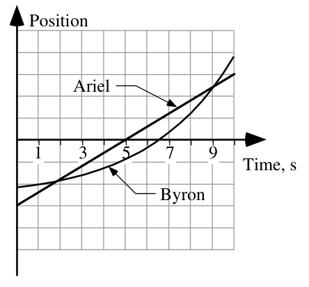

# AP Physics 🔭 <!---fit--->

# **2023-2024** Agendas

## 👨‍🏫 Mr. Porter

---

<!--- _class: halloween--->

# **Week 9** (10.30-11.03)

### 🎯 Week Goals

1. Wrap up kinematics:
    - Linear
    - Rotational
2. Check our understanding of kinematics

### 🚨 Notes & Upcoming...

- Test Friday 11/3 on Kinematics 
    - **Mandatory** review will be posted on AP Classroom (some questions will be skipped)

 

### 🏡 Homework 

1. AP Classroom Test Review (Posted in Canvas)

---

### 2023.10.30  **AP Physics** Do Now 

A weight is tied to a rope that is wrapped around a pulley. The pulley is initially rotating counterclockwise and is pulling the weight up. The tension in the rope creates a torque on the pulley that opposes this rotation. The weight slows down, stops momentarily, and then moves back downward. Assume uniform motion. 

1. **Graph of the angular velocity $(\omega)$ versus time for the period from the initial instant shown until the weight comes back down to the same height.** Take the initial angular velocity as positive.
2. **Graph the angular acceleration $(\alpha)$ versus time for the same time period.**

---

<!--- _class: halloween--->

# 2023.10.30 **AP Physics** 🕷️🕸️

##### **❓ of the 📅**:  What is the funniest/most unique thing you've gotten trick or treating?

1. Do Now 
2. Complete Card Sort 
3. Rotational Kinematics Practice
	1. [Using Angular Acceleration to Calculate Values](https://www.physicsclassroom.com/calcpad/launch/CPRK5)
	2. [Using the Big 4 to Solve Segmented Problems](https://www.physicsclassroom.com/calcpad/launch/CPRK6)
    3. [Using the Big 4 Eqns and Linear Relationships](https://www.physicsclassroom.com/calcpad/launch/CPRK8)

---

<!--- _class: halloween--->

# **Week 8** (10.24-10.27)

### 🎯 Week Goals

1. Identify and determine angular values
2. Use kinematics for angular values
3. Translate between angular and linear equivalents

### 🚨 Notes & Upcoming...

- Test Friday 11/3 on Kinematics 
    - **Mandatory** review will be posted on AP Classroom (some questions will be skipped)

 

### 🏡 Homework 

1. Quiz Thursday - Stacks of Graphs, Graph Calculations, Word Problems 
2. [Velocity Time Graph Challenges (if not finished)](https://www.physicsclassroom.com/calcpad/launch/CPK12)
3. Rotational Kinematics Practice
	1. [Using Angular Acceleration to Calculate Values](https://www.physicsclassroom.com/calcpad/launch/CPRK5)
	2. [Using the Big 4 to Solve Segmented Problems](https://www.physicsclassroom.com/calcpad/launch/CPRK7)

---

<!--- _class: halloween--->

### 2023.10.26  **AP Physics** Do Now 

1. ***Describe the the motion of the bicycle wheel reflector*** (the white thing below the feet of the person in the wheel) ***in terms of angular position $(\theta)$, angular velocity $(\omega)$, and angular acceleration $(\alpha)$***
2. ***Sketch the angular graphs of motion for the reflector.***

Note: $\theta = 0$ radians is the due right (+x-axis) and counterclockwise 🔄 is the positive direction

---

<!--- _class: halloween--->

# 2023.10.26 **AP Physics** 🍫

##### **❓ of the 📅**: What is the best fry shape? 🍟

1. Do Now 
2. Quiz 
3. Rotational Kinematics Card Sort
    - **$\theta = 0$ radians is the due right (+x-axis) and counterclockwise 🔄 is the positive direction**
4. Practice with Angular And Linear Values (semi-independent work):
    - [Determining Angular and Linear Values 1](https://www.physicsclassroom.com/calcpad/launch/CPRK1)
    - [Determining Angular and Linear Values 2](https://www.physicsclassroom.com/calcpad/launch/CPRK2)

---

<!--- _class: halloween--->

# 2023.10.25 **AP Do Now** 

The graph shows the angular velocity as a function of time  for a point on a rotating disk. What is the magnitude of the angular acceleration of the disk?

<!--- 1.5 rad/s--->

---

<!--- _class: halloween--->

# AP Do Now 

The figures below show hollow spheres (not drawn to scale) that are rolling at a constant rate without slipping. The spheres all have the same mass, but their radii as well as their linear and angular speeds vary.

**Rank the radius of the spheres from greatest to least**

Explain your reasoning.

<!--- B > C = D = F > A = E--->

---

<!--- _class: halloween--->

# 2023.10.25 **AP Physics** 🍫

##### **❓ of the 📅**: Hanging out by a campfire, bonfire, or fireplace?

1. Do Now
1. Finish Pivot
2. Reviewing the Pivot 
3. [Rotational Kinematics - Notes](../../../Presentations/APCAPM/talks/Rotational_Kinematics202324.html)
3. [Using the Big 4 to Solve Problems](https://www.physicsclassroom.com/calcpad/launch/CPRK7)

---

<!--- _class: halloween--->

## AP **Do Now**

An object revolves around a central axis of rotation. The motion of the object is described by the following equation.

$$\omega^2 = (10 \textrm{ rad/s})^2 - (4 \textrm{ rad/s}^2)\theta$$

Which two of the following graphs correctly shows the angular motion of the object? Select two answers.

A. 

B. 

C. 

D. 

<!--- B & C are correct --->

---

<!--- _class: halloween--->

# 2023.10.24 **AP Physics** 🎃

##### **❓ of the 📅**: If you were so wealthy you didn’t need to work, what would you do with your time?

1. Pivot - Intro to Rotating Objects & Measuring 
2. [Rotational Kinematics](../../../Presentations/APCAPM/talks/Rotational_Kinematics202324.html)
3. Determining Linear and Angular Values
    - [Practice 1](https://www.physicsclassroom.com/calcpad/launch/CPRK1)
    - [Practice 2](https://www.physicsclassroom.com/calcpad/launch/CPRK2)
    - [Using the Big 4 to Solve Problems](https://www.physicsclassroom.com/calcpad/launch/CPRK7)

---

<!--- _class: halloween--->

# **Week 7** (10.16-10.19)

### 🎯 Week Goals

1. Translate between multiple representations for changing velocity motion. 
2. Interpret and make calculations from Velocity vs. Time Graphs
3. Use Kinematic Equations & the Cross Diagram to make predictions about uniform motion

 

### 🏡 Homework 

1. [Velocity Time Graph Challenges](https://www.physicsclassroom.com/calcpad/launch/CPK12)
3. [Kinematic Equations 4](https://www.physicsclassroom.com/calcpad/launch/CPK16)

---

<!--- _class: halloween--->

## 2023.10.19 **AP Physics** 🎃 Do Now

The graph shown is for an object in one-dimensional motion. The vertical axis is not determined, so it is not labeled.

1. If the vertical axis is position, does the object ever change
direction? If so, at what time or times does this change in direction occur?
Explain your reasoning.
2. If the vertical axis is velocity, does the object ever change direction?
If so, at what time or times does this change in direction occur?
Explain your reasoning.

---

#### 2023.10.19 **AP Physics** 🎃 Do Now

At time $t=0$, a moving cart on a horizontal track is at position $0.5 \textrm{ m}$. Using a motion sensor, students generate a graph of the cart's velocity as a function of time, as show to the right. At $t=2.5 \textrm{ s}$, the cart's position is most nearly

1. $0.5 \textrm{ m}$
2. $1.25 \textrm{ m}$
3. $1.75 \textrm{ m}$
4. $2 \textrm{ m}$

<!---ANSWER IS C --->

---

<!--- _class: halloween--->

# 2023.10.19 **AP Physics** 🎃

##### **❓ of the 📅**: What is a dealbreaker for you on a first date?

1. Do Now 
2. Continued practice with Kinematic Equations
    - [Kinematic Equations 1](https://www.physicsclassroom.com/calcpad/launch/CPK13)
    - [Kinematic Equations 2](https://www.physicsclassroom.com/calcpad/launch/CPK14)
    - [Kinematic Equations 3](https://www.physicsclassroom.com/calcpad/launch/CPK15)
3. [Two stage motion & the cross diagram](../../../Presentations/APCAPM/talks/CAPM2023.html#55)
    - Whiteboard with lab groups, check on one person's computer:
        - [Kinematic Equations 5](https://www.physicsclassroom.com/calcpad/launch/CPK17)

---

<!--- _class: halloween--->

## 2023.10.18 **AP Physics** 👻 Do Now

The position-time graph shown represents the motion of two children, Ariel and Byron, who are moving along a narrow, straight hallway.

1. Do either of the children ever change ***direction***?
2. Are the two children ever at the same ***position*** along the hallway?
3. Do the two children ever have the same ***speed***?
4. Do the two children ever have the same ***acceleration***?

---

<!--- _class: halloween--->

# 2023.10.18 **AP Physics** 👻

##### **❓ of the 📅**: What is your favorite road trip snack?

1. [The Kinematic Equations](../../../Presentations/APCAPM/talks/CAPM2023.html#47)
3. The Cross Diagram tool
3. Solving Word Problems with Equations
    - [Kinematic Equations 1](https://www.physicsclassroom.com/calcpad/launch/CPK13)
    - [Kinematic Equations 2](https://www.physicsclassroom.com/calcpad/launch/CPK14)
    - [Kinematic Equations 3](https://www.physicsclassroom.com/calcpad/launch/CPK15)

### 🚨 AP Exam Check Due 10/19 ***THURSDAY***❗
- $90, checks made to Schodack Central Schools

---

<!--- _class: halloween--->

# 2023.10.17 **AP Physics** 👻

##### **❓ of the 📅**: What are two pet peeves you have?

1. Problem-Solving with VT Graphs 
2. [The Kinematic Equations](../../../Presentations/APCAPM/talks/CAPM2023.html#47)
3. The Cross Diagram tool

### 🚨 AP Exam Check Due 10/19 ***FRIDAY***❗
- $90, checks made to Schodack Central Schools

---

# **Week 6** (10.10-10.13)

### 🎯 Week Goals

1. Translate between multiple representations for changing velocity motion. 
2. Interpret and make calculations from Velocity vs. Time Graphs
3. Use Kinematic Equations & the Cross Diagam to make predictions about uniform motion

 

### 🏡 Homework 

1. [Velocity Time Graphs 1](https://www.physicsclassroom.com/calcpad/launch/CPK10)
2. [Velocity Time Graphs 2](https://www.physicsclassroom.com/calcpad/launch/CPK11)
3. [Kinematic Equations 1](https://www.physicsclassroom.com/calcpad/launch/CPK13)
4. **Quiz Friday**: Stacks of Graphs, VT Graph Calculations, Word Problems(?)

---

# 2023.10.13 **AP Physics**

##### **❓ of the 📅**: Do you believe Friday the 13th is a bad luck day?

1. Quiz
2. [Problem-Solving with VT Graphs](../../../Presentations/APCAPM/talks/CAPM2023.html#32)
    - Arrange desks into a rectangle/square, 3 desks per side

### 🚨 AP Exam Check Due 10/19❗
- $90, checks made to Schodack Central Schools

---

# 2023.10.12 **AP Physics** Do Now

## Recall Practice...

1. What is the difference between **distance** and **displacement**?
2. What is **average speed** vs. **average velocity**?
3. What is the slope of a **position vs. time** graph represent?
4. What is the slope of a **velocity vs. time** graph represent?
5. What is *area under the curve* of a **velocity vs. time** graph represent?

---

# 2023.10.12 **AP Physics**

##### **❓ of the 📅**: What's your favorite family recipe?

1. Stacks of Graphs - Whiteboard and Review
2. [VT Graphs](../../../Presentations/APCAPM/talks/CAPM2023.html#32)
3. Solving word problems with VT Graphs 

---

<!--- _footer: . --->

### 2023.10.11 **AP PHYSICS** Do Now

1. For which of these cases, if any, is the position zero at the indicated point? 
2. For which of these cases, if any, is the position negative at the indicated point?
3. For which of these cases, if any, is the velocity zero at the indicated point?
4. For chich of these cases, if any, is the velocity negative at the indicated point?
5. For which of these cases, if any, is the acceleration zero at the indicated point?
6. For which of these cases, if any, is the acceleration negative at the indicated point?

---

# 2023.10.11 - **AP Physics**

##### **❓ of the 📅**: If one superhero was real, which one should it be? 🦸 🦸‍♀️

1. Do Now 
2. Week Goals 
3. Graphs Card Sort 2 & Stacks of Graphs Practice 
3. [Graphs Review & Summary](../../../Presentations/APCAPM/talks/CAPM2023.html#21)
4. VT Graphs 

---

# **Week 5** (10.02-10.06)

### 🎯 Week Goals

1. Identify patterns in changing velocity motion. 
2. Define Changing Velocity
3. Translate between multiple representations for changing velocity motion. 
4. Interpret and make calculations from Velocity vs. Time Graphs

 

### 🏡 Homework 

1. Finish Lab in Pivot
1. TBD - Need to see how long the lab takes

---

# 2023.10.06 - **AP Physics**

##### **❓ of the 📅**: What is the number one feature you would want in your dream house?

1. Finish Carts and Ramps
    1. Check with smart carts (check acceleration graphs)
    2. Whiteboard assigned motion
    3. Complete summary chart 
2. Card Sort #2 
3. [Notes](../../../Presentations/APCAPM/talks/CAPM2023.html#21) and Summaries of Constant Acceleration
4. Stacks of graphs practice (in handout)

---

# 2023.10.05 - **AP Physics**

##### **❓ of the 📅**: What household chore do you actually enjoy?

1. [Linearizing](../../../Presentations/APCAPM/talks/CAPM2023.html#15) and finding the position time relationship for constant acceleration
2. Lab Summary
3. Carts and Ramps
    1. Card Sort
    2. Smart Carts to check card sort

---

# 2023.10.04 - **AP Physics**

##### **❓ of the 📅**: What secrets do you think your pet would spill about you, if they could talk?

1. Finish Collecting/Graphing data from Fan Cart Lab
2. Whiteboard Results
3. Board Meeting
4. [Additional Analysis of Fan Cart Data](../../../Presentations/APCAPM/talks/CAPM2023.html)

---

# 2023.10.02 - **AP Physics**

##### **❓ of the 📅**: What celebrity would you like to meet for a cup of coffee?

0. New Lab Groups - Sort yourselves with the cards
1. [Changing Speed Lab](../../../Presentations/APCAPM/talks/CAPM2023.html)
    i. Lab Intro 
    ii. New Lab Tools - Choose One 
    iii. Collect Data and Whiteboard 
    iv. Board Meeting
2. Making VT Graphs
3. Linearizing

---

<!--- _footer: . --->

# Week 4 (09.26-09.29)

### 🎯 Week Goals

1. Use and interpret multiple representations for motion: Graphical, mathematical, pictorial
2. Calculate *speed*, *velocity*, *average* *speed*, *average* *velocity*, and *instantaneous* *velocity* 
3. Create and interpret velocity vs. time graphs 
4. Use constant velocity equations ($x = \bar{v}t + x_0$ and $\bar{v}=\frac{\Delta x}{\Delta t}$) to solve problems

 

### 🏡 Homework 

1. Quiz Friday
    - Graphs, average vs. instantaneous, using CV Equation
2. [Position-Time Graphs 2](https://www.physicsclassroom.com/calcpad/launch/CPK9)
3. Applying the CV Model (PDF)

---

### 2023.09.29 **AP Physics** Do Now

The position time graph below represents the motion of a car driven by a high schooler driving in a perfectly straight
driveway.

1. Draw a motion map for the driver. 
2. Provide a written description of the motion
3. Determine the driver's **displacement** over the 8 seconds. 
4. Determine the driver's **average velocity**
5. Determine the driver's **average speed**

---

# 2023.09.29 - **AP Physics**

##### **❓of the 📅**: You can have an unlimited supply of one thing for the rest of your life, what is it? Sushi? Scotch Tape? You can't pick money...

1. Do Now 
2. Quiz 
2. Working with VT Graphs - [Summary](../../../Presentations/APCVPM/talks/CVPM2023.html#43)
3. [Changing Speed Lab](../../../Presentations/APCAPM/talks/CAPM2023.html)

### 🚨 AP Exam Check Due 10/19❗
- $90, checks made to Schodack Central Schools

---

# 2023.09.28 - **AP Physics**

##### **❓of the 📅**: Would you rather be a dragon or own a dragon? 🐉

1. [Using CV Equation](../../../Presentations/APCVPM/talks/CVPM2023.html#38)
2. Working with VT Graphs 
3. [Changing Speed Lab](../../../Presentations/APCAPM/talks/CAPM2023.html)

### 🚨 AP Exam Check Due 10/19❗
- $90, checks made to Schodack Central Schools

---

# 2023.09.26 - **AP Physics**

##### **❓of the 📅**: *Would you rather travel 100 years forward or back in time*?

1. [Interpreting Position vs. time graphs](../../../Presentations/APCVPM/talks/CVPM2023.html#32)
2. Using CV Equation 
3. Working with Velocity vs. Time Graphs

---

# Week 3

## 🎯 Week Goals

1. Define Motion Quantities: *speed*, *velocity*, *distance*, *displacement*, *position*, *average*, *instantaneous*
2. Use and interpret multiple representations for motion:
    - Graphical, mathematical, pictorial
3. Calculate *speed*, *velocity*, *average* *speed*, *average* *velocity*, and *instantaneous* *velocity*

 

## 🏡 Homework 

1. Quiz Friday 
2. Physics Classroom Calc Pad Practice
    i. [Distance vs. Displacement](https://www.physicsclassroom.com/calcpad/launch/CPK1)
    ii. [Distance Speed Time: Red Car vs. Green Car](https://www.physicsclassroom.com/calcpad/launch/CPK5)
    iii. [Position-Time Graphs 2](https://www.physicsclassroom.com/calcpad/launch/CPK9)

---

# 2023.09.22 - **AP Physics**

##### **❓of the 📅**: What is the best thing that you have gifted?

1. Do Now - Finish Motion Sensor Lab (including velocity graphs)
3. Quiz 
4. [Interpreting Position vs. time graphs](../../../Presentations/APCVPM/talks/CVPM2023.html#32)
5. [Physics Classroom: Position-Time Graphs 2](https://www.physicsclassroom.com/calcpad/launch/CPK9) 

### 🚨 AP Exam Check Due 10/19❗
- $90, checks made to Schodack Central Schools

---

# 2023.09.20 - **AP Physics** Do Now

## In your notebook...

### 1. Describe a motion where **distance**, **displacement**, and **final position** are all ***the same***.
### 2. Describe a motion where **distance**, **displacement**, and **final position** are all ***different***.
### 3. Sketch a position vs. time graph for each of the examples. 

### When completed, Google "Graphical Analysis" and download the chrome extension (or version for your computer)

---

# 2023.09.20 - **AP Physics**

##### **❓of the 📅**: Which animal would be the scariest super-sized?

0. Do Now 
1. [Motion Maps](../../../Presentations/APCVPM/talks/CVPM2023.html#21)
2. Interpreting Position vs. Time Graphs 
3. Motion Sensor Activity

#### HW:

- Week Assignment - Skip XT Graphs, Car Comparison - you may need help
- Quiz Friday - Multiple Representations (i.e. given a xt graphs, motion maps, narrative descriptions)

---

# 2023.09.19 - **AP Physics**

##### **❓of the 📅**: Which of the five senses would you say is your strongest?

0. [Week Goals](#week-3)
2. Notes 
3. [CER & CV](../../../Presentations/APCVPM/talks/CVPM2023.html)
4. Pictorial Representations - Motion Maps 
5. Using CV Equation 

---

# 2023.09.18 - **AP Physics**

##### **❓of the 📅**:  Does your family have a “motto” – spoken or unspoken?

0. [Week Goals](#week-3)
1. Review Buggy Lab - What did you do? How did you do it? What did you find?
2. Buggy Lab Board Meeting 
3. [Motion Definitions](../../../Presentations/APCVPM/talks/CVPM2023.html) from the Buggy Lab 
4. CER & Does it move with CV?

#### HW: 
- Week 3 in Canvas -- will mostly likely need tomorrow's class to complete some of this

---

# Buggy Lab 

## **How did you do your lab? What did you find?**

### Questions to consider:

1. Does your buggy move "in a ***consistent*** manner"?
2. What does your slope represent?
    - What does a steeper slope mean?
    - What does a negative slope mean?
3. What does your vertical intercept represent?
4. Do your lines intersect? What does that tell you?
5. How could you use your results to predict the motion of your toy car? 

---

# 2023.09.14 **AP Physics** Agenda

##### **❓of the 📅**: If you had a pet parrot 🦜, what would you want it to say?

1. Finish Buggy Lab 
3. Whiteboard Results and Board Meeting 
4. [Motion Definitions](../../../Presentations/APCVPM/talks/CVPM2023.html) from the Buggy Lab 

---

# 2023.09.13 **AP Physics** Do Now

## Answer in your notebook, on your own, to the best of your memory...

1. What is the 8 by 10 rule?
2. How can you tell if a y-intercept has physical significance?
3. What is one way to limit experimental uncertainty when designing an experiment?

---

# 2023.09.13 **AP Physics** Agenda

##### **❓of the 📅**: Is cake better than ice cream?

1. Do Now 
2. Linear Modeling and writing Physics equations
3. Buggy Lab

---

# Linear Model

### Equation from Math Class:

$$ y = mx + b$$ 

or 

$$ y = 12x + 4$$ 

---

# The Physics Models...

* Math: $y = mx + b$

* Specific Model: $strength = (7.5\textrm{rocks/strand})strands - 12 \textrm{ rocks}$

* Generic Model: $marbles = (strength \textrm{ } ratio) strands - cup mass$ 

* Specific Model: $bounce = (0.4 \textrm{cm/cm})drop + 4 \textrm{ cm}$ 

* Generic Model: $b_h = r  d_h + d_{ball}$

---

# Buggy Lab 🚗 <!--fit--->

---

# Buggy Lab 🚗

Create a descriptive (both verbal and mathematical) model of the motion of toy cars.
    
-  How is **position** related to **time** for your toy car?
-  Remember to use starting positions on card situations
-  Take data for one car at a time
-  **Time** is your independent variable
-  Graph the motion of both cars on the SAME graph (you can add another data set to the vertical axis that goes with the

---

# 2023.09.12 **AP Physics** Agenda

##### **❓of the 📅**: What smells bring you back to a different time? 👃 🌲

## 📋 Agenda

1. Whiteboard Ball Bounce Results 
2. Ball Bounce Board Meeting 
3. Buggy Lab - Creating a model to describe & predict motion

## Week 🎯: 

🥅 Describe motion mathematically, graphically, and narratively.

🥅 Create mathematical models from data. 

---

# Linear Modeling

### Ball Bounce Lab

- What does the slope represent?
  - For every statement: "The &lt; **quantity on vertical axis** &gt; goes up &lt; **slope value with vertical units** &gt; for every 1 &lt; **horizontal unit** &gt; of &lt; **quantity on horizontal axis** &gt;."
- What does the intercept mean?

---

# 🚗 Buggy Lab <!--fit-->

---

# 2023.09.09 **Do Now**

1. Join AP Classroom
    - 🔗: [https://myap.collegeboard.org/](https://myap.collegeboard.org/)
    - 🔑: **2RN34Y**
2. Join Pivot Interactives Class
    - Join through Canvas by opening *Ball Bounce Lab* (Modules ➡️ Kinematics ➡️ Ball Bounce Lab)

---

# 2023.09.08 **AP Physics** Agenda

##### **❓of the 📅**: What is your most used emoji? 🤔

## 📋 Agenda

1. Do Now
2. Ball Bounce Lab - Prelab Questions on Pivot 
2. Ball Bounce Lab - Collect Data 
3. Ball Bounce Lab - Board Meeting 
4. Ball Bounce Lab - Using your Model 

## Week 🎯: 

🥅 Create a physics learning community 

🥅 Start thinking like a scientist 

---

# Ball Bounce Lab - Prelab Questions 

1. What is the problem? Describe the problem or goal of your lab in your own words. Be sure that your description includes known factors (information about the problem given to you in the lab in a problem statement, for example) and unknowns (what you need to find out to solve the problem). Then restate the problem in the form of a question or questions that will guide your research.

---

# Ball Bounce Lab - Prelab Questions 

2. What do you know about the science of the problem that could help you answer your research question? 

---

# Ball Bounce Lab - Prelab Questions 

3. What is your hypothesis for the answer to your research question?

--- 

# Ball Bounce Lab - Prelab Questions 

4. What variables can you use to test your hypothesis? (Independent, dependent, control)

---

# Ball Bounce Lab - Prelab Questions 

5. What experiment(s) could you use to test your hypothesis? Referring to the list of variables, brainstorm some experiments you could do that would allow you to manipulate variables so that you can make the measurements or observations necessary for testing the hypothesis. Briefly list the materials and outline the methods you will use for your experiment.

---

# Ball Bounce Lab 

1. Carry out your experiment 
2. Answer Post Lab Questions 
3. On your whiteboard board communicate your results 

---

# Ball Bounce Lab - Post Lab, Models 

## What can you do with your results? 

## Do you results model a ball bounce?

## Can you use your results to make a **prediction**? If so, use your model to make a prediction with a value *outside* of your data set. 

---

# 2023.09.07 - 1st Day

##### **❓of the 📅**: Sweet or Savory for Breakfast

## 📋 Agenda

1. Question of the day
2. Lab Grouping
3. Survival Island 
4. Ball Bounce Lab

## Week 🎯: 

🥅 Create a physics learning community 

🥅 Start thinking like a scientist 

---

## **❓Quesion of the day 📅** <!--fit--->

## Sweet of savory for breakfast? <!--fit-->

--- 

# Lab Grouping:

## Arrange yourselves into **logical** lab groups based on the word on your index card.

### Rules:

1. Groups are based on index card
2. There are **6** total groups
3. No groups are larger than **4** members

---

# **Why?**   What connection does   this  grouping "game"   have to physics class? <!---fit--->

---

* You may feel frustrated as you try to figure physics out. That’s okay. 
* Physics is hard to understand until you know the “rules of the game.”
* But, once you discover the rules, physics often seems easy and you may be surprised that others don’t understand.
* However, remember that you didn’t always understand.
* When you discover the rules and understand without someone just telling you the “answer”, you are excited.
* The journey to understanding is very important. So, no one is going to tell you the answer, but we’re all here to support each other on our journeys.
* Being told the “answer” at most gives you one answer that you didn’t know. Learning to think critically and arrive at the answer with support develops a skill that you will use to find many answers.

---

# A Few Questions... 🤔
### Answer on your index card 

1. What do you like to be called?	
2. The class is stranded on a deserted island. What special skill(s) can you bring to this dire situation?	
3. What is unique about you that leads to your happiest times and best performances at school?	
4. What is unique about you that allows you to work well in groups for the success of the group as a whole?	
5. What has a teacher done for you in the past which has allowed you to learn?
6. Write a motivation message to yourself about this school year

---

# Survival Island 🏝️

You and your group are stranded on an deserted island 😮!

Using *each* of your **unique skill's** develop a plan to escape the island.

Whiteboard your response (one person)

Be prepared to share out your plan to escape the island as a group. Each of you should offer a part of the plan to the class.

---

# Ball Bounce Lab ⛹️‍♂️ <!--fit-->

---

# Observations 🔍 <!--fit--->

---

# What questions can we ask? 🤔 <!--fit-->

---

# Design and Carry out an Experiment 🥼

1. What question are you asking?
2. What is your hypothesis?
3. Design an experiment & collect data to support or refute your hypothesis
4. Whiteboard your results when you finish

---

# Pivot Interactives 

- Join class in Canvas 
- Only one person from group needs to submit *this* assignment. (Note: not all labs will be this way -- today's focus is working in a group). 

---

# Week 2

---

# Week 1

## 🎯 Week Goals

1. 

 

## 🏡 Homework 

1. 

## 🔗 Links

 

---

<!-- # Week 1

## 🎯 Week Goals

1. 

 

## 🏡 Homework 

1. 

## 🔗 Links

 

---

<!--- _header: DATE--- >

# TITLE

##### **❓of the 📅**: The Question of the Day?

## 📋 Agenda

0. [Do Now](../Do%20Nows/APDoNow202324.html#SLIDENUMBER)
1. 

## Week 🎯: 

 -->

|Week | Topics | Dates |
|---|---|---| 
|[Week 1](#week-1)| Kinematics | 09/07 - 09/08 | 
|[Week 2](#week-2)|Kinematics| 09/11 - 09/15  | 

---

# Week 1

## 🎯 Week Goals

1. 

 

## 🏡 Homework 

1. 

## 🔗 Links

 

