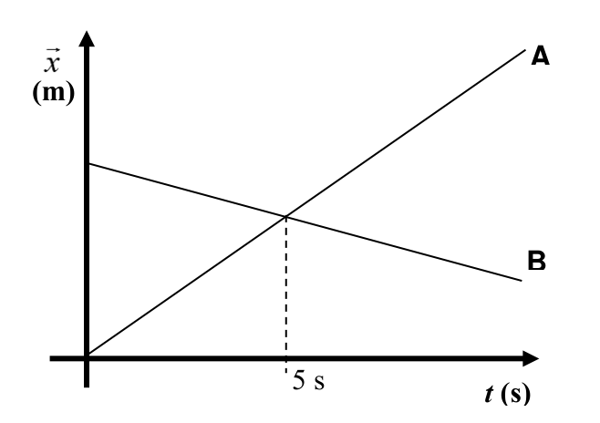
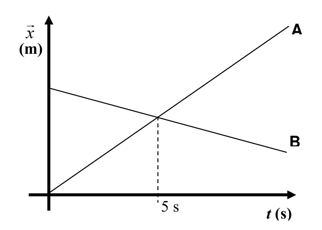

# Conceptual Physics 🔭 <!---fit--->

# **2023-2024** Agendas

## 👨‍🏫 Mr. Porter

---

# 2023.10.05 **Conceptual Physics**

##### **❓of the 📅**: What is a chore you secretly enjoy?

1. Anything but a bag analysis
    - Is the velocity constant? (Is the position vs. time graph linear?)
    - What is the average velocity? ($v = \frac{d}{t}$)
2. Rolling Ball Challenge 3: Collisions 
    - Make sure you are measuring the correct side of the ball
    - Practice for in person lab with the toy cars 

---

# 2023.10.03 **Conceptual Physics**

##### **❓of the 📅**: If you had a warning label, what would yours say?

1. Finish Walk the graph
    1. Walk the Graph Match Challenge 
2. Rolling Ball Challenge 2 or Position vs. Time Graphs assignments
3. Rolling Ball Challenge 3 (the last Rolling Ball Challenge)

---

# 2023.09.29  **Conceptual Physics**

##### **❓of the 📅**: You can have an unlimited supply of one thing for the rest of your life, what is it? Sushi? Scotch Tape? You can't pick money...

1. Describing Motion
2. Motion Sensor Lab

---

# Describing Motion 

1. Where does the object start?
2. What direction is it moving in?
3. How fast is it moving?

---

# Describing Motion

---

# Describing Motion

#### Written description of bicyclist A:
Bicyclist A begins at a position of zero, and moves at a constant, fairly high speed (compared to cyclist B) in the positive direction for about 10 seconds, ending at a fairly far in the positive direction from zero.

---

# Describing Motion

#### Written description of bicyclist B:
Bicyclist B begins at a position in the positive direction from zero, and moves at a constant, fairly low speed
(compared to cyclist A) in the negative direction for about 10 seconds, ending closer to zero than its starting
position.

---

# Describing Motion 

Each description should include:
- Starting position
- Direction of motion (positive direction, no motion, or negative direction)
- Type of motion (at rest, constant velocity, speeding up, slowing down or some combination of these)
- Relative speed (slow, medium, fast, slower, faster—this is only meaningful with there is more than
one part of the motion or when you are comparing two or more objects)

---

# Lets Practice

### Describe the motion of each graph

---

# Lets Practice

### Describe the motion of each graph

---

# Lets Practice

### Describe the motion of each graph

---

# Lets Practice

### Describe the motion of each graph

---

# Lets Practice

### Describe the motion of each graph

---

# Lets Practice

### Describe the motion of each graph

---

# Motion Maps

---

# Motion Maps 

 

---

# Motion Maps 

- Each dot represents **one unit of time**
- The numberline is the **position** of the object
- The separation of the dots and length of the arrow represents the **velocity** of the object 
- Stacked dots represent an object that is motionless

---

# Motion Map Practice 

---

# Motion Map Practice 

---

# Motion Map Practice 

---

# Motion Map Practice 

---

# Motion Map Practice 

---

# Motion Sensor Lab

- Which way does the sensor treat as positive? Negative?
- Where is position = 0?
- How do we describe the motion?

---

# 2023.09.27  **Conceptual Physics**

##### **❓of the 📅**: Would you rather be a dragon or own a dragon? 🐉

1. Pivot - Practicing with Position vs. Time Graphs 
2. Rolling Ball Challenge 2: Ball Rolling Left

---

# 2023.09.21 - **Conceptual Physics**

##### **❓of the 📅**: If animals could talk, which one do you think would be the most annoying?

1. Using Pivot's Video Tools
    - Stopwatch
    - Ruler 
    - Frame by frame controls
1. Rolling Ball Challenge 1
1. Rolling Ball Challenge 2

---

# 2023.09.19 - **Conceptual Physics**

##### **❓of the 📅**: Which of the five senses would you say is your strongest?

1. Finish collecting buggy lab data
2. Answer questions, but **DO NOT** turn in yet...
3. Whiteboard your results (graphs and equations)
4. Board Meeting
    - What does the slope tell us?
    - What does the vertical intercept tell us?
5. Rolling Ball Challenge 1

---

# 2023.09.15 - **Conceptual Physics**

##### **❓of the 📅**:  Who or where would you haunt if you had to be a ghost 👻?

1. Buggy Lab Part I - *Does it move in a consistent manner*?
    i. Finish Collecting Data
    ii. Whiteboard results - make a CER statement along with your evidence
2. Buggy Lab Part II - Comparing the motion of two toy cars 

---

# Claim - Evidence - Reasoning 

* ***Claim***:
    * Sentence that answers the question.

* ***Evidence***:
    * Explanation of how the evidence supports the claim.
        * Should include details!
        * Refer back to the question, include any data, diagrams, or graphs.

* Reasoning:
    * Physics principle, such as an equation, law, or definition.
        * This is general, do no include specific details.

---

# 2023.09.13 **Conceptual Physics** Agenda

##### **❓of the 📅**: Is cake 🍰 better than ice cream 🍨?

1. Whiteboard Pasta Bridge Lab:
    - Graph
    - Equation
2. Board Meeting
    - What does the slope tells us? The intercept?
3. Buggy Lab:

---

# Pasta Bridge Lab

- What does the slope represent?
  - For every statement: "The &lt; **quantity on vertical axis** &gt; goes up &lt; **slope value with vertical units** &gt; for every 1 &lt; **horizontal unit** &gt; of &lt; **quantity on horizontal axis** &gt;."
- What does the intercept mean?
    - Y-intercept: the vertical value when the horizontal value is zero. 

---

# 🚗 Buggy Lab  <!--fit--->

---

# 🚗 Buggy Lab

## **Essential Question**: Does your toy car move in a consistent manner?

- What evidence do you need to collect? 

---

# 2023.09.11 - **Conceptual Physics**

##### **❓of the 📅**: If you found that food was falling from the sky, what food would you want to be falling? What food would you NOT want to be falling?

## 📋 Agenda

1. Open Pasta Lab from Canvas
    - Sign up for Pivot with School Google Account
2. Pasta Bridge Lab Introduction
3. Pasta Bridge Lab - Collect Data 
4. Pasta Bridge Lab - Whiteboard Results 
5. Pasta Bridge Lab - Board Meeting 

---

# 2023.09.07 - 1st Day

##### **❓of the 📅**: Sweet of savory for breakfast?

## 📋 Agenda

1. Question of the day
2. Lab Grouping
3. Survival Island
4. Ball Bounce Lab

---

## **❓Quesion of the day 📅** <!--fit--->

## Sweet of savory for breakfast? <!--fit-->

--- 

# Lab Grouping:

## Arrange yourselves into **logical** lab groups based on the word on your index card.

### Rules:

1. Groups are based on index card
2. There are **3** total groups
3. No groups are larger than **3** members

---

# **Why?**   What connection does   this  grouping "game"   have to physics class? <!---fit--->

---

# A Few Questions... 🤔
### Answer on your index card 

1. What do you like to be called? What Emoji describes you?	
2. The class is stranded on a deserted island. What special skill(s) can you bring to this dire situation?	
3. What is unique about you that leads to your happiest times and best performances at school?	
4. What is unique about you that allows you to work well in groups for the success of the group as a whole?	
5. What has a teacher done for you in the past which has allowed you to learn?
6. Write a motivation message to yourself about this school year

---

# Survival Island 🏝️

You and your group are stranded on an deserted island 😮!

Using *each* of your **unique skill's** develop a plan to escape the island.

Whiteboard your response (one person)

Be prepared to share out your plan to escape the island as a group. Each of you should offer a part of the plan to the class.

---

# Ball Bounce Lab ⛹️‍♂️ <!--fit-->

# Observations 🔍 <!--fit--->

---

# What can we measure? 📏 <!--fit-->

---

# What questions can we ask? 🤔 <!--fit-->

---

# Design and Carry out an Experiment 🥼

1. What question are you asking?
2. What is your hypothesis?
3. Design an experiment & collect data to support or refute your hypothesis
4. Whiteboard your results when you finish

