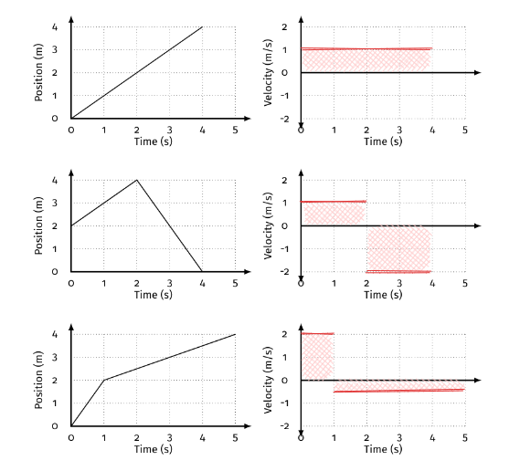
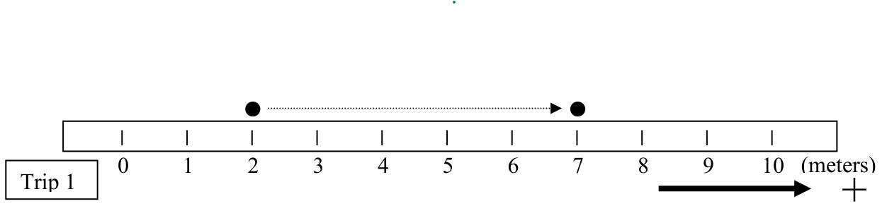
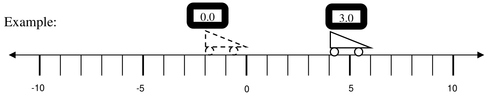
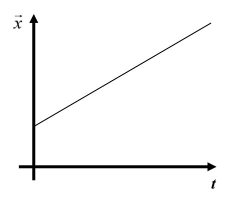
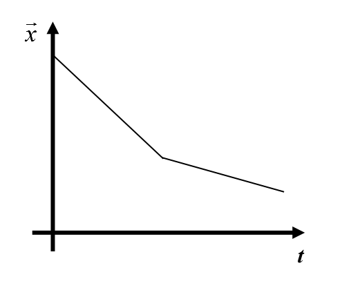

# Conceptual Physics 🔭 <!---fit--->

# **2023-2024** Agendas

## 👨‍🏫 Mr. Porter

---

# 2024.02.09 **Conceptual Physics**

##### **❓ of the 📅**: Have you ever fallen for a scam? If so, what was it?

1. Start building paper cars 
    - you will have to **share** the hot glue gun
    - you may also use scotch tape 

**🚗 Car Supplies 📰**:

- 2 pieces of copy paper
- 1 straw to use for car axles
- 2 axles & 4 wheels
- scotch tape & hot glue

---

# 2024.02.05 **Conceptual Physics** 

##### **❓ of the 📅**: Have you ever fallen for a scam? If so, what was it?

1. Paper Car Crash 
2. Research Good designs for paper car crash 
    - Find 3 things that protect people in car crashes to present to the class
    - Brainstorm ways you can add these protection pieces to your paper car
3. Sketch Your Paper Car design

---

## Paper Car Crash - Introduction

<iframe src="https://player.vimeo.com/video/265777735?h=ca54f8d676&title=0&byline=0&portrait=0" width="640" height="360" frameborder="0" allow="autoplay; fullscreen; picture-in-picture" allowfullscreen></iframe>

<a href="https://vimeo.com/265777735">Paper Car Crash - Introduction</a> from <a href="https://vimeo.com/iihs">IIHS</a> on <a href="https://vimeo.com">Vimeo</a>.

---

# 🎯 Most Crashworthy Car 

*Crashworthiness*: how well a car protects its occupants in a crash

Your task is to make the most crashworthy paper car. It will be protecting an egg. 

---

# Crashworthiness 

How can we measure the most crashworthy car? 

- ***Momentum*** can be conisdered a measure of how difficult it is to stop an object in motion

Momentum $p=mv$ (mass times velocity)

---

# 2024.01.26 **Conceptual Physics** 

##### **❓ of the 📅**: What skill or talent do you most want to learn?

1. Complete conservation of momentum Pivot
2. Up Next: Building Paper Cars

---

# 2024.01.26 **Conceptual Physics** 

##### **❓ of the 📅**: What fictional world or place would you like to visit?

1. Introduction to Momentum 
2. Introduction to Conservation of Momentum with Collision 

---

# What is momentum? <!--fit--->

---

# Momentum 

_The quantity of motion_ 

$$p = mv$$

* $p$ = momentum
* $m$ = mass 
* $v$ = velocity 

---

# 2024.01.18 **Conceptual Physics** 

##### **❓ of the 📅**: What did you want to be when you were in elementary school? Do you still want to be that?

1. Hands on Gravity Lab

---

# Lab 

### What is the difference between the two masses and what happens with the spring?

### Why does this happen?

---

# Force of Gravity on Earth Lab 

## Essential Question:

- How is the mass of an object related to its gravitational force?

## Procedures:

- Collect things to hang from the spring scale. 
- Mass them with the electronic balance up front (**independent variable**)
- Hang them from the spring scale and measure force of gravity (**dependent variable**)
- Record the mass and Force of Gravity (spring scale reading) in your data table

---

# 2024.01.11 **Conceptual Physics** 

##### **❓ of the 📅**: Should pizza slices be triangles or squares?

1. Pivot -  _How Strong is Earth's Gravitational Field?_
2. Past due work

#### Next week:

- Hands on labs on spring force and friction force 

---

# 2024.01.09 **Conceptual Physics** 

##### **❓ of the 📅**: What is your favorite fast food chain?

1. Finish Modeling Gravitational Forces Lab
2. Finish Old/Past Work
3. How Strong is Earth's Gravitational Field?

---

# 2024.01.03 **Conceptual Physics** 

##### **❓ of the 📅**: Who makes the best pizza 🍕?

1. Introduction to Forces  
    - Pivot: ***Balanced and Unbalanced Forces: Effect on motion***

---

<!--- _class: winter--->

# 2023.12.18 **Conceptual Physics** ⛄

##### **❓of the 📅**: Did you finish you holiday shopping yet?1

0. If not complete: Finish Sticky Tape Lab
1. Ohm's Law Simulation Pivot
    - Next calss we will be building circuits 

🚨 Notes and Announcements

- Almost everyone needs to finish _Ping Pong Launcher_ assignment
- Friday (if you have your pivots completed) we will be making Light up Christmas Cards - finish your work so you can participate. 

---

<!--- _class: winter--->

# 2023.12.12 **Conceptual Physics** ⛄

##### **❓of the 📅**: What is your song of the year?

1. Van de Graaff - experiments
2. Sticky Tape Pivot 
3. Revisit and explain Van de Graaff generator mini experiments

---

<!--- _class: winter--->

# 2023.12.06 **Conceptual Physics** ⛄

##### **❓of the 📅**: If you could be immortal, what age would you choose to stop aging at and why?

1. Beats by...Pendulum Project
    1. Design and build a swinging light prototype that can be modified to match any tempo. 
2. Experiments you ***MUST*** test:
    1. mass vs. swing time
    2. length vs. swing time
    3. starting angle vs. swing time
3. You need data for <u>***all 3***</u> of those experiments in pivot 

---

<!--- _class: winter--->

# 2023.12.04 **Conceptual Physics** ⛄

##### **❓of the 📅**: Whats the best holiday song?

1. Introduction to *Beats by...* lab
2. What is a pendulum 
3. Lab groups and data collection 

---

# Beats By ...

You have decided to make some money by starting a new business, Beats by (your name). A famous pop supergroup has approached you to devise a simple design solution that allows the stage lights behind them to swing in time with their music.

---

# Beats By ....

## Your Task:

### Design and build a swinging light prototype that can be modified to match any tempo. 

---

# Requirements

Before your clients are willing to give you their business, you must prove that you can build a pendulum to swing to the beat of two songs. 
- Your group can choose the first song, and once you are successful, get your pendulum signed off by your teacher.  
- Before the deal is finalized, you will need to prove your expertise by designing a product to match a song chosen by your client. Once the challenge song is revealed, you will only have 5 minutes and one attempt to set up your configuration.

---

# What do you still need? 

### Your clients are very busy and need all questions delivered at once. Read through your task again and record everything you know from the description. As you complete your list, record any questions you still have in the Need to Know box.

---

## **Constraints**:
### Make a list of the properties that your design MUST have

## **Criteria**: 
### Make a list of the properties that would be NICE to have

## **Problem Statement**
### We as (our role) seek to (our task) to (reasons for design) for (our stakeholders)

---

## Design Exploration - Brainstorming 🧠
Before you dive into the materials and start building, it’s essential to take a step back and develop a game plan.

| Brainstorm     | Rules   |
|---|---|
|Go for numbers as many ideas as possible|Don’t judge; be positive and encouraging|
|Be visual; sketches help|Build on the ideas of others|
|Headline your idea, then quickly move on|Stay on Topic|
|One voice at a time. Everyone Shares|Encourage wild ideas|
|Think independently  for the first 5 minutes… |  then compare ideas to create your group list |

---

# Experimental Design

## What will you Change? (Independent)
What things can you change in your design that might change how fast your system swings back and forth? Do all of these factors affect the swinging tempo? 

## What will you Measure? (Dependent)
Consider the challenge and what you can measure about different pendulum designs to test if it satisfies the task criteria.

---

## What should the design look like?
Will your client be happy to implement this product for their next concert? Sketch drawings to present your ideas.

---

## Building, Testing, and Modeling Your Design 

### Measuring Tempo
- Song tempo is typically measured in beats per minute (bpm)
- Measure the bpm of your song using the website http://www.all8.com/tools/bpm.htm or http://a.bestmetronome.com/ 
### Timing your system
- Your client desires a system that swings from one side to the other for each beat in the song
- You will have to develop a procedure to count the number of "beats" per minute

---

## Building, Testing, and Modeling Your Design 

### Model your system
Your client requires that you have a complete understanding of your design and know how to adjust parameters to match their mystery song. Think about how you might utilize different trials and graphing to help you interpret your findings.

---

# Build & Collect <!--fit--->

# 🚧 🏗️ 🥼 📏 <!--fit--->

---
<!--- _class: winter--->

# 2023.11.21 **Conceptual Physics** ⛄

##### **❓of the 📅**: What was the best dessert you had over Thanksgiving?

1. VT Graphs & Acceleration 
2. Pivot - Motion Graphs: Constant Acceleration 1
3. Pivot - Motion Graphs: Constant Acceleration 2

---

# Average Velocity

We can calulate in two ways:

* $v_{average} = \bar{v} = \frac{x_f-x_i}{t_f-t_i}=\frac{\Delta x}{\Delta t}$

* $v_{average} = \bar{v} = \frac{v_f + v_i}{2}$

---

# Velocity Graphs 

---

# Acceleration = Slope

$$a = \frac{v_f-v_i}{t_f-t_i}$$

---

# Cheat Sheet:
### Equations:

$$v_{average} = \bar{v} = \frac{x_f-x_i}{t_f-t_i}=\frac{\Delta x}{\Delta t}$$

$$v_{average} = \bar{v} = \frac{v_f + v_i}{2}$$

$$a = \frac{v_f-v_i}{t_f-t_i}$$

 
$$\textrm{Rectangle: } area = base * height$$

$$\textrm{Triangle: }area = \frac{1}{2}base*height$$

---

<!--- _class: thanksgiving--->

# 2023.11.21 **Conceptual Physics** 🦃

##### **❓of the 📅**: What is the best Thanksgiving dish?

1. The Universe and More - Motion Mapper Game
    1. Control Mode
        - Complete each level & whiteboard assigned level
    2. Input Mode
        - Complete each level & whiteboard assigned level

---

# Motion Mapper - Control Mode

- What hints/tips do you have?
- What were some challenges you ran into?
- What was different between horizontal axis and vertical?

---

# Motion Mapper - Input Mode

- How did you calculate velocity?
- How did you calculate acceleration?
    - What was challenging about this?

---

<!--- _class: thanksgiving--->

# 2023.11.15 **Conceptual Physics** 🦃

##### **❓of the 📅**: Should you bite or lick your ice cream? 🍨 🍦

1. Introduction to Acceleration Pivot 

---

<!--- _class: thanksgiving--->

# 2023.11.08 **Conceptual Physics** 🦃

##### **❓of the 📅**: If you could live anywhere, where would it be?

?? Finish Old Labs ??

1. Finish Collecting Data 
2. Graph Position and Time - find the **best** curve fit 
3. Whiteboard graphs & discuss as a class
3. Create [Velocity vs. Time Graphs](../../../Presentations/APCAPM/talks/CAPM2023.html#8)

---

<!--- _class: thanksgiving--->

# 2023.11.08 **Conceptual Physics** 🦃

##### **❓of the 📅**: What is the longest trip you've been on?

1. Complete Make Up Work

---

<!--- _class: thanksgiving--->

# 2023.11.06 **Conceptual Physics** 🦃

##### **❓of the 📅**: Do you prefer pens or pencils? Why?

1. Introduction to Fan Cart Lab
    - Groups:
        - Ethan, Sophia, Mason
        - Tyler, Bryce, Patience
        - Justin & Violet
2. Collect Data for Fan Cart Lab

---

# Fan Carts

## 1. Observations 
## 2. Questions
## 3. Measurements

---

# Essential Questions 🤔 <!--fit--->

## *Does your object **change** its **velocity***?

## *If it does change velocity, does the **velocity change constantly***?

- What evidence do you need to collect to answer these questions?

---

# Some New Tools 🧰 🛠️ <!--fit-->

---

# Video Upload 📹

1. Record video with you phone 📱
2. Sign into Pivot and Upload Video 📤
3. Scale to something in video to known size 📏
4. Use Built in tools ⏱️

## Tips:

- Take video perpendicular to motion
- Keep video device as still has possible (i.e. put on something, don't hold in hands)

---

# Spark Timer 🎇

1. Tape spark tape to object
2. Pick time setting 
3. Turn on timer & object and send it 

---

<!--- class: invert --->

# Essential Questions 🤔 

## *Does your object **change** its **velocity***?

### *If it does change velocity, does the **velocity change constantly***?

- What evidence do you need to collect to answer these questions?

### Hints

- Collect Data over **even time intervals** (for example every 0.5 seconds)

---

<!--- _class: thanksgiving--->

# 2023.11.02 **Conceptual Physics** 🦃

##### **❓of the 📅**: Would you rather be Instagram or TikTok famous?

## Constant Velocities **Test Day**: 

1. **On your own**: 40 minutes, complete in pen or pencil of your choice
2. **With your classmates**: 40 minutes, make any changes or additions in the **provided 🟢 green pen**

---

<!--- _class: halloween--->

# 2023.10.31 **Conceptual Physics** 🧙‍♀️

##### **❓of the 📅**: What is the best Halloween candy?

1. Finish Review Packet
1. [Constant Velocity Model Review & Practice](../../../Presentations/APCVPM/talks/CVPM2023CP.html)
2. Create your own whiteboard summary:
    - What do we need as notes to crush 💪 this test?
3. Class Created Cheat Sheet - [Google Doc](https://docs.google.com/document/d/17AFzLUbx-vOoTEytBdsGpp4KdePnyJwbvlKWj8kerF0/edit?usp=sharing) 

---

<!--- _class: halloween--->

# 2023.10.27 **Conceptual Physics** 🧙‍♀️

##### **❓of the 📅**: What was your favorite halloween costume?

1. [Constant Velocity Model Review & Practice](../../../Presentations/APCVPM/talks/CVPM2023CP.html)
2. Create your own whiteboard summary:
    - What do we need as notes to crush 💪 this test?
3. Class Created Cheat Sheet - [Google Doc](https://docs.google.com/document/d/17AFzLUbx-vOoTEytBdsGpp4KdePnyJwbvlKWj8kerF0/edit?usp=sharing) 

---

<!--- _class: halloween--->

# 2023.10.25 **Conceptual Physics** 👻

##### **❓of the 📅**: Hanging out by a campfire, bonfire, or fireplace? 🔥

1. Worksheet 5 - Complete Question one (parts a - l) and 🛑
2. Velocity vs. Time Graphs and "area under the curve"
3. Complete Worksheet 5

### 🚨 Next Week (**Thursday**):
- Open note & group test
    - Work on own for first half of class, work with anyone in the classroom second half

---

# Area of VT Graph 

- Area "under the curve" represents the ***displacement*** (*change in position*) of the object. 
- Areas can be *negative* because that represents the direction

$$ \Delta x = \bar{v}{t} $$

- Add multiple segments together, including the sign to get the total **displacement** of a piecewise motion

---

# Area of VT Graph

1. Area = $\Delta x$ = $4$ m
1. Area = $\Delta x$ = $-2$ m
1. Area = $\Delta x$ =  $4$ m 

---

<!--- _class: halloween--->

# 2023.10.23 **Conceptual Physics** 👻

##### **❓of the 📅**: What is your favorite road trip snack? 🍬🍫

1. Constant Velocity Card Sort
    - Sort cards into groups, each group should have a graph, motion map, equation, and description
2. Multiple Representations Worksheet 

---

<!--- _class: halloween--->

# 2023.10.18 **Conceptual Physics** 🧟

##### **❓of the 📅**: What is your favorite road trip snack? 🍬🍫

1. Motion - Multiple Representations 
2. Motion - Review Postion and Time Graphs (Quiz -- ***NOT actually a quiz***)

---
<!--- _class: halloween--->

# Multiple Representations 

Reminders:

- Motion map shows the **position** on a number line at different **times**
    - each dot represents a different time, the position is where you put it
- **Velocity** is the slope of the **position vs. time** graph
    - Slope $v = \Delta x / \Delta t$ (this is $\Delta y / \Delta x$) but **position** (**$x$**) is on the vertical axis and **time** (**$t$**) is on the horizontal axis.

---

# 2023.10.16 **Conceptual Physics**

##### **❓of the 📅**: Would you rather vacation in Hawaii or Alaska, and why?

1. Ball Bounce Lab

---

# Ball Bounce Lab <!--fit--->

## What **observations** can you make about the ball bouncing? <!--fit--->

## What can we **measure** about the ball bouncing? <!--fit--->

---

<!-- _class: invert--->

# Ball Bounce Lab 🏀

## Essential Question:

### How does the **drop height** of the ball related to the **bounce height**?

### Create a ***mathematical model*** that will allow you to **predict** the bounce height of the ball for a random, given drop height. 

---

# 2023.10.12 **Conceptual Physics**

##### **❓of the 📅**: What is your favorite family recipe? 🍱

1. Finish calculating velocity worksheet 
2. Multiple Representations Practice (Worksheet 3)

---

# 2023.10.10 **Conceptual Physics**

##### **❓of the 📅**: What’s the number one thing on your bucket list?

1. Cyclist Worksheet
2. Calculating ***Speed*** and ***Velocity***
3. Practice with Speed and Velocity 

---

# Dorothy vs. Toto - **Who Went Further**?

---

# Distance, Position, & Displacement 

* ***Distance*** – How far something has traveled along some path. 
    - Symbol: $d$
* ***Position*** – Where something is located in some reference system. 
    - Symbol: $\vec{x}$
* ***Displacement*** – The difference between an object’s starting position and its ending position. 
    - Symbol: $\Delta \vec{x}$

---

# Number Lines 

Now consider an object that takes a trip along the number line, beginning at a position of +2 meters, and ending at a position of +7 meters.

How would we describe the distance, position(s), and displacement associated with this trip?

---

# Trip 1

The object has a **starting position** of +2 meters.
The object has and **ending position** of +7 meters.
The object traveled a **distance** along the number line of 5 meters.
The object had a **displacement** of 5 meters in the *positive direction* or +5 meters.

---

# Trip 2

What if the object reversed its trip, starting at a position of +7 meters and ending at a position of +2 meters?

Which of the quantities above have changed as a result of this new trip?

---

# Trip 2

The object has a **starting position** of +7 meters.
The object has and **ending position** of +2 meters.
The object traveled a **distance** along the number line of 5 meters.
The object had a **displacement** of 5 meters in the *negative direction* or -5 meters.

---

# Trip 3

Finally, let us consider a more complicated trip along the number line in order to more fully illustrate the difference between distance and displacement. Consider an object that travels from a position of +2 meters to a position of +9 meters and then turns around and goes back to a position of +7 meters.

---

# Trip 3

The object has a **starting position** of +2 meters.
The object has an **intermediate position** of +9 meters, which is where it changed directions.
The object has and **ending position** of +7 meters.
The object traveled a **distance** along the number line of 9 meters.
The object had a **displacement** of 5 meters in the *positive direction* or +5 meters.

---

# Speed vs. Velocity 

## Speed 

average speed = distance / time 

$$\bar{v} = \frac{d}{\Delta t}$$

## Velocity 

Rate and direction, velocity = displacement / time elapsed 

$$\vec{\bar{v}}=\frac{\Delta x}{\Delta t}$$

---

# Example Calculations 

---

# Example Calculations - Displacement

* Initial Position ($\vec{x_i}$) = 0.0 cm
* Final Position ($\vec{x_f}$) = 6.0 cm
* $\Delta \vec{x} = \vec{x_f} - \vec{x_i}$
* $\Delta \vec{x} = 6.0 \textrm{ cm} - 0.0 \textrm{ cm}$
* $\Delta \vec{x} = 6 \textrm{ cm}$

---

# Example Calculations - Time

* Initial Clock Reading ($\vec{x_i}$) = 0.0 cm
* Final Clock Reading ($\vec{x_f}$) = 6.0 cm
* $\Delta t = t_f - t_i$
* $\Delta t = 3.0 \textrm{ s} - 0.0 \textrm{ cm}$
* $\Delta t = 3.0 \textrm{ s}$

---

# Calculations - Average Velocity

* $\textrm{average velocity} = \frac{\textrm{change in position}}{\textrm{change in time}}$
* $\vec{\bar{v}}=\frac{\Delta x}{\Delta t}$
* $\vec{\bar{v}}=\frac{6.0 \textrm{ cm}}{3.0 \textrm{ s}}$
* $\vec{\bar{v}}= 2.0 \frac{\textrm{cm}}{\textrm{s}}$

---

# 2023.10.05 **Conceptual Physics**

##### **❓of the 📅**: What is a chore you secretly enjoy?

1. Anything but a bag analysis
    - Is the velocity constant? (Is the position vs. time graph linear?)
    - What is the average velocity? ($v = \frac{d}{t}$)
2. Rolling Ball Challenge 3: Collisions 
    - Make sure you are measuring the correct side of the ball
    - Practice for in person lab with the toy cars 

---

# 2023.10.03 **Conceptual Physics**

##### **❓of the 📅**: If you had a warning label, what would yours say?

1. Finish Walk the graph
    1. Walk the Graph Match Challenge 
2. Rolling Ball Challenge 2 or Position vs. Time Graphs assignments
3. Rolling Ball Challenge 3 (the last Rolling Ball Challenge)

---

# 2023.09.29  **Conceptual Physics**

##### **❓of the 📅**: You can have an unlimited supply of one thing for the rest of your life, what is it? Sushi? Scotch Tape? You can't pick money...

1. Describing Motion
2. Motion Sensor Lab

---

# Describing Motion 

1. Where does the object start?
2. What direction is it moving in?
3. How fast is it moving?

---

# Describing Motion

---

# Describing Motion

#### Written description of bicyclist A:
Bicyclist A begins at a position of zero, and moves at a constant, fairly high speed (compared to cyclist B) in the positive direction for about 10 seconds, ending at a fairly far in the positive direction from zero.

---

# Describing Motion

#### Written description of bicyclist B:
Bicyclist B begins at a position in the positive direction from zero, and moves at a constant, fairly low speed
(compared to cyclist A) in the negative direction for about 10 seconds, ending closer to zero than its starting
position.

---

# Describing Motion 

Each description should include:
- Starting position
- Direction of motion (positive direction, no motion, or negative direction)
- Type of motion (at rest, constant velocity, speeding up, slowing down or some combination of these)
- Relative speed (slow, medium, fast, slower, faster—this is only meaningful with there is more than
one part of the motion or when you are comparing two or more objects)

---

# Lets Practice

### Describe the motion of each graph

---

# Lets Practice

### Describe the motion of each graph

---

# Lets Practice

### Describe the motion of each graph

---

# Lets Practice

### Describe the motion of each graph

---

# Lets Practice

### Describe the motion of each graph

---

# Lets Practice

### Describe the motion of each graph

---

# Motion Maps

---

# Motion Maps 

 

---

# Motion Maps 

- Each dot represents **one unit of time**
- The numberline is the **position** of the object
- The separation of the dots and length of the arrow represents the **velocity** of the object 
- Stacked dots represent an object that is motionless

---

# Motion Map Practice 

---

# Motion Map Practice 

---

# Motion Map Practice 

---

# Motion Map Practice 

---

# Motion Map Practice 

---

# Motion Sensor Lab

- Which way does the sensor treat as positive? Negative?
- Where is position = 0?
- How do we describe the motion?

---

# 2023.09.27  **Conceptual Physics**

##### **❓of the 📅**: Would you rather be a dragon or own a dragon? 🐉

1. Pivot - Practicing with Position vs. Time Graphs 
2. Rolling Ball Challenge 2: Ball Rolling Left

---

# 2023.09.21 - **Conceptual Physics**

##### **❓of the 📅**: If animals could talk, which one do you think would be the most annoying?

1. Using Pivot's Video Tools
    - Stopwatch
    - Ruler 
    - Frame by frame controls
1. Rolling Ball Challenge 1
1. Rolling Ball Challenge 2

---

# 2023.09.19 - **Conceptual Physics**

##### **❓of the 📅**: Which of the five senses would you say is your strongest?

1. Finish collecting buggy lab data
2. Answer questions, but **DO NOT** turn in yet...
3. Whiteboard your results (graphs and equations)
4. Board Meeting
    - What does the slope tell us?
    - What does the vertical intercept tell us?
5. Rolling Ball Challenge 1

---

# 2023.09.15 - **Conceptual Physics**

##### **❓of the 📅**:  Who or where would you haunt if you had to be a ghost 👻?

1. Buggy Lab Part I - *Does it move in a consistent manner*?
    i. Finish Collecting Data
    ii. Whiteboard results - make a CER statement along with your evidence
2. Buggy Lab Part II - Comparing the motion of two toy cars 

---

# Claim - Evidence - Reasoning 

* ***Claim***:
    * Sentence that answers the question.

* ***Evidence***:
    * Explanation of how the evidence supports the claim.
        * Should include details!
        * Refer back to the question, include any data, diagrams, or graphs.

* Reasoning:
    * Physics principle, such as an equation, law, or definition.
        * This is general, do no include specific details.

---

# 2023.09.13 **Conceptual Physics** Agenda

##### **❓of the 📅**: Is cake 🍰 better than ice cream 🍨?

1. Whiteboard Pasta Bridge Lab:
    - Graph
    - Equation
2. Board Meeting
    - What does the slope tells us? The intercept?
3. Buggy Lab:

---

# Pasta Bridge Lab

- What does the slope represent?
  - For every statement: "The &lt; **quantity on vertical axis** &gt; goes up &lt; **slope value with vertical units** &gt; for every 1 &lt; **horizontal unit** &gt; of &lt; **quantity on horizontal axis** &gt;."
- What does the intercept mean?
    - Y-intercept: the vertical value when the horizontal value is zero. 

---

# 🚗 Buggy Lab  <!--fit--->

---

# 🚗 Buggy Lab

## **Essential Question**: Does your toy car move in a consistent manner?

- What evidence do you need to collect? 

---

# 2023.09.11 - **Conceptual Physics**

##### **❓of the 📅**: If you found that food was falling from the sky, what food would you want to be falling? What food would you NOT want to be falling?

## 📋 Agenda

1. Open Pasta Lab from Canvas
    - Sign up for Pivot with School Google Account
2. Pasta Bridge Lab Introduction
3. Pasta Bridge Lab - Collect Data 
4. Pasta Bridge Lab - Whiteboard Results 
5. Pasta Bridge Lab - Board Meeting 

---

# 2023.09.07 - 1st Day

##### **❓of the 📅**: Sweet of savory for breakfast?

## 📋 Agenda

1. Question of the day
2. Lab Grouping
3. Survival Island
4. Ball Bounce Lab

---

## **❓Quesion of the day 📅** <!--fit--->

## Sweet of savory for breakfast? <!--fit-->

--- 

# Lab Grouping:

## Arrange yourselves into **logical** lab groups based on the word on your index card.

### Rules:

1. Groups are based on index card
2. There are **3** total groups
3. No groups are larger than **3** members

---

# **Why?**   What connection does   this  grouping "game"   have to physics class? <!---fit--->

---

# A Few Questions... 🤔
### Answer on your index card 

1. What do you like to be called? What Emoji describes you?	
2. The class is stranded on a deserted island. What special skill(s) can you bring to this dire situation?	
3. What is unique about you that leads to your happiest times and best performances at school?	
4. What is unique about you that allows you to work well in groups for the success of the group as a whole?	
5. What has a teacher done for you in the past which has allowed you to learn?
6. Write a motivation message to yourself about this school year

---

# Survival Island 🏝️

You and your group are stranded on an deserted island 😮!

Using *each* of your **unique skill's** develop a plan to escape the island.

Whiteboard your response (one person)

Be prepared to share out your plan to escape the island as a group. Each of you should offer a part of the plan to the class.

---

# Ball Bounce Lab ⛹️‍♂️ <!--fit-->

# Observations 🔍 <!--fit--->

---

# What can we measure? 📏 <!--fit-->

---

# What questions can we ask? 🤔 <!--fit-->

---

# Design and Carry out an Experiment 🥼

1. What question are you asking?
2. What is your hypothesis?
3. Design an experiment & collect data to support or refute your hypothesis
4. Whiteboard your results when you finish

