# Coding 💻 <!---fit--->

# **2023-2024** Agendas

## 👨‍🏫 Mr. Porter

---

# Contents 


---

# 2023.09.14 **Coding**

##### **❓of the 📅**: What animal would be the scariest super-sized?

1. Variables 

---

# Pseudocode 

- **Pseudocode** uses simple everyday language to describe an algorithm. The whole point of pseudocode is to make things simpler by ignoring syntax.
- Writing pseudocode is useful because when working with complex code, it helps to have a place to start - and pseudocode is a great place to start.

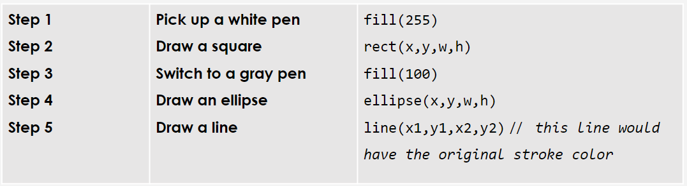


---

# Variables 

* In computer science, variables are placeholder names for actual values

* They are used to store data that can be used and manipulated in a program

* They allow us to label data with names that make our code more understandable.

# `colorOfEyes = "red"`

---

# p5.js System Variables 

## The p5.js library has a number of system variables (built-in) that store data. Today we’re going to look at:

- `mouseX` and `mouseY` - [Example](https://editor.p5js.org/cs4all/sketches/uHpIF1Ms4)

- `width` and `height` - [Example](https://editor.p5js.org/cs4all/sketches/Edh2xtSqV)


Take 5 minutes and play with the examples above. What do you notice? What do you wonder?

---

# Example 1

```javascript
function setup() { 
  createCanvas(400, 400);
}

function draw() { 
background(mouseX);
fill(255);
ellipse(mouseX, mouseY, 50, 50);

}
```

---

# Example 2

```javascript
function setup() {
  //change this value and see what happens to the ellipses 
  createCanvas(600, 120);
}

function draw() {
  background(220);
  fill(255);
  //place the ellipse by dividing
  //the built-in variables width and height by 2
  ellipse(width / 2, height / 2, 20, 20);
  noFill(); //get rid of the fill
  //place this ellipse by dividing
  //the width and height of the canvas
  //without using variables
  ellipse(300, 60, 40, 40);

}
```

---

# `mouseX` and `mouseY`


* The `mouseX` variable holds the value of the x-coordinate of the current mouse location.

* The `mouseY` variable holds the value of the y-coordinate of the current mouse location.

* The values of these two variables will update in real-time as you move your mouse over the canvas.

---

# `mouseX` and `mouseY`

Based on the code below, what do you think will happen in the sketch?

```javascript

function setup(){
  createCanvas(400,400);
}

function draw(){
  background(mouseX);
  ellipse(200,200,mouseY);
}
```

---

# Interactivity 

- These two simple system variables are what p5.js is all about - they easily allow us to make our projects ***interactive*** and fun for the user.
- **Interactivity** is the ability of a computer program to respond to the user’s **input**. The computer will **process** this input data to produce an **output**.

---

# Input, Process, Output

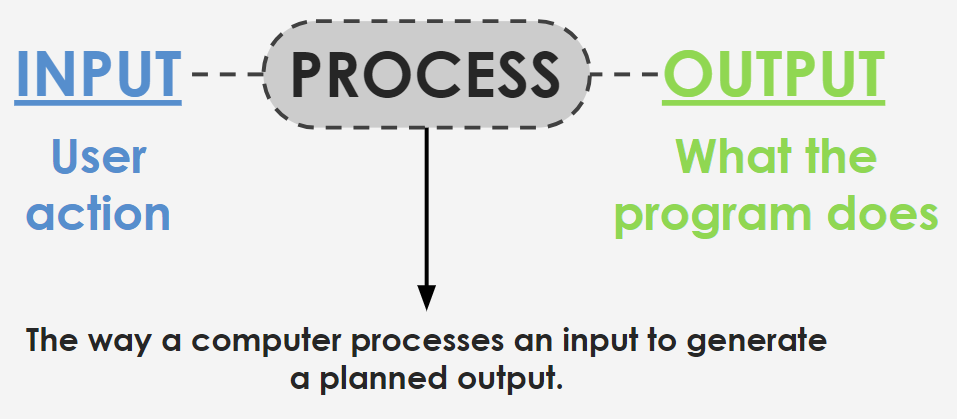

---

# `mouseX` and `mouseY`

To display the mouse location on the canvas, you can add the following line after our background *inside* the `draw()` function:

`text(mouseX + ',' + mouseY, 20,20);`

This text function is receiving the values from `mouseX` and `mouseY` and showing them on the canvas at upper-left corner.

---

# Challenge `mouseX` and `mouseY`

Remix the following [example](https://editor.p5js.org/cs4all/sketches/uHpIF1Ms4) to do one or more of the following:

1. Color of ellipse changes with mouse movement.
2. Mouse movement changes the height or width of another ellipse.
3. Mouse movement changes the background color.

```javascript
function setup() { 
  createCanvas(400, 400);
}

function draw() { 
background(mouseX);
fill(255);
ellipse(mouseX, mouseY, 50, 50);
}
```

---

# `width` and `height`

These built-in variables automatically hold the values for the **width and height of our canvas**. We can use them to place shapes on the canvas. 

```javascript
function setup(){
  createCanvas(600,120);
}

function draw(){
  background(220);
  fill(255);
  ellipse(width/2, height/2, 20, 20);
}
```

#### If canvas is 600 x 120, what will be the x and y coordinates of the center of the ellipse?

---

# Hint: `rectMode()`


There's a function called `rectMode()` that allows us to move the rect from it’s center.

The two options for the `rectMode(`) are:

`rectMode(CENTER);`
`rectMode(CORNER);`

Play with it [here](https://editor.p5js.org/cs4all/sketches/HkYPyi9m-).

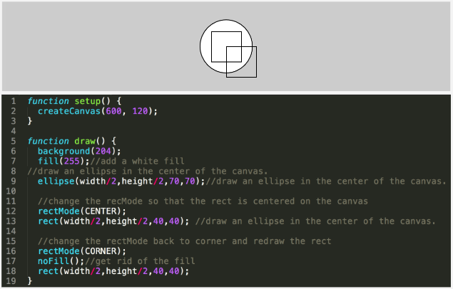


---

# `rectMode()`

In our drawing exercises we placed rectangles based on their upper left corner. If we want a rectangle to be drawn in the center of the screen we might try this, but it’ll place it using the upper left corner. 


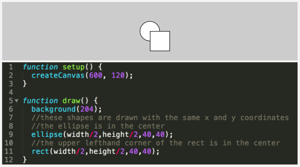

---

# **0.2.1 Intro to Variables**  <!--fit--->

# Paired Programming <!--fit--->

---

# Custom Variables 

<div class="columns">

<div>

Go to [this sketch](https://editor.p5js.org/cs4all/sketches/SkSif3cXb) and do the following:

- Move all ellipses 40 pixels down
- Move all ellipses 30 pixels up
- Move all ellipses 20 pixels to the right

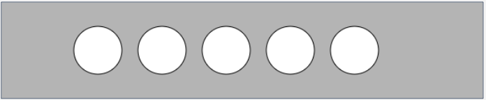

</div>


<div>

```javascript
function setup() {
  createCanvas(600, 120);
}

function draw() {
  background(180);
  ellipse(120, 60, 60, 60);
  ellipse(200, 60, 60, 60);
  ellipse(280, 60, 60, 60);
  ellipse(360, 60, 60, 60);
  ellipse(440, 60, 60, 60);

}
```

</div>

</div>

---


# Custom Variables 

What happened when you tried to shift your ellipses 40 pixels down? You might have added “40” to the y value of each ellipse and manually changed the number “60” to “100” five times.


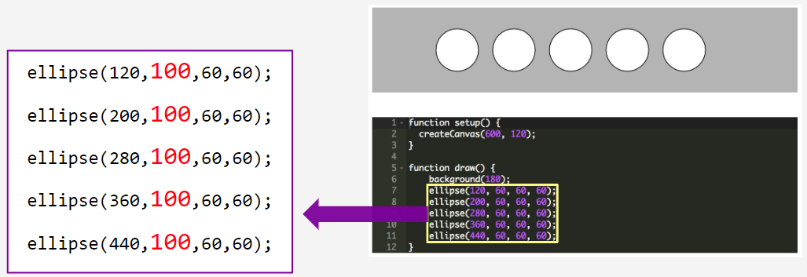

---

# Custom Variables 

* This is a repetitive task, and error-prone. 
* Instead of changing manually each y-value, we can use variables to change the y-location of all ellipses at once
* So far, we have used p5 built-in variables: mouseX, mouseY, width and height. We can read their values, but not change them. 
* Our next step is to create our own **custom variables**!

---

# Steps to Create a Variable

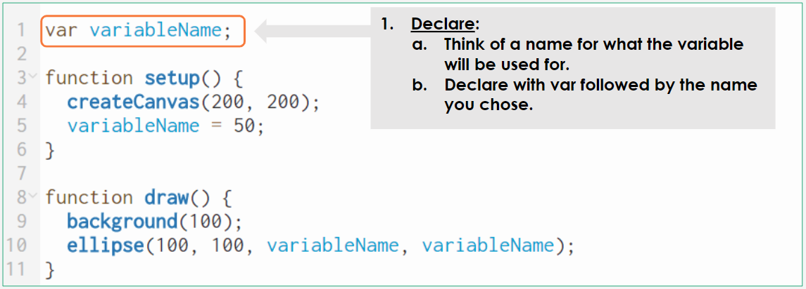

---

# Steps to Create a Variable

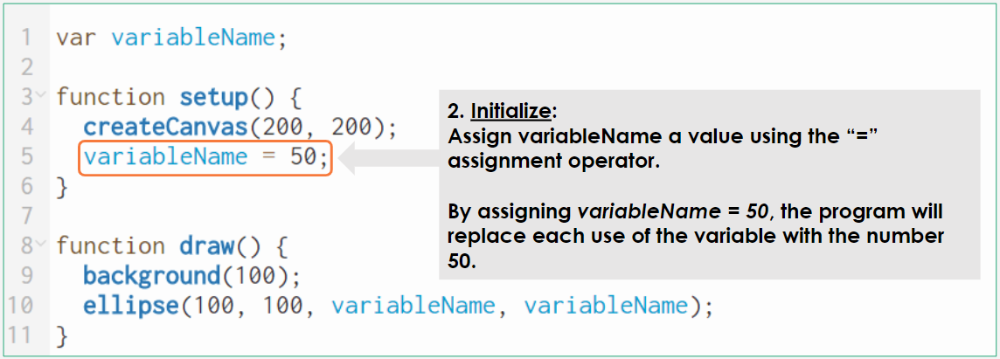

---

# Steps to Create a Variable

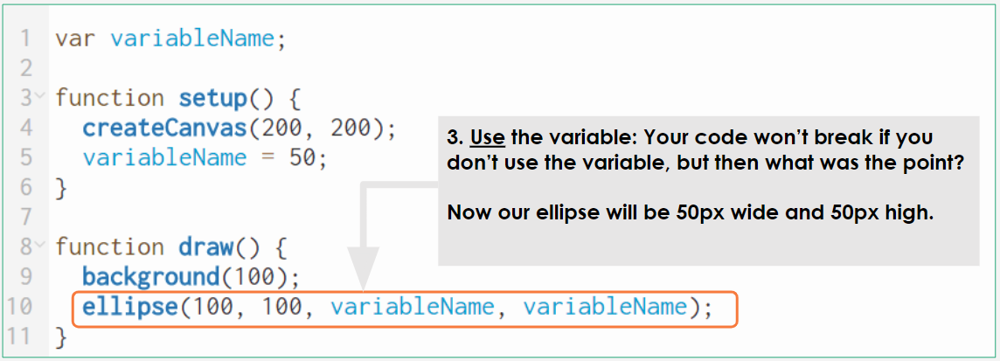

---

# Custom Emoji & Using Variables <!--fit-->

---

# Step 1: Draw a Face 

## Draw a simple face by adding eyes and a mouth

<div class="columns">

<div>
No matter where you place the shapes, the positions of face, eyes, and mouth, are going to be relative to the top left corner of the canvas:
</div>

<div>

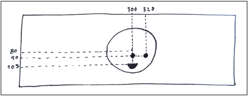

</div>

</div>

---

# Step 2: Add Variables 

## Create and initialize variables for the `x` and `y` location of the head.

<div class="columns">


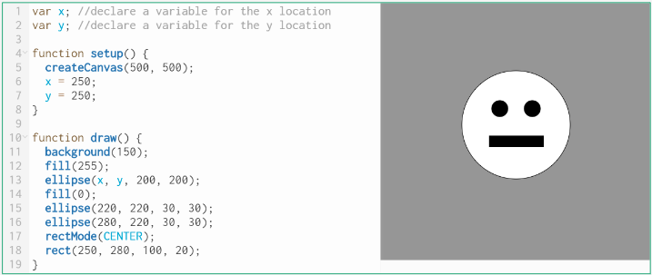

---

# Step 3: Move the Face

- Change the values of `x` and `y` and see what happens. 
  - You should notice that the head moved but the eyes and mouth are left behind. 
- Place the eyes and mouth in relation to the position of the head.
   - We did something similar when we placed shapes in relation to the size of the canvas. 
  - We placed a shape at `width/2`, `height/2` so that it remains at the center of the canvas even when the canvas size changes.  
 
---

# Step 3: Move the Face 

- Similarly, since we created variables for the `x` and `y` position of the head, we can place the other elements in relation to those variables. 
- If the **right eye** is about 30 px higher and 30 px to the right of the center of the head (ellipse), we can write its `x` and `y` values as `xPosition-30`, yPosition-30. 
- If we repeat that process for all of the features, we should be able to move the entire face drawing just by changing the value of `xPosition` and `yPosition`. 
- Reference example [here](https://editor.p5js.org/cs4all/sketches/SyeznnqX-).

---
<style>
    .headerless th {
        display: none;
    }
</style>


# Custom Color Variables 

- It's most efficient to adjust variable values rather than calling a new function whenever something changes.
- To control color, we can either:
  - Use a unique variable for each color value (R, G, and B or H, S, and B)
  - Store a variable with the data type ‘color’ to hold all three values at once.
  
<div class="headerless">

|   |  | 
|---|---|
| Syntax: | `color(v1, v2, v3, [alpha]);` |
| Example: | `myColor= color(81, 100, 200);` |
| Use: | `fill(myColor);` | 

</div>

---

# `random()`

The `random()` function picks a random numerical value from the range of values that you put inside the parentheses. 

For example, `random(5,10)` will pick a random value between 5 and 10. 

If you only place one number in the parentheses, the default range starts with 0. In this case `random(255)` is a random value between 0 and 255.

---

# `random()`

<div class="columns">

<div>

- Let's use `console.log()` to see what values the random function will return. 
- You'll first need to assign the random value to a variable that will hold it.

</div>


<div>

```javascript
var x;

function setup() {
  createCanvas(400, 400);
  x = random(0,400);
}

function draw() {
  console.log(x)
}
```

</div>

</div>

---

# Practice using `random()`


Using variables and random program a sketch that has the following:

1. An ellipse that begins at a random location anywhere on the canvas after pressing play
2. A second ellipse that begins with a random size 
3. A rectangle that begins with a random fill


---

# 2023.09.14 **Coding**

##### **❓of the 📅**: If you had a pet parrot 🦜, what would you want it to say?

1. More shapes 
2. `fill()`, `stroke()`
3. `text()`

---

## More Shapes: `triangle()`

The `triangle()` function requires four parameters: **x1**, **y1**, **x2**, **y2**, **x3** and **y3** which are the three coordinates of the points on the triangle


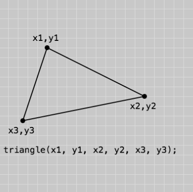

---


## More Shapes: `quad()`

The `quad()` function requires four parameters: **x1**, **y1**, **x2**, **y2**, **x3**, **y3**, **x4**, and **y4** which are the three coordinates of the points on the quadrilateral.


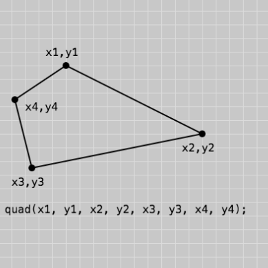

---

### More Shapes: Polygon 

To draw a polygon, first call the `beginShape()`
function, then call the `vertex(x, y)` for each vertex of
the polygon. End the shape with `endShape(CLOSE)`.

```
beginShape();
vertex(x, y); //Coordinate of Vertex 1
vertex(x, y); //Coordinate of Vertex 2
vertex(x, y); //Coordinate of Vertex 3
vertex(x, y); //Coordinate of Vertex 4
vertex(x, y); //Coordinate of Vertex 5
endShape(CLOSE);
```

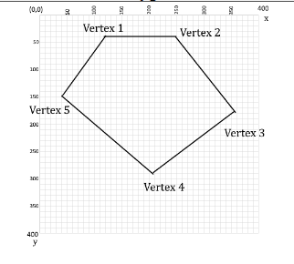


---

# More Shapes: `arc()`

Arcs are part of ellipses (or circles). To draw an arc, we need to specify the start angle and end angle of the portion of the ellipse that we want to draw. In p5js, angles are specified not in degrees but a unit called RADIANS. Angles are also measured in the CLOCKWISE direction.

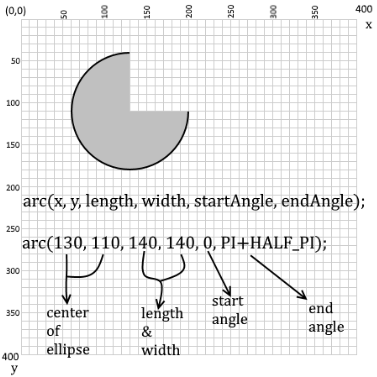

---


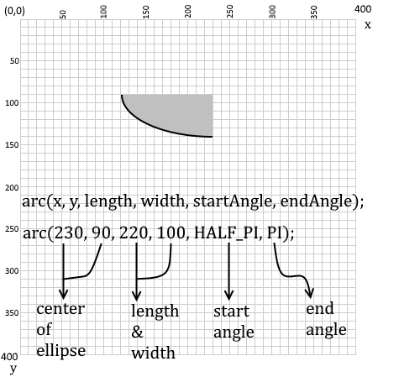 


---

# Angles 

| Degrees | Radians         | p5.js        |
| ------- | --------------- | ------------ |
| 0°       | 0               | 0            |
| 45°      | $\frac{\pi}{4}$ | QUARTER_PI   |
| 90°      | $\frac{\pi}{2}$ | HALF_PI      |
| 180°     | $\pi$           | PI           |
| 270°     | $1.5 \pi$       | PI + HALF_PI |
| 360°     | $2\pi$          | TWO_PI             |

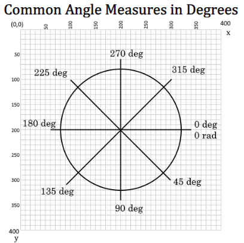

---

# `fill()` and `stroke()`


- `fill()` determines the color of the shape
- `stroke()` sets the color used to draw lines and borders around shapes
- `strokeWeight()` determines the thickness of the line around the shape


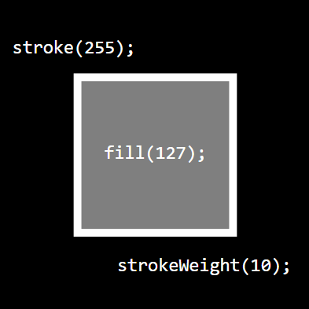

---

# `fill()` and `stroke()`

By default the color of closed shapes is set to white and stroke to black. 

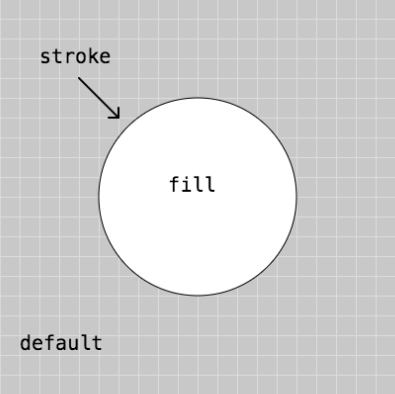

---

# `fill()` and `stroke()`

- `noStroke()` - gets rid of the line around the shape
- `noFill()` - gets rid of the shape color


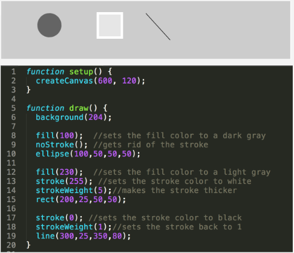

---

# `fill()` and `stroke()`

## Adding color is like picking up a pen to draw


---


# `text(mouseX + " ," + mouseY, 20,20);` <!--fit--->

## Code shows where your mouse cursor is

---

# 2023.09.12 **Coding**

##### **❓of the 📅**: What smells bring you back to a different time? 👃 🌲

1. Finish Robot Drawing and Turn in on Canvas 
2. Background:
    - What is a function
    - Common drawing functions
3. Drawing Practice:
    - 0.1.2 Drawing in p5.js
    - 0.1.3 Drawing in p5.js - Part II

---

# Functions 

While `setup()` and `draw()` are defined by the developer in each sketch, most of the p5 functions we'll use today are defined by the p5 library, and **invoked** or **“called”** in our code.

When a function is invoked, or called, the programmer is asking the program to run the code within the function.  The **parenthesis operator** is used to invoke the function.

```
rect(50, 50, 100, 100);
```

The values inside of the parentheses are known as **arguments**.  These are used to change the outcome of a function.

---

# Functions **SYNTAX ALERT**

```
function(argument1, argument2);
```

In Javascript, you can **call** a function by writing the name of the function followed by parentheses and a semicolon. 

Any arguments are written in the parentheses with commas in between them.

---


---

# Create Canvas 

```
createCanvas(600, 240);
```

This function creates an HTML canvas element that is 600 pixels wide and 240 pixels high. 

The canvas is an HTML element that draws graphics and animations using scripting. 


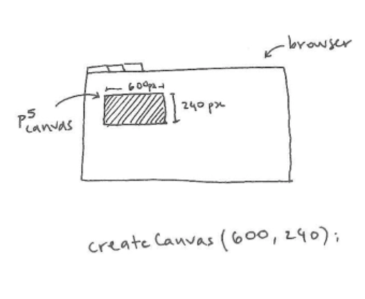

---

# Functions 

<div class="columns">
<div>

```
p5.Renderer2D.prototype.line = function(x1, y1, x2, y2) {
var ctx = this.drawingContext;
  if (!this._doStroke) {
    return this;
  } else if (this._getStroke() === styleEmpty) {
    return this;
  }
  // Translate the line by (0.5, 0.5) to draw it crisp
  if (ctx.lineWidth % 2 === 1) {
    ctx.translate(0.5, 0.5);
  }
  ctx.beginPath();
  ctx.moveTo(x1, y1);
  ctx.lineTo(x2, y2);
  ctx.stroke();
  if (ctx.lineWidth % 2 === 1) {
    ctx.translate(-0.5, -0.5);
  }
  return this;
};

```

</div>


<div>

## **Calling** this function 

```line(x1,y1,x2,y2);```

</div>

---

# Background Color 

```
background(0);
```

This function gives our canvas a background color between 0 (black) and 255 (white).

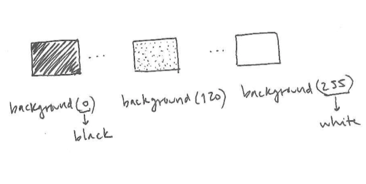

---

# p5.js Coordinate System 

p5.js makes drawing on the canvas easy by providing functions for us to draw shapes, but we need to be able to tell the program where to draw those shapes. 

To do that,  we need to understand the coordinate system that we’ll be drawing in.


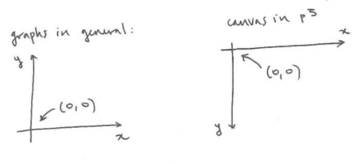

---

# Comments 

Lines of code preceded by two slashes // will be read as comments in p5.js and will be ignored by the interpreter. The interpreter is the program that executes the instructions written in a programming language.


```
// move the following rectangle on the x axis
rect(200, 50, 50, 50);
```

---

# Basic Shapes 

## Draw a Point 

The function to draw a point is `point()`. The arguments are `(x,y)` which are the x and y coordinates. 

```
point(x,y);
```

---

# Basic Shapes 

## Draw a line 

The `line()` function requires four parameters: **x1**, **y1**, **x2**, and **y2**. For this function to work, it needs to know:

The **x** and **y** coordinates of the first point

The **x** and **y** coordinates of the second point

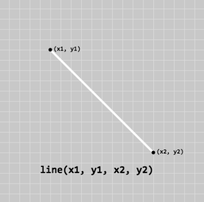

---

## Basic Shapes Draw a Rectangle 

The `rect()` function requires four parameters: **x**, **y**, **width**, and **height**. For this function to work, it needs to know:

1. Where to put the rectangle  → x and y locations
2. What size the rectangle should be → width and height 

All these parameters are measured in 
pixels. 

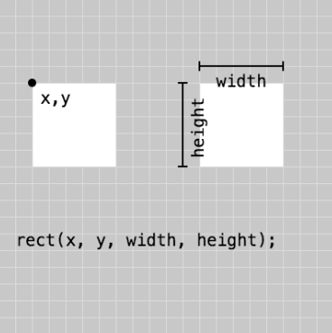

---


## Basic Shapes Draw an ellipse 

The `ellipse()` function requires four parameters: **x**, **y**, **width**, and **height**. For this function to work, it needs to know:

1. Where to put the ellipse  → x and y locations
2. What size the ellipse should be → width and height 

All these parameters are measured in 
pixels. 

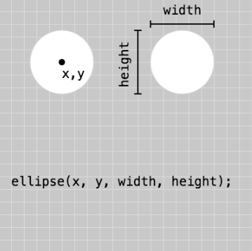

---

# Drawing Order 

In p5, shape and color functions are rendered to the canvas in the order they're written in the program from top to bottom.

[Example](https://editor.p5js.org/cs4all/sketches/-qyS-eDP7) - Remove the comments to see how the rectangles layer on one another.

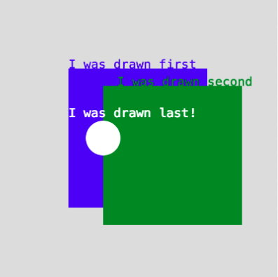

---

# Canvas Assignments 

1. 0.1.2 Drawing in p5.js (Drawing points and lines)
2. 0.1.3 Drawing in p5.js - Part II (Drawing Order & Shapes)

---

# 2023.09.08 **Coding**

##### **❓of the 📅**: What is your most used emoji?

1. Welcomes & Question of the Day
2. What will we be coding? What is p5.js?
3. Robots...🤖


---


---


# [🎬What is p5.js?](http://hello.p5js.org/)

- JavaScript Library for creating visual and interactive art (and more!)
- Works with *three* languages: JavaScript, HTML, and CSS
- This programming language will be used in this course to introduce basic programming concepts and apply them to create computational media by building expressive and interactive computer applications and media.


---


# [Processing](https://processing.org/)

"Processing is a flexible software sketchbook and a language for learning how to code within the context of the visual arts. Since 2001, Processing has promoted software literacy within the visual arts and visual literacy within technology. There are tens of thousands of students, artists, designers, researchers, and hobbyists who use Processing for learning and prototyping."

  - Free to download and open source
  - Interactive programs with 2D, 3D, PDF, or SVG output
  - OpenGL integration for accelerated 2D and 3D
  - For GNU/Linux, Mac OS X, Windows, Android, and ARM
  - Over 100 libraries extend the core software
  - Well documented, with many books available

---

# [p5.js](https://p5js.org/)

- Processing, but adapted for javascript
- means you can run it in your internet browser
- Also has an online editor and you can run it with your Chromebooks

---

# Draw a Robot 🤖 <!--fit--->

- Find a partner
- Get a whiteboard 
- Split your side in half 
- Draw a robot with **5 Shapes** on your side on one half


---

In p5 we use code to draw graphics on a canvas:


---

The coordinate system is different...


---

Adjust your robot's coordinates:


---

##Rectangles:


##Ellipses:


---


## 🔌 Unplugged...Draw a robot...

Draw a robot using:

- Using only rectangles, circles, and ellipses
- Using at *least* 5 total shapes

## Why?

We need to practice giving instructions. Coding is all about giving a computer instructions that it will understand.

---

# Write the info for your robot....

List the shapes and write down their information


---


# The Code

### Set up the window
```javascript

function setup() {
  createCanvas(400, 400);
}
```

### A continuous loop
```javascript
function draw() {
  background(220);
}
```

---

# Draw your robot assignment

Draw a robot using:

- Using only rectangles, circles, and ellipses
- Using at *least* 5 total shapes
 

