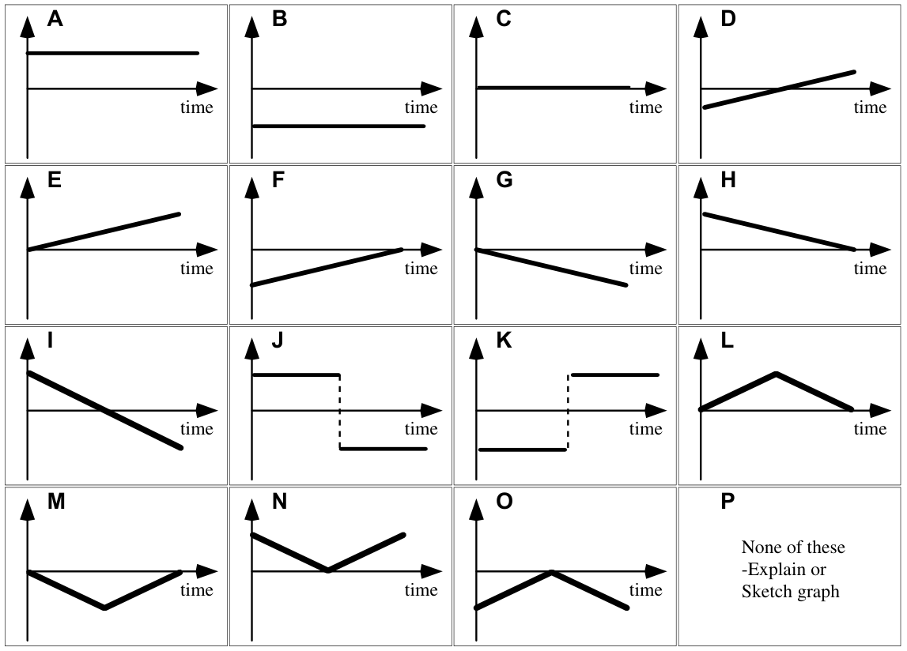

# Regents Physics 🔭 <!---fit--->

# **2023-2024** Agendas

## 👨‍🏫 Mr. Porter

---

<!--- _footer:  🤔 Did you get better at physics today? Did you help make someone else better today? --->

# 2024.03.19 **Regents Physics** 

##### **❓ of the 📅**: Aside from necessities, what one thing could you not go a day without?

#### 📋 Agenda

1. Finish Pivot?
2. Physics Classroom
	1. **[The Quantity of Charge 1](https://www.physicsclassroom.com/calcpad/launch/CPSE1)**
	2. **[Coulomb's Law 1](https://www.physicsclassroom.com/calcpad/launch/CPSE3)**
	3. **[Coulombs Law as a Guide to Thinking](https://www.physicsclassroom.com/calcpad/launch/CPSE5)**

#### 🎯 Goals 

🥅 _Define elementary charge_

🥅 _Discuss methods of charging_

🥅 _Learn about electrostatic force_

#### 🚨 NOTE:

---

<!--- _footer:  🤔 Did you get better at physics today? Did you help make someone else better today? --->

# 2024.03.13 **Regents Physics** 

##### **❓ of the 📅**: Do you think it would be easier to give up sugar or technology?

#### 📋 Agenda

1. Sticky Tape Lab
2. Van de Graaff generator 
3. Electrostatic Notes 

#### 🎯 Goals 

🥅 _Define elementary charge_

🥅 _Discuss methods of charging_

🥅 _Learn about electrostatic force_

#### 🚨 NOTE:

---

<!--- _footer:  🤔 Did you get better at physics today? Did you help make someone else better today? --->

# 2024.03.12 **Regents Physics** 

##### **❓ of the 📅**: What's your favorite movie?

#### 📋 Agenda

1. Finish ULG Pivot
2. Sticky Tape Lab

#### 🎯 Goals 

🥅 _Learn about electrostatic force_

#### 🚨 NOTE:

---

<!--- _footer:  🤔 Did you get better at physics today? Did you help make someone else better today? --->

# 2024.03.11 **Regents Physics** 

##### **❓ of the 📅**: What luxury is totally worth the price?

#### 📋 Agenda

1. Finish ULG Pivot
2. Physics Classroom with ULG
	1. **[CG9: Gravitational Force 1](https://www.physicsclassroom.com/calcpad/launch/CPCG9)**
	2. **[CG11: Gravitational Force 3](https://www.physicsclassroom.com/calcpad/launch/CPCG11)**
	3. **[CG12: Gravitational Field Strength](https://www.physicsclassroom.com/calcpad/launch/CPCG12)**

#### 🎯 Goals 

🥅 _Practice Circular Motion_

#### 🚨 NOTE:

---

<!--- _footer:  🤔 Did you get better at physics today? Did you help make someone else better today? --->

# 2024.03.07 **Regents Physics** 

##### **❓ of the 📅**: Have you ever completed anything on your "bucket list"?

#### 📋 Agenda

1. Quiz 
2. Universal Law of Gravitation
3. ULG Quiz 

#### 🎯 Goals 

🥅 _Practice Circular Motion_

#### 🚨 NOTE:

---

<!--- _footer:  🤔 Did you get better at physics today? Did you help make someone else better today? --->

# 2024.03.06 **Regents Physics** 

##### **❓ of the 📅**: If you could start a charity, what would it be for?

#### 📋 Agenda

1. Practice for Quiz
    1. Physics Clasroom:
        - [Mild 🫑](https://www.physicsclassroom.com/calcpad/launch/CPCG5)
        - [Medium 🌶️](https://www.physicsclassroom.com/calcpad/launch/CPCG6)
        - [Spicy 🥵](https://www.physicsclassroom.com/calcpad/launch/CPCG7) 
        - [Inferno 🔥](https://www.physicsclassroom.com/calcpad/launch/CPCG8)
    2. Regents Questions (Packet)

#### 🎯 Goals 

🥅 _Practice Circular Motion_

#### 🚨 NOTE:
- Circular Motion Quiz Tomorrow

---

<!--- _footer:  🤔 Did you get better at physics today? Did you help make someone else better today? --->

# 2024.03.05 **Regents Physics** 

##### **❓ of the 📅**: Would you rather live in the ocean or on the moon?

#### 📋 Agenda

1. Lab: Flying Cows! 
1. Physics Clasroom:
    - [Mild 🫑](https://www.physicsclassroom.com/calcpad/launch/CPCG5)
    - [Medium 🌶️](https://www.physicsclassroom.com/calcpad/launch/CPCG6)
    - [Spicy 🥵](https://www.physicsclassroom.com/calcpad/launch/CPCG7) 
    - [Inferno 🔥](https://www.physicsclassroom.com/calcpad/launch/CPCG8)

#### 🎯 Goals 

🥅 _Learn about circular motion_

#### 🚨 NOTE:
- Circular Motion Quis Thursday 

---

# Flying 🐄 🐖 🦇

The buffalo farm has recently acquired some flying animals and needs to test the length of the flying animals' leashes. The farm is trying to find a way to predict how long it takes for the animals to complete one circle while attached to their loop (in physics, we call this the "period" or time for one event of repeating events to happen and use the symbol $T$.) 

**Your goal is to predict the time it takes for your animal to take 10 swings based on the length of your animal's string.**

---

<!--- _footer:  🤔 Did you get better at physics today? Did you help make someone else better today? --->

# 2024.02.29 **Regents Physics** 

##### **❓ of the 📅**: Is tap water better than bottled water?

#### 📋 Agenda

1. Pivot - Rollercoaster Loop
1. Physics Clasroom:
    - [Mild 🫑](https://www.physicsclassroom.com/calcpad/launch/CPCG5)
    - [Medium 🌶️](https://www.physicsclassroom.com/calcpad/launch/CPCG6)
    - [Spicy 🥵](https://www.physicsclassroom.com/calcpad/launch/CPCG7) 
    - [Inferno 🔥](https://www.physicsclassroom.com/calcpad/launch/CPCG8)

#### 🎯 Goals 

🥅 _Learn about circular motion_

#### 🚨 NOTE:

---

<!--- _footer:  🤔 Did you get better at physics today? Did you help make someone else better today? --->

# 2024.02.29 **Regents Physics** 

##### **❓ of the 📅**: What is the worst style choice you have ever made?

#### 📋 Agenda

1. AP Workbook 3.C
2. Slides 
3. Physics Clasroom:
    - [Mild 🫑](https://www.physicsclassroom.com/calcpad/launch/CPCG5)
    - [Medium 🌶️](https://www.physicsclassroom.com/calcpad/launch/CPCG6)
    - [Spicy 🥵](https://www.physicsclassroom.com/calcpad/launch/CPCG7) 
    - [Inferno 🔥](https://www.physicsclassroom.com/calcpad/launch/CPCG8)

#### 🎯 Goals 

🥅 _Learn about circular motion_

#### 🚨 NOTE:

---

<!--- _footer:  🤔 Did you get better at physics today? Did you help make someone else better today? --->

# 2024.02.28 **Regents Physics** 

##### **❓ of the 📅**: How did you spend the money from your very first job?

#### 📋 Agenda

1. [Circular Motion Notes](https://www.mrporterphysics.com/Presentations/Circular%20Motion/talks/CircularMotion2024.html):
    1. Tangential velocity
    2. Centripetal Acceleration
    3. Centripetal forces 

#### 🎯 Goals 

🥅 _Learn about circular motion_

#### 🚨 NOTE:

---

<!--- _footer:  🤔 Did you get better at physics today? Did you help make someone else better today? --->

# 2024.02.26 **Regents Physics** 

##### **❓ of the 📅**: What are your plans for Feb Break?

#### 📋 Agenda

1. Swinging Rubber Stoppers Lab - Whiteboard?
2. Circular Motion Notes 

#### 🎯 Goals 

🥅 _Learn about circular motion_

#### 🚨 NOTE:
- Quiz Next Week on Projectiles at Angle
- **Test Corrections Due <u>Friday 2/16</u>**

---

<!--- _footer:  🤔 Did you get better at physics today? Did you help make someone else better today? --->

# 2024.02.16 **Regents Physics** 

##### **❓ of the 📅**: What are your plans for Feb Break?

#### 📋 Agenda

1. Swinging Rubber Stoppers Lab
2. Circular Motion

#### 🎯 Goals 

🥅 _Learn about circular motion_

#### 🚨 NOTE:
- Quiz Next Week on Projectiles at Angle
- **Test Corrections Due <u>Friday 2/16</u>**

---

<!--- _footer:  🤔 Did you get better at physics today? Did you help make someone else better today? --->

# 2024.02.15 **Regents Physics** 

##### **❓ of the 📅**: What is the best board game?

#### 📋 Agenda

1. Physics Valentine 💟
    1. Research your scientist and be prepared to share out a quick summary and your valentine pun.
2. Swinging Rubber Stoppers Lab

#### 🎯 Goals 

🥅 _Learn about circular motion_

#### 🚨 NOTE:
- Quiz Next Week on Projectiles at Angle
- **Test Corrections Due <u>Friday 2/16</u>**

---

# Swinging Stoppers 

## 🤔 **<u>Essential Question</u>:**

## How are the **radius**, **mass**, and **tension** force related to the velocity that you swing your stopper at?

# **Notes** 📔

1. Try to swing with horizontal circles
2. Do not swing so aggressively that things will go flying 
2. When measuring **time** be sure to time for multiple swings
3. Do your best to control 2 of the three variables for each experiment

---

<!--- _footer:  🤔 Did you get better at physics today? Did you help make someone else better today? --->

# 2024.02.13 **Regents Physics** 

##### **❓ of the 📅**: What's the most unusual thing you've ever eaten?

#### 📋 Agenda

1. Intro to circular Motion
2. Centripetal Acceleration
	1. [Linear Speed](https://www.physicsclassroom.com/calcpad/launch/CPCG1)
	2. [Centripetal Acceleration 1](https://www.physicsclassroom.com/calcpad/launch/CPCG2)
	3. [Centripetal Acceleration 2](https://www.physicsclassroom.com/calcpad/launch/CPCG3)
3. Centripetal Net Force
	1. [Centripetal Force](https://www.physicsclassroom.com/calcpad/launch/CPCG3)

#### 🎯 Goals 

🥅 _Learn about circular motion_

#### 🚨 NOTE:
- Quiz Next Week on Projectiles at Angle
- **Test Corrections Due <u>Friday 2/16</u>**

---

<!--- _footer:  🤔 Did you get better at physics today? Did you help make someone else better today? --->

# 2024.02.11 **Regents Physics** 

##### **❓ of the 📅**: How did your Super Bowl go?

#### 📋 Agenda

1. Intro to circular Motion
2. Centripetal Acceleration
	1. [Linear Speed](https://www.physicsclassroom.com/calcpad/launch/CPCG1)
	2. [Centripetal Acceleration 1](https://www.physicsclassroom.com/calcpad/launch/CPCG2)
	3. [Centripetal Acceleration 2](https://www.physicsclassroom.com/calcpad/launch/CPCG3)
3. Centripetal Net Force
	1. [Centripetal Force](https://www.physicsclassroom.com/calcpad/launch/CPCG3)

#### 🎯 Goals 

🥅 _Learn about circular motion_

#### 🚨 NOTE:
- Quiz Next Week on Projectiles at Angle
- **Test Corrections Due <u>Friday 2/16</u>**

---

<!--- _footer:  🤔 Did you get better at physics today? Did you help make someone else better today? --->

# 2024.02.09 **Regents Physics** 

##### **❓ of the 📅**: Who is your favorite Disney hero or heroine? Would you trade places with them?

#### 📋 Agenda

1. Finish Projectile Target Shot
2. Introduction to Circular Motion

#### 🚨 NOTE:
- Quiz Next Week on Projectiles at Angle
- **Test Corrections Due <u>Friday 2/16</u>**

#### 🎯 Goals 

🥅 _Explain vertical and horizontal motion of a projectile with forces_

🥅 _Solve Free fall problems with kinematic equations_

🥅 _Learn about circular motion_

---

# 2024.02.06 **Regents Physics** Do Now 

A firefighter holds a hose which emits water with a velocity of $30.4\textrm{ m/s}$ at an angle of $55.5^\circ$ above the horizontal. He stands a horizontal distance of $15.1\textrm{ meters}$ from a building with the intent of projecting the water to a high window. What height on the building will the water reach?

---

<!--- _footer:  🤔 Did you get better at physics today? Did you help make someone else better today? --->

# 2024.02.06 **Regents Physics** 

##### **❓ of the 📅**: 

#### 📋 Agenda

1. Do Now
1. Projectile Launcher Lab
2. Test Corrections

#### 🎯 Goals 

🥅 _Explain vertical and horizontal motion of a projectile with forces_

🥅 _Solve Free fall problems with kinematic equations_

#### 🚨 NOTE:

---

# Projectile Launcher Lab 

Line up 7, evenly spaced, ring stands so the projectile launcher ball goes through each ring. 

Each of you should do the math for your ring stand so that you can calculate the height to place it. 

---

# 2024.02.05 **RP**

Cannonballs of different masses are shot from cannons at various angles above the horizontal. The velocity of each cannonball as it leaves the cannon is given, along with the horizontal component of that velocity, which is the same.

**Rank the horizontal distance traveled by the cannonballs.**

---

<!--- _footer:  🤔 Did you get better at physics today? Did you help make someone else better today? --->

# 2024.02.01 **Regents Physics** 

##### **❓ of the 📅**: 

#### 📋 Agenda

1. Do Now
1. Velocity Vector Components 
2. Solving Projectile at an angle questions
    - [Angle-Launched Projectiles 1](https://www.physicsclassroom.com/calcpad/launch/CPVP15)
    - [Angle-Launched Projectiles 2](https://www.physicsclassroom.com/calcpad/launch/CPVP16)
    - [Angle-Launched Projectiles 3](https://www.physicsclassroom.com/calcpad/launch/CPVP17)

#### 🎯 Goals 

🥅 _Explain vertical and horizontal motion of a projectile with forces_

🥅 _Solve Free fall problems with kinematic equations_

#### 🚨 NOTE:

---

<!--- _footer:  🤔 Did you get better at physics today? Did you help make someone else better today? --->

# 2024.02.01 **Regents Physics** 

##### **❓ of the 📅**: When are potatoes at their best?

#### 📋 Agenda

1. Quiz
2. Review on finding vector components 
3. Play with [Projectile Motion Phet](https://phet.colorado.edu/sims/html/projectile-motion/latest/projectile-motion_all.html)
	1. Greatest range? Greatest height? 
	4. Still that same when you change the height of the launcher?
4. Solving Projectile at an angle problems 

#### 🎯 Goals 

🥅 _Explain vertical and horizontal motion of a projectile with forces_

🥅 _Solve Free fall problems with kinematic equations_

#### 🚨 NOTE:

---

<!--- _footer:  --->

A baseball is thrown from point S in right field to home plate. The dashed line shows the path of the ball.

Treat up as the positive vertical direction and to the left as the positive horizontal direction, and with the origin at home plate.

Select the graph from the choices below that best represents:

1. horizontal velocity versus time graph 
2. horizontal acceleration versus time graph
3. vertical velocity versus time graph
4. vertical acceleration versus time graph

---

<!--- _footer:  🤔 Did you get better at physics today? Did you help make someone else better today? --->

# 2024.01.31 **Regents Physics** 

##### **❓ of the 📅**: What skill or talent do you most want to learn?

#### 📋 Agenda

1. Do now with angled projectiles 
2. Review on finding vector components 
3. Play with [Projectile Motion Phet](https://phet.colorado.edu/sims/html/projectile-motion/latest/projectile-motion_all.html)
	1. Greatest range? Greatest height? 
	4. Still that same when you change the height of the launcher?
4. Solving Projectile at an angle problems 

#### 🎯 Goals 

🥅 _Explain vertical and horizontal motion of a projectile with forces_

🥅 _Solve Free fall problems with kinematic equations_

#### 🚨 NOTE:

- Free Fall & Horizontal Projectile Quiz Thursday

---

# 2024.01.30 **Regents Physics** Do Now

_Complete with a partner_ 

A stone is thrown horizontally to the right at a speed of 12.0 m/s from the top of a cliff that is 85 m high. Consider up and to the right positive directions.

1. How long does it take the stone to reach the bottom of the cliff?
2. How far from the base of the cliff does the stone hit the ground?
3. What is the horizontal component of the stone's velocity just before it hits the ground?
4. What is the vertical component of the stone's velocity just before it hits the ground?

---

<!--- _footer:  🤔 Did you get better at physics today? Did you help make someone else better today? --->

# 2024.01.30 **Regents Physics** 

##### **❓ of the 📅**: Have you ever fallen for a scam? If so, what was it?

#### 📋 Agenda

1. Do Now
2. Horizontal Projectile Lab 
3. Practice with Horizontal Projectiles 

#### 🎯 Goals 

🥅 _Explain vertical and horizontal motion of a projectile with forces_

🥅 _Solve Free fall problems with kinematic equations_

#### 🚨 NOTE:

- Free Fall & Horizontal Projectile Quiz Thursday

---

# Horizontal Projectile Lab 

1. Determine Launch Speed of your ball when launching from table. 
2. Use that information to predict where the ball will land when launched from the cabinets

---

# Horizontal Projectile Motion Practice:

1. [Horizontally Launched Projectiles 1](https://www.physicsclassroom.com/calcpad/launch/CPVP12)
1. [Horizontally Launched Projectiles 2](https://www.physicsclassroom.com/calcpad/launch/CPVP13)
1. [Horizontally Launched Projectiles 3](https://www.physicsclassroom.com/calcpad/launch/CPVP14)

---

<!--- _footer:  🤔 Did you get better at physics today? Did you help make someone else better today? --->

# 2024.01.26 **Regents Physics** 

##### **❓ of the 📅**: What fictional world or place would you like to visit?

#### 📋 Agenda

1. Question 
2. Horizontal Projectile Demos
3. How to solve Projectile Motion Problems 
4. [Horizontally Launched Projectiles 1](https://www.physicsclassroom.com/calcpad/launch/CPVP12)
5. Maybe? Mini Lab - Horz. Projectiles

#### 🎯 Goals 

🥅 _Explain vertical and horizontal motion of a projectile with forces_

🥅 _Solve Free fall problems with kinematic equations_

#### 🚨 NOTE:

---

Two toy trucks roll off the ends of identical tables. The speeds and masses of the trucks are given.

**Will Truck A be in the air for (i) _a longer time_, (ii) a _shorter time_, or (iii) the _same time_ as Truck B before it reaches the floor?**

Explain your reasoning.

---

Two toy trucks roll off the ends of identical tables. The speeds and masses of the trucks are given.

**Will Truck A be in the air for (i) _a longer time_, (ii) a _shorter time_, or (iii) the _same time_ as Truck B before it reaches the floor?**

Explain your reasoning.

---

Rank the situations from the ***greatest to least time*** that it will take for the sphere to hit the ground. Make your ranking on a single line, using > and = signs. Ties are possible.

Rank the situations from the ***greatest to the least horizontal distance*** that the sphere will travel. Make your ranking on a single line, using only the > and = signs. Ties are possible.

---

# Solving Projectile Motion Problems

1. Set up double cross diagram
2. Use cross diagrams to solve!

---

<!--- _footer:  🤔 Did you get better at physics today? Did you help make someone else better today? --->

# 2024.01.24 **Regents Physics** 

##### **❓ of the 📅**: If you could only eat one meal for the rest of your life, what would it be?

#### 📋 Agenda

1. Go Over Old Quiz
3. 🥵 Spicy: [Rocket Science 🚀](https://www.physicsclassroom.com/calcpad/launch/CPK23)
    - Solve with a partner (or group of 3) with someone you don't usually work with
4. Horizontally Fired Projectile Motion

#### 🎯 Goals 

🥅 _Explain vertical and horizontal motion of a projectile with forces_

🥅 _Solve Free fall problems with kinematic equations_

#### 🚨 NOTE:

- Forces Test - Tomorrow

---

<!--- _footer:  🤔 Did you get better at physics today? Did you help make someone else better today? --->

# 2024.01.22 **Regents Physics** 

##### **❓ of the 📅**: What is your ideal sandwich?

#### 📋 Agenda

1. Look at notes/old quiz ⏲️ 15 minutes
2. Quiz2. Introduction to Free fall problems 
3. 🥵 Spicy: [Rocket Science 🚀](https://www.physicsclassroom.com/calcpad/launch/CPK23)
4. Horizontally Fired Projectile Motion

#### 🎯 Goals 

🥅 _Explain vertical and horizontal motion of a projectile with forces_

🥅 _Solve Free fall problems with kinematic equations_

#### 🚨 NOTE:

- Forces Test - Thursday

---

<!--- _footer:  🤔 Did you get better at physics today? Did you help make someone else better today? --->

# 2024.01.19 **Regents Physics** 

##### **❓ of the 📅**: Have you ever had a surprise party? (that was an actual surprise)

#### 📋 Agenda

1. Go over Pivot
2. Introduction to Free fall problems 
3. Practice with Freefall problems
	1. 🫑 Mild: [Free Fall 1](https://www.physicsclassroom.com/calcpad/launch/CPK19)
	2. 🌶️ Medium: [Free Fall 2](https://www.physicsclassroom.com/calcpad/launch/CPK20) &  [Free Fall 3](https://www.physicsclassroom.com/calcpad/launch/CPK21)
	3. 🥵 Spicy: [Rocket Science 🚀](https://www.physicsclassroom.com/calcpad/launch/CPK23)

#### 🎯 Goals 

🥅 _Explain vertical and horizontal motion of a projectile with forces_

🥅 _Solve Free fall problems with kinematic equations_

#### 🚨 NOTE:

- We need to take a forces test - when is best?

---

<!--- _footer:  🤔 Did you get better at physics today? Did you help make someone else better today? --->

# 2024.01.18 **Regents Physics** 

##### **❓ of the 📅**: What is the least amount of money you would accept to swallow a dead worm?

#### 📋 Agenda

1. Introduction to Projectile Motion Pivot
2. Whiteboard and discuss
3. Freefall questions 

#### 🎯 Goals 

🥅 _Explain vertical and horizontal motion of a projectile with forces_

#### 🚨 NOTE:

- We need to take a forces test - when is best?

---

<!--- _footer:  🤔 Did you get better at physics today? Did you help make someone else better today? --->

# 2024.01.12 **Regents Physics** 

##### **❓ of the 📅**: Have you seen any good movies lately?

#### 📋 Agenda

1. Regents Practice 
    1. Inclined Plane Questions 
    2. Friction Questions 
2. Risky Business mini lab

#### 🎯 Goals 

🥅 _Solve for componets of gravity for objects on ramps_

🥅 _Apply ramps to other force problems_

---

<!--- _footer:  🤔 Did you get better at physics today? Did you help make someone else better today? --->

# 2024.01.11 **Regents Physics** 

##### **❓ of the 📅**: Should pizza slices be triangles or squares?

#### 📋 Agenda

1. Finish Inclined Planes Pivot
2. Discuss and Notes 
3. Practice with Inclined Planes
	1. [Inclined Planes: Par and Perp Components of Gravity](https://www.physicsclassroom.com/calcpad/launch/CPF2D9)
    1. Worksheet - Regents Questions 
	2. [Inclined Plane Problems 1](https://www.physicsclassroom.com/calcpad/launch/CPF2D10)

#### 🎯 Goals 

🥅 _Solve for componets of gravity for objects on ramps_

🥅 _Apply ramps to other force problems_

#### 🚨 Upcoming...

- Quiz Friday on N2L (only perpendicular forces)

---

<!--- _footer:  🤔 Did you get better at physics today? Did you help make someone else better today? --->

# 2024.01.09 **Regents Physics** ⛄

##### **❓ of the 📅**: What is your favorite fast food chain?

#### 📋 Agenda

1. Finish Inclined Planes Pivot
2. Discuss and Notes 
3. Practice with Inclined Planes
	1. [Inclined Planes: Par and Perp Components of Gravity](https://www.physicsclassroom.com/calcpad/launch/CPF2D9)
	2. [Inclined Plane Problems 1](https://www.physicsclassroom.com/calcpad/launch/CPF2D10)
	3. [Inclined Plane Problems 2](https://www.physicsclassroom.com/calcpad/launch/CPF2D11)
	4. [Inclined Plane Problems 3](https://www.physicsclassroom.com/calcpad/launch/CPF2D12)

#### 🎯 Goals 

🥅 _Solve for componets of gravity for objects on ramps_

🥅 _Apply ramps to other force problems_

#### 🚨 Upcoming...

- Quiz Friday on N2L (only perpendicular forces)

---

<!--- _footer:  🤔 Did you get better at physics today? Did you help make someone else better today? --->

# 2024.01.08 **Regents Physics** ⛄

##### **❓ of the 📅**: What was the last book you read?

#### 📋 Agenda

1. Do a review problem or two from [choose your own adventure practice](#choose-your-level) 
2. Quiz 
3. Inclined Plane Pivot (Forces on Objects on a Ramp)

#### 🎯 Goals 

🥅 _Apply N2L to a variety of problems_ 

🥅 _Use the formula for friction_

#### 🚨 Upcoming...

- Quiz Friday on N2L (only perpendicular forces)

---

<!--- _footer:  🤔 Did you get better at physics today? Did you help make someone else better today? --->

# 2024.01.05 **Regents Physics** ⛄

##### **❓ of the 📅**: Which super-sized animal would be the scariest super-sized?

#### 📋 Agenda

1. Choose your own adventure practice 
2. Quiz (1:20 start at the latest)

#### 🎯 Goals 

🥅 _Apply N2L to a variety of problems_ 

🥅 _Use the formula for friction_

#### 🚨 Upcoming...

- Quiz Friday on N2L (only perpendicular forces)

---

<!-- _class: invert --->

## Choose your level

### Level 1 - Mild 🫑 :

- [Newton's Second Law: Calculating Horizontal Acceleration](https://www.physicsclassroom.com/calcpad/launch/CPNL8)
- [Newton's Second Law: Calculating Vertical Acceleration](https://www.physicsclassroom.com/calcpad/launch/CPNL9)
- [Newton's Second Law: Calculating an Unknown Force](https://www.physicsclassroom.com/calcpad/launch/CPNL10)

### Level 2 - Medium 🌶️: 
- [Problem Set NL11 - Friction and Mu 1](https://www.physicsclassroom.com/calcpad/launch/CPNL11)
- [Problem Set NL12 - Friction and Mu 2](https://www.physicsclassroom.com/calcpad/launch/CPNL12)
- [Problem Set NL13 - Friction and Mu 3](https://www.physicsclassroom.com/calcpad/launch/CPNL13)

### Level 3 - Spicy 🌶️🌶️: 

- [Fnet = ma W/ Kinematic Equations 1](https://www.physicsclassroom.com/calcpad/launch/CPNL17)
- [Fnet = ma W/ Kinematic Equations 2](https://www.physicsclassroom.com/calcpad/launch/CPNL18)
- [Fnet = ma W/ Kinematic Equations 3](https://www.physicsclassroom.com/calcpad/launch/CPNL19)

### Level 4 - Fire 🔥🥵:

- [Fnet = m•a with Angled Forces 1](https://www.physicsclassroom.com/calcpad/launch/CPF2D6)
- [Fnet = m•a with Angled Forces 2](https://www.physicsclassroom.com/calcpad/launch/CPF2D7)
- [Fnet = m•a with Angled Forces 3](https://www.physicsclassroom.com/calcpad/launch/CPF2D8)

---

<!--- _footer:  🤔 Did you get better at physics today? Did you help make someone else better today? --->

# 2024.01.03 **Regents Physics** ⛄

##### **❓ of the 📅**: Who makes the best pizza 🍕?

#### 📋 Agenda

1. Friction 
2. Friction Practice on Whiteboards with buddies

#### 🎯 Goals 

🥅 _Apply N2L to a variety of problems_ 

🥅 _Use the formula for friction_

#### 🚨 Upcoming...

- Quiz Friday on N2L (only perpendicular forces)

---

<!--- _footer:  🤔 Did you get better at physics today? Did you help make someone else better today? --->

# 2024.01.02 **Regents Physics** ⛄

##### **❓ of the 📅**: Do you make New Year's Resolutions? If so what are they?

#### 📋 Agenda

1. N2L Practice in Packet
    - Porter Review
    - _"Individualish"_ practice

#### 🎯 Goals 

🥅 _Apply N2L to a variety of problems_ 

---

<!--- _class: winter --->
<!--- _footer:  🤔 Did you get better at physics today? Did you help make someone else better today? --->

# 2023.12.19 **Regents Physics** ⛄

##### **❓ of the 📅**: Gingerbread (house, cookies, etc) yey or ney?

#### 📋 Agenda

1. Quiz
2. Fan Cart Lab Board Meeting
2. Elevator Problems

#### 🎯 Goals 

🥅 _Find the relationship between mass, unbalanced force, and acceleration_

🥅 _Apply N2L to elevator questions_

---

<!--- _class: winter --->
<!--- _footer:  🤔 Did you get better at physics today? Did you help make someone else better today? --->

# 2023.12.18 **Regents Physics** ⛄

##### **❓ of the 📅**: Have you finished your holiday shopping yet?

#### 📋 Agenda

1. Finish N2L 
    - Finish Data collection (Check with Porter that you were collecting correctly)
    - Whiteboard
    - Board Meeting & Finish Conclusions
2. Elevator Problems

#### 🎯 Goals 

🥅 _Find the relationship between mass, unbalanced force, and acceleration_

🥅 _Apply N2L to elevator questions_

---

<!--- _class: winter --->

# 2023.12.13 **Regents Physics** ⛄

##### **❓ of the 📅**: What is the word or phrase of the year?

#### 📋 Agenda

1. Finish Force Stations 
2. Fan Cart Lab

#### 🎯 Goals 

🥅 _Use force diagrams to solve equilibrium problems._

🥅 _Find components of forces on inclined planes._

🤔 Did you get better at physics today? Did you help make someone else better today?

---

<!--- _class: winter --->

# 2023.12.12 **Regents Physics** ⛄

##### **❓ of the 📅**: What is your song of the year?

#### 📋 Agenda

1. How did last class go?
2. N3L 
3. Force Stations 

#### 🎯 Goals 

🥅 _Use force diagrams to solve equilibrium problems._

🤔 Did you get better at physics today? Did you help make someone else better today?

---

# Balanced Force Stations:

## For Each Station...

### In your notebook:

1. Draw the Free Body Diagram and Vector addition diagram for the object of interest. 
2. Use the diagrams to find the missing value (force, mass, spring constant, etc). 

---

<!--- _class: winter --->

# 2023.12.07 **Regents Physics** ⛄

##### **❓ of the 📅**: What are you the biggest fan of?

#### 📋 Agenda

1. Spring Force Lab
    1. Introduction 
    2. Data, Whiteboard & Discuss
2. Solving Force Problems Quantitatively

#### 🎯 Goals 

🥅 _Find the mathematical relationship bewteen strech and $F_s$_

🤔 Did you get better at physics today? Did you help make someone else better today?

---

# Spring Force Lab 

## **Essential Question:** How is the displacement (stretch) of the spring related to the spring force?

### Notes:

- Rememeber that you are measuring how far the spring *stretches* not how long the spring is

### 🤔 Consider:
- How will you measure force? Can you use a sensor? Can you use hanging masses? You choose!

---

<!--- _class: winter --->

# 2023.12.06 **Regents Physics** ⛄

##### **❓ of the 📅**: If you could be immortal, what age would you choose to stop aging at and why?

#### 📋 Agenda

1. Force of Gravity Lab
    1. Collect Data
    2. Whiteboard & Discuss
2. Spring Force Lab
    1. Introduction 
    2. Data, Whiteboard & Discuss

#### 🎯 Goals 

🥅 _Find the mathematical relationship between mass and $F_g$_

🥅 _Find the mathematical relationship bewteen strech and $F_s$_

🤔 Did you get better at physics today? Did you help make someone else better today?

---

# Force of Gravity $(F_g)$ Lab 

## **Essential Question:** How is **mass** related to the force of gravity?

---

# $F_g$ Lab 

## Notes:

* $F_g = mg$
* Force of gravity on an object by the Earth (or other planet) is called ***weight***
* Weight is a **FORCE**, mass is scalar quantity
* $g$ is the gravitational field strength
    * Measured in N/kg 
    * changes based on planet and location on that planet
    * _near the surface of the Earth_ $g = 9.8 \textrm{ N/kg}$

---

# Spring Force Lab 

## **Essential Question:** How is the displacement (stretch) of the spring related to the spring force?

### Notes:

- Use known masses and your knowledge of the Force of gravity on those masses as your "force sensor" 

---

<!--- _class: winter --->

# 2023.12.04 **Regents Physics** ⛄

##### **❓ of the 📅**: What is the best holiday song?

#### 📋 Agenda

1. Force Diagram Card Sort
2. Monkey 🐒 Force Diagrams
3. Force of Gravity Lab

#### 🎯 Goals 

🥅 _Become confident in drawing the three Force Diagrams (FBD, VAD, ID)_

🤔 Did you get better at physics today? Did you help make someone else better today?

---

<!--- _class: winter --->

# 2023.12.01 **Regents Physics** ⛄

##### **❓ of the 📅**: What is your favorite holiday cookie? 🍪

#### 📋 Agenda

1. Holiday themed force drawings 
4. Introduction to the Force Diagrams: **Free Body Diagrams** & **Vector Addition Diagrams**
5. Force Diagram Card Sort
4. Monkey 🐒 Force Diagrams

#### 🎯 Goals 

🥅 _Define the reason(s) for constant velocity motion and constant acceleration motion_

🤔 Did you get better at physics today? Did you help make someone else better today?

---

<!--- _class: winter --->

# 2023.11.30 **Regents Physics** ⛄

##### **❓ of the 📅**: What is your favorite holiday cookie? 🍪

#### 📋 Agenda

1. Interaction Station share out
2. Force names & notes 
3. Holiday themed force drawings 
4. Introduction to the Force Diagrams: **Free Body Diagrams** & **Vector Addition Diagrams**

#### 🎯 Goals 

🥅 _Define the reason(s) for constant velocity motion and constant acceleration motion_

🤔 Did you get better at physics today? Did you help make someone else better today?

---

<!--- _class: winter --->

# 2023.11.28 **Regents Physics** ⛄

##### **❓ of the 📅**: What is your favorite winter activity?

#### 📋 Agenda

1. Share out: Tug-of-War
2. [Physics Law 1]((../../../Presentations/Forces/talks/Dynamics2023.html#36))
3. What is a force?
4. Interactions & Interaction Stations

#### 🎯 Goals 

🥅 _Define the reason(s) for constant velocity motion and constant acceleration motion_

🤔 Did you get better at physics today? Did you help make someone else better today?

---

<!--- _class: thanksgiving--->

# 2023.11.21 **Regents Physics** 🦃

##### **❓ of the 📅**: What is your favorite Thanksgiving dish?

#### 📋 Agenda

1. Vectors Quiz
2. [CV or CA](../../../Presentations/Forces/talks/Dynamics2023.html#17)? How?
3. Mallet Ball
5. [PHET Simulation](https://phet.colorado.edu/sims/html/forces-and-motion-basics/latest/forces-and-motion-basics_all.html): Tug-of-War

#### 🎯 Goals 

🥅 _Show Mastery of Vector Math_

🥅 _Define the reason(s) for constant velocity motion and constant acceleration motion_

🤔 Did you get better at physics today? Did you help make someone else better today?

---

<!--- _class: thanksgiving--->

# 2023.11.16 **Regents Physics** 🦃

##### **❓of the 📅**: Would you rather have unlimited battery life on all of your devices or have free WiFi wherever you go?

1. Test corrections...
2. Vector Treasure Hunt 💎
3. [Vector Component Analysis 1](https://www.physicsclassroom.com/calcpad/launch/CPVP7)

🚨 Upcoming...

- Vector Quiz Next Week: Tuesday

---

<!--- _class: thanksgiving--->

# 2023.11.15 **Regents Physics** 🦃

##### **❓of the 📅**: Should you bite or lick your ice cream? 🍨 🍦

1. Test corrections...HAND THEM IN!
2. Scaled Vector Drawings
3. Vector Tresaure Hunt 💎

---

# Vector Treasure Hunt 💎

1. Draw a vector treasure map on your school map. 
2. Place _checkpoints_ on the map 
3. Place sticky notes as your checkpoints around the school at the indicated map locations (NOT IN OCCUPIED CLASSROOMS). 
4. Place a "treasure" at the end of the map 
5. Write down the ***vector*** instructions for the other group
6. Exchange instructions and draw scaled vector map
7. Search for treasure
8. Offer feedback to group on their map: did it work? how could it be improved?

---

<!--- _class: thanksgiving--->

# 2023.11.13 **Regents Physics** 🦃

##### **❓of the 📅**: If you could live anywhere in the world where would you live?

1. [Adding Vectors](https://phet.colorado.edu/sims/html/vector-addition/latest/vector-addition_all.html) Demo with PHET
2. Paired-Practice: work through problem set with partner, trade marker and computer each problem
    1. [Adding 2 Perpendicular Vectors](https://www.physicsclassroom.com/calcpad/launch/CPVP5)
    2. [Adding Three or More Perpendicular Vectors](https://www.physicsclassroom.com/calcpad/launch/CPVP6)
	2. [Vector Component Analysis 1](https://www.physicsclassroom.com/calcpad/launch/CPVP7)
3. Scaled Vector Drawings

🤔 Consider: Did you get better at physics today? Did you help someone else get better today?

---

<!--- _class: thanksgiving--->

# 2023.11.08 **Regents Physics** 🦃

##### **❓of the 📅**: What’s the longest trip you’ve been on?

1. Physics Classroom Vector Practice 
	1. [Vector Components 1](https://www.physicsclassroom.com/calcpad/launch/CPVP3)
	2. [Adding 2 Perpendicular Vectors](https://www.physicsclassroom.com/calcpad/launch/CPVP5)
	3. [Vector Component Analysis 1](https://www.physicsclassroom.com/calcpad/launch/CPVP7)

---

<!--- _class: thanksgiving--->

# 2023.11.06 **Regents Physics** 🦃

##### **❓of the 📅**: What is your favorite Pixar Movie?

1. [Vectors](../../../Presentations/Forces/talks/Dynamics2023.html)
2. Vector Exploration in Pivot 

---

<!--- _class: thanksgiving--->

# 2023.11.06 **Regents Physics** 🦃

##### **❓of the 📅**: Do you prefer pens or pencils? 🖊️ ✏️

1. Test Corrections

---

# Test Corrections

1. Determine correct answer for questions answered incorrectly
    + For FRQ you need to correct the entire part (i.e. part (a)) if you lost *any* points
    + No you cannot see what you put before - start from scratch
2. For MC questions you must provide a justification for your answers
    - Start with a fact of physics "slope of VT is acceleration" or "area of VT is displacement"
    - Draw a diagram to help (i.e. draw a VT graph)
    - Try to use a claim evidence reasoning format to write your justification
4. Finally, compare your new, correct answers to your test and determine if your mistake was one of the 4 C's: clueless, careless, conceptual, or calculation.
5. Put everything together (old test, new test, correction sheets) with a paperclip.

---

<!--- _class: thanksgiving--->

# 2023.11.02 **Regents Physics** 🦃

##### **❓of the 📅**: Would you rather be Instagram or TikTok famous?

1. Practice Quiz: _do you remember your corrections from last class?_
    1. Complete
    2. Check with peer
    3. Check answer with whole class with Porter
2. Regents Packets Practice:
    - 🚨 Note ❗: for short answer questions be sure to:
        1. Write the equation
        2. Substitute **with units**
        3. Provide the answer **with units** 

---

<!---_class: halloween--->

# 2023.10.30 **Regents Physics** 👽

##### **❓of the 📅**: What is the best Halloween candy?

1. Quiz Corrections 
1. Summary Whiteboard 
    - What do you need to know about Kinematics? Graphs? Graphical Quantities? Diagrams? Equations? Definitions? 
2. Regents Practice 

---

<!---_class: halloween--->

# 2023.10.30 **Regents Physics** 🕷️🕸️

##### **❓of the 📅**: What is the funniest/most unique thing you've gotten trick or treating?

1. Dangers of texting and driving - the physics 

#### 🚨 Test Friday - Kinematics 
- Monday - Texting and Driving 
- Tuesday - Regents Practice/Test Practice 
- Thursday - Test Review 
- Friday - Test 

---

# The Physics of Texting and Driving:

## Create a whiteboard summary of the dangers of text and driving. 

_**Questions to Consider**_:

1. How far do you travel while texting "LOL"?
    - How does this differ under different speed limits?
    - What sized things (i.e. football field) do these distances compare to?
2. How far do you travel while reacting distracted? Non distracted? 
3. What is your reaction time? Distracted vs. non distracted? Run a mini-experiment.
4. Quick Reserach: How does "autobraking" work?

***Show calculations and assumptions you are making***

---

<!---_class: halloween--->

# 2023.10.25 **Regents Physics** 🧙‍♂️

##### **❓of the 📅**: What was your favorite Halloween costume?

1. Review time for quiz 
    - Stacks of graphs, VT Graphs, 
2. Quiz 
3. Regents Specific Practice 
    - Motion Graphs 
    - Horizontal Kinematics 

---

<!---_class: halloween--->

# 2023.10.25 **Regents Physics** 👻

##### **❓of the 📅**: Hanging out by a campfire, bonfire, or fireplace? 🔥

1. VT Problem Solving 
    - Finish Questions 5 & 6
2. Kinematic Equations
3. [Cross Diagram](../../../Presentations/APCAPM/talks/CAPM2023.html#49) 
4. Physics Classroom Practice:
    - [Kinematic Equations 1](https://www.physicsclassroom.com/calcpad/launch/CPK13)
    - [Kinematic Equations 2](https://www.physicsclassroom.com/calcpad/launch/CPK14)
    - [Kinematic Equations 3](https://www.physicsclassroom.com/calcpad/launch/CPK15)

---

<!---_class: halloween--->

# Kinemmatic Equations 

$$ \boxed{\bar{v} = \frac{d}{t}}$$

$$\boxed{a = \frac{\Delta v}{t}}$$

$$\boxed{v_f = v_i + at}$$

$$\boxed{d = v_it+\frac{1}{2}at^2}$$

$$\boxed{v_f^2 = v_i^2 + 2ad}$$

---

<!---_class: halloween--->

# [Cross Diagram ⚔️🤞:crossed_flags:✝️](../../../Presentations/APCAPM/talks/CAPM2023.html#49)  <!--fit--->

---

<!---_class: halloween--->

# Physics Classroom Practice <!--fit--->

# 🔗 [Kinematic Equations 1](https://www.physicsclassroom.com/calcpad/launch/CPK13)
# 🔗 [Kinematic Equations 2](https://www.physicsclassroom.com/calcpad/launch/CPK14)
# 🔗 [Kinematic Equations 3](https://www.physicsclassroom.com/calcpad/launch/CPK15)

---

<!---_class: halloween--->

# 2023.10.24 **Regents Physics** 👻

##### **❓of the 📅**: If you were so wealthy you didn’t need to work, what would you do with your time?

1. VT Problem Solving 
2. [Kinematic Equations](../../../Presentations/APCAPM/talks/CAPM2023.html#47)
3. Cross Diagram 

---

<!---_class: halloween--->
<!--- footer: . --->

### 2023.10.23 **RP PHYSICS** Do Now

1. For which of these cases, if any, is the position zero at the indicated point? 
2. For which of these cases, if any, is the position negative at the indicated point?
3. For which of these cases, if any, is the velocity zero at the indicated point?
4. For which of these cases, if any, is the velocity negative at the indicated point?
5. For which of these cases, if any, is the acceleration zero at the indicated point?
6. For which of these cases, if any, is the acceleration negative at the indicated point?
7. ***AFTER*** answering draw graph stacks

---

<!---_class: halloween--->

# 2023.10.23 **Regents Physics** 👻

##### **❓of the 📅**: Who is your celebrity crush?

1. [Continuing with VT Graphs](https://www.mrporterphysics.com/Presentations/APCAPM/talks/CAPM2023.html#33)
2. Solving Word Problems with VT Graphs;s 

## 🚨 Notes:
- Quiz **Wednesday** - For real though this week. 
    - Stacks of graphs, Speed vs. Velocity, Calculations from VT Graphs 

---

<!---_class: halloween--->

# 2023.10.18 **Regents Physics**

##### **❓of the 📅**: What is your favorite road trip snack?

1. Stacks of Graphs: Present Whiteboards and Discuss
2. [VT Graphs](https://www.mrporterphysics.com/Presentations/APCAPM/talks/CAPM2023.html#32) & Calculations we can make
3. Quiz/Practice Quiz

---

<!---_class: halloween--->

# 2023.10.17 **Regents Physics**

##### **❓of the 📅**: What are two pet peeves you have?

1. Finish Card Sort
2. Practice with Stacks of Graphs
1. [VT Graphs](https://www.mrporterphysics.com/Presentations/APCAPM/talks/CAPM2023.html#32)
2. Problem-Solving with VT Graphs

### 🚨 Quiz Tomorrow: 

- Constant velocity problem solving ($x = vt + x_0$), CV Graphs, average vs. instantaneous, average speed & average velocity calculations

---

# 2023.10.16 **Regents Physics**

##### **❓of the 📅**: Would you rather vacation in Hawaii or Alaska, and why?

1. Finish checking carts and ramps in packet 
2. Present 2 of the carts and ramps problems 
3. Carts & Ramps Summary 
4. [Acceleration Particle Model Notes](https://www.mrporterphysics.com/Presentations/APCAPM/talks/CAPM2023.html#22)
5. Card Sort #2 
    - Sort Cards into logical groups (this is a ***sort*** not a ***matching***)

### 🚨 Quiz Wednesday: 

- Constant velocity problem solving ($x = vt + x_0$), CV Graphs, average vs. instantaneous, average speed & average velocity calculations

---

# 2023.10.12 **Regents Physics**

##### **❓of the 📅**: What is your favorite family recipe? 🍱

1. Velocity Time Graph Analysis
1. [Linearizing](https://www.mrporterphysics.com/Presentations/APCAPM/talks/CAPM2023.html#15) Position vs. Time Graph
2. Carts and Ramps Card Sort
3. Carts and Ramps Checking Answer

---

# 2023.10.11 **Regents Physics**

##### **❓of the 📅**: If one superhero was real, which one should it be? 🦸 🦸‍♀️

1. Finish Collecting/Graphing data from Fan Cart Lab
2. Whiteboard Results
3. Board Meeting
4. [Additional Analysis of Fan Cart Data](../../../Presentations/APCAPM/talks/CAPM2023.html)

---

# 2023.10.10 **Regents Physics**

##### **❓of the 📅**: What’s the number one thing on your bucket list?

1. [Changing Speed Lab](../../../Presentations/APCAPM/talks/CAPM2023.html)

---

# 2023.10.05 **Regents Physics**

##### **❓of the 📅**: What is a chore you secretly enjoy?

1. Practice with Equations: [Physics Classroom](https://www.physicsclassroom.com/calcpad/launch/CPK5) - Are we finished?
2. Making and interpreting [Velocity vs. Time Graphs](../../../Presentations/APCVPM/talks/CVPM2023.html#39) 
3. [Changing Speed Lab](../../../Presentations/APCAPM/talks/CAPM2023.html)

---

# 2023.10.04 **Regents Physics**

##### **❓of the 📅**: What secrets do you think your pet would spill about you, if they could talk?

1. Finish Dueling Buggies 
2. Practice with Equation: [Physics Classroom](https://www.physicsclassroom.com/calcpad/launch/CPK5)
3. Making and interpreting [Velocity vs. Time Graphs](../../../Presentations/APCVPM/talks/CVPM2023.html#39) 

---

# 2023.10.04 **Regents Physics** Do Now

A red car (top) and a green car (bottom) are having a race. The green car has a head start (distance a). The two cars start at the same time. The red car must travel **200.0 m** to the finish line (distance b). The red car averages a speed of **17.3 m/s**. The green car averages a speed of **12.0 m/s**. What must be the head start distance (distance a) in order for the two cars to reach the finish line at the exact same time?

---

# 2023.10.03 **Regents Physics**

##### **❓of the 📅**: If you had a warning label, what would yours say?

1. Finish [Equation Problem](../../../Presentations/APCVPM/talks/CVPM2023.html#38) from last class
2. Dueling Buggies 

---

# Dueling Buggies

## 💥 **Goal:**  _Predict where your two buggies will crash_ 💥

#### Procedure:

1. Take any measurements you want about your two buggies
2. Place buggies in "time out"
3. Get _crash situation_ from Mr. Porter
4. Make Prediction (using our models) & Test!

---

# 2023.09.29 **Regents Physics**

##### **❓of the 📅**: You can have an unlimited supply of one thing for the rest of your life, what is it? Sushi? Scotch Tape? You can't pick money...

1. Quiz 
2. [XT Graphs](../../../Presentations/APCVPM/talks/CVPM2023.html#32)
3. VT Graphs

---

# 2023.09.28 - **Regents Physics**

##### **❓of the 📅**: Would you rather live swim in the world's coldest water or eat the world's hottest pepper?🥶🥵

## Agenda

1. Multiple Reps Practice 
4. [Working with XT Graphs](../../../Presentations/APCVPM/talks/CVPM2023.html#32)
5. VT Graphs

## HW: 

- Quiz Friday:
    - Multiple Representations
    - Interpreting XT Graphs 

---

# 2023.09.27 - **Regents Physics**

##### **❓of the 📅**: Would you rather be a dragon or own a dragon? 🐉

## Agenda

1. Finish Motion Sensor Lab 
2. Whiteboard and present assigned problem 
3. Multiple Reps Practice 
4. [Working with XT Graphs](../../../Presentations/APCVPM/talks/CVPM2023.html#32)

## HW: 

- Quiz Friday:
    - Multiple Representations
    - Interpreting XT Graphs 

---

# 2023.09.22 - **Regents Physics** Do Now

Draw a picture with two objects where, 

- a different colored dot represents each object
- the motion of each object is a constant velocity
- one object is moving faster than the other object
- the two objects are  moving in the opposite direction

---

# 2023.09.21 - **Regents Physics**

##### **❓of the 📅**: What is the best thing that you have gifted?

0. Do Now
1. Motion Maps 
2. Walk the graph lab 
3. Multiple Representations 

---

# 2023.09.21 - **Regents Physics** Do Now

## In your notebook...

#### 1. Describe a motion where **distance**, **displacement**, and **final position** are all ***the same***.
#### 2. Describe a motion where **distance**, **displacement**, and **final position** are all ***different***.
#### 3. Sketch a position vs. time graph for each of the examples. 

#### When completed, Google "Graphical Analysis" and download the chrome extension (or version for your computer)

---

# 2023.09.21 - **Regents Physics**

##### **❓of the 📅**: If animals could talk, which one do you think would be the most annoying?

0. Do Now 
1. Claim-Evidence-Reasoning: Soup Salad or Sandwich?
2. Claim-Evidence-Reasoning: Constant or non constant velocity?
3. Motion Maps & Multiple Representations 
4. Walk the Graph lab 🚶 

---

# 2023.09.20 - **Regents Physics**

##### **❓of the 📅**:  Which of the five senses would you say is your strongest?

1. Review Buggy Lab - What did you do? How did you do it? What did you find?
2. Buggy Lab Board Meeting 
3. [Motion Definitions](../../../Presentations/APCVPM/talks/CVPM2023.html) from the Buggy Lab 
4. CER & Does it move with CV?

---

# Buggy Lab 

## **How did you do your lab? What did you find?**

### Questions to consider:

1. Does your buggy move "in a ***consistent*** manner"?
2. What does your slope represent?
    - What does a steeper slope mean?
    - What does a negative slope mean?
3. What does your vertical intercept represent?
4. Do your lines intersect? What does that tell you?
5. How could you use your results to predict the motion of your toy car? 

---

# 2023.09.18 - **Regents Physics**

##### **❓of the 📅**:  Does your family have a “motto” – spoken or unspoken?
1. Finish Buggy Lab Part II
2. Buggy Lab Part II - Board Meeting 
3. CER and Does it Move with CV? [Slides](../../../Presentations/APCVPM/talks/CVPM2023.html#2)

---

# Buggy Lab - Part II

## **How did you do your lab? What did you find?**

### Questions to consider:

1. Does your buggy move "in a ***consistent*** manner"?
2. What does your slope represent?
    - What does a steeper slope mean?
    - What does a negative slope mean?
3. What does your vertical intercept represent?
4. Do your lines intersect? What does that tell you?
5. How could you use your results to predict the motion of your toy car? 

---

# 2023.09.15 - **Regents Physics**

##### **❓of the 📅**:  Who or where would you haunt if you had to be a ghost 👻?

1. Buggy Lab Part I - *Does it move in a consistent manner*?
    i. Finish Collecting Data
    ii. Whiteboard results - make a CER statement along with your evidence
2. Buggy lab Part II - Comparing the motion of two Buggies 

---

# Buggy Lab 🚗 - Part II

Create a descriptive (both verbal and mathematical) model of the motion of toy cars.
    
-  How is **position** related to **time** for your toy car?
-  Remember to use starting positions on card situations
-  Take data for one car at a time
-  **Time** is your independent variable
-  Graph the motion of both cars on the SAME graph (you can add another data set to the vertical axis that goes with the

---

# 2023.09.13 - **Regents Physics**

##### **❓of the 📅**:  Is cake 🍰 better than ice cream 🍨?

## 📋 Agenda

1. Board Meeting - Pasta Bridge Lab 
    - What was your question?
    - How did you do it?
    - What did you find?
2. Linear Modeling & Writing Physics Equations 
3. Buggy Lab 🚗 

---

# Linear Model

### Equation from Math Class:

$$ y = mx + b$$ 

or 

$$ y = 12x + 4$$ 

---

# The Physics Models...

* Math: $y = mx + b$

* Specific Model: $strength = (7.5\textrm{rocks/strand})strands - 12 \textrm{ rocks}$

* Generic Model: $marbles = (strength \textrm{ } ratio) strands - cup mass$ 

---

# Buggy Lab 🚗 <!--fit--->

## 🤔 Does your buggy move in a consistent manner? 

---

# 2023.09.12 - **Regents Physics**

##### **❓of the 📅**:  What smells bring you back to a different time? 👃 🌲

## 📋 Agenda

1. Pasta Bridge Lab - Collect Data 
2. Pasta Bridge Lab - Pivot
3. Pasta Bridge Lab - Whiteboard Results & Present 
4. Mathematical Modeling 

---

# Pasta Lab

- What does the slope represent?
  - For every statement: "The &lt; **quantity on vertical axis** &gt; goes up &lt; **slope value with vertical units** &gt; for every 1 &lt; **horizontal unit** &gt; of &lt; **quantity on horizontal axis** &gt;."
- What does the intercept mean? Is it of value? Is it negligible? 

---

# The Models... <!--fit-->

---

# The Models...

* Math: $y = mx + b$

* Specific Model: $strength = (7.5\textrm{rocks/strand})strands - 12 \textrm{ rocks}$

* Generic Model: $marbles = (strength \textrm{ } ratio) strands - cup mass$ 

---

# 2023.09.11 - **Regents Physics**

##### **❓of the 📅**: If you found that food was falling from the sky, what food would you want to be falling? What food would you NOT want to be falling?

## 📋 Agenda

1. Review/Remember your Ball Bounce Lab 
2. Board Meeting - Present Ball Bounce Results 
3. Join Pivot Interactives & Pasta Bridge Lab 
    - Creating mathematical models 
4. Pasta Bridge Board Meeting 

---

# 2023.09.07 - 1st Day

##### **❓of the 📅**: Sweet of savory for breakfast?

## 📋 Agenda

1. Question of the day
2. Lab Grouping
3. Survival Island
4. Ball Bounce Lab

---

## **❓Quesion of the day 📅** <!--fit--->

## Sweet of savory for breakfast? <!--fit-->

--- 

# Lab Grouping:

## Arrange yourselves into **logical** lab groups based on the word on your index card.

### Rules:

1. Groups are based on index card
2. There are **4** total groups of **2** members 

---

# **Why?**   What connection does   this  grouping "game"   have to physics class? <!---fit--->

---

# A Few Questions... 🤔
### Answer on your index card 

1. What do you like to be called? What Emoji describes you?	
2. The class is stranded on a deserted island. What special skill(s) can you bring to this dire situation?	
3. What is unique about you that leads to your happiest times and best performances at school?	
4. What is unique about you that allows you to work well in groups for the success of the group as a whole?	
5. What has a teacher done for you in the past which has allowed you to learn?
6. Write a motivation message to yourself about this school year

---

# Survival Island 🏝️

You and your group are stranded on an deserted island 😮!

Using *each* of your **unique skill's** develop a plan to escape the island.

Whiteboard your response (one person)

Be prepared to share out your plan to escape the island as a group. Each of you should offer a part of the plan to the class.

---

# Ball Bounce Lab ⛹️‍♂️ <!--fit-->

# Observations 🔍 <!--fit--->

---

# What can we measure? 📏 <!--fit-->

---

# What questions can we ask? 🤔 <!--fit-->

---

# Design and Carry out an Experiment 🥼

1. What question are you asking?
2. What is your hypothesis?
3. Design an experiment & collect data to support or refute your hypothesis
4. Whiteboard your results when you finish

