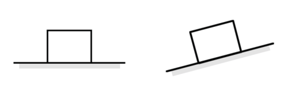
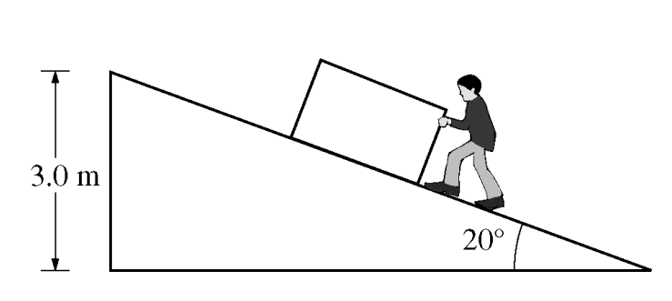
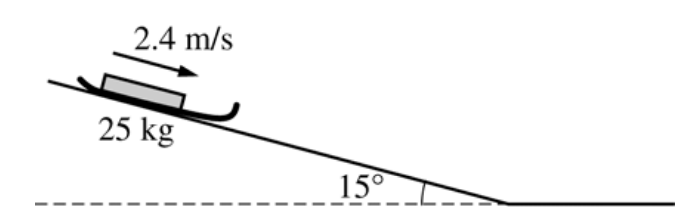
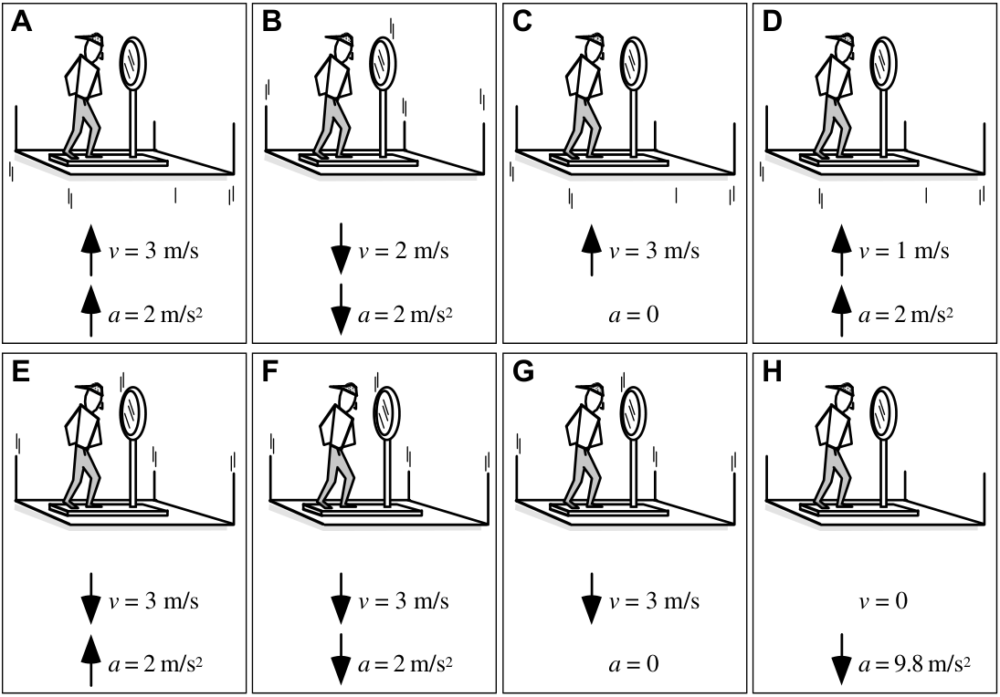
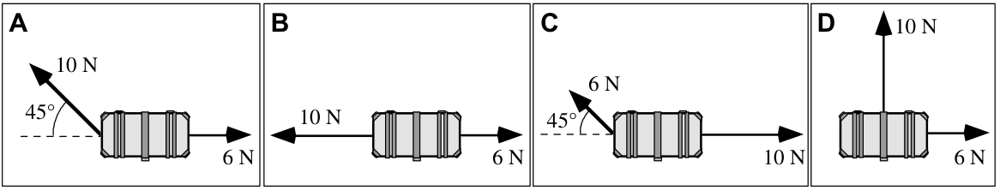
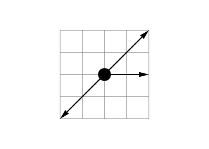
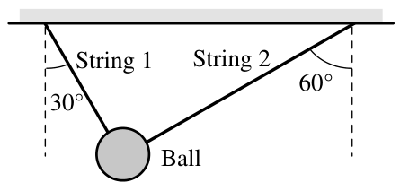
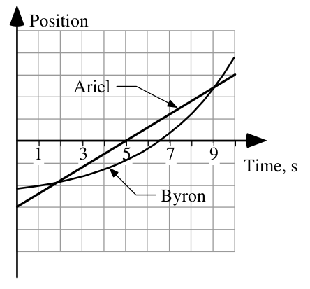
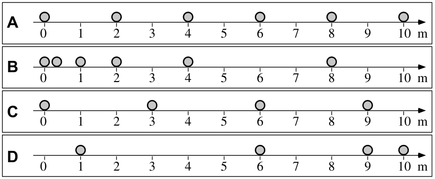

# AP Physics 🔭 <!---fit--->

# **2024-2025** Agendas

## 👨‍🏫 Mr. Porter

---

# 2025.02.26  **AP Physics**

##### **❓ of the 📅**: What is your funniest family vacation moment?

 

#### 📋 Agenda

1. Angular Motion Notes
2. Physics Classroom:
    - [**Angular and Linear Values 1**](https://www.physicsclassroom.com/calcpad/launch/CPRK1)
    -  [**Angular and Linear Values 2**](https://www.physicsclassroom.com/calcpad/launch/CPRK2)
    -  [**Angular and Linear Values 3**](https://www.physicsclassroom.com/calcpad/launch/CPRK3)

### 🎯 Goals

🥅 _Define Angular Kinematic Quantities_

🥅 _Compare Translational and Angular Kinematics_

### 📆 Upcoming

- Momentum Test, AP Classroom review is posted

---

# 2025.02.25 **AP Physics**

##### **❓ of the 📅**: How do you feel about clowns? 🤡

 

#### 📋 Agenda

1. Rotating Disk Pivot
2. Rot Kinematics Notes
3. Physics Classroom:
    - [**Angular and Linear Values 1**](https://www.physicsclassroom.com/calcpad/launch/CPRK1)
    -  [**Angular and Linear Values 2**](https://www.physicsclassroom.com/calcpad/launch/CPRK2)
    -  [**Angular and Linear Values 3**](https://www.physicsclassroom.com/calcpad/launch/CPRK3)

### 🎯 Goals

🥅 _Define Angular Kinematic Quantities_

🥅 _Compare Translational and Angular Kinematics_

### 📆 Upcoming

---

# 2025.02.14 **AP Physics**

##### **❓ of the 📅**: Who is your scientist? What did they do? Explain your valentine pun

 

#### 📋 Agenda

1. Physics Valentines
2. Ballistics Lab
3. Goal-less problems (Time dependent)

### 🎯 Goals

🥅 _Use a variety of physics models to solve problems_

### 📆 Upcoming

- 🌴🏖️ Vacation!

---

# 2025.02.13  **AP Physics**

##### **❓ of the 📅**: Would you rather lose all of your money or all of your pictures?

 

#### 📋 Agenda

1. Ballistics Lab
    - Essential Question: **What is the muzzle velocity of our nerf launcher?**
2. Model Situation on Whiteboard and Put in Notebook (this is the prelab, background information)
3. Answer pivot questions in lab notebook

---

# 2025.02.12 **AP Physics**

##### **❓ of the 📅**: Would you give up three fingers in exchange for $1 million?

 

#### 📋 Agenda

1. Quiz
    - Read it
    - Friends without pens
    - complete & turn in
2. Nerf Dart Launcher Lab

### 🎯 Goals

🥅 _Use conservation of momentum and the impulse momentum theorem to solve problems_

### 📆 Upcoming

---

# 2025.02.10 **AP Physics**

##### **❓ of the 📅**: Who is your favorite Disney hero or heroine? Would you trade places with them?

 

#### 📋 Agenda

1. Bounce vs. Embed
2. AP Workbook CoP Questions:
	1. 5.E, 5.F, 5.G

### 🎯 Goals

🥅 _Practice with Conservation of Momentum_

### 📆 Upcoming

- Energy & Momentum Quiz on Wednesday

---

# 2025.02.07 **AP Physics**

##### **❓ of the 📅**: Hanging out by a camp fire, bonfire, or fireplace?

 

#### 📋 Agenda

1. Check in on 5.H
2. Momentum in Collisions
    - Action-Reaction Think Sheet (p. 7) _**🛑 After question 7**_
    - Notes on Momentum in Collisions - Momentum Bar Graphs
    - Momentum Paired Whiteboard Practice

### 🎯 Goals

🥅 _Determine if momentum is a conserved quantity_

🥅 _Apply N3L to momentum in collisions_

### 📆 Upcoming

- Energy & Momentum Quiz Monday

---

# 2025.02.03 **AP Physics**

##### **❓ of the 📅**: Where are five places you really want to visit before you die?

 

#### 📋 Agenda

1. Impulse-Momentum Think Sheets 
2. [Impulse Momentum Change Calc Pad](https://www.physicsclassroom.com/calcpad/launch/CPMC2)

### 🎯 Goals

🥅 _Practice with Impulse and Momentum_

### 📆 Upcoming

- Energy Quiz 

---

# 2025.01.31 **AP Physics**

##### **❓ of the 📅**: Would you rather live in a hot, sandy desert, or the North Pole?

 

#### 📋 Agenda

1. Physics Family Dinner
    - arrange two tables together and everyone sit together
    - go through free reponse questions on whiteboard
    - one person record answers
2. Impulse & Momentum

### 🎯 Goals

🥅 _Correct Energy Test_

### 📆 Upcoming

---

# 2025.01.27 **AP Physics**

##### **❓ of the 📅**: What is the best fry shape? 🍟

 

#### 📋 Agenda

1. Blowdart Challenge
2. Momentum Notes 
3. Impulse Think Sheets

### 📆 Upcoming

- HW: AP Workbook 5B & 5C
- Test Corrections

### 🎯 Goals

🥅 _Break Energy Model_

🥅 _Define momentum and impulse_

🥅 _Qualitatively and quantitatively explore Momentum-Impulse Theorem_

---

<!--- class: january--->

# 2025.01.22 **AP Physics**

##### **❓ of the 📅**: What came first? The chicken or the egg?

 

#### 📋 Agenda

1. Test Review
    - AP Classroom FRQ complete in the following order of in class priority: 2, 3, 4, 1
2. Also *hint hint* 😉 😉 I would do AP Workbook 4.M at some point...

### 🎯 Goals

🥅 _Review for Energy Test_

### 📆 Upcoming

- Energy Test Friday

---

# 2025.01.21 **AP Physics**

### **❓ of the 📅**: Would you rather be able to run at 100 miles per hour or fly at 10 miles per hour?

 

#### 📋 Agenda

1. Power - Notes and Introduction
2. Power Lab: Calculate your power 🏃 💪

### 🎯 Goals

🥅 _Define and Calculate Mechanical Power_

### 📆 Upcoming

- Test Friday 

---

# 2025.01.17 **AP Physics**

##### **❓ of the 📅**: Who is the most interesting person you’ve met and talked with?

 

#### 📋 Agenda

1. Block Launcher Lab

#### 🏡 Homework

- APCR Energy Progress Check
- Finish Sliding Puck Pivot

### 🎯 Goals

🥅 _Model Work done by friction_

### 📆 Upcoming

- Energy Test 1/24 

---

# 2025.01.15 **AP Physics**

##### **❓ of the 📅**: Question

 

#### 📋 Agenda

1. Quiz 
2. Pivot - Sliding Puck

### 🎯 Goals

🥅 _Model the motion of a sliding puck with energy and forces_

### 📆 Upcoming

- Energy Test 1/24 (Review Opened)

---

# 2025.01.14 **AP Physics**

##### **❓ of the 📅**: What is your silliest fear? 🐍 🕸️

 

#### 📋 Agenda

1. [AP B Loop Question](https://secure-media.collegeboard.org/apc/ap10_frq_physics_b_formb.pdf)
2. Workbook 4.G
3. Pop Up Toy Mini Lab
4. Sliding Puck Pivot

### 🎯 Goals

🥅 _Model Physical Situations with Energy_

### 📆 Upcoming

- Energy Quiz Tomorrow
- Energy Test 1/24 (Review Opened)

---

# Pop Up Toy

## Objective:

_**Determine the spring constant of the pop-up toy**_

- Using Energy, experimentally determine the spring constant of your toy using a meterstick and the electronic balance.
- Start with an energy bar graph, write the energy conservation equation & and substitute in

---

# 2025.01.13 **AP Physics**

##### **❓ of the 📅**: If you became president, what’s the first thing you would do?

 

#### 📋 Agenda

1. AP Workbook 4.C, E, F
2. Physics Classroom Packet:
    1. 7 & Check
    2. 9-10 & Check
    3. HW: 13-18

### 🎯 Goals

🥅 _Model Energy_

### 📆 Upcoming

- Energy Quiz Wednesday

---

# 2025.01.09 **AP Physics**

##### **❓ of the 📅**: Would you rather lose both legs, both arms, or one of each?

 

#### 📋 Agenda

1. Do Now - AP Workbook 4.B
2. Energy Equations
3. PC Think Sheet p. 7-10

### 🎯 Goals

🥅 _Define Energy Equations_

🥅 _Apply Ideas of work and energy_

### 📆 Upcoming

- Test Corrections
- HW: [K](https://www.physicsclassroom.com/calcpad/launch/CPWE6) & [U](https://www.physicsclassroom.com/calcpad/launch/CPWE7) Practice

---

# 2025.01.08 **AP Physics**

###### **❓ of the 📅**: If you could have dinner with anyone in the world, who would it be?

 

#### 📋 Agenda

1. Law of Conservation of Energy
2. Modeling Conservation with Bar Graphs
3. Practice with Bar Graphs

### 🎯 Goals

🥅 _Define Conservation of Energy_

🥅 _Model Energy with 📊 Graphs_

---

# 2025.01.07 **AP Physics**

##### **❓ of the 📅**: Should pizza slices be triangles or squares?

 

#### 📋 Agenda

1. Finish Launcher Lab
2. Work - AP Workbook 4.A
3. Energy Bar Graphs

### 🎯 Goals

🥅 _Apply Work to problem solving_

🥅 _Model energy conservation with bar graphs_

---

# 2025.01.03 **AP Physics**

##### **❓ of the 📅**: Would you rather have unlimited battery life on all of your devices or have free WiFi wherever you go?

 

#### 📋 Agenda

1. Finish Work Think Sheet
2. Launcher Problem
3. AP Workbook 4.A

### 🎯 Goals

🥅 _Use work to solve problems_

### 📆 Upcoming

---

# 2025.01.02 **AP Physics**

##### **❓ of the 📅**: Do you have a New Year's resolution?

 

#### 📋 Agenda

1. Energy Definitions and Ideas
2. Work
3. Work Think Sheet
4. AP Workbook 4.A

### 🎯 Goals

🥅 _Define Energy_

🥅 _Define **Work**_

### 📆 Upcoming

- HW: AP Workbook 4.A Work
- Test Corrections -> Due next Friday 1/10

---

<!--- class: winter --->

# 2024.12.20 **AP Physics**

##### **❓ of the 📅**: What are the best stocking stuffers?

 

#### 📋 Agenda

1. Hand back N2L Lab Report (yes...that one we did a while back)
2. Remainder of class to make edits to improve and resubmit

### 🎯 Goals

🥅 __

### 📆 Upcoming

---

# 2024.12.17 **AP Physics**

##### **❓ of the 📅**: Which holiday has the best food?

 

#### 📋 Agenda

1. Test Review
    - AP Classroom Progress Check
    - AP Workbook (anything in unit 2 or 3 in workbook)
    - AP Classroom Extra Practice

### 🎯 Goals

🥅 _Review for test_

### 📆 Upcoming

- Test tomorrow

---

# 2024.12.16 **AP Physics**

##### **❓ of the 📅**: What fictional world or place would you like to visit?

 

#### 📋 Agenda

1. Do Now: AP Workbook 3.F
    - if you did it for homework check with neighbor
2. Newton's Universal Law of Gravitation
    - AP Workbook 3.M

3. Predicting Circular Orbits
    - [AP Satellite question](https://secure-media.collegeboard.org/apc/ap18-frq-physics-1.pdf) & [🔑](https://secure-media.collegeboard.org/ap/pdf/ap18-sg-physics-1.pdf) 
    - AP Workbook 3.N

### 🎯 Goals

🥅 _Model Circular Orbits_

### 📆 Upcoming

- Test Wednesday (***Finish AP Classroom Progress Check!!***)

---

# 2024.12.12 **AP Physics**

##### **❓ of the 📅**: What is your favorite road trip snack?

 

#### 📋 Agenda

1. Quiz -> Accelerating Systems
2. Universal Law of Gravitation
3. Predicting Circular Orbits
    - [AP Satellite question](https://secure-media.collegeboard.org/apc/ap18-frq-physics-1.pdf) & [🔑](https://secure-media.collegeboard.org/ap/pdf/ap18-sg-physics-1.pdf)
    - Planets Question

### 🎯 Goals

🥅 _Model Orbital motion with circular motion_

### 📆 Upcoming

---

# 2024.12.11 **AP Physics**

##### **❓ of the 📅**: What is the proper length of a playlist?

 

#### 📋 Agenda

1. Do Now
2. Centripetal Forces
3. AP Workbook 3.C & Discuss
4. AP Workbook 3.D & 3.E (finish for HW)

### 🎯 Goals

🥅 _Derive expressions for circular motion_

### 📆 Upcoming

- Quiz tomorrow -> accelerating systems 

---

# 2024.12.10 **AP Physics**

##### **❓ of the 📅**: Would you rather meet your travel back in time to meet your ancestors or to the future to meet your descendants?

 

#### 📋 Agenda

1. Do Now: Workbook 3.A & 3.B 
    - Complete with partner and prepare to discuss
2. Introduction to Circular Motion

### 🎯 Goals

🥅 _Define circular motion_

### 📆 Upcoming

---

# 2024.12.06 **AP Physics**

##### **❓ of the 📅**: If you were so wealthy you didn’t need to work, what would you do with your time?

 

#### 📋 Agenda

1. Quiz 
2. AP Question 2015 (start when you finish the quiz)
3. [Physics Classroom: Two Body Problems](https://www.physicsclassroom.com/calcpad/launch/CPNL20)

### 🎯 Goals

🥅 _Model accelerating systems_

### 📆 Upcoming

- Start Circular motion next week
- Forces Test Wednesday before break. AP Classroom is open. 

---

# 2024.12.05 **AP Physics**

##### **❓ of the 📅**: What is the best board game?

 

#### 📋 Agenda

1. Do Now: AP Workbook 2.J 
2. Examples on Solving Atwood Machines
3. AP Workbook 2.I
4. Old AP Exam Questions - Paired Problem Solving on Whiteboard

### 🎯 Goals

🥅 _Model accelerating systems_

### 📆 Upcoming

---

<!--- _footer:  --->

# 2024.12.04 **AP Physics** Do Now 

The two blocks are identical and both are at rest. A student comparing the normal force exerted on the block by the surface in the two cases states:

_**“Since both blocks are identical, I think the normal forces are the same because in each case the normal force will be equal to the weight.”**_

What, if anything, is wrong with this contention? If something is wrong, identify it and explain how to correct it. If this contention is correct, explain why.

---

# 2024.12.04 **AP Physics**

##### **❓ of the 📅**: What is your favorite Disney movie?

 

#### 📋 Agenda

1. Do Now
2. AP Workbook 2H
5. Incline Plane AP Derivations
3. Friction Paragraph Question (AP Classroom)
4. Solving Two Body Systems (AP Workbook 2.J & 2.K)

### 🎯 Goals

🥅 _Solve Inclined Plane Problems_

### 📆 Upcoming

---
<!--- _class: schodack --->
<!--- _footer:  --->

A box is being pushed at constant speed up an inclined plane to a vertical height of 3.0 m above the ground. The person exerts a force parallel to the plane. The mass $m$ of the box is 50 kg, and the coefficient of kinetic friction $\mu_k$ between the box and the plane is 0.30.

1. Draw and label the forces (not components) acting on the box.
2. Calculate the normal force of the plane on the box.

 

3. Calculate the component of the force of gravity acting on the box that is parallel to the plane. 
4. Calculate the friction force between the plane and the box. 
5. Calculate the force applied by the person on the box. 

---

<!--- _class: schodack --->
<!--- _footer:  --->

An empty sled of mass 25 kg slides down a muddy hill with a constant speef of 2.4 m/s. The slope of the hill is inclined at an angle of 15$^\circ$ with the horizontal. 

1. Calculate the time it takes the sled to go 21 m down the slope. 
2. Draw and label a free-body diagram for the sled as it slides down the slope. 

 

3. Calculate the frictional force between the sled and the slope.
4. Calculate the coefficient of friction between the slope and the sled.

---

<!--- _class: schodack --->
<!--- _footer:  --->

5. The sled reaches the bottom of the slope and continues on the horizontal ground. Assume the same coefficient of friction. 
    
i. In terms of velocity and acceleration, describe the motion of the sled  as it travels on the horizontal ground. 

 

ii. Sketch the velocity vs. time graph for the sled. Include the sled's travel down the slope and across the horizontal ground. Indicated wtih the symbol $t_\ell$ the time at which the sled leaves the slope. 

---

<!--- _class: schodack --->

# A box of mass $m$ is at rest on a inclined plane at an angle of $\theta$. **Derive an expression for the coefficient of friction between the box and the ramp in terms of the given variables and any universal constants.**

---

<!--- _class: schodack --->

A person exerts a force $F_p$ on a rope to pull a block of mass $m$ up a ramp. The rope makes an angle $\theta_2$ to the ramp and the ramp makes an angle $\theta_1$ to the horizontal, as shown. The force of kinetic friction between the block and the ramp has a magnitude $F_f$. Which of the following expressions is equal to the magnitude of the acceleation $a$ of the block?

 

A. $\frac{F_p \cos \theta_2 + F_f}{m}-g\sin\theta_1$

B. $\frac{F_p \cos \theta_2 - F_f}{m}-g\sin\theta_1$

C. $\frac{F_p \cos \theta_2 + F_f}{m}+g\sin\theta_1$

D. $\frac{F_p \cos \theta_2 - F_f}{m}+g\sin\theta_1$

---

# 2024.12.02 **AP Physics**

##### **❓ of the 📅**: What is your ideal burger 🍔 (or veggie burger)?

 

#### 📋 Agenda

1. Inclined Planes Pivot 
2. Notes - Inclined Planes 
3. Think Sheet
3. Practice with Inclined Planes:
    - [Inclined Planes 1](https://www.physicsclassroom.com/calcpad/launch/CPF2D10)
    - [Inclined Planes 1](https://www.physicsclassroom.com/calcpad/launch/CPF2D11)

### 🎯 Goals

🥅 _Model forces for objects on ramps_

### 📆 Upcoming

---

<!--- class: thanksgiving --->

# 2024.11.26 **AP Physics**

##### **❓ of the 📅**: What celebrity would you like to meet for a cup of coffee?

 

#### 📋 Agenda

1. Context-Rich Problem 

### 🎯 Goals

🥅 __

### 📆 Upcoming

---

# 2024.11.25 **AP Physics**

##### **❓ of the 📅**: **White or dark turkey meat? What is your favorite dish at Thanskgiving?**

 

#### 📋 Agenda

Work Day:
1. AP WB: 2.D, E, F, G, I, M
2. Physics Classroom
    - 🫑 Mild - [Angled Forces 1](https://www.physicsclassroom.com/calcpad/launch/CPF2D6)
    - 🌶️ Medium - [Angled Forces 2](https://www.physicsclassroom.com/calcpad/launch/CPF2D7)
    - 🔥 Spicy - [Angled Forces 3](https://www.physicsclassroom.com/calcpad/launch/CPF2D8)

### 🎯 Goals

🥅 _Practice with Newton's 2nd Law_

### 📆 Upcoming

- Group/Class Quiz tomorrow

---

# 2024.11.21 **AP Physics**

##### **❓ of the 📅**: What would your talent be if you were Miss or Mister World?

 

#### 📋 Agenda

1. Quiz 
3. Physics Classroom:
    - 🫑 Mild - [Angled Forces 1](https://www.physicsclassroom.com/calcpad/launch/CPF2D6)
    - 🌶️ Medium - [Angled Forces 2](https://www.physicsclassroom.com/calcpad/launch/CPF2D7)
    - 🔥 Spicy - [Angled Forces 3](https://www.physicsclassroom.com/calcpad/launch/CPF2D8)
    - Use the graphic organizer to set up the question, then solve question asked

### 🎯 Goals

🥅 _Solve Force problems with angles_

### 📆 Upcoming

---

# 2024.11.20 **AP Physics**

##### **❓ of the 📅**: Is your glass half full or half empty?

 

#### 📋 Agenda

1. Finish Friction Lab
2. Solving Friction Problems
  - With Porter
  - Start Homework Problems

### 🎯 Goals

🥅 _Solve N2L Problems involving Friction_

### 📆 Upcoming

- N2L Quiz tomorrow, no angled forces

---

# 2024.11.19 **AP Physics**

##### **❓ of the 📅**: What’s your favorite sandwich and why?

 

#### 📋 Agenda

1. Friction Lab
2. Problem-solving friction questions

### 🎯 Goals

🥅 _Experimentally measure coefficient of friction_

🥅 _Applying Friction to N2L_

### 📆 Upcoming

- N2L Quiz Thursday 

---

# 2024.11.15 **AP Physics**

##### **❓ of the 📅**: Which person in your life is most likely to secretly be a time traveler?

 

#### 📋 Agenda

1. Fact Sheet Quiz - ⏲️ 15 Minutes
2. Friction Notes
3. Friction Lab Introduction
4. Make Lab Report Pretty (Last 20 Min)

### 🎯 Goals

🥅 _Model Friction_

### 📆 Upcoming

- Definitely a Forces Quiz next week, N2L, mass vs. weight, etc

---

# 2024.11.14 **AP Physics**

##### **❓ of the 📅**: **How long would you be able to last withouth your smart devices (phone, computer, watch, etc)? 1 Hour? 1 Day? 1 Week?**

 

#### 📋 Agenda

1. Spring Force Lab
2. Friction Lab

### 🎯 Goals

🥅 _Model Spring Force_

🥅 _Model Friction_

### 📆 Upcoming

- Fact Sheet Quiz Tommorow
- Lab Report Due Tomorrow

---

## 2024.11.13 **AP Physics** Do Now

A person who weighs **500 N** is standing on a scale in an elevator. The elevator is identical in all cases. The velocity and acceleration of the elevators at the instant shown are given.

1. List the cases where the scale reading is **greater** than 500 N.
2. List the cases where the scale reading is **less** than 500 N.
3. List the cases where the scale reading is **equal to** than 500 N.
4. Rank the scale reading from greatest to least. 

---

# 2024.11.13 **AP Physics**

##### **❓ of the 📅**: What slang are you really happy went out of fashion?

 

#### 📋 Agenda

1. Do Now Warmups
2. Peer Edits on Lab Reports (20 min)
3. Spring Force Lab

### 🎯 Goals

🥅 _Solve problems with angled forces_

### 📆 Upcoming

- *Fact Sheet Quiz* **Friday**
- Sign up for kinematic reassessments...

---

# Peer Edits 

## **Intentions:**
- What do you want your partner to focus on when reading your lab report?

## **Feedback:**

- What ⭐**glows**⭐ about the lab?
- Where is room to 🌱**grow**🌱?
- Provide Feedback referencing the lab report rubric

---

# Peer Edit Feedback

- What did you learn from your partner's lab?
- What challenges did you face when providing feedback?
- What do you plan on changing about your lab report?

***What questions do you still have for Mr. Porter?***

---

# Spring Force Lab:

## **Objective:**

Determine the relationship between stretch and force applied on a spring. Test this relationship for **two** springs

(Note: When analyzing graph Spring Force on the vertical axis regardless of your experimental design choice on independent variable)

 

## **Available Materials:**

- Two different springs
- Spring Scales (force sensors)
- Masses
- Ruler/Meterstick
- Electronic Force Sensor

---

<!-- 
Identical treasure chests (shown from above) each have two forces acting on them. All chests start at rest.

**Rank the speed of the treasure chest after 2 seconds.**

---

The forces exerted on an object at a particular instant are represented in the free-body diagram. The magnitude of each force is drawn to scale. A student claims that the vector sum of the forces on the object is equal to zero. Is the student's claim valid? Why or why not?

---

The free-body diagram shows three forces exerted on an object. Each square is 1 N by 1 N. What is the magnitude of the vector sum of the forces exerted on the object?

 -->

---

# 2024.11.07 **AP Physics**

##### **❓ of the 📅**: ***What animal do you think is the creepiest?***

 

#### 📋 Agenda

1. Quiz and Quiz Buffet
2. Solving N2L for angled questions

### 🎯 Goals

🥅 _Solve N2L with angled forces_

### 📆 Upcoming

---

# 2024.11.06 **AP Physics**

##### **❓ of the 📅**: **If you were to open a store, what would you sell?**

 

#### 📋 Agenda

1. Force of Gravity
    - $F_g = mg$
2. Solving N2L Problems Systematically 

### 🎯 Goals

🥅 _Solve problems using N2L_

### 📆 Upcoming

- Buffet Quiz Tomorrow (Thursday) -> pick you non-mastered standards to reassess

---

<!--- _class: physics2024 --->

# **Gravity: $\vec{F_g}$**

## **Notes:**

* Weight == $F_g$ == Force of Gravity...so $F_g = mg$
* Weight is a **FORCE**, mass is scalar quantity
* $g$ is the gravitational field strength
    * Measured in N/kg 
    * changes based on planet and location on that planet
    * _near the surface of the Earth_ $g = 9.8 \textrm{ N/kg}$
      * You can round this to $g = 10 \textrm{ N/kg}$

---

# 2024.11.01 **AP Physics**

##### **❓ of the 📅**: If you were one of Snow White’s dwarfs, which one would you be?

 

#### 📋 Agenda

1. Finish Data Analysis on Lab
2. Whiteboard Results
3. Board Meeting - Do your results support N2L?

### 🎯 Goals

🥅 _Evaluate Newton's Second Law with lab data_

### 📆 Upcoming

- Test Corrections Due 11/07 

---

<!--- class: halloween --->

# 2024.10.31 **AP Physics**

##### **❓ of the 📅**: **What was your favorite Halloween costume?**

 

### 📋 Agenda

1. Finish Collecting Unbalanced Force Lab Data
2. Board Meeting - Unbalanced forces, mass, and acceleration

### 🎯 Goals

🥅 _Discover mathematical model for unbalanced forces._

### 📆 Upcoming

- Test Corrections Due: 11/08

---

# 2024.10.29 **AP Physics**

##### **❓ of the 📅**: Who is the most competitive person you know?

 

#### 📋 Agenda

1. Finish Unbalanced Force Fan Cart Lab
2. Whiteboard and Present Results

### 🎯 Goals

🥅 _Discover mathematical model for unbalanced forces._

### 📆 Upcoming

- Test Corrections Due: 11/08

---

# 2024.10.28 **AP Physics** Do Now

A 0.5-kg ball is suspended from a ceiling by two strings. The ball is at rest.

(a) Is the tension in string 1 (i) greater than, (ii) less than, or (iii) the same as the tension in string 2? 

Explain your reasoning.

---

<!--- class: halloween --->

# 2024.10.28 **AP Physics**

##### **❓ of the 📅**: **What smell brings back great memories?**

 

### 📋 Agenda

1. Do Now
2. Fan Cart N2L Lab
3. Test & Test Correction Process

### 🎯 Goals

🥅 _Create a mathematical model between force and acceleration_

### 📆 Upcoming

---

# Test Corrections - Notes and FAQs

- Usually about a week to complete
- You **cannot** do them at home or outside of the classroom (AP Police will find us)
- No I will not tell you what you did before
- You may come work during study hall -> But I will not be able to help you if I have a class. 
    - take your test and work on it in the breakout space outside of my classroom, or in the middle room.
- Curve is $\sqrt{\frac{\text{points earned} + \text{1/2 points back}}{\text{total points}}}$

---

<!--- _footer:   --->

# Test Corrections

1. Determine correct answer for incorrect questions
    + For FRQ you need to correct the entire part (i.e. part (a)) if you lost *any* points
    + No you cannot see what you put before - start from scratch
2. For MC questions you must provide a justification 
    - Start with a **fact of physics** "_slope of VT is acceleration_" or "_area of VT is displacement_"
    - Draw a diagram to help (i.e. draw a VT graph)
    - Try to use a claim evidence reasoning format to write your justification
4. Finally, compare your new, correct answers to your test and determine if your mistake was one of the 4 C's: clueless, careless, conceptual, or calculation.

---

# **Test Corrections Summary**

4. Look for trends about what your test performance:
    - Were there certain types of questions you missed?
    - Do you need to review/relearn/learn some material that was tested?
        - What learning mastery standard do you think that material aligns with?
    - Was there a common mistake you made?
    - Summarize
5. Meet with Mr. Porter to discuss the trends **before** you turn in your corrections.

---

### 2024.10.22 **AP Physics** Do Now

The forces exerted on an object at a particular instant are represented in the free-body diagram. The magnitude of each force is drawn to scale. A student claims that the vector sum of the forces on the object is equal to zero. Is the student’s claim valid? Why or why not?

---

<!--- class: halloween--->

# 2024.10.22 **AP Physics**

##### **❓ of the 📅**: What’s the best pizza topping? 🍕

 

#### 📋 Agenda

1. Do Now 
2. FBD Card Sort
3. Practice with FBDs
4. Solving Balanced force problems with FBDs 

### 🎯 Goals

🥅 _2.2.B Describe the forces exerted on an object or system using a free-body diagram._

### 📆 Upcoming

---

# Quantitative Force Problem Solving

## Mild 🫑

[Calculating Net Force (No Angles)](https://www.physicsclassroom.com/calcpad/launch/CPNL3)
[Finding Force Components](https://www.physicsclassroom.com/calcpad/launch/CPF2D1)

## Medium 🌶️

[Adding Force Vectors](https://www.physicsclassroom.com/calcpad/launch/CPF2D2)
[Equilibrium 1](https://www.physicsclassroom.com/calcpad/launch/CPF2D4)

## Spicy 🔥

[Equilibrium 2](https://www.physicsclassroom.com/calcpad/launch/CPF2D5)

---

# 2024.10.21 **AP Physics**

##### **❓ of the 📅**: **Would you rather watch a movie on your TV at home or on the big screen in the theater, and why?**

 

#### 📋 Agenda

1. T/F Simulation -> Share out
2. Rules for CV vs. CA Motion
3. Force Diagrams and Defining Forces

### 🎯 Goals

🥅 _Draw Diagrams to represent force situations_

🥅 _Identify forces acting on object_

### 📆 Upcoming

- **Test Wednesday**, HW This week -> Finish AP Classroom work

---

# 2024.10.17 **AP Physics**

##### **❓ of the 📅**: **If you found that food was falling from the sky, what food would you want to be falling? What food would you NOT want to be falling?**

 

### 📋 Agenda

1. Quiz
2. Mallet Ball Summary & Simulation True/False
3. Dynamics Laws

### 🎯 Goals

🥅 _Define laws of physics describing motion_

### 📆 Upcoming

- Test 10/23 -> Complete Review!

---

# 2024.10.16 **AP Physics**

##### **❓ of the 📅**: Would you rather have invisibility or flight?

 

#### 📋 Agenda

1. Mallet Ball
2. 

### 🎯 Goals

🥅 __

### 📆 Upcoming

---

# 2024.10.15 **AP Physics**

##### **❓ of the 📅**: **You can have an unlimited supply of one thing for the rest of your life, what is it? Sushi? Scotch Tape? (You can't say money or anything related to money)**

 

### 📋 Agenda

1. Finish Relative Motion Pivot
2. Notes: Vectors and adding Vectors
3. Pivot: Adding Vectors

### 🎯 Goals

🥅 _Add 2D Vectors_

### 📆 Upcoming

- Quiz Thursday on Projectile Motion & Relative Motion
- Kinematics Test **10/23**

---

# 2024.10.10 **AP Physics**

#### **❓ of the 📅**: What is your favorite type of apple?

 

### 📋 Agenda

1. Quiz
2. Frames of Reference
3. Relative Motion Pivot
4. Relative Motion Workbook Problem: 1.E
5. Physics Classroom Practice 

### 🎯 Goals

🥅 _Define Frames of Reference_

🥅 _Solve problems involving relative motion_

### 📆 Upcoming

---

# 2024.10.09 **AP Physics** Do Now

1. Check you answers to the homework ranking task with your table. 
2. Whiteboard your collective answer

---

# 2024.10.08 **AP Physics**

##### **❓ of the 📅**: **Vacation on the beach or adventure in the mountains?**

 

### 📋 Agenda

1. Do Now
2. Projectiles at an angle
3. Turd the Target

### 📆 Notice!

- AP PAYMENT DUE 10/17 to Guidance 

### 🎯 Goals

🥅 _Solve projectile motion problems_

### 📆 Upcoming
- Quiz tomorrow
    - Expect graphs, equations, freefall, and a horizontal projectile question

---

# 2024.10.08 **AP Physics**

##### **❓ of the 📅**: **You have to sing karaoke, what song do you pick? 🎤**

 

### 📋 Agenda

1. Introduction to Horizontal Projectiles
2. Marble Mini Lab

### 🎯 Goals

🥅 _Solve horizontally fired projectile problems_

### 📆 Upcoming

1. Quiz Thursday -> Free fall and projectiles

---

# 2024.10.04 **AP Physics**

#### **❓ of the 📅**: What skill or talent do you most want to learn?

 

### 📋 Agenda

1. Quiz
2. Finish Free Fall Pivot
3. AP Workbook 1.J & 1.K
2. Projectile Motion Introduction
3. Horizontally Fired Projectiles

### 🎯 Goals

🥅 _Define a projectile and solve projectile motion problems_

### 📆 Upcoming

---

<!--- footer:   --->
<!--- class: halloween--->

# 2024.10.01 **AP Physics** Do Now 👻

A Car is moving with constant speed $v_0$ when a tree falls into the roadway at $t=0$. It takes the driver a time $T$ to react and apply the brakes. The car then slows with a constant acceleration of magnitude $a$. Which of the following equations correctly expressed the distance $D$ traveled by the car from $t=0$ to the instant the car comes to rest?

A. $D = v_0T + \frac{1}{2}aT^2$

B. $D = \frac{1}{2}aT^2 + \frac{v_0^2}{2a}$

C. $D = v_0T + \frac{v_0^2}{2a}$

D. $D = v_0T + \frac{1}{2}aT^2 + \frac{v_0^2}{2a}$

---

A Car is moving with constant speed $v_0$ when a tree falls into the roadway at $t=0$. It takes the driver a time $T$ to react and apply the brakes. The car then slows with a constant acceleration of magnitude $a$. Which of the following equations correctly expressed the distance $D$ traveled by the car from $t=0$ to the instant the car comes to rest?

### C. $D = v_0T + \frac{v_0^2}{2a}$

Combine 

$$x = x_0 + v_0t + \frac{1}{2}at^2$$

and 

$$v^2 = v_0^2 + 2a(x-x_0)$$

---

# 2024.10.02 **AP Physics**

##### **❓ of the 📅**: What secrets do you think your pet would spill about you, if they could talk?

 

### 📋 Agenda

1. Do Now
2. Free Fall Five
3. Free Fall Notes
3. Free Fall Practice
4. Rocket Science
    - AP Workbook 1.J, 1.K
    - Physics Classroom

### 🎯 Goals

🥅 _Solve problems involving Freefall motion_

### 📆 Upcoming

  - Quiz Friday
      - Stacks of graphs
      - Solving word problems, potentially two stage motion

---
<!--- class: physics2024 --->
<!-- _footer: 📵 --->

# 2024.09.30 **AP Physics** 

##### **❓ of the 📅**: What household chore do you actually enjoy?

#### 📋 Agenda

1. Finish Practice
    1. Intro to Motion Sensors
2. Free Fall Motion
3. Physics Classroom Free Fall

### 🎯 Goals 

🥅 _Solve kinematic problems graphically and with equations_

---

# 2024.09.27 **AP Physics** Do Now

## A biker speeds up to 31.3 m/s from rest in 6.10 seconds. The biker maintains this speed for 6.35 seconds before coasting to a stop in 8.4 seconds. What was the biker's average speed for the trip?

***Solve this <u>BOTH</u> Graphically and with Equations***

---

<!--- _class: schodack--->
<!--- _footer:   --->

#### 2024.09.27 **AP Physics**  Do Now

At time $t=0$, a moving cart on a horizontal track is at position $0.5 \textrm{ m}$. Using a motion sensor, students generate a graph of the cart's velocity as a function of time, as show to the right. At $t=2.5 \textrm{ s}$, the cart's position is most nearly

1. $0.5 \textrm{ m}$
2. $1.25 \textrm{ m}$
3. $1.75 \textrm{ m}$
4. $2 \textrm{ m}$

<!---ANSWER IS C --->

---

<!-- _footer: 📵 --->

# 2024.09.27 **AP Physics** 

##### **❓ of the 📅**: If you came with a ⚠️ warning label what would it say?

#### 📋 Agenda

1. Do Now 
2. Predict the split lab practical

### 🎯 Goals 

🥅 _Use VT Graphs to solve problems_

---

<!-- _footer: 📵 --->

# 2024.09.26 **AP Physics** 

##### **❓ of the 📅**: If you came with a ⚠️ warning label what would it say?

#### 📋 Agenda

1. Quiz - Shapes of Graphs
2. Finish Bear Problem & Discuss
3. Kinematic Equations & Cross Diagram
4. Using Kinematics Equations and graphical problem solving 

### 🎯 Goals 

🥅 _Use VT Graphs to solve problems_

#### 📆 Coming Up...

- **Friday**: Fact Sheet Quiz

#### 🏡 Homework:

- Phyics Classroom - [K13: Kinematic Equations 1](https://www.physicsclassroom.com/calcpad/launch/CPK13)

---

<!-- _footer: 📵 --->

# 2024.09.24 **AP Physics** 

##### **❓ of the 📅**: Would you rather be a dragon or own a dragon?

#### 📋 Agenda

1. Graphical Problem Solving

#### 📆 Coming Up...

- **Thursday**: Shapes of Graphs Quiz
- **Friday**: Fact Sheet Quiz

### 🎯 Goals 

🥅 _Use VT Graphs to solve problems_

---

<!-- _footer: 📵 --->

# 2024.09.23 **AP Physics** 

##### **❓ of the 📅**: If animals could talk which would be the most annoying?

#### 📋 Agenda

1. VT Graphs
2. Problem Solving

### 🎯 Goals 

🥅 _Create a mathematical model for motion_ 

🥅 _Describe different physical quantities_

🥅 _Relate stacks of kinematic graphs_

---

<!-- _footer: 📵 --->

# 2024.09.20 **AP Physics** 

##### **❓ of the 📅**: What animal would you want for a non-traditional pet? (i.e. not a dog, fish or cat)

#### 📋 Agenda

1. Chart Summary Discussion
2. Notes 
3. Card Sort Round 2
4. Quantitative VT Graphs

### 🎯 Goals 

🥅 _Create a mathematical model for motion_ 

🥅 _Describe different physical quantities_

🥅 _Relate stacks of kinematic graphs_

---

<!--- footer:   --->

## 2023.09.18 **AP Physics**  Do Now **Take 2**

The position-time graph shown represents the motion of two children who are moving along a narrow, straight hallway.

1. Do either of the children ever change ***direction***?
2. Are the two children ever at the same ***position*** along the hallway?
3. Do the two children ever have the same ***speed***?
4. Do the two children ever have the same ***acceleration***?

---

<!-- _footer: 📵 --->

# 2024.09.18 **AP Physics** 

##### **❓ of the 📅**: Which of the five senses would you say is your strongest?

#### 📋 Agenda

1. Card Sort Activity
2. Acceleration Notes
2. Card Sort #2 

### 🎯 Goals 

🥅 _Create a mathematical model for motion_ 

🥅 _Describe different physical quantities_

🥅 _Relate stacks of kinematic graphs_

---

<!-- _footer: 📵 --->

# 2024.09.17 **AP Physics** 

##### **❓ of the 📅**: If one superhero was real, which one should it be?

#### 📋 Agenda

1. Fan Cart Lab:
    - Linearize (Review)
    - Discuss
    - Wrap Up Lab Notes
2. Changing Speed Notes 
3. Card Sort Activity

### 🎯 Goals 

🥅 _Create a mathematical model for motion_ 

🥅 _Describe different physical quantities_

### 🏠 Homework

- Due Friday, Posted on canvas

---

<!--- footer:   --->

## 2023.09.16 **AP Physics**  Do Now

The position-time graph shown represents the motion of two children who are moving along a narrow, straight hallway.

1. Do either of the children ever change ***direction***?
2. Are the two children ever at the same ***position*** along the hallway?
3. Do the two children ever have the same ***speed***?
4. Do the two children ever have the same ***acceleration***?

---

<!-- _footer: 📵 --->

# 2024.09.16 **AP Physics** 

##### **❓ of the 📅**: Would you rather travel 100 years forward or back in time?

#### 📋 Agenda

1. Do Now  
2. Fan Cart Lab: 
    - Collect Data
    - Graph on Pivot
    - Sketch Graph(s) on whiteboard
3. Data analysis discussion
4. Board Meeting & Notes

### 🎯 Goals 

🥅 _Create a mathematical model for motion_ 

🥅 _Describe different physical quantities_

### 🏠 Homework

- Due Friday, Posted on canvas

---

# 2024.09.12  **AP Physics** Do Now 

1. Describe a motion that has
    - the **same** distance, displacement, and final position
    - **different** distance, displacement, and final position
2. Describe a real-life situation where it is important to consider velocity as a vector

---

<!-- _footer: 📵 --->

# 2024.09.12 **AP Physics** 

##### **❓ of the 📅**: Do you have any weird/unique routines or superstitions? (For example: I ***have*** to put on my left sock before my right sock, and the same for shoes, left on first.)

#### 📋 Agenda

1. Do Now  
2. [Average vs. Instantaneous; Speed vs. Velocity](https://www.mrporterphysics.com/Presentations/APCVPM/talks/CVPM2024.html#11)
3. Fan Cart Lab

### 🎯 Goals 

🥅 _Create a mathematical model for motion_ 

🥅 _Describe different physical quantities_

🥅 _Apply constant velocity particle motion_

### 🏠 Homework

---

<!-- _footer: 📵 --->

# 2024.09.11 **AP Physics** 

##### **❓ of the 📅**: What would you name your pirate ship?

#### 📋 Agenda

1. [Modeling Motion](https://www.mrporterphysics.com/Presentations/APCVPM/talks/CVPM2024.html)
2. Physical Quantity Types
3. AP Workbook: 1.A - 1.D
4. Complete Conclusion for Buggy Lab

### 🎯 Goals 

🥅 _Create a mathematical model for motion_ 

🥅 _Describe different physical quantities_

🥅 _Apply constant velocity particle motion_

### 🏠 Homework

---

# 2024.09.10  **AP Physics** Do Now 

1. Which ball(s) are moving in a *consistent manner*?
2. Which ball(s) is the fastest? Slowest? How do you know?
3. Which ball travels the furthest? The least? How do you know?

---

<!-- _footer: 📵 --->

# 2024.09.10 **AP Physics** 

##### **❓ of the 📅**: Do you have any phobias? 🐍 🕷️ 🚁

#### 📋 Agenda

0. Do Now - Join AP Classroom & Pivot
1. Buggy Lab
4. [Modeling Motion](https://www.mrporterphysics.com/Presentations/APCVPM/talks/CVPM2024.html)
2. Physical Quantity Types
3. AP Workbook: 1.A, B, and D

### 🎯 Goals 

🥅 _Create a mathematical model for motion_ 

🥅 _Develop good experimental habits_

### 🏠 Homework

- Signed Safety Contract

---

# 2024.09.06 **AP Physics** Do Now 

## Join AP Classroom 

[myap.collegeboard.org](https://myap.collegeboard.org/)

Code: GJAXZJ

## Join Pivot Interactives

Class Key: dbe3ec21

---

<!-- _footer: 📵 --->

# 2024.09.06 **AP Physics** 

##### **❓ of the 📅**: Should you bite or lick your ice cream? 🍨 🍦

#### 📋 Agenda

0. Do Now - Join AP Classroom & Pivot
1. Buggy Lab
    1. Collect Data
    2. Analyze and Represent Data
    3. Present and Discuss as a class
    4. [Model Development](https://www.mrporterphysics.com/Presentations/APCVPM/talks/CVPM2024.html)
    5. Conclusions in Lab Notebook

### 🎯 Goals 

🥅 _Create a mathematical model for motion_ 

🥅 _Develop good experimental habits_

### 🏠 Homework

- Week 1 Problem Set

---

<!-- _footer: 🤔 Did you get better at science today? Did you help make someone else better today? --->

# 2024.09.05 **AP Physics** 

##### **❓ of the 📅**: Sweet or savory for breakfast?

#### 📋 Agenda

0. Sit Anywhere
1. Do Now (fill out questionnaire & card)
2. Question of the Day
3. Grouping Game
4. Survival Island

### 🎯 Goals 

🥅 _Introductions_

🥅 _Classroom Culture_

### 🏠 Homework

- Signed Safety Contract

### **Note**: This is a cellphone free classroom 📵

---
<!--- background: black--->
# Do **Now** 

1. Fill out index card:
    1. Name
    2. Phone number to reach your parents/guardians if you sleep through the AP Exam
    3. Favorite Candy
    4. Favorite Emoji
    5. Emoji the describes your current mood
2. Fill out Paper Quesionnaire

---

# Lab Grouping Game

- There are 8 of you and 8 extra cards
- Based on your cards get into ***LOGICAL*** pairs with **two** extra cards
- Check **whole class** answer with Mr. Porter
    - 4 Chances to Check
- Reorganize if necessary

(Yes this is the game Connections)

---

# Survival Island 🌴

1. Share your *survival skill* that **you wrote down** with your group
2. Using ***everyone's skill*** develop a plan to survive or escape the deserted island
3. On your whiteboard present your plan (drawing, mind map, set of instructions)
    - Highlight everyone's skill

---

# Surivial Plan... <!--fit--->

---

# Buggy Lab 

## Objective: 

* Determine if your toy buggy moves in a <U>consistent manner</u> by developing a relationship between ***position*** and ***time***. 
* Use ***time*** as your independent variable

---

# 🥼 Lets Science! 🥼 <!--fit--->

# 📓 Lab Notebooks 📓 <!--fit--->

---

# What is a Lab Notebook?

* A detailed, chronological record of a scientist's research activities, experiments, and observations. 
* Documentation of the scientific process from intial ideas to final results and conclusions. 

---

# Why keep lab notebooks?

* Document Research
* Develop Ideas
* Organize Data 
* Collaboration Tool
* Publication Support
* Troubleshooting 
* Intellectual Property Protection
* Historical Record

---

# Lab Notebooks can be Legal Documents 

* Proof of invention in Patent Cases
* Intellectual Property Protection
* Admissibility in court - must be properly maintained
* Note: Often property of the instituation where the research was conducted (i.e. Property of Regeneron, or Property of Cornell University)

---

# Remember

* Lab notebooks are most importantly scientific documentation
* They represent the scientific process and are record of your **thinking**
    * This means your ideas and conclusions and hypotheses can **change** based on **new data**

---

# Lab Notebook

* Write in **pen**
* All mistakes get a ~~single cross through~~
* Full Date (YYYY/MM/DD) at the beginning of each entry (for multiday labs date start of each day)
* Enter Lab Pages into table of contents 

---

# Lab Notebook - Pre Lab

* **Title and objective of the experiment**: 
  - Write a clear, concise title for each experiment.
  - State the main objective or purpose of the experiment in 1-2 sentences.
* ***Theoretical background**: 
  - Briefly explain the relevant scientific principles.
  - Include key equations or concepts that will be tested or applied.
* **Hypotheses**: 

  - State your predictions about the experiment's outcome.
  - Base these on your understanding of the theory.

---

# Lab Notebook - Pre Lab

* **Materials and equipment list**: 
  - Provide a detailed list of all materials and equipment used.
  - Include model numbers and specifications where relevant.
* **Experimental procedure outline**: 
  - Write a step-by-step outline of the planned procedure.
  - Be specific enough that someone could replicate your experiment.

---

<!--- footer:   --->

# During the Experiment

* **Raw data in tables with units**: 
  - Create neat, organized tables for all numerical data.
  - Always include units and uncertainty estimates.
  - Label columns clearly and use consistent significant figures.
* **Observations and qualitative notes**: 
  - Record all relevant observations, even if they seem unimportant.
  - Note any unexpected occurrences or anomalies.
* **Any changes to the planned procedure**: 
  - Document any deviations from the original procedure.
  - Explain why changes were made and how they might affect results.
* **Sketches or diagrams of experimental setup**: 
  - Include clear, labeled diagrams of your experimental setup.
  - Add dimensions and important details to aid in replication.

---

# Post Lab

* **Data analysis and calculations**: 
  - Show all steps in your calculations, including formulas used.
  - Explain your reasoning for each step of the analysis.
* **Graphs and charts**: 
  - Create neat, properly labeled graphs and charts.
  - Include titles, axis labels with units, and legends where appropriate.

---

# Post Lab

* **Discussion of results**: 
  - Interpret your results in the context of the experiment's objectives.
  - Explain any patterns or trends observed in the data
* **Comparison with hypotheses**: 
  - Explicitly state whether your results support or refute your hypotheses.
  - Discuss possible reasons for any discrepancies.
* **Sources of error and uncertainty**: 
  - Identify potential sources of experimental error.
  - Discuss how these might have affected your results.
  - Quantify uncertainties where possible.

---

# Post Lab

- **Conclusions**: 
  - Summarize the main findings of the experiment.
  - Relate these back to the original objectives and broader scientific principles.
  - Suggest improvements or future directions for the experiment.

---

# Buggy Lab 

## Objective: 

* Determine if your toy buggy moves in a <U>consistent manner</u> by developing a relationship between ***position*** and ***time***. 
* Use ***time*** as your independent variable