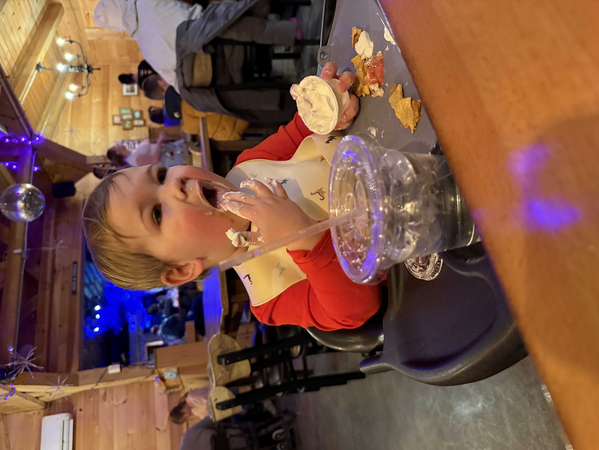
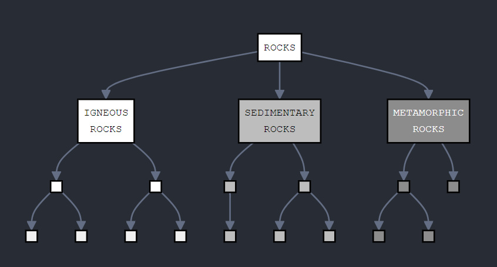
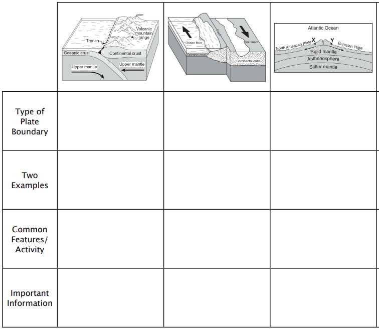

# Earth Science 🌎 <!--fit--->

## 🧑‍🏫 Mr. Porter

### 📆 2024-25

---

# 2025.03.06 **Earth Science**

##### **❓ of the 📅**: If you could be immortal, what age would you choose to stop aging at and why?

 

#### 📋 Agenda

1. Review Sheets

### 🎯 Goals

🥅 _Review for Tomorrow's Test_

### 📆 Upcoming

- Test tomorrow

---

# 2025.03.05 **Earth Science**

##### **❓ of the 📅**: Who is your celebrity crush?

 

#### 📋 Agenda

1. Whiteboard Summary with Partner
2. Quizziz: [joinmyquiz.com](https://quizizz.com/join?gc=727009&source=liveDashboard) OR CODE **727009**
3. Review Sheet

### 🎯 Goals

🥅 _Review for Friday's Test_

### 📆 Upcoming

---

# 2025.03.04 **Earth Science**

##### **❓ of the 📅**: Is tap water better than bottled water?

 

#### 📋 Agenda

1. Work on story

### 🎯 Goals

🥅 _Work on rock cycle story_

### 📆 Upcoming

- Test Friday: Minerals, Rocks, Rock Cycle

---
# 2025.03.03 **Earth Science**

##### **❓ of the 📅**: Would you rather live in the ocean or on the moon?

 

#### 📋 Agenda

1. Work on story

### 🎯 Goals

🥅 _Work on rock cycle story_

### 📆 Upcoming

- Test Friday: Minerals, Rocks, Rock Cycle

---

# 2025.02.28 **Earth Science**

##### **❓ of the 📅**: What topic could you give a 20-minute presentation on without any preparation?

 

#### 📋 Agenda

1. Work on Rock Cycle Story
2. Check-in at end of class: do we need more time?

### 🎯 Goals

🥅 _Write rock cycle story_

### 📆 Upcoming

---

# 2025.02.27 **Earth Science**

##### **❓ of the 📅**: Would you rather always be slightly late or super early?

 

#### 📋 Agenda

1. Rock Cycle Story

### 🎯 Goals

🥅 _Describe the rock cycle_

### 📆 Upcoming

---

<!--- _footer:   --->

**Task:**  To create a children’s storybook or comic strip that illustrates the different parts of the rock cycle and teaches them how different rocks form.

**Output:** Storybook OR Comic 

**Groups**: 

    - Group 1: Abby & Emma
    - Group 2: Grace & Amalya
    - Group 3: Parker & Brady
    - Group 4: Sydney & Ayva
    - Group 5: Sabrina and Addison
    - Group 6: Maya & Keira
    - Group 7: Lynx and Lexi
    - Group 8: Peter & Lucas

 

**Audience:**

---

# 2025.02.26 **Earth Science**

##### **❓ of the 📅**: What is your funniest family vacation moment?   

 

#### 📋 Agenda

1. Rocks Concept Map
1. Rock Cycle Notes
2. Rock Cycle Practice

### 🎯 Goals

🥅 _Practice working with rock cycle_

### 📆 Upcoming

- Rocks and Mineral Test Next Week

---

Fill in the Graphic organizer

            

---

# 2025.02.25 **Earth Science**

##### **❓ of the 📅**: How do you feel about clowns? 🤡

 

#### 📋 Agenda

1. Metamorphic Rock Lab
2. Metamorphic Rock Practice

### 🎯 Goals

🥅 _Identify Metamorphic Rocks_

### 📆 Upcoming

---

# 2025.02.24 **Earth Science**

##### **❓ of the 📅**: If you could instantly become an expert in something, what would it be?

 

#### 📋 Agenda

1. Metamorphic Rock Notes
2. Metamorphic Rock Practice

### 🎯 Goals

🥅 _Define Metamorphic Rocks and compare to igneous and sedimentary rocks_

### 📆 Upcoming

---

# 2025.02.14 **Earth Science**

##### **❓ of the 📅**: Who is your scientist? What did they do? Explain your valentine pun.

 

#### 📋 Agenda

1. Science Valentines
2. Answering Rock Questions on Whiteboards
3. Rocks & Minerals Review (**NOT A QUIZ**)
4. Rocks & Minerals Crossword

### 🎯 Goals

🥅 _Review Minerals, Sedimentary & Igneous Rocks_

### 📆 Upcoming

- 🏖️ Vacation!

---

# 2025.02.13 **Earth Science**

##### **❓ of the 📅**: Would you rather lose all of your money or all of your pictures?

 

#### 📋 Agenda

1. Do Now: Igenous Rocks Practice II
2. Metamorphic Rocks - Notes

### 🎯 Goals

🥅 _Practice with Igneous Rock Questions_

🥅 _Define and characterize Metamorphic Rocks_

### 📆 Upcoming

---

# 2025.02.12 **Earth Science**

##### **❓ of the 📅**: Would you give up three fingers in exchange for $1 million?

 

#### 📋 Agenda

1. Igneous Rock Review
2. Igneous Rock Identification Lab
3. Igneous Rock Practice

### 🎯 Goals

🥅 _Identify Igneous Rocks_

### 📆 Upcoming

---

# 2025.02.11 **Earth Science**

##### **❓ of the 📅**: What reality TV show would you star in?

 

#### 📋 Agenda

1. Review Sedimentary Rocks
2. Fix Sedimentary Rock Lab
3. Igneous Rock Practice

### 🎯 Goals

🥅 _Review Sedimentary Rocks_

🥅 _Fix Lab_ 

### 📆 Upcoming

---

# 2025.02.10 **Earth Science** Do Now 

## Answer in your notebook...

What is different about igneous and sedimentary rocks?

---

# 2025.02.10 **Earth Science**

##### **❓ of the 📅**: Who is your favorite Disney hero or heroine? Would you trade places with them?

 

#### 📋 Agenda

1. Finish Igneous Rock Notes
2. Sedimentary Rock Lab

### 🎯 Goals

🥅 _Practice Identifying Sedimentary Rocks_

### 📆 Upcoming

---

# 2025.02.07 **Earth Science**

##### **❓ of the 📅**: Hanging out by a camp fire, bonfire, or fireplace?

 

#### 📋 Agenda

1. Igneous Rock Notes
	1. Nearpod: **HVPTY**
2. Igneous Rock Practice 1

### 🎯 Goals

🥅 _Define Igneous rocks_

🥅 _Categorize Igneous rocks based on their characteristics_

### 📆 Upcoming

- Sedimentary Rocks Lab
- Igneous Rocks Lab 

---

# 2025.02.05 **Earth Science**

##### **❓ of the 📅**: What would your warning sign say?

 

#### 📋 Agenda

1. Sedimentary Rock ESRT Practice
2. Go over weathering test
3. Rock Notes

### 🎯 Goals

🥅 _Practice using Sedimentary Rock ESRT_

### 📆 Upcoming

- Sedimentary Rock Lab

---

# 2025.02.03 **Earth Science**

##### **❓ of the 📅**: Where are five places you really want to visit before you die?

 

#### 📋 Agenda

1. Mineral Regents Practice Questions
2. Sedimentary Rock Notes

### 🎯 Goals

🥅 _Practice with Minerals_

🥅 _Define Sedimentary Rock Characteristics_

| Block            | Start | End   |
| ---------------- | ----- | ----- |
| Block 3B         | 12:35 | 1:07  |
| Block 4          | 1:09  | 2:00  |

---

# 2025.01.31 **Earth Science**

##### **❓ of the 📅**: Would you rather live in a hot, sandy desert, or the North Pole?

 

#### 📋 Agenda

0. 10 Min: Finish Up Mineral Identification
1. CER Mineral Identification
2. Mineral Practice Packet

### 🎯 Goals

🥅 _Practice Identifying Different Minerals_

### 📆 Upcoming

---

# Claim-Evidence-Reasoning

## Claim:

_Mineral #1 is..._

## Evidence:

_What observations about your mineral lead to this conclusions_

## Reasoning:

_What are the defining properties of this mineral? (Hint: check your reference table)_

---

# 2025.01.30 **Earth Science**

##### **❓ of the 📅**: If you suddenly had a 25 hour day, what would you do with your extra hour?

 

#### 📋 Agenda

1. Finish (or start) Mineral Identification Lab
2. Discuss and compare results as a class   

### 🎯 Goals

🥅 _Identify Minerals_

### 📆 Upcoming

---

# 2025.01.28 **Earth Science**

##### **❓ of the 📅**: What was your first username?

 

#### 📋 Agenda

1. Finish Notes
2. Mineral Lab

### 🎯 Goals

🥅 __

### 📆 Upcoming

---

# 2025.01.27 **Earth Science**

##### **❓ of the 📅**: What is the best fry shape? 🍟

 

#### 📋 Agenda

1. Mineral Notes Nearpod: VHIRX

### 🎯 Goals

🥅 _Learn about minerals and their properties_

### 📆 Upcoming

---

<!--- class: january --->

# 2025.01.23 **Earth Science**

##### **❓ of the 📅**: Would you rather be the hero or the sidekick?

 

#### 📋 Agenda

1. Whiteboard Summary
2. Review of your choice

### 🎯 Goals

🥅 _Review for test tomorrow_

### 📆 Upcoming

---

# Whiteboard Summary:

**Remember - spend the first half making your board ***<u>without</u>*** your notes!**

- What do we need to know about Weathering, Erosion, Deposition, and the Water Cycle??
    - What are the **BIG IDEAS**?
    - What are some *important details*?
- Use words and pictures
- Don't just copy your notes - lots of words isn't great, try to summarize and simplify.

---

# 2025.01.22 **Earth Science**

##### **❓ of the 📅**: What came first? The chicken or the egg?

 

#### 📋 Agenda

1. Porosity & Permeability Demonstration Lab
2. Review

### 🎯 Goals

🥅 _Explore porosity & permeability_

### 📆 Upcoming

- Test Friday

---

# 2025.01.21 **Earth Science**

##### **❓ of the 📅**: Would you rather be able to run at 100 miles per hour or fly at 10 miles per hour?

 

#### 📋 Agenda

1. Review Packet

### 🎯 Goals

🥅 _Review for upcoming test_

### 📆 Upcoming

- Lab tomorrow
- Test **Friday**

---

# 2025.01.17 **Earth Science**

##### **❓ of the 📅**: Who is the most interesting person you’ve met and talked with?

 

#### 📋 Agenda

1. Finish Hydrology Notes
2. Quizzizz: **681059**

### 🎯 Goals

🥅 _Model Hydrology_

🥅 _Practice Questions_

### 📆 Upcoming

---

<!--- _footer:  --->

## Do Now: Recall Practice - answer without your notes

1. When rocks rub and bounce against each other during transport, we call this process _______. 
2. Compare and contrast how rocks are broken down by frost action versus plant growth. 
3. Explain why sediment deposition is greatest at two specific locations in a river system. 
4. Describe the complete process of how a kettle lake forms
5. Analyze how particle characteristics affect deposition rates. Include three specific particle properties and explain how each one influences how quickly the particle will be deposited.

---

# 2025.01.16 **Earth Science**

##### **❓ of the 📅**: What’s your favorite month?

 

#### 📋 Agenda

1. Recall Practice 
2. Hydrology Notes
3. Practice

### 🎯 Goals

🥅 _Define & Model Hydrology_

### 📆 Upcoming

---

# 2025.01.15 **Earth Science**

##### **❓ of the 📅**: If you could start a charity, what would it be for?

 

#### 📋 Agenda

1. River Erosion Lab
2. Finish _The Erosional-Depositional Steam System Practice Questions_

### 🎯 Goals

🥅 _Model River Erosion_

### 📆 Upcoming

---

# 2025.01.14 **Earth Science**

##### **❓ of the 📅**: What is your silliest fear? 🐍 🕸️

 

#### 📋 Agenda

1. Stream Velocity & Sediment Transport
2. The Erosional-Depositional Steam System

### 🎯 Goals

🥅 _Apply Erosion and deposition knowledge_

---

# 2025.01.13 **Earth Science**

##### **❓ of the 📅**: If you became president, what’s the first thing you would do?

 

#### 📋 Agenda

1. Notes: Deposition
    - Nearpod: **R275L**
2. Notes whiteboard share out
2. Practice Questions

### 🎯 Goals

🥅 _Define stream deposition characteristics_

### 📆 Upcoming

---

# 2025.01.09 **Earth Science**

##### **❓ of the 📅**: Would you rather lose both legs, both arms, or one of each?

 

#### 📋 Agenda

1. Finish Lab (⏲ 15 Minutes)
2. Glaciers Questions (⏲ 20 Minutes)
3. Go Over Lab & Questions at **1:15**

4. On your own: Nearpod: **C67YM**
5. Stream Practice

### 🎯 Goals

🥅 _Finish Glacier Lab_

🥅 _Learn about erosional and depositional processes in streams_

---

# 2025.01.08 **Earth Science**

##### **❓ of the 📅**: If you could have dinner with anyone in the world, who would it be?

 

#### 📋 Agenda

1. Finish Glacier Lab
2. Glacier Multiple Choice Practice
3. Go over Glacier Lab & MC Practice      

### 🎯 Goals

🥅 _Explore Glacier simulation and growth_

---

# 2025.01.07 **Earth Science**

##### **❓ of the 📅**: Should pizza be cut in triangles or squares?

 

#### 📋 Agenda

1. Do Now - Agents of Erosion
1. Glacier Lab
2. Glacier Questions 

### 🎯 Goals

🥅 __

### 📆 Upcoming

---

# 2025.01.06 **Earth Science**

##### **❓ of the 📅**: If you had to be a villian from a movie, which movie would you pick?

 

#### 📋 Agenda

1. Glacier Notes
2. Glacier Simulation Lab

### 🎯 Goals

🥅 _Define Glacier Features_

🥅 _Explore Glacial Movement_

### 📆 Upcoming

---

# 2025.01.03 **Earth Science**

##### **❓ of the 📅**: Would you rather have unlimited battery life on all of your devices or have free WiFi wherever you go?

 

#### 📋 Agenda

1. Do Now: W & E Reading
2. Hand Back Tests
3. Gallery Walk -> Geo Events 
4. Erosion Matching Sheet
5. Climate Graph Sheet

### 🎯 Goals

🥅 _Identify Agents of Erosion_

🥅 _Interpret Climate's impact on W&E from graphical data_

### 📆 Upcoming

---

# 2025.01.03 **Earth Science**

##### **❓ of the 📅**: Question

 

#### 📋 Agenda

1. Hand Back Tests
2. Gallery Walk - Geological Event Posters
3. Notes continued

### 🎯 Goals

🥅 _Erosion_

### 📆 Upcoming

---

# 2025.01.02 **Earth Science**

##### **❓ of the 📅**: Do you have a New Year's Resolution?

 

#### 📋 Agenda

1. Weathering & Erosion Notes

### 🎯 Goals

🥅 _Define weathering and erosion_

🥅 _Look at factors of erosion_

### 📆 Upcoming

---

<!--- class: winter --->

# 2024.12.20 **Earth Science**

##### **❓ of the 📅**: Who is traveling the furthest this break?

 

#### 📋 Agenda

1. Finish Canva Poster
2. Gallery Walk & Turn in poster

### 🎯 Goals

🥅 _Present Geological Event Project_

### 📆 Upcoming

---

# 2024.12.19 **Earth Science**

##### **❓ of the 📅**: What is a good stocking stuffer?

 

#### 📋 Agenda

1. Geological Event Project

### 🎯 Goals

🥅 __

### 📆 Upcoming

---

# 2024.12.17 **Earth Science**

##### **❓ of the 📅**: Which holiday has the best food?

 

#### 📋 Agenda

1. Famous Geological Event Poster Project 

### 🎯 Goals

🥅 _Research Famous Geological Event_

### 📆 Upcoming

- Assessment Tomorrow 

---

<!--- class: --->

# Famous Geological Events Project
## Earth-Shaking Research! 🌋🌊

---

# Project Overview
Research a famous **volcanic eruption** or **earthquake** and create a digital poster about:
- The geological event itself
- Its immediate impacts
- Long-term effects on society

---

# Timeline

- **Tuesday (40 mins)**
  - Pick your event
  - Research Event

- **Wednesday (?? Time)**
    - Complete research and start poster

 

- **Thursday (40 mins)**
  - Complete research
  - Design your poster

- **Friday (60 mins)**
  - Digital gallery walk
  - Share and discuss

---

# Choose Your Event!
Examples include:
- Mount St. Helens (1980)
- 2004 Indian Ocean Earthquake/Tsunami
- 1906 San Francisco Earthquake
- Pompeii/Mount Vesuvius (79 CE)
- Krakatoa Eruption (1883)
- Mount Pinatubo (1991)

*First come, first served - no duplicate events!*

---

# Your Digital Poster Should Include:

1. **Event Details**
   - When and where?
   - What happened geologically?
   - How big was it?

2. **Impacts**
   - Immediate effects
   - Long-term changes
   - Scientific discoveries

---

# Research Requirements

- Use reliable sources
  - .gov and .edu websites
  - Scientific organizations
  - Historical records

- Include both:
  - Scientific data
  - Human impact stories

---

# Creating Your Poster

Using Canva, you'll need:
- Clear title
- Organized sections
- Relevant images
- Data visualization
- Sources cited

*Design tips and template coming up!*

---

# Friday's Gallery Walk

- Class splits into two groups
- 20 minutes per group
- Be ready to:
  - Present your poster (2 mins)
  - Answer questions
  - Give feedback to others

---

# Grading Focus Areas

- Scientific understanding
- Research quality
- Visual design
- Information organization
- Impact analysis

---

<!--- class: winter --->

# 2024.12.16 **Earth Science**

##### **❓ of the 📅**: What fictional world or place would you like to visit?

 

#### 📋 Agenda

1. Whiteboard Summary ~ 40 Minutes
2. Choose your study method:
    - [Way too much practice](https://docs.google.com/document/d/1O8satMHFWY8scWYl-bu-LAKiHK_fp1etFefbLbmIz8U/edit?tab=t.0)
    - Print out practice
    - Make a review sheet
    - Other (check idea with Mr. Porter)

### 🎯 Goals

🥅 _Summarize Earth's Interior Unit_

### 📆 Upcoming

- Earth's Interior Assessment Wednesday

---

# Whiteboard Summary:

- What do we need to know about Earth's Interior?
    - What are the **BIG IDEAS**?
    - What are some *important details*?
- Use words and pictures
- Don't just copy your notes - lots of words isn't great, try to summarize and simplify.

_⚠️ Do this first **without** any notes. Then review your notes and add to your board_

---

# 2024.12.13 **Earth Science**

##### **❓ of the 📅**: Do you believe that Friday the 13th is bad luck?

 

#### 🍅 Ketchup

##### "Catch Up"

- Finish Regents Practice in Canvas

#### 🟨 Mustard

##### "Must do"

- Topic 3 Review Sheet (check answers when you finish)

#### 🟩 Relish

##### "Extra"

- Plotting Epicenters Worksheet

---

# 2024.12.12 **Earth Science**

##### **❓ of the 📅**: What is your favorite road trip snack?

 

#### 📋 Agenda

Practice Day - Assessment Prep

- [Quizizz](https://quizizz.com/join?gc=703917&source=liveDashboard): **703917**
- Regents Practice on Canvas (**Earth's Interior Regents Practice 12/12**)

### 🎯 Goals

🥅 _Prepare for upcoming assessment on Earth's Interior_

### 📆 Upcoming

---

# 2024.12.11 **Earth Science**

##### **❓ of the 📅**: What is the proper length of a playlist?

 

#### 📋 Agenda

1. Notes - Richter Scale 
    - Nearpod Code: **5ZUG9**
2. Finish Earthquake practice grid

### 🎯 Goals

🥅 _Measure Earthquake Magnitude_

### 📆 Upcoming

- Quiz next week on Earth's Interior
    - Practice tomorrow 

---

# 2024.12.10 **Earth Science**

##### **❓ of the 📅**: Would you rather meet your travel back in time to meet your ancestors or to the future to meet your descendants?    

 

#### 📋 Agenda

1. Do Now: Finish Sheet from Last Class
2. Earthquake Epicenter Lab
2. Additional Earthquake Practice 

### 🎯 Goals

🥅 _Locate Epicenter locations from P&S Wave Data_

### 📆 Upcoming

- Earth's Interior Quiz next week
    - we will practice Friday AND next week before quiz

---

# 2024.12.09 **Earth Science**

##### **❓ of the 📅**: If you could pick any wild animal to keep as a pet, which would it be?

 

#### 📋 Agenda

1. Do Now - Earth Science Epicenter
2. Lab -> Finding Epicenter

### 🎯 Goals

🥅 _Use P & S Wave data to locate epicenter of an earthquake_

### 📆 Upcoming

---

# 2024.12.06 **Earth Science**

##### **❓ of the 📅**: If you were so wealthy you didn’t need to work, what would you do with your time?

 

#### 📋 Agenda

1. Do Now - Shadow Zone Reading
1. Epicenter notes
2. Earthquake Practice 
    - ESRT
    - Reading Seismographs

### 🎯 Goals

🥅 _Locate Earthquakes using P & S Waves_

### 📆 Upcoming

---

# 2024.12.05 **Earth Science**

##### **❓ of the 📅**: What is the best board game?

 

#### 📋 Agenda

1. Do Now: Join Nearpod:
    - Coode: **YAFWZ**
3. Notes on Earthquakes

### 🎯 Goals

🥅 _Define Earthquakes_

🥅 _Use models to find Earthquake Epicenters_

### 📆 Upcoming

---

# 2024.12.04 **Earth Science**

##### **❓ of the 📅**: What is your favorite Disney movie?

 

#### 📋 Agenda

1. Finish Volcano Lab: ⏲️ 25 Minutes
2. Earthquake Notes
    - What are they
    - How can we calculate them

### 🎯 Goals

🥅 _Define Earthquake terms_

🥅 _Explore Locating Earthquakes_

🥅 _Calculate Earthquake Epicenters_

### 📆 Upcoming

---

# 2024.12.03 **Earth Science**

##### **❓ of the 📅**: Who would you most want to prank?

 

#### 📋 Agenda

1. Finish Volcanoes Lab

### 🎯 Goals

🥅 _Model what happens in an eruption and its impact of the different 'spheres'_

### 📆 Upcoming

---

# 2024.12.02 **Earth Science**

##### **❓ of the 📅**: What is your ideal burger 🍔 (or veggie burger)?

 

#### 📋 Agenda

1. Volcanoes Map Online Lab
    - Find link to online portion in canvas

### 🎯 Goals

🥅 _Explore impacts of volcanic eruptions_

### 📆 Upcoming

---

<!--- class: thanksgiving --->

# 2024.11.26 **Earth Science**

##### **❓ of the 📅**: What celebrity would you like to meet for lunch?

 

#### 📋 Agenda
1. Finish Notes
3. Volcanic Map Story 🌋

### 🎯 Goals

🥅 _Start Mapping Volcanoes_

### 📆 Upcoming

---

# 2024.11.25 **Earth Science**

##### **❓ of the 📅**: **White or dark turkey meat? What is your favorite dish at Thanskgiving?**

 

#### 📋 Agenda

1. Do Now: Finish (or start) Regents Practice
2. Review Boundary Lab
3. Volcanoes Nearpod

### 🎯 Goals

🥅 __

### 📆 Upcoming

---

# 2024.11.21 **Earth Science**

##### **❓ of the 📅**: What is your hidden talent?

 

#### 📋 Agenda

1. Finish Seafloor Spreading Lab
2. Earth's Interior - Regents Practice
3. OR Earthquakes Lab

### 🎯 Goals

🥅 _Practice Regents Questions on Earth's Interior_

### 📆 Upcoming

---

# 2024.11.20 Do Now 

Fill in the Following Chart:

---

# 2024.11.20 **Earth Science**

##### **❓ of the 📅**: Is your glass half full or half empty?

 

#### 📋 Agenda

1. Do Now
2. Sea Floor Spreading

### 🎯 Goals

🥅 _Map Sea Floor Spreading_

### 📆 Upcoming

---

# Sea-Floor Spreading Lab
## Introduction Slides

---

# Welcome to Sea-Floor Spreading Lab

## Goals of Today's Lab:
* 🎯 Understand magnetic reversals in oceanic crust
* 📊 Learn key evidence for sea-floor spreading
* 📈 Practice data analysis and plotting skills

*Remember: This lab connects directly to our study of plate tectonics!*

---

# The Discovery - A Scientific Detective Story

## Historical Context (1950s):
* Scientists were searching for submarines 🚢
* Used magnetic detection equipment
* Made an unexpected discovery!

## What They Found:
* Strange magnetic patterns on the ocean floor
* Symmetrical "stripes" of magnetism

---

# Magnetic Reversals and Rock Formation

## Key Concepts:
* Earth's magnetic field periodically "flips"
  * North becomes South
  * South becomes North
  * Happens every few hundred thousand years

---

# Magnetic Reversals and Rock Formation

## How Rocks Record Magnetism:
1. Magma rises at mid-ocean ridges
2. Magnetic minerals align with Earth's field
3. Rock solidifies, preserving the alignment
4. Creates a permanent record

---

# Today's Investigation

## What You'll Do:
1. Plot real magnetic data from the ocean floor
2. Look for patterns on both sides of the ridge
3. Calculate ages and distances
4. Draw conclusions based on evidence

---

# Making Your Plot

## Step-by-Step Instructions:
1. Label your axes
   * X-axis: Longitude (30°W to 15°E)
   * Y-axis: Age (0 to 180 million years)

2. Plot the points
   * Use one color for Normal polarity (N)
   * Use different color for Reversed polarity (S)

3. Mark the ridge location 

---

# Analysis Tips

## Look For:
* Symmetry in the pattern
* Age relationships
* Distance relationships

## Think About:
* Why are the patterns symmetrical?
* What does this tell us about sea-floor spreading?
* How does this support plate tectonic theory?

---

# Time Management:
* Plotting data: 15 minutes
* Analysis questions: 20 minutes
* Class discussion: 10 minutes

---

---

# 2024.11.19 **Earth Science**

##### **❓ of the 📅**: What’s your favorite sandwich and why?

 

#### 📋 Agenda

1. Do Now:
    - Grab Moving Plates handout and complete
2. Finish Notes 
3. ESRT Fault Practice
4. Sea-Floor Spreading Lab

### 🎯 Goals

🥅 _Identify faults in ESRT_

### 📆 Upcoming

---

# 2024.11.18 **Earth Science**

##### **❓ of the 📅**: Would you rather live where it only snows or the temperature never falls below 100 degrees?

 

#### 📋 Agenda

1. **Do Now:** _Join Nearpod (Code: **3SK6Y**) and answer inital questions_
2. Nearpod Notes
3. ESRT Plate Tectonic Practice 

### 🎯 Goals

🥅 _Use ESRT to find properties of plates_

### 📆 Upcoming

---

# 2024.11.15 **Earth Science** Do Now

1. Arrange your continent puzzle. Be prepared to explain your arrangement.
2. 📖 Read _The Historical Perspective_ section of Continental Drift Post in Canvas

---

# 2024.11.15 **Earth Science**

##### **❓ of the 📅**: **Which person in your life is most likely to secretly be a time traveler?**

 

#### 📋 Agenda

1. Do Now 
2. Fishbowl Share Evidence for Continental Drift
3. Nearpod Notes: Continental Drift

### 🎯 Goals

🥅 _Explain Continental Drift_

### 📆 Upcoming

---

# 2024.11.14 **Earth Science**

##### **❓ of the 📅**: **How long would you be able to last withouth your smart devices (phone, computer, watch, etc)? 1 Hour? 1 Day? 1 Week?**

 

#### 📋 Agenda

1. ⏱ 15 Min: Finish Earth's Interior Packet
2. Check Answers
3. Pangea Puzzle

### 🎯 Goals

🥅 _Model movement of Earth's Tectonic Plates_

### 📆 Upcoming

---

# Puzzle

1. ✂️ Cut out your puzzle with your table partner
2. 🧩 Arrange your continents together to form a supercontinent 
2. 🗣️ When you are satisfied with the 'fit' of the continents, discuss the evidence with your partners and decide if the evidence is compelling or not. Explain your decision and reasoning on the evidence.
4. 📖 Read _The Historical Perspective_ section of Continental Drift Post in Canvas

---

# Evidence for Continental Drift 

Read your assigned section and whiteboard your evidence for Wegener's Theory. ***Everyone*** Needs to be prepared to share their assigned evidence.

Sections:
1. Ocean Floor Mapping
2. Magnetic Striping and Polar Reversals 
3. Seafloor Spreading
4. Concentration of Earthquakes

---

# Rotate and Present

1. Rearrange into new groups (assigned by me)
2. When you are at your original group's board, present the evidence for Wegener's theory of continental drift
3. Whole group discussion 

---

# 2024.11.13 **Earth Science**

##### **❓ of the 📅**: What slang are you really happy went out of fashion?

 

#### 📋 Agenda

1. Do Now: Finish Layers of Earth Lab
2. Earth's Interior Worksheet (Skip #10)
3. Continental Drift Nearpod and notes

### 🎯 Goals

🥅 _Model Earth's Interior_

### 📆 Upcoming

---

# 2024.12.11 **Earth Science** Do Now

## Go to Nearpod use code: **T2G3Y** & Answer Questions

You may use your Earth Science Reference Table 

---

# 2024.11.12 **Earth Science**

##### **❓ of the 📅**: **Would you rather live without heat and AC or live without social media?**

 

#### 📋 Agenda

1. Do Now 
2. Lab:  A Slice of Planet Earth

### 🎯 Goals

🥅 _Model a Earth by looking at a slice of Earth's interior._

### 📆 Upcoming

---

# 2024.11.07 **Earth Science**

##### **❓ of the 📅**: ***What animal do you think is the creepiest?***

 

#### 📋 Agenda

1. Layers of the Earth Notes
2. Layers of the Earth Practice

### 🎯 Goals

🥅 _Describe the properties of the different layers of the Earth_

### 📆 Upcoming

---

# 2024.11.06 **Earth Science**

##### **❓ of the 📅**: **If you were to open a store, what would you sell?**

 

#### 📋 Agenda

1. Astronomy Test

### 🎯 Goals

🥅 _Show what you know about astronomy!_

### 📆 Upcoming

---

# 2024.11.05 **Earth Science**

##### **❓ of the 📅**: What was your favorite recess game in elementary school.

 

#### 📋 Agenda

1. Test Review

### 🎯 Goals

🥅 _Review for test tomorrow_

### 📆 Upcoming

---

# 2024.11.01 **Earth Science**

##### **❓ of the 📅**: If you were one of Snow White’s dwarfs, which one would you be?

 

#### 📋 Agenda

1. Astronomy Review Whiteboard Brain Dump - ⏱️ 10 Minutes
2. Astronomy Whiteboard Review - with notes - ⏱️ 10 minutes
3. Compare with other boards

### 🎯 Goals

🥅 _Review our Astronomy Unit_

### 📆 Upcoming

- Astronomy Test Wednesday

---

# Whiteboard Summary:

- What do we need to know about Astronomy?
    - What are the **BIG IDEAS**?
    - What are some *important details*?
- Use words and pictures
- Don't just copy your notes - lots of words isn't great, try to summarize and simplify.

_⚠️ Do this first **without** any notes. Then review your notes and add to your board_

---

<!--- class: halloween--->

---

# 2024.10.31 **Earth Science** Do Now 👻

1. Finish drawing the orbit and habitable zone for your celestial object. 
2. Determine if your celestial object falls in the habitable zone. 
3. Be prepared to present and defend your choice

---

# 2024.10.31 **Earth Science**

##### **❓ of the 📅**: What was your best Halloween costume?

 

### 📋 Agenda

1. Do Now & Habitable Zones 
2. Finding Earth 2.0 - Section 4 
3. Scale and Structure of the Universe 
4. Finding Earth 2.0 -  Section 5

### 🎯 Goals

🥅 _Find Earth 2.0_

### 📆 Upcoming

---

<iframe width="1150" height="715" src="https://www.youtube.com/embed/gIbfYsQfNWs?si=VACRw2O_Tp_hP5D5" title="YouTube video player" frameborder="0" allow="accelerometer; autoplay; clipboard-write; encrypted-media; gyroscope; picture-in-picture; web-share" referrerpolicy="strict-origin-when-cross-origin" allowfullscreen></iframe>

---

# 2024.10.30 **Earth Science**

On your chromebooks research and read about "_the habitable zone_". Be prepared to describe this term to the class. 

Consider:
- what does it mean? 
- what is Earth's habitable zone?
- do other exoplanets fall in an habitable zone?

---

# 2024.10.30 **Earth Science**

##### **❓ of the 📅**: What is the weirdest food you've tried?

 

#### 📋 Agenda

1. Do Now
2. Take out _**Orbital Motion**_ Packet
1. Orbits and the habitable zone

### 🎯 Goals

🥅 _Determine if exoplanets orbit in the habitable zone_

### 📆 Upcoming

---

# Orbital Motion - Evaluate 

1. Calculate the scaled distance between the foci for each celestial object
2. Model your celestial objects ***Orbit*** and ***Habitable Zone***
3. Determine if your celestial object stays in the habitable zone. 

**Notes**:

- I will bring you string to draw your ellipse on whiteboard. 
- Also use your string and different colored markers to show your habitable zone

---

# 2024.10.29 **Earth Science**

##### **❓ of the 📅**: Who is the most competitive person you know?

 

#### 📋 Agenda

1. Scale of Solar System Lab
2. Finish Regents Practice on Canvas

### 🎯 Goals

🥅 _Model the scale of the solar system._

### 📆 Upcoming

---

# 2024.10.28 **Earth Science**

##### **❓ of the 📅**: What smell brings back great memories?

 

#### 📋 Agenda

Practice Day:

1. Reference Table Practice
2. Ellipse Calculation Worksheet
3. Regents Practice on Canvas

### 🎯 Goals

🥅 _Practice answering questions about Structure of the Universe_

### 📆 Upcoming

---

# 2024.10.24 **Earth Science**

##### **❓ of the 📅**: **What is one thing you thought was weird or ridiculous until you gave it a try?**

 

#### 📋 Agenda

1. Finish Ellipse Lab
2. Reference Table Practice
3. Ellipse Practice

### 🎯 Goals

🥅 _Draw an ellipse_

🥅 _Calculate eccentricity_

🥅 _Determine shape of orbits based on eccentricity_

### 📆 Upcoming

---

# 2024.10.23 **Earth Science**

##### **❓ of the 📅**: If you invited dragons 🐉 to a taco party, would you give them 🌶️ spicy salsa? 🥵🔥

 

#### 📋 Agenda

1. Orbits Simulation
2. Elliptical Orbits
3. Ellipse Lab

### 🎯 Goals

🥅 _Model orbits with ellipses_

🥅 _Calculate the eccentricity of an ellipse_

### 📆 Upcoming

---

# 2024.10.22 **Earth Science**

#### **❓ of the 📅**: **What’s the best pizza topping? 🍕**

 

### 📋 Agenda

1. Rumors - Orbits
2. Explore - Graphing Orbit Data
3. Explore - Orbit Simulation

### 🎯 Goals

🥅 _Describe orbital paths of planets_

### 📆 Upcoming

---

# 2024.10.21 **Regents Earth Science**

##### **❓ of the 📅**: **Would you rather watch a movie on your TV at home or on the big screen in the theater, and why?**

 

#### 📋 Agenda

1. Finish Phases Simulation
2. Condensation Temperatures
3. Explain 2
3. [Reading: How Planets Form](https://lasp.colorado.edu/outerplanets/solsys_planets.php)
4. What Makes Jovian Planets so Gassy?

### 🎯 Goals

🥅 _Show what you know about astronomy!_

### 📆 Upcoming

---

# 2024.10.18 **Earth Science**

##### **❓ of the 📅**: What would your pirate name be?

 

### 📋 Agenda

1. Explore 2 - Temperature's effect on density and the formation of our solar system

### 🎯 Goals

🥅 _Describe how temperature effects the formation of our solar system_

### 📆 Upcoming

---

<!--- _footer:  --->

# 2024.10.17 **Earth Science**

##### **❓ of the 📅**: **If you found that food was falling from the sky, what food would you want to be falling? What food would you NOT want to be falling?**

 

### 📋 Agenda

1. Hunting for Earth 2.0
    - Part 2 -> What kind of dectection method can you use?
    - Part 3 -> What kind of star is likely to host an Earth-like planet?
2. Solar System Patterns
4. Density

### 🎯 Goals

🥅 _Complete Performance Tasks_

🥅 _Define Density_

### 📆 Upcoming

---

# 2024.10.16 **Earth Science**

##### **❓ of the 📅**: Would you rather have invisibility or flight?

 

### 📋 Agenda

1. Do Now - Hand in Stellar Evolution Packet
2. New Lab Groups
3. Solar System Structure Intro
4. What is Density? 

### 🎯 Goals

🥅 _Begin Exploration of Explanation for Structure of Universe_

### 📆 Upcoming

---

# 2024.10.15 **Earth Science**

##### **❓ of the 📅**: **You can have an unlimited supply of one thing for the rest of your life, what is it? Sushi? Scotch Tape? (You can't say money or anything directly related to money)**

 

#### 📋 Agenda

1. Finish Stellar Evolution Packet
2. Finding Exoplanets
3. Eyes on Expoplanets

### 🎯 Goals

🥅 _What is an expoplanet? Where are they?_

### 📆 Upcoming

---

# 2024.10.10 **Earth Science**

##### **❓ of the 📅**: What is your favorite kind of apple?

 

### 📋 Agenda

1. Do Now - Stellar Evolution Practice Quiz (**In Canvas**)
2. Finishing Stellar Evolution Packet
3. Habitable Zones & Finding Exoplanets

### 🎯 Goals

🥅 _Explain Stellar Evolution_

### 📆 Upcoming

- Quiz Tomorrow

---

# 2024.10.09 **Earth Science**

##### **❓ of the 📅**: Would you rather a vacation at the beach or an adventure in the mountains?

 

### 📋 Agenda

1. Stellar Evolution Notes & Discussion
2. Explaining Stellar Evolution
3. Nucleosynthesis 

### 🎯 Goals

🥅 _Explain stellar evolution and the different lifecycles of stars_

### 📆 Upcoming
- Quiz Friday (we will practice tomorrow)

---

# 2024.10.08 **Earth Science**

#### **❓ of the 📅**: **You have to sing karaoke, what song do you pick? 🎤**

 

### 📋 Agenda

1. Do Now: Finish Star in a box
2. Stellar Evolution Summary & Notes
3. Explain: Develop a model for patterns and stability of stars

### 🎯 Goals

🥅 _I can develop an explanatory model for patterns of stability and change observed in stars_

### 📆 Upcoming
- Quiz Friday (We will practice on Thursday)

---

# 2024.10.07 **Earth Science**

##### **❓ of the 📅**: **Would you rather live swim in the world's coldest water or eat the world's hottest pepper?🥶🥵** 

 

### 📋 Agenda

1. Do Now - Go to _Star in a box_ simulation and work on Explore 1 with your table partner
    - Link is in Canvas (Modules -> Materials -> Stellar Evolution Links)

### 🎯 Goals

🥅 _Determine the relationship between star mass and the lifecycle of the star_

### 📆 Upcoming

- Stellar Evolution Quiz on ***Friday***

---

# 2024.10.04 **Earth Science**

##### **❓ of the 📅**: What skill or talent do you most want to learn?

 

#### 📋 Agenda

1. HR Diagram Exploration - Lab

### 🎯 Goals

🥅 _Show what you know about astronomy!_

### 📆 Upcoming

---

# Explore 2 - HR Diagram

1. Create Grid on Two Tables
2. Plot stars on Table
3. What patterns do we notice?
4. Organize findings in packet - **Explore 2**

---

---

<!--- class: halloween
--->

# 2024.10.02 **Earth Science** Do Now

Work through HR Diagram Simulation questions. (Link to simulation in Canvas: Modules➡️Stellar Evolution Links)

Write answer to questions in your notebook. 

You may work with your table partner on this. 

---

# 2024.10.02 **Earth Science**

##### **❓ of the 📅**: What secrets do you think your pet would spill about you, if they could talk?

 

### 📋 Agenda

1. Do Now
2. HR Diagram Simulation Summary
3. HR Diagram Practice Worksheet
4. Life cycle of a star

### 🎯 Goals

🥅 _Read HR Diagram_ 

🥅 _Explain the life cycle of a star_

### 📆 Upcoming

---

<!--- class: halloween --->

# 2024.10.01 **Earth Science** Do Now

1. Pick up handout on front table
2. Read the **short** article and answer the first two questions

---

# 2024.10.01 **Earth Science** 🎃

##### **❓ of the 📅**: **Is cake 🍰 better than ice cream 🍨?**

 

### 📋 Agenda

1. Do Now 
2. Starting Stellar Evolution 
3. Hertzsprung-Russell Diagram
4. HR Diagram Practice

### 🎯 Goals

🥅 _Learn to read a Hertzsprung-Russell Diagram_

### 📆 Upcoming

---

# 2024.09.30 **Earth Science** Do Now 

### Take ⏱️ 5 Minutes and ✍️ write...

##### _everything you know or think you know about gravity_ <!--fit--->

- Consider:
    - What is it?
    - What causes it?
    - Does it change?
    - Do you have gravity?

---

<!-- _footer: 🤔 Did you get better at science today? Did you help make someone else better today? --->

# 2024.09.30 **Earth Science** 

##### **❓ of the 📅**: What household chore do you actually enjoy?

#### 📋 Agenda

1. Do Now
2. Gravity Lab
3. APOD Share

### 🎯 Goals 

🥅 _What makes life sustainable on Earth?_

---

<!-- _footer: 🤔 Did you get better at science today? Did you help make someone else better today? --->

# 2024.09.27 **Earth Science** 

##### **❓ of the 📅**: What is the best thing about fall?

#### 📋 Agenda

1. Quiz
2. APOD Photo Explanation

### 🎯 Goals 

🥅 _What makes life sustainable on Earth?_

---

# Astronomy Photo of the Day 📸

1. Go to [https://apod.nasa.gov/](https://apod.nasa.gov/apod/astropix.html)
2. Either click the previous button to look at other photos OR go to the archive to browse photos
2. Find a photo that you think is interesting. 
3. Add the photo to the class slideshow w/ Title
3. Research your photo:
    - What is in your photo?
    - Why is it interesting?
    - Does it related to anything we've leared so far?

---

# 2024.09.26 **Earth Science** Do Now

Do X rays or Infrared Waves have higher frequencies? Which has more energy? How do you know?

---

<!-- _footer: 🤔 Did you get better at science today? Did you help make someone else better today? --->

# 2024.09.26 **Earth Science** 

##### **❓ of the 📅**: Is it *OK* to ask the genie for infinite wishes?

#### 📋 Agenda

1. Do Now 
2. Big Bang Theory Notes & Summary
3. Practice Quizz -> On Canvas 
4. Evaluate (How many Planets?)

### 🎯 Goals 

🥅 _What makes life sustainable on Earth?_

### Reminder

- ***Quiz tomorrow***

---

<!--- class: earthSci --->

# 2024.09.24 **Earth Science** Do Now

1. Go to Canvas ➡️ Origin of Universe Model ➡️ Elaborate Links ➡️ Spectrometry 
2. Read through Spectrometry Module
3. Be prepared to share what is, how it is done, and why its important for us to know about in reference to the origin of the universe

---

<!-- _footer: 🤔 Did you get better at science today? Did you help make someone else better today? --->

# 2024.09.24 **Earth Science** 

##### **❓ of the 📅**: Would you rather be a dragon or own a dragon?

#### 📋 Agenda

1. Do Now ✔️
2. Elaborate & Big Bang Theory :boom:
3. Evaluate - Is there life out there? 👽 

### 🎯 Goals 

🥅 _What makes life sustainable on Earth?_

### **Note**: This is a cellphone free classroom 📵

---

<!-- _footer: 🤔 Did you get better at science today? Did you help make someone else better today? --->

# 2024.09.23 **Earth Science** 

##### **❓ of the 📅**: If animals could talk, which one do you think would be the most annoying?

#### 📋 Agenda

1. Finish Doppler Worksheet
2. Compelte Balloon Mini Modeling Experiment in Packet
3. Regents Questions Practice on Canvas

### 🎯 Goals 

🥅 _What makes life sustainable on Earth?_

### **Note**: This is a cellphone free classroom 📵

---

<!-- _footer: 🤔 Did you get better at science today? Did you help make someone else better today? --->

# 2024.09.20 **Earth Science** 

##### **❓ of the 📅**: What animal would you want for a non-traditional pet? (i.e. not a dog, fish or cat)

#### 📋 Agenda

1. Finish Explain - Expanding Universe?
2. Balloon Mini Experiment
3. Elaborate 

### 🎯 Goals 

🥅 _What makes life sustainable on Earth?_

### **Note**: This is a cellphone free classroom 📵

---

# 2024.09.20 

## Your To-do List:

1. Explain Summary Pages
2. Balloon Modeling - Universe
3. Doppler Worksheet
4. Canvas - Earth Science Regents Practice - Posted In Modules

---

<!-- _footer: 🤔 Did you get better at science today? Did you help make someone else better today? --->

# 2024.09.19 **Earth Science** 

##### **❓ of the 📅**: What's your favorite family recipe?

#### 📋 Agenda

1. Reframe yesterday's lab
2. What is the doppler effect?
3. What is the Electromagnetic Spectrum?
4. Model 3 and moving galaxies

### 🎯 Goals 

🥅 _What makes life sustainable on Earth?_

### **Note**: This is a cellphone free classroom 📵

---

<!-- _footer: 🤔 Did you get better at science today? Did you help make someone else better today? --->

# 2024.09.17 **Earth Science** 

##### **❓ of the 📅**: If one superhero was real, which one should it be?

#### 📋 Agenda

0. Pick up Handout on Front lab table
1. Exoplanet Hunt Questions
2. Origins of the Universe Brainstorm
3. Exploring Wave properties of moving objects

### 🎯 Goals 

🥅 _What makes life sustainable on Earth?_

### **Note**: This is a cellphone free classroom 📵

---

<!-- _footer: 🤔 Did you get better at science today? Did you help make someone else better today? --->

# 2024.09.13 **Earth Science** 

##### **❓ of the 📅**: What extracurriculars do you participate in?

#### 📋 Agenda

1. Is life sustainable on planet Earth?
2. Question Development

### 🎯 Goals 

🥅 _Graphing Best Practices_ 

### 🏠 Homework

- Finish Measurement Olympics Graphs (Due Friday)

### **Note**: This is a cellphone free classroom 📵

---

<!-- _footer: 🤔 Did you get better at science today? Did you help make someone else better today? --->

# 2024.09.12 **Earth Science** 

##### **❓ of the 📅**: Do you have any weird/unique routines or superstitions? (For example: I ***have*** to put on my left sock before my right sock, and the same for shoes, left on first.)

#### 📋 Agenda

1. 20 Minutes: Finish Measurement Olympics Graphs 
2. Is it probable that another planet like Earth exists? 

### 🎯 Goals 

🥅 _Graphing Best Practices_ 

### 🏠 Homework

- Finish Measurement Olympics Graphs (Due Friday)

### **Note**: This is a cellphone free classroom 📵

---

# CER (Claim, Evidence, Reasoning)

* ### Claim:
    * Sentence that answers the question.

* ### Evidence:
    * Explanation of how the evidence supports the claim.
        * Should include details!
        * Refer back to the question, include any data, diagrams, or graphs.

* ### Reasoning:
    * Science principle, such as an equation, law, or definition.
        * This is general, do no include specific details.

---

# Game: Soup, Salad, or Sandwich

1. Make s Claim-Evidence-Reasoning statement arguing whether the shown food is a soup, salad, or a sandwich. 

---

<!-- class: invert --->

# Soup, Salad, or Sandwich?

---

# Soup, Salad, or Sandwich?

---

<!-- _footer: 🤔 Did you get better at science today? Did you help make someone else better today? --->

# 2024.09.11 **Earth Science** 

##### **❓ of the 📅**: What would you name your pirate ship?

#### 📋 Agenda

1. Collect Data from Last Station
2. How to Histogram
3. Complete Graphs from the Lab

### 🎯 Goals 

🥅 _Graphing Best Practices_ 

### 🏠 Homework

- Finish Measurement Olympics Graphs (Due Friday)

### **Note**: This is a cellphone free classroom 📵

---

<!-- _footer: 🤔 Did you get better at science today? Did you help make someone else better today? --->

# 2024.09.10 **Earth Science** 

##### **❓ of the 📅**: Do you have any phobias? 🐍 🕷️ 🚁

#### 📋 Agenda

1. 15 Minutes: Finish either graphing practice or ball bounce lab
2. Measurement Olympics

### 🎯 Goals 

🥅 _Graphing Best Practices_ 

### 🏠 Homework

### **Note**: This is a cellphone free classroom 📵

---

# Measurement Olympics <!--fit--->

# 🏃 🏋️ 🏊 🌬️  🥇 <!--fit--->

---

# Measurement Events <!--fit--->

## Event 1: Long Jump 🏃

## Event 2: Reaction Time ⏱️ 

## Event 3: Lung Capacity 🌬️

## Event 4: Cool Down 🧊 🌡️

---

# Station 1: Long Jump 🏃

## Compare student's height to their average long jump

1. Measure your height
2. Measure three long jumps
3. Calculate your average jump 
4. Record in **class data table** on Canvas

---

# Station 2: Reaction Time ⏱️

## Make a bar graph representing each group members average reaction time for their dominant and non-dominant hand 

1. Hold ruler above your partners hand, and *without warning* drop the ruler. Your partner should catch the ruler. 
2. Use the calculator in the group spreadsheet to convert the distance the ruler fell into a time
3. Record 3 trials for your dominant and non-dominant hand. Average the times. 
4. Make your bar graph

---

# Station 4: Lung Capacity 🌬️

## Make a histogram of balloon cirumferences that we can inflate the balloons to with **one breath**

1. Get **your own balloon** -- YOU ONLY GET 1 BALLOON 
2. Take a big breath and inflate the balloon as much as you can with 1 exhale. 
3. Pinch the balloon so no air comes out. 
4. Tie it, or hold it while partner measures the **maximum** circumference of the balloon. 
4. Record in the class data table in the class spreadsheet. 

---

# Station 4: Cool Down 🧊 🌡️

## Compare the cooling rate of water when different number of ice cubes are added to water. 

1. Fill each beaker in your group up the same amount using the tap water.
2. Add in different amounts of ice cubes according to the data table. 
3. Record the temperature each minute for 10 minutes 
4. Graph each cups temperature on the graph. 

---

<!-- _footer: 🤔 Did you get better at science today? Did you help make someone else better today? --->

# 2024.09.09 **Earth Science** 

##### **❓ of the 📅**: If you were to open a restaurant, what kind of food would you offer?

#### 📋 Agenda

1. Sit with your group 
2. Graphing Notes 
3. Finish Graphing Lab
4. Graphing Practice 

### 🎯 Goals 

🥅 _Graphing Best Practices_ 

### 🏠 Homework

- Signed Safety Contract

### **Note**: This is a cellphone free classroom 📵

---

<!-- _footer: 🤔 Did you get better at science today? Did you help make someone else better today? --->

# 2024.09.06 **Earth Science** 

##### **❓ of the 📅**: Should you bite or lick your ice cream? 🍨 🍦

#### 📋 Agenda

1. Sit with your group from yesterday
2. Survival Island
3. Ball Bounce Lab

### 🎯 Goals 

🥅 _Introductions_

🥅 _Classroom Culture_

### 🏠 Homework

- Signed Safety Contract

### **Note**: This is a cellphone free classroom 📵

---

# Survival Island 🌴

1. Share your *survival skill* that **you wrote down** with your group
2. Using ***everyone's skill*** develop a plan to survive or escape the deserted island
3. On your whiteboard present your plan (drawing, mind map, set of instructions)
    - Highlight everyone's skill
4. Share Plan to the class

---

<!-- _footer: 🤔 Did you get better at science today? Did you help make someone else better today? --->

# 2024.09.05 **Earth Science** 

##### **❓ of the 📅**: Sweet or savory for breakfast?

#### 📋 Agenda

0. Sit Anywhere (For Now)
1. Do Now (fill out questionnaire & card)
2. Question of the Day
3. Grouping Game
4. Survival Island

### 🎯 Goals 

🥅 _Introductions_

🥅 _Classroom Culture_

### 🏠 Homework

- Signed Safety Contract

### **Note**: This is a cellphone free classroom 📵

---

# Do **Now** 

1. Fill out index card:
    1. Name
    2. Phone number to reach your parents/guardians if you sleep through the Regents exam
    3. Favorite Candy
    4. Favorite Emoji
    5. Emoji the describes your current mood
2. Fill out Paper Quesionnaire

---

# Lab Grouping Game

- There are 16 of you
- Based on your cards get into ***LOGICAL*** groups
- Check **whole class** answer with Mr. Porter
    - 4 Chances to Check
- Reorganize if necessary

(Yes this is the game Connections)

---
