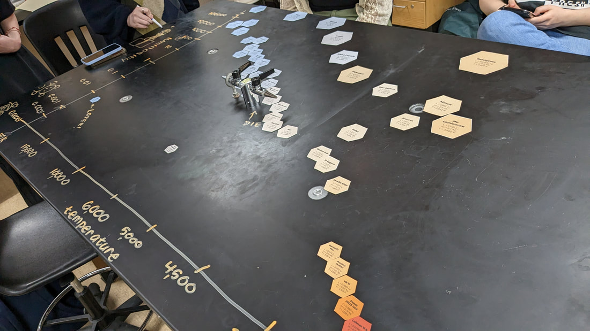
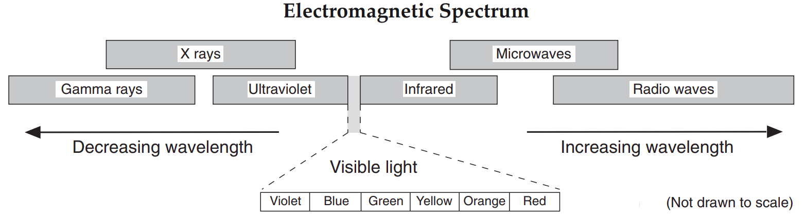

# Earth Science 🌎 <!--fit--->

## 🧑‍🏫 Mr. Porter

### 📆 2024-25

---

<!--- class: halloween--->

# 2024.10.28 **Earth Science**

##### **❓ of the 📅**: What smell brings back great memories?

 

#### 📋 Agenda

Practice Day:

1. Reference Table Practice
2. Ellipse Calculation Worksheet
3. Regents Practice on Canvas

### 🎯 Goals

🥅 _Practice answering questions about Structure of the Universe_

### 📆 Upcoming

---

# 2024.10.24 **Earth Science**

##### **❓ of the 📅**: **What is one thing you thought was weird or ridiculous until you gave it a try?**

 

#### 📋 Agenda

1. Finish Ellipse Lab
2. Reference Table Practice
3. Ellipse Practice

### 🎯 Goals

🥅 _Draw an ellipse_

🥅 _Calculate eccentricity_

🥅 _Determine shape of orbits based on eccentricity_

### 📆 Upcoming

---

# 2024.10.23 **Earth Science**

##### **❓ of the 📅**: If you invited dragons 🐉 to a taco party, would you give them 🌶️ spicy salsa? 🥵🔥

 

#### 📋 Agenda

1. Orbits Simulation
2. Elliptical Orbits
3. Ellipse Lab

### 🎯 Goals

🥅 _Model orbits with ellipses_

🥅 _Calculate the eccentricity of an ellipse_

### 📆 Upcoming

---

# 2024.10.22 **Earth Science**

#### **❓ of the 📅**: **What’s the best pizza topping? 🍕**

 

### 📋 Agenda

1. Rumors - Orbits
2. Explore - Graphing Orbit Data
3. Explore - Orbit Simulation

### 🎯 Goals

🥅 _Describe orbital paths of planets_

### 📆 Upcoming

---

# 2024.10.21 **Regents Earth Science**

##### **❓ of the 📅**: **Would you rather watch a movie on your TV at home or on the big screen in the theater, and why?**

 

#### 📋 Agenda

1. Finish Phases Simulation
2. Condensation Temperatures
3. Explain 2
3. [Reading: How Planets Form](https://lasp.colorado.edu/outerplanets/solsys_planets.php)
4. What Makes Jovian Planets so Gassy?

### 🎯 Goals

🥅 __

### 📆 Upcoming

---

# 2024.10.18 **Earth Science**

##### **❓ of the 📅**: What would your pirate name be?

 

### 📋 Agenda

1. Explore 2 - Temperature's effect on density and the formation of our solar system

### 🎯 Goals

🥅 _Describe how temperature effects the formation of our solar system_

### 📆 Upcoming

---

<!--- _footer:  --->

# 2024.10.17 **Earth Science**

##### **❓ of the 📅**: **If you found that food was falling from the sky, what food would you want to be falling? What food would you NOT want to be falling?**

 

### 📋 Agenda

1. Hunting for Earth 2.0
    - Part 2 -> What kind of dectection method can you use?
    - Part 3 -> What kind of star is likely to host an Earth-like planet?
2. Solar System Patterns
4. Density

### 🎯 Goals

🥅 _Complete Performance Tasks_

🥅 _Define Density_

### 📆 Upcoming

---

# 2024.10.16 **Earth Science**

##### **❓ of the 📅**: Would you rather have invisibility or flight?

 

### 📋 Agenda

1. Do Now - Hand in Stellar Evolution Packet
2. New Lab Groups
3. Solar System Structure Intro
4. What is Density? 

### 🎯 Goals

🥅 _Begin Exploration of Explanation for Structure of Universe_

### 📆 Upcoming

---

# 2024.10.15 **Earth Science**

##### **❓ of the 📅**: **You can have an unlimited supply of one thing for the rest of your life, what is it? Sushi? Scotch Tape? (You can't say money or anything directly related to money)**

 

#### 📋 Agenda

1. Finish Stellar Evolution Packet
2. Finding Exoplanets
3. Eyes on Expoplanets

### 🎯 Goals

🥅 _What is an expoplanet? Where are they?_

### 📆 Upcoming

---

# 2024.10.10 **Earth Science**

##### **❓ of the 📅**: What is your favorite kind of apple?

 

### 📋 Agenda

1. Do Now - Stellar Evolution Practice Quiz (**In Canvas**)
2. Finishing Stellar Evolution Packet
3. Habitable Zones & Finding Exoplanets

### 🎯 Goals

🥅 _Explain Stellar Evolution_

### 📆 Upcoming

- Quiz Tomorrow

---

# 2024.10.09 **Earth Science**

##### **❓ of the 📅**: Would you rather a vacation at the beach or an adventure in the mountains?

 

### 📋 Agenda

1. Stellar Evolution Notes & Discussion
2. Explaining Stellar Evolution
3. Nucleosynthesis 

### 🎯 Goals

🥅 _Explain stellar evolution and the different lifecycles of stars_

### 📆 Upcoming
- Quiz Friday (we will practice tomorrow)

---

# 2024.10.08 **Earth Science**

#### **❓ of the 📅**: **You have to sing karaoke, what song do you pick? 🎤**

 

### 📋 Agenda

1. Do Now: Finish Star in a box
2. Stellar Evolution Summary & Notes
3. Explain: Develop a model for patterns and stability of stars

### 🎯 Goals

🥅 _I can develop an explanatory model for patterns of stability and change observed in stars_

### 📆 Upcoming
- Quiz Friday (We will practice on Thursday)

---

# 2024.10.07 **Earth Science**

##### **❓ of the 📅**: **Would you rather live swim in the world's coldest water or eat the world's hottest pepper?🥶🥵** 

 

### 📋 Agenda

1. Do Now - Go to _Star in a box_ simulation and work on Explore 1 with your table partner
    - Link is in Canvas (Modules -> Materials -> Stellar Evolution Links)

### 🎯 Goals

🥅 _Determine the relationship between star mass and the lifecycle of the star_

### 📆 Upcoming

- Stellar Evolution Quiz on ***Friday***

---

# 2024.10.04 **Earth Science**

##### **❓ of the 📅**: What skill or talent do you most want to learn?

 

#### 📋 Agenda

1. HR Diagram Exploration - Lab

### 🎯 Goals

🥅 __

### 📆 Upcoming

---

# Explore 2 - HR Diagram

1. Create Grid on Two Tables
2. Plot stars on Table
3. What patterns do we notice?
4. Organize findings in packet - **Explore 2**

---

---

<!--- class: halloween
--->

# 2024.10.02 **Earth Science** Do Now

Work through HR Diagram Simulation questions. (Link to simulation in Canvas: Modules➡️Stellar Evolution Links)

Write answer to questions in your notebook. 

You may work with your table partner on this. 

---

# 2024.10.02 **Earth Science**

##### **❓ of the 📅**: What secrets do you think your pet would spill about you, if they could talk?

 

### 📋 Agenda

1. Do Now
2. HR Diagram Simulation Summary
3. HR Diagram Practice Worksheet
4. Life cycle of a star

### 🎯 Goals

🥅 _Read HR Diagram_ 

🥅 _Explain the life cycle of a star_

### 📆 Upcoming

---

<!--- class: halloween --->

# 2024.10.01 **Earth Science** Do Now

1. Pick up handout on front table
2. Read the **short** article and answer the first two questions

---

# 2024.10.01 **Earth Science** 🎃

##### **❓ of the 📅**: **Is cake 🍰 better than ice cream 🍨?**

 

### 📋 Agenda

1. Do Now 
2. Starting Stellar Evolution 
3. Hertzsprung-Russell Diagram
4. HR Diagram Practice

### 🎯 Goals

🥅 _Learn to read a Hertzsprung-Russell Diagram_

### 📆 Upcoming

---

# 2024.09.30 **Earth Science** Do Now 

### Take ⏱️ 5 Minutes and ✍️ write...

##### _everything you know or think you know about gravity_ <!--fit--->

- Consider:
    - What is it?
    - What causes it?
    - Does it change?
    - Do you have gravity?

---

<!-- _footer: 🤔 Did you get better at science today? Did you help make someone else better today? --->

# 2024.09.30 **Earth Science** 

##### **❓ of the 📅**: What household chore do you actually enjoy?

#### 📋 Agenda

1. Do Now
2. Gravity Lab
3. APOD Share

### 🎯 Goals 

🥅 _What makes life sustainable on Earth?_

---

<!-- _footer: 🤔 Did you get better at science today? Did you help make someone else better today? --->

# 2024.09.27 **Earth Science** 

##### **❓ of the 📅**: What is the best thing about fall?

#### 📋 Agenda

1. Quiz
2. APOD Photo Explanation

### 🎯 Goals 

🥅 _What makes life sustainable on Earth?_

---

# Astronomy Photo of the Day 📸

1. Go to [https://apod.nasa.gov/](https://apod.nasa.gov/apod/astropix.html)
2. Either click the previous button to look at other photos OR go to the archive to browse photos
2. Find a photo that you think is interesting. 
3. Add the photo to the class slideshow w/ Title
3. Research your photo:
    - What is in your photo?
    - Why is it interesting?
    - Does it related to anything we've leared so far?

---

# 2024.09.26 **Earth Science** Do Now

Do X rays or Infrared Waves have higher frequencies? Which has more energy? How do you know?

---

<!-- _footer: 🤔 Did you get better at science today? Did you help make someone else better today? --->

# 2024.09.26 **Earth Science** 

##### **❓ of the 📅**: Is it *OK* to ask the genie for infinite wishes?

#### 📋 Agenda

1. Do Now 
2. Big Bang Theory Notes & Summary
3. Practice Quizz -> On Canvas 
4. Evaluate (How many Planets?)

### 🎯 Goals 

🥅 _What makes life sustainable on Earth?_

### Reminder

- ***Quiz tomorrow***

---

<!--- class: earthSci --->

# 2024.09.24 **Earth Science** Do Now

1. Go to Canvas ➡️ Origin of Universe Model ➡️ Elaborate Links ➡️ Spectrometry 
2. Read through Spectrometry Module
3. Be prepared to share what is, how it is done, and why its important for us to know about in reference to the origin of the universe

---

<!-- _footer: 🤔 Did you get better at science today? Did you help make someone else better today? --->

# 2024.09.24 **Earth Science** 

##### **❓ of the 📅**: Would you rather be a dragon or own a dragon?

#### 📋 Agenda

1. Do Now ✔️
2. Elaborate & Big Bang Theory :boom:
3. Evaluate - Is there life out there? 👽 

### 🎯 Goals 

🥅 _What makes life sustainable on Earth?_

### **Note**: This is a cellphone free classroom 📵

---

<!-- _footer: 🤔 Did you get better at science today? Did you help make someone else better today? --->

# 2024.09.23 **Earth Science** 

##### **❓ of the 📅**: If animals could talk, which one do you think would be the most annoying?

#### 📋 Agenda

1. Finish Doppler Worksheet
2. Compelte Balloon Mini Modeling Experiment in Packet
3. Regents Questions Practice on Canvas

### 🎯 Goals 

🥅 _What makes life sustainable on Earth?_

### **Note**: This is a cellphone free classroom 📵

---

<!-- _footer: 🤔 Did you get better at science today? Did you help make someone else better today? --->

# 2024.09.20 **Earth Science** 

##### **❓ of the 📅**: What animal would you want for a non-traditional pet? (i.e. not a dog, fish or cat)

#### 📋 Agenda

1. Finish Explain - Expanding Universe?
2. Balloon Mini Experiment
3. Elaborate 

### 🎯 Goals 

🥅 _What makes life sustainable on Earth?_

### **Note**: This is a cellphone free classroom 📵

---

# 2024.09.20 

## Your To-do List:

1. Explain Summary Pages
2. Balloon Modeling - Universe
3. Doppler Worksheet
4. Canvas - Earth Science Regents Practice - Posted In Modules

---

<!-- _footer: 🤔 Did you get better at science today? Did you help make someone else better today? --->

# 2024.09.19 **Earth Science** 

##### **❓ of the 📅**: What's your favorite family recipe?

#### 📋 Agenda

1. Reframe yesterday's lab
2. What is the doppler effect?
3. What is the Electromagnetic Spectrum?
4. Model 3 and moving galaxies

### 🎯 Goals 

🥅 _What makes life sustainable on Earth?_

### **Note**: This is a cellphone free classroom 📵

---

<!-- _footer: 🤔 Did you get better at science today? Did you help make someone else better today? --->

# 2024.09.17 **Earth Science** 

##### **❓ of the 📅**: If one superhero was real, which one should it be?

#### 📋 Agenda

0. Pick up Handout on Front lab table
1. Exoplanet Hunt Questions
2. Origins of the Universe Brainstorm
3. Exploring Wave properties of moving objects

### 🎯 Goals 

🥅 _What makes life sustainable on Earth?_

### **Note**: This is a cellphone free classroom 📵

---

<!-- _footer: 🤔 Did you get better at science today? Did you help make someone else better today? --->

# 2024.09.13 **Earth Science** 

##### **❓ of the 📅**: What extracurriculars do you participate in?

#### 📋 Agenda

1. Is life sustainable on planet Earth?
2. Question Development

### 🎯 Goals 

🥅 _Graphing Best Practices_ 

### 🏠 Homework

- Finish Measurement Olympics Graphs (Due Friday)

### **Note**: This is a cellphone free classroom 📵

---

<!-- _footer: 🤔 Did you get better at science today? Did you help make someone else better today? --->

# 2024.09.12 **Earth Science** 

##### **❓ of the 📅**: Do you have any weird/unique routines or superstitions? (For example: I ***have*** to put on my left sock before my right sock, and the same for shoes, left on first.)

#### 📋 Agenda

1. 20 Minutes: Finish Measurement Olympics Graphs 
2. Is it probable that another planet like Earth exists? 

### 🎯 Goals 

🥅 _Graphing Best Practices_ 

### 🏠 Homework

- Finish Measurement Olympics Graphs (Due Friday)

### **Note**: This is a cellphone free classroom 📵

---

# CER (Claim, Evidence, Reasoning)

* ### Claim:
    * Sentence that answers the question.

* ### Evidence:
    * Explanation of how the evidence supports the claim.
        * Should include details!
        * Refer back to the question, include any data, diagrams, or graphs.

* ### Reasoning:
    * Science principle, such as an equation, law, or definition.
        * This is general, do no include specific details.

---

# Game: Soup, Salad, or Sandwich

1. Make s Claim-Evidence-Reasoning statement arguing whether the shown food is a soup, salad, or a sandwich. 

---

<!-- class: invert --->

# Soup, Salad, or Sandwich?

---

# Soup, Salad, or Sandwich?

---

<!-- _footer: 🤔 Did you get better at science today? Did you help make someone else better today? --->

# 2024.09.11 **Earth Science** 

##### **❓ of the 📅**: What would you name your pirate ship?

#### 📋 Agenda

1. Collect Data from Last Station
2. How to Histogram
3. Complete Graphs from the Lab

### 🎯 Goals 

🥅 _Graphing Best Practices_ 

### 🏠 Homework

- Finish Measurement Olympics Graphs (Due Friday)

### **Note**: This is a cellphone free classroom 📵

---

<!-- _footer: 🤔 Did you get better at science today? Did you help make someone else better today? --->

# 2024.09.10 **Earth Science** 

##### **❓ of the 📅**: Do you have any phobias? 🐍 🕷️ 🚁

#### 📋 Agenda

1. 15 Minutes: Finish either graphing practice or ball bounce lab
2. Measurement Olympics

### 🎯 Goals 

🥅 _Graphing Best Practices_ 

### 🏠 Homework

### **Note**: This is a cellphone free classroom 📵

---

# Measurement Olympics <!--fit--->

# 🏃 🏋️ 🏊 🌬️  🥇 <!--fit--->

---

# Measurement Events <!--fit--->

## Event 1: Long Jump 🏃

## Event 2: Reaction Time ⏱️ 

## Event 3: Lung Capacity 🌬️

## Event 4: Cool Down 🧊 🌡️

---

# Station 1: Long Jump 🏃

## Compare student's height to their average long jump

1. Measure your height
2. Measure three long jumps
3. Calculate your average jump 
4. Record in **class data table** on Canvas

---

# Station 2: Reaction Time ⏱️

## Make a bar graph representing each group members average reaction time for their dominant and non-dominant hand 

1. Hold ruler above your partners hand, and *without warning* drop the ruler. Your partner should catch the ruler. 
2. Use the calculator in the group spreadsheet to convert the distance the ruler fell into a time
3. Record 3 trials for your dominant and non-dominant hand. Average the times. 
4. Make your bar graph

---

# Station 4: Lung Capacity 🌬️

## Make a histogram of balloon cirumferences that we can inflate the balloons to with **one breath**

1. Get **your own balloon** -- YOU ONLY GET 1 BALLOON 
2. Take a big breath and inflate the balloon as much as you can with 1 exhale. 
3. Pinch the balloon so no air comes out. 
4. Tie it, or hold it while partner measures the **maximum** circumference of the balloon. 
4. Record in the class data table in the class spreadsheet. 

---

# Station 4: Cool Down 🧊 🌡️

## Compare the cooling rate of water when different number of ice cubes are added to water. 

1. Fill each beaker in your group up the same amount using the tap water.
2. Add in different amounts of ice cubes according to the data table. 
3. Record the temperature each minute for 10 minutes 
4. Graph each cups temperature on the graph. 

---

<!-- _footer: 🤔 Did you get better at science today? Did you help make someone else better today? --->

# 2024.09.09 **Earth Science** 

##### **❓ of the 📅**: If you were to open a restaurant, what kind of food would you offer?

#### 📋 Agenda

1. Sit with your group 
2. Graphing Notes 
3. Finish Graphing Lab
4. Graphing Practice 

### 🎯 Goals 

🥅 _Graphing Best Practices_ 

### 🏠 Homework

- Signed Safety Contract

### **Note**: This is a cellphone free classroom 📵

---

<!-- _footer: 🤔 Did you get better at science today? Did you help make someone else better today? --->

# 2024.09.06 **Earth Science** 

##### **❓ of the 📅**: Should you bite or lick your ice cream? 🍨 🍦

#### 📋 Agenda

1. Sit with your group from yesterday
2. Survival Island
3. Ball Bounce Lab

### 🎯 Goals 

🥅 _Introductions_

🥅 _Classroom Culture_

### 🏠 Homework

- Signed Safety Contract

### **Note**: This is a cellphone free classroom 📵

---

# Survival Island 🌴

1. Share your *survival skill* that **you wrote down** with your group
2. Using ***everyone's skill*** develop a plan to survive or escape the deserted island
3. On your whiteboard present your plan (drawing, mind map, set of instructions)
    - Highlight everyone's skill
4. Share Plan to the class

---

<!-- _footer: 🤔 Did you get better at science today? Did you help make someone else better today? --->

# 2024.09.05 **Earth Science** 

##### **❓ of the 📅**: Sweet or savory for breakfast?

#### 📋 Agenda

0. Sit Anywhere (For Now)
1. Do Now (fill out questionnaire & card)
2. Question of the Day
3. Grouping Game
4. Survival Island

### 🎯 Goals 

🥅 _Introductions_

🥅 _Classroom Culture_

### 🏠 Homework

- Signed Safety Contract

### **Note**: This is a cellphone free classroom 📵

---

# Do **Now** 

1. Fill out index card:
    1. Name
    2. Phone number to reach your parents/guardians if you sleep through the Regents exam
    3. Favorite Candy
    4. Favorite Emoji
    5. Emoji the describes your current mood
2. Fill out Paper Quesionnaire

---

# Lab Grouping Game

- There are 16 of you
- Based on your cards get into ***LOGICAL*** groups
- Check **whole class** answer with Mr. Porter
    - 4 Chances to Check
- Reorganize if necessary

(Yes this is the game Connections)

---
