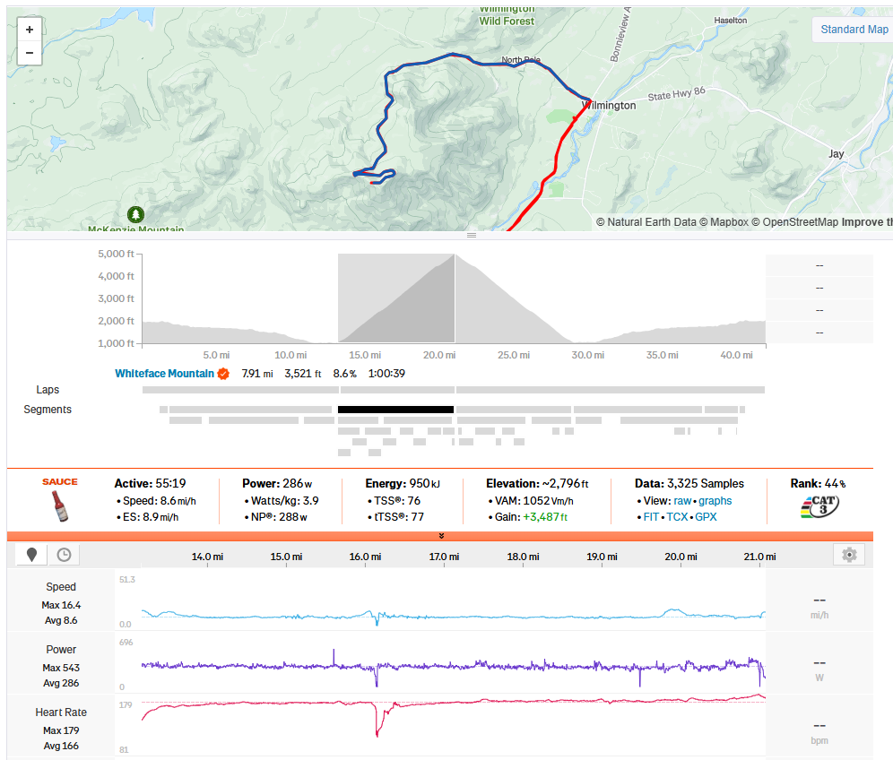
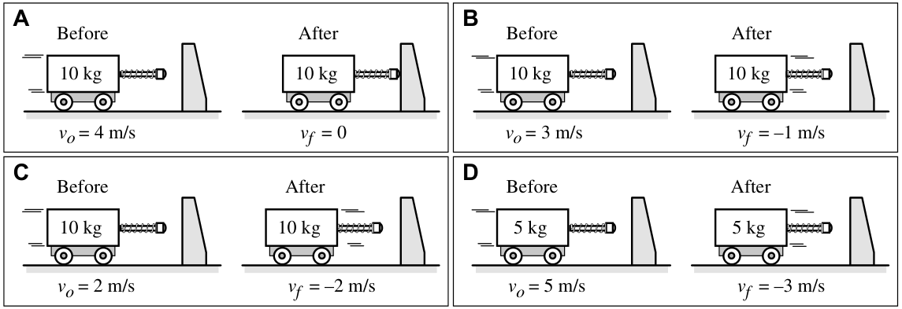
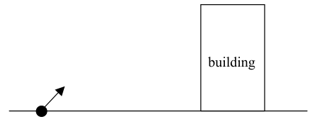

# Regents Physics 🔭 <!---fit--->

# **2024-2025** Agendas

## 👨‍🏫 Mr. Porter

---

# 2025.05.07 **Regents Physics**

##### **❓ of the 📅**: Question

 

#### 📋 Agenda

1. Circuits Quiz
2. Wave Basics Review
3. Wave Basics Practice

### 🎯 Goals

🥅 _Define wave basic characteristics_

### 📆 Upcoming

---

# 2025.05.05 **Regents Physics**

##### **❓ of the 📅**: What is one song you know all of the words to? 🎤

 

#### 📋 Agenda

1. Regents Prep - Questions # 22-35
  - Guessing on questions: 23, 27, 31, 32, 35
2. Waves Notes
3. Wave Basics Practice

### 🎯 Goals

🥅 _Introduce Waves_

### 📆 Upcoming

- Circuit Quiz **Wednesday**

---

# 2025.05.02 **Regents Physics**

##### **❓ of the 📅**: What would be on your ultimate ice cream sundae?

 

#### 📋 Agenda

1. Finish Parallel Circuits Simulation
2. Parallel Circuits worksheet
3. Prom 💃🤵

### 🎯 Goals

🥅 _Model Parallel Circuits_

### 📆 Upcoming

---

# 2025.05.01 **Regents Physics**

##### **❓ of the 📅**: What's your prom fit?

 

#### 📋 Agenda

1. Regents Prep Questions #1-21
2. [Circuit Builder](https://www.physicsclassroom.com/Physics-Interactives/Electric-Circuits/Circuit-Builder/Circuit-Builder-Interactive):
	1. Series Circuits
	2. Parallel Circuits
3. Notes - Parallel Circuits
4. Parallel Circuits Worksheet

### 🎯 Goals

🥅 _Model Parallel Circuits_

### 📆 Upcoming

---

# 2025.04.29 **Regents Physics**

##### **❓ of the 📅**: What superstition do you think is ridiculous?

 

#### 📋 Agenda

1. Finish Series Circuits Notes
    - VIRP Tables
2. Series Circuits Practice: pages 9-14

### 🎯 Goals

🥅 _Model Series Circuits_

### 📆 Upcoming

---

# 2025.04.28 **Regents Physics**

##### **❓ of the 📅**: What animal do you think is the coolest?

 

#### 📋 Agenda

1. Ohm's Law Pages: 6-8
2. Kirchoff's Laws & Series Circuits 
3. Packet Pages 9-14
    - Periodic Check-ins

### 🎯 Goals

🥅 _Model Series Circuits using Ohm's Law_

### 📆 Upcoming

- Ohm's Law & Electrical Resitance Quiz
  - Calc, I, R, V, using $R  V/I$, $I = q/t$ and $R = \rho L / A$

---

# 2025.04.25 **Regents Physics**

##### **❓ of the 📅**: If you could teleport inside any game, which would it be?

 

#### 📋 Agenda

1. Finish Voltage-Current-Resistance Lab
  - Analyze Graph -> Write Equation
  - Finish Summary
  - Discuss as a class
2. Ohm's Law
3. Packet pages 6-8

### 🎯 Goals

🥅 _Model relationship between current, reistance, and voltage_

### 📆 Upcoming

---

# 2025.04.23 **Regents Physics**

##### **❓ of the 📅**: Would you rather be able to see infrared or ultraviolet light?

 

#### 📋 Agenda

1. Resistance Questions
2. Current-Voltage-Resistance Lab

### 🎯 Goals

🥅 _Develop the mathematical relationship between current-voltage-resistance_

### 📆 Upcoming

---

# 2025.04.22 **Regents Physics**

##### **❓ of the 📅**: If you were featured on the local news, what would you most likely be on there for?

 

#### 📋 Agenda

1. Finish Packet 1-4
2. Notes: Resistance 
3. Voltage-Current-Resistance Lab

### 🎯 Goals

🥅 __

### 📆 Upcoming

---

# Voltage-Current-Resistance

**Question:**
What is the mathematical relationship between voltage, current and resistance?

**Purpose:**
To determine the mathematical relationship (i.e., equation) relating the voltage, current and resistance in a simple circuit.

**Equipment:**

- Variable Power Source, 2 Resistors, Wires, Voltmeter, Ammeter 

---

# Voltage-Current-Resistance

A complete lab write-up includes a Title, a Purpose, a Data section, a Conclusion and a Discussion of Results. 
- Data section: table and graph - completed and taped in. 
  - A linear regression analysis should be performed and the results (slope, y-intercept and regression constant) should be reported. 
- Conclusion should report a general equation relating Delta V, I and R. 
- The Discussion of Results should discuss the evidence which supports the equation reported in the Conclusion; specific attention should be devoted to the slope-resistance relationship. 

---

# 2025.04.21 **Regents Physics**

##### **❓ of the 📅**: Would you rather understand the complete history of Earth or the complete future of humanity?

 

#### 📋 Agenda

1. Finish Battery Circuit Lab
2. Notes on Circuits
3. Packet Pages 1-4

### 🎯 Goals

🥅 _Define Electrical Current_

### 📆 Upcoming

---

### Lab Sparky the Electrician

#### ⚠️ *Note: Revisit your successful methods first*

**Question:**  
What are the two requirements for an electric circuit?

**Purpose:**  
To identify the four successful arrangements of wire, bulb and battery which successfully light a bulb and a couple of unsuccessful arrangements AND to describe the commonalities of those arrangements by identifying the two requirements for an electric circuit.

---

# 2025.04.10 **Regents Physics**

##### **❓ of the 📅**: What's your favorite zoo animal?

 

#### 📋 Agenda

1. Review Voltage 
2. Voltage Calculations in APlusPhysics Packet
3. Sparky the Electrician Lab

### 🎯 Goals

🥅 _Practice with Voltage_ 

🥅 _Make a circuit_ 🔌

### 📆 Upcoming

---

### Lab Sparky the Electrician

**Question:**  
What are the two requirements for an electric circuit?

**Purpose:**  
To identify the four successful arrangements of wire, bulb and battery which successfully light a bulb and a couple of unsuccessful arrangements AND to describe the commonalities of those arrangements by identifying the two requirements for an electric circuit.

---

### Lab Notebook Requirements

A complete lab write-up includes a Title, a Purpose, a Data section, a Conclusion and a Discussion of Results. 

- The **Data** section includes sketches of the four successful arrangements and at least two unsuccessful arrangements. 
- The **Conclusion** describes the two requirements for an electric circuit. 
- The **Discussion of Results** should explain why the unsuccessful arrangements were unsuccessful in terms of how they fail to meet the requirements; and uses one of the successful arrangements to elaborate on the meaning of each requirement.

---

# 2025.04.09 **Regents Physics**

##### **❓ of the 📅**: What is your ideal sandwich? 🥪

 

#### 📋 Agenda

1. Do Now: APlusPhysics Packet page 117 & 118
2. Go over 👆
3. Introduction to Electric Potential (Voltage)

### 🎯 Goals

🥅 _Define Electric Potential_

### 📆 Upcoming

---

# 2025.04.08 **Regents Physics**

##### **❓ of the 📅**: If you could make the world's biggest food fight, what food would you have?

 

#### 📋 Agenda

1. Review Electric Fields
2. Electric Field Practice
    - Page 15-18 Physics Classroom Packet
    - Page 117-121 APlusPhysics
3. Introduction to Voltage

### 🎯 Goals

🥅 _Map Electric Fields_

### 📆 Upcoming

---

# 2025.04.04 **Regents Physics**

##### **❓ of the 📅**: If gravity suddenly decreased by half for 24 hours, what would you do first?

 

#### 📋 Agenda

1. Coulomb's Law Quiz
2. Electric Field Notes
3. Electric Field Practice in Packets

### 🎯 Goals

🥅 __

### 📆 Upcoming

---

# 2025.04.03 **Regents Physics**

##### **❓ of the 📅**: Would you rather vacation in Hawaii or Alaska, and why?

 

#### 📋 Agenda

1. Do Now - Page 112 of APlusPhysics Packet
2. Mapping the Electric Field
	1. Spreadsheet Magic 🪄 🧙‍♂️
3. Electric Field Notes

### 🎯 Goals

🥅 _Map the electric field using Coulomb's Law_

### 📆 Upcoming

---

# 2025.04.02 **Regents Physics**

##### **❓ of the 📅**: Does your family have a "motto" – spoken or unspoken? 

 

#### 📋 Agenda

1. Reintroduction to Coulomb's Law
2. Coulomb's Law PC Packet
2. Coulomb's Law Regents Questions (APlusPhysics)
3. Work on Pivot (if needed)

### 🎯 Goals

🥅 _Define Coulomb's Law_

🥅 _Use Coulomb's law to calculate electric forces_

### 📆 Upcoming

- Charge & Coulomb's Law Quiz Friday (Q4 Grade)
- ***Schedule reassessments***

---

# 2025.03.31 **Regents Physics**

##### **❓ of the 📅**: Would you rather win the lottery or work at the perfect job?

#### 📋 Agenda

1. Check In -> You should have data for both pivots
2. Finish Pivots - Wednesday

### 🎯 Goals

🥅 _Finish Pivots_

### 📆 Upcoming

- Charge & Coulomb's Law Quiz Friday (Q4 Grade)
- ***Schedule reassessments...quarter ends Friday***

---

## Forces & Electric Charge Pivots

### Force vs. Distance

- Units should be in **METERS**
- Linearize instructions are in pivot, you need to make a calculated column and graph that
- Slope question is based on linearized graph 

### **Force vs. Charge**

- Charge should start at 100 and half each time the sphere is touched
  - 100 -> 50 -> 25 ... etc
  - The lab discussed this in the section above...

---

# 2025.03.25 **Regents Physics**

##### **❓ of the 📅**: Would you rather be able to see microscopic things or distant galaxies with your naked eye?

 

#### 📋 Agenda

1. Notes on Charge and Electrostatic Forces
2. Working with charge

### 🎯 Goals

🥅 _Define charge and electrostatic forces_

🥅 _Calculate charge_ 

### 📆 Upcoming

I am at a conference the rest of the week. You will have a pivot to complete, a video to watch, and practice sheet to complete.

---

# 2025.03.24 **Regents Physics**

##### **❓ of the 📅**: Would you rather live in a floating city in the sky or an underwater city?

 

#### 📋 Agenda

1. Sticky Tape Pivot 
2. Introduction to Electrostatics

### 🎯 Goals

🥅 _Introduce electric charge and force_

### 📆 Upcoming

---

# 2025.03.21 **Regents Physics**

##### **❓ of the 📅**: Do you love or hate rollercoasters?

 

#### 📋 Agenda

1. Review for quiz
	1. [**Energy Analysis 1**](https://www.physicsclassroom.com/calcpad/launch/CPWE16)
	2. [**Energy Analysis 2**](https://www.physicsclassroom.com/calcpad/launch/CPWE17)
	3. [**Energy Analysis 3**](https://www.physicsclassroom.com/calcpad/launch/CPWE18)
	4. [**Energy Analysis 4**](https://www.physicsclassroom.com/calcpad/launch/CPWE19)
2. Energy Conservation quiz

### 🎯 Goals

🥅 _Model energy conservation_

### 📆 Upcoming

---

# 2025.03.19 **Regents Earth Science**

##### **❓ of the 📅**: Is New York-style pizza better than Chicago-style pizza?

 

#### 📋 Agenda

1. Finish Mini Lab
2. PC Practice for Conservation of Energy Quiz (Friday)
	1. [**Energy Analysis 1**](https://www.physicsclassroom.com/calcpad/launch/CPWE16)
	2. [**Energy Analysis 2**](https://www.physicsclassroom.com/calcpad/launch/CPWE17)
	3. [**Energy Analysis 3**](https://www.physicsclassroom.com/calcpad/launch/CPWE18)
	4. [**Energy Analysis 4**](https://www.physicsclassroom.com/calcpad/launch/CPWE19)

### 🎯 Goals

🥅 _Finish Lab_

🥅 _Practice with Energy Conservation_

### 📆 Upcoming

- Energy Conservation Quiz Friday

---

# 2025.03.18 **Regents Physics**

##### **❓ of the 📅**: If you could go to the Olympics, what sport would you want to do?

 

#### 📋 Agenda

1. Wrap Up Pop Up Toy
2. Energy Mini Labs
    - Predict answer **using theory** (i.e. using equations or energy descriptions)
    - collect data & determine if hypothesis is correct     

### 🎯 Goals

🥅 _Use conservation of energy to make predictions_

### 📆 Upcoming

---

# Energy Mini Labs

## In Notebook...

1. Question
2. Hypothesis **with theory** to support your prediction
3. Experimental Design, data, and calculations
4. Confirmation or denial of your hypothesis

---

# 2025.03.17 **Regents Physics**

##### **❓ of the 📅**: If you could hire someone to help you, would it be with cleaning, cooking, or yard work?

 

#### 📋 Agenda

1. Finish Conservation of Energy Problems
2. Mini Lab: Pop up toy

### 🎯 Goals

🥅 _Apply conservation of energy to problem solving_

### 📆 Upcoming

---

# Pop Up Toy

## Objective:

_**Determine the <u>spring constant</u> of the pop-up toy**_

- Using Energy, experimentally determine the spring constant of your toy using a meterstick and the electronic balance.
- Start with an energy bar graph, write the energy conservation equation & and substitute in

---

# 2025.03.13 **Regents Physics**

##### **❓ of the 📅**: Is it more important to explore the depths of the **ocean** or the depths of *space*?

 

#### 📋 Agenda

1. Quiz
2. Spring Lab - Board Meeting
3. Solving Problems with Energy

### 🎯 Goals

🥅 _Define Hooke's Law_

🥅 _Use Work-Energy Theorem to solve problems_

### 📆 Upcoming

---

# 2025.03.12 **Regents Physics**

##### **❓ of the 📅**: Would you rather be in a reality baking show contest or a dating show contest?

 

#### 📋 Agenda

1. Finish Spring Lab -> Whiteboard and discuss
2. Physics Classroom Practice with Energy Calculations
	1. [**Kinetic Energy**](https://www.physicsclassroom.com/calcpad/launch/CPWE6)
	2. [**Potential Energy**](https://www.physicsclassroom.com/calcpad/launch/CPWE7)
	3. [**Total Mechanical Energy**](https://www.physicsclassroom.com/calcpad/launch/CPWE8)

### 🎯 Goals

🥅 _Hooke's Law_

🥅 _Practice with Energy Calculations_

### 📆 Upcoming
- Quiz Tomorrow on Work, Power, Energy Calculations

---

# 2025.03.11 **Regents Physics**

##### **❓ of the 📅**: Would you rather be able to control the weather or predict it with perfect accuracy?

 

#### 📋 Agenda

1. Finish Pages 7 & 8 in packet
2. Spring Force Lab
3. Work-Energy Relationships (pages 9 & 10)

### 🎯 Goals

🥅 _Determine Equation for Springs_

### 📆 Upcoming

---

# Spring Force Lab:

## **Objective:**

Determine the relationship between stretch and force applied on a spring. Test this relationship for **two** springs

(Note: When analyzing graph Spring Force on the vertical axis regardless of your experimental design choice on independent variable)

 

## **Available Materials:**

- Two different springs
- Spring Scales (force sensors)
- Masses
- Ruler/Meterstick
- Electronic Force Sensor

---

# 2025.03.07 **Regents Physics**

##### **❓ of the 📅**: If you could instantly know the answer to one scientific mystery, which would you choose?

 

#### 📋 Agenda

1. Finish Bar Graphs
	1. Whiteboard Answers and Discuss
2. Intro Equations
3. Think Sheet from PC in Packet on Energy Types and identifying with simple calculations

### 🎯 Goals

🥅 _Model Energy Transformations Graphically_

### 📆 Upcoming

- Need a work & power quiz next week...

---

# 2025.03.06 **Regents Physics**

##### **❓ of the 📅**: If you could be immortal, what age would you choose to stop aging at and why?

 

#### 📋 Agenda

1. Introduction to Energy Bar Graphs 📊
2. Energy Bar graphs with partners
	1. Speed dating bar graphs
3. Energy Equations (if there is time)
	1. Intro equations
	2. Think sheet

### 🎯 Goals

🥅 _Describe energy conservation with bar graphs_

### 📆 Upcoming

- Need a work & power quiz next week...

---

# 2025.03.05 **Regents Physics**

##### **❓ of the 📅**: Who is your celebrity crush?

 

#### 📋 Agenda

1. Do now
3. Power Practice:
    - [**Problem Set WE3:  Work and Power 1**](https://www.physicsclassroom.com/calcpad/launch/CPWE3)
2. Energy Definitions

### 🎯 Goals

🥅 _Practice with Power Calculations_

🥅 _Define Energy "Types"_

### 📆 Upcoming

---

## Calculate Mr. Porter's Power and Compare

- Elevation Gain: **3,521 feet**
- Mr. Porter + Bike Mass: **85 kg**
- Active Time: **55 minutes 19 seconds**

How does this compare to the **measured** average power of 286 W?

---

## Calculate Mr. Porter's Power and Compare

- Elevation Gain: 3,521 feet
- Mr. Porter + Bike Mass: 85 kg
- Active Time: 55 minutes 19 seconds

How does this compare to the **measured** average power of 286 W?

---

# 2025.03.03 **Regents Physics**

##### **❓ of the 📅**: Would you rather live in the ocean or on the moon?

 

#### 📋 Agenda

1. Calculating Power
2. Finish Page 5 & Page 6
3. Power Lab
4. Bicycle Question
5. Physics Classroom Practice

### 🎯 Goals

🥅 _Measure and Calculate your Power_

🥅 _Apply Power to real life example_

### 📆 Upcoming

---

# Power Lab 💪 🏋️

**Question:**
What is my power requirement for climbing a staircase - both by walking and by running (or fast walking)?

**Purpose:**
To determine my power requirement for climbing a staircase - both by walking and by running.

---

# 🚫 Rules:

1. Do not disturb classes or other students in the hall 
2. Spread out to the different staircases (there are 4 by my count) - no more than 2 per group 
3. No skippinng stairs
4. **BE SAFE** and use good judgement

---

# Power Lab 💪 

**Question:**
What is my power requirement for climbing a staircase - both by walking and by running (or fast walking)?

**Purpose:**
To determine my power requirement for climbing a staircase - both by walking and by running.

---

# Physics Classroom Practice

[**Problem Set WE1:  Work 1**](https://www.physicsclassroom.com/calcpad/launch/CPWE1)

[**Problem Set WE2:  Work 2**](https://www.physicsclassroom.com/calcpad/launch/CPWE2)

[**Problem Set WE3:  Work and Power 1**](https://www.physicsclassroom.com/calcpad/launch/CPWE3)

[**Problem Set WE4:  Work and Power 2**](https://www.physicsclassroom.com/calcpad/launch/CPWE4)

[**Problem Set WE5:  Work and Power 3**](https://www.physicsclassroom.com/calcpad/launch/CPWE5)

---

# 2025.02.28 **Regents Physics**

##### **❓ of the 📅**: What topic could you give a 20-minute presentation on without any preparation?

 

#### 📋 Agenda

1. Conservation of Momentum Quiz
2. Power 💪 
3. Power Think Sheet
3. Determine your power

### 🎯 Goals

🥅 _Define Power_

🥅 _Measure Power_

### 📆 Upcoming

---

# 2025.02.27 **Regents Physics**

##### **❓ of the 📅**: Would you rather always be slightly late or super early? 

 

#### 📋 Agenda

1. 🎵 Work, Work, Work, Work
2. Work Notes
2. Packet Practice On work

### 🎯 Goals

🥅 _Define and calculate Work_

### 📆 Upcoming

Conservation Momentum Quiz tomorrow

---

# 2025.02.25 **Regents Physics**

##### **❓ of the 📅**: How do you feel about clowns? 🤡

 

#### 📋 Agenda

1. Blowdart Collision Pivot
2. Physics Classroom Practice

### 🎯 Goals

🥅 _Model Real-Life Collision_

### 📆 Upcoming

- Conservation of Momentum Quiz - Friday

---

# Physics Classroom SLOP

1. **[Problem Set MC6 - Explosions 1](https://www.physicsclassroom.com/calcpad/launch/CPMC6)** Post-explosion velocity of one of the objects. 
2. **[Problem Set MC7 - Explosions 2](https://www.physicsclassroom.com/calcpad/launch/CPMC7)** Post-explosion velocity of one of the objects. 
3. **[Problem Set MC8 - Collision Analysis 1](https://www.physicsclassroom.com/calcpad/launch/CPMC8)** Hit-and-stick style collision. 
4. **[Problem Set MC9 - Collision Analysis 2](https://www.physicsclassroom.com/calcpad/launch/CPMC9)** Hit-and-bounce style collision. 
5. **[Problem Set MC10 - Collision Analysis 3](https://www.physicsclassroom.com/calcpad/launch/CPMC10)** Collisions *pay attention to direction*!

---

# 2025.02.24 **Regents Physics**

##### **❓ of the 📅**: If you could instantly become an expert in something, what would it be?

 

#### 📋 Agenda

1. Review Conservation of Momentum
2. Solving Conservation of Momentum Problems

### 🎯 Goals

🥅 _Remember conservation of momentum_

### 📆 Upcoming

---

# 2025.02.14 **Regents Physics**

##### **❓ of the 📅**: Who is your scientist? What did they do? Explain your valentine pun

 

#### 📋 Agenda

1. Physics Valentines
2. Review Paper Car Crash & Finish Lab Notebook Entry
3. Conservation of Momentum ➡️ Finish Notes and introductory problems

### 🎯 Goals

🥅 _Wrap up paper car lab_

🥅 _Start Conservation of $\vec{p}$ problems_

### 📆 Upcoming

- 🌴🏖️ Vacation!

---

# 2025.02.12 **Regents Physics**

##### **❓ of the 📅**: Would you give up three fingers in exchange for $1 million?

 

#### 📋 Agenda

1. Quiz
2. Paper Car Test
3. Write Up Paper Car Crash Analysis in Lab Notebook

### 🎯 Goals

🥅 _Test Paper Cars_

---

# 2025.02.11 **Regents Physics**

##### **❓ of the 📅**: What reality TV show would you star in?

 

#### 📋 Agenda

**Porter forgot the eggs...😢**

_I'll save my egg-cuses for another day_

1. Practice for Quiz:
    - [PC: Impulse-Momentum Change 2](https://www.physicsclassroom.com/calcpad/launch/CPMC3)
2. Is momentum conserved in collisions?

### 🎯 Goals

🥅 _Define conserved quantities_

🥅 _Practice with Impulse-Momentum for quiz_

### 📆 Upcoming

- Quiz tomorrow -> Momentum and Impulse

---

# Paper Car Crash **Test**

1. How will we measure velocity?
2. Be sure to measure car mass **with egg in it**
3. Make Momentum Calculation 

---

# Paper Car Crash **Analysis**

- Show Calculations
  - Velocity, momentum
- Did your egg passenger survive?
  - Why or why not?
- Comparison -> How did your car do in comparison to the rest of the class?
  - What were some similarities and differences between your design and other designs?
- How can you improve your design for future crashes?

---

# 2025.02.10 **Regents Physics** Do Now

A 0.232-kg volleyball approaches Jessica with a velocity of 3.76 m/s. Jessica gives the ball a bump, sending it in the opposite direction with a speed of 2.46 m/s.

1.  What is the change in momentum of the volleyball?
2.  What average force does Jessica apply to the volleyball if the interaction time between her arms and the ball was 0.0247 seconds?

---

# 2025.02.10 **Regents Physcis**

##### **❓ of the 📅**: Quesizont

 

#### 📋 Agenda

1. Do Now
2. Paper Car Build 🏗️ 👷
    - complete today
    - testing tomorrow! 💥

### 🎯 Goals

🥅 _Build Paper Car to test_

### 📆 Upcoming

- Impulse Momentum Quiz Wednesday

---

## 2024.02.05 **Regents Physics** Do Now:

1. Tyrone, South's $75.8$-kg halfback, is moving with a speed of $7.03$ m/s when he collides with a middle linebacker. If Tyrone experiences a force of $841$ N over a time period of $1.13$ s, then determine his final speed.
2. A $1.05$-kg rubber ball moving with a speed of $7.53$ m/s strikes a wall and rebounds with a speed of $2.21$ m/s in the opposite direction. Determine the impulse.
3. While playing basketball, Logan lost his balance and collied with the padded wall behind the basket. His $72.8$-kg body decelerated from $7.67$ m/s to $0$ m/s in $0.150$ seconds. Determine the force acting upon Logan's body.

---

# 2025.02.05 **Regents Physics**

##### **❓ of the 📅**: What does your warning :warning: label say?

#### 📋 Agenda

0. Do Now
1. How did the classwork go? Questions
2. Introduce Paper Car Crash Experiment
3. Paper Car Crash: Planning, Building, and Documentation in Lab Notebook

### 🎯 Goals

🥅 _Use Impulse-Momentum Theorem to make a crash design_

---

# 🎯 Most Crashworthy Car 

### *Crashworthiness*:  **how well a car protects its occupants in a crash**

Your task is to make the most crashworthy paper car. It will be protecting an egg. 

---

# Crashworthiness 

How can we measure the most crashworthy car? 

- ***Momentum*** can be conisdered a measure of how difficult it is to stop an object in motion

Momentum $p=mv$ (mass times velocity)

---

# Contest

Make a paper car with ***the most*** momentum at the bottom of the ramp that still allows an egg to survive. 

---

# **🚗 Car Supplies 📰**

- 2 pieces of copy paper
- 1 straw to use for car axles
- 2 axles & 4 wheels
- scotch tape 

---

# Additional Rules & Requirements 

- Car must fit on gutter ramp
- Vehicle designs must allow for easy access to and removal of the egg (occupant) for inspection after the crash.
-  Vehicle designs should be able to withstand 2-3 trials/collisions without parts replacement or repairs.
-  All vehicles must visibly display the following information on their frames:
    - vehicle name, builder’s name, vehicle length in centimeters, vehicle mass in grams

---

# 2025.01.31 **Regents Physics**

##### **❓ of the 📅**: Would you rather live in a hot, sandy desert, or the North Pole?

 

#### 📋 Agenda

1. Finish & Check _Momentum, Impulse, and Momentum Change_ Think Sheet
2. _Controlling a Collision_ Think Sheet
3. [Impulse-Momentum Change Table](https://www.physicsclassroom.com/Concept-Builders/Momentum-and-Collisions/Momentum-Change-Table/Concept-Builder)

### 🎯 Goals

🥅 _Practice applying Impulse-Momentum Theorem_

### 📆 Upcoming

- Impulse & Momentum Quiz on ***Wednesday***

---

## 2025.01.30 **Regents Physics** Do Now

Carts with spring plungers run into fixed barriers. The carts are identical but are carrying different loads and so have different masses. The velocity of the cart just before and just after impact is given.

**Rank the magnitude of the change in momentum of these carts.** Explain your reasoning.

---

# 2025.01.30 **Regents Physics**

##### **❓ of the 📅**: If you suddenly had a 25 hour day, what would you do with your extra hour?

 

#### 📋 Agenda

1. Do Now
2. [Minds on Physics - Momentum](https://www.physicsclassroom.com/mop/Momentum-and-Collisions/Momentum/Mission-MC1)
2. Finish [Impulse Notes](/mrporterphysics.github.io/Presentations/Momentum/talks/RPmomentum2025.html) 
3. Impulse-Momentum Think Sheet 

### 🎯 Goals

🥅 _Define and Apply the ideas of **impulse** and ***momentum***_

### 📆 Upcoming

---

# 2025.01.28 **Regents Physics**

##### **❓ of the 📅**: What was your first username?

 

#### 📋 Agenda

1. Optional Quiz Retakes
2. [Momentum Notes](/mrporterphysics.github.io/Presentations/Momentum/talks/RPmomentum2025.html)

### 🎯 Goals

🥅 _Define Momentum and Impulse_

### 📆 Upcoming

---

<!--- class: january --->

# 2025.01.24 **Regents Physics**

##### **❓ of the 📅**: What’s your favorite food combination?

 

#### 📋 Agenda

1. Finish Quarter Strong...
    1. Finish Force Station lab
    2. Check Standards - what do you need to practice and retake?
    3. Practice for ***optional*** retakes on Tuesday

### 🎯 Goals

🥅 _Prepare for reassessments_

### 📆 Upcoming

- Reassessment Buffet 🍽️ Tuesday

---

# 2025.01.23 **Regents Physics**

##### **❓ of the 📅**: Would you rather be the hero or the sidekick?

 

#### 📋 Agenda

1. Lab: [Force Stations](../../../Presentations/Forces/talks/forcestations.html)

### 🎯 Goals

🥅 _Apply Newton's Laws to problem solve physcial situations_

🥅 _Estimate uncertainty in measurements_

---

# 2025.01.22 **Regents Physics**

##### **❓ of the 📅**: What came first? The chicken or the egg?

 

#### 📋 Agenda

1. Finish Inclined Plane Pivot
2. Notes Inclined Planes
3. Practice:
    - [Inclined Planes 1](https://www.physicsclassroom.com/calcpad/launch/CPF2D10)
    - [Inclined Planes 2](https://www.physicsclassroom.com/calcpad/launch/CPF2D11)

### 🎯 Goals

🥅 _Find Forces on Inclined Planes_

### 📆 Upcoming

  - Lab tomorrow

---

# 2025.01.17 **Regents Physics**

##### **❓ of the 📅**: Who is the most interesting person you’ve met and talked with?

 

#### 📋 Agenda

1. Do Now (10 min) packet page 7 & 8
1. Pivot - Inclined Planes

### 🎯 Goals

🥅 _Model forces for objects on ramps_

### 📆 Upcoming

- Quarter Ends next week: [sign up for reassessments](https://forms.gle/LuWuWWiJcHagHfd89)

---

# 2025.01.16 **Regents Physics**

##### **❓ of the 📅**: What’s your favorite month? 

 

#### 📋 Agenda

1. Do Now - Packet page 6
2. Solving Equilibrium Questions 🤡
2. [Equilibrium 1](https://www.physicsclassroom.com/calcpad/launch/CPF2D4)
2. [Equilibrium 2](https://www.physicsclassroom.com/calcpad/launch/CPF2D4)

### 📆 Upcoming

- ***Start signing up for retakes...***

### 📁 Resources

- [PC Video on Equilibrium](https://youtu.be/kYrZfkOyIfU?si=Ve7E8AFUSY3bUTlm&t=345)

---

# 2025.01.15 **Regents Physics**

##### **❓ of the 📅**: If you could start a charity, what would it be for?

 

#### 📋 Agenda

1. Do Now: PC [Vector Components](https://www.physicsclassroom.com/calcpad/launch/CPF2D1)
2. Equilibrium Problems
3. [🔗 Balance It!](https://www.physicsclassroom.com/Physics-Interactives/Forces-in-2D/Equilibrium/Interactive)
4. Pages 5 & 6 

### 🎯 Goals

🥅 _Use Vector components to solve angled force problems_

### 📆 Upcoming

- Start signing up for quiz retakes...quarter ends next week!

---

# 2025.01.13 **Regents Physics**

##### **❓ of the 📅**: If you became president, what’s the first thing you would do?

 

#### 📋 Agenda

0. Another Angle on F-m-a 
1. Angled Forces Intro 
2. Adding and Resolving Forces (new packet)
3. [Force Components](https://www.physicsclassroom.com/calcpad/launch/CPF2D1)

### 🎯 Goals

🥅 _Look at forces as two dimensional vectors_

### 📆 Upcoming

- [Adding Force Vectors](https://www.physicsclassroom.com/calcpad/launch/CPF2D2)

---

# 2025.01.09 **Regents Physics**

##### **❓ of the 📅**: Would you rather lose both legs, both arms, or one of each?

#### 📋 Agenda

1. Free Body Diagrams (Card Sort)
1. N3L Practice
2. Equilibrium
4. [Mission F2D3](https://www.physicsclassroom.com/mop/Forces-in-2-Dimensions/Equilibrium-Concepts) on Equilibrium Concepts

---

# 2025.01.07 **Regents**

##### **❓ of the 📅**: Should pizza slices be triangles or squares?

 

#### 📋 Agenda

1. Newton's Third Law
2. Page 23
3. [FBD Practice](https://www.physicsclassroom.com/mop/NewtonsLaws/Force-Diagrams/Mission-NL5)
4. Forces at angles

### 🎯 Goals

🥅 _Define & Apply N3L_

🥅 _Identify Force Diagrams_

🥅 _Apply Newton's Laws to angled forces_

---

# 2025.01.06 **Regents Physics**

##### **❓ of the 📅**: If you had to be a villian from a movie, which movie would you pick?

 

#### 📋 Agenda

1. Finish page 25 & 26 
2. Newton's Third Law
3. Packet page 23
4. PC: [Newton's Second and Third Laws](https://www.physicsclassroom.com/calcpad/launch/CPNL16)

### 🎯 Goals

🥅 _Define and apply Newton's Third law_

### 📆 Upcoming

---

# 2025.01.03 **Regents Physics**

##### **❓ of the 📅**: 

 

#### 📋 Agenda

1. True False Sheet (4&5)
2. Packet Page 25 & 26
3. Newton's 3rd Law 

### 🎯 Goals

🥅 _Review N1L & N2L_

🥅 _Define N3L_

### 📆 Upcoming

---

<!--- class: winter --->

# 2024.12.20 **Regents Physics**

##### **❓ of the 📅**: Who is traveling the furthest this break?

 

#### 📋 Agenda

1. Quiz

### 🎯 Goals

🥅 _Quiz N2L and Friction_

### 📆 Upcoming

---

# 2024.12.19 **Regents Physics**

##### **❓ of the 📅**: What is a good stocking stuffer?

 

#### 📋 Agenda

1. Do Now -> Fact Check 
1. PC Friction Practice:
    - [Friction and $\mu$ 1](https://www.physicsclassroom.com/calcpad/launch/CPNL11)
    - [Friction and $\mu$ 2](https://www.physicsclassroom.com/calcpad/launch/CPNL12)
    - [Friction and $\mu$ 3](https://www.physicsclassroom.com/calcpad/launch/CPNL13)

### 🎯 Goals

🥅 _Model motion that has friction_

### 📆 Upcoming

- Quiz tomorrow on N2L and Friction

---

# 2024.12.18 **Regents Physics**

##### **❓ of the 📅**: Would you rather be extremely short or extremely tall?

 

#### 📋 Agenda

1. Do Now: Packet Page 19
2. Review Friction Notes
3. PC Calc Pad Practice:
    - [Friction and $\mu$ 1](https://www.physicsclassroom.com/calcpad/launch/CPNL11)
    - [Friction and $\mu$ 2](https://www.physicsclassroom.com/calcpad/launch/CPNL12)
    - [Friction and $\mu$ 3](https://www.physicsclassroom.com/calcpad/launch/CPNL13)

### 🎯 Goals

🥅 _Practice solving problems with friction_

### 📆 Upcoming

- Quiz (Tomorrow/Friday -> vote) on N2L & Friction

---

# 2024.12.16 **Regents Physics**

##### **❓ of the 📅**: What fictional world or place would you like to visit?

 

#### 📋 Agenda

1. Do Now: Drawing FBDs and N2L page 17 & 18
1. Friction Notes 
2. Packet Page 19
3. [PC: Friction and $\mu$](https://www.physicsclassroom.com/calcpad/launch/CPNL11)

### 🎯 Goals

🥅 _Model Friction_

### 📆 Upcoming

- ***Quiz Later in the week on N2L and Friction***

---

# 2024.12.13 **Regents Physics**

##### **❓ of the 📅**: Do you believe Friday the 13th is good or bad luck?

 

#### 📋 Agenda

1. Forces PC Practice:
    - Warm up: [Mass vs. Weight](https://www.physicsclassroom.com/calcpad/launch/CPNL1) and [Force Diagrams](https://www.physicsclassroom.com/calcpad/launch/CPNL3)
    - Practice: [Easy F = ma](https://www.physicsclassroom.com/calcpad/launch/CPNL5) and [N2L: FBDs and Acceleration](https://www.physicsclassroom.com/calcpad/launch/CPNL7) 
    - Challenge: [N2L: Horizontal](https://www.physicsclassroom.com/calcpad/launch/CPNL8) and [N2L: Vertical](https://www.physicsclassroom.com/calcpad/launch/CPNL9)
2. Quiz (Last 30 minutes... 🕙 10:10 am)

### 🎯 Goals

🥅 _Use N1L & N2L to solve problems_

### 📆 Upcoming

---

# 2024.12.12 **Regents Physics**

##### **❓ of the 📅**: What is your favorite road trip snack?

 

#### 📋 Agenda

1. Do Now: Finish Pages 12 & 13 in packet
2. Solving Questions with N2L
3. Packet pages 14, 16-18

### 🎯 Goals

🥅 _Solve questions with Newton's Second Law_

### 📆 Upcoming

- ***Forces Quiz tomorrow***
    - Part 1: Forces Facts (from fact sheet)
    - Part 2: Problem Solving and Free Body Diagrams   

---

# 2024.12.10 **Regents Physics**

##### **❓ of the 📅**: Would you rather meet your travel back in time to meet your ancestors or to the future to meet your descendants?

 

#### 📋 Agenda

1. Lab: Graph data & find equations 
1. N2L Lab Review & Notes
2. Write N2L Lab Discussion and Conclusions
3. Solving N2L Questions 

### 🎯 Goals

🥅 _Deploy N2L Model -> Use to problem solve_

### 📆 Upcoming

- Forces quiz Friday
    - Part 1: Forces Facts (from fact sheet)
    - Part 2: Problem Solving and Free Body Diagrams   

---

# 2024.12.09 **Regents Physics**

##### **❓ of the 📅**: If you could pick any wild animal to keep as a pet, which would it be?

 

#### 📋 Agenda

1. How to measure cart force
2. Finish Collecting Data
3. Whiteboard Results (graphs and equations)
3. Discuss N2L Lab
4. Write conclusions and discussions

### 🎯 Goals

🥅 _Verify (or deny) Newton's Second Law experimentally_

### 📆 Upcoming

- Forces quiz Friday
    - Part 1: Forces Facts (from fact sheet)
    - Part 2: Problem Solving and Free Body Diagrams    

---

# 2024.12.06 **Regents Physics**

##### **❓ of the 📅**: If you were so wealthy you didn’t need to work, what would you do with your time?

 

#### 📋 Agenda

0. Do Now - finish FBDs in packet -> ⏲️ 10 Minutes
1. Newton's Second Law - Notes
2. Fan Cart Lab

### 🎯 Goals

🥅 _Design an experiment to verify Newton's Second Law_

### 📆 Upcoming

---

# 2024.12.04 **Regents Physics**

##### **❓ of the 📅**: What is your favorite Disney movie?

 

#### 📋 Agenda

1. Do Now - Finish Force Identification Worksheet (p. 7-10)
2. Notes - Free Body Diagrams 
3. Worksheet Free-Body Diagrams - page 15

### 🎯 Goals

🥅 _Identify forces and represent forces in free body diagrams_

### 📆 Upcoming

---

# 2024.12.03 **Regents Physics** Do Now

- Finish Balanced vs. Unbalanced Forces Worksheet
- [Balanced Forces & Motion](https://www.physicsclassroom.com/mop/NewtonsLaws/Balanced-Forces-and-the-State-of-Motion/Mission-NL2)

---

# 2024.12.03 **Regents Physics**

##### **❓ of the 📅**: Who would you most love to prank?

 

#### 📋 Agenda

1. Do Now
2. Notes: Types of Forces
3. Identifying Forces p. 7
4. [Concept Builder: Balanced vs. Unbalanced Forces](https://www.physicsclassroom.com/Concept-Builders/Newtons-Laws/Balanced-Unbalanced-Forces)
4. Notes: Force Diagrams
5. FBD Pracitce - p. 15 

### 🎯 Goals

🥅 _Define different force types_

🥅 _Identify force types in physical situations_

### 📆 Upcoming

---

# 2024.12.02 **Regents Physics**

##### **❓ of the 📅**: What is your ideal burger 🍔 (or veggie burger)?

 

#### 📋 Agenda

1. Finish Mass vs. Weight Lab
2. Notes - Mass vs. Weight 
3. Packet - Page 11 - _Mass & Weight_
4. N1L and Notes
5. Balanced vs. Unbalanced Forces

### 🎯 Goals

🥅 _Define mass and weight_

🥅 _Use N1L to predict motion_

### 📆 Upcoming

---

<!--- class: thanksgiving --->

# 2024.11.25 **Regents Physics** Do Now

Write a 2-3 sentence summary of your findings/learnings from the virtual lab _Balanced and Unbalanced Forces: Effect on motion_ 

---

# 2024.11/25 **Regents Physics**

##### **❓ of the 📅**: **White or dark turkey meat? What is your favorite dish at Thanskgiving?**

 

#### 📋 Agenda

1. Do Now - Lab Summary 
2. Newton's First Law Notes
3. Inertia Practice 
4. [Force Ideas - Preconceptions](https://forms.gle/rrFSUb9QNnRGdoni8)
5. Mini Experiment - Mass vs. Weight

### 🎯 Goals

🥅 _Define N1L_

🥅 _Define inertia_ 

### 📆 Upcoming

---

# **Mini Experiment: Mass vs. Weight**

## Objective: 

**Determine the mathematical relationship between mass and weight using a spring scale.**

### Notes:

- Don't forget a diagram of your setup 
- Include units in your measurements
- Will need graph and equation for line of best fit

---

## 2024.11.21 **Regents Physics** Do Now

A water balloon is launched at a building **24 m** away with an initial velocity of **18 m/s** at an angle of **50˚** above the horizontal.

1. At what height will the balloon strike the building?
2. If the balloon misses or shoots over the building, how far will the balloon land from its launch location?
3. The balloon can be launched from less than 24 m away from the building at the same speed and angle and still hit exactly the same height you calculated in part 1. Determine this second launch location.

---

# 2024.11.21 **Regents Physics**

##### **❓ of the 📅**: What would your talent be if you were Miss or Mister World?   

 

#### 📋 Agenda

1. Do Now - Projectiles
3. Balanced vs. Unbalanced Forces Pivot
2. Inertia

### 🎯 Goals

🥅 _Define Inertia and Force_

### 📆 Upcoming

- Projectile Motion Quiz tomorrow

---

# 2024.11.19 **Regents Physics**

##### **❓ of the 📅**: What’s your favorite sandwich and why?

 

#### 📋 Agenda

1. Projectile Motion Think Sheet
    1. Example
    2. Complete on your own
2. Projectile Motion [Virtual Stations](https://www.mrporterphysics.com/Presentations/Projectiles/talks/projectileReviewVirtualStations.html) -> Pick what you want to work on

### 🎯 Goals

🥅 _Practice with projectile motion_

### 📆 Upcoming

- Fact Sheet Quiz Thursday
- Projecile Motion Quiz Friday

---

# 2024.11.18 **Regents Physics**

##### **❓ of the 📅**: Would you rather live where it only snows or the temperature never falls below 100 degrees?

 

#### 📋 Agenda

1. Projectile Motion Think Sheet
    1. #15 - 18, #23-26
2. [Projectile Motion Stations](https://www.mrporterphysics.com/Presentations/Projectiles/talks/projectileReviewVirtualStations.html)

### 🎯 Goals

🥅 _Practice with Projectile Motion_

### 📆 Upcoming

- Fact Sheet Quiz Thursday
- Projecile Motion Quiz Friday

---

# 2024.11.15 **Regents Physics**

##### **❓ of the 📅**: Which person in your life is most likely to secretly be a time traveler?

 

#### 📋 Agenda

1. Fact Sheet Quiz - ⏲️ 15 Minutes
2. Angled Projectiles 

### 🎯 Goals

🥅 _Solve angularly launched projectile pronblems_

### 📆 Upcoming

---

# 2024.11.13 **Regents Physcis**

##### **❓ of the 📅**: What slang are you really happy went out of fashion?

 

#### 📋 Agenda

1. Finish Horizontal Projectile Lab
1. Projectile Motion Think Sheet
2. Projectiles Fired at an Angle

### 🎯 Goals

🥅 _Model Projectile Motion and make predictions_

🥅 _Model Projectile motion for things fired at an angle_

### 📆 Upcoming

- **Fact sheet quiz *Friday***

---

# 2024.11.12 **Regents Physics** Do Now

## **The La Quebrada Cliff Divers provide daily entertainment for the crowds at Acapulco, Mexico. As a group of professional high divers, they dive off the cliff of La Quebrada and fall $46.2\textrm{ meters}$ to the water below. More than an act of bravery, the cliff divers must time their dive so that they hit the water when the crest of an incoming wave has arrived. Determine the speed with which Pedro must run off the cliff in order to land in the water a horizontal distance of $10.8\textrm{ meters}$ from the edge of the cliff.**

---

# 2024.11.12 **Regents Physics**

##### **❓ of the 📅**: Would you rather live without heat and AC or live without social media?

 

#### 📋 Agenda

1. Do Now 
2. Horizontal Projectile Lab
3. Projectile Practice:
    - [Horizontal Projectiles 1](https://www.physicsclassroom.com/calcpad/launch/CPVP12)
    - [Horizontal Projectiles 2](https://www.physicsclassroom.com/calcpad/launch/CPVP13)

### 🎯 Goals

🥅 _Use knowledge of projectiles to predict landing spot of a marble._

### 📆 Upcoming

- Fact Sheet Quiz **Friday**

---

# **Marble Mini-Experiment**

1. Determine the launch velocity of your marble.
    - Equipment:
      - Ruler track
      - Marble
      - Carbon paper
      - Meterstick
2. Use to predict landing spot from new height (like off top of cabinets)

---

# 2024.11.06 **Regents Physics**

##### **❓ of the 📅**: **If you were to open a store, what would you sell?**

 

#### 📋 Agenda

1. Quiz
    - Porter will hand out
2. Buffet Quiz
    - Select the quiz(zes) you want to take once you hand in your free fall and vector quiz
3. Projectile Practice:
    - [Horizontal Projectiles 1](https://www.physicsclassroom.com/calcpad/launch/CPVP12)
    - [Horizontal Projectiles 2](https://www.physicsclassroom.com/calcpad/launch/CPVP13)

### 🎯 Goals

🥅 _Check your understanding of vectors and free fall motion_

### 📆 Upcoming

- Fact sheet quizzes start next week (Friday)

---

# 2024.11.05 **Regents Physics**

##### **❓ of the 📅**: **What was your favorite recess game from elementary school?**

 

#### 📋 Agenda

1. Introduction to Projectile Motion
2. Projectile Practice
3. Start Projectile Mini Lab

### 🎯 Goals

🥅 _Solve Horizontally Fired Projectile problems_

### 📆 Upcoming

- Free Fall & Vector Quiz tomorrow
- Buffet quiz tomorrow (you chose things you want to redo)

---

<!--- class: halloween--->

# 2024.10.31 **Regents Physics**

##### **❓ of the 📅**: **What was your favorite Halloween costume?**

 

#### 📋 Agenda

1. Do Now: Physics Facts
2. Example Problem
2. Free fall problem Solving:
    - 🫑 Mild: **[Free Fall 2 - Dropped](https://www.physicsclassroom.com/calcpad/launch/CPK20)**
    - 🌶️ Medium: **[Free Fall 3 - ⬆️⬇️](https://www.physicsclassroom.com/calcpad/launch/CPK21)**
    - 🥵 Spicy: **[Free Fall 4 - ⬆️⬇️](https://www.physicsclassroom.com/calcpad/launch/CPK22)** 
    - 🔥 Inferno:  **[Rocket Science](https://www.physicsclassroom.com/calcpad/launch/CPK23)**

### 🎯 Goals

🥅 _Solve Free Fall Problems_

### 📆 Upcoming

---

# 2024.10.30 **Regents Physics**

##### **❓ of the 📅**: **What’s the weirdest food you’ve eaten?**

 

#### 📋 Agenda

1. Free Fall Motion Notes
2. Free Fall Problems

### 🎯 Goals

🥅 __

### 📆 Upcoming

---

# 2024.10.29 **Regents Physics**

##### **❓ of the 📅**: Who is the most competitive person you know?

 

#### 📋 Agenda

1. Finish Treasure Hunt
2. Free Fall Five on Pivot -> Homework if you do not finish

### 🎯 Goals

🥅 _Define Freefall motion_

### 📆 Upcoming

---

# 2024.10.24 **Regents Physics**

##### **❓ of the 📅**: **What is one thing you thought was weird or ridiculous until you gave it a try?**

 

#### 📋 Agenda

1. Lab: Vector Treasure Hunt

### 🎯 Goals

🥅 _Create & Read a Vector Map_

### 📆 Upcoming

---

# 2024.10.23 **Regents Physics**

##### **❓ of the 📅**: **If you invited dragons to a taco party, would you give them spicy salsa?**

 

#### 📋 Agenda

1. [Adding 3 or More Perpendicular Vectors](https://www.physicsclassroom.com/calcpad/launch/CPVP6)
2. [Adding Vectors at angles](https://www.physicsclassroom.com/calcpad/launch/CPVP7)
3. [Bonus Vectors](https://www.physicsclassroom.com/calcpad/launch/CPVP8)

### 🎯 Goals

🥅 _Add vectors at an angle_

### 📆 Upcoming

---

# 2024.10.23 **Regents Physics**

##### **❓ of the 📅**: QUESTION

 

#### 📋 Agenda

1. Review on Adding Vectors
2. Vector Addition Practice:
    - Right angles
    - With Components

### 🎯 Goals

🥅 _Add Vectors_

### 📆 Upcoming

---

# 2024.10.21 **Regents Physics** Do Now

#### [(Click this link) Vector Components 2](https://www.physicsclassroom.com/calcpad/launch/CPVP4)

---

# 2024.10.21 **Regents Physics**

##### **❓ of the 📅**: **Would you rather watch a movie on your TV at home or on the big screen in the theater, and why?**

 

#### 📋 Agenda

1. Vector Components Do Now
2. Vector Addition
3. Riverboat Problems

### 🎯 Goals

🥅 __

### 📆 Upcoming

---

# 2024.10.18 **Regents Physics**

##### **❓ of the 📅**: If you were a pirate, what would your pirate name be?

 

### 📋 Agenda

1. Quiz
2. 2D Vector Notes

### 🎯 Goals

🥅 _Add perpendicular vectors to find a resultant_

### 📆 Upcoming

---

# 2024.10.17 **Regents Physics**

##### **❓ of the 📅**: **If you found that food was falling from the sky, what food would you want to be falling? What food would you NOT want to be falling?**

 

#### 📋 Agenda

1. SLOP (_Shed loads of practice_) - Equations

### 🎯 Goals

🥅 _Become comfortable with kinematic equations_

### 📆 Upcoming

- Quiz on using equations and solving word problems **tomorrow**

---

# Physics Classroom Equation Practice:

### <u>Mild</u> 🫑
- [Problem Set K13: Kinematic Equations 1](https://www.physicsclassroom.com/calcpad/launch/CPK13)
- [Problem Set K14: Kinematic Equations 2](https://www.physicsclassroom.com/calcpad/launch/CPK14)

 

### <u>Medium</u> 🌶️

- [Problem Set K15: Kinematic Equations 3](https://www.physicsclassroom.com/calcpad/launch/CPK15)
- [Problem Set K16: Kinematic Equations 4](https://www.physicsclassroom.com/calcpad/launch/CPK16)

### <u>Spicy</u> 🥵🔥

- [Problem Set K17: Kinematic Equations 5](https://www.physicsclassroom.com/calcpad/launch/CPK17)
- [Problem Set K18: Kinematic Equations 6](https://www.physicsclassroom.com/calcpad/launch/CPK18)

---

# 2024.10.15 **Regents Physics**

##### **❓ of the 📅**: **You can have an unlimited supply of one thing for the rest of your life, what is it? Sushi? Scotch Tape? (You can't say money or anything directly related to money)**

### 📋 Agenda

1. Kinematic Equations & Cross Diagram
3. Finish Porter Packet Questions
4. Physics Classroom Practice

### 🎯 Goals

🥅 _Solve word problems using kinematic equations & graphs_

### 📆 Upcoming

- Word Problem Quiz on **Friday**

---

# Physics Classroom Equation Practice:

### <u>Mild</u> 🫑
- [Problem Set K13: Kinematic Equations 1](https://www.physicsclassroom.com/calcpad/launch/CPK13)
- [Problem Set K14: Kinematic Equations 2](https://www.physicsclassroom.com/calcpad/launch/CPK14)

 

### <u>Medium</u> 🌶️

- [Problem Set K15: Kinematic Equations 3](https://www.physicsclassroom.com/calcpad/launch/CPK15)
- [Problem Set K16: Kinematic Equations 4](https://www.physicsclassroom.com/calcpad/launch/CPK16)

### <u>Spicy</u> 🥵🔥

- [Problem Set K17: Kinematic Equations 5](https://www.physicsclassroom.com/calcpad/launch/CPK17)
- [Problem Set K18: Kinematic Equations 6](https://www.physicsclassroom.com/calcpad/launch/CPK18)

---

# 2024.10.10 **Regents Physics**

##### **❓ of the 📅**: What is your favorite type of apple?

 

### 📋 Agenda

1. Do Now
2. Set up room for Speed Dating
3. Problem-Solving Graphically
4. Kinematic Equations & Cross Diagram

### 🎯 Goals

🥅 _Solve motion questions graphically and algebraically_

### 📆 Upcoming

- Quiz Tomorrow
  - Practice & Solutions will be posted on Canvas by end of day

---

# 2024.10.08 **Regents Physics** Do Now:

Go to canvas and check your answers to stacks of graphs practice.

Find here:

*Modules* -> *Kinematics* -> *Resources* -> *StacksAnswer.pdf*

---

# 2024.10.08 **Regents Physics**

##### **❓ of the 📅**: **You have to sing karaoke, what song do you pick? 🎤**

 

### 📋 Agenda

1. Do Now - Check Stacks of Graphs Answers on Canvas
2. Usings Areas & Slopes with VT Graphs
3. The Kinematic Equations
4. Cross Diagram & Problem Solving

### 🎯 Goals

🥅 _Solve Problems with VT Graphs Quantitatively_

🥅 _Use the cross diagram to apply kinematic equations to word problems_

### 📆 Upcoming

- Quiz Friday

---

# 2024.10.07 **Regents Physics** Do Now: 

Go to [https://www.physicsclassroom.com/Concept-Builders/Kinematics/Match-That-Graph/Concept-Builder](https://www.physicsclassroom.com/Concept-Builders/Kinematics/Match-That-Graph/Concept-Builder) and complete the ***master level***.

 
Get to this link, Go to Canvas Homepage, scroll down to the slides, and right click link and open in a new tab.

---

# 2023.10.07 **Regents Physics**

##### **❓ of the 📅**: **Would you rather live swim in the world's coldest water or eat the world's hottest pepper?🥶🥵**

 

### 📋 Agenda

1. Do Now 
2. Hand Back Quizzes
3. Card Sort
4. Stacks of Graphs Practice

### 🎯 Goals

🥅 _Relate Motion to Stacks of Kinematic Graphs_

### 📆 Upcoming

- Quiz Friday, we will practice in class

---

## 2024.10.04 **RP Do Now**

For which of these cases, if any, is the ____ at the indicated point?

1. **position zero**?
2. **position negative** 
3. **velocity zero**?
4. **velocity negative**?
5. **acceleration zero**?
6. **acceleration negative**? 

Explain your reasoning.

---

# 2024.10.04 **Regengs Physics**

##### ❓ of the 📅: **What skill or talent do you most want to learn?**

 

### 📋 Agenda

1. Do Now 
2. Finish Notes
3. [Graph that Motion](https://www.physicsclassroom.com/Physics-Interactives/1-D-Kinematics/Graph-That-Motion/Graph-That-Motion-Interactive)
3. Stacks of Graphs Card Sort 
4. Stacks of Graphs Practice in Packet

### 🎯 Goals

🥅 _Represent motion with position vs. time, velocity vs. time and acceleration vs. time graphs_

### 📆 Upcoming

---

<!--- class: halloween --->

## 2024.10.02 **Regents Physics**  Do Now

The position-time graph shown represents the motion of two children who are moving along a narrow, straight hallway.

1. Do either of the children ever change ***direction***?
2. Are the two children ever at the same ***position*** along the hallway?
3. Do the two children ever have the same ***speed***?
4. Do the two children ever have the same ***acceleration***?

---

# 2024.10.02 **Regents Physics**

##### **❓ of the 📅**: What secrets do you think your pet would spill about you, if they could talk?

 

### 📋 Agenda

1. Do Now
2. Finish Card Sort
3. Test Card Sort answers with fan cart
4. Summary Chart with Porter
5. Notes on Graphs
6. Card sort 2 

### 🎯 Goals

🥅 _Recognize shapes of kinematic graphs_

### 📆 Upcoming

---

<!--- class: halloween--->

## 2024.10.01 ***Regents Physics*** Do Now

### Question

A red car (on left) and a green car (on right) are spaced 1200 m apart (distance a). They start at the same time and head towards each other. The red car averages a speed of 13.5 m/s. The green car averages a speed of 15.2 m/s. **How much time will the two cars have traveled when they are at the same position?**

 

### Hints & Tips:

1. Sketch a position vs. time graph with the motion of both cars on it. 
    - What is happening where the lines intersect?
2. Write the equation of motion for each car. 
    - Remember: $x = vt + x_i$ 
3. How can you use the equations to find the tim that they intersect?

---

# 2024.10.01 **Regents Physics** 🎃

##### **❓ of the 📅**: **Is cake 🍰 better than ice cream 🍨?**

 

### 📋 Agenda

1. Do Now
2. Finish Dueling Buggies
3. Card Sort for changing velocity

### 🎯 Goals

🥅 _Apply Constant Velocity Model to solve problems_

---

<!--- class: physics2024 --->

# 2024.09.30 **Regents Physics** Do Now 1

Each graph below shows the position of an object as a function of time.

**Rank the magnitude of the displacement during the time interval from 0 to 4 seconds.**

---

# 2024.09.30 **Regents Physics** Do Now 2

Shown below are six velocity-time graphs for toy robots that are traveling along a straight hallway. All graphs have the same time and velocity scales.

**Rank the magnitudes of the displacements during these intervals.**

---

# 2024.09.30 **Regents Physics** 

##### **❓ of the 📅**: What household chore do you actually enjoy?

#### 📋 Agenda

1. Do Now 
2. Dueling Buggies 

### 🎯 Goals 

🥅 _Modeling Motion graphically, narratively, and pictorially_ 

### 📆 Upcoming

---

# ⚔️ Dueling Buggies 🚗

### 💥 **Goal:**  _Predict where your two buggies will crash_ 💥

#### Procedure:

1. Take any measurements you want about your two buggies
2. Place buggies in "time out"
3. Get _crash situation_ from Mr. Porter
4. Make Prediction (using our models) & Test!

---

# 2024.09.26 **Regents Physics** 

##### **❓ of the 📅**: Is it *OK* to ask the genie for infinite wishes?

#### 📋 Agenda

1. Quiz 
2. Velocity vs. Time Graphs
2. [Practice finding $\Delta x$ with VT Graphs](https://www.physicsclassroom.com/calcpad/launch/CPK11)

### 🎯 Goals 

🥅 _Modeling Motion graphically, narratively, and pictorially_ 

### 📆 Upcoming

- **Thursday**: Quiz - Multiple Representations

---

# 2024.09.25 **Regents Physics** 

##### **❓ of the 📅**: If you had a ⚠️ warning label, what would yours say?

#### 📋 Agenda

1. Practice Quiz 
    - Try to do on your own, but if you get stuck feel free to reach out to your neighbor
2. Velocity vs. Time Graphs
2. [Practice finding $\Delta x$ with VT Graphs](https://www.physicsclassroom.com/calcpad/launch/CPK11)

### 🎯 Goals 

🥅 _Modeling Motion graphically, narratively, and pictorially_ 

### 📆 Upcoming

- **Thursday**: Quiz - Multiple Representations

---

# 2024.09.24 **Regents Physics** 

##### **❓ of the 📅**: Would you rather be a dragon or own a dragon?

#### 📋 Agenda

1. Interpreting position vs. time graphs
2. Average vs. instantaneous
3. Analyzing VT Graphs 
4. Practice

### 🎯 Goals 

🥅 _Modeling Motion graphically, narratively, and pictorially_ 

### 📆 Upcoming

- **Thursday**: Quiz - Multiple Representations

---

# 2024.09.20 **Regents Physics** 

##### **❓ of the 📅**: What animal would you want for a non-traditional pet? (i.e. not a dog, fish or cat)

#### 📋 Agenda

1. Do Nows
2. Motion Sensor Demo
3. Walk the Graph

### 🎯 Goals 

🥅 _Modeling Motion graphically, narratively, and pictorially_ 

---

# Walk the graph 🚶

1. Move, relative to the motion detector, so that you produce a position vs. time graph that closely approximates the graph shown.
2. Describe how you must move in order to produce the motion Be sure to include each of the following in your description: _starting position, direction moved, type of motion, relative speed_.
3. Sketch the velocity vs. time graph that corresponds to the position vs. time graph shown.
4. Sketch the motion map that corresponds to the motion described in the position vs. time graph.

---

## 2024.09.19 **Regents Physics** Do Now

Immediately after Lunch, Madeline runs a few short errands before heading to her favorite class. She walks **$37.3\textrm{ m}$** east from the cafeteria to the Student Activities office. She then walks **$18.3\textrm{ m}$** west to the bookstore. She leaves the bookstore and walks **$27.4\textrm{ m}$** east to the library. She finally walks **$14.7\textrm{ m}$** back west to reach the Physics classroom. Peace at last.

1. What is the total ***distance*** walked by Madeline?
1. What is the *magnitude* of Madeline's ***displacement***?
1. What is the *direction* of Madeline's ***displacement***?

---

## 2024.09.19 **Regents Physics** Do Now #2

Provide a written narrative of the motion for object 1 and object 2. 

---

## 2024.09.19 **Regents Physics** Do Now #2

Provide a written narrative of the motion for object 1 and object 2. 

Did you describe...

1. the initial position?
2. the direction of motion?
3. the type of motion (constant, motionless, etc)
4. the relative speeds?

 

---

# 2024.09.19 **Regents Physics** 

##### **❓ of the 📅**: What's your favorite family recipe?

#### 📋 Agenda

1. Do Nows
2. Motion Maps Notes
3. Representing Motion (1.4)
4. Walk the Graph

### 🎯 Goals 

🥅 _Modeling Motion graphically, narratively, and pictorially_ 

---

## 2024.09.18 **Regents Physics** Do Now

Four students went out for pizza to celebrate after acing their physics final. All of them went directly from their high school to the nearby pizzeria, but they returned along the paths shown, taking different times. Values for the round-trip distances they traveled and the total times they took to walk their routes are given in the figures.

**Rank the *diplacement* of each trip and seperately the *distance***

---

<!-- _footer:   --->

# 2024.09.18 **Regents Physics** 

##### **❓ of the 📅**: Which of the five senses would you say is your strongest?

#### 📋 Agenda

1. Do Now
2. Finish 1.1 - 1.3 
3. Motion Maps Notes
4. 1.4 in Packet

### 🎯 Goals 

🥅 _Modeling Motion_ 

---

<!-- _footer:   --->

# 2024.09.13 **Regents Physics** 

##### **❓ of the 📅**: What extracurriculars do you participate in?

#### 📋 Agenda

1. Reminder - Phones in your bags!
2. Finish Board Meeting
3. Motion Notes
4. Applying the Motion Models

### 🎯 Goals 

🥅 _Experimental Basics_ 

🥅 _Linear Modeling_ 

🥅 _Modeling Motion_ 

---

<!-- _footer:   --->

# 2024.09.13 **Regents Physics** 

##### **❓ of the 📅**: What extracurriculars do you participate in?

#### 📋 Agenda

1. Buggy Lab
    1. Collect Data
    2. Graph in pivot (Code: **fee8f6b2**)
    3. Whiteboard Graph
2. Buggy Lab Board Meeting
3. Modeling Motion Notes

### 🎯 Goals 

🥅 _Experimental Basics_ 

🥅 _Linear Modeling_ 

🥅 _Modeling Motion_ 

---

<!-- _footer:   --->

# 2024.09.12 **Regents Physics** 

##### **❓ of the 📅**: Do you have any weird/unique routines or superstitions? (For example: I ***have*** to put on my left sock before my right sock, and the same for shoes, left on first.)

#### 📋 Agenda

1. Do Now: Finish Pasta Lab Conclusions
2. Do Now: Join Pivot Interactives
    - Code: **fee8f6b2**
3. Buggy Lab

### 🎯 Goals 

🥅 _Experimental Basics_ 

🥅 _Linear Modeling_ 

### 🏠 Homework

- Signed Safety Contract

### **Note**: This is a cellphone free classroom 📵

---

<!-- _footer:   --->

# 2024.09.10 **Regents Physics** 

##### **❓ of the 📅**: Do you have any phobias? 🐍 🕷️ 🚁

#### 📋 Agenda

1. Do Now: Finish Collecting Data & Graphing Lab
2. Whiteboard Graph(s)
3. Pasta Bridge Lab Board Meeting
4. Writing your Discussion & Conclusion Sections of your lab

### 🎯 Goals 

🥅 _Experimental Basics_ 

🥅 _Linear Modeling_ 

### 🏠 Homework

- Signed Safety Contract

### **Note**: This is a cellphone free classroom 📵

---

# Pasta Bridge Lab 🍝

## Objective: 

* Determine the strength of a pasta bridge by finding the relationship between strength (number of marbles) and strands of pasta
* Compare bridge strength of two varieties of pasta

---

# Presenting:

1. How you ran your lab (what was your procedure)
2. What you found:
    - Does your data confirm or deny your hypothesis? How so?
3. Anything else interesting you found

---

# Pasta Bridge Lab 🍝

- What does the slope represent?
  - Can you write a "for each" statment?
- What does the intercept represent?
- How do the slope and/or intercept help support or refute your hypothesis?
  - Do other groups' data agree with yours?

---

# Post Lab

* **Discussion of results**: 
  - Interpret your results in the context of the experiment's objectives.
  - Explain any patterns or trends observed in the data
* **Comparison with hypotheses**: 
  - Explicitly state whether your results support or refute your hypotheses.
  - Discuss possible reasons for any discrepancies.
* **Sources of error and uncertainty**: 
  - Identify potential sources of experimental error.
  - Discuss how these might have affected your results.
  - Quantify uncertainties where possible.

---

# Post Lab

- **Conclusions**: 
  - Summarize the main findings of the experiment.
  - Relate these back to the original objectives and broader scientific principles.
  - Suggest improvements or future directions for the experiment.

---

<!-- _footer: 🤔 Did you get better at science today? Did you help make someone else better today? --->

# 2024.09.09 **Regents Physics** 

##### **❓ of the 📅**: If you were to open a restaurant, what kind of food would you offer?

#### 📋 Agenda

1. Pasta Bridge Lab - Reminder of Goals 
2. [Experimental Methods](https://www.mrporterphysics.com/Presentations/Exp%20Methods/slides/ExpMethods.html#1)
2. Pasta Bridge Lab - Collect & Analyze Data

### 🎯 Goals 

🥅 Experimental Basics_ 

🥅 _Linear Modeling_ 

### 🏠 Homework

- Signed Safety Contract

### **Note**: This is a cellphone free classroom 📵

---

### Reminders...

- Notebook in ***pen***
- Date start of your entry

### Goals...

1. Collect Data
2. Graph & Analyze Data
3. Put Graph(s) on Whiteboard to present

---

# A Few Requests 

1) Please make sure all broken pasta strands end up in the trash 
2) Please have someone in your group ready to catch the cup ***BEFORE*** the strands of pasta break
    * there is always one group who forgets...***don't be that group***

---

<!-- _footer: 🤔 Did you get better at science today? Did you help make someone else better today? --->

# 2024.09.06 **Regents Physics** 

##### **❓ of the 📅**: Sweet or savory for breakfast?

#### 📋 Agenda

0. Sit Anywhere
1. Do Now (fill out questionnaire & card)
2. Question of the Day
3. Grouping Game
4. Survival Island

### 🎯 Goals 

🥅 _Introductions_

🥅 _Classroom Culture_

### 🏠 Homework

- Signed Safety Contract

### **Note**: This is a cellphone free classroom 📵

---
<!--- background: black--->
# Do **Now** 

1. Fill out index card:
    1. Name
    2. Phone number to reach your parents/guardians if you sleep through the AP Exam
    3. Favorite Candy
    4. Favorite Emoji
    5. Emoji the describes your current mood
2. Fill out Paper Quesionnaire

---

# Lab Grouping Game

- There are 14 of you, two groups of 4, two groups of 3
- Based on your cards get into ***LOGICAL*** groups of 4 (or 3)
- Check **whole class** answer with Mr. Porter
    - 4 Chances to Check
- Reorganize if necessary

(Yes this is the game Connections)

---

# Survival Island 🌴

1. Share your *survival skill* that **you wrote down** with your group
2. Using ***everyone's skill*** develop a plan to survive or escape the deserted island
3. On your whiteboard present your plan (drawing, mind map, set of instructions)
    - Highlight everyone's skill

---

# Surivial Plan... <!--fit--->

---

# Pasta Bridge Lab 🍝

## Objective: 

* Determine the strength of a pasta bridge by finding the relationship between strength (number of marbles) and strands of pasta

---

# 🥼 Lets Science! 🥼 <!--fit--->

# 📓 Lab Notebooks 📓 <!--fit--->

---

# What is a Lab Notebook?

* A detailed, chronological record of a scientist's research activities, experiments, and observations. 
* Documentation of the scientific process from intial ideas to final results and conclusions. 

---

# Why keep lab notebooks?

* Document Research
* Develop Ideas
* Organize Data 
* Collaboration Tool
* Publication Support
* Troubleshooting 
* Intellectual Property Protection
* Historical Record

---

# Lab Notebooks can be Legal Documents 

* Proof of invention in Patent Cases
* Intellectual Property Protection
* Admissibility in court - must be properly maintained
* Note: Often property of the instituation where the research was conducted (i.e. Property of Regeneron, or Property of Cornell University)

---

# Remember

* Lab notebooks are most importantly scientific documentation
* They represent the scientific process and are record of your **thinking**
    * This means your ideas and conclusions and hypotheses can **change** based on **new data**

---

# Lab Notebook

* Write in **pen**
* All mistakes get a ~~single cross through~~
* Full Date (YYYY/MM/DD) at the beginning of each entry (for multiday labs date start of each day)
* Enter Lab Pages into table of contents 

---

# Lab Notebook - Pre Lab

* **Title and objective of the experiment**: 
  - Write a clear, concise title for each experiment.
  - State the main objective or purpose of the experiment in 1-2 sentences.
* ***Theoretical background**: 
  - Briefly explain the relevant scientific principles.
  - Include key equations or concepts that will be tested or applied.
* **Hypotheses**: 

  - State your predictions about the experiment's outcome.
  - Base these on your understanding of the theory.

---

# Lab Notebook - Pre Lab

* **Materials and equipment list**: 
  - Provide a detailed list of all materials and equipment used.
  - Include model numbers and specifications where relevant.
* **Experimental procedure outline**: 
  - Write a step-by-step outline of the planned procedure.
  - Be specific enough that someone could replicate your experiment.

---

<!--- footer:   --->

# During the Experiment

* **Raw data in tables with units**: 
  - Create neat, organized tables for all numerical data.
  - Always include units and uncertainty estimates.
  - Label columns clearly and use consistent significant figures.
* **Observations and qualitative notes**: 
  - Record all relevant observations, even if they seem unimportant.
  - Note any unexpected occurrences or anomalies.
* **Any changes to the planned procedure**: 
  - Document any deviations from the original procedure.
  - Explain why changes were made and how they might affect results.
* **Sketches or diagrams of experimental setup**: 
  - Include clear, labeled diagrams of your experimental setup.
  - Add dimensions and important details to aid in replication.

---

# Post Lab

* **Data analysis and calculations**: 
  - Show all steps in your calculations, including formulas used.
  - Explain your reasoning for each step of the analysis.
* **Graphs and charts**: 
  - Create neat, properly labeled graphs and charts.
  - Include titles, axis labels with units, and legends where appropriate.

---

# Post Lab

* **Discussion of results**: 
  - Interpret your results in the context of the experiment's objectives.
  - Explain any patterns or trends observed in the data
* **Comparison with hypotheses**: 
  - Explicitly state whether your results support or refute your hypotheses.
  - Discuss possible reasons for any discrepancies.
* **Sources of error and uncertainty**: 
  - Identify potential sources of experimental error.
  - Discuss how these might have affected your results.
  - Quantify uncertainties where possible.

---

# Post Lab

- **Conclusions**: 
  - Summarize the main findings of the experiment.
  - Relate these back to the original objectives and broader scientific principles.
  - Suggest improvements or future directions for the experiment.

---

# Pasta Bridge Lab 🍝

## Objective: 

* Determine the strength of a pasta bridge by finding the relationship between strength (number of marbles) and strands of pasta