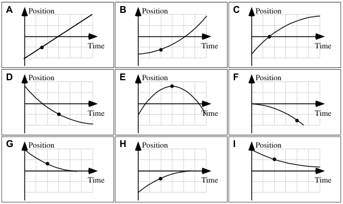
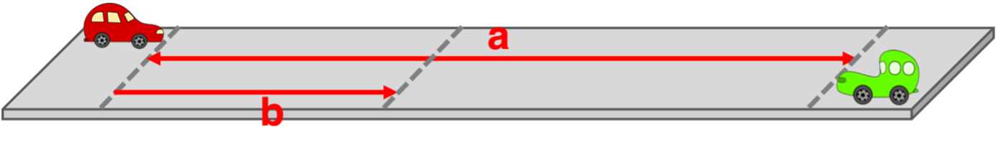
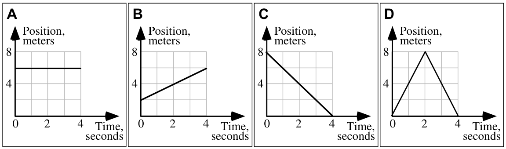
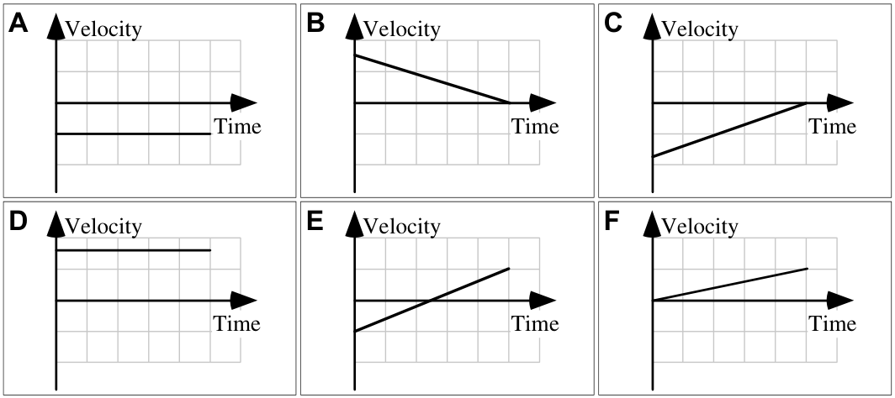
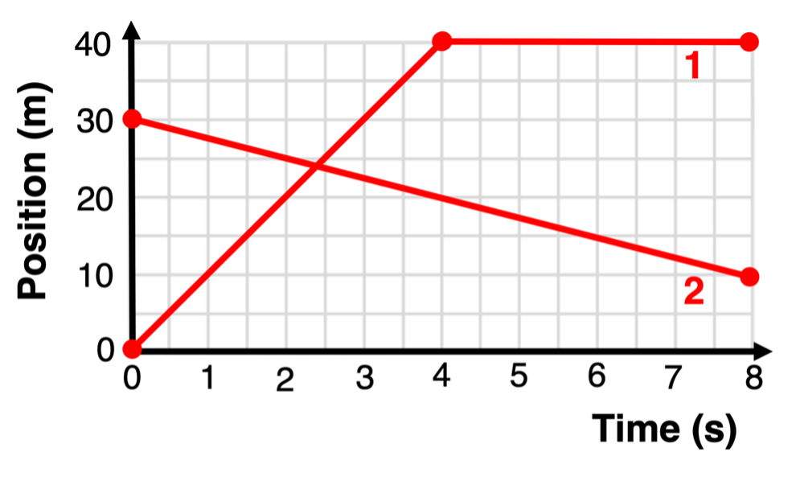

# Regents Physics 🔭 <!---fit--->

# **2024-2025** Agendas

## 👨‍🏫 Mr. Porter

---
<!--- class: halloween--->

# 2024.10.15 **Regents Physics**

##### **❓ of the 📅**: **You can have an unlimited supply of one thing for the rest of your life, what is it? Sushi? Scotch Tape? (You can't say money or anything directly related to money)**

### 📋 Agenda

1. Do Now
2. Kinematic Equations & Cross Diagram
3. Finish Porter Packet Questions
4. Physics Classroom Practice

### 🎯 Goals

🥅 _Solve word problems using kinematic equations & graphs_

### 📆 Upcoming

- Word Problem Quiz on **Friday**

---

# Physics Classroom Equation Practice:

### <u>Mild</u> 🫑
- [Problem Set K13: Kinematic Equations 1](https://www.physicsclassroom.com/calcpad/launch/CPK13)
- [Problem Set K14: Kinematic Equations 2](https://www.physicsclassroom.com/calcpad/launch/CPK14)

 

### <u>Medium</u> 🌶️

- [Problem Set K15: Kinematic Equations 3](https://www.physicsclassroom.com/calcpad/launch/CPK15)
- [Problem Set K16: Kinematic Equations 4](https://www.physicsclassroom.com/calcpad/launch/CPK16)

### <u>Spicy</u> 🥵🔥

- [Problem Set K17: Kinematic Equations 5](https://www.physicsclassroom.com/calcpad/launch/CPK17)
- [Problem Set K18: Kinematic Equations 6](https://www.physicsclassroom.com/calcpad/launch/CPK18)

---

# 2024.10.10 **Regents Physics**

##### **❓ of the 📅**: What is your favorite type of apple?

 

### 📋 Agenda

1. Do Now
2. Set up room for Speed Dating
3. Problem-Solving Graphically
4. Kinematic Equations & Cross Diagram

### 🎯 Goals

🥅 _Solve motion questions graphically and algebraically_

### 📆 Upcoming

- Quiz Tomorrow
  - Practice & Solutions will be posted on Canvas by end of day

---

# 2024.10.08 **Regents Physics** Do Now:

Go to canvas and check your answers to stacks of graphs practice.

Find here:

*Modules* -> *Kinematics* -> *Resources* -> *StacksAnswer.pdf*

---

# 2024.10.08 **Regents Physics**

##### **❓ of the 📅**: **You have to sing karaoke, what song do you pick? 🎤**

 

### 📋 Agenda

1. Do Now - Check Stacks of Graphs Answers on Canvas
2. Usings Areas & Slopes with VT Graphs
3. The Kinematic Equations
4. Cross Diagram & Problem Solving

### 🎯 Goals

🥅 _Solve Problems with VT Graphs Quantitatively_

🥅 _Use the cross diagram to apply kinematic equations to word problems_

### 📆 Upcoming

- Quiz Friday

---

# 2024.10.07 **Regents Physics** Do Now: 

Go to [https://www.physicsclassroom.com/Concept-Builders/Kinematics/Match-That-Graph/Concept-Builder](https://www.physicsclassroom.com/Concept-Builders/Kinematics/Match-That-Graph/Concept-Builder) and complete the ***master level***.

 
Get to this link, Go to Canvas Homepage, scroll down to the slides, and right click link and open in a new tab.

---

# 2023.10.07 **Regents Physics**

##### **❓ of the 📅**: **Would you rather live swim in the world's coldest water or eat the world's hottest pepper?🥶🥵**

 

### 📋 Agenda

1. Do Now 
2. Hand Back Quizzes
3. Card Sort
4. Stacks of Graphs Practice

### 🎯 Goals

🥅 _Relate Motion to Stacks of Kinematic Graphs_

### 📆 Upcoming

- Quiz Friday, we will practice in class

---

## 2024.10.04 **RP Do Now**

For which of these cases, if any, is the ____ at the indicated point?

1. **position zero**?
2. **position negative** 
3. **velocity zero**?
4. **velocity negative**?
5. **acceleration zero**?
6. **acceleration negative**? 

Explain your reasoning.

---

# 2024.10.04 **Regengs Physics**

##### ❓ of the 📅: **What skill or talent do you most want to learn?**

 

### 📋 Agenda

1. Do Now 
2. Finish Notes
3. [Graph that Motion](https://www.physicsclassroom.com/Physics-Interactives/1-D-Kinematics/Graph-That-Motion/Graph-That-Motion-Interactive)
3. Stacks of Graphs Card Sort 
4. Stacks of Graphs Practice in Packet

### 🎯 Goals

🥅 _Represent motion with position vs. time, velocity vs. time and acceleration vs. time graphs_

### 📆 Upcoming

---

<!--- class: halloween --->

## 2024.10.02 **Regents Physics**  Do Now

The position-time graph shown represents the motion of two children who are moving along a narrow, straight hallway.

1. Do either of the children ever change ***direction***?
2. Are the two children ever at the same ***position*** along the hallway?
3. Do the two children ever have the same ***speed***?
4. Do the two children ever have the same ***acceleration***?

---

# 2024.10.02 **Regents Physics**

##### **❓ of the 📅**: What secrets do you think your pet would spill about you, if they could talk?

 

### 📋 Agenda

1. Do Now
2. Finish Card Sort
3. Test Card Sort answers with fan cart
4. Summary Chart with Porter
5. Notes on Graphs
6. Card sort 2 

### 🎯 Goals

🥅 _Recognize shapes of kinematic graphs_

### 📆 Upcoming

---

<!--- class: halloween--->

## 2024.10.01 ***Regents Physics*** Do Now

### Question

A red car (on left) and a green car (on right) are spaced 1200 m apart (distance a). They start at the same time and head towards each other. The red car averages a speed of 13.5 m/s. The green car averages a speed of 15.2 m/s. **How much time will the two cars have traveled when they are at the same position?**

 

### Hints & Tips:

1. Sketch a position vs. time graph with the motion of both cars on it. 
    - What is happening where the lines intersect?
2. Write the equation of motion for each car. 
    - Remember: $x = vt + x_i$ 
3. How can you use the equations to find the tim that they intersect?

---

# 2024.10.01 **Regents Physics** 🎃

##### **❓ of the 📅**: **Is cake 🍰 better than ice cream 🍨?**

 

### 📋 Agenda

1. Do Now
2. Finish Dueling Buggies
3. Card Sort for changing velocity

### 🎯 Goals

🥅 _Apply Constant Velocity Model to solve problems_

---

<!--- class: physics2024 --->

# 2024.09.30 **Regents Physics** Do Now 1

Each graph below shows the position of an object as a function of time.

**Rank the magnitude of the displacement during the time interval from 0 to 4 seconds.**

---

# 2024.09.30 **Regents Physics** Do Now 2

Shown below are six velocity-time graphs for toy robots that are traveling along a straight hallway. All graphs have the same time and velocity scales.

**Rank the magnitudes of the displacements during these intervals.**

---

# 2024.09.30 **Regents Physics** 

##### **❓ of the 📅**: What household chore do you actually enjoy?

#### 📋 Agenda

1. Do Now 
2. Dueling Buggies 

### 🎯 Goals 

🥅 _Modeling Motion graphically, narratively, and pictorially_ 

### 📆 Upcoming

---

# ⚔️ Dueling Buggies 🚗

### 💥 **Goal:**  _Predict where your two buggies will crash_ 💥

#### Procedure:

1. Take any measurements you want about your two buggies
2. Place buggies in "time out"
3. Get _crash situation_ from Mr. Porter
4. Make Prediction (using our models) & Test!

---

# 2024.09.26 **Regents Physics** 

##### **❓ of the 📅**: Is it *OK* to ask the genie for infinite wishes?

#### 📋 Agenda

1. Quiz 
2. Velocity vs. Time Graphs
2. [Practice finding $\Delta x$ with VT Graphs](https://www.physicsclassroom.com/calcpad/launch/CPK11)

### 🎯 Goals 

🥅 _Modeling Motion graphically, narratively, and pictorially_ 

### 📆 Upcoming

- **Thursday**: Quiz - Multiple Representations

---

# 2024.09.25 **Regents Physics** 

##### **❓ of the 📅**: If you had a ⚠️ warning label, what would yours say?

#### 📋 Agenda

1. Practice Quiz 
    - Try to do on your own, but if you get stuck feel free to reach out to your neighbor
2. Velocity vs. Time Graphs
2. [Practice finding $\Delta x$ with VT Graphs](https://www.physicsclassroom.com/calcpad/launch/CPK11)

### 🎯 Goals 

🥅 _Modeling Motion graphically, narratively, and pictorially_ 

### 📆 Upcoming

- **Thursday**: Quiz - Multiple Representations

---

# 2024.09.24 **Regents Physics** 

##### **❓ of the 📅**: Would you rather be a dragon or own a dragon?

#### 📋 Agenda

1. Interpreting position vs. time graphs
2. Average vs. instantaneous
3. Analyzing VT Graphs 
4. Practice

### 🎯 Goals 

🥅 _Modeling Motion graphically, narratively, and pictorially_ 

### 📆 Upcoming

- **Thursday**: Quiz - Multiple Representations

---

# 2024.09.20 **Regents Physics** 

##### **❓ of the 📅**: What animal would you want for a non-traditional pet? (i.e. not a dog, fish or cat)

#### 📋 Agenda

1. Do Nows
2. Motion Sensor Demo
3. Walk the Graph

### 🎯 Goals 

🥅 _Modeling Motion graphically, narratively, and pictorially_ 

---

# Walk the graph 🚶

1. Move, relative to the motion detector, so that you produce a position vs. time graph that closely approximates the graph shown.
2. Describe how you must move in order to produce the motion Be sure to include each of the following in your description: _starting position, direction moved, type of motion, relative speed_.
3. Sketch the velocity vs. time graph that corresponds to the position vs. time graph shown.
4. Sketch the motion map that corresponds to the motion described in the position vs. time graph.

---

## 2024.09.19 **Regents Physics** Do Now

Immediately after Lunch, Madeline runs a few short errands before heading to her favorite class. She walks **$37.3\textrm{ m}$** east from the cafeteria to the Student Activities office. She then walks **$18.3\textrm{ m}$** west to the bookstore. She leaves the bookstore and walks **$27.4\textrm{ m}$** east to the library. She finally walks **$14.7\textrm{ m}$** back west to reach the Physics classroom. Peace at last.

1. What is the total ***distance*** walked by Madeline?
1. What is the *magnitude* of Madeline's ***displacement***?
1. What is the *direction* of Madeline's ***displacement***?

---

## 2024.09.19 **Regents Physics** Do Now #2

Provide a written narrative of the motion for object 1 and object 2. 

---

## 2024.09.19 **Regents Physics** Do Now #2

Provide a written narrative of the motion for object 1 and object 2. 

Did you describe...

1. the initial position?
2. the direction of motion?
3. the type of motion (constant, motionless, etc)
4. the relative speeds?

 

---

# 2024.09.19 **Regents Physics** 

##### **❓ of the 📅**: What's your favorite family recipe?

#### 📋 Agenda

1. Do Nows
2. Motion Maps Notes
3. Representing Motion (1.4)
4. Walk the Graph

### 🎯 Goals 

🥅 _Modeling Motion graphically, narratively, and pictorially_ 

---

## 2024.09.18 **Regents Physics** Do Now

Four students went out for pizza to celebrate after acing their physics final. All of them went directly from their high school to the nearby pizzeria, but they returned along the paths shown, taking different times. Values for the round-trip distances they traveled and the total times they took to walk their routes are given in the figures.

**Rank the *diplacement* of each trip and seperately the *distance***

---

<!-- _footer:   --->

# 2024.09.18 **Regents Physics** 

##### **❓ of the 📅**: Which of the five senses would you say is your strongest?

#### 📋 Agenda

1. Do Now
2. Finish 1.1 - 1.3 
3. Motion Maps Notes
4. 1.4 in Packet

### 🎯 Goals 

🥅 _Modeling Motion_ 

---

<!-- _footer:   --->

# 2024.09.13 **Regents Physics** 

##### **❓ of the 📅**: What extracurriculars do you participate in?

#### 📋 Agenda

1. Reminder - Phones in your bags!
2. Finish Board Meeting
3. Motion Notes
4. Applying the Motion Models

### 🎯 Goals 

🥅 _Experimental Basics_ 

🥅 _Linear Modeling_ 

🥅 _Modeling Motion_ 

---

<!-- _footer:   --->

# 2024.09.13 **Regents Physics** 

##### **❓ of the 📅**: What extracurriculars do you participate in?

#### 📋 Agenda

1. Buggy Lab
    1. Collect Data
    2. Graph in pivot (Code: **fee8f6b2**)
    3. Whiteboard Graph
2. Buggy Lab Board Meeting
3. Modeling Motion Notes

### 🎯 Goals 

🥅 _Experimental Basics_ 

🥅 _Linear Modeling_ 

🥅 _Modeling Motion_ 

---

<!-- _footer:   --->

# 2024.09.12 **Regents Physics** 

##### **❓ of the 📅**: Do you have any weird/unique routines or superstitions? (For example: I ***have*** to put on my left sock before my right sock, and the same for shoes, left on first.)

#### 📋 Agenda

1. Do Now: Finish Pasta Lab Conclusions
2. Do Now: Join Pivot Interactives
    - Code: **fee8f6b2**
3. Buggy Lab

### 🎯 Goals 

🥅 _Experimental Basics_ 

🥅 _Linear Modeling_ 

### 🏠 Homework

- Signed Safety Contract

### **Note**: This is a cellphone free classroom 📵

---

<!-- _footer:   --->

# 2024.09.10 **Regents Physics** 

##### **❓ of the 📅**: Do you have any phobias? 🐍 🕷️ 🚁

#### 📋 Agenda

1. Do Now: Finish Collecting Data & Graphing Lab
2. Whiteboard Graph(s)
3. Pasta Bridge Lab Board Meeting
4. Writing your Discussion & Conclusion Sections of your lab

### 🎯 Goals 

🥅 _Experimental Basics_ 

🥅 _Linear Modeling_ 

### 🏠 Homework

- Signed Safety Contract

### **Note**: This is a cellphone free classroom 📵

---

# Pasta Bridge Lab 🍝

## Objective: 

* Determine the strength of a pasta bridge by finding the relationship between strength (number of marbles) and strands of pasta
* Compare bridge strength of two varieties of pasta

---

# Presenting:

1. How you ran your lab (what was your procedure)
2. What you found:
    - Does your data confirm or deny your hypothesis? How so?
3. Anything else interesting you found

---

# Pasta Bridge Lab 🍝

- What does the slope represent?
  - Can you write a "for each" statment?
- What does the intercept represent?
- How do the slope and/or intercept help support or refute your hypothesis?
  - Do other groups' data agree with yours?

---

# Post Lab

* **Discussion of results**: 
  - Interpret your results in the context of the experiment's objectives.
  - Explain any patterns or trends observed in the data
* **Comparison with hypotheses**: 
  - Explicitly state whether your results support or refute your hypotheses.
  - Discuss possible reasons for any discrepancies.
* **Sources of error and uncertainty**: 
  - Identify potential sources of experimental error.
  - Discuss how these might have affected your results.
  - Quantify uncertainties where possible.

---

# Post Lab

- **Conclusions**: 
  - Summarize the main findings of the experiment.
  - Relate these back to the original objectives and broader scientific principles.
  - Suggest improvements or future directions for the experiment.

---

<!-- _footer: 🤔 Did you get better at science today? Did you help make someone else better today? --->

# 2024.09.09 **Regents Physics** 

##### **❓ of the 📅**: If you were to open a restaurant, what kind of food would you offer?

#### 📋 Agenda

1. Pasta Bridge Lab - Reminder of Goals 
2. [Experimental Methods](https://www.mrporterphysics.com/Presentations/Exp%20Methods/slides/ExpMethods.html#1)
2. Pasta Bridge Lab - Collect & Analyze Data

### 🎯 Goals 

🥅 Experimental Basics_ 

🥅 _Linear Modeling_ 

### 🏠 Homework

- Signed Safety Contract

### **Note**: This is a cellphone free classroom 📵

---

### Reminders...

- Notebook in ***pen***
- Date start of your entry

### Goals...

1. Collect Data
2. Graph & Analyze Data
3. Put Graph(s) on Whiteboard to present

---

# A Few Requests 

1) Please make sure all broken pasta strands end up in the trash 
2) Please have someone in your group ready to catch the cup ***BEFORE*** the strands of pasta break
    * there is always one group who forgets...***don't be that group***

---

<!-- _footer: 🤔 Did you get better at science today? Did you help make someone else better today? --->

# 2024.09.06 **Regents Physics** 

##### **❓ of the 📅**: Sweet or savory for breakfast?

#### 📋 Agenda

0. Sit Anywhere
1. Do Now (fill out questionnaire & card)
2. Question of the Day
3. Grouping Game
4. Survival Island

### 🎯 Goals 

🥅 _Introductions_

🥅 _Classroom Culture_

### 🏠 Homework

- Signed Safety Contract

### **Note**: This is a cellphone free classroom 📵

---
<!--- background: black--->
# Do **Now** 

1. Fill out index card:
    1. Name
    2. Phone number to reach your parents/guardians if you sleep through the AP Exam
    3. Favorite Candy
    4. Favorite Emoji
    5. Emoji the describes your current mood
2. Fill out Paper Quesionnaire

---

# Lab Grouping Game

- There are 14 of you, two groups of 4, two groups of 3
- Based on your cards get into ***LOGICAL*** groups of 4 (or 3)
- Check **whole class** answer with Mr. Porter
    - 4 Chances to Check
- Reorganize if necessary

(Yes this is the game Connections)

---

# Survival Island 🌴

1. Share your *survival skill* that **you wrote down** with your group
2. Using ***everyone's skill*** develop a plan to survive or escape the deserted island
3. On your whiteboard present your plan (drawing, mind map, set of instructions)
    - Highlight everyone's skill

---

# Surivial Plan... <!--fit--->

---

# Pasta Bridge Lab 🍝

## Objective: 

* Determine the strength of a pasta bridge by finding the relationship between strength (number of marbles) and strands of pasta

---

# 🥼 Lets Science! 🥼 <!--fit--->

# 📓 Lab Notebooks 📓 <!--fit--->

---

# What is a Lab Notebook?

* A detailed, chronological record of a scientist's research activities, experiments, and observations. 
* Documentation of the scientific process from intial ideas to final results and conclusions. 

---

# Why keep lab notebooks?

* Document Research
* Develop Ideas
* Organize Data 
* Collaboration Tool
* Publication Support
* Troubleshooting 
* Intellectual Property Protection
* Historical Record

---

# Lab Notebooks can be Legal Documents 

* Proof of invention in Patent Cases
* Intellectual Property Protection
* Admissibility in court - must be properly maintained
* Note: Often property of the instituation where the research was conducted (i.e. Property of Regeneron, or Property of Cornell University)

---

# Remember

* Lab notebooks are most importantly scientific documentation
* They represent the scientific process and are record of your **thinking**
    * This means your ideas and conclusions and hypotheses can **change** based on **new data**

---

# Lab Notebook

* Write in **pen**
* All mistakes get a ~~single cross through~~
* Full Date (YYYY/MM/DD) at the beginning of each entry (for multiday labs date start of each day)
* Enter Lab Pages into table of contents 

---

# Lab Notebook - Pre Lab

* **Title and objective of the experiment**: 
  - Write a clear, concise title for each experiment.
  - State the main objective or purpose of the experiment in 1-2 sentences.
* ***Theoretical background**: 
  - Briefly explain the relevant scientific principles.
  - Include key equations or concepts that will be tested or applied.
* **Hypotheses**: 

  - State your predictions about the experiment's outcome.
  - Base these on your understanding of the theory.

---

# Lab Notebook - Pre Lab

* **Materials and equipment list**: 
  - Provide a detailed list of all materials and equipment used.
  - Include model numbers and specifications where relevant.
* **Experimental procedure outline**: 
  - Write a step-by-step outline of the planned procedure.
  - Be specific enough that someone could replicate your experiment.

---

<!--- footer:   --->

# During the Experiment

* **Raw data in tables with units**: 
  - Create neat, organized tables for all numerical data.
  - Always include units and uncertainty estimates.
  - Label columns clearly and use consistent significant figures.
* **Observations and qualitative notes**: 
  - Record all relevant observations, even if they seem unimportant.
  - Note any unexpected occurrences or anomalies.
* **Any changes to the planned procedure**: 
  - Document any deviations from the original procedure.
  - Explain why changes were made and how they might affect results.
* **Sketches or diagrams of experimental setup**: 
  - Include clear, labeled diagrams of your experimental setup.
  - Add dimensions and important details to aid in replication.

---

# Post Lab

* **Data analysis and calculations**: 
  - Show all steps in your calculations, including formulas used.
  - Explain your reasoning for each step of the analysis.
* **Graphs and charts**: 
  - Create neat, properly labeled graphs and charts.
  - Include titles, axis labels with units, and legends where appropriate.

---

# Post Lab

* **Discussion of results**: 
  - Interpret your results in the context of the experiment's objectives.
  - Explain any patterns or trends observed in the data
* **Comparison with hypotheses**: 
  - Explicitly state whether your results support or refute your hypotheses.
  - Discuss possible reasons for any discrepancies.
* **Sources of error and uncertainty**: 
  - Identify potential sources of experimental error.
  - Discuss how these might have affected your results.
  - Quantify uncertainties where possible.

---

# Post Lab

- **Conclusions**: 
  - Summarize the main findings of the experiment.
  - Relate these back to the original objectives and broader scientific principles.
  - Suggest improvements or future directions for the experiment.

---

# Pasta Bridge Lab 🍝

## Objective: 

* Determine the strength of a pasta bridge by finding the relationship between strength (number of marbles) and strands of pasta