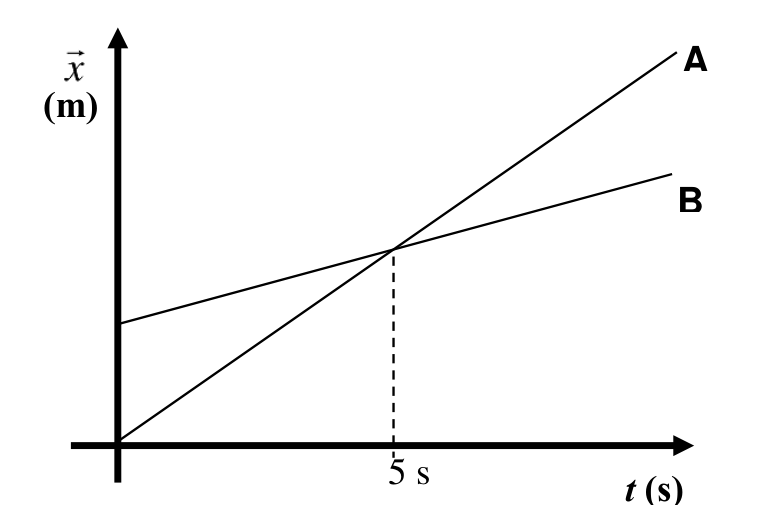
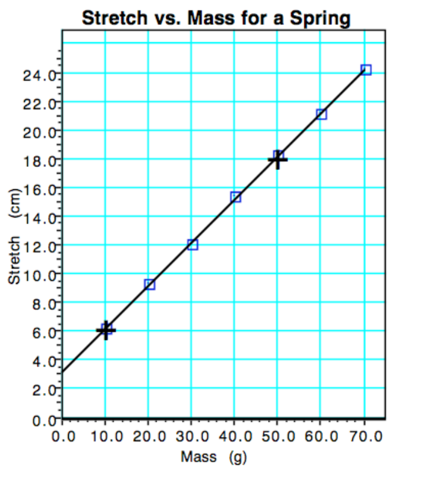

# Physical Science

## Mr. Porter

### Maple Hill High School

#### Spring 2025

---

# 2025.05.06 **Physical Science**

##### **❓ of the 📅**: What was your childhood dream job? Is it still your dream job?

 

#### 📋 Agenda

1. Balanced vs. Unbalanced Forces - Pivot
2. Inertia Definition and Discussion
3. Inertia Think Sheet

### 🎯 Goals

🥅 _Define Inertia_

🥅 _Define conditions for acceleraiton and constant velocity_

### 📆 Upcoming

---

# 2025.05.02 **Physical Science**

##### **❓ of the 📅**: What would be on your ultimate ice cream sundae? 🍨

 

#### 📋 Agenda

1. Slides on Motion Graphs
2. Pivot - Motion Graphs: Constant Acceleration

### 🎯 Goals

🥅 _Model constant acceleration motion with graphs_

### 📆 Upcoming

---

# 2025.04.30 **Physical Science**

##### **❓ of the 📅**: If you were ruler of your own country what would be the first law you would introduce?

 

#### 📋 Agenda

1. Section 6 of Lab Together
2. Describing Motion with Diagrams & Numerically

### 🎯 Goals

🥅 _Model Motion Graphically and Numerically_

### 📆 Upcoming

---

# 2025.04.28 **Physical Science**

##### **❓ of the 📅**: What animal do you think is the coolest?

 

#### 📋 Agenda

1. Make VT Graphs on Pivot - Finisih Pivot
    - Section 5: On your own, call me over for help
    - Section 6: Together
3. Describing Motion with Diagrams & Numerically

### 🎯 Goals

🥅 _Model Motion Graphically and Numerically_

### 📆 Upcoming

---

# 2025.04.24 **Physical Science**

##### **❓ of the 📅**: How many pairs of shoes do you own?

 

#### 📋 Agenda

1. Advanced Introduction to Acceleration
    - Complete through **Part 3** and 🛑
    - Discuss
    - Linearizing 
    - Complete Pivot

### 🎯 Goals

🥅 _Learn how to model constant acceleration with position vs. time graphs_

### 📆 Upcoming

---

# 2025.04.22 **Physical Science**

##### **❓ of the 📅**: How was your break?

 

#### 📋 Agenda

1. Pivot: Introduction to Constant Acceleration (Ramp)

### 🎯 Goals

🥅 _Create velocity time graph for constant acceleration_

🥅 _Interpret Velocity time graph to make meaning of the slope and intercept_

### 📆 Upcoming

---

# 2025.04.11 **Physical Science**

##### **❓ of the 📅**: What's your favorite fast food chain?

 

#### 📋 Agenda

1. Defining Acceleration
2. Acceleration Worksheet
3. [Acceleration Concept Builder](https://www.physicsclassroom.com/Concept-Builders/Kinematics/Acceleration/Concept-Builder) (🔗 Link in Canvas)
    - Modules -> 1D Motion -> Acceleration Concept Builder

| Block          | Start | End   |
| -------------- | ----- | ----- |
| Block 1        | 7:40  | 8:40  |
| Advisory       | 8:43  | 8:53  |
| Block 2        | 8:56  | 9:56  |
| JR HS-Block 3A | 9:59  | 10:32 |
| Lunch 7/8      | 10:33 | 11:03 |
| JR HS-Block 3B | 11:04 | 11:36 |
| Block 4        | 11:39 | 12:39 |
| Assembly       | 12:39 | 2:00  |

---

# 2025.04.09 **Physical Science**

##### **❓ of the 📅**: What is your ideal sandwich? 🥪

 

#### 📋 Agenda

1. Introduction to Acceleration Pivot
2. Discuss Acceleration 
3. [Acceleration Concept Builder](https://www.physicsclassroom.com/Concept-Builders/Kinematics/Acceleration/Concept-Builder)

### 🎯 Goals

🥅 _Define Acceleration_

### 📆 Upcoming

---

# 2025.04.07 **Physical Science**

##### **❓ of the 📅**: What was the last movie you went to? What did you think?

 

#### 📋 Agenda

1. 🍅 Ketchup: Finish Walk the Graph Lab
2. 🟨 Mustard: Multiple Representations Practice Sheet
3. 🟩 Relish: Introduction to Acceleration Pivot Activity

### 🎯 Goals

🥅 _Model and physically represent constant velocity motion_

---

# 2025.04.03 **Physical Science**

##### **❓ of the 📅**: Would you rather vacation in Hawaii or Alaska, and why?

 

#### 📋 Agenda

1. Introductiont to motion maps
2. Practice with Motion Maps
3. Walk the graph lab

### 🎯 Goals

🥅 _Model motion pictorially_

🥅 _Use motion representations to translate between motion and multiple representations_

### 📆 Upcoming

---

# 2025.03.24 **Physical Science**

##### **❓ of the 📅**: Would you rather live in a floating city in the sky or an underwater city?

 

#### 📋 Agenda

1. Finish Collisions Pivot
2. Notes on Motion Maps
3. Walk the graph lab

### 🎯 Goals

🥅 _Represent Motion Pictorially_

### 📆 Upcoming

- I am at a conference Wed & Fri -> you will have a pivot assignment to complete

---

# 2025.03.19 **Physical Science**

##### **❓ of the 📅**: If you could safely travel at the speed of light, where would you go first?

 

#### 📋 Agenda

1. Rolling Ball Challenge Level 3: Collisions

### 🎯 Goals

🥅 _Model motion with position vs. time graphs_

### 📆 Upcoming

---

# Rolling Ball Challenge Level 3: Collisions

### What is happening where the lines intersect?

---

# 2025.03.18 **Physical Science**

##### **❓ of the 📅**: If you could go to the Olympics, what sport would you want to do?

 

#### 📋 Agenda

1. Ball Rolling Left Lab

### 🎯 Goals

🥅 _Model motion with position vs. time graphs_

### 📆 Upcoming

---

# 2025.03.12 **Physical Science**

##### **❓ of the 📅**: Would you rather be in a reality baking show contest or a dating show contest?

 

#### 📋 Agenda

1. Finish Velocity Calculations
	1. Whiteboard and check answers
2. Skater Velocity Calculations
3. Ball Rolling Left Pivot

### 🎯 Goals

🥅 _Practice calculating average velocity_

### 📆 Upcoming

---

# 2025.03.10 **Physical Science**

##### **❓ of the 📅**: If you could redesign the human body, what one improvement would you make?

 

#### 📋 Agenda

1. Distance & Displacement Review -> Think Sheet
1. Calculating Average Velocity
2. Pivot -> Find Skaters' average velocity
3. Pivot -> Ball Rolling Left

### 🎯 Goals

🥅 _Calculate Average Velocity_

### 📆 Upcoming

---

# 2025.03.06 **Physical Science**

##### **❓ of the 📅**: Question

 

#### 📋 Agenda

1. Distance vs. Displacement
    - Notes/discussion
    - Think Sheet 
    - [Distance vs. Displacement Concept Builder](https://www.physicsclassroom.com/Concept-Builders/Kinematics/Distance-vs-Displacement/Interactive)
	-  [MOP - Distance & Displacement](https://www.physicsclassroom.com/mop/Kinematic-Concepts/Distance-and-Displacement/Mission-KC2)

### 🎯 Goals

🥅 _Differentiate between distance and displacement_

### 📆 Upcoming

---

# 2025.03.04 **Physical Science**

##### **❓ of the 📅**: Is tap water better than bottled water?

 

#### 📋 Agenda

1. Introduction to Motion
2. Describing Motion
3. Ball Rolling Left Pivot

### 🎯 Goals

🥅 _Describe Motion Verbally_

### 📆 Upcoming

---

# 2025.02.28 **Physical Science**

##### **❓ of the 📅**: What topic could you give a 20-minute presentation on without any preparation?

 

#### 📋 Agenda

1. Ping-Pong Ball Bazooka Pivot
    - Modeling Motion:
        - with pictures
        - with graphs
        - with equations

### 🎯 Goals

🥅 _Model the motion of a ping pong ball_

---

# 2025.02.26 **Physical Science**

##### **❓ of the 📅**: What is your funniest family vacation moment?

 

#### 📋 Agenda

1. Finish Pendulum Lab
    - mass vs. period
    - release angle vs. period
    - length vs. period 

### 🎯 Goals

🥅 _Design controlled experiments to answer a question_

---

# 2025.02.24 **Physical Science**

##### **❓ of the 📅**: If you could instantly become an expert in something, what would it be?

 

#### 📋 Agenda

1. Pendulum Lab

**Question**: What factors affect the period of a pendulum?

**Purpose**: Design controlled experiments to isolate the effect of a single variable at a time. 

### 🎯 Goals

🥅 _Design multiple controlled experiments._

### 📆 Upcoming

---

# 2025.02.13 **Physical Science**

##### **❓ of the 📅**: Would you rather lose all of your money or all of your pictures?

#### 📋 Agenda

1. Finish Ball Bounce Lab Board Meeting
    - Intercept, Slope, Making Predictions
2. Test Model
3. Writing Linear Mathematical Models

---

# Using Graphs to Make Predictions

## "For Every" Statement

* The [**y variable**] [increases/decreases/remains the same] [slope value] [y variable units] _for every_ 1 [x units] of [x variable] change.

* A slope of 12 cm/s would give the following statement
    * _The **position** increases 12 cm for every 1 second of **time** change._

---

# Calculating Slope

 
 
 

$$\boxed{slope = m = \frac{\Delta y}{\Delta x} = \frac{y_2 - y_1}{x_2 - x_1}}$$

---

# Calculuate Slope

1. Find two points on best fit line:
    - $(50, 18)$ and $(10,6)$
2. Use Slope Formula

$$ m = \frac{y_2 - y_1}{x_2-x_1} = \frac{18-6}{50-10} $$

3. Add in units

$$m = \frac{12 \text{ cm}}{40 \text{ g}}$$

---

# 2025.02.11 **Physical Science**

##### **❓ of the 📅**: What reality TV show would you star in?

 

#### 📋 Agenda

1. Finish Collecting Ball Bounce Data
2. Finish Ball Bounce Pivot & Questions - **Do not submit yet**
3. Whiteboard Lab Results 
4. Board Meeting & Submit Lab
5. Using graphs for predictions

### 🎯 Goals

🥅 _Model Bouncing Ball_

🥅 _Identify Mathematical Relationships_

🥅 _Use Models to make Predictions_

---

---

# 2025.02.07 **Physical Science**

##### **❓ of the 📅**: Hanging out by a camp fire, bonfire, or fireplace?

 

#### 📋 Agenda

1. Proportional Reasoning Quick Check (complete with a partner)
2. Ball Bounce Lab

### 🎯 Goals

🥅 _Design an experiment_

🥅 _Collect & Analyze Data_

🥅 _Write a conclusion based on evidence and reasoning_

---

# Ball Bounce Lab 🏀

### Question:

How is the bounce height of a ball related to the release height of the ball?

### Purpose:

To determine the type of relationship (linear, quadratic, inverse, or constant) that relates the bounce height to the release height.

---

# 2025.02.05 **Physical Science**

##### **❓ of the 📅**: What does your warning :warning: label say?

 

#### 📋 Agenda

1. Experimental Variables and Types of Mathematical Relationships 
2. Identifying Experimental Relationships
    - Links for [Graph 1](https://www.desmos.com/calculator/mvl8sk6qer) || [Graph 2](https://www.desmos.com/calculator/5gxv44prt1) || [Graph 3](https://www.desmos.com/calculator/zhwpyvtq8l) || [Graph 4](https://www.desmos.com/calculator/nj6olrzfpy) || [Graph 5](https://www.desmos.com/calculator/xg0tlbvbci)

### 🎯 Goals

🥅 _Identify mathematical relationships_

🥅 _Relate mathematical relationships to proportional reasoning_

### 📆 Upcoming

---

# Experiments

## Typical Goal: 
to determine the effect of one quantity upon another quantity.

## Example: 
How does the **mass** of an object affect its **acceleration**? That is, to determine the effect of **mass** upon **acceleration**.

---

## ***Variable*** - a quantity that changes or varies.

### Independent Variable: 
the variable that the scientist intentionally changes each trial.

### Dependent Variable: 

the variable that changes in response to the changes that are made to the independent variable.

---

## Dependent vs Independent Variable

### Purpose: 
to determine the effect of mass upon the acceleration of an object.
### Independent Variable: 
mass (it is varied by the scientist from trial to trial)
### Dependent Variable: 
acceleration (it varies in response to changes in the mass)

---

# Dependent vs Independent Variable

---

# DRY MIX

### **D**ependent - **R**esponding - **Y**-axis

The dependent variable changes in response to the other variable; its values are plotted on the y-axis.

### **M**anipulated - **I**ndependent - **X**-axis
The independent variable is the one that is manipulated or changed by the scientist; values are plotted on the x-axis.

---

## What types of patterns are possible?

1. Linear Relationship
2. Non- or Constant Relationship
3. Quadratic Relationship
4. Inverse Relationship

---

# Linear Relationship

Any given change in the independent variable (x) will always produce the same change in the dependent variable (y). 

When x changes by a certain amount (1 unit), the value of y always changes by the same amount (e.g., 2 units).

 

| x | y | 
|---|---|
| 0 | 4 | 
| 1 | 6 | 
| 2 | 8 | 
| 3 | 10 | 
| 4 | 12 | 
| 5 | 14 | 

---

# Directly Proportional 
A special type of linear relationship - shows an x-y plot that is linear and has a y-intercept of zero.

Whatever change is made to one variable is made to the other variable.
Double x … double y
Triple x … triple y
Halve x … halve y

 

| x | y | 
|---|---|
| 0 | 0 | 
| 1 | 2 | 
| 2 | 4 | 
| 3 | 6 | 
| 4 | 8 | 
| 5 | 10 | 

---

# Directly Proportional 
A special type of linear relationship - shows an x-y plot that is linear and has a y-intercept of zero.

Whatever change is made to one variable is made to the other variable.
**Double x … double y**
Triple x … triple y
Halve x … halve y

 

| x | y | 
|---|---|
| 0 | 0 | 
| 1 | 2 | 
| **2** | **4** | 
| 3 | 6 | 
| **4** | **8** | 
| 5 | 10 | 

---

# Directly Proportional 
A special type of linear relationship - shows an x-y plot that is linear and has a y-intercept of zero.

Whatever change is made to one variable is made to the other variable.
Double x … double y
**Triple x … triple y**
Halve x … halve y

 

| x | y | 
|---|---|
| 0 | 0 | 
| **1** | **2** | 
| 2 | 4 | 
| **3** | **6** | 
| 4 | 8 | 
| 5 | 10 | 

---

# Directly Proportional 
A special type of linear relationship - shows an x-y plot that is linear and has a y-intercept of zero.

Whatever change is made to one variable is made to the other variable.
Double x … double y
Triple x … triple y
**Halve x … halve y**

 

| x | y | 
|---|---|
| 0 | 0 | 
| 1 | 2 | 
| 2 | 4 | 
| 3 | 6 | 
| 4 | 8 | 
| 5 | 10 | 

---

# Non-Relationship 

## (or Constant Relationship)
A change in one variable will have no effect upon the value of the other variable. 

As the value of x changes, the value of y remains constant.

 
 
 
X has NO effect upon Y.

 

| x | y | 
|---|---|
| 0 | 4 | 
| 1 | 4 | 
| 2 | 4 | 
| 3 | 4 | 
| 4 | 4 | 
| 5 | 4 | 

---

# Quadratic Relationship

Most commonly, a quadratic will show an exponent of 2, indicating that the y value depends on the square of x. 

Whatever change is made to x, the square of that change is made to y.
 

Double x…Quadruple y
Triple x…Nine times y
Halve x…One-quarter y

 

| x | y | 
|---|---|
| 0 | 0 | 
| 1 | 2 | 
| 2 | 8 | 
| 3 | 18 | 
| 4 | 32 | 
| 5 | 50 | 

---

# Quadratic Relationship

Most commonly, a quadratic will show an exponent of 2, indicating that the y value depends on the square of x. 

Whatever change is made to x, the square of that change is made to y.
 

**Double x…Quadruple y**
Triple x…Nine times y
Halve x…One-quarter y

 

| x | y | 
|---|---|
| 0 | 0 | 
| **1** | **2** | 
| **2** | **8** | 
| 3 | 18 | 
| 4 | 32 | 
| 5 | 50 | 

---

# Inverse Relationship 

An increase in one variable causes a decrease in the other variable. 

Whatever change is made to x, the reciprocal change is made to y.

- Double x…Halve y
- Quadruple x…One-fourth y
- Halve x…Double y

 

| x | y | 
|---|---|
| 1 | 12 | 
| 2 | 6 | 
| 3 | 4 | 
| 4 | 3 | 
| 5 | 2.4 |
| 6 | 2 |  

---

# Inverse Relationship 

An increase in one variable causes a decrease in the other variable. 

Whatever change is made to x, the reciprocal change is made to y.

- **Double x…Halve y**
- Quadruple x…One-fourth y
- Halve x…Double y

 

| x | y | 
|---|---|
| 1 | 12 | 
| **2** | **6** | 
| 3 | 4 | 
| **4** | **3** | 
| 5 | 2.4 |
| 6 | 2 |  

---

# The Big Idea 💡

## Throughout the year we will do experiments and collect data for the dependent and independent variables.

## Then we will need to identify the type of relationship from the patterns that we observe in the data.

---

# 2025.02.03 **Physical Science**

##### **❓ of the 📅**: Where are five places you really want to visit before you die?

 

#### 📋 Agenda

1. Finish Rolling Ball Challenge
2. Types of Relationships -- Probably save for Wednesday

| Block            | Start | End   |
| ---------------- | ----- | ----- |
| Block 1          | 9:40  | 10:33 |
| Block 2          | 10:35 | 11:28 |
| JR HS - Block 3A | 11:30 | 12:03 |
| Lunch 7/8        | 12:04 | 12:34 |
| Block 3B         | 12:35 | 1:07  |
| Block 4          | 1:09  | 2:00  |

---

# 2025.01.30 **Physical Science**

##### **❓ of the 📅**: _If you suddenly had a 25 hour day, what would you do with your extra hour?_

 

#### 📋 Agenda

1. Discuss Buggy Lab
2. Claim-Evidence-Reasoning
3. Rolling Ball Challenge 🎳

### 🎯 Goals

🥅 _Use Mathematical Models_

🥅 _Make a scientific argument_

---

# Dune Buggy Challenge

## 💡 Big Ideas

* We can use models to make predictions
* Collecting Data 
* Use Pivot Tools
* Start Making Scientific Arguments 

---

# CER in AP Physics:

* ***Claim***:
    * Sentence that answers the question.

* ***Evidence***:
    * Explanation of how the evidence supports the claim.
        * Should include details!
        * Refer back to the question, include any data, diagrams, or graphs.

* ***Reasoning***:
    * Physics principle, such as an equation, law, or definition.
        * This is general, do no include specific details.

---

# Game: Soup, Salad, or Sandwich

1. Write a Claim-Evidence-Reasoning statement arguing whether the shown food is a soup, salad, or a sandwich. 

---

---

---

---

# CER Practice:

### A lab is performed to determine whether or not a car driving along Lake Avenue is speeding.

**Which is an appropriate Claim for the Conclusion section of such a lab?**

1. We analyzed the car’s motion, plotted it on the computer and determined its speed.
2.  This was a great lab! We had a lot of fun finding the speed of the car. We should do more of these.
3. We determined that the speed of the car was 49 mi/hr.
4. The car we analyzed was speeding.

---

# CER Practice:

### A lab is performed to determine whether or not a car driving along Lake Avenue is speeding.

**Which is an appropriate statement of the *Evidence* for the Conclusion section of such a lab?**

1. The car was speeding.
2. The calculated the slope of the line. We might have made an error in the calculation but it was 49 mi/hr.
3. The position-time plot of the car’s motion is shown in the Data section. The slope of the line was found to be 49 mi/hr. This is 4 mi/hr over the speed limit.

---

# CER Practice:

### A lab is performed to determine whether or not a car driving along Lake Avenue is speeding.

**Which is an appropriate statement of the Reasoning for the Conclusion section of such a lab?**

1. Speed limit signs are always clearly posted on the road side.
2. Some cars go faster than other cars. The car we analyzed was speeding.
3. The slope of the line on a position-time plot is equal to the speed of the object.

---

# Rolling Ball Challenge 🎳 <!--fit--->

---

# 2025.01.27 **Physical Science**

##### ❓ of the 📅: Sweet of savory for breakfast? 

 

#### 📋 Agenda

0. Introductions
1. Fill out index card & Survival Island
1. Dune Buggy Challege

### 🎯 Goals

🥅 _Create a linear model to make predictions_

---

# A Few Questions... 🤔
### Answer on your index card 

1. What do you like to be called? What Emoji describes you?	
2. The class is stranded on a deserted island. What special skill(s) can you bring to this dire situation?	
3. What is unique about you that leads to your happiest times and best performances at school?	
4. What is unique about you that allows you to work well in groups for the success of the group as a whole?	
5. What has a teacher done for you in the past which has allowed you to learn?

---

# Survival Island 🏝️

## You and your group are stranded on an deserted island 😮!

### Using *each* of your **unique skill's** develop a plan to escape the island.

1. Whiteboard your response (one person)
2. Be prepared to share out your plan to escape the island as a group. Each of you should offer a part of the plan to the class.

