# AP Physics 🔭 <!---fit--->

# **2025-2026** Agendas

## 👨‍🏫 Mr. Porter

---

---

# 2026.02.11 **AP Physics**

##### **❓ of the 📅**: QUESTION

 

#### 📋 Agenda

1. Do Now
2. Energy Conservation 
3. Energy Bar Graphs - [Interactive](https://www.mrporterphysics.com/AP%20Resource%20Pages/Simulations/EnergyBarGraphs.html)

### 🎯 Goals

🥅 _Identify Energy Storage_

🥅 _Model conservation of energy and the work-energy theorem graphically_

### 📆 Upcoming

- Quiz **Friday** -> Workbook 3.M & 3.O are good practice
- Physics Classroom Due Friday

---

# 2026.02.09 **AP Physics**

##### **❓ of the 📅**: What was your favorite commercial last night?

 

#### 📋 Agenda

1. Introduction to [Energy](../../../Presentations/APETM/talks/APEnergy2026.html) 
    - What is it?
    - How do we define it?
2. Flavors of Energy
3. Work 

### 🎯 Goals

🥅 _Define energy and the ways it is stored_

### 📆 Upcoming

- PC Circular and Satellite Motion 4
- PC Circular and Satellite Motion 5

---

# 2026.02.06 **AP Physics**

##### **❓ of the 📅**: What is your favorite superbowl snack?

 

#### 📋 Agenda

1. ULG Review
2. AP FRQ Practice - Complete with Lab group - we will go over with rubric towards end of class. 
    - 2018 # 1 
    - 2022 # 2 

### 🎯 Goals

🥅 __

### 📆 Upcoming

---

# 2026.02.06 **AP Physics**

##### **❓ of the 📅**: Hanging out by a camp fire, bonfire, or fireplace?

 

#### 📋 Agenda

1. ULG 
2. ULG Workbook:
3. Satellite Motion: 

### 🎯 Goals

🥅 _Model orbits objects with centripetal motion_

### 📆 Upcoming

---

# 2026.02.05 **AP Physics**

##### **❓ of the 📅**: Which Disney Princess would you choose to be?

 

#### 📋 Agenda

1. Finish Conical Pendulum Lab
    - Get checked by me when finished
2. Quiz 
3. Universal Law of Gravitation

### 🎯 Goals

🥅 _Model Gravity_

### 📆 Upcoming

- PC Homework Due

---

# 2026.02.03 **AP Physics**

##### **❓ of the 📅**: Are you ready for spring yet? 

 

#### 📋 Agenda

1. Conical Pendulum - Flying Farm Animals 

### 🎯 Goals

🥅 _Model a conical pendulum_

### 📆 Upcoming

- Quiz **Thursday**
- PC Circular and Satellite Motion **1**: N2L Analysis
- PC Circular and Satellite Motion **3**: N2L Analysis

---

# Conical Pendulum - Flying Farm Animals 

## *The buffalo farm has recently acquired some flying animals and needs to test the length of the flying animals' leashes. The farm is trying to find a way to predict how long it takes for the animals to complete one circle while attached to their loop.* 

## **Your goal is to predict the time it takes for your animal to take 10 swings based on the length of your animal's string**.

### Materials:

- Meterstick, Stopwatch, Flying Farm Animal

---

# 2026.02.02 **AP Physics** Do Now

A sled slides along a vertical circular track of radius $r$, as shown. There is negligible friction between the sled and the track. At the bottommost point of the track, the sled has speed $v_b$. Which of the following graphs best show the normal force exerted by the track on the sled at the bottommost point of the track as a function of $v_b$?

 

A.  B. 

C.  D. 

---

**A motor swings a ball on a string in a vertical circle such that the tension in the string is constant throughout the ball's motion. Which of the following  correctly indicates at which point the ball has the greatest speed and provides a valid justification?**

A. At the topmost point, because the tension force and gravitational force are both directed toward the center of the ball's motion.
B. At the topmost point, because the net force on the ball is zero.
C. At the bottommost point, because the tension offsets the gravitational force.
D. At the bottommost point, because the net force on the ball is a maximum.

---

# 2026.02.02 **AP Physics**

##### **❓ of the 📅**: What are two of your pet peeves?

 

#### 📋 Agenda

1. Do Now 
2. Workbook Day:
    - Goal: 3.F - 3.H
    - Stretch Goal: 3.I

### 🎯 Goals

🥅 _Model horizontal circular motion_

### 📆 Upcoming

- Quiz **Thursday**
- PC Circular and Satellite Motion **1**: N2L Analysis
- PC Circular and Satellite Motion **3**: N2L Analysis

---

# 2026.01.30 **AP Physics** Do Now

A skateboarder is skating over a circular bump. At the instant shown, she is at the top of the bump and is moving with a speed of 5 m/s.  **Is the normal force exerted on the skateboarder by the bump (i) greater than, (ii) less than, or (iii) equal to the weight of the skateboarder?**  Explain your reasoning.

---

# 2026.01.30 **AP Physics**

##### **❓ of the 📅**: What luxury is totally worth the price?

 

#### 📋 Agenda

0. Do Now
1. Recap
2. Numerical $F_c$ Calculations
3. AP Workbook 3.D & 3.E  

### 🎯 Goals

🥅 _Model centripetal motion_

### 📆 Upcoming

**Test Corrections** Due Friday 2/6

---

# 2026.01.28 **AP Physics**

##### **❓ of the 📅**: Should you eat rice with a fork 🍴, a spoon 🥄, or chopsticks 🥢?

 

#### 📋 Agenda

1. Review -> Tangential Velocity, Centripetal Acceleration
2. Define Uniform Circular Motion
3. Centripetal vs. Centrifugal
3. Circular Motion Derivations - Vertical Circles

### 🎯 Goals

🥅 _Model vertical circles_

### 📆 Upcoming

HW PC (due **Friday**): 
- Set CG1: Linear Speed	
-	Set CG2: Centripetal Acceleration 1

**Test Corrections** Due Friday 2/6

---

# 2026.01.27 **AP Physics**

##### **❓ of the 📅**: If you could make _one_ chore disappear, what would it be?

 

#### 📋 Agenda

1. Buffet Quiz 🍽️ 
    1. Work on Physics Classroom or Test Corrections when waiting
2. Centripetal Forces 

### 🎯 Goals

🥅 _Model Centripetal Forces_

### 📆 Upcoming

HW Physics Classroom: 
- Set CG1: Linear Speed	
-	Set CG2: Centripetal Acceleration 1

**Test Corrections** Due Friday 2/6

---

# 2026.01.22 **AP Physics**

##### **❓ of the 📅**: Who is your celebrity crush?

 

#### 📋 Agenda

0. New Lab [Groups](https://grouper.school/presentations/RrhYEJEtMFBp9gg3u9Og) 
1. AP Workbook 3.A
    - [Circ. Simulations](https://www.mrporterphysics.com/AP%20Resource%20Pages/Simulations/circularmotion.html)
    - Masking Tape Game
1. AP Workbook 3.B
    - [Simulation Link](https://www.mrporterphysics.com/AP%20Resource%20Pages/Simulations/AP3BDirectionAccAndVelo.html)
3. Notes 
4. Workbook 3.C

### 🎯 Goals

🥅 _Model circular motion kinematically_

### 📆 Upcoming

- _Buffet Quiz_ on **Tuesday** Next Week
  - like a buffet, you pick the standards you want
  - check canvas for averages

---

# 2026.01.21 **AP Physics**

##### **❓ of the 📅**: You got this.

#### 📋 Agenda

1. Test
    - Write in the boxed area
    - There is a graph printed
    - Ignore the very last question (pendulum)

---

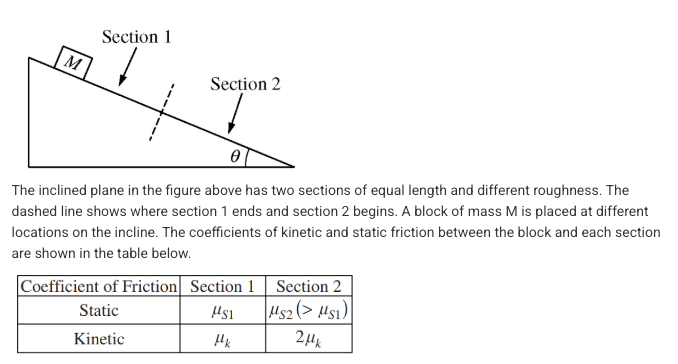

---

# 2026.01.20 **AP Physics**

##### **❓ of the 📅**: What's the most ***unusual*** thing you've ever eaten?

 

#### 📋 Agenda

1. FRQ Practice (2013, 2008, 2019)
    - Random Partners
    - Complete FRQ on whiteboard
    - Compare Answers to neighbors when instructed
    - New Problem & New Partner

### 🎯 Goals

🥅 _Prep for the Test_

### 📆 Upcoming

- Test tomorrow - AP Classroom Progress Check Due
    - Reminder that these are **mandatory** for test corrections

---

# **DO NOW** Modified Atwood Machine **2026.01.15**

## On your Whiteboard <mark>***as a group***</mark>...

### Predict the ***tension*** of the string and the ***acceleration*** of the lab cart. 

Givens:

- Cart: 316.2 grams
- Mass: 92.5 grams

---

# 2026.01.15 **AP Physics**

##### **❓ of the 📅**: Would you rather always be slightly late or super early?

 

#### 📋 Agenda

1. Do Now
2. Notes on Modified Atwood Machines
3. AP Workbook: 2.M & 2.J (in that order)
3. Physics Classroom: Two Body Problmes in Two Dimensions

### 🎯 Goals

🥅 _Model Atwood Machines_

### 📆 Upcoming

- AP Classroom Review Unlocked
    - Forces Test **Tuesday 1/20**

---

# 2026.01.14 **AP Physics**

##### **❓ of the 📅**: ***If you could redesign the human body, what one improvement would you make?***

 

#### 📋 Agenda

1. Quiz 
2. Notes on Atwood Machines
3. AP Workbook: 2.M & 2.J (in that order)
3. Physics Classroom: Two Body Problmes in Two Dimensions

### 🎯 Goals

🥅 _Model Atwood Machines_

### 📆 Upcoming

---

# 2026.01.13 **AP Physics**

##### **❓ of the 📅**: You **_have_** to sing karaoke, what song do you pick? 🎤

 

#### 📋 Agenda

1. Do Now: Finish Spring Force Lab
2. Quiz
3. Notes - Accelerating Systems - Modified Atwood Machine
3. AP Workbook: 2.M, 2.J (In that reverse order)

### 🎯 Goals

🥅 _Modeling Forces on Accelerating Systems_

### 📆 Upcoming

- Start AP Classroom Progress Checks!

---

# Hooke's Law

$$ \boxed{\vec{F}_s = - k\Delta \vec{x}} $$

or Magnitude:

$$ F_s = kx$$ 

## *Does your spring and/or your rubberband follow Hooke's Law?*

---

A spring is attached to the ceiling of an elevator, and a block of mass M is suspended from the spring. The cases are identical except that in Case A the elevator is moving upward with a constant speed of 7 m/s, while in Case B the elevator is moving downward with a constant speed of 9 m/s.  Will the spring be stretched (i) more in Case A, (ii) more in Case B, or (iii) the same in both cases? 

Explain your reasoning.

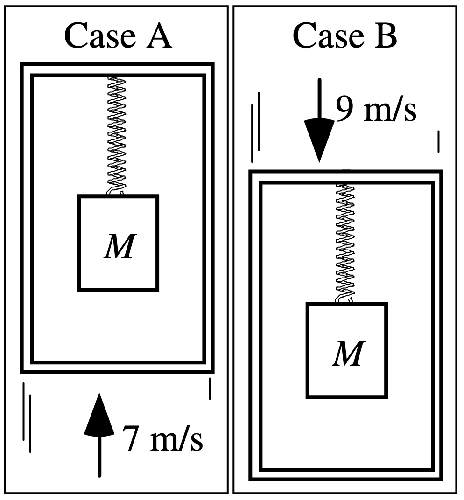

---

# 2026.01.09 **AP Physics**

##### **❓ of the 📅**: If you could live anywhere, where would it be?

 

#### 📋 Agenda

1. Do Now - Finish AP FRQ 
2. AP Workbook 2.L
	1. Complete workbook in lab group and perform experiment (collect actual data - 2 springs and a rubberband)
	2. Whiteboard and present results

### 🎯 Goals

🥅 _Create a mathematical model for spring forces_

### 📆 Upcoming

- Forces Quiz Tuesday
- AP Classroom Review Unlocked
    - Forces Test **Tuesday 1/20**

---

# 2026.01.08 **AP Physics** Do Now #1

Anna Litical and Noah Formula now place a 2-kg brick on a wooden board and incline the board at 35$^\circ$ above the horizontal. The coefficient of friction between the brick and the board is 0.3. Use the structure provided at the right to determine the

1. force of gravity (Fgrav).
1. parallel component of gravity (Fparallel).
1. perpendicular component of gravity (Fperpendicular).
1. normal force (Fnorm).
1. friction force (Ffrict).
1. net force & acceleration

 

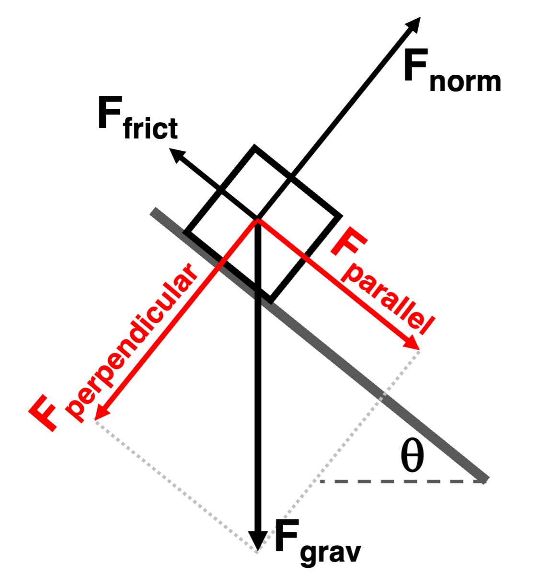

---

# 2026.01.08 **AP Physics** Dow Now #2

A person exerts a force $F_p$ on a rope to pull a block of mass $m$ up a ramp. The rope makes an angle $\theta_2$ to the ramp and the ramp makes an angle $\theta_1$, to the horizontal, as shown. The force of kinetic friction between the block and the ramp has magnitude $F_f$. Which of the following expressions is equal to the magnitude of the acceleration $a$ of the block?

1. $\frac{F_p \cos \theta_2 + F_f}{m} - g \sin \theta_1$
1. $\frac{F_p \cos \theta_2 - F_f}{m} - g \sin \theta_1$
1. $\frac{F_p \cos \theta_2 + F_f}{m} + g \sin \theta_1$
1. $\frac{F_p \cos \theta_2 - F_f}{m} + g \sin \theta_1$

 
 

<!---

ANSWER: B

Fnet = ma
Fpx - Ff - Fgx = ma
Fpcostheta - Ff - mg sin theta = ma

--->

---

# 2026.01.08 **AP Physics**

##### **❓ of the 📅**: _If you found that food was falling from the sky, what food would you want to be falling? What food would you **NOT** want to be falling?_

 

#### 📋 Agenda

1. Do Now 
1. Review [Inclined Planes](../../../Presentations/Forces/talks/Dynamics2025.html#77)
1. Einstein on a Ramp
    - Whiteboard w/ Group, enter answers in pivot
1. AP Workbook 2.H
1. AP FRQ Practice Question

### 🎯 Goals

🥅 _Use Incline Plane Models to solve problems_

### 📆 Upcoming

- Forces Quiz Tuesday
- AP Classroom Review Unlocked
    - Forces Test **Tuesday 1/20**

---

# 2026.01.06 **AP Physics** Do Now 

1. Open Pivot: _**Forces on Object on Ramp**_ and complete Part 1: Preliminary Questions
    - For all of the diagrams, just draw on a mini whiteboard. In pivot write "on mini whiteboard" for those questions. 

Wait before starting Part 2:

---

# 2026.01.06 **AP Physics**

##### **❓ of the 📅**: What secrets do you think your pet would spill about you, if they could talk? 

 

#### 📋 Agenda

1. Do Now
2. Incline Plane Pivot
    - Check in after Part 2 to discuss with Mr. Porter
3. Notes on [Inclined Planes](../../../Presentations/Forces/talks/Dynamics2025.html#77)

### 🎯 Goals

🥅 _Model forces on inclines_

### 📆 Upcoming

- Physics Classroom: Incline Planes
- AP Classroom Unit 2 Review...

---

# 2026.01.05 **AP Physics**

##### **❓ of the 📅**: Do you have any New Year Resolutions?

 

#### 📋 Agenda

1. Do Now - AP Workbook:
    - 2.G & 2.I
2. Inclined Planes
    - Introduction
    - Pivot

### 🎯 Goals

🥅 _Remember what we were doing before break... :confounded:_

🥅 _Model forces on inclined planes_

### 📆 Upcoming

---

<!--- class: christmas --->

# 2025.12.19 **AP Physics**

##### **❓ of the 📅**: What type of cookie 🍪 did you leave for Santa 🎅?

 

#### 📋 Agenda

1. Go over workbook question
2. Board Games or color -- no computer games

#### 🎯 Goals

🥅 _Ease into break_

### 📆 Upcoming

- Happy vacation 🎅 🎄 ⛷️ 🕎

---

# 2025.12.18 **AP Physics**

##### **❓ of the 📅**: Real, fake or no Christmas tree? If you don't celebrate do you decorate for something else?

 

#### 📋 Agenda

1. Quiz 
2. TBD - Based on Time:
    - Workbook (some of 2.F, 2.G, 2.I & 2.M)
    - Friction Lab...?

### 🎯 Goals

🥅 _Quiz_

### 📆 Upcoming

---

# 2025.12.16 **AP Physics** Do Now

Two identical blocks, 1 and 2, are connected by a massless string. In Case A, a student pulls on a string attached to block 2 so that the blocks travel to the right across a desk at a constant speed of 10 cm/s. In Case B, the student pulls on a string attached to block 1 so that the same blocks travel across the same desk to the left at a constant speed of 20 cm/s.  

Will the tension in the diagonal string connecting the two blocks be (i) **_greater_** **in Case A**, (ii) **_greater_** **in Case B**, or (iii) **_the same_** **in both cases**?  Explain your reasoning.

 

---

# 2025.12.16 **AP Physics**

##### **❓ of the 📅**: What is the best gift you **given**?

 

#### 📋 Agenda

1. Do Now 
2. Angled Force Examples
    - PC Angled Forces 1
3. PC Work time ~ 30-40 minutes
1. AP Workbook: 2.F, 2.G, 2.I & 2.M

### 🎯 Goals

🥅 _Practice with friction_

🥅 _Experimently model static friction_

### 📆 Upcoming

- Finish PC
- Quiz Thursday

---

# 2025.12.15 **AP Physics** Do Now

A spaceship is attached to two cargo pods by rods. At the instant shown, the speed of the pods and of the spaceship is 300 m/s. In Case A the acceleration of the ship and of the pods is 3 m/s to the left, while in Case B it is 2 m/s to the right. All masses are given in terms of M, the mass of an empty pod.

 

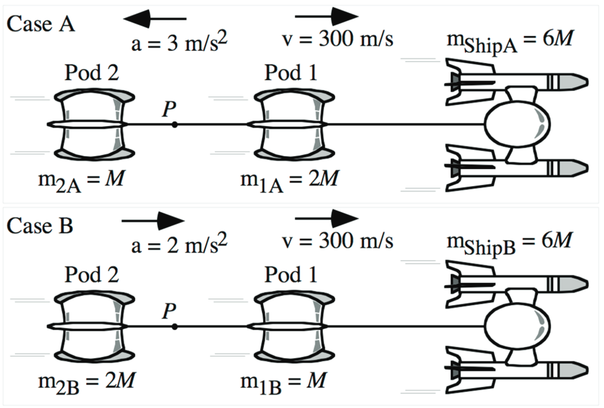

**Will the tension or compression at point P in the tow rod be (i) greater in Case A, (ii) greater in Case B, or (iii) the same in both cases? Explain your reasoning.**

---

# 2025.12.15 **AP Physics**

##### **❓ of the 📅**: What is your favorite holiday song?

 

#### 📋 Agenda

1. Do Now
2. [Friction Notes](../../../Presentations/Forces/talks/APForces.html)
3. Friction Practice - PC:
    - Newton's Laws 8
    - Set F2D6: Angled Forces 1
    - Set F2D7: Angled Forces 2

### 🎯 Goals

🥅 _Model friction qualitatively and quantitatively_

### 📆 Upcoming

- PC: Two Body Questions (think train questions)
- Finish Assignments from Today's class
- Quiz Thursday

---

# 2025.12.12 **AP Physics**

##### **❓ of the 📅**: Would you rather live in a floating city in the sky or an underwater city?  

 

#### 📋 Agenda

1. Quiz
2. Go Over AP Workbook
2. Friction Notes
3. Practice with Friction Questions

### 🎯 Goals

🥅 _Model Frictional Forces_

🥅 _Identify difference between static and kinetic friction_

### 📆 Upcoming

---

# 2025.12.10 **AP Physics** Do Now 

A person who weighs 600 N is standing on a scale in an elevator. The elevator is identical in both cases. In both cases the elevator is moving downward, but in Case A it is accelerating upward and in Case B it is accelerating downward (at $2 \text{ m/s}^2$).

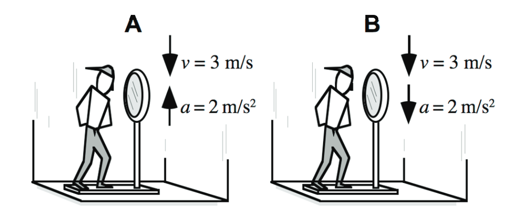

**Will the scale reading be (i) greater in Case A, (ii) greater in Case B, or (iii) the same in both cases? _____  Explain your reasoning.**

---

# 2025.12.10 **AP Physics**

##### **❓ of the 📅**: Have you ever had a surprise party? (that was an actual surprise)

 

#### 📋 Agenda

1. Do Now
1. Discuss & Go Over 7&8 Angled Questions
2. AP Workbook 2.A - 2.E - feel free to work with whoever you'd like
3. Mini Lesson - N3L

### 🎯 Goals

🥅 _Define N3L_

🥅 _Introduce Friction Equation and Ideas_

### 📆 Upcoming

- Quiz Friday: Projectile Question & Forces
- PC Homework

---

# 2025.12.09 **AP Physics** Do Now 

In the N2L packet from yesterday - complete top row (givens & diagrams) for **Question #2**

---

# 2025.12.09 **AP Physics**

##### **❓ of the 📅**: How often do you dance?

 

#### 📋 Agenda

1. Do Now
2. N2L Packet 3-6
3. N2L Packet 7 & 8 on whiteboard with lab group
4. Start Physics Classroom Homework

### 🎯 Goals

🥅 _Use N2L to model physical situations and make predictions about forces and motion_

### 📆 Upcoming

- PC Homework: Assignments Posted
- Bring in AP Workbook Unit 2 Tomorrow

---

# 2025.12.08 **AP Physics** Do Now

## 🏁 Finish your lab!

---

# 2025.12.08 **AP Physics**

##### **❓ of the 📅**: What's the longest trip you've been on?

 

#### 📋 Agenda

1. Finish lab
2. Board Meeting
2. Using N2L to solve force problems

### 🎯 Goals

🥅 _Use N2L to solve force problems_

### 📆 Upcoming

- [ ] Newton's Laws 1: Mass and Weight	CalcPad	
- [ ] Newton's Laws 2: Equations as a Guide to Thinking

---

# 2025.12.04 **AP Physics** Do Now

#### _A fan cart is on its track with the fan on._ Assume the track is frictionless.

1. Draw the free body and vector addition diagrams for the cart
1. What do the forces predict about the motion of the fan cart?
2. Get your lab notebook

 

---

# 2025.12.04 **AP Physics**

##### **❓ of the 📅**: What is your favorite type of cookie? 🍪

 

#### 📋 Agenda

1. Do Now 
2. Fan Cart Lab 

### 🎯 Goals

🥅 _Model unbalanced forces with a fan cart_

### 📆 Upcoming

**🎵 Band Kids**: 
- Packet pages: 1, 3-4, 11, 15

---

# 2025.12.03 **AP Physics**

##### **❓ of the 📅**: What won your Thanksgiving?

 

#### 📋 Agenda

1. Do Now
2. Unbalanced Force Lab

### 🎯 Goals

🥅 _Collect Data for Unbalanced Force Lab_

### 📆 Upcoming

---

<!--- class: thanksgiving -->

# 2025.11.25 **AP Physcis** Do Now

### Physics Classroom Force Diagram Practice:

1. Balanced vs. Unbalanced Forces Concept Builder
2. Recognizing Forces Concept Builder
3. Match That Free Body Diagram Concept Builder

---

# 2025.11.25 **AP Physcis**

##### **❓ of the 📅**: What dessert is your favorite at Thanksgiving?

 

#### 📋 Agenda

1. Do Now
2. Copy Down FBDs in Packet from card sort
2. Monkey Questions
2. $F_g$ Lab
3. $F_s$ Lab

### 🎯 Goals

🥅 _Practice with Force Diagrams_:t

🥅 _Model gravitational and spring forces experimentally_

### 📆 Upcoming

##  🦃🍗🍽️🍞🥧🥔🍠

---

# Force of Gravity Lab
- Goal: Model how gravitational force depends on mass
- Context: Compare Earth, Moon, Mars

---

# Force of Gravity vs. Weight vs. Mass

- <mark>**Force of Gravity**</mark> - an attractive force between **any** two objects with mass
- <mark>**Weight**</mark> - $\vec{F}_g$ between celestial object and object of interest 
  - (i.e. your weight is the $\vec{F}_g$ between Earth and you)
- <mark>**Mass**</mark> - How much matter an object contains, a measurement of how much "stuff" an object is made of

---

# Question
How does weight (gravitational force) depend on mass and the local gravitational field?

---

# Purpose
- Measure F and m for several objects
- Build a model from data (F vs. m)
- Interpret slope (if linear)

---

# Spring Force Lab

### Purpose:

Determine the relationship between the stretch displacement of your spring and the force that is used to stretch the spring. 

### Materials
- two springs (to compare results)
- assorted masses (your known forces)
- ruler/meterstick 

---

# 2025.11.24 **AP Physics** Do Now

Water skiers are pulled at a _constant speed_ by a towrope attached to a speedboat. Because the weight of the skiers and the type of skis they are using varies, they experience different resistive forces from the water. Values for this resistive force (RF) and for the speed of the skiers are given.

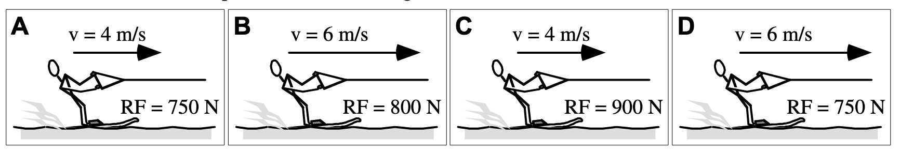

**Rank the tension in the towrope.** <mark>_Explain your reasoning_</mark>

---

# 2025.11.24 **AP Physics**

##### **❓ of the 📅**: What is the _MVF_ (most valuable food) on the Thanksgiving dinner table?

 

#### 📋 Agenda

1. Do Now
2. How to draw force diagrams
3. Force Diagrams Card Sort
4. Monkey Force Diagram Practice

### 🎯 Goals

🥅 _Learn how to draw the three force diagrams_

### 📆 Upcoming

---

# 2025.11.21 **AP Physics**

##### **❓ of the 📅**: What was the last movie you went to? What did you think?

 

#### 📋 Agenda

1. Projectile Motion Quiz
2. [Forces & Force Diagram notes](../../../Presentations/Forces/talks/Dynamics2025.html)
3. Force Diagram Card Sort

### 🎯 Goals

🥅 _Check projectile motion understanding_

🥅 _Model forces vectorially_

### 📆 Upcoming

---

# 2025.11.19 **AP Physics** Do Now

### Whiteboard Assigned situation(s) 

| Group                      | Whitebard Situations           |
| -------------------------- | -------------------- |
| Haylee, Tyler, Mason, Kyle | Speed up Situation   |
| Nadine, Max, Ryan          | Slow Down Situations |
| Arianna, Arletta, Antonio  | 90º Turn             |
| Emma, Olivia, Jonah        | Circle Question      |

---

# 2025.11.19 **AP Physics**

##### **❓ of the 📅**: If everyone in your family was a zoo animal, which animal would they all be?

 

#### 📋 Agenda

1. Do Now
2. Pivot & Phet - Balanced vs. Unbalanced Forces
3. [Notes](../../../Presentations/Forces/talks/Dynamics2025.html):
    - Common Forces
    - Force Diagrams
4. FBD Card Sort

### 🎯 Goals

🥅 _Identify forces and use FBDs to represent forces acting on objects_

### 📆 Upcoming

- PC Homework Due Wednesday
- Quiz Friday -> Projectile Motion

---

# 2025.11.18 **AP Physics** Do Now

0. Get Lab Notebook
1. Scenario: _You roll a bowling ball at a slow to moderate speed on a smooth floor_
    1. Will the ball roll with a constant velocity, with negligible acceleration, or will it accelerate?
    2. What data can you collect to definitively answer this question? 
        - Devise a quick experiment (with multiple data points)
        - What will you graph?
        - What will your data look like to support your hypothesis in question _i_?

---

# 2025.11.18 **AP Physics**

##### **❓ of the 📅**: What was your favorite recess game from elementary school?

 

#### 📋 Agenda

1. Do Now 
2. Mallet Ball
3. Pivot - Balanced vs. Unbalanced Forces
4. [Notes](../../../Presentations/Forces/talks/Dynamics2025.html) & Discussion

### 🎯 Goals

🥅 _Describe the causal relationship for motion_

### 📆 Upcoming

- PC Homework Due Wednesday
- Quiz Friday -> Projectile Motion

---

# 2025.11.17 **AP Physics**

**❓ of the 📅**: Would you rather be able to see microscopic things or distant galaxies with your naked eye?

 

#### 📋 Agenda

1. Do Now: Finish AP Workbook 1.M - 1.O
2. Mallet Ball

### 🎯 Goals

🥅 _Practice Projectile Motion_

🥅 _Explore the causes of different types of motion_ 

### 📆 Upcoming

- PC Homework Due Wednesday
- Quiz Friday -> Projectile Motion

---

# 2025.11.13  **AP Physics**

##### **❓ of the 📅**: Do you believe in Aliens? 👽

 

#### 📋 Agenda

1. Do Now - Get working on your lab
2. AP Workbook 1.M-O
3. Physics Classroom Homework

### 🎯 Goals

🥅 _Model & Predict Projectile Motion_

### 📆 Upcoming

- Corrections Due Friday 11/21
- PC Projectile Motion HW Due Tuesday 11/18

---

# 2025.11.12 **AP Physics** Do Now

## Thought experiments 🤔 for a projectile...

1. On flat ground, which launch angle will give the maximum range?
2. Can two different angles give the same range? What angles or combinations of angles?

---

# 2025.11.12 **AP Physics**

##### **❓ of the 📅**: Vacation on the beach or adventure in the mountains? 🏖️ ⛰️

 

#### 📋 Agenda

1. Do Now
2. Discussing Projectile Maxima
3. Angled Projectile Motion Lab
4. While waiting you should work on AP Workbook 1.M - 1.O 

### 🎯 Goals

🥅 _Model Projectile Motion for angled launched projectiles_

### 📆 Upcoming

- PC Projectile Motion HW Due Tuesday 11/18

---

# Angled Launch Lab

## Goal:

Line up 4 evenly spaced rings stands so that the ball goes through each ring stand.

 

<video controls src="IMG_5391.MOV" title="Projectile video" height = "650"></video>

---

# Lab Requirements & To Do

1. Determine Launch Velocity based on landing data (derive an experession first)
2. Derive expression for ring stand location
3. Calculate the maximum range for the launcher based on given information
3. Predict the height of your ring
4. Measure and place your ring stand
5. **THE BIG LAUNCH** -> Test as a class

---

# Horizontal Launch Data

 

| Height (m) |  Range (m) |
|---|---| 
| 1.003| 	2.650|
| 1.003| 	2.659|
| 1.003| 	2.713|
| 1.003| 	2.720|
| 1.003| 	2.723|
| 1.003| 2.693|

---

# 2025.11.10 **AP Physics** Do Now

Sharon Steady and Al Wayskachon won South’s recent egg toss contest held during Homecoming week. In their winning toss, Sharon gave the egg an underhand toss, releasing it with a velocity of 7.5 m/s at an angle of 30° to the horizontal. To the pleasure of the crowd, Al caught the egg at the same height as the toss without even a fracture to its shell.

1. Calculate the time for the egg to reach the midpoint of the trajectory.
2. Calculate the total time the egg is in the air.
3. Calculate the horizontal distance which the egg traveled.
4. Calculate the height of the egg (relative to the release point) when it was at the peak of its trajectory.

---

# 2025.11.10 **AP Physics**

##### **❓ of the 📅**: Cranberry Sauce? Yay or Nay? Homemade or Canned?

 

#### 📋 Agenda

1. Do Now
2. Test Corrections

### 🎯 Goals

🥅 _Make test corrections_

### 📆 Upcoming

---

# Test Corrections

---

## Why do corrections?
- Learn from errors, not just the grade
- Make thinking visible (CER + diagrams)
- Target misconceptions and fix them
- Build metacognitive habits to perform better next time

---

## Corrections Process

We will use the same steps for every correction:
1) **Decode the Problem**
    1. Translate
    2. Big Physics Ideas
    3. Givens & Unknowns (units; axes/signs)
    4. Sketch
    5. Simplify & Diagram
2) **Do the Physics**
    1. Represent Mathematically (Solve Algebraically)
    2. Solve & Evaluate
3) **Explain & Learn**: CER + 4 C’s + Preventive Cue

---

## Where & When
- Complete within ~1 week of test return
- In school only (class, study hall, breakout space)
- Start from scratch (no copying prior answers)

---

## Points-back policy (curve)
- Awarded for high-quality corrections
- Curve: $\sqrt{\frac{(\text{points earned} + \text{1/2 points back})}{\text{total points}}}$
- Quality = correct solution + diagram + CER + error type + reflection

---

## Example - Together

### Q10 - Boat across a river

---

## Quality Checklist
- Correct solution from scratch
- Named physics principle/fact
- Accurate, labeled diagram
- Clear CER
- Error type + preventive cue
- Unit/sign/limiting-case checks

---

## Final Reflection (Exam Wrapper)
- Patterns across missed items
- Strategy changes for next exam
- Practice targets and timeline
- Meet with Mr. Porter before submitting

---

# You’ve got this
Think clearly, show your physics, learn deeply

---

# 2025.11.04 **AP Physics** Do Now

Car A is traveling to the right at a constant velocity $v_A$. At time $t=0$, it passes Car B, which is at rest. At the same time ($t=0$), Car B begins to accelerate with a constant acceleration of magnitude $a_B$, as shown in Figure 1. Car B has a velocity of $v_B$ when it reaches the same position as Car A at time $t=t_f$, as shown in Figure 2. Which of the following, if any, is an expression for the 

 

time it takes Car B to catch up top Car A?

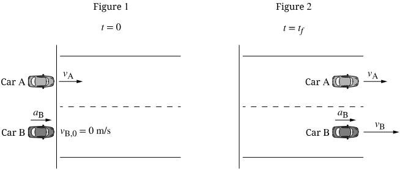

**A.** $\frac{v_A}{a_B}$  **B.** $\frac{2v_A}{a_b}$ **C.** $\frac{2v_A^2}{a_B}$
**D.** It cannot be determined without knowing the distance traveled by the cars

---

Car A is traveling to the right at a constant velocity $v_A$. At time $t=0$, it passes Car B, which is at rest. At the same time ($t=0$), Car B begins to accelerate with a constant acceleration of magnitude $a_B$, as shown in Figure 1. Car B has a velocity of $v_B$ when it reaches the same position as Car A at time $t=t_f$, as shown in Figure 2. 

 

**_On the same axes, sketch the velocity graphs for each car. Label any important velocites or times._**

---

# 2025.11.04 **AP Physics**

##### **❓ of the 📅**: What is your favorite holiday?

 

#### 📋 Agenda

1. Do Now 
2. Hand Back Quizzes
2. Projectiles Fired at an Angle
3. TS Projectiles #11 -> End

### 🎯 Goals

🥅 _Model Projectiles Fired at an Angle_

### 📆 Upcoming
- Test Tomorrow -> Finish AP Classroom Assignment

---

# Quiz Reassessment - Extra Practice

### 1.2 Displacement, Velocity, and Acceleration
- Kinematic Equations 4
- Kinematic Equations 5
### 1.3 Representing Motion 
- Concept Builder: Match that graph
### 1.5 Vectors and Motion in Two Dimensions 
- Vectors and Projectiles: Component Addition

---

# 2025.11.03 **AP Physics** Do Now

### A Coast Guard helicopter is flying at $106.6\text{ km/hr}$ at a height of $93\text{ meters}$ above the ocean water. The crew wishes to package a box of survival gear to some people aboard a shipwrecked vessel. What horizontal distance from the wreckage site should the helicopter release the package in order to land it at the site?

---

# 2025.11.03 **AP Physics**

##### **❓ of the 📅**: What came first? The chicken or the egg?

 

#### 📋 Agenda

1. Do Now 
2. Marble Lab
3. Projectiles Launched at an angle

### 🎯 Goals

🥅 _Model and predict projectile motion_

### 📆 Upcoming

- Test **Wednesday** - Finish AP Classroom Progress Check
- Sign up for quiz reassessments this week!

---

# Lab: Marble Off the Table 

### Question: 

How can we determine the marble’s horizontal launch speed and predict its landing spot from a new height?

### Purpose: 

Use the constant-velocity model horizontally and constant-acceleration model vertically to measure launch speed and predict range from different heights.

---

# Lab Notebook Instructions 

- Title, date, partners, equipment list: ruler track, marble, carbon paper, meterstick.

- Sketch setup with labeled heights and reference line.

- Raw tables for all trials; clearly show calculations for $t$, $v_{launch}$, predictions.

- Final claim-evidence-reasoning tying models to your results.

---

<!--- class: halloween --->

# 2025.10.30 **AP Physics**

##### **❓ of the 📅**: Trick-or-Treating or passing out candy? 

 

#### 📋 Agenda

0. Do Now: PC **Free Fall Concept Builder**
1. Review X & Y independence
2. Notes on Projectile Motion
3. Think Sheet #1-8 & 12-14
4. Marble Lab

### 🎯 Goals

🥅 _Use kinematics to problem-solve horizontally launched projectile motion questions_

### 📆 Upcoming

- **Test Wednesday 11/5** - Progress Check Posted

---

# 2025.10.29  **AP Physics** Do Now 🦆🚚

A duck flies past a truck that is at rest. The duck takes $2.1$ seconds to fly at a constant speed $v_d$ from the back of the truck to the front. Later, the truck travels along a flat, straight roadway with a constant speed $\frac{3}{4}v_d$. The duck again flies past the truck with constant speed $v_d$, flying in the same direction that the truck is moving. How long does it take the duck to fly from the back oof the truck to the front in this cases?

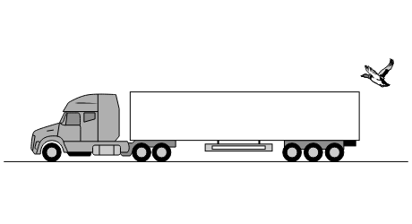

---

# 2025.10.29 **AP Physics**

##### **❓ of the 📅**: Crunchy or chewy candy?

 

#### 📋 Agenda

1. Do Now: PC Concept Builder Free Fall
2. 🚀 Rocket Science: AP Workbook 1.J & 1.K
3. Introduction to Projectile Motion

### 🎯 Goals

🥅 _Define a projectile_

### 📆 Homework
- Kinematics 7: Free Fall, Rocket Science, and KEs
- **Test Wednesday 11/5** - Progress Check Posted

---

# 2025.10.28 **AP Physics**

##### **❓ of the 📅**: Have you ever completed anything on your "bucket list"?

 

#### 📋 Agenda

1. [Free Fall Notes](../../../Presentations/APCAPM/talks/twoDMotion.html)
2. Free Fall Think Sheet & Concept Check
3. PC Practice Questions
4. 🚀 Rocket Science: AP Workbook 1.J & 1.K

### 🎯 Goals

🥅 _Model the motion of objects in free fall_

### 📆 Homework

Finish
- Kinematics 6: Free Fall and Kinematic Equations
- Kinematics 7: Free Fall, Rocket Science, and KEs

---

# 2025.10.25 **AP Physics**

##### **❓ of the 📅**: Which animal would be the scariest if it was super-sized? 

 

#### 📋 Agenda

1. Quiz
2. Free Fall
3. Free Fall Questions

### 🎯 Goals

🥅 _Define free fall and solve problems involving free fall motion_

### 📆 Upcoming

---

In each case shown, someone is running on a flatbed train car as the train moves. In cases C and D, the person is running toward the front of the train, while in cases A and B the person is running toward the rear. The speeds of the train and of each person relative to the train are given. 

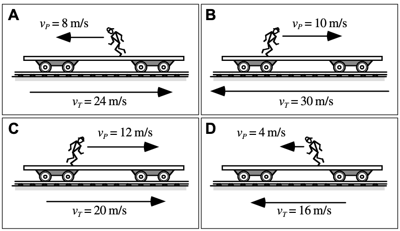

**Rank the speed of the runners relative to the observer standing beside the tracks.**

---

Shown are five asteroids and a spaceship, all moving in the same direction away from Earth. The velocities of the asteroids and of the spaceship are given as measured from Earth.

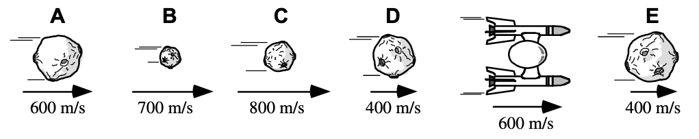

1. List the asteroids that are moving toward the spaceship. 
2. List the asteroids that are moving away from the spaceship.

**Explain your reasoning**

---

# 2025.10.23 **AP Physics**

##### **❓ of the 📅**: If you were a pirate, what would your pirate name be? 🏴‍☠️🦜  

 

#### 📋 Agenda

1. 2D Relative Motion Notes
2. River Boat Physics Classroom Questions
3. 2D Relative Motion Drone Pivot

### 🎯 Goals

🥅 _Model 2D relative motion_

🥅 _Calculate relative velocities with vector addition_

### 📆 Upcoming

- Quiz tomorrow

---

# 2025.10.22 **AP Physics**

##### **❓ of the 📅**: If you could only eat one meal for the rest of your life, what would it be?

 

#### 📋 Agenda

0. AP Workbook 1.E
1. 1D Relative Motion
2. Pivot
2. 2D Relative Motion
3. Pivot

### 🎯 Goals

🥅 _Model relative motion_

### 📆 Homework:

-> PC: Vectors and Projectiles 2: Component Addition

---

# 2025.10.20 **AP Physics**

##### **❓ of the 📅**: What is your ideal sandwich 🥪?

 

#### 📋 Agenda - ***Here*** Fri

1. Think Sheet: 5-8
2. Work on Homework

#### 📋 Agenda - ***Absent*** Fri

1. Vector Addition Notes
2. Vector Addition Think Sheet
3. Vector Components
3. Adding Vectors with components

#### 📆 HW

- PC: Adding Right Angle Vectors
- PC: Vector Component Addition

---

# 2025.10.17 **AP Physics**

##### **❓ of the 📅**: Does pineapple belong on a pizza? 🍍 

 

#### 📋 Agenda

1. Vector Addition Notes
2. Vector Addition Think Sheet
3. Vector Components
3. Adding Vectors with components

### 🎯 Goals

🥅 _Add two-dimensional vectors_

### 📆 Homework

Due **Wednesday**:

-  Adding Right Angle Vectors
- Vector Component Addition

---

# 2025.10.16 **AP Physics** Do Now

Shown below are the paths two motorcyclists took on an afternoon ride. Both started at the same place, and both took the same time for the ride. Rider A traveled east for 19 km and then south for 4 km. Rider B traveled south for 7 km and then east for 16 km.

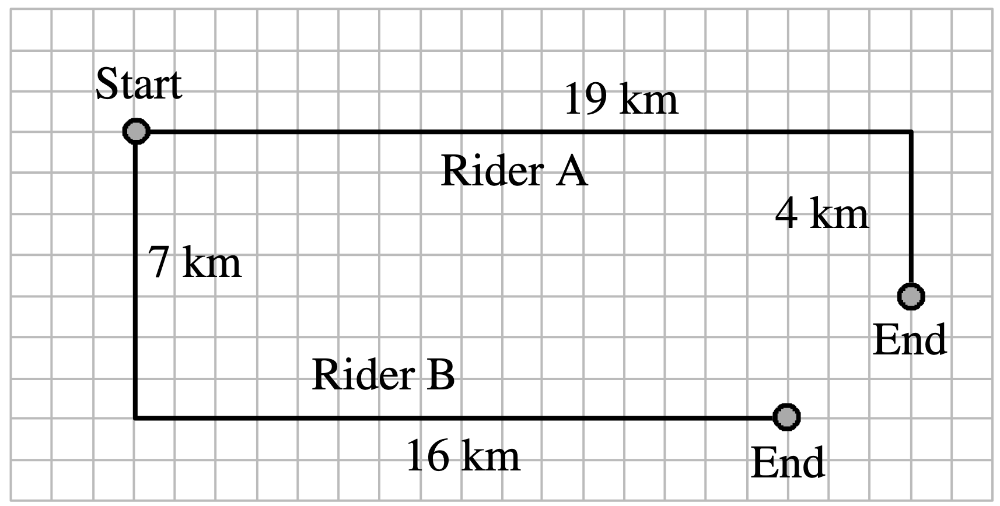

Is the magnitude of the displacement of the rider (i) greater in case A, (ii) greater in case B, or (iii) the same in both cases?   _**Explain your reasoning.**_  

---

# 👻 2025.10.16 **AP Physics** 🧟

##### **❓ of the 📅**: Would you rather discover that witches, vampires, or werewolves were real?

 

#### 📋 Agenda

1. Do Now
1. Go over rolling ball question
2. [2D Vectors - Measuring and drawing](../../../Presentations/Projectiles/talks/RP2DMotion2025.html)
2. 2D Vectors - Adding Vectors

### 🎯 Goals

🥅 _Measure and draw 2D Vectors_

🥅 _Add together right angled vectors_

### 📆 Homework - PC:

- Vectors and Projectiles 1: Adding Right Angle Vectors
- Vector Direction Concept Builder 

---

# 2025.10.14 **AP Physics**

##### **❓ of the 📅**: Favorite season? 🍂❄️🌞💮

 

#### 📋 Agenda

0. AP Workbook 1.I The Chase
1. Collaborative Problem-Solving
	1. 🏀 Rolling ball ranking task
	2. 🚀 Rocketship average velocity question

### 🎯 Goals

🥅 _Problem-solve motion questions in small gorups_

### 📆 Upcoming

- AP Checks due! Get them in

---

# 2025.10.10 **AP Physics**

##### **❓ of the 📅**: What is your favorite Halloween monster?

 

#### 📋 Agenda

1. Quiz
2. Finish up anything in the photogate lab and get it stamped 
3. Pep Rally - play nice 

### 🎯 Goals

🥅 _Crush your quiz 💪🧠_

### 📆 Upcoming

---

# 2025.10.09 **AP Physics**

##### **❓ of the 📅**: Apple 🍎 or pumpkin 🎃 flavored?

 

#### 📋 Agenda

1. Photogate Lab

### 🎯 Goals

🥅 _Use equations and graphical models to solve problems_

### 📆 Upcoming

- Quiz tomorrow:
  - VT graphs
  - Equations

---

#  Photogate Timing Lab
Target: time between photogates = **0.12 s**

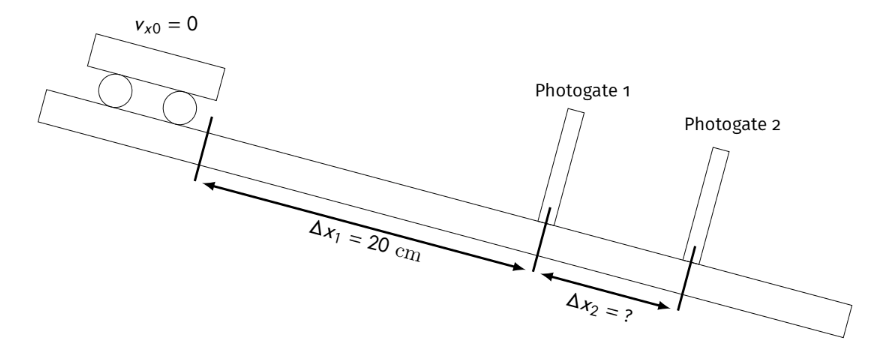

The figure above shows a cart on an inclined ramp. The cart is released from rest a distance $\Delta x_1 = 20\text{ cm}$ from photogate 1. You are tasked to determine the distance from photogate 1, $\Delta x_2$, to put a second photogate, so that the time it takes for the cart to travel between the two gates is $\Delta t = 0.12\text{ s}$.

---

## Question
How far from photogate 1 should photogate 2 be placed to get **0.12 s** between gates?

---

## Purpose
Use the constant-acceleration particle model to:
- Measure ramp acceleration from rest.
- Predict photogate spacing **Δx2** for the target interval.

---

## Materials
Cart, inclined ramp, 2 photogates + timer, meterstick, tape, angle finder (optional), data table.

---

## Procedure (Measure a)
1. Mark release point **Δx1 = 20 cm** above gate 1; start cart from rest.
2. Place gates; record gate times or interval over known spacing.
3. Repeat 5 trials; keep setup identical.

---

## Determine Acceleration

## Predict Spacing
- Derive **Δx2(Δx1, a, Δt)** from CAPM equations.
- Compute **Δx2** for **Δt = 0.12 s**.

---

## Test & Validate
- Place gate 2 at predicted **Δx2**.
- Run 3 trials; compare to 0.12 s.
- Compute percent error.

---

## Representations

- v–t with slope **a**.
- x–t showing curvature.
- Equations + sample calc with units.

---

## Reflection
- Does data support constant **a**?
- How does steeper ramp (larger **a**) affect **Δx2** for same **Δt**?
- Evaluate the peer claim about moving gate 1 closer.

---

## Notebook Checklist

✅ Titles
✅ Procedures and data
✅ labeled tables/graphs
✅ units
✅ best-fit lines
✅ clear conclusion & reflection questions

---

# 🎃 2025.10.07 **AP Physics** 🕸️

##### **❓ of the 📅**: Do you like scary movies? What is your favorite? 

 

#### 📋 Agenda

1. Finish Bear Problem
2. Discuss
3. Kinematic Equations & Cross Diagram

### 🎯 Goals

🥅 _Use graphs and equations to solve word problems_

### 📆 Upcoming

- PC Kinematic Eqns 1, 2, 3

---

# :alien: 2025.10.06 **AP Physics**

##### **❓ of the 📅**: Candy corn: yay or nay?

 

#### 📋 Agenda

1. Do Now - Graphs Practice worksheet
2. Problem-Solving with VT Graphs 
    - get back into pairs (different than Friday!)

### 🎯 Goals

🥅 _Use velocity time graphs to model motion and make predictions._

### 📆 Upcoming

- Quiz Friday

---

# 🎃 2025.10.03 **AP Physics** Do Now 👻

Graphs of velocity versus time during 4 seconds for identical objects are shown below.

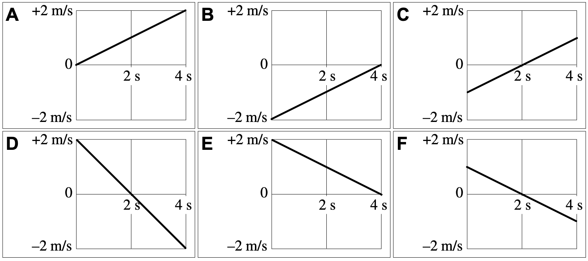

**Rank the magnitudes of the displacements of the objects during each of these intervals.**

---

# 🎃 2025.10.03 **AP Physics** 👻

##### **❓ of the 📅**: Would you rather visit a Haunted House or a Corn Maze?

 

#### 📋 Agenda

1. Do Now
2. Problem-solving with VT Graphs
3. Paired Problem Solving

### 🎯 Goals

🥅 _Use velocity time graphs to model motion and make predictions._

---

<!--- class: --->

# 2025.10.01 **AP Physics**

##### **❓ of the 📅**: Cake or pie? 🍰🥧

 

#### 📋 Agenda

1. Do Now - Check stacks of graphs with table
2. Solving VT Graphs Quantitatively
3. Introduction to problem solving

### 🎯 Goals

🥅 _Use velocity vs. time graphs to solve Kinematic problems_

### 📆 Upcoming

- PC CalcPad K10 - Velocity Time Graphs 1
- PC CalcPad K11 - Velocity Time Graphs 2

---

For each of these cases, if any, is...at the indicated point?

1. the **position zero** ?
2. the **position negative**?
3. the **velocity zero**?
4. the **velocity negative**?
5. the **acceleration zero** ?
6. the **acceleration negative**?

---

# 2025.09.30 **AP Physics**

##### **❓ of the 📅**: Should you bite or lick your ice cream? 🍨🍦

 

#### 📋 Agenda

1. 📓 Notes & [8 Examples](https://www.mrporterphysics.com/AP%20Resource%20Pages/eightmotiongraphs.html)
2. 🃏 Card Sort 2 
3. 📈 Velocity vs time graphs

### 🎯 Goals

🥅 _Model motion graphically_ 

🥅 _Make predictions of motion from VT Graphs_

### 🏡 Homework

- PC CalcPad K10 - Velocity Time Graphs 1
- PC CalcPad K11 - Velocity Time Graphs 2

---

### 2025.09.29 **AP Physics** Do Now

The graphs below show the velocity versus time for boats traveling along a straight, narrow channel. The scales on both axes are the same for all of these graphs. In each graph, a point is marked with a dot.

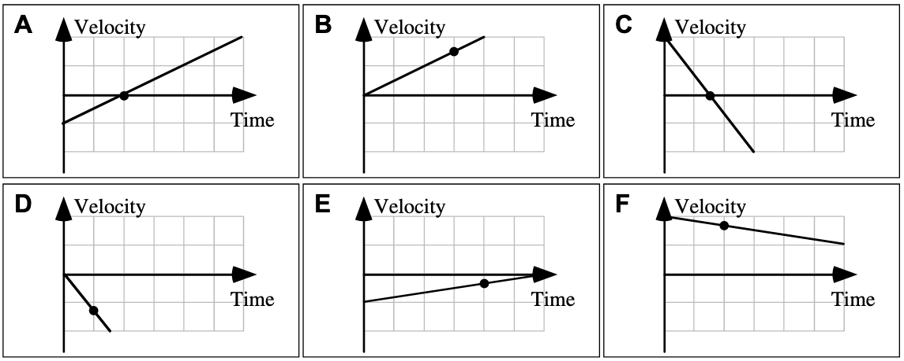

**Rank the magnitude of the velocity of the boat at the point indicated. Explain your reasoning.**

---

# 2025.09.29 **AP Physics**

##### **❓ of the 📅**: Would you rather watch a movie on your TV at home or on the big screen in the theater, and why?

 

#### 📋 Agenda

1. Do Now
2. Finish Carts and Ramps
3. Notes of Graphical Representations
3. Card Sort #2 

### 🎯 Goals

🥅 _Model and represent uniform motion graphical_

### 📆 Homework

- PC Mission KC4: Acceleration
- PC Mission KG1: Basics of Position-Time Graphs

---

### 2025.09.25 **AP Physics** Do Now

The position-time graph shown represents the motion of two children who are moving along a narrow, straight hallway.

1. Do either of the children ever change ***direction***?
2. Are the two children ever at the same ***position*** along the hallway?
3. Do the two children ever have the same ***speed***?
4. Do the two children ever have the same ***acceleration***?

---

# 2025.09.25 **AP Physics**

##### **❓ of the 📅**: What is your favorite family vacation?

 

#### 📋 Agenda

1. Do Now
2. Review Lab Results
3. Linearization
4. Card Sort

### 🎯 Goals

🥅 _Model Uniform motion graphically_

### 📆 Upcoming

---

# 2025.09.24 **AP Physics**

##### **❓ of the 📅**: If you could do anything you wanted today, what would you do?

 

#### 📋 Agenda

1. Finish Fan Cart Lab
2. Whiteboard Results
3. Board Meeting
4. Card Sort

### 🎯 Goals

🥅 _Represent changing velocity motion_

### 📆 Upcoming

---

# 2025.09.23 **AP Physics**

##### **❓ of the 📅**: What is the worst food?

 

#### 📋 Agenda

1. Fan Cart Lab
  - Notes on data collection best practices
2. Tutorial on [https://graphicalanalysis.app](https://graphicalanalysis.app/)

### 🎯 Goals

🥅 _Finish Fan Cart Data Collection & Analysis_

### 📆 Upcoming

- AP Exam checks are due to guidance on **Thursday, October 16th** 
-> Check to _Schodack Central Schools_ 

---

# Ticker Tape Best Practices

- how to set up the spark timer to collect good data:
  - length of tape = length of run, make sure tape is shorter than track so it is pulled all of the way through
  - label tape after collecting data
    - trial #, where zero is
  - need to pull tape through timer **BEFORE** taping to cart
- **Note** You do not need to record _every_ ticker mark...but be sure to follow the 8x10 rule. More data is better here if you have it!

---

# 2025.09.19 **AP Physics**

##### **❓ of the 📅**: Would you rather be a superhero or super villain?

 

#### 📋 Agenda

1. Quiz
2. Based on time: start fan cart lab or group problem solving

### 🎯 Goals

🥅 __

### 📆 Upcoming

---

# 2025.09.18 **AP Physics**

##### **❓ of the 📅**: What animal do you think is the creepiest?

 

#### 📋 Agenda

1. AP Workbook - 1.A through 1.D
2. Velocity vs. Time Graphs 
3. Red Car vs. Green Car Questions

### 🎯 Goals

🥅 _Create and interpret velocity vs. time graphs_

### 📆 Upcoming

- Quiz **tomorrow** -> Practice posted on Canvas

---

A red car (top) and a green car (bottom) are having a race. The green car has a **$21.0\text{ m}$** head start (distance a). The two cars start at the same time. The red car must travel **$200.0\text{ m}$** to the finish line (distance b). The red car averages a speed of $19.3\text{ m/s}$. The green car averages a speed of **$14.2\text{ m/s}$**.

1. Determine the **time** it takes the red car to reach the finish line.
2. Determine the **time** it takes the green car to reach the finish line.

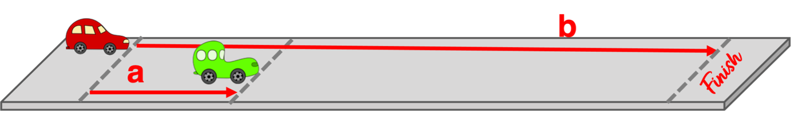

---

A red car (top) and a green car (bottom) are having a race. The green car has a **$35.0\text{ m}$** head start (distance a). The two cars start at the same time. The red car must travel 200.0 m to the finish line (distance b). The red car averages a speed of **$21.8\text{ m/s}$**. The green car averages a speed of **$14.7\text{ m/s}$**. When the red car crosses the finish line, how far (in meters) ahead or behind is the green car? (Enter a + answer if green car is ahead and a - answer if the green car is behind.)

---

A red car (top) and a green car (bottom) are having a race. The green car has a **$30.0\text{ m}$** head start (distance a). The two cars start at the same time. The red car must travel **$200.0\text{ m}$** to the finish line (distance b). The green car averages a speed of **$16.1\text{ m/s}$**. What speed (in m/s) must the red car average in order to reach the finish line at the exact same time as the green car?
 

---

A red car (top) and a green car (bottom) are having a race. The green car has a head start (distance a). The two cars start at the same time. The red car must travel **$200.0\text{ m}$** to the finish line (distance b). The red car averages a speed of **$17.7\text{ m/s}$**. The green car averages a speed of **$14.0\text{ m/s}$**. What must be the head start distance (distance a) in order for the two cars to reach the finish line at the exact same time?

---

A red car (on left) and a green car (on right) are spaced **$1200\text{ m}$** apart (distance a). They start at the same time and head towards each other. The red car averages a speed of **$13.2\text{ m/s}$**. The green car averages a speed of **$16.8\text{ m/s}$**. What distance will the red car have traveled (distance b) when it is at the same position as the green car?

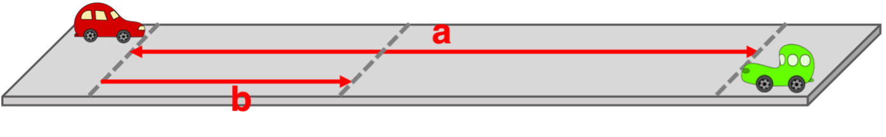

---

# 2025.09.17 **Do Now**

Each graph below shows the position of an object as a function of time.

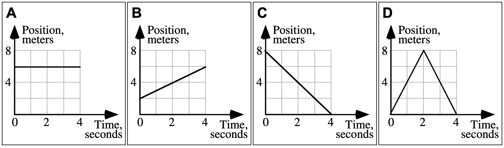

1. Rank the **displacement** of each object from least to greatest. 
2. Rank the **distance** of each object from least to greatest. 

---

# 2025.09.17 **AP Physics**

##### **❓ of the 📅**: Would you rather live in the ocean 🌊 or on the moon 🌔?

 

#### 📋 Agenda

1. Do Now
2. Average vs. Instantaneous
3. Motion Maps
4. Practice Interpreting Motion Maps
    - Concept Builders: Position time graphs (both)

### 🎯 Goals

🥅 _Interpret position vs. time graphs, pictorially, graphically, mathematically, and narratively_

### 📆 Upcoming

- HW: PC _Kinematics 2: Position-Time Graphs_

---

# 2025.09.15 

# **AP Physics** Do Now

1. Do the cyclists start at the same point? How do you know? If not, which is ahead?
2. At $t=7\text{ s}$, which cyclist is ahead? How do you know?
3.  Which cyclist is traveling faster at 3s? How do you know?
4.  Are their velocities equal at any time? How do you know?
5.  What is happening at the intersection of lines $A$ and $B$?

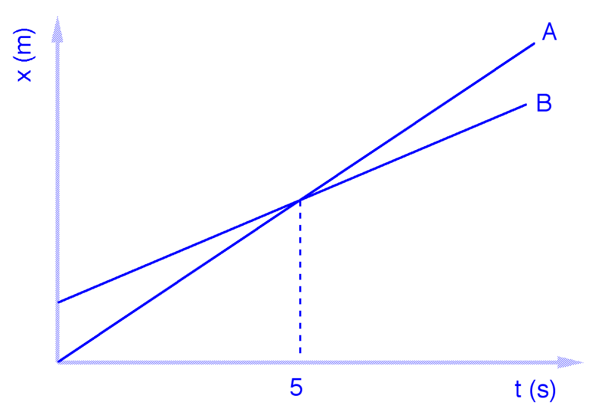

---

# 2025.09.15 

# **AP Physics** Do Now

6. Write a hypothetical mathematical model for each cyclist

---

# 2025.09.15 **AP Physics**

##### **❓ of the 📅**: What is the proper length of a playlist?

 

#### 📋 Agenda

1. Do Now
2. Finish Notes
3. Physics Classrom: [Distance vs. Displacement](https://www.physicsclassroom.com/concept-builder/relationships-and-graphs/experiments-and-variables)
4. Analyzing XT Graphs
5. Average vs. Instantaneous; Speed vs. Velocity

### 🎯 Goals

🥅 _Practice with distance and displacement_

🥅 _Define average vs. instantaneous_

### 📆 Upcoming

---

# 2025.09.12

# **AP Physics** Do Now

## Defining "How Far"

### Who went further? Dorothy or Toto?

---

# 2025.09.12 **AP Physics**

##### **❓ of the 📅**: What is the best fry shape? 🍟 

 

#### 📋 Agenda

0. Do Now
1. Whiteboard Buggy Lab Results
2. Buggy Lab Board Meeting
3. [CV Model Notes](../../../Presentations/APCVPM/talks/CVPM2025.html) 
4. Physics Classrom: [Distance vs. Displacement](https://www.physicsclassroom.com/concept-builder/relationships-and-graphs/experiments-and-variables)

### 🎯 Goals

🥅 _Define position, distance, and displacement_

🥅 _Model **consistent** motion_

### 📆 Upcoming

- Get those safety contracts signed!
- PC: [Distance vs. Displacement](https://www.physicsclassroom.com/concept-builder/relationships-and-graphs/experiments-and-variables)

---

# 2025.09.11 **AP Physics**

##### **❓ of the 📅**: Does a week start on Sunday or Monday?

 

#### 📋 Agenda

1. Buggy Lab
    - Goal is to have data collected, graphed, and discussion written by the end of class

### 🎯 Goals

🥅 _Model motion of a toy car_

### 📆 Upcoming

- Get your parents/guardians to sign your safety contract on ParentSquare

---

# Buggy Lab 🚗 

### Purpose

Collect data on your buggies so that you can represent the motion (all aspescts) of both buggies on the **same** graph. Your final models should be able to predict the **position** of your buggy at specified times. 

### Question

Does your Buggy move **in a consistent manner**? [Define consistent]

### Constraints

You will be given scenario card that describes the setup of your buggies

---

# Scenarios

- You can ignore the speed label, just use the colors for reference

---

# **Do Now:** Register for...

1. _AP Classroom_ ->> AP Exam Prep & Review
  - Website: [https://apclassroom.collegeboard.org/](https://apclassroom.collegeboard.org/)
  - Code: **RPPQPA**
2. _Physics Classroom_ ->> General Physics Practice & Homework
  - Website: [http://www.physicsclassroom.com/sign-in](http://www.physicsclassroom.com/sign-in)
  - Code: **003117a**
  - Register with school email as username

---

# 2025.09.09 **AP Physics**

##### **❓ of the 📅**: Is it OK to ask the genie for infinite wishes? 🧞

 

#### 📋 Agenda

1. Do Now
2. Board Meeting
3. Test out Physics Classroom -> Variables MOP
4. Buggy Lab

### 🎯 Goals

🥅 _Establish Board Meeting Norms_

### 📆 Upcoming

- Safety Contract Post

---

# Physics Classroom

- **Interactives** are a large collection of HTML5 interactive physics and chemistry simulations. 
- **Concept Builders** help discover and solidify learning concepts and discover and correct incorrect ideas.
- **Minds On** challenge student's understanding in a game where correct answers progress you to the finish line.
- **Calc Pad** provides students with math-based questions to practice their understanding and usage of equations and formulas.
- **Science Reasoning** help students to learn and grow their scientific thinking and reasoning skills in the context of various physics related tasks.

---

# Buggy Lab 🚗 

## Purpose

Collect data on your buggies so that you can represent the motion (all aspescts) of both buggies on the **same** graph. Your final models should be able to predict the **position** of your buggy at specified times. 

## Constraints

You will be given scenario card that describes the setup of your buggies

---

# Scenarios

- You can ignore the speed label, just use the colors for reference

---

# AP Physics **Do Now**

1. Go to [Data Collection Best Practices Interactive](https://www.mrporterphysics.com/AP%20Resource%20Pages/datacollection.html)
2. Read and click through the examples
3. Reflect on your _Coefficient of Restitution_ lab, did you follow these practices? How can you improve upon your design?

---

# 2025.09.08 **AP Physics**

##### **❓ of the 📅**: Do you think it would be easier to give up sugar or technology?

 

#### 📋 Agenda

1. Do Now 
2. Co. of Restitution Lab
	1. Finish Collecting Data
	2. Graph
	3. Whiteboard Results
3. $e$ Board Meeting 
4. Finish Lab Notebook 

### 🎯 Goals

🥅 _Learn quality data collection techniques_

🥅 _Engage in scientific discussion_

🥅 _Use graphs and data to answer questions_

---

# $e$ Board Meeting

## On your whiteboard

- Hypothesis and results
  - What did you do and what did you find? How does your data support or refute your hypothesis?

### Things to consider:
- What does your graph look like? Linear, curve, etc?
  - What does that mean? What do the graphical features like slope/intercept mean?
- How confident are you in your data? High or low levels of uncertainty?

---

# 2025.09.05 **AP Physics** 

##### **❓ of the 📅**: Sweet or savory for breakfast?

#### 📋 Agenda

0. Sit Anywhere
1. Do Now (fill out questionnaire & card)
2. Question of the Day
3. Grouping Game
4. Survival Island

### 🎯 Goals 

🥅 _Introductions_

🥅 _Classroom Culture_

### 🏠 Homework

- Signed Safety Contract

---
<!--- background: black--->
# Do **Now** 

1. Fill out index card:
    1. Name
    2. Phone number to reach your parents/guardians if you sleep through the AP Exam
    3. Favorite Candy
    4. Favorite Emoji
    5. Emoji the describes your current mood
2. Fill out Paper Quesionnaire

---

# Lab Grouping Game

- There are 13 of you
- Based on your cards get into ***LOGICAL*** groups of **three** (plus one group of 4)
- Check **whole class** answer with Mr. Porter
    - 4 Chances to Check
- Reorganize if necessary

(Yes this is the game Connections)

---

# Answers

- **KINDS OF BEANS** - KIDNEY, MUNG, NAVY
- **DEVISE** - CONCOCT, ENGINEER, HATCH
- **NASA SPACECRAFT** - GALILEO, VIKING, VOYAGER
- **GAMES WHERE YOU SAY THE GAME’S NAME** - BINGO, TAG, UNO

---

# Survival Island 🌴

1. Share your *survival skill* that **you wrote down** with your group
2. Using ***everyone's skill*** develop a plan to survive or escape the deserted island
3. On your whiteboard present your plan (drawing, mind map, set of instructions)
    - Highlight everyone's skill

---

# Surivial Plan... <!--fit--->

---

# Coefficient of Restitution Lab

Determine whether the ***coefficient of restitution***, $e$, for a specific ball remains constant when dropped from various heights. Do this by comparing drop height to bounce height for your assigned ball. 

---

# 🥼 Lets Science! 🥼 <!--fit--->

# 📓 Lab Notebooks 📓 <!--fit--->

---

# What is a Lab Notebook?

* A detailed, chronological record of a scientist's research activities, experiments, and observations. 
* Documentation of the scientific process from intial ideas to final results and conclusions. 

---

# Why keep lab notebooks?

* Document Research
* Develop Ideas
* Organize Data 
* Collaboration Tool
* Publication Support
* Troubleshooting 
* Intellectual Property Protection
* Historical Record

---

# Lab Notebooks can be Legal Documents 

* Proof of invention in Patent Cases
* Intellectual Property Protection
* Admissibility in court - must be properly maintained
* Note: Often property of the instituation where the research was conducted (i.e. Property of Regeneron, or Property of Cornell University)

---

# Remember

* Lab notebooks are most importantly scientific documentation
* They represent the scientific process and are record of your **thinking**
    * This means your ideas and conclusions and hypotheses can **change** based on **new data**

---

# Lab Notebook

* Write in **pen**
* All mistakes get a ~~single cross through~~
* Full Date (YYYY/MM/DD) at the beginning of each entry (for multiday labs date start of each day)
* Enter Lab Pages into table of contents 

---

# Lab Notebook - Pre Lab

* **Title and objective of the experiment**: 
  - Write a clear, concise title for each experiment.
  - State the main objective or purpose of the experiment in 1-2 sentences.
* **Theoretical background**: 
  - Briefly explain the relevant scientific principles.
  - Include key equations or concepts that will be tested or applied.
* **Hypotheses**: 

  - State your predictions about the experiment's outcome.
  - Base these on your understanding of the theory.

---

# Lab Notebook - Pre Lab

* **Materials and equipment list**: 
  - Provide a detailed list of all materials and equipment used.
  - Include model numbers and specifications where relevant.
* **Experimental procedure outline**: 
  - Write a step-by-step outline of the planned procedure.
  - Be specific enough that someone could replicate your experiment.

---

<!--- footer:   --->

# During the Experiment

* **Raw data in tables with units**: 
  - Create neat, organized tables for all numerical data.
  - Always include units and uncertainty estimates.
  - Label columns clearly and use consistent significant figures.
* **Observations and qualitative notes**: 
  - Record all relevant observations, even if they seem unimportant.
  - Note any unexpected occurrences or anomalies.

---

# During the Experiment 

* **Any changes to the planned procedure**: 
  - Document any deviations from the original procedure.
  - Explain why changes were made and how they might affect results.
* **Sketches or diagrams of experimental setup**: 
  - Include clear, labeled diagrams of your experimental setup.
  - Add dimensions and important details to aid in replication.

---

# Post Lab

* **Data analysis and calculations**: 
  - Show all steps in your calculations, including formulas used.
  - Explain your reasoning for each step of the analysis.
* **Graphs and charts**: 
  - Create neat, properly labeled graphs and charts.
  - Include titles, axis labels with units, and legends where appropriate.

---

# Post Lab

* **Discussion of results**: 
  - Interpret your results in the context of the experiment's objectives.
  - Explain any patterns or trends observed in the data
* **Comparison with hypotheses**: 
  - Explicitly state whether your results support or refute your hypotheses.
  - Discuss possible reasons for any discrepancies.
* **Sources of error and uncertainty**: 
  - Identify potential sources of experimental error.
  - Discuss how these might have affected your results.
  - Quantify uncertainties where possible.

---

# Post Lab

- **Conclusions**: 
  - Summarize the main findings of the experiment.
  - Relate these back to the original objectives and broader scientific principles.
  - Suggest improvements or future directions for the experiment.

---

# Ball Bounce Lab

#### Question:

Is the coefficient of restitution constant for your ball? Do this by comparing drop height to bounce height for your assigned ball.

---

# Ball Bounce Lab

#### Question:

Is the coefficient of restitution constant for your ball? Do this by comparing drop height to bounce height for your assigned ball.

#### Background: 

The coefficient of restitution (symbol: $e$) is a dimensionless quantity that describes how much energy is conserved in a collision, specifically how well an object bounces back after impact. It is used to characterize the elasticity of collisions between two bodies.