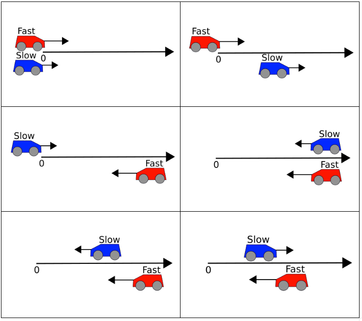

# AP Physics 🔭 <!---fit--->

# **2025-2026** Agendas

## 👨‍🏫 Mr. Porter

---

<!--- class: halloween --->

# 2025.10.10 **AP Physics**

##### **❓ of the 📅**: What is your favorite Halloween monster?

 

#### 📋 Agenda

1. Quiz
2. Finish up anything in the photogate lab and get it stamped 
3. Pep Rally - play nice 

### 🎯 Goals

🥅 _Crush your quiz 💪🧠_

### 📆 Upcoming

---

# 2025.10.09 **AP Physics**

##### **❓ of the 📅**: Apple 🍎 or pumpkin 🎃 flavored?

 

#### 📋 Agenda

1. Photogate Lab

### 🎯 Goals

🥅 _Use equations and graphical models to solve problems_

### 📆 Upcoming

- Quiz tomorrow:
  - VT graphs
  - Equations

---

#  Photogate Timing Lab
Target: time between photogates = **0.12 s**

The figure above shows a cart on an inclined ramp. The cart is released from rest a distance $\Delta x_1 = 20\text{ cm}$ from photogate 1. You are tasked to determine the distance from photogate 1, $\Delta x_2$, to put a second photogate, so that the time it takes for the cart to travel between the two gates is $\Delta t = 0.12\text{ s}$.

---

## Question
How far from photogate 1 should photogate 2 be placed to get **0.12 s** between gates?

---

## Purpose
Use the constant-acceleration particle model to:
- Measure ramp acceleration from rest.
- Predict photogate spacing **Δx2** for the target interval.

---

## Materials
Cart, inclined ramp, 2 photogates + timer, meterstick, tape, angle finder (optional), data table.

---

## Procedure (Measure a)
1. Mark release point **Δx1 = 20 cm** above gate 1; start cart from rest.
2. Place gates; record gate times or interval over known spacing.
3. Repeat 5 trials; keep setup identical.

---

## Determine Acceleration

## Predict Spacing
- Derive **Δx2(Δx1, a, Δt)** from CAPM equations.
- Compute **Δx2** for **Δt = 0.12 s**.

---

## Test & Validate
- Place gate 2 at predicted **Δx2**.
- Run 3 trials; compare to 0.12 s.
- Compute percent error.

---

## Representations

- v–t with slope **a**.
- x–t showing curvature.
- Equations + sample calc with units.

---

## Reflection
- Does data support constant **a**?
- How does steeper ramp (larger **a**) affect **Δx2** for same **Δt**?
- Evaluate the peer claim about moving gate 1 closer.

---

## Notebook Checklist

✅ Titles
✅ Procedures and data
✅ labeled tables/graphs
✅ units
✅ best-fit lines
✅ clear conclusion & reflection questions

---

# 🎃 2025.10.07 **AP Physics** 🕸️

##### **❓ of the 📅**: Do you like scary movies? What is your favorite? 

 

#### 📋 Agenda

1. Finish Bear Problem
2. Discuss
3. Kinematic Equations & Cross Diagram

### 🎯 Goals

🥅 _Use graphs and equations to solve word problems_

### 📆 Upcoming

- PC Kinematic Eqns 1, 2, 3

---

# :alien: 2025.10.06 **AP Physics**

##### **❓ of the 📅**: Candy corn: yay or nay?

 

#### 📋 Agenda

1. Do Now - Graphs Practice worksheet
2. Problem-Solving with VT Graphs 
    - get back into pairs (different than Friday!)

### 🎯 Goals

🥅 _Use velocity time graphs to model motion and make predictions._

### 📆 Upcoming

- Quiz Friday

---

# 🎃 2025.10.03 **AP Physics** Do Now 👻

Graphs of velocity versus time during 4 seconds for identical objects are shown below.

**Rank the magnitudes of the displacements of the objects during each of these intervals.**

---

# 🎃 2025.10.03 **AP Physics** 👻

##### **❓ of the 📅**: Would you rather visit a Haunted House or a Corn Maze?

 

#### 📋 Agenda

1. Do Now
2. Problem-solving with VT Graphs
3. Paired Problem Solving

### 🎯 Goals

🥅 _Use velocity time graphs to model motion and make predictions._

---

<!--- class: --->

# 2025.10.01 **AP Physics**

##### **❓ of the 📅**: Cake or pie? 🍰🥧

 

#### 📋 Agenda

1. Do Now - Check stacks of graphs with table
2. Solving VT Graphs Quantitatively
3. Introduction to problem solving

### 🎯 Goals

🥅 _Use velocity vs. time graphs to solve Kinematic problems_

### 📆 Upcoming

- PC CalcPad K10 - Velocity Time Graphs 1
- PC CalcPad K11 - Velocity Time Graphs 2

---

For each of these cases, if any, is...at the indicated point?

1. the **position zero** ?
2. the **position negative**?
3. the **velocity zero**?
4. the **velocity negative**?
5. the **acceleration zero** ?
6. the **acceleration negative**?

---

# 2025.09.30 **AP Physics**

##### **❓ of the 📅**: Should you bite or lick your ice cream? 🍨🍦

 

#### 📋 Agenda

1. 📓 Notes & [8 Examples](https://www.mrporterphysics.com/AP%20Resource%20Pages/eightmotiongraphs.html)
2. 🃏 Card Sort 2 
3. 📈 Velocity vs time graphs

### 🎯 Goals

🥅 _Model motion graphically_ 

🥅 _Make predictions of motion from VT Graphs_

### 🏡 Homework

- PC CalcPad K10 - Velocity Time Graphs 1
- PC CalcPad K11 - Velocity Time Graphs 2

---

### 2025.09.29 **AP Physics** Do Now

The graphs below show the velocity versus time for boats traveling along a straight, narrow channel. The scales on both axes are the same for all of these graphs. In each graph, a point is marked with a dot.

**Rank the magnitude of the velocity of the boat at the point indicated. Explain your reasoning.**

---

# 2025.09.29 **AP Physics**

##### **❓ of the 📅**: Would you rather watch a movie on your TV at home or on the big screen in the theater, and why?

 

#### 📋 Agenda

1. Do Now
2. Finish Carts and Ramps
3. Notes of Graphical Representations
3. Card Sort #2 

### 🎯 Goals

🥅 _Model and represent uniform motion graphical_

### 📆 Homework

- PC Mission KC4: Acceleration
- PC Mission KG1: Basics of Position-Time Graphs

---

### 2025.09.25 **AP Physics** Do Now

The position-time graph shown represents the motion of two children who are moving along a narrow, straight hallway.

1. Do either of the children ever change ***direction***?
2. Are the two children ever at the same ***position*** along the hallway?
3. Do the two children ever have the same ***speed***?
4. Do the two children ever have the same ***acceleration***?

---

# 2025.09.25 **AP Physics**

##### **❓ of the 📅**: What is your favorite family vacation?

 

#### 📋 Agenda

1. Do Now
2. Review Lab Results
3. Linearization
4. Card Sort

### 🎯 Goals

🥅 _Model Uniform motion graphically_

### 📆 Upcoming

---

# 2025.09.24 **AP Physics**

##### **❓ of the 📅**: If you could do anything you wanted today, what would you do?

 

#### 📋 Agenda

1. Finish Fan Cart Lab
2. Whiteboard Results
3. Board Meeting
4. Card Sort

### 🎯 Goals

🥅 _Represent changing velocity motion_

### 📆 Upcoming

---

# 2025.09.23 **AP Physics**

##### **❓ of the 📅**: What is the worst food?

 

#### 📋 Agenda

1. Fan Cart Lab
  - Notes on data collection best practices
2. Tutorial on [https://graphicalanalysis.app](https://graphicalanalysis.app/)

### 🎯 Goals

🥅 _Finish Fan Cart Data Collection & Analysis_

### 📆 Upcoming

- AP Exam checks are due to guidance on **Thursday, October 16th** 
-> Check to _Schodack Central Schools_ 

---

# Ticker Tape Best Practices

- how to set up the spark timer to collect good data:
  - length of tape = length of run, make sure tape is shorter than track so it is pulled all of the way through
  - label tape after collecting data
    - trial #, where zero is
  - need to pull tape through timer **BEFORE** taping to cart
- **Note** You do not need to record _every_ ticker mark...but be sure to follow the 8x10 rule. More data is better here if you have it!

---

# 2025.09.19 **AP Physics**

##### **❓ of the 📅**: Would you rather be a superhero or super villain?

 

#### 📋 Agenda

1. Quiz
2. Based on time: start fan cart lab or group problem solving

### 🎯 Goals

🥅 __

### 📆 Upcoming

---

# 2025.09.18 **AP Physics**

##### **❓ of the 📅**: What animal do you think is the creepiest?

 

#### 📋 Agenda

1. AP Workbook - 1.A through 1.D
2. Velocity vs. Time Graphs 
3. Red Car vs. Green Car Questions

### 🎯 Goals

🥅 _Create and interpret velocity vs. time graphs_

### 📆 Upcoming

- Quiz **tomorrow** -> Practice posted on Canvas

---

A red car (top) and a green car (bottom) are having a race. The green car has a **$21.0\text{ m}$** head start (distance a). The two cars start at the same time. The red car must travel **$200.0\text{ m}$** to the finish line (distance b). The red car averages a speed of $19.3\text{ m/s}$. The green car averages a speed of **$14.2\text{ m/s}$**.

1. Determine the **time** it takes the red car to reach the finish line.
2. Determine the **time** it takes the green car to reach the finish line.

---

A red car (top) and a green car (bottom) are having a race. The green car has a **$35.0\text{ m}$** head start (distance a). The two cars start at the same time. The red car must travel 200.0 m to the finish line (distance b). The red car averages a speed of **$21.8\text{ m/s}$**. The green car averages a speed of **$14.7\text{ m/s}$**. When the red car crosses the finish line, how far (in meters) ahead or behind is the green car? (Enter a + answer if green car is ahead and a - answer if the green car is behind.)

---

A red car (top) and a green car (bottom) are having a race. The green car has a **$30.0\text{ m}$** head start (distance a). The two cars start at the same time. The red car must travel **$200.0\text{ m}$** to the finish line (distance b). The green car averages a speed of **$16.1\text{ m/s}$**. What speed (in m/s) must the red car average in order to reach the finish line at the exact same time as the green car?
 

---

A red car (top) and a green car (bottom) are having a race. The green car has a head start (distance a). The two cars start at the same time. The red car must travel **$200.0\text{ m}$** to the finish line (distance b). The red car averages a speed of **$17.7\text{ m/s}$**. The green car averages a speed of **$14.0\text{ m/s}$**. What must be the head start distance (distance a) in order for the two cars to reach the finish line at the exact same time?

---

A red car (on left) and a green car (on right) are spaced **$1200\text{ m}$** apart (distance a). They start at the same time and head towards each other. The red car averages a speed of **$13.2\text{ m/s}$**. The green car averages a speed of **$16.8\text{ m/s}$**. What distance will the red car have traveled (distance b) when it is at the same position as the green car?

---

# 2025.09.17 **Do Now**

Each graph below shows the position of an object as a function of time.

1. Rank the **displacement** of each object from least to greatest. 
2. Rank the **distance** of each object from least to greatest. 

---

# 2025.09.17 **AP Physics**

##### **❓ of the 📅**: Would you rather live in the ocean 🌊 or on the moon 🌔?

 

#### 📋 Agenda

1. Do Now
2. Average vs. Instantaneous
3. Motion Maps
4. Practice Interpreting Motion Maps
    - Concept Builders: Position time graphs (both)

### 🎯 Goals

🥅 _Interpret position vs. time graphs, pictorially, graphically, mathematically, and narratively_

### 📆 Upcoming

- HW: PC _Kinematics 2: Position-Time Graphs_

---

# 2025.09.15 

# **AP Physics** Do Now

1. Do the cyclists start at the same point? How do you know? If not, which is ahead?
2. At $t=7\text{ s}$, which cyclist is ahead? How do you know?
3.  Which cyclist is traveling faster at 3s? How do you know?
4.  Are their velocities equal at any time? How do you know?
5.  What is happening at the intersection of lines $A$ and $B$?

---

# 2025.09.15 

# **AP Physics** Do Now

6. Write a hypothetical mathematical model for each cyclist

---

# 2025.09.15 **AP Physics**

##### **❓ of the 📅**: What is the proper length of a playlist?

 

#### 📋 Agenda

1. Do Now
2. Finish Notes
3. Physics Classrom: [Distance vs. Displacement](https://www.physicsclassroom.com/concept-builder/relationships-and-graphs/experiments-and-variables)
4. Analyzing XT Graphs
5. Average vs. Instantaneous; Speed vs. Velocity

### 🎯 Goals

🥅 _Practice with distance and displacement_

🥅 _Define average vs. instantaneous_

### 📆 Upcoming

---

# 2025.09.12

# **AP Physics** Do Now

## Defining "How Far"

### Who went further? Dorothy or Toto?

---

# 2025.09.12 **AP Physics**

##### **❓ of the 📅**: What is the best fry shape? 🍟

 

#### 📋 Agenda

0. Do Now
1. Whiteboard Buggy Lab Results
2. Buggy Lab Board Meeting
3. [CV Model Notes](../../../Presentations/APCVPM/talks/CVPM2025.html) 
4. Physics Classrom: [Distance vs. Displacement](https://www.physicsclassroom.com/concept-builder/relationships-and-graphs/experiments-and-variables)

### 🎯 Goals

🥅 _Define position, distance, and displacement_

🥅 _Model **consistent** motion_

### 📆 Upcoming

- Get those safety contracts signed!
- PC: [Distance vs. Displacement](https://www.physicsclassroom.com/concept-builder/relationships-and-graphs/experiments-and-variables)

---

# 2025.09.11 **AP Physics**

##### **❓ of the 📅**: Does a week start on Sunday or Monday?

 

#### 📋 Agenda

1. Buggy Lab
    - Goal is to have data collected, graphed, and discussion written by the end of class

### 🎯 Goals

🥅 _Model motion of a toy car_

### 📆 Upcoming

- Get your parents/guardians to sign your safety contract on ParentSquare

---

# Buggy Lab 🚗 

### Purpose

Collect data on your buggies so that you can represent the motion (all aspescts) of both buggies on the **same** graph. Your final models should be able to predict the **position** of your buggy at specified times. 

### Question

Does your Buggy move **in a consistent manner**? [Define consistent]

### Constraints

You will be given scenario card that describes the setup of your buggies

---

# Scenarios

- You can ignore the speed label, just use the colors for reference

---

# **Do Now:** Register for...

1. _AP Classroom_ ->> AP Exam Prep & Review
  - Website: [https://apclassroom.collegeboard.org/](https://apclassroom.collegeboard.org/)
  - Code: **RPPQPA**
2. _Physics Classroom_ ->> General Physics Practice & Homework
  - Website: [http://www.physicsclassroom.com/sign-in](http://www.physicsclassroom.com/sign-in)
  - Code: **003117a**
  - Register with school email as username

---

# 2025.09.09 **AP Physics**

##### **❓ of the 📅**: Is it OK to ask the genie for infinite wishes? 🧞

 

#### 📋 Agenda

1. Do Now
2. Board Meeting
3. Test out Physics Classroom -> Variables MOP
4. Buggy Lab

### 🎯 Goals

🥅 _Establish Board Meeting Norms_

### 📆 Upcoming

- Safety Contract Post

---

# Physics Classroom

- **Interactives** are a large collection of HTML5 interactive physics and chemistry simulations. 
- **Concept Builders** help discover and solidify learning concepts and discover and correct incorrect ideas.
- **Minds On** challenge student's understanding in a game where correct answers progress you to the finish line.
- **Calc Pad** provides students with math-based questions to practice their understanding and usage of equations and formulas.
- **Science Reasoning** help students to learn and grow their scientific thinking and reasoning skills in the context of various physics related tasks.

---

# Buggy Lab 🚗 

## Purpose

Collect data on your buggies so that you can represent the motion (all aspescts) of both buggies on the **same** graph. Your final models should be able to predict the **position** of your buggy at specified times. 

## Constraints

You will be given scenario card that describes the setup of your buggies

---

# Scenarios

- You can ignore the speed label, just use the colors for reference

---

# AP Physics **Do Now**

1. Go to [Data Collection Best Practices Interactive](https://www.mrporterphysics.com/AP%20Resource%20Pages/datacollection.html)
2. Read and click through the examples
3. Reflect on your _Coefficient of Restitution_ lab, did you follow these practices? How can you improve upon your design?

---

# 2025.09.08 **AP Physics**

##### **❓ of the 📅**: Do you think it would be easier to give up sugar or technology?

 

#### 📋 Agenda

1. Do Now 
2. Co. of Restitution Lab
	1. Finish Collecting Data
	2. Graph
	3. Whiteboard Results
3. $e$ Board Meeting 
4. Finish Lab Notebook 

### 🎯 Goals

🥅 _Learn quality data collection techniques_

🥅 _Engage in scientific discussion_

🥅 _Use graphs and data to answer questions_

---

# $e$ Board Meeting

## On your whiteboard

- Hypothesis and results
  - What did you do and what did you find? How does your data support or refute your hypothesis?

### Things to consider:
- What does your graph look like? Linear, curve, etc?
  - What does that mean? What do the graphical features like slope/intercept mean?
- How confident are you in your data? High or low levels of uncertainty?

---

# 2025.09.05 **AP Physics** 

##### **❓ of the 📅**: Sweet or savory for breakfast?

#### 📋 Agenda

0. Sit Anywhere
1. Do Now (fill out questionnaire & card)
2. Question of the Day
3. Grouping Game
4. Survival Island

### 🎯 Goals 

🥅 _Introductions_

🥅 _Classroom Culture_

### 🏠 Homework

- Signed Safety Contract

---
<!--- background: black--->
# Do **Now** 

1. Fill out index card:
    1. Name
    2. Phone number to reach your parents/guardians if you sleep through the AP Exam
    3. Favorite Candy
    4. Favorite Emoji
    5. Emoji the describes your current mood
2. Fill out Paper Quesionnaire

---

# Lab Grouping Game

- There are 13 of you
- Based on your cards get into ***LOGICAL*** groups of **three** (plus one group of 4)
- Check **whole class** answer with Mr. Porter
    - 4 Chances to Check
- Reorganize if necessary

(Yes this is the game Connections)

---

# Answers

- **KINDS OF BEANS** - KIDNEY, MUNG, NAVY
- **DEVISE** - CONCOCT, ENGINEER, HATCH
- **NASA SPACECRAFT** - GALILEO, VIKING, VOYAGER
- **GAMES WHERE YOU SAY THE GAME’S NAME** - BINGO, TAG, UNO

---

# Survival Island 🌴

1. Share your *survival skill* that **you wrote down** with your group
2. Using ***everyone's skill*** develop a plan to survive or escape the deserted island
3. On your whiteboard present your plan (drawing, mind map, set of instructions)
    - Highlight everyone's skill

---

# Surivial Plan... <!--fit--->

---

# Coefficient of Restitution Lab

Determine whether the ***coefficient of restitution***, $e$, for a specific ball remains constant when dropped from various heights. Do this by comparing drop height to bounce height for your assigned ball. 

---

# 🥼 Lets Science! 🥼 <!--fit--->

# 📓 Lab Notebooks 📓 <!--fit--->

---

# What is a Lab Notebook?

* A detailed, chronological record of a scientist's research activities, experiments, and observations. 
* Documentation of the scientific process from intial ideas to final results and conclusions. 

---

# Why keep lab notebooks?

* Document Research
* Develop Ideas
* Organize Data 
* Collaboration Tool
* Publication Support
* Troubleshooting 
* Intellectual Property Protection
* Historical Record

---

# Lab Notebooks can be Legal Documents 

* Proof of invention in Patent Cases
* Intellectual Property Protection
* Admissibility in court - must be properly maintained
* Note: Often property of the instituation where the research was conducted (i.e. Property of Regeneron, or Property of Cornell University)

---

# Remember

* Lab notebooks are most importantly scientific documentation
* They represent the scientific process and are record of your **thinking**
    * This means your ideas and conclusions and hypotheses can **change** based on **new data**

---

# Lab Notebook

* Write in **pen**
* All mistakes get a ~~single cross through~~
* Full Date (YYYY/MM/DD) at the beginning of each entry (for multiday labs date start of each day)
* Enter Lab Pages into table of contents 

---

# Lab Notebook - Pre Lab

* **Title and objective of the experiment**: 
  - Write a clear, concise title for each experiment.
  - State the main objective or purpose of the experiment in 1-2 sentences.
* **Theoretical background**: 
  - Briefly explain the relevant scientific principles.
  - Include key equations or concepts that will be tested or applied.
* **Hypotheses**: 

  - State your predictions about the experiment's outcome.
  - Base these on your understanding of the theory.

---

# Lab Notebook - Pre Lab

* **Materials and equipment list**: 
  - Provide a detailed list of all materials and equipment used.
  - Include model numbers and specifications where relevant.
* **Experimental procedure outline**: 
  - Write a step-by-step outline of the planned procedure.
  - Be specific enough that someone could replicate your experiment.

---

<!--- footer:   --->

# During the Experiment

* **Raw data in tables with units**: 
  - Create neat, organized tables for all numerical data.
  - Always include units and uncertainty estimates.
  - Label columns clearly and use consistent significant figures.
* **Observations and qualitative notes**: 
  - Record all relevant observations, even if they seem unimportant.
  - Note any unexpected occurrences or anomalies.

---

# During the Experiment 

* **Any changes to the planned procedure**: 
  - Document any deviations from the original procedure.
  - Explain why changes were made and how they might affect results.
* **Sketches or diagrams of experimental setup**: 
  - Include clear, labeled diagrams of your experimental setup.
  - Add dimensions and important details to aid in replication.

---

# Post Lab

* **Data analysis and calculations**: 
  - Show all steps in your calculations, including formulas used.
  - Explain your reasoning for each step of the analysis.
* **Graphs and charts**: 
  - Create neat, properly labeled graphs and charts.
  - Include titles, axis labels with units, and legends where appropriate.

---

# Post Lab

* **Discussion of results**: 
  - Interpret your results in the context of the experiment's objectives.
  - Explain any patterns or trends observed in the data
* **Comparison with hypotheses**: 
  - Explicitly state whether your results support or refute your hypotheses.
  - Discuss possible reasons for any discrepancies.
* **Sources of error and uncertainty**: 
  - Identify potential sources of experimental error.
  - Discuss how these might have affected your results.
  - Quantify uncertainties where possible.

---

# Post Lab

- **Conclusions**: 
  - Summarize the main findings of the experiment.
  - Relate these back to the original objectives and broader scientific principles.
  - Suggest improvements or future directions for the experiment.

---

# Ball Bounce Lab

#### Question:

Is the coefficient of restitution constant for your ball? Do this by comparing drop height to bounce height for your assigned ball.

---

# Ball Bounce Lab

#### Question:

Is the coefficient of restitution constant for your ball? Do this by comparing drop height to bounce height for your assigned ball.

#### Background: 

The coefficient of restitution (symbol: $e$) is a dimensionless quantity that describes how much energy is conserved in a collision, specifically how well an object bounces back after impact. It is used to characterize the elasticity of collisions between two bodies.