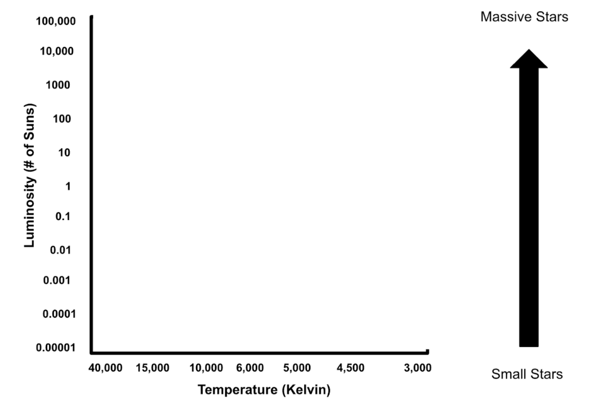
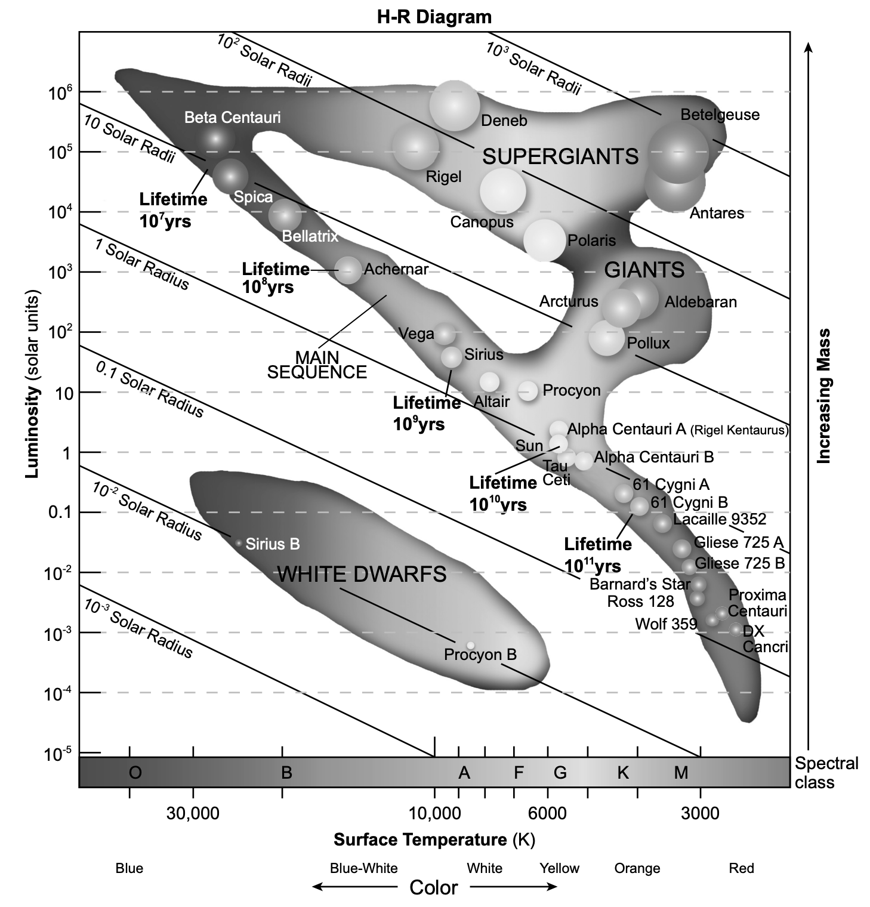
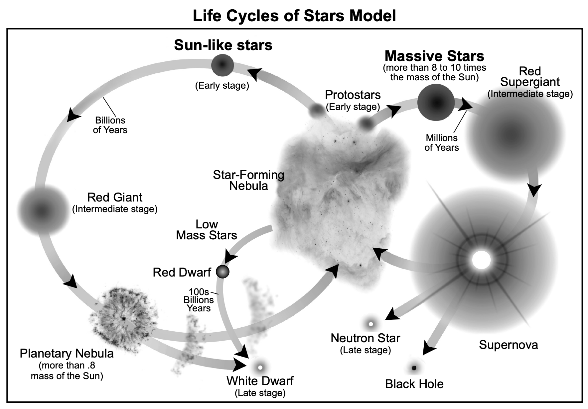
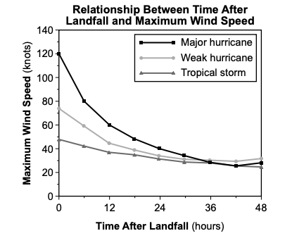

# Earth Science 🌎 <!--fit--->

## 🧑‍🏫 Mr. Porter

### 📆 2025-26

---

<!--- class: halloween --->

# 2025.10.07 **Earth Science**

##### **❓ of the 📅**: QUESTIONNNNNNNNN

 

#### 📋 Agenda

1. Star Sort & Graphing
2. See-think-wonder
3. Class consensus
4. HR Diagram Extension

### 🎯 Goals

🥅 __

### 📆 Upcoming

---

# Investigate:

- How can we determine star mass from ***observable*** properties?
- We will be creating a static model of the star in a box simulation

---

# Instructions

1. Plot your stars based on their data
2. Look for patterns & connections based one graph

## Investigate:

- How can we determine star mass from ***observable*** properties?
- We will be creating a static model of the star in a box simulation

---

# Hertzsprung-Russell Diagram (HR Diagram)

---

# Consensus Questions 

### **1. What properties in stars allow us to make predictions about their life span and stability?**

### **2. What kind of stars live the longest and most stable lives?**

---

# 2025.10.06 **Earth Science**

##### **❓ of the 📅**: Candy Corn: yay or nay?

 

#### 📋 Agenda

1. 👀🤔💭 See-think-wonder share out
2. Stellar Evolution Diagram -> Review answers & discuss
3. Stellar Evolution Practice - Finish for homework

### 🎯 Goals

🥅 _Discuss and define stellar evolution_

### 📆 Upcoming

- Finish Stellar Evolution Practice Questions

---

# 2025.10.03 **Earth Science**

##### **❓ of the 📅**: WYR go to a Haunted House or a Corn Maze?

 

#### 📋 Agenda

1. Finish Star in a Box Data
2. See Think Wonder
3. Class Share
4. Group Star Graphing Activity

### 🎯 Goals

🥅 _Look for patterns in stellar life cycle_

🥅 _Look at star property patterns_

### 📆 Upcoming

---

---

# 🎃 2025.10.02 **Earth Science** 👻

##### **❓ of the 📅**: What is your favorite halloween candy? 🍬🍫🍭

 

#### 📋 Agenda

1. Discuss Life Cycle Mass Grouping
2. Stellar Life Cycle Data Collection - Star In a Box

### 🎯 Goals

🥅 _Collect data on star life cycles using the Star in a box simulation_

### 📆 Upcoming

---

<!--- class: twilight --->

# 2025.10.01 **Earth Science**

##### **❓ of the 📅**: Cake or Pie? 🍰🥧 

 

#### 📋 Agenda

1. Finish Supernova 1054
1. [Star In A Box](https://starinabox.lco.global/)
2. Explore:
    - _look for evidence of patterns in the relationship between star mass and stability and change in stars_

### 🎯 Goals

🥅 _use a **computational model**_

🥅 _find **evidence** of **patterns_**

🥅 _use mass to **explain** <mark>stability</mark> and change in stars_

### 📆 Upcoming

---

# 2025.09.30 **Earth Science**

##### **❓ of the 📅**: Should you bite or lick your ice cream? 🍨 🍦

 

#### 📋 Agenda

1. Finish Performance Task Organizer Questions
2. Supernova 1054
3. What do we need to know about the life and death of stars to find an Earth-like planet?

### 🎯 Goals

🥅 _Generate Questions about the life span of stars_

### 📆 Upcoming

---

# 2025.09.29 **Earth Science**

##### **❓ of the 📅**: Would you rather watch a movie on your TV at home or on the big screen in the theater, and why?

 

#### 📋 Agenda

1. How much fuel does the sun have? What will happen when it runs out of hydrogen?
2. Update Earth 2.0 Model
3. Supernova 1054
4. [Life Span of a Star](../../../Presentations/ES%20Presentations/Unit%201%20Origin/starLifeCycles.html)

### 🎯 Goals

🥅 _Look into the life span of a star_

### 📆 Upcoming

---

# 2025.09.26 **Earth Science**

##### **❓ of the 📅**: What is your favorite road trip snack?

 

#### 📋 Agenda

1. Finish Chemical Rx vs. Nuclear Card Sort
2. Consensus Sort as a class
3. Write CER on Chem vs. Nuclear
4. Update Habitable Model in PTO Packet

### 🎯 Goals

🥅 _Determine fuel source of the sun_

### 📆 Upcoming

---

# 2025.09.25 **Earth Science**

##### **❓ of the 📅**: What is your favorite family vacation?

 

#### 📋 Agenda

1. Card Sort - Summarization of CER
2. How does the Sun release energy?
    - Cart sort #2 

### 🎯 Goals

🥅 __

### 📆 Upcoming

---

# 2025.09.24 **Earth Science**

##### **❓ of the 📅**: If you could do anything you wanted today, what would you do?

 

#### 📋 Agenda

1. Whiteboard CER -- what elements make up the sun
2. Present CER & Come to a class consensus
3. Reflect on first consensus activity

### 🎯 Goals

🥅 _Determine what elements make up the sun_

### 📆 Upcoming

---

# Board Meeting Procedures
1. Each group shares CER
2. What is similar about all of the boards?
3. What is different amongst the boards?
4. Can we come to a consensus about what elements compose the sun? 
    -> Be sure to provide evidence of this

---

# 2025.09.23 **Earth Science**

##### **❓ of the 📅**: What is the worst food?

 

#### 📋 Agenda

1. Spectrascopy & The Sun
2. Elements of the Sun

### 🎯 Goals

🥅 _Explore the spectra of the sun_

---

# 2025.09.22 **Earth Science**

##### **❓ of the 📅**: If you were to open a store, what would you sell?

 

#### 📋 Agenda

1. The Sun - where does all of this energy come from?  
    - [Sun Slides](../../../Presentations/ES%20Presentations/Unit%201%20Origin/thesun.html)

### 🎯 Goals

🥅 _Explore and analyze the sun_

### 📆 Upcoming

---

# 2025.09.19 **Earth Science**

##### **❓ of the 📅**: Would you rather be a superhero or super villain?

 

#### 📋 Agenda

1. Share out Earth Models
2. Analyzing Earth Data: _How do we survive?_
3. Exploring the Performance Task
    - What do we do?
4. The Sun

### 🎯 Goals

🥅 _Model what makes Earth Habitable_

### 📆 Upcoming

---

# 2025.09.18 **Earth Science**

##### **❓ of the 📅**: What animal do you think is the creepiest?

 

#### 📋 Agenda

1. Share out ideas to save the world
2. Exploring Data

### 🎯 Goals

🥅 __

### 📆 Upcoming

---

# 2025.09.17 **Earth Science**

##### **❓ of the 📅**: Would you rather live in the ocean 🌊 or on the moon 🌔?

 

#### 📋 Agenda

1. Hand in Graphs CER
2. 🚀 Discovering [New Worlds](../../../Presentations/ES%20Presentations/Unit%201%20Origin/originOfUniverse.html)

### 🎯 Goals

🥅 _What sustains life?_

### 📆 Upcoming

---

# 2025.09.16 **Earth Science**

##### **❓ of the 📅**: What's the best pizza topping? 🍕

 

#### 📋 Agenda

1. Finish CER Worksheet
2. Whiteboard and Present Assigned Graph

### 🎯 Goals

🥅 _Make scientific arguments from graphical data_

### 📆 Upcoming

---

# 2025.09.15 **Earth Science**

##### **❓ of the 📅**: What is the proper length of a playlist?

 

#### 📋 Agenda

1. CER Graph Practice
2. Discuss

### 🎯 Goals

🥅 _Make scientific arguments about graphs_

### 📆 Upcoming

---

# 2025.09.12 **Earth Science**

##### **❓ of the 📅**: What is the best fry shape? 🍟

 

#### 📋 Agenda

1. Present CER on Metric Olympics
2. Real-life data and CER practice

### 🎯 Goals

🥅 _Make scientific arguments from data and graphs_

### 📆 Upcoming

---

# 2025.09.11 **Earth Science**

##### **❓ of the 📅**: Does a week start on Sunday or Monday?

 

#### 📋 Agenda

1. CER: Soup, Salad, or Sandwich
2. CER Argument for Metric Olympics
3. CER Graph Practice

### 🎯 Goals

🥅 _Make a scientific argument using CER model_

### 📆 Upcoming

---

# CER (Claim, Evidence, Reasoning)

* ### Claim:
    * Sentence that answers the question.

* ### Evidence:
    * Explanation of how the evidence supports the claim.
        * Should include details!
        * Refer back to the question, include any data, diagrams, or graphs.

* ### Reasoning:
    * Science principle, such as an equation, law, or definition.
        * This is general, do no include specific details.

---

# Game: Soup, Salad, or Sandwich

1. Make a Claim-Evidence-Reasoning statement arguing whether the shown food is a soup, salad, or a sandwich. 

---

---

---

---

# Metric Olympic Presentations

## Claim

What is one thing you can conclude from your graph?

## Evidence

How does you graph support/show what you concluded?

## Reasoning

What is the science or big idea that support your evidence

---

# Claim-Evidence-Reasoning Example

**Claim**: Strong hurricanes start with greatest wind speeds. 

**Evidence**: On the graph the Major Hurricane initial wind speed > Weak hurricane > Tropical storm

**Reasoning**: Hurricanes are in part rated by their windspeed. 

---

# Metric Olympic Presentations

## Claim

What is one thing you can conclude from your graph?

## Evidence

How does you graph support/show what you concluded?

## Reasoning

What is the science or big idea that support your evidence?

---

# 2025.09.10 **Earth Science**

##### **❓ of the 📅**: Would you rather be the hero or the sidekick?

 

#### 📋 Agenda

1. Finish Graphs
2. Whiteboard your graph
3. Present a finding from your graph

### 🎯 Goals

🥅 _Interpret and analyze graphs_

### 📆 Homework:

- Get safety contract signed in ***ParentSquare***

---

# 2025.09.09 **Earth Science**

##### **❓ of the 📅**: Is it OK to ask the genie for infinite wishes?

 

#### 📋 Agenda

1. Finish last two stations to collect data
2. Discuss how to make histogram
3. Release them to graph
4. Work on graphing practice

### 🎯 Goals

🥅 _Practice Graphing_

### 📆 Upcoming

- Look for safety contract in Parent Square

---

# 2025.09.08 **Earth Science**

##### **❓ of the 📅**: Do you think it would be easier to give up sugar or technology?

 

#### 📋 Agenda

1. Finish Collecting Metric Olympics Data
    - If you are waiting for the next station you should be graphing

### 🎯 Goals

🥅 _Collect **ALL** of our data_

### 📆 Upcoming

- Safety Contracts

---

# 2025.09.05 **Earth Science**

##### **❓ of the 📅**: Would you rather vacation in Hawaii or Alaska?

 

#### 📋 Agenda

1. Question of the Day
2. Survival Island Share Out
3. Graphing Notes
3. [Measurement Olympics](../../../Presentations/ES%20Presentations/ESGraphing/Slides/esGraphing.html)

### 🎯 Goals

🥅 _Collaborate with Peers_

🥅 _Collect & Graph Data_   

### 📆 Upcoming

- ☑️ HW: Signed Safety Contracts

---

# Board Meeting -  **Survival Island**

### Rules 📝

1. 👂 Listen 
2. 🗣️ Speak Clearly
3. ❔ Ask Questions
4. 🤔 Seek to understand
5. 👉 Refer to your board and use **evidence**
6. 🌟 Come to consensus

 

### Goals 🎯

1. Practice Presenting to Class
    - speaking clearly
    - listening intently
2. Learn how to come to class consensus
    - What does the *majority* of the data show?
3. Create a culture of learning from each other

---

# Measurement Olympics <!--fit--->

# 🏃 🏋️ 🏊 🌬️  🥇 <!--fit--->

---

# Measurement Events <!--fit--->

## Event 1: Long Jump 🏃

## Event 2: Reaction Time ⏱️ 

## Event 3: Lung Capacity 🌬️

## Event 4: Cool Down 🧊 🌡️

---

# Station 1: Long Jump 🏃

## Compare student's height to their average long jump

1. Measure your height
2. Measure three long jumps
3. Calculate your average jump 
4. Record in **class data table** on Canvas

---

# Station 2: Reaction Time ⏱️

## Make a bar graph representing each group members average reaction time for their dominant and non-dominant hand 

1. Hold ruler above your partners hand, and *without warning* drop the ruler. Your partner should catch the ruler. 
2. Use the calculator in the group spreadsheet to convert the distance the ruler fell into a time
3. Record 3 trials for your dominant and non-dominant hand. Average the times. 
4. Make your bar graph

---

# Station 4: Lung Capacity 🌬️

## Make a histogram of balloon cirumferences that we can inflate the balloons to with **one breath**

1. Get **your own balloon** -- YOU ONLY GET 1 BALLOON 
2. Take a big breath and inflate the balloon as much as you can with 1 exhale. 
3. Pinch the balloon so no air comes out. 
4. Tie it, or hold it while partner measures the **maximum** circumference of the balloon. 
4. Record in the class data table in the class spreadsheet. 

---

# Station 4: Cool Down 🧊 🌡️

## Compare the cooling rate of water when different number of ice cubes are added to water. 

1. Fill each beaker in your group up the same amount using the tap water.
2. Add in different amounts of ice cubes according to the data table. 
3. Record the temperature each minute for 10 minutes 
4. Graph each cups temperature on the graph. 

---

# 2024.09.05 **Earth Science** 

##### **❓ of the 📅**: Sweet or savory for breakfast?

#### 📋 Agenda

0. Sit Anywhere (For Now)
    - you will move later
1. Do Now (fill out questionnaire & card)
2. Question of the Day
3. Grouping Game
4. Survival Island

### 🎯 Goals 

🥅 _Introductions_

🥅 _Classroom Culture_

### 🏠 Homework

- Signed Safety Contract

---

# Do **Now** 

1. Fill out index card:
    1. Name
    2. Phone number to reach your parents/guardians if you sleep through the Regents exam
    3. Favorite Candy
    4. Favorite Emoji
    5. Emoji the describes your current mood
2. Fill out Paper Quesionnaire

---

# Lab Grouping Game

- There are 15 of you
- Based on your cards get into ***LOGICAL*** groups of ***3***
- Check **whole class** answer with Mr. Porter
    - 4 Chances to Check
- Reorganize if necessary

(Yes this is the game Connections)

---

# Answers  <!--fit-->

---

# Answers 

- **States of Matter**: Gas, Liquid, Solid
- **Energy**: Juice, Spirit, Vigor
- **Classical Elements**: Air, Fire, Water
- **Things with Rings**: Circus, Saturn, Tree
- **Desserts**: Pie, Cake, Cobbler

---

# Survival Island 🌴

1. Share your *survival skill* that **you wrote down** with your group
2. Using ***everyone's skill*** develop a plan to survive or escape the deserted island
3. On your whiteboard present your plan (drawing, mind map, set of instructions)
    - Highlight everyone's skill
4. Share Plan to the class
