# Earth Science 🌎 <!--fit--->

## 🧑‍🏫 Mr. Porter

### 📆 2025-26

---

# 2026.02.06 **Earth Science**

##### **❓ of the 📅**: Hanging out by a camp fire, bonfire, or fireplace?

 

#### 📋 Agenda

1. Quiz
2. Complete _Who's at risk?_

### 🎯 Goals

🥅 _Test our understanding of plate tectonics, earthquakes and volcanoes._

### 📆 Upcoming

---

# 2026.02.05 **Earth Science**

##### **❓ of the 📅**: What is the best board game?

 

#### 📋 Agenda

1. Finish _Constructing NYS_
2. [Optional] Model Summary Board
2. Regents Practice
3. _Who's Most at Risk?_

### 🎯 Goals

🥅 _Prep for quiz tomorrow_

### 📆 Upcoming

---

# 2026.02.04 **Earth Science**

##### **❓ of the 📅**: Which Disney princess would you choose to be?

 

#### 📋 Agenda

1. Finish Constructing NYS 
    - Video & Card Sort
2. Start _Who is Most at Risk?_

### 🎯 Goals

🥅 _Construct History of NYS Bedrock_

### 📆 Upcoming

- Quiz **<mark>Friday</mark>** on Plate Tectonics, Earthquakes, Volcanoes, etc
    - We will do some practice tomorrow

---

# 2026.02.03 **Earth Science**

##### **❓ of the 📅**: Are you ready for spring yet?

 

#### 📋 Agenda

1. Do you think ALL surface features have been formed at tectonic plate boundaries?
2. Constructing New York State

### 🎯 Goals

🥅 _Model how landforms in NYS Formed_

### 📆 Upcoming

- Quiz **<mark>Friday</mark>** on Plate Tectonics, Earthquakes, Volcanoes, etc

---

# Questions: 

- ## _Do you think ALL surface features have been formed at tectonic plate boundaries?_ 

- ## _What other processes might contribute to landforms?_

- ## _How do you think mountains form in areas FAR from plate boundaries, like the Adirondacks?_

---
 
# Constructing New York State <!--fit--->

## Complete _Part 1_ with your lab table. 

---

# Domino Discover

## 💡 Ideas

* Volcanic eruptions: quick (1-10 years), can destroy and create land
* Tectonic plate motion: very slow (tens of thousands of years), creates continents, ridges, mountains
* Erosion: long time scale (hundreds to thousands of years), wears away mountains/craters

---

## Mountains and other surface features can form far from plate boundaries. For example, despite New York State’s position in the middle of the North American Plate, it has mountains, rivers, and dramatic cliffs.

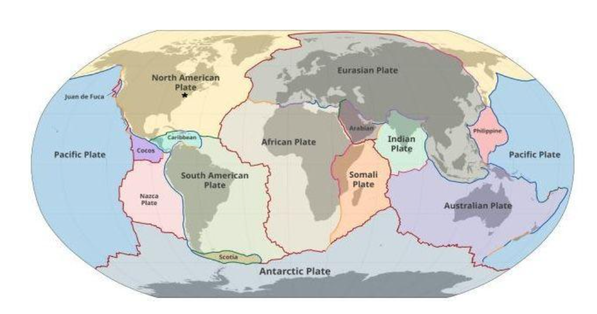

---

# Part 2: Video & Card Sort  <!--fit--->

---

# 2026.02.02 **Earth Science**

##### **❓ of the 📅**: What are two of your pet peeves?

#### 📋 Agenda

1. Finish Part 2 Model. Be Sure to include
    - Evidence from all of the investigations
    - Evidence from the maps and diagrams
    - An explanation of how evidence connects to seismic activity
2. Check Model with [Rubric](https://docs.google.com/document/d/1FI9UUIBk9Xv1kLSeKn2PC_GbLYjhwTIfRl_VEgAjv8g/edit?tab=t.0)

### 🎯 Goals

🥅 _Model Seismic Activity with Plate Tectonics_

---

# 2026.01.30 **Earth Science**

##### **❓ of the 📅**: What luxury is totally worth the price?

 

#### 📋 Agenda

1. Present Updated Models
2. Plate Tectonic Theory

### 🎯 Goals

🥅 __

### 📆 Upcoming

---

# Some Key 🔑 Ideas:

- Earthquakes and volcanic activity happen when plates collide
- In these areas, it appears that one plate goes underneath another one, and earthquakes form there
- On the surface, there are mountains and volcanoes
- Continental crust is the oldest, probably because it is furthest from the midocean ridges but hasn’t collided yet

---

# Reminder: 

## _We are looking for areas that are most at risk for tectonic activty and its associated natural distasters (i.e. earthquakes, volcanoes, and tsunamis)_

---

# 📖 Read Part 1 <!--fit--->

---

# How mountain ranges are formed at convergent plate boundaries <!--fit--->

<iframe width="1100" height="515" src="https://www.youtube.com/embed/r9Uu-Gp2ztg?si=LxqOzy49AtN7FTRU" title="YouTube video player" frameborder="0" allow="accelerometer; autoplay; clipboard-write; encrypted-media; gyroscope; picture-in-picture; web-share" referrerpolicy="strict-origin-when-cross-origin" allowfullscreen></iframe>

---

# [📺 Birth of a Tsunami](https://ny.pbslearningmedia.org/resource/nvkq.vid.earth.tsunami/birth-of-a-tsunami/) <!--fit--->

---

# [📺 Plate Tectonics and Volcanoes | The Next Pompeii](https://ny.pbslearningmedia.org/resource/nvtnp-sci-volcanotectonics/plate-tectonics-and-volcanoes-the-next-pompeii/) <!--fit--->

---

# 🤔 How do these theories connect to the evidence you've seen so far? <!--fit--->

## Complete _Part 1_ 

## and 

## Class Discuss

---

# Part 2 

## Work _individually_. When everyone in your group finishes compare answers. Put your combined answers on a whiteboard

---

# Key Points 🔑

* Earthquakes occur at all types of plate boundaries.  
* Volcanoes form and erupt at oceanic-continental convergent plate boundaries.  
* This further confirms ideas about the earthquake-volcanic eruption phenomenon in Iceland we observed during the Engage phase and volcanic eruptions we have observed during the unit launch, like Krakatoa.  
* Mountains form at convergent plate boundaries.  
* Mid-ocean ridges, like the Mid-Atlantic Ridge where Iceland is located, form at divergent oceanic-oceanic plate boundaries.  

---

# Key Points 🔑

* Tsunamis are caused by volcano collapses, underwater volcanic eruption, or plates slipping. This helps us explain the occurrence of tsunamis in the unit launch, like the Japan and Krakatoa tsunamis.  
* Mountains form at convergent plate boundaries  
* The amount of time it takes for surface features to form and hazards to occur is directly associated with the time scale of the process that causes them.  
* Some of these phenomena happen very slowly and some happen very suddenly.  

---

# Key Points 🔑

* Surface features can disappear or change form, but natural hazards are not reversible.  
* When an oceanic plate converges with a continental plate the oceanic plate goes underneath because it is more dense.  
* Volcanoes form at divergent plate boundaries because when the plates move apart, the heat from Earth (magma) which has a lot of pressure built up is like a pressure cooker and is able to come up to the surface.

---

# 2026.01.29 **Earth Science**

##### **❓ of the 📅**: What is your go to take out order? 🍟🍕🥢🍣🍔🍗

 

#### 📋 Agenda

1. 👀🤔💭 Finish through see-think-wonder from yesterday
2. Discuss Findings
    - remember to have _evidence_ for your claims
3. Draw Model on whiteboard
    - cite evidence (page number or simulation resource)

### 🎯 Goals

🥅 _Model Continental Crust Boundaries_

### 📆 Upcoming

---

# 2026.01.28 **Earth Science**

##### **❓ of the 📅**: Should you eat rice with a fork, a spoon or chopsticks?

 

#### 📋 Agenda

0. [Plate Motion Simulator](https://sepup.lawrencehallofscience.org/geology-unit-plate-boundaries/)
1. Present Model Summaries
2. Summary Task
3. _Continental Seismic Activity_
    - Complete Parts 1-4
    - Whole Class Summary (Share out 👀🤔💭)

### 🎯 Goals

🥅 _Model Tectonic Plate Movement_

### 📆 Upcoming

---

# Discussion & Models <!--fit--->

---

# Key Points 🔑

* Empirical evidence from radiometric dating tells us that ocean crust is youngest along mid-ocean ridges and gets older as you look further away from those ridges  
* Measuring the rate of change of the sea floor gives us evidence that new crust is being formed very slowly  
* That evidence supports the idea that plates are moving away from each other at these areas, and that new crust is being formed in between, very slowly  
* Empirical evidence shows that earthquakes happen along mid-ocean ridges  

---

# Key Points 🔑 (continued)
* The earthquakes that happen under Iceland, which is on the Atlantic mid-ocean ridge, are shallow and distributed evenly across the ridge.  
* That evidence supports the idea that there is a shallow space between the two sides of the mid-ocean ridge  
* The evidence shows that there is a lot of volcanic activity in Iceland  
* That evidence supports the idea that magma can rise in the space between the two sides of the mid-ocean ridge, which could form the new crust in that area

---

# 2026.01.27 **Earth Science**

##### **❓ of the 📅**: If you could make _one_ chore disappear, what would it be?

 

#### 📋 Agenda

1. What explains the patterns in the age of the ocean floor?
    - Read paragraph & discuss with group -> construct model
    - Draw model on whiteboard & answer 3 questions
2. Summary Task

### 🎯 Goals

🥅 _Model ocean plates_

### 📆 Upcoming

---

# 2026.01.23 **Earth Science**

##### **❓ of the 📅**: Who is your celebrity crush?

 

#### 📋 Agenda

1. Finish Part 3 
2. Part 4 & _Making Sense of the Seimic Activity in the Ocean_ 👀, 🤔, 💭
3. Class Share Out: _**What do you think is happening in these areas that is creating the patterns you observed?**_

### 🎯 Goals

🥅 _Model the sea floor seismic activity_

### 📆 Upcoming

---

# 2026.01.22 **Earth Science**

##### **❓ of the 📅**: What's the most ***unusual*** thing you've ever eaten?

 

#### 📋 Agenda

1. Global Patterns of Seismic Activity
2. Seismic Activity in the Ocean

### 🎯 Goals

🥅 _Model what is happening with seismic activity in the ocean 🌊_

### 📆 Upcoming

- Quiz Corrections for $\frac{1}{2}$ points back due 1/23 -> Must stay after to go over your corrections with me. 

---

# 2026.01.16 **Earth Science**

##### **❓ of the 📅**: If you could go to the Olympics, what sport would you want to do?

 

#### 📋 Agenda

0. Hand Back Quizzes (_finally_)
    - Corrections available
1. Present Models to Class
2. Regents Practice Questions
    - ✏️ Answer 
    - 👀 Check Answers
    - 🤔 Ask Questions

### 🎯 Goals

🥅 _Summarize and Practice with Earth's Interior_

### 📆 Upcoming

- Quiz Corrections for $\frac{1}{2}$ points back due 1/23 -> Must stay after to go over your corrections with me. 

---

# 2026.01.15 **Earth Science**

##### **❓ of the 📅**: Would you rather always be slightly late or super early?    

 

#### 📋 Agenda

1. How do materials move to create new islands (pages 33-39)
2. Consensus meeting: share out on how rocks and minerals rearrange themselves in the crust and mantle of Earth
3. _Who is at **risk**?_

### 🎯 Goals

🥅 _odel & describe how rocks change and move near the surface of the Earth_

### 📆 Upcoming

---

# 2026.01.14 **Earth Science**

##### **❓ of the 📅**: ***If you could redesign the human body, what one improvement would you make?***

 

#### 📋 Agenda

1. How do materials move to create new islands (pages 33-39)
2. Consensus meeting: share out on how rocks and minerals rearrange themselves in the crust and mantle of Earth

### 🎯 Goals

🥅 _Model & describe how rocks change and move near the surface of the Earth_

### 📆 Upcoming

---

# Where did Krakatoa’s new islands come from?

- The new islands formed after Krakatoa erupted came from the upper parts of Earth: the crust and the mantle.
- The crust and mantle are made of rock—and rock is usually solid.
- For new islands to appear, some of that rock had to melt into magma, move, and then solidify again near the surface.

_We will be looking at the details of this process today_

---

# Reference Table Charts <!--fit--->

---

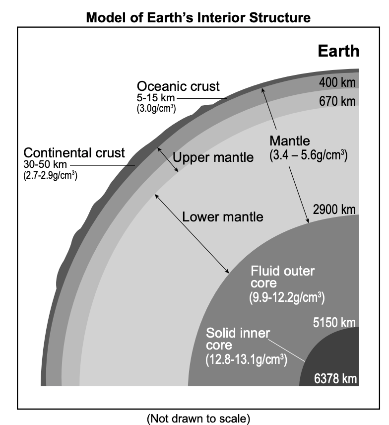

## Page 11 - Model of Earth's Interior 

---

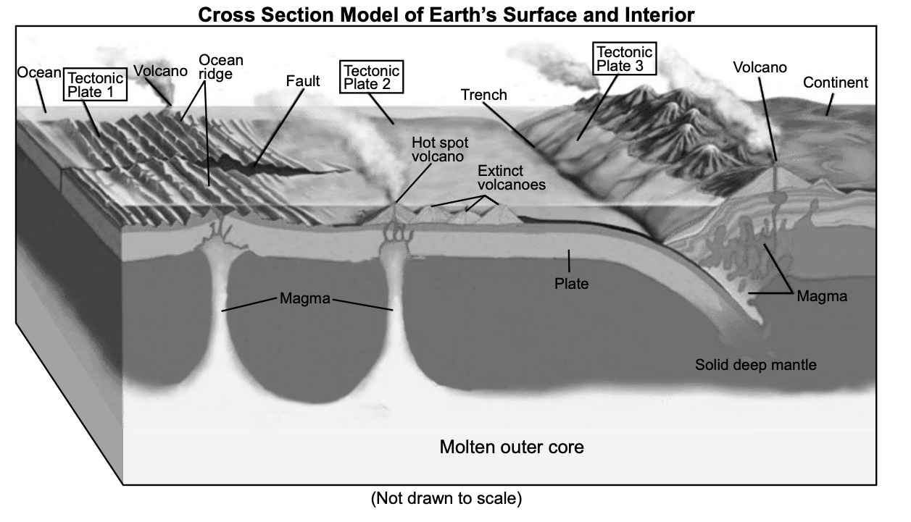

Page 11 - Cross Section of Earth's Surface and Interior

---

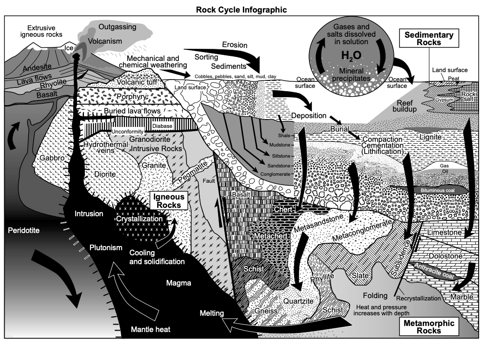

Page 14 - Rock Cycle

---

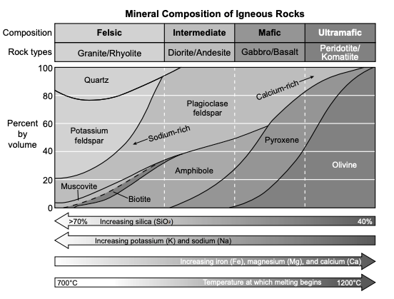

Page 13 - Mineral Composition of Igneous Rocks

---

# 2026.01.13 **Earth Science**

##### **❓ of the 📅**: You **_have_** to sing karaoke, what song do you pick? 🎤

 

#### 📋 Agenda

0. Discuss Layers from Yesterday
1. Explaining Krakatoa
    - Complete Part 1
    - Discuss
    - Part 2
    - CER
2. How do materials move to create new islands?

### 🎯 Goals

🥅 __

### 📆 Upcoming

---

# CER - Krakatoa

## On a whiteboard...

- ### **Claim**: where did the new islands come for?

- ### **Evidence**: what is evidence for your claim?

- ### **Reasoning**: what scientific principles, or ideas from Earth's layers support your evidence?

---

# 2026.01.12 **Earth Science**

##### **❓ of the 📅**: Who would you haunt if you had to be a ghost 👻?

 

#### 📋 Agenda

1. Finish Magnets Experiment and Follow Up Questions
2. Discuss Results as a class
    - Update Model of Earth

### 🎯 Goals

🥅 _Update our model of Earth's Layers_

### 📆 Upcoming

---

# Layers of Earth

## 🗣️ Discuss as a Lab group

- Your see-think-wonder; what are some important ideas
- How can you update your model of Earth's layers based on the rock cards and magnets exploration?

## 🖊️ Whiteboard:

✅ One Important Idea 

✅ Your updated model of earth

**_Be prepared to share your model and important idea_**

---

# 2026.01.08 **Earth Science**

##### **❓ of the 📅**: If you could live anywhere, where would it be?

 

#### 📋 Agenda

1. Rock Sorting - What are layers made of?
2. Magnetic Earth

### 🎯 Goals

🥅 _Model Earth's Interior_

### 📆 Upcoming

---

# 2026.01.08 **Earth Science**

##### **❓ of the 📅**: _If you found that food was falling from the sky, what food would you want to be falling? What food would you **NOT** want to be falling?_

 

#### 📋 Agenda

1. Finish Questions & Whiteboard Model
2. Consensus Discussion on our Models
3. Summary Task Reflection
4. Sorting Earth's Layers

### 🎯 Goals

🥅 _Model Earth's Interior_

### 📆 Upcoming

---

# Consensus Meeting 

1. We select a few different groups’ ideas.
2. The first group shares out their work.
3. One person repeats or reiterates what the first group shared.
4. Class members ask clarifying questions about the work.

Repeat steps 2-4 for each group that is sharing work.

5. Everyone confers in table groups.
6. Engage in whole-class discussion about the ideas that were shared, in order to come to agreement.

<!---
Pause the discussion and ask for clarification, particularly of the following key points:

- There are different parts to the interior of the Earth
- Not all earthquake waves can travel through the different parts of the Earth
- Based on our observations we know that P-waves and S-waves can only travel through certain materials
- Knowing this allows us to determine the state of matter of each of the sections of - Earth’s interior (solid outside layers and a liquid core)
- There are at least 3 layers in Earth

--->

---

# 🔑 Key Points 

- There are different parts to the interior of the Earth
- Not all earthquake waves can travel through the different parts of the Earth
- Based on our observations we know that P-waves and S-waves can only travel through certain materials
- Knowing this allows us to determine the state of matter of each of the sections of - Earth’s interior (solid outside layers and a liquid core)
- There are at least 3 layers in Earth

---

# Summary Task <!--fit---> 

---

# What is the composition of Earth's Interior Layers?

1. Organize Rock and Mineral Cards
2. Look at rock samples

---

# 2026.01.07 **Earth Science**

##### **❓ of the 📅**: What second rate super power would you want?

 

#### 📋 Agenda

1. Finish Density Column See-think-wonder
2. [P Wave vs. S Wave](../../../Presentations/ES%20Presentations/Unit%203%20Earth's%20Interior/EarthInterior.html)
3. Developing a Model of Earth's Interior

### 🎯 Goals

🥅 _Model the Earth's Interior_

### 📆 Upcoming

---

# 2026.01.06 **Earth Science**

##### **❓ of the 📅**: What secrets do you think your pet 🐕 🐶 🐈 🐱 would spill about you, if they could talk? 🐟 🦜 🐍 🐸 🐮 🐄 🐖 🐐 🐔

 

#### 📋 Agenda

1. Finish Earthquake Simulation & Discuss as class
2. Density column videos
3. [P Wave vs. S Wave](../../../Presentations/ES%20Presentations/Unit%203%20Earth's%20Interior/EarthInterior.html)
4. Forming a model

### 🎯 Goals

🥅 _Use information from Earthquakes and their waves to model Earth's Interior_

### 📆 Upcoming

---

# 2026.01.05 **Earth Science**

##### **❓ of the 📅**: Do you have New Year's Resolution?

 

#### 📋 Agenda

0. New Seats
1. [Earth's Interior](../../../Presentations/ES%20Presentations/Unit%203%20Earth's%20Interior/EarthInterior.html)

### 🎯 Goals

🥅 _Model Earth's Interior_

### 📆 Upcoming

---

<!--- class: christmas--->

# 2025.12.19 **Earth Science**

##### **❓ of the 📅**: What cookies are you leaving for Santa :santa:?

#### 📋 Agenda

1. Hand in any labs you haven't finished or are missing in the gradebook
2. Options:
    - Finish Work You Owe
    - Color
    - Play a board game

### 🎯 Goals

🥅 _Have a nice break!_

### 📆 Upcoming

- Vacation 🏂 ❄️ 🏀 🎄 🕎

**No devices unless you are completing school work.**

---

# 2025.12.17 **Earth Science**

##### **❓ of the 📅**: What is your family tradition over the holidays?

 

#### 📋 Agenda

1. Whiteboard Summary - Dating & The Big Bang
2. Practice Regents Questions on Canvas

### 🎯 Goals

🥅 _Review for Quiz Tomorrow_

### 📆 Upcoming

- Quiz tomorrow

---

# Whiteboard Summary:

- What do we need to know about **relative dating**, **absolute dating**, the **Big Bang Theory** and associated ideas?
    - What are the **BIG IDEAS**?
    - What are some *important details*?
        - i.e. what is evidence supporting the BBT?
- Use words and pictures
- Don't just copy your notes - lots of words isn't great, try to summarize and simplify.

<mark>_⚠️ Do this first **without** any notes for **10 Minutes**. Then review your notes and add to your board_<mark/>

---

# 2025.12.16 **Earth Science**

##### **❓ of the 📅**: What is the best gift that you have **given**?

 

#### 📋 Agenda

1. Calculating Redshift Lab

### 🎯 Goals

🥅 _Use mathematical models to measure and calculate the redshift and relative velocities of different galaxies_

### 📆 Upcoming

- Quiz **Thursday**

---

# 2025.12.15 **Earth Science**

##### **❓ of the 📅**: What is your favorite holiday song?

 

#### 📋 Agenda

1. Finish up packet
2. Big Bang & Absolute Dating Practice
    - Canvas: **Quiz Practice: BB, Dating**

### 🎯 Goals

🥅 _Practice Regents Questions_

### 📆 Upcoming

- Quiz *Thursday**
    - Big Bang, Relatie Dating, Absolute Dating

---

# 2025.12.12 **Regents Physics**

##### **❓ of the 📅**: Would you rather live in a floating city in the sky or an underwater city?

 

#### 📋 Agenda

1. Reading
2. Video
3. Part 3 & Computational Modeling
4. Part 4 & [Murmur of a Bang](https://imagine.gsfc.nasa.gov/educators/programs/cosmictimes/online_edition/1965/murmur.html)

### 🎯 Goals

🥅 _Develop an explanation for the beginning of the universe_

### 📆 Upcoming
- Quiz Thursday:
    - Dating (Abs & Relative)
    - Big Bang Theory

---

# 2025.12.11 **Earth Science**

##### **❓ of the 📅**: Would you rather be able to talk to animals or understand all human languages?

 

#### 📋 Agenda

1. If the universe is expanding...how did it start?
    - [Slides](../../../Presentations/ES%20Presentations/Unit%202/bigbang.html)

### 🎯 Goals

🥅 __

### 📆 Upcoming

---

# 2025.12.10 **Earth Science**

##### **❓ of the 📅**: Question

 

#### 📋 Agenda

0. Finish CER from yesterday
1. If the universe is expanding...how did it start?
    - [Slides](../../../Presentations/ES%20Presentations/Unit%202/bigbang.html)

### 🎯 Goals

🥅 _Discuss the model of the beginning of the universe_

### 📆 Upcoming

---

# 2025.12.09 **Earth Science**

##### **❓ of the 📅**: How often do you dance?

 

#### 📋 Agenda

1. Finish going through models 1-4
    - Model 2: [Sound Waves](https://phet.colorado.edu/sims/html/sound-waves/latest/sound-waves_all.html)
    - Use board for blocked link 4
4. CER (page 15) on whiteboard with lab table
5. Discuss as a class

### 🎯 Goals

🥅 _Use models of light and sound to determine if the Universe is expanding_

### 📆 Upcoming

---

# 2025.12.08 **Earth Science**

##### **❓ of the 📅**: What's the longest trip you've been on?d

 

#### 📋 Agenda

1. How many stars?
2. Exploring Light Spectra from other galaxies 

### 🎯 Goals

🥅 _Find patterns in light from other galaxies. Connect sound waves to light waves._

### 📆 Upcoming

---

# 2025.12.05 **Earth Science**

##### **❓ of the 📅**: What is your favorite holiday themed movie? Have you stared binging yet?

 

#### 📋 Agenda

1. Finish Correlation Lab
2. Relative Dating - Regents Practice Questions Practice - In Canvas 
3. Fin. 🏁

### 🎯 Goals

🥅 _Relative Dating Rock outcrops_

### 📆 Upcoming

---

# 2025.12.04 **Earth Science**

##### **❓ of the 📅**: What is your favorite type of cookie? 🍪

 

#### 📋 Agenda

1. Do Now: Work on Sequence of Events Lab
2. Discuss Correlation
3. Correlation Lab

### 🎯 Goals

🥅 _Model the sequence of events and relative age of bedrock_

### 📆 Upcoming

---

# 2025.12.03 **Earth Science**

##### **❓ of the 📅**: What would your talent be if you were Miss or Mister World?

 

#### 📋 Agenda

1. Review - Relative Dating
2. Sequence of Events Practice
3. Sequence of Events Labf

### 🎯 Goals

🥅 _Determine the sequence of events using relative dating_

### 📆 Upcoming

---

# 2025.12.01 **Earth Science**

##### **❓ of the 📅**: What won Thanksgiving?

 

#### 📋 Agenda

1. Do Now: Review whiteboard from Tuesdy and be prepared to present
2. [Relative Dating](../../../Presentations/ES%20Presentations/Unit%202/GeologicDating.html)
3. Sequence of Events Lab

### 🎯 Goals

🥅 _Identify the sequence of events using Relative Dating_

### 📆 Upcoming

---

<!--- class: thanksgiving -->

# 2025.11.25 **Earth Science**

##### **❓ of the 📅**: What is your favorite Thanksgiving Dessert?

 

#### 📋 Agenda

1. Do Now - Finish Part 2 Packet
2. Relative Dating [Notes](../../../Presentations/ES%20Presentations/Unit%202/GeologicDating.html)
2. Relative Dating Labs

### 🎯 Goals

🥅 _Learn about relative dating_

### 📆 Upcoming

---

# 2025.11.24 **Earth Science**

#### **❓ of the 📅**: What is the _MVF_ (most valuable food) on the Thanksgiving dinner table?

 

#### 📋 Agenda

1. Do Now - Finish Post Lab Practice Sheet
2. Unit 2 | Part 2 | (pages 11-18)

### 🎯 Goals

🥅 _Determine the age of the inner solar system with radiometric dating_

### 📆 Upcoming

---

# 2025.11.21 **Earth Science**

##### **❓ of the 📅**: What was the last movie you went to? What did you think?

 

#### 📋 Agenda

1. Do Now - Continue & Finish Candium Lab
2. Radioactive Dating Practice Sheet
3. Part 2: The Age of Rocks in the Solar system

### 🎯 Goals

🥅 _Model Radiometric Dating with Candium_

### 📆 Upcoming

---

# 2025.11.20 **Earth Science** Do Now

Based on the simulation from yesterday...

Describe what a half-life is in your own words. 

**Do this on your own <mark>without</mark> help of your neighbors**

---

# 2025.11.20 **Earth Science**

##### **❓ of the 📅**: If you were a photographer, what would you take photos of all day?

 

#### 📋 Agenda

1. Notes/Presentation on Radioactive Dating
2. Absolute Dating Lab - Candium

### 🎯 Goals

🥅 _Model radioactive dating_

### 📆 Upcoming

---

# 2025.11.19 **Earth Science** Do Now

Keep working on radio active dating

---

# 2025.11.19 **Earth Science**

###### **❓ of the 📅**: What was your favorite recess game from elementary school?

 

#### 📋 Agenda

1. Early Solar System Investigation; complete and discuss
    - Part 1a: Decay Rate
    - Part 1b: Dating Game
2. [Geologic Dating Notes](../../../Presentations/ES%20Presentations/Unit%202/GeologicDating.html)
3. Part 2: The age of rocks in the solar system

### 🎯 Goals

🥅 _Use relative and absolute dating to start looking at Earth's History_

### 📆 Upcoming

---

# Explore 1: Composition, Age, and Craters

## Guiding Question
What can the composition and age of rocks from objects in the solar system tell us about its past?

---

## Today’s Goals
- Collect and analyze data on rock ages, composition, and density from Earth, Moon, and other objects.
- Use evidence to explain why craters on other bodies remain stable but craters on Earth change.
- Prepare to model the early solar system.

---

## Materials and Resources
- Handout: Early Solar System Investigation.
- Online simulation: [Radioactive Dating Game (PhET)](https://phet.colorado.edu/en/simulations/radioactive-dating-game).
- Class routine: Domino Discover for whole-class synthesis.

---

## Part 1a — Radiometric Decay (Simulation)
Tasks:
- Explore decay of Carbon-14 and Uranium-238.
- Record half-life behavior and decay patterns.

Prompts:
- What patterns do you notice in how fast Carbon-14 changed? Uranium-238?
- How are their rates different, and why does that matter for dating?

---

## Part 1b — Relative Dating (Rock Layers)
Tasks:
- Examine fossil ages within layered rocks.
- Connect layer position to relative age.

Prompts:
- What pattern do you notice within the same layer?
- What pattern occurs as you go to lower layers?
- Which isotope is appropriate for different-aged samples—and why?

---

## Part 2 — Ages Across the Solar System
Tasks:
- Compare ages of minerals from Earth, Moon, Mars, meteorites.
- Note tectonic activity, water, atmosphere presence on different objects.

Prompts:
- What do ages suggest about formation timing of Earth and other objects?
- How might water/atmosphere/tectonics relate to crater counts we observe?

---

## Part 3 — Moon Impact Melt Rocks
Tasks:
- Analyze ages of impact melt rocks (3.75–4.0 billion years).

Prompts:
- What does this suggest about asteroid activity in the early solar system?
- How might similar impacts have affected Mars and Earth?

---

## See–Think–Wonder
- See: What do you notice in the age, composition, and decay data?
- Think: What do these patterns imply about solar system history?
- Wonder: What questions do these data raise about crater stability and change?

Complete your STW on the handout; be ready to share one key idea.

---

## Domino Discover (Whole-Class)
- Share one important idea from your group’s Summary.
- Listen for trends, inferences, and questions.
- Aim: Surface key evidence needed for tomorrow’s explanations.

<!---
Look & Listen For:
- C‑14 half-life ≈ 5,700 years; U‑238 half-life ≈ 4.5 billion years.
- Different isotopes for different age ranges (organic vs. very old rocks).
- Object ages cluster around ~4.40–4.59 BYA → formation window.
- Moon melt rocks 3.75–4.0 BYA → intense bombardment.
- Age alone doesn’t explain crater differences (Moon ≫ Mars ≥ Earth).
--->

---

# Explain 1: Age and the Heavy Bombardment

## Guiding Question
How old are the solar system and the impact craters?

---

## What We’ve Figured Out (Recap)
- Earth, Moon, and Mars formed around the same time (~4.5 BYA).
- Radiometric dating provides consistent ages across multiple bodies.
- Moon’s impact melt rocks date a major bombardment to ~4.0 BYA.
- Crater differences need more than “age” to explain them.

---

## Modeling Task (Triads)
Handout: Explaining the Craters in the Inner Solar System

Steps:
1) Answer the six guiding questions on page 1.
2) Read the short text; use Think–Talk–Open Exchange to compare evidence and claims.
3) Build a brief model of the early inner solar system and its impact history.

Optional context video:
- [The Late Heavy Bombardment](https://www.youtube.com/watch?v=NafhLy22DJQ)

---

## Discussion Prompts
- What evidence supports a Late Heavy Bombardment (~4.0 BYA)?
- If the Moon and Mars show many ancient craters, what should we infer about Earth?
- Where is Earth’s evidence—and why might it be missing from the surface?

---

## Class Consensus Discussion (Structure)
1) Select groups to share; a peer restates each share.
2) Class asks clarifying questions.
3) Confer in table groups; then whole-class consensus.

Focus:
- Link evidence to claims with clear scientific reasoning.
- Make ideas public and visible; elevate accurate explanations.

---

## Key Points to Make Public
- Oldest minerals across Earth/Moon/Mars/other objects ≈ **4.5 BYA** → co-formation from the same dust disk.
- The **Late Heavy Bombardment (~4.0 BYA)** evidenced by dated Moon melt rocks.
- Inner bodies (Mars, Venus) show craters; proximity implies Earth was bombarded too.
- Earth’s surface has changed (hydrologic + geologic processes), which can erase or alter ancient crater evidence.

---

## Summary Task (Individual)
- Write a short explanation: “What was the early solar system like, and what does the evidence suggest about Earth’s impact history?”
- Include:
  - Evidence (ages, isotopes, melt rock dates).
  - Reasoning (why this evidence supports your claim).
  - Clarify where Earth’s surface record may be incomplete and why.

---

---

# 2025.11.18 **Earth Science**

##### **❓ of the 📅**: If everyone in your family was a zoo animal, which animal would they all be?

 

#### 📋 Agenda

1. Do Now: Open Google Maps
	1. Canvas -> Unit 2 -> Resources -> Engage Links -> Open each in a new tab
2. Engage Crater Observations & Share Out
3. Start Radioactive dating

### 🎯 Goals

🥅 _Make observations and inferences about crater impacts on different planetary objects_

### 📆 Upcoming

---

## Engage: Craters and Earth's History

### Essential Questions
- Why do we see so many craters on the Moon and Mars, but not on Earth?
- How often have asteroids struck Earth in the past?

---

## Investigative Phenomenon

- On Earth, about **128** impact craters have been discovered.
- On **Mars**, there are **>300,000**.
- On the **Moon**, there are **>1,000,000**.

What do these differences suggest about stability and change in the solar system?

---

## Today’s Goal

- Examine images of **Mars**, the **Moon**, and **Earth**.
- Identify **patterns** in crater presence and appearance.
- Develop **initial claims** for why Earth shows fewer craters despite similar ages of oldest minerals.

---

## What You’ll Do

1. Individually complete a See–Think–Wonder using the handout:
   - See: What do you observe in the crater images for Mars, Moon, Earth?
   - Think: What patterns or ideas do these observations make you think of?
   - Wonder: What questions do you have about crater differences?

2. In groups, discuss and agree on **one important idea** to share.

3. Use the **Domino Discover** routine to surface class-wide trends.

---

## See–Think–Wonder: Guidance

- See:
  - Count and compare crater density, size, depth, and distribution.
  - Note surface features (erosion, water, atmosphere indicators).

- Think:
  - Consider possible reasons for differences across bodies.
  - Connect to **stability and change** of planetary surfaces.

- Wonder:
  - Ask about formation times, bombardment periods, and surface processes.

---

## Initial Claim (Draft)

- Write a brief **claim** answering:
  - “Why are there so few craters on Earth compared to Mars and the Moon?”

- Support with at least two **observations** from your See–Think–Wonder.

---

## Group Share: Domino Discover

- Each group shares their one key idea.
- Classmates:
  - Repeat/rephrase the idea for clarity.
  - Ask clarifying questions.
  - Note trends across groups.

Goal: Surface **patterns** and **questions** that set up our investigation.

<!---

## Look & Listen For

- “The Moon has almost 10,000× Earth’s craters and >3× Mars.”
- “Crater size/depth seem larger on Moon and Mars.”
- “Age alone may not explain differences—oldest minerals are similar (~4.4–4.6 BYA).”
- “Maybe Earth’s surface changes more over time.”

## Discussion Prompts

- If Mars, Earth, and the Moon formed around the same time,
  why does the Moon have so many more craters?
- If many asteroids hit the Moon ~3.75–4.0 BYA, what likely happened on Earth and Mars?
- What evidence could confirm or refute your claim?

--->

---

## Success Criteria

By the end of Engage, you can:
- Identify key **patterns** in crater data across bodies.
- State a defensible **initial claim** supported by observations.
- Pose **investigable questions** about Earth’s crater record.

---

## Setting Up the Next Step

Next, we will analyze the **age, composition, and density** of rocks from Earth, Moon, and other objects to test our claims and explore the solar system’s early history.

---

# 2025.11.17 **Earth Science**

##### **❓ of the 📅**: Would you rather be able to see microscopic things or distant galaxies with your naked eye?

 

#### 📋 Agenda

0. **DO NOW** Review your model with your lab group and be prepared to share
1. Present models to class
2. Driving Questions
3. Craters 

### 🎯 Goals

🥅 _Examine images of Mars, the Moon, and Earth._

🥅 _Identify patterns in crater presence and appearance._ 

### 📆 Upcoming

---

## Initial Explanation (Individual → Group)
Individually:
- Draft a model (words and/or diagram) for why intelligent life took so long to evolve on Earth
Include:
- Environmental constraints (atmosphere, energy sources)
- Biological innovations (complexity, nervous systems)
- External events (mass extinctions)
Then in groups:
- Combine ideas into one collaborative model

---

## Model Quality Checklist
Does your model:
- Identify key turning points and prerequisites for intelligence?
- Show cause/effect chains (not just a list)?
- Use labels, arrows, and annotations for clarity?
- Connect to Stability & Change (CCC7): What persisted vs. what shifted?

---

## Driving Question Board (DQB)
Individually:
- Write 3–5 specific questions needed to explain “why did it take so long?”
- One question per sticky note
As a class:
- Share, sort, and categorize on chart paper or digital board
- Create umbrella questions for each category

---

## Conferring Prompts (DQB)
- Why do these questions belong together?
- What category connects them?
- Are we missing sub-questions?
- Can we formulate an umbrella question for each cluster?

---

## Engage: Craters and Earth's History

### Essential Questions
- Why do we see so many craters on the Moon and Mars, but not on Earth?
- How often have asteroids struck Earth in the past?

---

## Investigative Phenomenon

- On Earth, about **128** impact craters have been discovered.
- On **Mars**, there are **>300,000**.
- On the **Moon**, there are **>1,000,000**.

What do these differences suggest about stability and change in the solar system?

---

## Today’s Goal

- Examine images of **Mars**, the **Moon**, and **Earth**.
- Identify **patterns** in crater presence and appearance.
- Develop **initial claims** for why Earth shows fewer craters despite similar ages of oldest minerals.

---

## What You’ll Do

1. Individually complete a See–Think–Wonder using the handout:
   - See: What do you observe in the crater images for Mars, Moon, Earth?
   - Think: What patterns or ideas do these observations make you think of?
   - Wonder: What questions do you have about crater differences?

2. In groups, discuss and agree on **one important idea** to share.

3. Use the **Domino Discover** routine to surface class-wide trends.

---

## See–Think–Wonder: Guidance

- See:
  - Count and compare crater density, size, depth, and distribution.
  - Note surface features (erosion, water, atmosphere indicators).

- Think:
  - Consider possible reasons for differences across bodies.
  - Connect to **stability and change** of planetary surfaces.

- Wonder:
  - Ask about formation times, bombardment periods, and surface processes.

---

## Initial Claim (Draft)

- Write a brief **claim** answering:
  - “Why are there so few craters on Earth compared to Mars and the Moon?”

- Support with at least two **observations** from your See–Think–Wonder.

---

## Group Share: Domino Discover

- Each group shares their one key idea.
- Classmates:
  - Repeat/rephrase the idea for clarity.
  - Ask clarifying questions.
  - Note trends across groups.

Goal: Surface **patterns** and **questions** that set up our investigation.

<!---

## Look & Listen For

- “The Moon has almost 10,000× Earth’s craters and >3× Mars.”
- “Crater size/depth seem larger on Moon and Mars.”
- “Age alone may not explain differences—oldest minerals are similar (~4.4–4.6 BYA).”
- “Maybe Earth’s surface changes more over time.”

## Discussion Prompts

- If Mars, Earth, and the Moon formed around the same time,
  why does the Moon have so many more craters?
- If many asteroids hit the Moon ~3.75–4.0 BYA, what likely happened on Earth and Mars?
- What evidence could confirm or refute your claim?

--->

---

## Success Criteria

By the end of Engage, you can:
- Identify key **patterns** in crater data across bodies.
- State a defensible **initial claim** supported by observations.
- Pose **investigable questions** about Earth’s crater record.

---

## Setting Up the Next Step

Next, we will analyze the **age, composition, and density** of rocks from Earth, Moon, and other objects to test our claims and explore the solar system’s early history.

---

# 2025.12.14 **Earth Science**

##### **❓ of the 📅**: If you could safely travel at the speed of light, where would you go first?

 

#### 📋 Agenda

1. Do Now - Finish PTO Asnwers
2. Discuss Answers
3. Read through PTO and ask clarifying questions
4. Driving Question Board
5. Craters

### 🎯 Goals

🥅 _Look for driving questions about life outside of earth_

### 📆 Upcoming

---

## Group Synthesis: Tell the Story
In table groups:
- Share circled details; look for overlaps and disagreements
- Decide on the most important ideas (limit 5–7)
- Write your “story of the phenomenon” with:
  - Sequence of events
  - Causes and effects
  - Stability and change (what stayed consistent vs. what shifted)
- Optional: labeled diagram with arrows/annotations

---

## Performance Task: Preview
You will:
- Explain why modern humans emerged after ~4.5 billion years and five mass extinctions
- Make and defend an argument:
  - Does life exist elsewhere?
  - Does intelligent life exist elsewhere?
  - Why haven’t we made contact?
  - What can humans learn from these ideas?

---

# 2025.11.13 **Earth Science** Do Now

1. Have you ever wondered about whether life exists somewhere outside of Earth?
2. Do you believe life exists somewhere outside of Earth? Why?
3. Do you think we will ever find life on other planets or communicate with other intelligent life?

---

# 2025.11.13 **Earth Science**

##### **❓ of the 📅**: Do you believe in Aliens?

 

#### 📋 Agenda

1. Do Now
2. Do Aliens Exist?
3. Evolution of Life on Earth

### 🎯 Goals

🥅 __

### 📆 Upcoming

---

# Do Aliens Exist?

<iframe width="1000" height="615" src="https://www.youtube.com/embed/r904HcfQoqM?si=BKvFjamxvlRuzcIT" title="YouTube video player" frameborder="0" allow="accelerometer; autoplay; clipboard-write; encrypted-media; gyroscope; picture-in-picture; web-share" referrerpolicy="strict-origin-when-cross-origin" allowfullscreen></iframe>

---

# Astrobiology

<iframe width="1160" height="615" src="https://www.youtube.com/embed/3HN_zx4JJfM?si=kyfufCR-cbRB0kBO" title="YouTube video player" frameborder="0" allow="accelerometer; autoplay; clipboard-write; encrypted-media; gyroscope; picture-in-picture; web-share" referrerpolicy="strict-origin-when-cross-origin" allowfullscreen></iframe>

---

## Evolution of Life on Earth  

**Directions:**

1. Silently read or watch the “text” provided to you.  
2. Record or annotate three details that are most important to the phenomenon being described for each text.  
3. Share with your group. Each person should identify the details that they circled.  
4. Discuss as a group, and determine the overall story. What is the phenomenon?

---

## **Are We Alone?**

Does life exist somewhere outside of Earth? What about life that has technology and can communicate like humans?

4.5 billion years passed and 5 mass extinctions occurred before humans appeared on Earth. So far we have yet to come in contact with any other beings from another planet or even find evidence that proves any sort of life exists elsewhere.

---

## So are we alone?

Your task in this unit is to work with classmates to investigate some factors that influence the evolution of life on Earth and explain why modern human's emergence on Earth required nearly 4.5 billion years. Then use your findings to make and defend an argument about the probability of  intelligent life existing somewhere outside Earth.

---

## Developing an Initial Explanation 

   
**What set of conditions allowed for the evolution of humans on Earth, and why did it take so long?**

Your first step in this investigation is to consider details from the Tell the Story texts and work with classmates to develop an initial model that illustrates your group's ideas about why it took so long for humans to appear on Earth.

---

# 🤔 Driving Questions 🚗

Develop questions you have in order to figure out what was required for intelligent life to evolve on Earth and why did it take so long. 

- Each question goes on a separate sticky note.
- Put them on your whiteboard
- Organize them

---

# 2025.11.12 **Earth Science** Do Now

1. Take out Performance Organizer Task Packet
1. What is one positive contribution you can make today to this class or your classmates?

---

# 2025.11.12 **Earth Science**

##### **❓ of the 📅**: Vacation on the beach or adventure in the mountains? 🏖️ ⛰️

 

#### 📋 Agenda

1. Finish Performance Organizer Task Packet -> Find Earth 2.0

### 🎯 Goals

🥅 _Finish PTO_

### 📆 Upcoming

- Tests back tomorrow to go over

---

# 2025.11.10 **Earth Science** Do Now

**Without asking a friend, or looking at your notes...** Write down on a whiteboard:

1. What is the fuel for the sun?
2. What are Kepler's 3 Laws
3. What are the stages in the lifecycle a sun-like star?

---

# 2025.11.10 **Earth Science**

##### **❓ of the 📅**: Cranberry Sauce? Yey or Ney? Homemade or Canned?

 

#### 📋 Agenda

1. Kepler's Mathematical Relationship
2. Orbits Packet - Explain 2 and Drawing Orbits
3. Finish Performance Task Packet

### 🎯 Goals

🥅 _Model habitable planets based on mathematical relationshios of orbits_

### 📆 Upcoming

---

# 2025.11.08 **Earth Science** Do Now

1. Hand in all Astronomy Packets:  
    - Kepler's Law
    - Sun
    - Stellar Evolution
    - Orbits (don't worry about it being incomplete)

---

# 2025.11.06 **Earth Science**

##### **❓ of the 📅**: If you could have dinner with 1 person (past or present), who would it be?

 

#### 📋 Agenda

1. Finding Earth 2.0 - Finish Performance Task Packet

### 🎯 Goals

🥅 _Find Earth 2.0_

### 📆 Upcoming

---

# 2025.11.04 **Earth Science** Do Now

1. Find a partner
2. Go to a *vertical whiteboard* space (rolling boards, cabinet, front whiteboard, curved wall)
3. Get a few (2-4) markers and an eraser
3. Erase your board
4. Wait patiently for your next set of instructions

---

# 2025.11.04 **Earth Science**

##### **❓ of the 📅**: What is your favorite holiday?

 

#### 📋 Agenda

1. Whiteboard Summary Board
2. Continue Posted Test Review  

### 🎯 Goals

🥅 _Review for Test_

### 📆 Upcoming

- Test tomorrow

---

# Whiteboard Summary:

- What do we need to know about **the sun**, **stellar life cycle**, and **Kepler's Laws**?
    - What are the **BIG IDEAS**?
    - What are some *important details*?
- Use words and pictures
- Don't just copy your notes - lots of words isn't great, try to summarize and simplify.

<mark>_⚠️ Do this first **without** any notes. Then review your notes and add to your board_<mark/>

---

# 2025.11.03 **Earth Science**

##### **❓ of the 📅**: What came first? The chicken or the egg?

 

### 📋 Agenda

0. **Do now**: Hand in Kepler's Law Lab
1. Finish State Lab Part II & Hand in _both_ parts
2. Review Assignment for test   

### 🎯 Goals

🥅 _Finish State Lab_

🥅 _Review for Test on Wednesday_

### 📆 Upcoming

- Test **Wednesday 11/5**

---

<!--- class: halloween --->

# **2025.10.31** Earth Science 👻 🎃 

##### **❓ of the 📅**: What are you dressing up as for Halloween? OR what was your all time favorite costume?

 

#### 📋 Agenda

1. Complete Part 1 of State Lab with your Partner
2. Complete Part 2 of Lab - Individually

### 🎯 Goals

🥅 _Complete State Lab_

### 📆 Upcoming

- Astronomy Test Next **Wednesday 11/5**
    - We will review Monday & Tuesday

---

# 2025.10.30 **Earth Science**

##### **❓ of the 📅**: Trick or treating or handing out candy?

 

#### 📋 Agenda

1. Review Kepler's Law
2. Kepler Triangulation Demonstration & Practice
3. Lab Partners & Start Lab

### 🎯 Goals

🥅 _Complete **Unearthing Mars** Lab_

### 📆 Upcoming

- Astronomy Test Next **Wednesday 11/5**
    - We will review Monday & Tuesday

---

# 2025.10.29 **Earth Science**

##### **❓ of the 📅**: Crunchy or chewy candy?

 

#### 📋 Agenda

1. Finish Kepler's Laws Assignment
2. Review Kepler's Laws
3. Ellipse & Kepler Practice    

### 🎯 Goals

🥅 _Define all three of Kepler's Laws_

### 📆 Upcoming
- State Lab Tomorrow & Friday
- Astronomy Test Next Wednesday 11/5
    - We will review Monday & Tuesday

---

# Kepler’s Third Law: 

### Period–Distance Relationship

_For objects orbiting the same star, the square of the period (T) is proportional to the cube of the semi-major axis (a) ($T^2 \propto a^3$)._

---

# Kepler’s Second Law: 

### Equal Areas in Equal Times

_A planet sweeps out equal areas in equal time intervals._

- Consequences:
    - Fastest at **periapsis** (closest approach).
    - Slowest at **apoapsis** (furthest point).
- Vocabulary:
    - **Periapsis/Apoapsis** (general).
    - Around the Sun: perihelion/aphelion.
    - Around Earth: perigee/apogee.

---

# Kepler’s First Law: 

### Orbits are Ellipses

_Planets orbit the Sun in ellipses with the Sun at one focus._

- Key terms:
    - **Semi-major axis (a)**: half of the longest diameter of the ellipse.
    - **Foci**: two special points whose sum of distances to any point on the ellipse is constant.
    - **Eccentricity (e)**: how “stretched” an ellipse is (0: circle; near 1: very elongated).

$$\boxed{\text{Eccentricity} = \frac{\text{distance between foci}}{\text{length of major axis}}}$$

---

# 2025.10.28 **Earth Science**

##### **❓ of the 📅**: What is your Halloween costume this year?

 

#### 📋 Agenda

1. Finish 3rd Law Simulation & Discuss 
2. Finish 2nd Law Simulation & Discuss

### 🎯 Goals

🥅 _Define Kepler's 2nd Law_

🥅 _Define Kepler's 3rd Law_

### 📆 Upcoming

- State Lab **Thursday**
    - Reschedule any lessons, try not to be absent...

---

# Which Jack-o-lantern is your favorite?

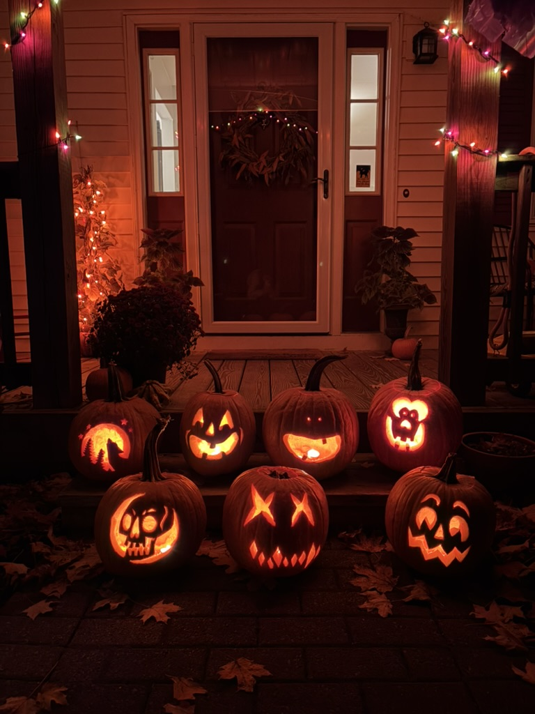

---

# 2025.10.27 **Earth Science**

##### **❓ of the 📅**: What superhero power would be the best to have?

 

#### 📋 Agenda

1. Go Over Kepler's First Law
2. Continue with Simulation Lab

### 🎯 Goals

🥅 _Define Kepler's First Law_

### 📆 Upcoming

- State Lab **Thursday**
    - Reschedule any lessons, try not to be absent...

---

# Kepler’s First Law: 

### Orbits are Ellipses

_Planets orbit the Sun in ellipses with the Sun at one focus._

- Key terms:
    - **Semi-major axis (a)**: half of the longest diameter of the ellipse.
    - **Foci**: two special points whose sum of distances to any point on the ellipse is constant.
    - **Eccentricity (e)**: how “stretched” an ellipse is (0: circle; near 1: very elongated).

$$\boxed{\text{Eccentricity} = \frac{\text{distance between foci}}{\text{length of major axis}}}$$

---

<!--- _class: light--->

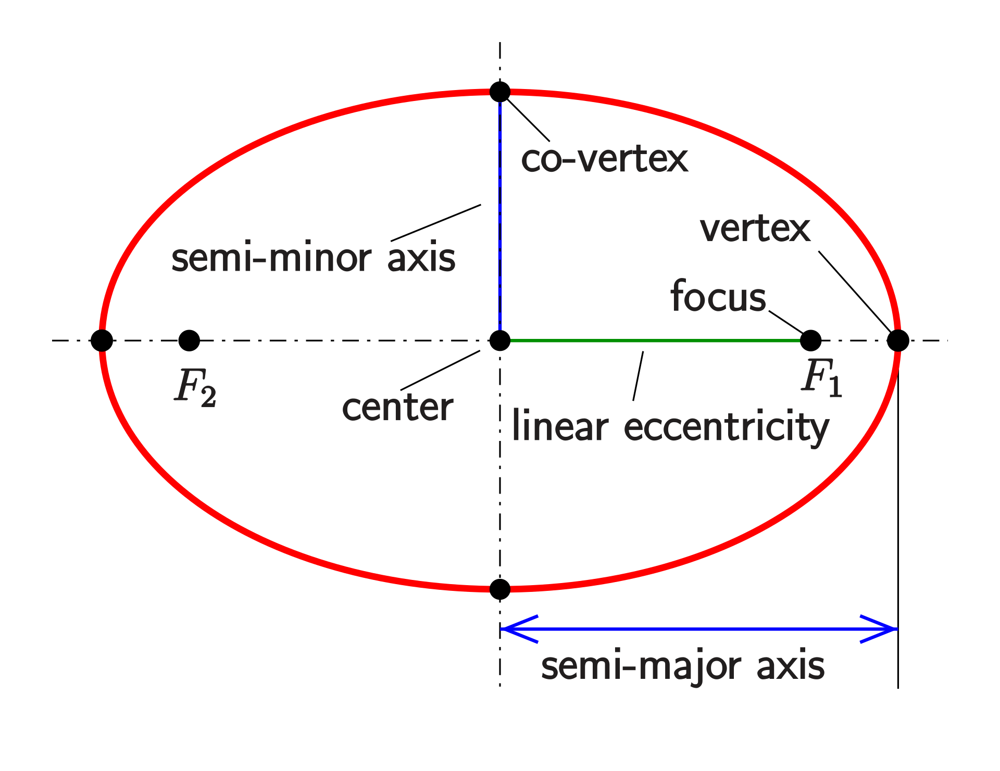
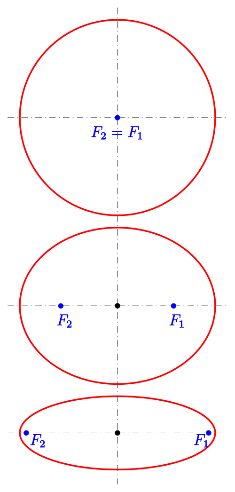

---

# 2025.1024 **Earth Science**

##### **❓ of the 📅**: Which animal would be the scariest if it was super-sized?

 

#### 📋 Agenda

1. Kepler's Laws Simulation Lab

### 🎯 Goals

🥅 _Model planetary motion with Kepler's Laws_

### 📆 Upcoming

---

# 2025.10.23 **Earth Science**

##### **❓ of the 📅**: If you were a pirate, what would your pirate name be? 🏴‍☠️🦜

 

#### 📋 Agenda

1. Kepler's Law Simulation Demo
1. Prelab
2. Kepler's First Law
2. Continue...

### 🎯 Goals

🥅 _Explore Kepler's Law with a computational model_

### 📆 Upcoming

---

# 2025.10.22 **Earth Science**

##### **❓ of the 📅**: If you could only eat one meal for the rest of your life, what would it be?

 

#### 📋 Agenda

1. Graphing Orbits
    - Graph & Look for Patterns
    - Complete See-Think-Wonder _**indvidually**_
    - Domino Discover
2. Kepler's Laws Simulation Labs
3. Developing Our Orbit Models

### 🎯 Goals

🥅 _Finding patterns describing orbits in the solar system_

### 📆 Upcoming

---

# Patterns:

* What patterns do you see in the relationship between the phase of water on solar system objects and their average distance from the Sun?  
* What pattern do you see in the minimum and maximum distance from the Sun?  
* What patterns do you see in the relationship between an object’s average distance from the Sun and orbital period?  
* Do all objects in the solar system fit that pattern?  
* Which patterns or exceptions to patterns in the data that could help us explain the Comet Borrelly investigative phenomenon?
---

# 2025.10.21 **Earth Science**

##### **❓ of the 📅**: If you had to be a villain from a movie, which movie would you pick?

 

#### 📋 Agenda

1. Comets
2. Orbital Data

### 🎯 Goals

🥅 _Look for patterns in orbital data_

### 📆 Upcoming

- Star PTO Due Wednesday (Pages 14-19)

---

# [Comet Lemmon](https://apod.nasa.gov/apod/ap250930.html) 

_Closest Approach to Earth is **TONIGHT**_

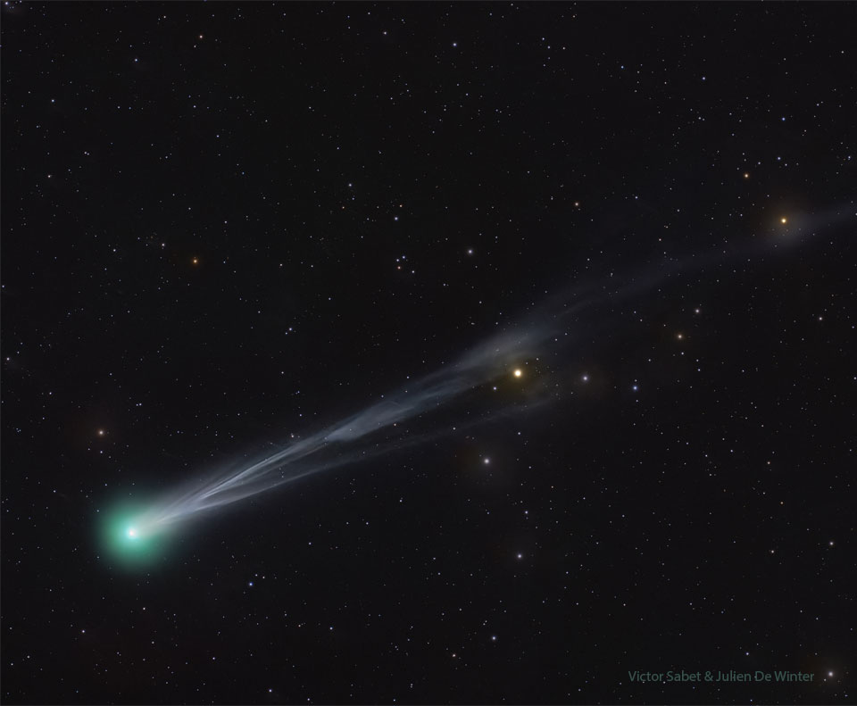

---

---

<video width= "1200" controls src="videosasteroidsVideo-Comet-Borrelly-Flyby-020429.webm" title="Title"></video>

---

# What makes a comet different than other objects in our solar system?

---

# Water in our solar system

- Identify 3-5 details that are important in telling the story about water in our solar system

---

# Analyzing data 

| Celestial Object | Average Distance from the Sun1 (AU) | Period of Revolution (Earth years) | Minimum Distance from Sun (AU) | Maximum Distance from Sun (AU) | Phase of majority of water |
| :---: | :---: | :---: | :---: | :---: | :---: |
| Mercury | .387 | .241 | 0.307 | 0.467 | vapor |
| Venus | .723 | .615 | 0.718 | 0.728 | vapor |
| Earth | 1.00 | 1 | 0.983 | 1.017 | liquid |
| Mars | 1.523 | 1.88 | 1.381 | 1.666 | ice |
| Comet Borrelly | 3.590 | 6.80 | 1.350 | 5.830 | Ice, but a great deal vaporizes every several years |
| Europa (Jupiter’s moon) | 5.203 | 11.87 | 4.950 | 5.459 | Ice layer at surface, with liquid water ocean underneath |
| Mimas (Saturn’s moon) | 9.539 | 29.46 | 9.041 | 10.124 |  |
| Uranus | 19.185 | 84.03 | 18.324 | 20.078 | ice |
| Neptune | 30.061 | 164.82 | 29.709 | 30.386 | ice |
| Pluto | 39.479 | 248.06 | 29.658 | 49.304 | ice |

---

# Graphical Analysis

1. https://graphicalanalysis.app/
2. Manual Entry
3. Fill out data in data table (just number columns)
4. Make graphs to look for trends and patterns

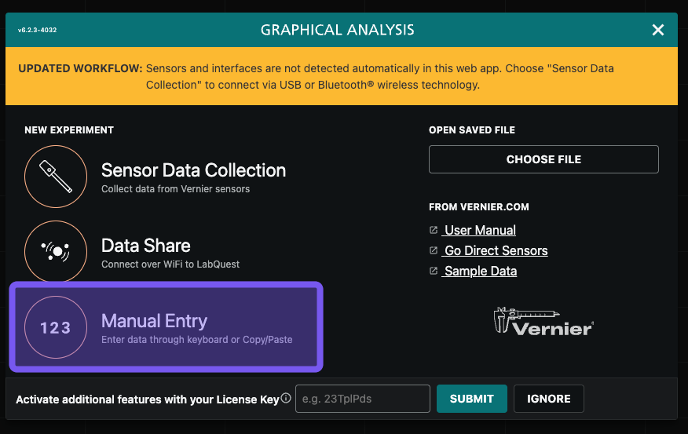
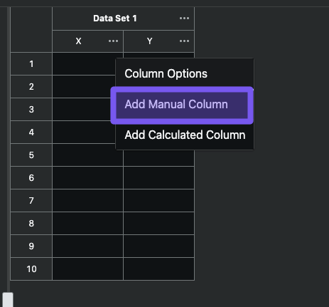

---

# 2025.10.20 **Earth Science**

##### **❓ of the 📅**: What is your ideal sandwich? 🥪

 

#### 📋 Agenda

1. Finish Quiz
2. Earth 2.0 - Update Model
3. Start Orbits

### 🎯 Goals

🥅 _Finish Quiz_

🥅 _Start Orbits_

### 📆 Upcoming

- Star PTO Due Wednesday (Pages 14-19)

---

# 2025.10.17 **Regents Earth Science**

##### **❓ of the 📅**: Does pineapple belong on a pizza? 🍍 

 

#### 📋 Agenda

1. Quiz
2. Earth 2.0 Task

### 🎯 Goals

🥅 _Crush your quiz 💪_

### 📆 Upcoming

---

# 2025.10.16 **Earth Science**

##### **❓ of the 📅**: Would you rather discover that witches, vampires, or werewolves were real?

 

#### 📋 Agenda

1. ⏲️ 10 Minutes - Finish Questions about Fe26
2. Discuss Rates of Fusion
3. Nucleosynthesis
4. Stellar Evolution Whiteboard 
5. Star Life Cycle Performance Task

### 🎯 Goals

🥅 _Create final model of stellar evolution_

### 📆 Upcoming

- Stellar Evolution Quiz tomorrow

---

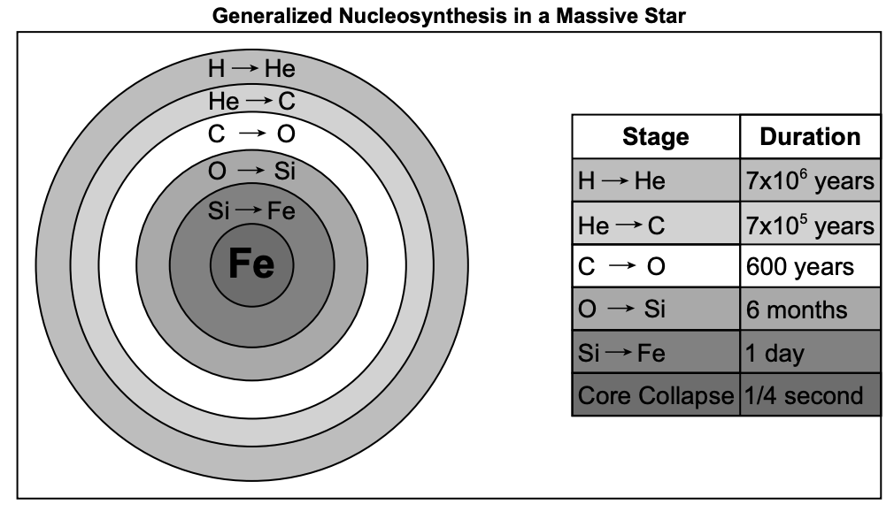

---

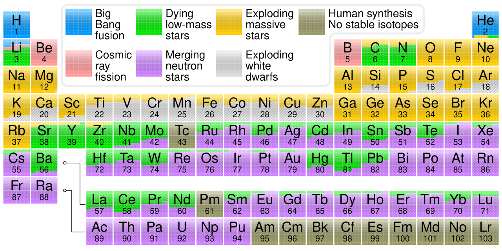

---

# Stellar Evolution Model

1. Create a model to represent the life cycle of stars. 
2. Make a claim about the best type & stage of star we should look for to support life on Earth
    - support this claim with evidence from your model
3. Use the rubric in your packet to guide your model
4. Be prepared to share out your model

---

# 2025.10.15 **Earth Science**

##### **❓ of the 📅**: If you could make up a new rule, what would it be?

 

#### 📋 Agenda

1. Finish Fe26 Simulation Experiment
    - Share out results
2. Create Stellar Evolution Model on Whiteboard (see rubric to help guide your model)

### 🎯 Goals

🥅 _Model Stellar Evolution_

### 📆 Upcoming

- Stellar Evolution Quiz **Friday**

---

# 2025.10.14 **Earth Science**

##### **❓ of the 📅**: Favorite season? 🍂❄️🌞💮

 

#### 📋 Agenda

1. Share out fusion vs. gravity whiteboards
2. Elaborate: Why do the lifetimes vary -> elaborating on fusion
3. Create a Stellar Evolution Model

### 🎯 Goals

🥅 _Finish modeling stellar evolution_

### 📆 Upcoming

- Quiz **Friday** 

---

# Share Out

Share out board and consider:

1. Why do more massive stars die faster than less massive stars?
2. How does the rate of star death relate to luminosity of a star (amount of energy released per second)?
3. What factors lead to a star’s stability or instability? Why is it important to understand how long a star is stable and when it might change?
4. What did you learn from the How the Sun Works investigation that you needed to know in order to explain what causes some stars to be stable and some stars to change?

---

# 2025.10.10 **Earth Science**

##### **❓ of the 📅**: What's your favorite classic Halloween monster?

 

#### 📋 Agenda

1. Review gravity/fusion balance
2. Rewatch video
3. Finish labeling forces
    - Do this on a whiteboard with your lab group **BEFORE** you put it into your packet

### 🎯 Goals

🥅 _Explain the balance of fusion vs. gravity in stars_

### 📆 Upcoming

- Star quiz at the **end** of next week

---

# Consensus Discussion <!--fit--->

---

# 2025.10.09 **Earth Science**

##### **❓ of the 📅**: Pumpkin flavored or apple flavored?

 

#### 📋 Agenda

1. Share See-Think-Wonder 
2. HR Diagram Extension
3. Forces in a star

### 🎯 Goals

🥅 _Identify stars based on the HR Diagram_

🥅 _Explain forces in a star_

### 📆 Upcoming

---

# Hertzsprung-Russell Diagram (HR Diagram)

---

# Star Formation

<iframe width="1000" height="700" src="https://www.youtube.com/embed/YbdwTwB8jtc?si=Y24opNIdT7SP6SXl" title="YouTube video player" frameborder="0" allow="accelerometer; autoplay; clipboard-write; encrypted-media; gyroscope; picture-in-picture; web-share" referrerpolicy="strict-origin-when-cross-origin" allowfullscreen></iframe>

---

# 2025.10.08 **Earth Science**

##### **❓ of the 📅**: Do you believe in ghosts? 👻

 

#### 📋 Agenda

1. Answer Questions about Graph (see photos in next slides)
    - _can access these through Canvas on the homepage_
2. HR Diagram Extension

### 🎯 Goals

🥅 _Use the HR Diagram to describe the life cycle of stars_

### 📆 Upcoming

---

---

---

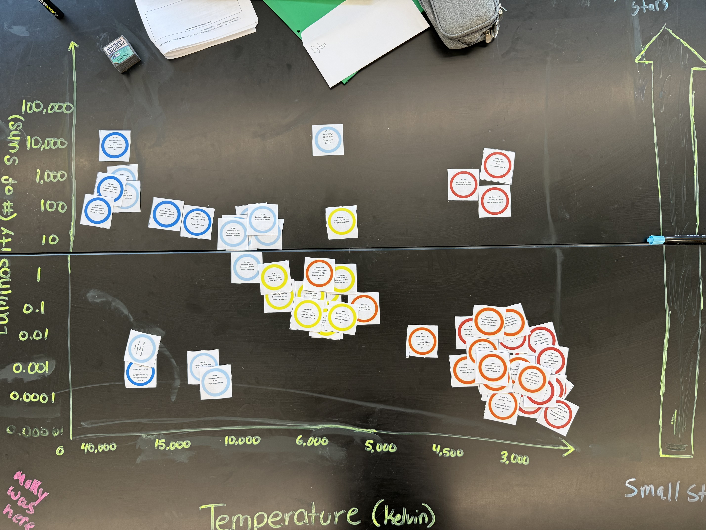

---

---

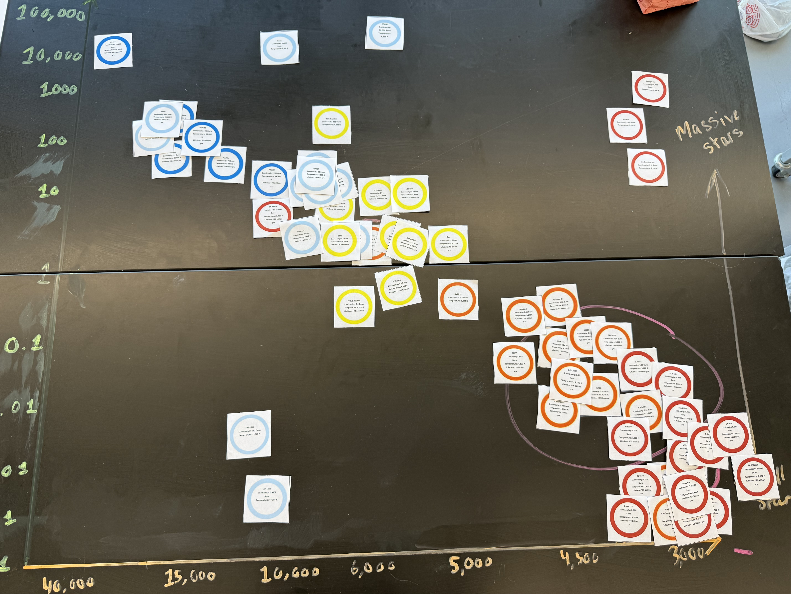

---

# 2025.10.07 **Earth Science**

##### **❓ of the 📅**: Do you like scary movies? What is your favorite?

 

#### 📋 Agenda

1. Star Sort & Graphing
2. See-think-wonder
3. Class consensus
4. HR Diagram Extension

### 🎯 Goals

🥅 _Model the HR Diagram_

### 📆 Upcoming

---

# Investigate:

- How can we determine star mass from ***observable*** properties?
- We will be creating a static model of the star in a box simulation

---

# Instructions

1. Plot your stars based on their data
2. Look for patterns & connections based one graph

## Investigate:

- How can we determine star mass from ***observable*** properties?
- We will be creating a static model of the star in a box simulation

---

# Consensus Questions 

### **1. What properties in stars allow us to make predictions about their life span and stability?**

### **2. What kind of stars live the longest and most stable lives?**

---

# 2025.10.06 **Earth Science**

##### **❓ of the 📅**: Candy Corn: yay or nay?

 

#### 📋 Agenda

1. 👀🤔💭 See-think-wonder share out
2. Stellar Evolution Diagram -> Review answers & discuss
3. Stellar Evolution Practice - Finish for homework

### 🎯 Goals

🥅 _Discuss and define stellar evolution_

### 📆 Upcoming

- Finish Stellar Evolution Practice Questions

---

# 2025.10.03 **Earth Science**

##### **❓ of the 📅**: WYR go to a Haunted House or a Corn Maze?

 

#### 📋 Agenda

1. Finish Star in a Box Data
2. See Think Wonder
3. Class Share
4. Group Star Graphing Activity

### 🎯 Goals

🥅 _Look for patterns in stellar life cycle_

🥅 _Look at star property patterns_

### 📆 Upcoming

---

---

# 🎃 2025.10.02 **Earth Science** 👻

##### **❓ of the 📅**: What is your favorite halloween candy? 🍬🍫🍭

 

#### 📋 Agenda

1. Discuss Life Cycle Mass Grouping
2. Stellar Life Cycle Data Collection - Star In a Box

### 🎯 Goals

🥅 _Collect data on star life cycles using the Star in a box simulation_

### 📆 Upcoming

---

<!--- class: twilight --->

# 2025.10.01 **Earth Science**

##### **❓ of the 📅**: Cake or Pie? 🍰🥧 

 

#### 📋 Agenda

1. Finish Supernova 1054
1. [Star In A Box](https://starinabox.lco.global/)
2. Explore:
    - _look for evidence of patterns in the relationship between star mass and stability and change in stars_

### 🎯 Goals

🥅 _use a **computational model**_

🥅 _find **evidence** of **patterns_**

🥅 _use mass to **explain** <mark>stability</mark> and change in stars_

### 📆 Upcoming

---

# 2025.09.30 **Earth Science**

##### **❓ of the 📅**: Should you bite or lick your ice cream? 🍨 🍦

 

#### 📋 Agenda

1. Finish Performance Task Organizer Questions
2. Supernova 1054
3. What do we need to know about the life and death of stars to find an Earth-like planet?

### 🎯 Goals

🥅 _Generate Questions about the life span of stars_

### 📆 Upcoming

---

# 2025.09.29 **Earth Science**

##### **❓ of the 📅**: Would you rather watch a movie on your TV at home or on the big screen in the theater, and why?

 

#### 📋 Agenda

1. How much fuel does the sun have? What will happen when it runs out of hydrogen?
2. Update Earth 2.0 Model
3. Supernova 1054
4. [Life Span of a Star](../../../Presentations/ES%20Presentations/Unit%201%20Origin/starLifeCycles.html)

### 🎯 Goals

🥅 _Look into the life span of a star_

### 📆 Upcoming

---

# 2025.09.26 **Earth Science**

##### **❓ of the 📅**: What is your favorite road trip snack?

 

#### 📋 Agenda

1. Finish Chemical Rx vs. Nuclear Card Sort
2. Consensus Sort as a class
3. Write CER on Chem vs. Nuclear
4. Update Habitable Model in PTO Packet

### 🎯 Goals

🥅 _Determine fuel source of the sun_

### 📆 Upcoming

---

# 2025.09.25 **Earth Science**

##### **❓ of the 📅**: What is your favorite family vacation?

 

#### 📋 Agenda

1. Card Sort - Summarization of CER
2. How does the Sun release energy?
    - Cart sort #2 

### 🎯 Goals

🥅 __

### 📆 Upcoming

---

# 2025.09.24 **Earth Science**

##### **❓ of the 📅**: If you could do anything you wanted today, what would you do?

 

#### 📋 Agenda

1. Whiteboard CER -- what elements make up the sun
2. Present CER & Come to a class consensus
3. Reflect on first consensus activity

### 🎯 Goals

🥅 _Determine what elements make up the sun_

### 📆 Upcoming

---

# Board Meeting Procedures
1. Each group shares CER
2. What is similar about all of the boards?
3. What is different amongst the boards?
4. Can we come to a consensus about what elements compose the sun? 
    -> Be sure to provide evidence of this

---

# 2025.09.23 **Earth Science**

##### **❓ of the 📅**: What is the worst food?

 

#### 📋 Agenda

1. Spectrascopy & The Sun
2. Elements of the Sun

### 🎯 Goals

🥅 _Explore the spectra of the sun_

---

# 2025.09.22 **Earth Science**

##### **❓ of the 📅**: If you were to open a store, what would you sell?

 

#### 📋 Agenda

1. The Sun - where does all of this energy come from?  
    - [Sun Slides](../../../Presentations/ES%20Presentations/Unit%201%20Origin/thesun.html)

### 🎯 Goals

🥅 _Explore and analyze the sun_

### 📆 Upcoming

---

# 2025.09.19 **Earth Science**

##### **❓ of the 📅**: Would you rather be a superhero or super villain?

 

#### 📋 Agenda

1. Share out Earth Models
2. Analyzing Earth Data: _How do we survive?_
3. Exploring the Performance Task
    - What do we do?
4. The Sun

### 🎯 Goals

🥅 _Model what makes Earth Habitable_

### 📆 Upcoming

---

# 2025.09.18 **Earth Science**

##### **❓ of the 📅**: What animal do you think is the creepiest?

 

#### 📋 Agenda

1. Share out ideas to save the world
2. Exploring Data

### 🎯 Goals

🥅 __

### 📆 Upcoming

---

# 2025.09.17 **Earth Science**

##### **❓ of the 📅**: Would you rather live in the ocean 🌊 or on the moon 🌔?

 

#### 📋 Agenda

1. Hand in Graphs CER
2. 🚀 Discovering [New Worlds](../../../Presentations/ES%20Presentations/Unit%201%20Origin/originOfUniverse.html)

### 🎯 Goals

🥅 _What sustains life?_

### 📆 Upcoming

---

# 2025.09.16 **Earth Science**

##### **❓ of the 📅**: What's the best pizza topping? 🍕

 

#### 📋 Agenda

1. Finish CER Worksheet
2. Whiteboard and Present Assigned Graph

### 🎯 Goals

🥅 _Make scientific arguments from graphical data_

### 📆 Upcoming

---

# 2025.09.15 **Earth Science**

##### **❓ of the 📅**: What is the proper length of a playlist?

 

#### 📋 Agenda

1. CER Graph Practice
2. Discuss

### 🎯 Goals

🥅 _Make scientific arguments about graphs_

### 📆 Upcoming

---

# 2025.09.12 **Earth Science**

##### **❓ of the 📅**: What is the best fry shape? 🍟

 

#### 📋 Agenda

1. Present CER on Metric Olympics
2. Real-life data and CER practice

### 🎯 Goals

🥅 _Make scientific arguments from data and graphs_

### 📆 Upcoming

---

# 2025.09.11 **Earth Science**

##### **❓ of the 📅**: Does a week start on Sunday or Monday?

 

#### 📋 Agenda

1. CER: Soup, Salad, or Sandwich
2. CER Argument for Metric Olympics
3. CER Graph Practice

### 🎯 Goals

🥅 _Make a scientific argument using CER model_

### 📆 Upcoming

---

# CER (Claim, Evidence, Reasoning)

* ### Claim:
    * Sentence that answers the question.

* ### Evidence:
    * Explanation of how the evidence supports the claim.
        * Should include details!
        * Refer back to the question, include any data, diagrams, or graphs.

* ### Reasoning:
    * Science principle, such as an equation, law, or definition.
        * This is general, do no include specific details.

---

# Game: Soup, Salad, or Sandwich

1. Make a Claim-Evidence-Reasoning statement arguing whether the shown food is a soup, salad, or a sandwich. 

---

---

---

---

# Metric Olympic Presentations

## Claim

What is one thing you can conclude from your graph?

## Evidence

How does you graph support/show what you concluded?

## Reasoning

What is the science or big idea that support your evidence

---

# Claim-Evidence-Reasoning Example

**Claim**: Strong hurricanes start with greatest wind speeds. 

**Evidence**: On the graph the Major Hurricane initial wind speed > Weak hurricane > Tropical storm

**Reasoning**: Hurricanes are in part rated by their windspeed. 

---

# Metric Olympic Presentations

## Claim

What is one thing you can conclude from your graph?

## Evidence

How does you graph support/show what you concluded?

## Reasoning

What is the science or big idea that support your evidence?

---

# 2025.09.10 **Earth Science**

##### **❓ of the 📅**: Would you rather be the hero or the sidekick?

 

#### 📋 Agenda

1. Finish Graphs
2. Whiteboard your graph
3. Present a finding from your graph

### 🎯 Goals

🥅 _Interpret and analyze graphs_

### 📆 Homework:

- Get safety contract signed in ***ParentSquare***

---

# 2025.09.09 **Earth Science**

##### **❓ of the 📅**: Is it OK to ask the genie for infinite wishes?

 

#### 📋 Agenda

1. Finish last two stations to collect data
2. Discuss how to make histogram
3. Release them to graph
4. Work on graphing practice

### 🎯 Goals

🥅 _Practice Graphing_

### 📆 Upcoming

- Look for safety contract in Parent Square

---

# 2025.09.08 **Earth Science**

##### **❓ of the 📅**: Do you think it would be easier to give up sugar or technology?

 

#### 📋 Agenda

1. Finish Collecting Metric Olympics Data
    - If you are waiting for the next station you should be graphing

### 🎯 Goals

🥅 _Collect **ALL** of our data_

### 📆 Upcoming

- Safety Contracts

---

# 2025.09.05 **Earth Science**

##### **❓ of the 📅**: Would you rather vacation in Hawaii or Alaska?

 

#### 📋 Agenda

1. Question of the Day
2. Survival Island Share Out
3. Graphing Notes
3. [Measurement Olympics](../../../Presentations/ES%20Presentations/ESGraphing/Slides/esGraphing.html)

### 🎯 Goals

🥅 _Collaborate with Peers_

🥅 _Collect & Graph Data_   

### 📆 Upcoming

- ☑️ HW: Signed Safety Contracts

---

# Board Meeting -  **Survival Island**

### Rules 📝

1. 👂 Listen 
2. 🗣️ Speak Clearly
3. ❔ Ask Questions
4. 🤔 Seek to understand
5. 👉 Refer to your board and use **evidence**
6. 🌟 Come to consensus

 

### Goals 🎯

1. Practice Presenting to Class
    - speaking clearly
    - listening intently
2. Learn how to come to class consensus
    - What does the *majority* of the data show?
3. Create a culture of learning from each other

---

# Measurement Olympics <!--fit--->

# 🏃 🏋️ 🏊 🌬️  🥇 <!--fit--->

---

# Measurement Events <!--fit--->

## Event 1: Long Jump 🏃

## Event 2: Reaction Time ⏱️ 

## Event 3: Lung Capacity 🌬️

## Event 4: Cool Down 🧊 🌡️

---

# Station 1: Long Jump 🏃

## Compare student's height to their average long jump

1. Measure your height
2. Measure three long jumps
3. Calculate your average jump 
4. Record in **class data table** on Canvas

---

# Station 2: Reaction Time ⏱️

## Make a bar graph representing each group members average reaction time for their dominant and non-dominant hand 

1. Hold ruler above your partners hand, and *without warning* drop the ruler. Your partner should catch the ruler. 
2. Use the calculator in the group spreadsheet to convert the distance the ruler fell into a time
3. Record 3 trials for your dominant and non-dominant hand. Average the times. 
4. Make your bar graph

---

# Station 4: Lung Capacity 🌬️

## Make a histogram of balloon cirumferences that we can inflate the balloons to with **one breath**

1. Get **your own balloon** -- YOU ONLY GET 1 BALLOON 
2. Take a big breath and inflate the balloon as much as you can with 1 exhale. 
3. Pinch the balloon so no air comes out. 
4. Tie it, or hold it while partner measures the **maximum** circumference of the balloon. 
4. Record in the class data table in the class spreadsheet. 

---

# Station 4: Cool Down 🧊 🌡️

## Compare the cooling rate of water when different number of ice cubes are added to water. 

1. Fill each beaker in your group up the same amount using the tap water.
2. Add in different amounts of ice cubes according to the data table. 
3. Record the temperature each minute for 10 minutes 
4. Graph each cups temperature on the graph. 

---

# 2024.09.05 **Earth Science** 

##### **❓ of the 📅**: Sweet or savory for breakfast?

#### 📋 Agenda

0. Sit Anywhere (For Now)
    - you will move later
1. Do Now (fill out questionnaire & card)
2. Question of the Day
3. Grouping Game
4. Survival Island

### 🎯 Goals 

🥅 _Introductions_

🥅 _Classroom Culture_

### 🏠 Homework

- Signed Safety Contract

---

# Do **Now** 

1. Fill out index card:
    1. Name
    2. Phone number to reach your parents/guardians if you sleep through the Regents exam
    3. Favorite Candy
    4. Favorite Emoji
    5. Emoji the describes your current mood
2. Fill out Paper Quesionnaire

---

# Lab Grouping Game

- There are 15 of you
- Based on your cards get into ***LOGICAL*** groups of ***3***
- Check **whole class** answer with Mr. Porter
    - 4 Chances to Check
- Reorganize if necessary

(Yes this is the game Connections)

---

# Answers  <!--fit-->

---

# Answers 

- **States of Matter**: Gas, Liquid, Solid
- **Energy**: Juice, Spirit, Vigor
- **Classical Elements**: Air, Fire, Water
- **Things with Rings**: Circus, Saturn, Tree
- **Desserts**: Pie, Cake, Cobbler

---

# Survival Island 🌴

1. Share your *survival skill* that **you wrote down** with your group
2. Using ***everyone's skill*** develop a plan to survive or escape the deserted island
3. On your whiteboard present your plan (drawing, mind map, set of instructions)
    - Highlight everyone's skill
4. Share Plan to the class
