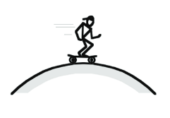
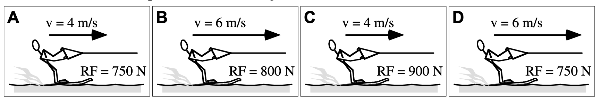
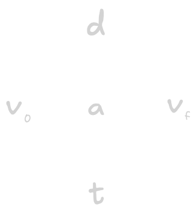
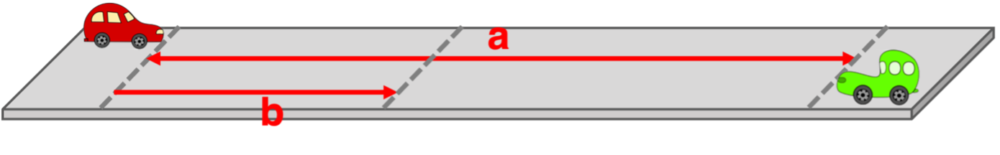

# Regents Physics 🔭 <!---fit--->

# **2025-2026** Agendas

## 👨‍🏫 Mr. Porter

---

# 2026.04.20 **Regents Physics**

##### **❓ of the 📅**: If animals could talk, which one do you think would be the most annoying?

 

#### 📋 Agenda

1. Practice Regents Questions -> 57-58, 66-67, 78-82
2. Electric Potential Difference Notes
	1. Drawing Comparison to Gravity
3. Electrostatics - Potential Practice Questions

### 🎯 Goals

🥅 _Define Electric Potential_

### 📆 Upcoming

- Electrostatics Quiz Friday:
    - Conservation of Change
    - Coulomb's Law
    - Electric Field
    - Electric Potential

---

# 2026.04.17 **Regents Physics**

##### **❓ of the 📅**: What song is stuck in your head?

 

#### 📋 Agenda

0. Regents Practice
1. Charged Parallel Plates
2. Electric Potential Difference

### 🎯 Goals

🥅 __

### 📆 Upcoming

---

#  **2026.04.16** Regents Physics  

##### **❓ of the 📅**: Would you rather have unlimited battery life on all of your devices or have free WiFi wherever you go?

 

#### 📋 Agenda

1. Regents Review -> 2025 p. 2-3
2. Electric Field Notes
3. Electric Field Practice
    - Think Sheet
    - Regents
    - Electric Field Hockey

### 🎯 Goals

🥅 _Discuss Electric Field_

### 📆 Upcoming

---

# 2026.04.14 **Regents Physics**

##### **❓ of the 📅**: What would be on your ultimate ice cream sundae? 🍨 

 

#### 📋 Agenda

1. Do Now
2. Mapping the Electic Field
2. Electric Field Notes
3. Electric Field Practice      

### 🎯 Goals

🥅 _Define and calculate electric field_

### 📆 Upcoming

---

# 2026.04.02 **Regents Physics**

##### **❓ of the 📅**: If you were a super-hero, what powers would you have?

 

#### 📋 Agenda

1. Coulomb's Law -> What did we find in the pivot
2. Coulomb's Law Practice

### 🎯 Goals

🥅 _Define and apply Coulomb's Law_

### 📆 Upcoming

---

# 2026.04.02 **Regents Physics**

##### **❓ of the 📅**: Do you collect anything?

 

#### 📋 Agenda

1. Finish Pivots
2. Coulomb's Law

### 🎯 Goals

🥅 _Define Coulomb's Law_

### 📆 Upcoming

---

# 2026.03.31 **Regents Physics**

##### **❓ of the 📅**: Is cereal a type of soup?

 

#### 📋 Agenda

1. Pivots - Coulomb's Law
    - Distance vs. Force
    - Charge vs. Force

### 🎯 Goals

🥅 _Experimentally determine Coulomb's Law_

### 📆 Upcoming

---

# 2026.03.30 **Regents Physics**

##### **❓ of the 📅**: What small pleasure makes you ridiculously happy?

 

#### 📋 Agenda

1. Review Charge Notes
1. Notes - How to Charge
2. van de graaf
3. Charge Practice

### 🎯 Goals

🥅 _Practice with conservation of charge_

🥅 _Convert between elementary charge and Coulombs_

### 📆 Upcoming

---

# 2026.03.27 **Regents Physics**

##### **❓ of the 📅**: How many pairs of shoes do you own?

 

#### 📋 Agenda

1. Momentum Quiz
2. Finish Sticky Tape Lab
3. Weekend.

### 🎯 Goals

🥅 _Momentum quiz_

### 📆 Upcoming

---

# 2026.03.25 **Regents Physics**

##### **❓ of the 📅**: Who do you think is the best superhero? 🦸 🦸‍♀️

 

#### 📋 Agenda

1. Sticky Tape Lab

### 🎯 Goals

🥅 _Explore charged objects_

### 📆 Upcoming

- Momentum Quiz Friday (Juniors - schedule a make up with me)

---

# 2026.03.24 **Regents Physics**

##### **❓ of the 📅**: If you had a pet parrot, what would you want it to say? 🦜

 

#### 📋 Agenda

1. Regents Practice - Momentum
2. Start Static Electricity - [Notes](../../../Presentations/RP%20Static%20Electricity/staticE2026.html)

### 🎯 Goals

🥅 _Practice momentum_

🥅 _Introduce Static Electricity_

### 📆 Upcoming

---

# 2026.03.23 **Regents Physics**

##### **❓ of the 📅**: Would you rather travel back in time to meet your meet your ancestors or to the future to meet your descendants?

 

#### 📋 Agenda

1. Review Momentum Conservation (Puppy problem)
2. Work through packet with tabel
3. Whiteboard & present assigned question

### 🎯 Goals

🥅 _Quantitatively solve conservation of momentum questions_

### 📆 Upcoming

- Momentum Quiz Friday

---

# 2026.03.19 **Regents Physic**

##### **❓ of the 📅**: What is one song you know all of the words to?

 

#### 📋 Agenda

1. Do Now: Work on your physics classroom (⏲️ 30 Minutes)
2. Think Sheet: _Action-Reaction and Momentum Conservation_ (p. 7)
3. Conservation of Momentum Introduction
4. Practice with momentum conservation

### 🎯 Goals

🥅 _Practice Impulse_

🥅 _Introduce momentum conservation_

### 📆 Upcoming

---

# 2026.03.18 **Regents Physics**

##### **❓ of the 📅**: If you could have dinner with anyone in the world, who would it be?

 

#### 📋 Agenda

1. Final tests and adjustments for paper car
2. Crash Test Paper cars
3. Finish lab notebook
4. Impulse Physics Classroom work

### 🎯 Goals

🥅 _Crash Test Cars & Practice with Impulse & Momentum_

### 📆 Upcoming

---

# 2026.03.17 **Regents Physics**   

##### **❓ of the 📅**: Would you rather be able to see the past or the future when you touch an object?

 

#### 📋 Agenda

1. Paper Car Project
    - Finish Building
    - Test down ramp
    - Measure speed
2. Document work in lab notebook

### 🎯 Goals

🥅 _Build & Test Paper Car_

### 📆 Upcoming
- Paper Car Crash Testing Tomorrow! Save the egg 🥚

---

# 2026.03.12 **Regents Physics**

##### **❓ of the 📅**: Blue 🟦 or Red 🟥 for Hoops vs. Hunger?

 

#### 📋 Agenda

1. Paper Car Crash [Introduction](../../../Presentations/Momentum/talks/paper_car_crash_slides.html)
2. Paper Car Crash Design and begin building

### 🎯 Goals

🥅 _Build a crash test device_

### 📆 Upcoming

---

# 2026.03.11 **Regents Physics**

##### **❓ of the 📅**: What celebrity would you switch lives with?

 

#### 📋 Agenda

1. Do Now -> Physics Classroom -> Case Studies: Impulse and Force
2. Discuss
3. Think Sheet pages 5-6

### 🎯 Goals

🥅 _Practice with the impulse-momentum theorem_

### 📆 Upcoming

---

# 2026.03.10 **Regents Physics**

##### **❓ of the 📅**: If you invited dragons to a taco party, would you give them _spicy_ 🌶️ salsa?

 

#### 📋 Agenda

1. [Momentum & Impulse](../../../Presentations/Momentum/talks/RPmomentum2026.html) - Notes
2. Impulse Think Sheets (1-4)

### 🎯 Goals

🥅 _Define Momentum and impulse_

🥅 _Qualitatively and quantitatively apply the impulse-momentum theorem_

### 📆 Upcoming

---

# 2026.03.05 **Regents Physics**

##### **❓ of the 📅**: If gravity suddenly decreased by half for 24 hours, what would you do first?

 

#### 📋 Agenda

1. Quiz
2. Finish Block Launcher Lab

### 🎯 Goals

🥅 _Crush your quiz 💪_

### 📆 Upcoming

---

# 2026.03.05 **Regents Physics**

##### **❓ of the 📅**: What is the worst style choice you have ever made?

 

#### 📋 Agenda

1. Block Launcher Lab - Introduction
2. Block Launcher Lab
3. Physics Classroom Practice
    - Work and Energy 3 
    - Work and Energy 4

### 🎯 Goals

🥅 _Use conservation of energy to find experimental constants_

### 📆 Upcoming

- Quiz Tomorrow

---

# Block Launcher Lab

## _A block is launched by a rubber band on a horizontal table and slows to a stop due to friction_

**In your lab notebook...**

1. Draw a bar graph that represents this situation. 
2. Write the energy conservation equation and substitute in the individual energy equations. 
3. Sub in the equation for friction. 

---

# Block Launcher Lab

## Question:

What is the spring constant of the rubber band launcher?

## Purpose:

To determine the spring constant of a rubber band by analyzing how elastic potential energy converts to work done by friction, and to verify that value using a spring scale and Hooke’s law.

---

# 2026.03.04 **Regents Physics**

##### **❓ of the 📅**: What's your favorite type of food? (American, Italian, Chinese, Thai, Mexican, etc)

 

#### 📋 Agenda

1. Finish up Energy Questions
2. Share answers 
3. Pop Up Toy Question
3. Physics Classroom:
    - Work and Energy 3 
    - Work and Energy 4

### 🎯 Goals

🥅 _Practice with energy conservation_

### 📆 Upcoming

---

# 2026.03.02 **Regents Physics**

##### **❓ of the 📅**: If you were one of Snow White's dwarfs, which one would you be? _**Doc, Grumpy, Happy, Sleepy, Bashful, Sneezy, Dopey**_

 

#### 📋 Agenda

1. Problem-solving with energy
2. Practice problem solving with energy

### 🎯 Goals

🥅 _Use work-energy theorem to solve problems_

### 📆 Upcoming

- Quiz **Friday**

---

# 2026.02.27 **Regents Physics**

##### **❓ of the 📅**: What's your favorite food _combination_?

 

#### 📋 Agenda

1. ⏲️ **40 Min**: Individual energy problem solving
	- PC Work and Energy 1
	- PC Work and Energy 2
2. Using bar graphs to write conservation of energy equations
3. Problem-solving with energy

### 🎯 Goals

🥅 _Solve energy problems quantitatively_

### 📆 Upcoming

---

# 2026.02.26 **Regents Physics**

##### **❓ of the 📅**: If you could join any past or current music group which would you want to join?

 

#### 📋 Agenda

1. Finish Work-Energy Think Sheet & Go over answers
2. How to analyze energy situations with bar graphs
3. Practice with Energy Bar Graphs

### 🎯 Goals

🥅 _Model energy situations with bar graphs_

### 📆 Upcoming

---

# 2026.02.24 **Regents Physics**

##### **❓ of the 📅**: How was your break? Did you do anything fun?

 

#### 📋 Agenda

1. Notes: Energy Types & Energy Conservation
2. Energy Think Sheet

### 🎯 Goals

🥅 _Define energy types_

### 📆 Upcoming

---

# 2026.02.13 **Regents Physics**

##### **❓ of the 📅**: Do you believe _Friday the 13th_ is bad luck? **_What are you doing over break?_**

 

#### 📋 Agenda

1. Science Valentines
2. Powerhouse Lab
3. PC: Work and Energy 1: Work and Power 
    - Due Friday after break

### 🎯 Goals

🥅 _Determine how powerful you are 💪_

### 📆 Upcoming

_Break!!!!_

---

# 2026.02.11 **Regents Physics**

##### **❓ of the 📅**: Do you have any family traditions?

 

#### 📋 Agenda

1. Do Now
2. POWER 💪
    - Notes
    - Think Sheets: Power; Power & Work Calcs
3. Powerhouse Lab

### 🎯 Goals

🥅 _Measure your power 🏃‍♂️_

### 📆 Upcoming

---

## Question

**What is my power requirement for climbing a staircase – both by walking and by running?**

We will compare how quickly you can do the same amount of work in two different ways.

---

## Purpose

- Determine the power you generate when you climb a staircase **walking**.  
- Determine the power you generate when you climb the **same staircase running**.  
- Compare the two and relate them to the concepts of **work** and **power**.

---

## Safety

- No horseplay or pushing.  
- Use the **handrail** to prevent falls.  
- Move with control, especially during the running trial.  
- Be aware of others on the staircase.

---

## Lab Notebook Checklist

Your notebook should include:

✅ Title, Question, and Purpose.  
✅ Labeled data table with units.  
✅ All calculations with formulas and units.  
✅ Answers to all reflection/analysis questions.  
✅ A clear conclusion comparing walking vs. running power and summarizing what you learned.

---

# 2026.02.10 **Regents Physics**

##### **❓ of the 📅**: If you could be famous, what would you want to be famous for?

 

#### 📋 Agenda

1. [Work](../../../Presentations/APETM/talks/RPEnergy2026.html)
2. Work Think Sheet (pages 1-4)
3. Start Physics Classroom on Work

### 🎯 Goals

🥅 _Define & learn how to calculate work_

### 📆 Upcoming

---

# 2026.02.09 **Regents Physics**

##### **❓ of the 📅**: What was your favorite commercial last night?

 

#### 📋 Agenda

1. Think Sheets:
    - Universal Gravitation
    - Inverse Square Law
2. Regents Questions

### 🎯 Goals

🥅 _Practice with ULG_

### 📆 Upcoming

---

# 2026.02.05 **Regents Physics**

##### **❓ of the 📅**: Which Disney Princess would you choose to be?

 

#### 📋 Agenda

1. Quiz -> Circular Motion
2. Universal Law of Gravitation Notes
3. Think Sheets:
	1. Universal Gravitation
	2. Inverse Square Law
4. [Time Dependent] Regents Practice Questions

### 🎯 Goals

🥅 _Model ULG_

### 📆 Upcoming

---

# 2026.02.03 **Regents Physics**

##### **❓ of the 📅**: Who is your favorite disney character?

 

#### 📋 Agenda

1. Finish Pivot 
2. Universal Law of Gravitation
3. Practice with ULG
4. Prep for quiz tomorrow

### 🎯 Goals

🥅 _Create ULG_

### 📆 Upcoming
- HW _PC: Circular and Satellite Motion 1: Force Analysis_
- Quiz Thursday - Circular Motion

---

# 2026.02.03 **Regents Physics**

##### **❓ of the 📅**: Are you ready for spring yet?

 

#### 📋 Agenda

1. ⏲️ **20 Minutes**: APlusPhysics Regents Practice Questions
2. Pivot - Universal Law of Gravitation
3. Discuss & Notes on ULG

### 🎯 Goals

🥅 _Model Centripetal Motion_

### 📆 Upcoming
- HW:
    - _PC: Circular and Satellite Motion 1: Force Analysis_
- Quiz Thursday - Circular Motion

---

# 2026.01.30 **Regents Physics** Do Now

A skateboarder is skating over a circular bump. At the instant shown, she is at the top of the bump and is moving with a speed of 5 m/s.  **Is the <u>normal force</u> exerted on the skateboarder by the bump (i) _greater_ than, (ii) _less_ than, or (iii) _equal to_ the <u>weight of the skateboarder</u>?**  Explain your reasoning.

---

# 2026.01.30 **Regents Physics**

##### **❓ of the 📅**: What luxury is worth the price?

 

#### 📋 Agenda

1. Do Now
2. Centripetal Force Math & Examples
3. Think Sheet - Mathematics of Circular Motion

### 🎯 Goals

🥅 _Model centripetal forcs mathematically_

### 📆 Upcoming

- Circular Motion Quiz next week

---

# 2026.01.29 **Regents Physics**

##### **❓ of the 📅**: What is your go to take out order? 🍟🍕🥢🍣🍔🍗

 

#### 📋 Agenda

1. Centripetal Force Notes 
2. Introducing Centripetal Forces
	1. Cup Game
	2. Swinging Rubber Stoppers
3. Think Sheets:
	1. Inertia & Cent Force
4. Math Behind Centripetal Forces

### 🎯 Goals

🥅 _Mathematically Model Centripetal Forces_

### 📆 Upcoming

- PC (started yesterday) Due Tomorrow

---

# 2026.01.28 **Regents Physics**

##### **❓ of the 📅**: Should you eat rice with a fork 🍴, a spoon 🥄, or chopsticks 🥢?

 

#### 📋 Agenda

1. Review Centripetal Acceleration
2. Physics Classroom Practice   
3. Introducing Centripetal Forces
3. Think Sheets

### 🎯 Goals

🥅 _Model circular motion with centripetal forces and acceleration_

### 📆 Upcoming

---

# 2026.01.22 **Regents Physics**

##### **❓ of the 📅**: Who is your celebrity crush?

 

#### 📋 Agenda

1. Review Day Options:
    a. APlusPhysics Packet -> Answer Key in back
    b. Physics Classroom Review Questions
    c. Something else you'd find useful, you can run it past me

### 🎯 Goals

🥅 _Review & Study for Forces Test_

### 📆 Upcoming

- Test Tomorrow

---

# 2026.01.20 **Regents Physics**

##### **❓ of the 📅**: What's the most ***unusual*** thing you've ever eaten?  

 

#### 📋 Agenda

1. Circular Motion Notes
2. Circular Motion Think Sheets:
    - Speed & Velocity 
    - Acceleration 
    - Circular Motion and Inertia
    - The Centripetal Force Requirement

### 🎯 Goals

🥅 _Model objects moving in a circle_

🥅 _Define Uniform motion_

### 📆 Upcoming

- Test Friday - Forces

---

# 2026.01.16 **Regents Physics**

##### **❓ of the 📅**: If you could go to the Olympics, what sport would you want to do?

 

#### 📋 Agenda

1. Finish N3L Pivot & Discuss
2. Station Review
    - Work at station with partner(s) for assigned time, then check answer key
    - 🔁 Rotate to next station

### 🎯 Goals

🥅 _Define N3L_
🥅 _Review for Test_

### 📆 Upcoming

- Test Friday 1/23
    - PC Review Assigned as **extra practice**
    - We'll Review Thursday Next Week

---

# 2026.01.15 **Regents Physics**

##### **❓ of the 📅**: Would you rather always be slightly late or super early?   

 

#### 📋 Agenda

1. Do Now - Inclined Plane Regents Questions 
1. Pivot - Exploring Newton's Third Law

### 🎯 Goals

🥅 _Define N3L_

### 📆 Upcoming
- Forces test at the end of next week

---

# 2026.01.13 **Regents Physics**

##### **❓ of the 📅**: You **_have_** to sing karaoke, what song do you pick? 🎤

 

#### 📋 Agenda

1. Quiz
2. Inclined Planes Notes
3. Inclined Planes Think Sheet  

### 🎯 Goals

🥅 _Model the forces of objects on ramps_

### 📆 Upcoming

---

# 2026.01.12 **Regents Physics**

##### **❓ of the 📅**: Who would you haunt if you had to be a ghost 👻?

 

#### 📋 Agenda

1. Finish PC: F2D6 - **Fnet = m•a with Angled Forces 1**
2. Notes on Inclined Planes
3. Physics Classroom Think Sheet and Regents Practice 

### 🎯 Goals

🥅 _Model Forces on an Inclined Plane_

### 📆 Upcoming

- Quiz Tomorrow:
    - N2L
    - Spring Force
    - Angled Force Question (will be in parts)

---

# 2026.01.09 **Regents Physics**

##### **❓ of the 📅**: If you could live anywhere where would you choose?

 

#### 📋 Agenda

1. Finish up spring force lab
2. Whiteboard Lab Results and present
3. Hooke's Law
4. Physics Classroom Practice:
    - Set F2D6 - Fnet = m•a with Angled Forces 1

### 🎯 Goals

🥅 _Model forces on a spring_

### 📆 Upcoming
- Forces quiz at some point next week (Tuesday?)

---

# 2026.01.07 **Regents Physics**

##### **❓ of the 📅**: What second rate super power would you want?

 

#### 📋 Agenda

1. Finish Practice Question (⏲️ 20 min)
2. Spring Force Lab

### 🎯 Goals

🥅 _Model the forces on a spring_

### 📆 Upcoming

---

# Spring Force Lab

**Question**: How does applied force relate to spring stretch?

**Purpose**:

- Determine F–∆x relationship for two springs

**Materials**

- 2 springs, mass hangers, masses
- Spring scale, balance
- Meter stick/ruler
- Support and clamp

---

# 2026.01.06 **Regents**

##### **❓ of the 📅**: Questions

 

#### 📋 Agenda

1. Finish Friction Questions
    - Check answers as you go (Note: 🔑 is using 9.8 m/s/s)
2. Angled Force Questions -> How to and practice

### 🎯 Goals

🥅 _Model force situations with angled forces_

### 📆 Upcoming

---

# Angled Question Example:

Ben Laborin works at the South bookstore during the summer months to help prepare for Fall sales. Books from one supplier are shipped to the school in large crates equipped with rope handles on all sides. On one occasion, Ben momentarily pulled with a force of 716.0 N at an angle of 33.3° above the horizontal to accelerate a 96.6-kg crate of books. The coefficient of friction between the crates and the vinyl floor is 0.442. Determine the acceleration experienced by the crate. 

1. Setup this question on your problem-solving template

---

# Example 2

Renee is on Spring Break and pulling her 30.6-kg suitcase through the airport at a constant speed of 0.30 m/s. She pulls on the strap with 119 N of force at an angle of 37.2° above the horizontal. 

1. Determine the normal force experienced by the suitcase.
2. Determine the total resistance force (friction and air resistance) experienced by the suitcase.

---

# 2026.01.05 **Regents Physics**

##### **❓ of the 📅**: Do you have any New Year *Resolutions*?

 

#### 📋 Agenda

1. Review [Friction](../../../Presentations/Forces/talks/RPForces2025.html#66)
2. Fricion Think Sheet (Packet)
3. Friction Physics Classroom
  -> NL11 - Friction and Mu 1
  ->s NL8 - Newton's 2nd Law Horizontal Acceleration

### 🎯 Goals

🥅 _Remember what we were doing_

🥅 _Use model of friction to make predictions_

### 📆 Upcoming

- Finish any physics classroom work you owe...

---

<!--- class: christmas --->

# 2025.12.18 **Regents Physics**

##### **❓ of the 📅**: Real, fake or no Christmas tree? If you don't celebrate do you decorate for something else?

 

#### 📋 Agenda

1. Finish Friction Lab
2. Discuss & Review
3. Newton's Laws Packet - Friciton - page 19

### 🎯 Goals

🥅 __

### 📆 Upcoming

---

# 2025.12.17 **Regents Physics**

##### **❓ of the 📅**: What is your favorite family holiday tradition?

 

#### 📋 Agenda

1. Do Now 
2. Friction Introduction
3. Friction Lab

### 🎯 Goals

🥅 _Model Static Friciton and determine $\mu_s$ for two surfaces_

### 📆 Upcoming 

---

# 2025.12.16 **Regents Physics**

##### **❓ of the 📅**: What is the best gift you have **given**?

 

#### 📋 Agenda

1. Do Now: Page 16 in Newton's Laws Packet
2. Solving N2L Questions: pages 17 & 18
    - Example then independent/partner work
3. Physics Classroom Time

### 🎯 Goals

🥅 _Use N2L to solve problems_

### 📆 Upcoming

---

# 2025.12.12 **Regents Physics**

##### **❓ of the 📅**: Would you rather live in a floating city in the sky or an underwater city?

 

#### 📋 Agenda

1. Quiz 
2. Page 13 Newton's Laws Packet
2. Page 14: Together -> hwo to solve N2L with Free Body Diagrms
3. Page 16-18

### 🎯 Goals

🥅 _Use N2L and FBDs to solve problems_

### 📆 Upcoming

---

# 2025.12.11 **Regents Physics**

##### **❓ of the 📅**: Would you rather be able to talk to animals or understand all human languages?

 

#### 📋 Agenda

1. Finish Pivot Lab
2. Discuss Results
3. Define N3L
4. Newton's Laws Packet: pages (12-14,16)

### 🎯 Goals

🥅 _Model N2L from experimental data_

### 📆 Upcoming

- PC Homework Due Wed 12/17
    - Newton's Laws 2 
    - Newton's Laws 3
- Quiz: Mass vs. weight & FBDs

---

# 2025.12.10 **Regents Physics** Do Now

## List the forces acting on the **sled** for the following situation:

---

# 2025.12.10 **Regents Physics**

##### **❓ of the 📅**: Have you every had a surprise party? Were you surprised?

 

#### 📋 Agenda

1. How to make Free Body Diagrams
2. Think Sheet page 15 - FBDs
3. Fan Cart Pivot Lab

### 🎯 Goals

🥅 _Model forces with diagrams_

🥅 _Find a mathematical relationship between unbalanced force and acceleration_

### 📆 Upcoming

---

# 2025.12.08 **Regents Physics** Do Now

## **Page 11** in _Think Sheet_ Packet

---

# 2025.12.08 **Regnts Phyiscs**

##### **❓ of the 📅**: What is the longest trip you've taken?

 

#### 📋 Agenda

1. Do Now
2. [Identifying Forces]((../../../Presentations/Forces/talks/RPForces2025.html))
    - Think sheet in paris
    - PC: Recognizing Forces
3. Drawing Free Body Diagrams 
    - Demo & Practice: PC: Match that Free-body 

### 🎯 Goals

🥅 _Represent Forces with Vector Diagrams_

### 📆 Upcoming

- **Due Tomorrow**: 
  - PC: Newton's Laws 1: Mass and Weight 

---

# 2025.12.05 **Regents Physics** Do Now

## Think Sheet Packet: <mark>Pages 3 & 4</mark>

---

# 2025.12.05 **Regents Physics**

##### **❓ of the 📅**: What is your favorite holiday themed movie? Have you started binging yet?

 

#### 📋 Agenda

1. Do Now
2. Finish Weight Lab
    - Compelete Notebook
    - Whiteboard Results
    - Board Meeting
3. Force Definitions
4. Practice - Identifying Forces

### 🎯 Goals

🥅 _Differentiate between mass and weight_

🥅 _Define different forces_

### 📆 Upcoming

---

# 2025.12.04 **Regents Physics** Do Now

Water skiers are pulled at a _constant speed_ by a towrope attached to a speedboat. Because the weight of the skiers and the type of skis they are using varies, they experience different resistive forces from the water. Values for this resistive force (RF) and for the speed of the skiers are given.

**Rank the tension in the towrope.** <mark>_Explain your reasoning_</mark>

---

# 2025.12.04 **Regents Physics**

##### **❓ of the 📅**: What is your favorite type of cookie? 🍪

 

#### 📋 Agenda

1. Do Now
1. Inertia: Notes & Think Sheet
2. Mass vs. Weight Lab
3. Weight Notes
4. Mass vs. Weight Think Sheet

### 🎯 Goals

🥅 _Model the force of gravity near the surface of the Earth_

### 📆 Homework

- PC -> Newton's Laws 1: Mass and Weight

---

<!--- class: thanksgiving-->

# 2025.11.26 **Regents Physics**

##### **❓ of the 📅**: What is your favorite Thanksgiving dessert 🥧?

 

#### 📋 Agenda

1. [Mallet Ball](../../../Presentations/Forces/talks/RPForces2025.html)
    - Introduction - CA vs. CV
    - The Experiment
    - Discussing results and making our descriptive model

### 🎯 Goals

🥅 _Model how interactions between object affect motion_

### 📆 Upcoming

##  🦃🍗🍽️🍞🥧🥔🍠

---

# 2025.11.21 **Regents Physics**

##### **❓ of the 📅**: What was the last movie you went to? What did you think?

 

#### 📋 Agenda

1. Finish Up Lab
2. Quiz
3. Weekend.

### 🎯 Goals

🥅 _Test Predictions for lab_

🥅 _Show what you know on quiz_

### 📆 Upcoming

---

2025.11.20 **Regents Physics** Do Now

### Horizontal Launch Data
 
The data table to the right displays launch information for a horizontally launched projectile from a height of $1.003 \text{ m}$. The range for each launch is listed. 

**Determine the average launch velocity of the projectile launcher**

***Complete this in your lab notebook*** (Hit the Target Lab)

 

| Height (m) |  Range (m) |
|---|---| 
| 1.003| 	2.650|
| 1.003| 	2.659|
| 1.003| 	2.713|
| 1.003| 	2.720|
| 1.003| 	2.723|
| 1.003| 2.693|

---

# 2025.11.20 **Regents Physics**

##### **❓ of the 📅**: If you were a photographer, what would you take photos of all day?

 

#### 📋 Agenda

1. Do Now - Find Launch Velocity
2. Hit the Target Lab - Angled Projectile

### 🎯 Goals

🥅 _Use projectile motion to make & test predictions_

### 📆 Upcoming

- Quiz **Friday** on Projectiles
- PC H. Proj Due Wednesday
- PC A. Projectiles due Friday

---

# Hit the Target Lab
Given x to a vertical board, what height y hits the target?

## Purpose
Predict the board height y at distance x for an angled launch using projectile models and prior **$v_i$**.

## Setup & Measurements
- Measure: x, θ, reference line for y
- Retrieve **$v_i$** from do now & test with class
- Sketch the setup with labeled quantities

---

# 2025.11.19 **Regents Physics**

##### **❓ of the 📅**: What was your favorite recess game from elementary school?

 

#### 📋 Agenda

1. Examples - solving projectile motion questions
3. Think Sheet - Projectile Motion Practice 
3. Physics Classroom Projectile Motion Practice

### 🎯 Goals

🥅 _Practice Solving Projectile motion questions_

### 📆 Upcoming

- Quiz **Friday** on Projectiles
- PC H. Proj Due Wednesday
- PC A. Projectiles due Friday

---

# 2025.11.17 **Regents Physics** Do Now

## **Physics Classroom**:	_Mission VP8 Velocity and Acceleration of a Projectile_

---

# 2025.11.17 **Regents Physics**
#### **❓ of the 📅**: Would you rather be able to see microscopic things or distant galaxies with your naked eye?

 

#### 📋 Agenda

1. Do Now -> Mission VP8 Velocity and Acceleration of a Projectile
2. Hand back tests & go over 
3. [Projectiles at an angle](../../../Presentations/Projectiles/talks/RP2DMotion2025.html)
4. Projectiles Think Sheet

### 🎯 Goals

🥅 _Model projectiles_

### 📆 Upcoming

- Quiz **Friday** on Projectiles
- PC H. Proj Due Wednesday
- PC A. Projectiles due Friday

---

# 2025.11.14 **Regents Physics**

##### **❓ of the 📅**: If you could safely travel at the speed of light, where would you go first?

 

#### 📋 Agenda

1. Do Now -> Finish Marble Lab
    - bring me notebook to stamp when you finish
2. Think Sheet - Projectile Motion: Questions #1-8 & 11-14
3. PC Horizontal Projectile Homework

### 🎯 Goals

🥅 _Model & Predict horizontal projectile motion_

### 📆 Upcoming

- 	Vectors and Projectiles 5: HLP Problems Due **Tuesday**

---

# 2025.11.13 **Regents Physics** Do Now

### Determine the launch speed of a horizontally launched projectile that lands 26 meters from the base of a 20-meter high cliff.

**_Hints_:**

1. Find flight time using y-information
2. Use time and horizontal displacement to find the launch velocity. 

---

# 2025.11.13 **Regents Physics**

##### **❓ of the 📅**: Do you believe in Aliens 👽?

 

#### 📋 Agenda

1. Do Now
2. Marble Lab
3. Physics Classroom - Horizontal Projectiles 

### 🎯 Goals

🥅 _Model & Predict Horizontal Projectiles_

### 📆 Upcoming

- 	Vectors and Projectiles 5: HLP Problems Due 

---

# Lab: Marble Off the Table 

### Question: 

How can we determine the marble’s horizontal launch speed and predict its landing spot from a new height?

### Purpose: 

Use the constant-velocity model horizontally and constant-acceleration model vertically to measure launch speed and predict range from different heights.

---

# Lab Notebook Instructions 

- Title, date, partners, equipment list: ruler track, marble, carbon paper, meterstick.

- Sketch setup with labeled heights and reference line.

- Raw tables for all trials; clearly show calculations for $t$, $v_{launch}$, predictions.

- Final claim-evidence-reasoning tying models to your results.

---

# 2025.11.10 **Regents Physics** Do Now

For years, the tallest drop tower in the United States was the Phoenix Shot Tower in Baltimore, Maryland. The shot tower was used from 1828 to 1892 to make lead shot for pistols and rifles and molded shot for cannons and other instruments of warfare. Molten lead was dropped from the top of the 234-foot (71.3 meter) tall tower into a vat of water. During its free fall, the lead would form a perfectly spherical droplet and solidify. 

1. Determine the time of fall.
2. Determine the speed of a lead shot upon hitting the water at the bottom.

---

# 2025.11.10 **Regents Physics**

##### **❓ of the 📅**: Cranberry Sauce: Yey or Ney? Canned or Homemade?

 

#### 📋 Agenda

1. Do Now -> Free Fall Question
2. Horizontally Launced Projectiles Demo & [Notes](../../../Presentations/Projectiles/talks/RP2DMotion2025.html#64)
3. Group Whiteboard Practice
4. Marble Lab

### 🎯 Goals

🥅 _Define and Predict Projectile Motion_

### 📆 Upcoming

---

# 2025.11.05 **Regents Physics** Do Now

### Recall 🧠 from last class without looking at your notes...

1. What is the definition of an object in free fall?
2. What is the acceleration of an object in free fall?
3. Considering upwards to be the positive direction sketch the position vs. time, velocity vs. time and acceleration vs. time graph for an object in free fall

---

# 2025.11.05 **Regents Physics**

##### **❓ of the 📅**: What is your favorite holiday?

 

#### 📋 Agenda

1. Do Now
2. Free Fall Worked Examples
3. Physics Classroom Free Fall Practice

### 🎯 Goals

🥅 _Solve problems with Free Fall Motion_

### 📆 Upcoming

- Test Tomorrow

---

# 2025.11.03 **Regents Physics** Do Now

## Physics Classroom - Free Fall Concept Builder

---

# 2025.11.03 **Regents Physics**

##### **❓ of the 📅**: What came first? The chicken or the egg?

 

#### 📋 Agenda

1. Do Now
2. Free Fall Think Sheet
3. PC -> Kinematics 6: Free Fall

### 🎯 Goals

🥅 _Model and predict Free Fall Motion_

### 📆 Upcoming

- Kinematics & Vectors Test on Thursday

---

<!--- class: halloween--->

# 2025.10.31 **Regents Physics** 🎃 👻 🍫

##### **❓ of the 📅**: What was your favorite Halloween costume?

 

#### 📋 Agenda

1. Vector quiz
2. Free fall notes & summary
3. Free fall think sheet

### 🎯 Goals

🥅 _Model free fall motion_

### 📆 Upcoming

---

# 2025.10.30 **Regents Physics**

##### **❓ of the 📅**: Trick-or-treating or handing out candy?

 

#### 📋 Agenda

1. Free Fall Five - Pivot Lab Assignment
    - Find link in canvas
2. Notes on Free Fall
3. Think Sheet - Free Fall

### 🎯 Goals

🥅 _Explore and define Free Fall Motion_

### 📆 Upcoming

- Vector Addition Quiz Tomorrow; study from think sheets and PC Homeworks 

---

# 2025.10.28 **Regents Physics**

##### **❓ of the 📅**: Have you checked anything off of your "bucket list"?

 

#### 📋 Agenda

1. Finish Lab
2. Riverboat Notes & Summary
3. Riverboat PC Concept Check
4. Riverboat Think Sheet - work with partner(s) on whiteboard

### 🎯 Goals

🥅 _Solve 2D relative motion problems_

### 📆 Upcoming

---

# Which Jack-o-lantern is your favorite?

---

# 2025.10.27 **Regents Physics**

##### **❓ of the 📅**: What superhero power would be the best to have?

 

#### 📋 Agenda

1. [Riverboat](https://www.physicsclassroom.com/interactive/vectors-and-projectiles/river-boat) Relative Motion Simulation Lab
    - Answer all questions in lab notebook
2. Physics Classroom Riverboat Practice

### 🎯 Goals

🥅 _Use vector addition to solve River Boat Questions_

### 📆 Upcoming

---

# 2025.10.24 **Regents Physics**

##### **❓ of the 📅**: Which animal would be the scariest if it was super-sized? 

 

#### 📋 Agenda

1. Quiz
2. River Boat Simulation Lab

### 🎯 Goals

🥅 _Model 2D Relative Motion with a Computational Model_

### 📆 Upcoming

---

# 2025.10.22 **Regents Physics**

##### **❓ of the 📅**: If you could only eat one meal for the rest of your life, what would it be?

 

#### 📋 Agenda

1. Finish Think Sheet & Check Answers
2. Physics Classroom:
    - Vectors and Projectiles 2: Component Addition
    - Vectors and Projectiles 3: Component Addition

### 🎯 Goals

🥅 _Practice with adding vectors using component analysis_

### 📆 Upcoming

- Quiz Friday:
    - Kinematics & Adding Vectors 

---

# 2025.10.21 **Regents Physics**

##### **❓ of the 📅**: If you had to be a villain from a movie, which movie would you pick?

 

#### 📋 Agenda

1. Finish Think Sheet
2. Vector Components
2. Think Sheets:
    - Vector Components
    - Vector Addition by Components
3. Start Physics Classroom Assignments

### 🎯 Goals

🥅 _Add 2D vectors_

### 📆 Upcoming

- Due **Tomorrow**: _Adding Right Angle Vectors_
- Due **Friday**: _Vectors 2 & 3: Component Addition_ 

---

# 2025.10.20 **Regents Physics**

##### **❓ of the 📅**: What is your ideal sandwich 🥪?

 

#### 📋 Agenda

1. Finish Vector Mapping Lab
2. Adding 2D Vectors
3. Vector Components 

### 🎯 Goals

🥅 _Learn how to add 2 Dimensional Vectors_

### 📆 Homework

- PC: Head to Tail Vector Addition

---

# 2025.10.16 **Regents Physics** 🧟🧟‍♀️

##### **❓ of the 📅**: Would you rather discover that witches, vampires, or werewolves were real?

 

#### 📋 Agenda

1. Mapping Troy Lab
2. Adding Vectors Notes

### 🎯 Goals

🥅 _Use vectors to map in a city_

### 📆 Upcoming

---

# 2025.10.15 **Regents Physics**

##### **❓ of the 📅**: If you could make up a new rule, what would it be?

 

#### 📋 Agenda

1. [2D Vector Notes](../../../Presentations/Projectiles/talks/RP2DMotion2025.html)
2. 2D Vector Practice

### 🎯 Goals

🥅 _Describe 2D Vectors with magnitude and direction._

### 📆 Upcoming

---

# 2025.10.14 **Regents Physics**

##### **❓ of the 📅**: Favorite season? 🍂❄️🌞💮

 

#### 📋 Agenda

1. Kinematics Review
    - Finish Kinematics 4
    - Start: Kinematics 5 & 8 (Due Friday)

### 🎯 Goals

🥅 _Review Kinematic Concepts & Practice_

### 📆 Upcoming

- Most Likely Quiz Thursday (_assuming I give you back your quizzes tomorrow_)

---

# 2025.10.09 **Regents Physics**

##### **❓ of the 📅**: Apple or pumpkin flavored?

 

#### 📋 Agenda

1. Quiz
2. Breaking Down Kinematic Problem-solving
3. Practice with equations on physics classroom

### 🎯 Goals

🥅 _Use kinematic equations to solve problems_

### 📆 Upcoming

---

# 2025.10.08 **Regents Physics**

##### **❓ of the 📅**: Do you like scary movies?

 

#### 📋 Agenda

1. Finish Worksheet of word problems
    - put assigned question on whiteboard
2. Additional kinematic equation practice - Physics Classroom 

### 🎯 Goals

🥅 _Use kinematic equations to solve problems_

### 📆 Upcoming

- Quiz **Tomorrow** on Velocity vs. Time graphs

---

### A race car accelerates uniformly from 18.5 m/s to 46.1 m/s in 2.47 seconds. Determine the acceleration of the car and the distance traveled.

            

---

### A feather is dropped on the moon from a height of 1.40 meters. The acceleration of gravity on the moon is 1.67 m/s$^2$. Determine the time for the feather to fall to the surface of the moon.

         

---

### A bullet leaves a rifle with a muzzle velocity of 521 m/s. While accelerating through the barrel of the rifle, the bullet moves a distance of 0.840 m. Determine the acceleration of the bullet (assume a uniform acceleration).

          

---

An engineer is designing a runway for an airport. Several planes will use the runway and the engineer must design it so that it is long enough for the largest planes to become airborne before the runway ends. If the largest plane accelerates at 3.30 m/s$^2$ and has a takeoff speed of 88.0 m/s, then what is the minimum allowed length for the runway?

          

---

---

# 2025.10.07 **Regents Physics**

##### **❓ of the 📅**: Candy corn: yay or nay?

 

#### 📋 Agenda

1. Do Now - packet page 21 & 22
2. Introduction to kinematic equations and the cross diagram
3. Practice with equations & problem-solving

### 🎯 Goals

🥅 _Solve problems with VT Graphs_

🥅 _Use kinematic equations to make predictions_

### 📆 Upcoming

- PC Velocity Graphs due **Wed**
- PC Kinematic Eqns due **Thu**
- ***Quiz Thursday***

---

# 🕷️ 2025.10.03 **Regents Physics** 🕸️

##### **❓ of the 📅**: WYR visit a corn maze or haunted house?

 

#### 📋 Agenda

1. Packet pages 13 - 16
	1. Stop at question 4 on page 16
2. Review and New - VT Graphs
3. Finish Page 16, 21-22

### 🎯 Goals

🥅 _Solve problems with graphical features of velocity time graphs_

### 📆 Homework Due **Wednesday**
- Velocity Time Graphs 1
- Velocity Time Graphs 2

---

# 🎃 2025.10.02 **Regents Physisc** 👻

##### **❓ of the 📅**: Your favorite halloween costume?

 

#### 📋 Agenda

1. Finish Card Sort Data collection
2. Card Sort Summary Chart & Discussion
3. While waiting...Physics Classroom:
    - Graph that Motion
    - Name that Motion
    - Match that Graph

### 🎯 Goals

🥅 _Model motion with position, velocity, and acceleration graphs_

### 📆 Homework

- ✅ Finish Physics Classroom Practice Assignments

---

# 🎃 2025.10.01 **Regents Physics** 👻

##### **❓ of the 📅**: Cake or pie? 🍰🥧

 

#### 📋 Agenda

1. Card Sort
2. Summary Table as a class
3. Start Physics Classroom Practice
    - Name that Motion
    - Graph that Motion

### 🎯 Goals

🥅 _Analyze motion with xt, vt, and at graphs_

### 📆 Homework

- PC: Name That Motion
- PC: Match That Graph

---

# Card Sort

There 8 Verbal Descriptions: 
1. Match 1 Position vs. time and 1 Velocity vs. Time graph to each verbal description
2. Sketch the graphs with the description in your lab note as a hypothesis column
3. Connect the smart cart to your computer in graphical analysis and record the data
    - record this as your data next to your hypothesis
4. Double check all representations with my website:
5. Draw the motion map from the website below your graphs 
6. Fill out summary chart

---

Fill out chart on whiteboard

If it is increasing ($\textuparrow$), decreasing ($\textdownarrow$), or remaining the same ($\leftrightarrow$) And if it is positive ($+$) or negative ($-$)

1. Constant speed + 
2. Constant speed -
3. Speed up +
3. Speed up -
4. Slow down +
5. Slow down -
6. Slow down + speed up -
7. Slow down - speed up +

 

| # | xt slope | v values | vt slope | accel |
|---|---|---|---|---|
|1.| ↔️ +  | ↔️ + | ↔️ 0 | ↔️ 0 |
|2 | | | | |
|3 | | | | |
|4 | | | | |
|5 | | | | |
|6 | | | | |
|7 | | | | |
|8 | | | | |

---

<!--- class: bluegray --->

# 2025.09.29 **Regents Physics**

##### **❓ of the 📅**: Would you rather watch a movie on your TV at home or on the big screen in the theater, and why?

 

#### 📋 Agenda

1. Board Meeting -> Does it change velocity?
2. Linearization
    - how is x related to t?
    - how is v related to x?
3. Finish Up Lab Notebook

### 🎯 Goals

🥅 _Model Uniform Motion Graphically_

### 📆 Upcoming

---

# 2025.09.26 **Regents Physics**

##### **❓ of the 📅**: What is your favorite road trip snack?

 

#### 📋 Agenda

1. Quiz
2. Finish Wheel Lab Data Analysis
3. Wheel Lab Board Meeting

### 🎯 Goals

🥅 _Model changing velocity motion_

### 📆 Upcoming

---

# 2025.09.25 **Regents Physics**

##### **❓ of the 📅**: What is your favorite family vacation?

 

#### 📋 Agenda

1. Wheel Lab
  -> introduction and observations
  -> Technology pieces 
2. Wheel Lab -> Collect Data

### 🎯 Goals

🥅 _Collect Data on object moving down an incline_

### 📆 Upcoming

- HW: Finish Red Car vs Green Car on PC (due **Friday**)
- Quiz Friday

---

# 2025.09.23 **Regents Physics**

##### **❓ of the 📅**: What is the _worst_ food?

 

#### 📋 Agenda

1. Red Car vs. Green Car: Team problem-solving
    - Solve in group
    - Share solutions
2. Dueling Buggies Lab

### 🎯 Goals

🥅 _Use mathematical models to make predictions about constant velocity motion._

### 📆 Upcoming

- HW: Finish Red Car vs Green Car on Physics Classroom (due **Friday**)
- Quiz Friday

---

# Team Solving

### Solve with your lab group on a whiteboard

A red car (on left) and a green car (on right) are spaced **$1200\text{ m}$** apart (distance a). They start at the same time and head towards each other. The red car averages a speed of **$13.2\text{ m/s}$**. The green car averages a speed of **$16.8\text{ m/s}$**. What distance will the red car have traveled (distance b) when it is at the same position as the green car?

---

# Dueling Buggies Lab

## Lab Question

How can we use measurements and models to predict the meeting point of two battery-powered buggies, one fast and one slow, when they move toward each other from known starting positions?

## Lab Purpose

To determine and test the predicted meeting point of two buggies moving at constant, but different, speeds toward each other, using measurements, motion maps, graphs, and algebraic models.

---

## Procedure Overview

1) In teams, measure all properties you think are necessary to predict how the fast and slow buggies will move (speed, direction, etc.).
2) Record your measurements and describe your methods.
3) After measurements, your buggies will be collected. The teacher will mark two starting lines: one for the fast buggy and one for the slow buggy.
4) Using your data, determine and clearly mark on the floor where you predict the two buggies will meet if started at the same time.

---

# Procedure Overview

5) Use at least two different approaches (motion maps, position-time graphs, algebraic equations, etc.) to support your prediction.
6) Once you have made your prediction, test it by running the buggies from the assigned start lines.
7) Record and analyze the outcome.

---

## Data Section

- Table of measurements for each buggy (speed, direction, other relevant properties)
- Sample calculations for determining speed
- Sample calculations for determining speed
- Diagrams, graphs, or descriptions of any modeling tools used
- Sketches or descriptions of motion maps and position-time graphs
- Written description of your prediction process

---

# Dueling Buggies Lab

## Lab Question

How can we use measurements and models to predict the meeting point of two battery-powered buggies, one fast and one slow, when they move toward each other from known starting positions?

## Lab Purpose

To determine and test the predicted meeting point of two buggies moving at constant, but different, speeds toward each other, using measurements, motion maps, graphs, and algebraic models.

---

# 2025.09.22 **Regents Physics**

##### **❓ of the 📅**: If you were to open a store, what would you sell?

 

#### 📋 Agenda

1. Finish Walk the Graph Lab 🚶‍♂️
2. Velocity vs. time graphs
3. Red Car vs. Green Car 🚗 

### 🎯 Goals

🥅 _Model & Predict Constant Velocity Motion_

### 📆 Upcoming

---

# 🖱️ Open [Graphical Analysis](https://graphicalanalysis.app/) <!--fit--->

### [Click link in slides or find herehttps://graphicalanalysis.app/](https://graphicalanalysis.app/)

## ❗**Save this to your bookmarks**

---

# 2025.09.19 **Regents Physics**

##### **❓ of the 📅**: Would you rather be a superhero or super villain?

 

#### 📋 Agenda

1. Find _Graphical Analysis Page_
2. Motion Maps
3. Walk the Graph Lab

### 🎯 Goals

🥅 _Connect physical motion to multiple representation_

### 📆 Upcoming

---

# Walk the Graph Lab 🚶‍♂️

**Question:**  How can different types of walking motion be represented and interpreted using position-time and velocity-time graphs?

**Purpose:**  To investigate how various walking motions (such as walking away from or toward the sensor, walking at different speeds, or stopping and starting) are represented on position-time and velocity-time graphs, and to develop an understanding of the relationship between motion and its graphical representation.

**Instructions for Lab Notebook Reflection:**  
Record your answers to the reflection questions above in your lab notebook. Include sketches of your graphs and a brief written description of your movement for each trial.

---

# 2025.09.17 **Regents Physics**

##### **❓ of the 📅**: Would you rather live in the ocean 🌊 or on the moon 🌔?

 

#### 📋 Agenda

1. Do Now PC - **_Position-Time Graphs - Conceptual Analysis Concept Builder_**
2. Average vs. Instantaneous
    - **_Position-Time Graphs - Numerical Analysis_**
3. Motion Maps

### 🎯 Goals

🥅 _Model motion with position vs. time graphs_

🥅 _Differentiate between average and instantaneous_

### 📆 Homework

- PC: CalcPad - **Kinematics 2: Position-Time Graphs**

---

# 2025.09.16 **Do Now**

### 1. Complete _Describing Motion Verbally with Distance and Displacement_ Worksheet
### 2. Provide an example where **distance**, **displacment**, and final position are ***the same***
### 3. Provide an example where **distance**, **displacment**, and final position are ***different***

---

# 2025.09.16 **Regents Physics**

##### **❓ of the 📅**: What's the best pizza topping? 🍕

 

#### 📋 Agenda

1. Do Now
2. Speed vs. Velocity
3. Describing Motion
4. Average vs. Instantaneous Speed & Velocity

### 🎯 Goals

🥅 _Interpret & describe motion from position vs. time graphs_

### 📆 Upcoming

- Physics Classroom HW:
  - Set K1: Distance versus Displacement

---

# 2025.09.15 **Regents Physics**

##### **❓ of the 📅**: What is the proper length of a playlist?

 

#### 📋 Agenda

1. Buggy Lab Board Meeting
  - Remind yourself of your lab & results
2. [CV Notes](../../../Presentations/APCVPM/talks/RPKinematics2025.html) & Practice
3. Physics Classroom: _**Position-Time Graphs - Conceptual Analysis Concept Builder**_

### 🎯 Goals

🥅 _Define CV Model_

### 📆 Upcoming

---

# 2025.09/11 **Regents Physics **

##### **❓ of the 📅**: Does a week start on Sunday or Monday?

 

#### 📋 Agenda

1. Finish Buggy Lab & Whiteboard Results
2. Buggy Lab Board Meeting
3. [CV Model Notes](../../../Presentations/APCVPM/talks/RPKinematics2025.html)

### 🎯 Goals

🥅 _Model motion of toy car with position and time_

### 📆 Upcoming

---

# 2025.09.10 **Regents Physics**

##### **❓ of the 📅**: Would you rather be the hero or the sidekick?

 

#### 📋 Agenda

1. Do Now: Reread/Remind yourself about [Data Collection](https://www.mrporterphysics.com/AP%20Resource%20Pages/datacollection.html)
2. Discussion of Data Best Practices
3. Dune Buggy Challenge

### 🎯 Goals

🥅 _Use data collection best practices_

### 📆 Upcoming

- Get your parent/guardian to sign the student safety contract

---

# Dune Buggy Challenge 🚗

### Questions:

1. How much time does it take a Dune Buggy car to travel a specified distance?
2. Does your buggy move **in a consistent** manner?

### Purpose:

To collect distance-time data for a Dune Buggy Car in order to predict the time it takes a Dune Buggy to travel a specified distance

### Data & Prediction

- when graphing put time on the **horizontal** axis

---

# 2025.09.09 **Regents Physics**

##### **❓ of the 📅**: Is it OK to ask the genie for infinite wishes?

 

#### 📋 Agenda

1. Finish Pasta Bridge Lab
2. Pasta Lab Board Meeting
3. Data Collection Best Practices
4. Dune Buggy Challenge

### 🎯 Goals

🥅 _Present Data and defend lab results_

🥅 _Determine data collection best practices_

### 📆 Upcoming

---

# Pasta Bridge Lab 🍝

## Objective: 

* Determine the strength of a pasta bridge by finding the relationship between strength (number of marbles) and strands of pasta
* Develop an experiment to compare at least two types of pasta. Create a hypothesis for which will be stronger. 

---

# Board Meeting 

### Rules 📝

1. 👂 Listen 
2. 🗣️ Speak Clearly
3. ❔ Ask Questions
4. 🤔 Seek to understand
5. 👉 Refer to your board and use **evidence**
7. 📊 Use & connect multiple representations
6. 🌟 Come to consensus

 

### Goals 🎯

1. Practice Presenting to Class
    - speaking clearly
    - listening intently
2. Learn how to come to class consensus
    - What does the *majority* of the data show?
3. Create a culture of learning from each other

---

# Board Meeting 

- What is the **slope**? 
  - _For every_ statement ("_The **y quantity** changes **the slope number** <y units> for every 1 **x quantity** <x units>_")
- What is the **intercept**?
- What do they represent?
  - How does each group's result compare?

---

# Pasta Bridge Model:

             

---

# Data Collection 📊

1. Go to [Data Collection Best Practices Interactive](https://www.mrporterphysics.com/AP%20Resource%20Pages/datacollection.html)
2. Read and click through the examples
3. Reflect on your _Coefficient of Restitution_ lab, did you follow these practices? How can you improve upon your design?

---

#### Claim:

I predicted that it would take my Dune Buggy car _______________ to travel the specified distance of ______________ cm.

### Evidence:

(Discuss values from your Data section...identifying the data that you used to determine the prediction. Use specifics in your discussion.)

### Reasoning:

(Explain in a few sentences why this evidence provides logical support for believing that your claim is true. And while you’re at it, you ought to mention how well...or not well...that you did.)

---

# 2025.09.05 **Regents Physics**

##### **❓ of the 📅**: Would you rather vacation in Hawaii or Alaska?

 

#### 📋 Agenda

1. Pasta Bridge Lab
    - Collect Data
    - Graph Data
    - Write Discussion and Conclusions
2. Whiteboard Lab Results
3. Board Meeting 

### 🎯 Goals

🥅 _Collect Data and create a mathematical model_

🥅 _Present Lab Results_

### 📆 Upcoming

- Safety Contract...still figuring out digital or physical

---

# 2025.09.04 **Regents Physics** 

##### **❓ of the 📅**: Sweet or savory for breakfast?

#### 📋 Agenda

0. Sit Anywhere
1. Do Now (fill out questionnaire & card)
2. Question of the Day
3. Survival Island
4. Pasta Bridge Lab 🍝

### 🎯 Goals 

🥅 _Introductions_

🥅 _Classroom Culture_

### 🏠 Homework

- Signed Safety Contract

---
<!--- background: black--->
# Do **Now** 

1. Fill out index card:
    1. Name
    2. Phone number to reach your parents/guardians if you sleep through the Regents
    3. Favorite Candy
    4. Favorite Emoji
    5. Emoji the describes your current mood
2. Fill out Paper Quesionnaire

---

# Survival Island 🌴

1. Share your *survival skill* that **you wrote down** with your group
2. Using ***everyone's skill*** develop a plan to survive or escape the deserted island
3. On your whiteboard present your plan (drawing, mind map, set of instructions)
    - Highlight everyone's skill

---

# Surivial Plan... <!--fit--->

---

# Pasta Bridge Lab 🍝

## Objective: 

* Determine the strength of a pasta bridge by finding the relationship between strength (number of marbles) and strands of pasta

---

# 🥼 Lets Science! 🥼 <!--fit--->

# 📓 Lab Notebooks 📓 <!--fit--->

---

# What is a Lab Notebook?

* A detailed, chronological record of a scientist's research activities, experiments, and observations. 
* Documentation of the scientific process from intial ideas to final results and conclusions. 

---

# Why keep lab notebooks?

* Document Research
* Develop Ideas
* Organize Data 
* Collaboration Tool
* Publication Support
* Troubleshooting 
* Intellectual Property Protection
* Historical Record

---

# Lab Notebooks can be Legal Documents 

* Proof of invention in Patent Cases
* Intellectual Property Protection
* Admissibility in court - must be properly maintained
* Note: Often property of the instituation where the research was conducted (i.e. Property of Regeneron, or Property of Cornell University)

---

# Remember

* Lab notebooks are most importantly scientific documentation
* They represent the scientific process and are record of your **thinking**
    * This means your ideas and conclusions and hypotheses can **change** based on **new data**

---

# Lab Notebook

* Write in **pen**
* All mistakes get a ~~single cross through~~
* Full Date (YYYY/MM/DD) at the beginning of each entry (for multiday labs date start of each day)
* Enter Lab Pages into table of contents 

---

# Lab Notebook - Pre Lab

* **Title and objective of the experiment**: 
  - Write a clear, concise title for each experiment.
  - State the main objective or purpose of the experiment in 1-2 sentences.
* ***Theoretical background**: 
  - Briefly explain the relevant scientific principles.
  - Include key equations or concepts that will be tested or applied.
* **Hypotheses**: 

  - State your predictions about the experiment's outcome.
  - Base these on your understanding of the theory.

---

# Lab Notebook - Pre Lab

* **Materials and equipment list**: 
  - Provide a detailed list of all materials and equipment used.
  - Include model numbers and specifications where relevant.
* **Experimental procedure outline**: 
  - Write a step-by-step outline of the planned procedure.
  - Be specific enough that someone could replicate your experiment.

---

<!--- footer:   --->

# During the Experiment

* **Raw data in tables with units**: 
  - Create neat, organized tables for all numerical data.
  - Always include units and uncertainty estimates.
  - Label columns clearly and use consistent significant figures.
* **Observations and qualitative notes**: 
  - Record all relevant observations, even if they seem unimportant.
  - Note any unexpected occurrences or anomalies.

---

# During the Experiment 

* **Any changes to the planned procedure**: 
  - Document any deviations from the original procedure.
  - Explain why changes were made and how they might affect results.
* **Sketches or diagrams of experimental setup**: 
  - Include clear, labeled diagrams of your experimental setup.
  - Add dimensions and important details to aid in replication.

---

# Post Lab

* **Data analysis and calculations**: 
  - Show all steps in your calculations, including formulas used.
  - Explain your reasoning for each step of the analysis.
* **Graphs and charts**: 
  - Create neat, properly labeled graphs and charts.
  - Include titles, axis labels with units, and legends where appropriate.

---

# Post Lab

* **Discussion of results**: 
  - Interpret your results in the context of the experiment's objectives.
  - Explain any patterns or trends observed in the data
* **Comparison with hypotheses**: 
  - Explicitly state whether your results support or refute your hypotheses.
  - Discuss possible reasons for any discrepancies.
* **Sources of error and uncertainty**: 
  - Identify potential sources of experimental error.
  - Discuss how these might have affected your results.
  - Quantify uncertainties where possible.

---

# Post Lab

- **Conclusions**: 
  - Summarize the main findings of the experiment.
  - Relate these back to the original objectives and broader scientific principles.
  - Suggest improvements or future directions for the experiment.

---

# Pasta Bridge Lab 🍝

## Objective: 

* Determine the strength of a pasta bridge by finding the relationship between strength (number of marbles) and strands of pasta
* Develop an experiment to compare at least two types of pasta. Create a hypothesis for which will be stronger. 

---

# Board Meeting 

### Rules 📝

1. 👂 Listen 
2. 🗣️ Speak Clearly
3. ❔ Ask Questions
4. 🤔 Seek to understand
5. 👉 Refer to your board and use **evidence**
7. 📊 Use & connect multiple representations
6. 🌟 Come to consensus

 

### Goals 🎯

1. Practice Presenting to Class
    - speaking clearly
    - listening intently
2. Learn how to come to class consensus
    - What does the *majority* of the data show?
3. Create a culture of learning from each other

