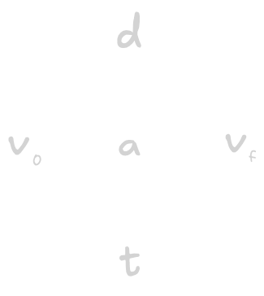
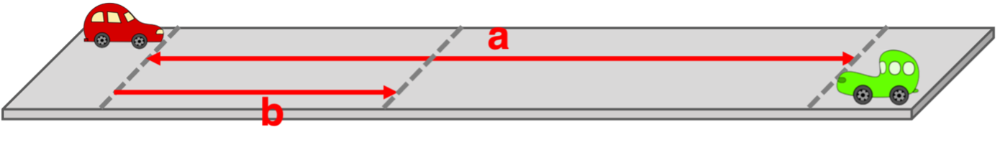

# Regents Physics 🔭 <!---fit--->

# **2025-2026** Agendas

## 👨‍🏫 Mr. Porter

---

<!--- class: halloween--->

# 2025.10.21 **Regents Physics**

##### **❓ of the 📅**: 

 

#### 📋 Agenda

1. Finish Think Sheet
2. Vector Components
2. Think Sheets:
    - Vector Components
    - Vector Addition by Components
3. Start Physics Classroom Assignments

### 🎯 Goals

🥅 _Add 2D vectors_

### 📆 Upcoming

- Due **Tomorrow**: _Adding Right Angle Vectors_
- Due **Friday**: _Vectors 2 & 3: Component Addition_ 

---

# 2025.10.20 **Regents Physics**

##### **❓ of the 📅**: What is your ideal sandwich 🥪?

 

#### 📋 Agenda

1. Finish Vector Mapping Lab
2. Adding 2D Vectors
3. Vector Components 

### 🎯 Goals

🥅 _Learn how to add 2 Dimensional Vectors_

### 📆 Homework

- PC: Head to Tail Vector Addition

---

# 2025.10.16 **Regents Physics** 🧟🧟‍♀️

##### **❓ of the 📅**: Would you rather discover that witches, vampires, or werewolves were real?

 

#### 📋 Agenda

1. Mapping Troy Lab
2. Adding Vectors Notes

### 🎯 Goals

🥅 _Use vectors to map in a city_

### 📆 Upcoming

---

# 2025.10.15 **Regents Physics**

##### **❓ of the 📅**: If you could make up a new rule, what would it be?

 

#### 📋 Agenda

1. [2D Vector Notes](../../../Presentations/Projectiles/talks/RP2DMotion2025.html)
2. 2D Vector Practice

### 🎯 Goals

🥅 _Describe 2D Vectors with magnitude and direction._

### 📆 Upcoming

---

# 2025.10.14 **Regents Physics**

##### **❓ of the 📅**: Favorite season? 🍂❄️🌞💮

 

#### 📋 Agenda

1. Kinematics Review
    - Finish Kinematics 4
    - Start: Kinematics 5 & 8 (Due Friday)

### 🎯 Goals

🥅 _Review Kinematic Concepts & Practice_

### 📆 Upcoming

- Most Likely Quiz Thursday (_assuming I give you back your quizzes tomorrow_)

---

# 2025.10.09 **Regents Physics**

##### **❓ of the 📅**: Apple or pumpkin flavored?

 

#### 📋 Agenda

1. Quiz
2. Breaking Down Kinematic Problem-solving
3. Practice with equations on physics classroom

### 🎯 Goals

🥅 _Use kinematic equations to solve problems_

### 📆 Upcoming

---

# 2025.10.08 **Regents Physics**

##### **❓ of the 📅**: Do you like scary movies?

 

#### 📋 Agenda

1. Finish Worksheet of word problems
    - put assigned question on whiteboard
2. Additional kinematic equation practice - Physics Classroom 

### 🎯 Goals

🥅 _Use kinematic equations to solve problems_

### 📆 Upcoming

- Quiz **Tomorrow** on Velocity vs. Time graphs

---

### A race car accelerates uniformly from 18.5 m/s to 46.1 m/s in 2.47 seconds. Determine the acceleration of the car and the distance traveled.

            

---

### A feather is dropped on the moon from a height of 1.40 meters. The acceleration of gravity on the moon is 1.67 m/s$^2$. Determine the time for the feather to fall to the surface of the moon.

         

---

### A bullet leaves a rifle with a muzzle velocity of 521 m/s. While accelerating through the barrel of the rifle, the bullet moves a distance of 0.840 m. Determine the acceleration of the bullet (assume a uniform acceleration).

          

---

An engineer is designing a runway for an airport. Several planes will use the runway and the engineer must design it so that it is long enough for the largest planes to become airborne before the runway ends. If the largest plane accelerates at 3.30 m/s$^2$ and has a takeoff speed of 88.0 m/s, then what is the minimum allowed length for the runway?

          

---

---

# 2025.10.07 **Regents Physics**

##### **❓ of the 📅**: Candy corn: yay or nay?

 

#### 📋 Agenda

1. Do Now - packet page 21 & 22
2. Introduction to kinematic equations and the cross diagram
3. Practice with equations & problem-solving

### 🎯 Goals

🥅 _Solve problems with VT Graphs_

🥅 _Use kinematic equations to make predictions_

### 📆 Upcoming

- PC Velocity Graphs due **Wed**
- PC Kinematic Eqns due **Thu**
- ***Quiz Thursday***

---

# 🕷️ 2025.10.03 **Regents Physics** 🕸️

##### **❓ of the 📅**: WYR visit a corn maze or haunted house?

 

#### 📋 Agenda

1. Packet pages 13 - 16
	1. Stop at question 4 on page 16
2. Review and New - VT Graphs
3. Finish Page 16, 21-22

### 🎯 Goals

🥅 _Solve problems with graphical features of velocity time graphs_

### 📆 Homework Due **Wednesday**
- Velocity Time Graphs 1
- Velocity Time Graphs 2

---

# 🎃 2025.10.02 **Regents Physisc** 👻

##### **❓ of the 📅**: Your favorite halloween costume?

 

#### 📋 Agenda

1. Finish Card Sort Data collection
2. Card Sort Summary Chart & Discussion
3. While waiting...Physics Classroom:
    - Graph that Motion
    - Name that Motion
    - Match that Graph

### 🎯 Goals

🥅 _Model motion with position, velocity, and acceleration graphs_

### 📆 Homework

- ✅ Finish Physics Classroom Practice Assignments

---

# 🎃 2025.10.01 **Regents Physics** 👻

##### **❓ of the 📅**: Cake or pie? 🍰🥧

 

#### 📋 Agenda

1. Card Sort
2. Summary Table as a class
3. Start Physics Classroom Practice
    - Name that Motion
    - Graph that Motion

### 🎯 Goals

🥅 _Analyze motion with xt, vt, and at graphs_

### 📆 Homework

- PC: Name That Motion
- PC: Match That Graph

---

# Card Sort

There 8 Verbal Descriptions: 
1. Match 1 Position vs. time and 1 Velocity vs. Time graph to each verbal description
2. Sketch the graphs with the description in your lab note as a hypothesis column
3. Connect the smart cart to your computer in graphical analysis and record the data
    - record this as your data next to your hypothesis
4. Double check all representations with my website:
5. Draw the motion map from the website below your graphs 
6. Fill out summary chart

---

Fill out chart on whiteboard

If it is increasing ($\textuparrow$), decreasing ($\textdownarrow$), or remaining the same ($\leftrightarrow$) And if it is positive ($+$) or negative ($-$)

1. Constant speed + 
2. Constant speed -
3. Speed up +
3. Speed up -
4. Slow down +
5. Slow down -
6. Slow down + speed up -
7. Slow down - speed up +

 

| # | xt slope | v values | vt slope | accel |
|---|---|---|---|---|
|1.| ↔️ +  | ↔️ + | ↔️ 0 | ↔️ 0 |
|2 | | | | |
|3 | | | | |
|4 | | | | |
|5 | | | | |
|6 | | | | |
|7 | | | | |
|8 | | | | |

---

<!--- class: bluegray --->

# 2025.09.29 **Regents Physics**

##### **❓ of the 📅**: Would you rather watch a movie on your TV at home or on the big screen in the theater, and why?

 

#### 📋 Agenda

1. Board Meeting -> Does it change velocity?
2. Linearization
    - how is x related to t?
    - how is v related to x?
3. Finish Up Lab Notebook

### 🎯 Goals

🥅 _Model Uniform Motion Graphically_

### 📆 Upcoming

---

# 2025.09.26 **Regents Physics**

##### **❓ of the 📅**: What is your favorite road trip snack?

 

#### 📋 Agenda

1. Quiz
2. Finish Wheel Lab Data Analysis
3. Wheel Lab Board Meeting

### 🎯 Goals

🥅 _Model changing velocity motion_

### 📆 Upcoming

---

# 2025.09.25 **Regents Physics**

##### **❓ of the 📅**: What is your favorite family vacation?

 

#### 📋 Agenda

1. Wheel Lab
  -> introduction and observations
  -> Technology pieces 
2. Wheel Lab -> Collect Data

### 🎯 Goals

🥅 _Collect Data on object moving down an incline_

### 📆 Upcoming

- HW: Finish Red Car vs Green Car on PC (due **Friday**)
- Quiz Friday

---

# 2025.09.23 **Regents Physics**

##### **❓ of the 📅**: What is the _worst_ food?

 

#### 📋 Agenda

1. Red Car vs. Green Car: Team problem-solving
    - Solve in group
    - Share solutions
2. Dueling Buggies Lab

### 🎯 Goals

🥅 _Use mathematical models to make predictions about constant velocity motion._

### 📆 Upcoming

- HW: Finish Red Car vs Green Car on Physics Classroom (due **Friday**)
- Quiz Friday

---

# Team Solving

### Solve with your lab group on a whiteboard

A red car (on left) and a green car (on right) are spaced **$1200\text{ m}$** apart (distance a). They start at the same time and head towards each other. The red car averages a speed of **$13.2\text{ m/s}$**. The green car averages a speed of **$16.8\text{ m/s}$**. What distance will the red car have traveled (distance b) when it is at the same position as the green car?

---

# Dueling Buggies Lab

## Lab Question

How can we use measurements and models to predict the meeting point of two battery-powered buggies, one fast and one slow, when they move toward each other from known starting positions?

## Lab Purpose

To determine and test the predicted meeting point of two buggies moving at constant, but different, speeds toward each other, using measurements, motion maps, graphs, and algebraic models.

---

## Procedure Overview

1) In teams, measure all properties you think are necessary to predict how the fast and slow buggies will move (speed, direction, etc.).
2) Record your measurements and describe your methods.
3) After measurements, your buggies will be collected. The teacher will mark two starting lines: one for the fast buggy and one for the slow buggy.
4) Using your data, determine and clearly mark on the floor where you predict the two buggies will meet if started at the same time.

---

# Procedure Overview

5) Use at least two different approaches (motion maps, position-time graphs, algebraic equations, etc.) to support your prediction.
6) Once you have made your prediction, test it by running the buggies from the assigned start lines.
7) Record and analyze the outcome.

---

## Data Section

- Table of measurements for each buggy (speed, direction, other relevant properties)
- Sample calculations for determining speed
- Sample calculations for determining speed
- Diagrams, graphs, or descriptions of any modeling tools used
- Sketches or descriptions of motion maps and position-time graphs
- Written description of your prediction process

---

# Dueling Buggies Lab

## Lab Question

How can we use measurements and models to predict the meeting point of two battery-powered buggies, one fast and one slow, when they move toward each other from known starting positions?

## Lab Purpose

To determine and test the predicted meeting point of two buggies moving at constant, but different, speeds toward each other, using measurements, motion maps, graphs, and algebraic models.

---

# 2025.09.22 **Regents Physics**

##### **❓ of the 📅**: If you were to open a store, what would you sell?

 

#### 📋 Agenda

1. Finish Walk the Graph Lab 🚶‍♂️
2. Velocity vs. time graphs
3. Red Car vs. Green Car 🚗 

### 🎯 Goals

🥅 _Model & Predict Constant Velocity Motion_

### 📆 Upcoming

---

# 🖱️ Open [Graphical Analysis](https://graphicalanalysis.app/) <!--fit--->

### [Click link in slides or find herehttps://graphicalanalysis.app/](https://graphicalanalysis.app/)

## ❗**Save this to your bookmarks**

---

# 2025.09.19 **Regents Physics**

##### **❓ of the 📅**: Would you rather be a superhero or super villain?

 

#### 📋 Agenda

1. Find _Graphical Analysis Page_
2. Motion Maps
3. Walk the Graph Lab

### 🎯 Goals

🥅 _Connect physical motion to multiple representation_

### 📆 Upcoming

---

# Walk the Graph Lab 🚶‍♂️

**Question:**  How can different types of walking motion be represented and interpreted using position-time and velocity-time graphs?

**Purpose:**  To investigate how various walking motions (such as walking away from or toward the sensor, walking at different speeds, or stopping and starting) are represented on position-time and velocity-time graphs, and to develop an understanding of the relationship between motion and its graphical representation.

**Instructions for Lab Notebook Reflection:**  
Record your answers to the reflection questions above in your lab notebook. Include sketches of your graphs and a brief written description of your movement for each trial.

---

# 2025.09.17 **Regents Physics**

##### **❓ of the 📅**: Would you rather live in the ocean 🌊 or on the moon 🌔?

 

#### 📋 Agenda

1. Do Now PC - **_Position-Time Graphs - Conceptual Analysis Concept Builder_**
2. Average vs. Instantaneous
    - **_Position-Time Graphs - Numerical Analysis_**
3. Motion Maps

### 🎯 Goals

🥅 _Model motion with position vs. time graphs_

🥅 _Differentiate between average and instantaneous_

### 📆 Homework

- PC: CalcPad - **Kinematics 2: Position-Time Graphs**

---

# 2025.09.16 **Do Now**

### 1. Complete _Describing Motion Verbally with Distance and Displacement_ Worksheet
### 2. Provide an example where **distance**, **displacment**, and final position are ***the same***
### 3. Provide an example where **distance**, **displacment**, and final position are ***different***

---

# 2025.09.16 **Regents Physics**

##### **❓ of the 📅**: What's the best pizza topping? 🍕

 

#### 📋 Agenda

1. Do Now
2. Speed vs. Velocity
3. Describing Motion
4. Average vs. Instantaneous Speed & Velocity

### 🎯 Goals

🥅 _Interpret & describe motion from position vs. time graphs_

### 📆 Upcoming

- Physics Classroom HW:
  - Set K1: Distance versus Displacement

---

# 2025.09.15 **Regents Physics**

##### **❓ of the 📅**: What is the proper length of a playlist?

 

#### 📋 Agenda

1. Buggy Lab Board Meeting
  - Remind yourself of your lab & results
2. [CV Notes](../../../Presentations/APCVPM/talks/RPKinematics2025.html) & Practice
3. Physics Classroom: _**Position-Time Graphs - Conceptual Analysis Concept Builder**_

### 🎯 Goals

🥅 _Define CV Model_

### 📆 Upcoming

---

# 2025.09/11 **Regents Physics **

##### **❓ of the 📅**: Does a week start on Sunday or Monday?

 

#### 📋 Agenda

1. Finish Buggy Lab & Whiteboard Results
2. Buggy Lab Board Meeting
3. [CV Model Notes](../../../Presentations/APCVPM/talks/RPKinematics2025.html)

### 🎯 Goals

🥅 _Model motion of toy car with position and time_

### 📆 Upcoming

---

# 2025.09.10 **Regents Physics**

##### **❓ of the 📅**: Would you rather be the hero or the sidekick?

 

#### 📋 Agenda

1. Do Now: Reread/Remind yourself about [Data Collection](https://www.mrporterphysics.com/AP%20Resource%20Pages/datacollection.html)
2. Discussion of Data Best Practices
3. Dune Buggy Challenge

### 🎯 Goals

🥅 _Use data collection best practices_

### 📆 Upcoming

- Get your parent/guardian to sign the student safety contract

---

# Dune Buggy Challenge 🚗

### Questions:

1. How much time does it take a Dune Buggy car to travel a specified distance?
2. Does your buggy move **in a consistent** manner?

### Purpose:

To collect distance-time data for a Dune Buggy Car in order to predict the time it takes a Dune Buggy to travel a specified distance

### Data & Prediction

- when graphing put time on the **horizontal** axis

---

# 2025.09.09 **Regents Physics**

##### **❓ of the 📅**: Is it OK to ask the genie for infinite wishes?

 

#### 📋 Agenda

1. Finish Pasta Bridge Lab
2. Pasta Lab Board Meeting
3. Data Collection Best Practices
4. Dune Buggy Challenge

### 🎯 Goals

🥅 _Present Data and defend lab results_

🥅 _Determine data collection best practices_

### 📆 Upcoming

---

# Pasta Bridge Lab 🍝

## Objective: 

* Determine the strength of a pasta bridge by finding the relationship between strength (number of marbles) and strands of pasta
* Develop an experiment to compare at least two types of pasta. Create a hypothesis for which will be stronger. 

---

# Board Meeting 

### Rules 📝

1. 👂 Listen 
2. 🗣️ Speak Clearly
3. ❔ Ask Questions
4. 🤔 Seek to understand
5. 👉 Refer to your board and use **evidence**
7. 📊 Use & connect multiple representations
6. 🌟 Come to consensus

 

### Goals 🎯

1. Practice Presenting to Class
    - speaking clearly
    - listening intently
2. Learn how to come to class consensus
    - What does the *majority* of the data show?
3. Create a culture of learning from each other

---

# Board Meeting 

- What is the **slope**? 
  - _For every_ statement ("_The **y quantity** changes **the slope number** <y units> for every 1 **x quantity** <x units>_")
- What is the **intercept**?
- What do they represent?
  - How does each group's result compare?

---

# Pasta Bridge Model:

             

---

# Data Collection 📊

1. Go to [Data Collection Best Practices Interactive](https://www.mrporterphysics.com/AP%20Resource%20Pages/datacollection.html)
2. Read and click through the examples
3. Reflect on your _Coefficient of Restitution_ lab, did you follow these practices? How can you improve upon your design?

---

#### Claim:

I predicted that it would take my Dune Buggy car _______________ to travel the specified distance of ______________ cm.

### Evidence:

(Discuss values from your Data section...identifying the data that you used to determine the prediction. Use specifics in your discussion.)

### Reasoning:

(Explain in a few sentences why this evidence provides logical support for believing that your claim is true. And while you’re at it, you ought to mention how well...or not well...that you did.)

---

# 2025.09.05 **Regents Physics**

##### **❓ of the 📅**: Would you rather vacation in Hawaii or Alaska?

 

#### 📋 Agenda

1. Pasta Bridge Lab
    - Collect Data
    - Graph Data
    - Write Discussion and Conclusions
2. Whiteboard Lab Results
3. Board Meeting 

### 🎯 Goals

🥅 _Collect Data and create a mathematical model_

🥅 _Present Lab Results_

### 📆 Upcoming

- Safety Contract...still figuring out digital or physical

---

# 2025.09.04 **Regents Physics** 

##### **❓ of the 📅**: Sweet or savory for breakfast?

#### 📋 Agenda

0. Sit Anywhere
1. Do Now (fill out questionnaire & card)
2. Question of the Day
3. Survival Island
4. Pasta Bridge Lab 🍝

### 🎯 Goals 

🥅 _Introductions_

🥅 _Classroom Culture_

### 🏠 Homework

- Signed Safety Contract

---
<!--- background: black--->
# Do **Now** 

1. Fill out index card:
    1. Name
    2. Phone number to reach your parents/guardians if you sleep through the Regents
    3. Favorite Candy
    4. Favorite Emoji
    5. Emoji the describes your current mood
2. Fill out Paper Quesionnaire

---

# Survival Island 🌴

1. Share your *survival skill* that **you wrote down** with your group
2. Using ***everyone's skill*** develop a plan to survive or escape the deserted island
3. On your whiteboard present your plan (drawing, mind map, set of instructions)
    - Highlight everyone's skill

---

# Surivial Plan... <!--fit--->

---

# Pasta Bridge Lab 🍝

## Objective: 

* Determine the strength of a pasta bridge by finding the relationship between strength (number of marbles) and strands of pasta

---

# 🥼 Lets Science! 🥼 <!--fit--->

# 📓 Lab Notebooks 📓 <!--fit--->

---

# What is a Lab Notebook?

* A detailed, chronological record of a scientist's research activities, experiments, and observations. 
* Documentation of the scientific process from intial ideas to final results and conclusions. 

---

# Why keep lab notebooks?

* Document Research
* Develop Ideas
* Organize Data 
* Collaboration Tool
* Publication Support
* Troubleshooting 
* Intellectual Property Protection
* Historical Record

---

# Lab Notebooks can be Legal Documents 

* Proof of invention in Patent Cases
* Intellectual Property Protection
* Admissibility in court - must be properly maintained
* Note: Often property of the instituation where the research was conducted (i.e. Property of Regeneron, or Property of Cornell University)

---

# Remember

* Lab notebooks are most importantly scientific documentation
* They represent the scientific process and are record of your **thinking**
    * This means your ideas and conclusions and hypotheses can **change** based on **new data**

---

# Lab Notebook

* Write in **pen**
* All mistakes get a ~~single cross through~~
* Full Date (YYYY/MM/DD) at the beginning of each entry (for multiday labs date start of each day)
* Enter Lab Pages into table of contents 

---

# Lab Notebook - Pre Lab

* **Title and objective of the experiment**: 
  - Write a clear, concise title for each experiment.
  - State the main objective or purpose of the experiment in 1-2 sentences.
* ***Theoretical background**: 
  - Briefly explain the relevant scientific principles.
  - Include key equations or concepts that will be tested or applied.
* **Hypotheses**: 

  - State your predictions about the experiment's outcome.
  - Base these on your understanding of the theory.

---

# Lab Notebook - Pre Lab

* **Materials and equipment list**: 
  - Provide a detailed list of all materials and equipment used.
  - Include model numbers and specifications where relevant.
* **Experimental procedure outline**: 
  - Write a step-by-step outline of the planned procedure.
  - Be specific enough that someone could replicate your experiment.

---

<!--- footer:   --->

# During the Experiment

* **Raw data in tables with units**: 
  - Create neat, organized tables for all numerical data.
  - Always include units and uncertainty estimates.
  - Label columns clearly and use consistent significant figures.
* **Observations and qualitative notes**: 
  - Record all relevant observations, even if they seem unimportant.
  - Note any unexpected occurrences or anomalies.

---

# During the Experiment 

* **Any changes to the planned procedure**: 
  - Document any deviations from the original procedure.
  - Explain why changes were made and how they might affect results.
* **Sketches or diagrams of experimental setup**: 
  - Include clear, labeled diagrams of your experimental setup.
  - Add dimensions and important details to aid in replication.

---

# Post Lab

* **Data analysis and calculations**: 
  - Show all steps in your calculations, including formulas used.
  - Explain your reasoning for each step of the analysis.
* **Graphs and charts**: 
  - Create neat, properly labeled graphs and charts.
  - Include titles, axis labels with units, and legends where appropriate.

---

# Post Lab

* **Discussion of results**: 
  - Interpret your results in the context of the experiment's objectives.
  - Explain any patterns or trends observed in the data
* **Comparison with hypotheses**: 
  - Explicitly state whether your results support or refute your hypotheses.
  - Discuss possible reasons for any discrepancies.
* **Sources of error and uncertainty**: 
  - Identify potential sources of experimental error.
  - Discuss how these might have affected your results.
  - Quantify uncertainties where possible.

---

# Post Lab

- **Conclusions**: 
  - Summarize the main findings of the experiment.
  - Relate these back to the original objectives and broader scientific principles.
  - Suggest improvements or future directions for the experiment.

---

# Pasta Bridge Lab 🍝

## Objective: 

* Determine the strength of a pasta bridge by finding the relationship between strength (number of marbles) and strands of pasta
* Develop an experiment to compare at least two types of pasta. Create a hypothesis for which will be stronger. 

---

# Board Meeting 

### Rules 📝

1. 👂 Listen 
2. 🗣️ Speak Clearly
3. ❔ Ask Questions
4. 🤔 Seek to understand
5. 👉 Refer to your board and use **evidence**
7. 📊 Use & connect multiple representations
6. 🌟 Come to consensus

 

### Goals 🎯

1. Practice Presenting to Class
    - speaking clearly
    - listening intently
2. Learn how to come to class consensus
    - What does the *majority* of the data show?
3. Create a culture of learning from each other

