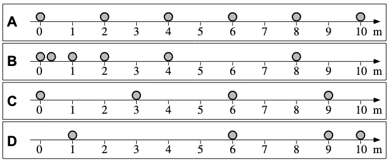
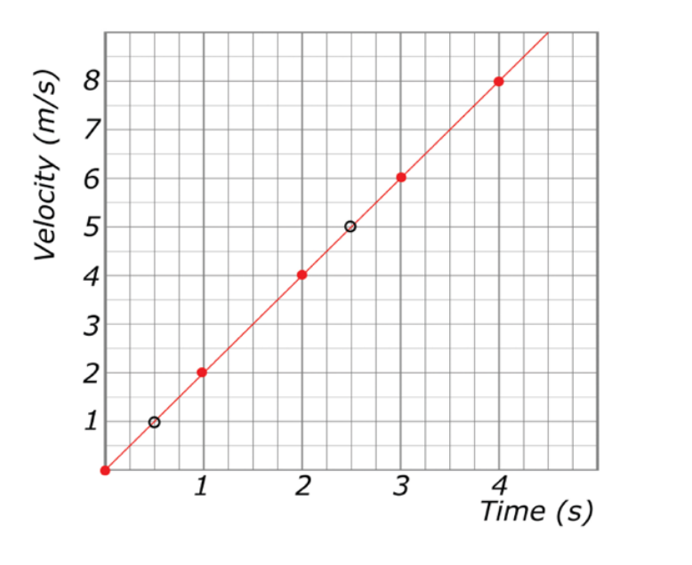

<!--- _class: lead --->

# Regents Physics 🔭 

## **2026-2027** Agendas

### 👨‍🏫 Mr. Porter

---

 # **AP Physics Do Now**  Register for...

 
 
 

 ## Register for **AP Classroom** 
 
 AP Exam Prep & Review
  - Website: [https://apclassroom.collegeboard.org/](https://apclassroom.collegeboard.org/)
  - Code: <mark>**YLWWNZ**</mark>
 
 

 

 
##  Register for... **Physics Classroom**
  General Physics Practice & Homework
  - Website: [http://www.physicsclassroom.com/sign-in](http://www.physicsclassroom.com/sign-in)
  - Code: **e56dbba**
  - Register with school email as username
 
 

 

---

# 2026.09.17 **AP Physics**

##### **❓ of the 📅**: What was your favorite recess game from elementary school?

 

#### 📋 Agenda

1. Whiteboard Results and discuss
2. Finish Lab Notebook
3. [Motion Notes](../../Presentations/APCVPM/talks/CVPM2026.html)
3. Distance vs. Displacement Physics Classroom

### 🎯 Goals

🥅 __

### 📆 Upcoming

---

# 2026.09.15 **AP Physics**

##### **❓ of the 📅**: What is the best french fry shape? 🍟

 

#### 📋 Agenda

1. Do Now
2. Finish Buggy Lab
    - Collect Data
    - [Graph with nPlot](https://noragulfa.com/nPlot/) and Print 🖨️
2. Whiteboard and Compare

### 🎯 Goals

🥅 _Collect data for buggy lab_

🥅 _Model Motiong graphically_ 

### 📆 Upcoming

---

# 2026.09.14 **AP Physics** Do Now

 
 
 
 
 

 ###### 5 MINUTES 

 #### How Far and Where? 

In each case, a sphere is moving from left to right next to a tape marked in meters. A strobe (flash) photograph is taken every second, and the location of the sphere is recorded. The total time intervals shown are not the same for all spheres.

1. Which ball went the **_furthest_** over the first 3 seconds?
2. **_Where_** is each ball at time $t = 3 \text{ s}$?
3. What are two ways to define "furthest"? 
 
 

 

---

# 2026.09.14 **AP Physics**

##### **❓ of the 📅**: Should fruit be kept in the fridge?

 

#### 📋 Agenda

1. [Data Collection Best Practices](../../AP%20Resource%20Pages/datacollection.html)
2. Buggy Lab - Partners

### 🎯 Goals

🥅 __

### 📆 Upcoming

---

<!--- _class: paper --->

# Buggy Lab 🚗 

## Purpose

Collect data on your buggies so that you can represent the motion (all aspescts) of both buggies on the **same** graph. Your final models should be able to predict the **position** of your buggy at specified times. 

 

## Constraints

You will be given scenario card that describes the setup of your buggies

*Ignore speed label

---

<!-- _class: paper -->

# 2026.09.11 **AP Physics** Do Now

###### 5 MINUTES — ON YOUR OWN

#### Best Fit Lines

1. Pick up handout on front table
2. Complete on your own
2. Compare your answers to your peers
3. Discuss with Mr. Porter as a group

---

# 2026.09.11 **AP Physics**

##### **❓ of the 📅**: If you could snap your fingers and have one thing done for you, which would it be?

 

#### 📋 Agenda

1. Do Now - Best Fit Lines
2. Best Fit Lines Slides (blob vs. split method)
3. Experimental Uncertainty slides
4. Finish Lab Notebook
5. Data Collection Best Practices
6. Mathematical Modeling

### 🎯 Goals

🥅 _Practice with mathematical modeling from experimental data_

🥅 _Write conclusions from mathematical models_

### 📆 Upcoming

---

# 2026.09.09 **Regents? Physics**

##### **❓ of the 📅**: Can you ask a genie for infinite wishes? 🧞

 

#### 📋 Agenda

1. Ball Bounce Lab
    - collect data
    - create graph & drawing best fit lines
      - calculating slope
    - discuss
    - answer questions
2. Creating Mathematical Models
3. Data Collection Best Practices

### 🎯 Goals

🥅 _Discuss how to draw and calculate best fit lines_

### 📆 Upcoming

- HW: Safety Contract Signed

---

# Best Fit Lines

 

$$slope=\frac{rise}{run}=\frac{y_2-y_1}{x_2-x_1}=\frac{5 \frac{m}{s} - 1 \frac{m}{s}}{2.5 s - 0.5 s} = 2 \frac{m}{s}$$

---

# 2026.09.08 **Regents Physics** 

##### **❓ of the 📅**: Sweet or savory for breakfast?

#### 📋 Agenda

0. Sit Anywhere
1. Do Now (fill out questionnaire & card)
2. Question of the Day
3. Lab Notebooks
4. Ball Bounce Lab
5. Question

### 🎯 Goals 

🥅 _Introductions_

🥅 _Classroom Culture_

### 🏠 Homework

- Signed Safety Contract

---
<!--- _class: paper--->
# Do **Now** 

> 1. Fill out index card:
>    - Name
>    - Phone number to reach your parents/guardians if you sleep through the Regents
>    - Favorite Candy
>    - Favorite Emoji
>    - Emoji the describes your current mood
> 2. Fill out Paper Quesionnaire

---

<!--- _class: paper--->

# Survival Island 🌴

> 1. Share your *survival skill* that **you wrote down** with your group
> 2. Using ***everyone's skill*** develop a plan to survive or escape the deserted island
> 3. On your whiteboard present your plan (drawing, mind map, set of instructions)
    - Highlight everyone's skill

---

# Surivial Plan... <!--fit--->

---

<!--- _class: paper-->

# Ball Bounce Lab

> ## Question:
> Is the coefficient of restitution constant for your ball? Do this by comparing drop height to bounce height for your assigned ball.

---

# 🥼 Lets Science! 🥼 <!--fit--->

# 📓 Lab Notebooks 📓 <!--fit--->

---

# What is a Lab Notebook?

* A detailed, chronological record of a scientist's research activities, experiments, and observations. 
* Documentation of the scientific process from intial ideas to final results and conclusions. 

---

# Why keep lab notebooks?

* Document Research
* Develop Ideas
* Organize Data 
* Collaboration Tool
* Publication Support
* Troubleshooting 
* Intellectual Property Protection
* Historical Record

---

# Lab Notebooks can be Legal Documents 

* Proof of invention in Patent Cases
* Intellectual Property Protection
* Admissibility in court - must be properly maintained
* Note: Often property of the instituation where the research was conducted (i.e. Property of Regeneron, or Property of Cornell University)

---

# Remember

* Lab notebooks are most importantly scientific documentation
* They represent the scientific process and are record of your **thinking**
    * This means your ideas and conclusions and hypotheses can **change** based on **new data**

---

# Lab Notebook

* Write in **pen**
* All mistakes get a ~~single cross through~~
* Full Date (YYYY/MM/DD) at the beginning of each entry (for multiday labs date start of each day)
* Enter Lab Pages into table of contents 

---

# Lab Notebook - Pre Lab

* **Title and objective of the experiment**: 
  - Write a clear, concise title for each experiment.
  - State the main objective or purpose of the experiment in 1-2 sentences.
* ***Theoretical background**: 
  - Briefly explain the relevant scientific principles.
  - Include key equations or concepts that will be tested or applied.
* **Hypotheses**: 

  - State your predictions about the experiment's outcome.
  - Base these on your understanding of the theory.

---

# Lab Notebook - Pre Lab

* **Materials and equipment list**: 
  - Provide a detailed list of all materials and equipment used.
  - Include model numbers and specifications where relevant.
* **Experimental procedure outline**: 
  - Write a step-by-step outline of the planned procedure.
  - Be specific enough that someone could replicate your experiment.

---

<!--- footer:   --->

# During the Experiment

* **Raw data in tables with units**: 
  - Create neat, organized tables for all numerical data.
  - Always include units and uncertainty estimates.
  - Label columns clearly and use consistent significant figures.
* **Observations and qualitative notes**: 
  - Record all relevant observations, even if they seem unimportant.
  - Note any unexpected occurrences or anomalies.

---

# During the Experiment 

* **Any changes to the planned procedure**: 
  - Document any deviations from the original procedure.
  - Explain why changes were made and how they might affect results.
* **Sketches or diagrams of experimental setup**: 
  - Include clear, labeled diagrams of your experimental setup.
  - Add dimensions and important details to aid in replication.

---

# Post Lab

* **Data analysis and calculations**: 
  - Show all steps in your calculations, including formulas used.
  - Explain your reasoning for each step of the analysis.
* **Graphs and charts**: 
  - Create neat, properly labeled graphs and charts.
  - Include titles, axis labels with units, and legends where appropriate.

---

# Post Lab

* **Discussion of results**: 
  - Interpret your results in the context of the experiment's objectives.
  - Explain any patterns or trends observed in the data
* **Comparison with hypotheses**: 
  - Explicitly state whether your results support or refute your hypotheses.
  - Discuss possible reasons for any discrepancies.
* **Sources of error and uncertainty**: 
  - Identify potential sources of experimental error.
  - Discuss how these might have affected your results.
  - Quantify uncertainties where possible.

---

# Post Lab

- **Conclusions**: 
  - Summarize the main findings of the experiment.
  - Relate these back to the original objectives and broader scientific principles.
  - Suggest improvements or future directions for the experiment.

---

<!--- _class: paper --->

## Ball Bounce Lab

> **Purpose:** To determine the mathematical relationship between drop height and bounce height, express it as an equation built from your own graph, and test that equation by predicting an unmeasured bounce.

> **Essential Question:** How does the height a ball bounces depend on the height from which it is dropped?

---

<!--- _class: paper --->

## Ball Bounce Lab

> **Background**: The coefficient of restitution (symbol: $e$) is a dimensionless quantity that describes how much energy is conserved in a collision, specifically how well an object bounces back after impact. It is used to characterize the elasticity of collisions between two bodies.

---

# Board Meeting 

### Rules 📝

1. 👂 Listen 
2. 🗣️ Speak Clearly
3. ❔ Ask Questions
4. 🤔 Seek to understand
5. 👉 Refer to your board and use **evidence**
7. 📊 Use & connect multiple representations
6. 🌟 Come to consensus

 

### Goals 🎯

1. Practice Presenting to Class
    - speaking clearly
    - listening intently
2. Learn how to come to class consensus
    - What does the *majority* of the data show?
3. Create a culture of learning from each other

 