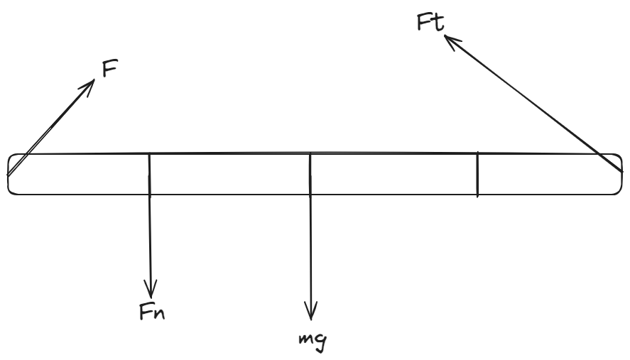

# Rotation 💿 <!---fit--->

# A Model for Spinning :ferris_wheel: <!---fit--->

#### 👨‍🏫 Mr. Porter 
#### 📆 2024-25 - AP Physics

---

## Translational Motion 

### _When an object moves as a whole from one location to another, without turning._

<!--- 
Car example:
- neglect wheels, engine, axles, etc 
- Car made a turn the radius was the same for everything...
- During turn certain parts move differently
- Modeled as a point 
--->

## Rotational Motion

### _Spinning objects_

---

# Angular Displacement:

- $\Delta \theta$: change in angle, measured in radians
- Is equal to the arc length divided by the radius

$$ \Delta \theta = \frac{\Delta s}{r}$$

- One revolution is equal to $2\pi$

---

<iframe src="../figures/radians_demo.html" width="1100" height="600"></iframe>

---

# Angular Velocity

- Measure of how fast an object is rotating.
- Symbol: $\omega$
- Is equal to the change in angular displacement in a time.

$$\omega = \frac{\Delta \theta}{\Delta t}$$

- measured in rad/s
---

# Angular and Linear Velocity

Angular velocity is analogous to linear velocity, and we can determine their relationship.

* $v = \frac{\Delta s}{\Delta t}$ and $\Delta \theta = \frac{\Delta s}{t}$

* so $\Delta s = r \Delta \theta$ (think $C = r \cdot 2\pi$)

* sub in: $v = \frac{r\Delta \theta}{\Delta t} = r \omega$

---

# Angular Acceleration

$$\alpha = \frac{\Delta \omega}{\Delta t}$$

- measured in rad/s/s or rad/s$^2$

---

## Translating Between Linear and Angular

How to translate the two (not on the reference table!)

| Linear | Angular |
|---|---|
| $x = \theta r$ | $\theta = \frac{x}{r}$ |
| $v = \omega r$ | $\omega = \frac{v}{r}$ |
| $a = \alpha r$ | $\alpha = \frac{a}{r}$ |

---

<iframe src="../figures/linearangularequiv.html" width="1100" height="600"></iframe>

---

<iframe src="../figures/wheeldemo.html" width="1100" height="600"></iframe>

---

# Rotational Kinematics:

The same as linear, but with their rotational twin!

| Linear | Angular | 
|---|---|
|$v_x = v_{0x} + a_xt$ | $\omega = \omega_0 + \alpha t$ |
| $x = x_0 + v_{0x}t + \frac{1}{2}a_xt^2$ |  $\theta = \theta _0 + \omega_0 t + \frac{1}{2}\alpha t^2$|
|  $v_x^2 = v_{0x}^2 = 2a_x(x-x_0)$| $\omega^2 = \omega_0^2 + 2\alpha(\theta - \theta_0)$ | 

---

---

# Torque 

## When a ***force*** has the ability to rotate an object 

* i.e. Pushing the edge a door so it rotates around its axis of rotation (the hinges)

---

# Torque

## Depends on:

* where the force is exerted
* how large the force is 
* what angle the force is at 

---

# Torque 

$$ \boxed{\tau = r_\perp F = r F \sin \theta}$$

* $\tau$ (tau) is  torque (Newton $\cdot$ meter)
* $r$ is distance between point force is exerted and axis of rotation
* $F \sin \theta$ is Force perpendicular to axis of rotation

---

# Balacing Act:

### Task 1

Add masses to each side of the rod so that the rod does not rotate, but is balanced (parallel to the table). In particular, add two masses to one side and one mass to the other side. Is there more than one arrangement that will balance the rod? Explain.

### Task 2

Draw a Free Body Diagram for your setup in task 1. Are the forces balanced?

---

# Balacing Act:

### Task 3

Would the diagram that Mr. Porter drew on the board rotate? (Draw a FBD for the situation...does the net force explain the situation?)

### Task 4

Where could we place a mass in the previous question so that the ruler would not rotate?

---

# Balacing Act:

### Task 5

Develop a method to determine the mass of your meterstick using the balance.

---

# Notes ✏️📓 <!--fit--->

---

# Extended Bodies 

* Rigid (parts of object do not move with respect to each other)
* nonzero size 

---

# Balance your   pencil ✏️   on your finger <!---fit--->

---

# The balance point   is the pencil's   **center of mass**. <!---fit--->

---

# Center of Mass

## The point on an object where a force exerted on the object pointing directly toward or away from that point, will not cause the object to turn. The location of this point depends on the mass distribution of the object. 

---

# Center of Mass

## The average location of all of the mass of an object. 

- $F_g$ is effectively exerted on the center of mass

---

# Center of Mass:

$$\boxed{\vec{x}_{cm} = \frac{\Sigma m_i \vec{x}_i}{\Sigma m_i}}$$

1. $\vec{x}_{cm}$ represents the position vector of the center of mass.
2. $m_i$ represents the mass of each individual object in the system.
3. $\vec{x}_i$ represents the position vector of each individual object.
4. $\Sigma m_i \vec{x}_i$ in the numerator means: multiply each object's mass by its position vector, then sum these products for all objects in the system.
5. $\Sigma m_i$ in the denominator is the total mass of the system (the sum of all individual masses).

---

For a 1-dimensional case with objects along a line, this simplifies to:

$$x_{cm} = \frac{m_1 x_1 + m_2 x_2 + m_3 x_3 + ... + m_n x_n}{m_1 + m_2 + m_3 + ... + m_n}$$

---

# Static Equilibrium 

* Object remains at rest 
* Sum of forces = zero (balanced forces)
    * $\Sigma F = F_1 + F_2 + F_3 + \ldots = 0$
    * $\Sigma \tau = \tau_1 + \tau_2 + \tau_3 + \ldots = 0$
* Sum of torques = zero (balanced torques)

---

Consider the beam shown below to be in equilibrium (Net Torque = 0) around the fulcrum at Point A. The mass of the beam is 6.5 kg, the mass of the resting mass is 43 kg, and the distance between vertical yellow marks is 49 cm.

What is the magnitude of force F?

---

# Physics Classroom Practice

- [Beam with Mass](https://www.physicsclassroom.com/calcpad/launch/CPRT5)
- [Beam with Mass and Angles](https://www.physicsclassroom.com/calcpad/launch/CPRT6)
- [Mass on Beam](https://www.physicsclassroom.com/calcpad/launch/CPRT7)

---

# AP Workbook

A long rod of length L and negligible mass supports a box of mass M. The left end of each rod is held in place by a frictionless pin about which it can freely rotate. In each case, a vertical force is holding the rods and the weights at rest. The rods are marked at half-meter intervals. 

---

# 7.B

**A.** Rank the magnitude of the vertical force $F$ applied to the rods to keep the rod horizontal (from greatest to least)

**B.** Sketch the forces acting on the rod-box system

---

# 7.B

**C.** In which cases is the force from the pin up? Down? Zero? Justify your answers. 

---

# Example with Angle

Consider the beam below in equilibrium supported by a pin joint at A and a rope attached from the end of the beam to the pin joint at point B. The mass of the beam is 39.0 kg, the mass of the person is 43 kg, and the distance between vertical yellow marks is 1.6 meters. Pin joints can provide forces in the horizontal and vertical directions to maintain equilibrium.

1. Tension in Rope
2. Forces x, y at A
3. Forces x, y at B

---

# Translate

#### Physics Ideas:
- Equilibrium 
  - Balanced Torques
  - Balanced Forces

#### Givens
- mass: $m_b = 39 \text{ kg}$, $m_p = 43 \text{ kg}$
- levers: $r_{com} = 1.6 \text{ m}$, $r_p = 1.6 \text{ m}$, $r_T = \text{ m}$

#### Unknowns

- $F_T$, $F_{Ax}$, $F_{Ay}$, $F_{Bx}$, $F_{By}$

---

# Physics Diagrams - Force Diagram

---

# Solving Process 

1. Use sum of Torques to find Tension
2. Use Tension and sum of forces to find forces at Pivot Point A
3. Use above information for Pivot Point B

---

# Represent Mathematically

Sum Torques 

$$\Sigma \tau = 0$$

$$\tau_T - \tau_p - \tau_{com} = 0$$

$$r_TF_t \sin30^\circ - r_pm_pg - r_{com}m_{com}g = 0$$

$$F_T = \frac{r_pm_pg + r_{com}m_{com}g}{r_T \sin30^\circ}$$

Horizontal Forces

$$\Sigma F_x = 0$$

$$F_{xA} - F_{Tx} = 0 $$

$$F_{xA} = F_T \cos 30^\circ$$

And Vertical Forces 

$$\Sigma F_y = 0$$

$$F_{Ty} - m_pg - m_{com}g + F_{Ay} = 0$$

$$F_{T}\sin 30^\circ - m_pg - m_{com}g = F_{Ay}$$

---

# Unbalanced Torque  <!---fit--->

# Causes rotational (angular) acceleration!

---

# Newton's Second Law Rotation

$$ \alpha = \frac{\Sigma \tau}{I} $$

- $\alpha$ ➡️ angular acceleration 
- $\Sigma \tau$ ➡️ Net Torque 
- $I$ ➡️ Moment of Inertia (rotational mass equivalent)

---

# What is **Moment of Inertia**? <!---fit--->

## Demo:

- Twisting Rod (where is it easiest to hold the rod to twist it?)

---

# Moment of Inertia 

## Why does the skater spin faster when she brings in their arms?

---

# Moment of Inertia

* the rotational analog of mass for linear motion
* it is related to the mass and the location of the mass
  * closer the mass is to the rotational axis, the lower the moment of inertia (easier to spin)
* ***for a point like object $I=mr^2$***
* this relationship is used to build the equations for other moments of inertia

---

# Reference Table 

$$ \boxed{I = \Sigma m_ir_i^2}$$

- $I$ ➡️ moment of interia
- $m$ ➡️ mass 
- $r$ ➡️ position vector magnitude

---

---

---

<!--- _class: inverse --->

---

# Example

A potter is shaping a bowl out of clay on a potter's wheel initially rotating at a constant angular speed of 22.4 rad/sec. A 1.40-N friction force between her hands and the clay slows the system to a stop. The wheel is a 11.5-kg disk with a radius of 26.2 cm. The bowl has a moment of inertia of 0.074 kg•m$^2$ around the center axis of the wheel.

1. What is $I_{wheel}$ (hint: $I = \frac{1}{2}MR^2$)
2. What is total $I$?
3. What is the $\Sigma \tau$ 
4. What is $\alpha$? Time to stop?

---

# Example 

A block of unknown mass is attached to a long, lightweight string that is wrapped several turns around a pulley on a horizontal axis through its center, as shown. The pulley is a uniform solid disk of mass $M$ and radius $R$. The rotational inertia of the pulley is described by the equation $I = \frac{1}{2}MR^2$. The pulley can rotate about its center with negligible friction. The string does not slip on the pulley as the block falls. When the block is rleased from rest and as the block travels towards the ground, the magnitude of the tension exerted on the block is $F_T$. What is $\alpha_D$ of the disk as the block travels down?

---

# Class Work:

### On your own: 
1. [**Problem Set RD1: Moment of Inertia for a System of Point Masses**](https://www.physicsclassroom.com/calcpad/launch/CPRD1)
1. 7.D

### Together: 

1. 7.E
2. 7.G

---

# Parallel Axis Theorem

$$ \boxed{I' = I_{cm} + Md^2}$$

- $I'$ ➡️ New Moment of Interia
- $I$ ➡️ Moment of interia about original axis
- $M$ ➡️ Mass
- $d$ ➡️ Distance between two axes 

---

# In terms of momentum, why does the water rocket increase its velocity?

---

<!---class: invert--->

# Angular Momentum <!---fit--->

---

<!---class: --->

# Angular Momentum 

* Before calculating angular momentum, it is necessary to define a rotational axis.
* The angular momentum $L$ of an object is given by:
  * $L = I\omega$ for an extended object
  * $L = mvr$ for a point object, where $r$ is the “distance of closest approach”

---

# Conservation of Momentum 

* Angular Momentum is conserved ***if there is no net torque*** on the system
  * $\Sigma L_i = \Sigma L_f$ or $\Sigma I_i\omega_i = \Sigma I_f \omega_f$
* Unlike energy, angular momentum is conserved *separately* from linear momentum. (Do not combine them in a single equation)
* Angular momentum is a vector – angular momentums in the same sense add, angular momentums in opposite senses subtract.

---

# Conservation of angular momentum:

* Conservation of Angular Momentum is used when a translating object interacts with a rotating one.
  * Examples: Throwing a ball from a merry-go-round, bat hitting a baseball.
* Conservation of Angular Momentum is also used for a single rotating object changing shape.
  * Example: A figure skater pulls in her arms. Moment of inertia decreases so angular velocity must increase to keep angular momentum constant.

---

# Impulse

* The impulse-momentum theorem can be written for angular momentum, too.
  * $\tau \Delta t = \Delta L$
* A change in angular momentum equals the net torque multiplied by the time the torque is applied.

---

 
 
 
 

# Series of Angular Momentum Gifs <!---fit--->

---

---

---

---

---

---

---

---

---

---
 
 
 
 

# Animation for Moment of Inertia <!---fit--->

---

---

---

---

### Kinetic Energy 

The kinetic energy for a moving particle: 
$$ K = \frac{1}{2}mv^2 $$

relating its linear speed and angular velocity:
$$v =r \omega$$

Thus, 
$$K_{rotational} = \frac{1}{2}mv^2 = \frac{1}{2}m(r\omega)^2 = \frac{1}{2}(mr^2)\omega^2 = \frac{1}{2}I\omega^2$$

---

 
 
 
 
 
 
 
 
 
 

# Explain Using Energy

---

# Rolling Race 

$$U_{gi} = K_f $$

$$U_g = K_T + K_R$$ 

$$mgh = \frac{1}{2}mv^2 + \frac{1}{2}I \omega^2$$

$$mgh = \frac{1}{2}mv^2 + \frac{1}{2}I\Big(\frac{v}{r}\Big)^2$$

---

<!--- _class: inverse--->

---

|                       | Linear Motion                 | Rotational Motion                               |                      |
| --------------------- | ----------------------------- | ----------------------------------------------- | -------------------- |
| Position              | $x$                           | $\theta$                                        | Angular Position     |
| Velocity              | $v$                           | $\omega$                                        | Angular Velocity     |
| Acceleration          | $a$                           | $\alpha$                                        | Angular Acceleration |
| Motion Equations      | $x = \bar{v}t$                | $\theta = \bar{\omega}t$                        | Motion Equations     |
|                       | $v= v_0 + at$                 | $\omega = \omega_0 + \alpha t$                  |                      |
|                       | $x = v_0 t + \frac{1}{2}at^2$ | $\theta = \omega_o t + \frac{1}{2}\alpha t^2$   |                      |
|                       | $v^2 = v_0^2 + 2a\Delta x$    | $\omega^2 = \omega_0^2 + 2\alpha \Delta \theta$ |                      |
| Mass (linear inertia) | $m$                           | $I$                                             | Moment of Inertia    |
| Newton's Second Law   | $F=ma$                        | $\tau = I \alpha$                               | Newton's Second Law  |
| Momentum              | $p=mv$                        | $L = I \omega$                                  | Angular Momentum     |
| Work                  | $W=Fd$                        | $W = \tau \theta$                               | Work                 |
| Kinetic Energy        | $K = \frac{1}{2}mv^2$         | $K = \frac{1}{2}I\omega^2$                      | Kinetic Energy       |
| Power                 | $P = Fv$                      | $P = \tau \omega$                               | Power                |