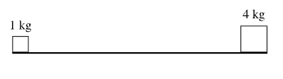
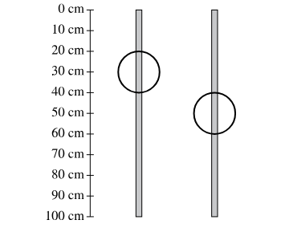
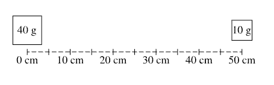

# Center of Mass

## The point on an object where a force exerted on the object pointing directly toward or away from that point, will not cause the object to turn. The location of this point depends on the mass distribution of the object. 

---

# Center of Mass

## The average location of all of the mass of an object. 

- $F_g$ is effectively exerted on the center of mass

---

# Center of Mass:

$$\boxed{\vec{x}_{cm} = \frac{\Sigma m_i \vec{x}_i}{\Sigma m_i}}$$

1) $\vec{x}_{cm}$ represents the position vector of the center of mass.
2) $m_i$ represents the mass of each individual object in the system.
3) $\vec{x}_i$ represents the position vector of each individual object.
4) $\Sigma m_i \vec{x}_i$ in the numerator means: multiply each object's mass by its position vector, then sum these products for all objects in the system.
5) $\Sigma m_i$ in the denominator is the total mass of the system (the sum of all individual masses).

---

## For a 1-dimensional case with objects along a line, this simplifies to:

$$x_{cm} = \frac{m_1 x_1 + m_2 x_2 + m_3 x_3 + ... + m_n x_n}{m_1 + m_2 + m_3 + ... + m_n}$$

---

#### Example Questions 

A block with mass 1 kg rests on the left end of a board with negligible mass and a block with mass 4 kg rests on the right end of the board, as shown. The board is placed on a fulcrum (not shown) so that the fulcrum is at the center of mass of the two-block system and the board balances in the horizontal position shown. A third block is then placed at the center of the board. In which direction, if any, must the fulcrum be moved so it will be at the center of mass of the three-block system?

A. To the left

B. To the right

C. The fulcrum will not need to be moved.

D. It cannot be determined without knowing the mass of the third block.

<!---Answer A
Correct. The center of mass of the two-block system is closer to the 4 kg block. When the third
block is placed at the middle, its mass is to the left of the original center of mass, so the new
center of mass must be to the left of the original center of mass.
--->

---

<!---_class: rose --->

In the left figure, a ring is attached to a board of uniform density. The ring is then moved and reattached so it is centered on the board, as shown in the right figure. The ring and the board have non-negligible masses. Which of the following could be a possible value of the change in the location of the center of mass of the ring-board system between the left and right figures?

A. Zero

B. 10 cm

C. 20 cm

D. 30 cm

 

<!---Answer B
Correct. In the left figure, the center of mass of the ring-board system must be between the center
of mass of the ring (at 30 cm) and the center of mass of the board (at 50 cm). In the right figure,
the centers of mass of the board and the ring are both at cm, so the center of mass of the
system is at 50 cm. Therefore, the change in the center of mass must be less than 20 cm but
greater than zero.
--->

---

Three cars are at rest on a 50 meter long bridge. Car A, with mass 1,000 kg, is 5 meters from the left end of the bridge; Car B, with mass 500 kg, is 20 meters from the left end of the bridge; and Car C, with mass 2,000 kg, is 45 meters from the left end of the bridge. How far from the left end of the bridge is the center of mass of the three-car system located?

A. 20 meters

B. 23 meters

C. 25 meters

D. 30 meters

<!---

Answer D
Correct. Let x = 0 be the left end of the bridge. The equation for the center of mass yields:
mtot
(1000 kg) (5 m) + (500 kg) (20 m) + (2000 kg) 45 m) = 30 m
3500 kg

--->

---

A 40 g block and a 10 g block are placed along a track, as shown. The 40 g block is on the 0 cm mark at the left end of the track. The 10 g block is located at 50 cm. At what position on the track is the center of mass of the two-block system?

A. 12.5 cm

B. 25 cm

C. 10 cm

D. 0 cm

<!---
Answer C
Correct. The center of mass position is found by substituting values into the appropriate equation:
Xcom =
Emi_ (40 g)(0 cm) + (10 g) (50 cm) = 10 cm.
Limi (40 g) + (10 g)
--->