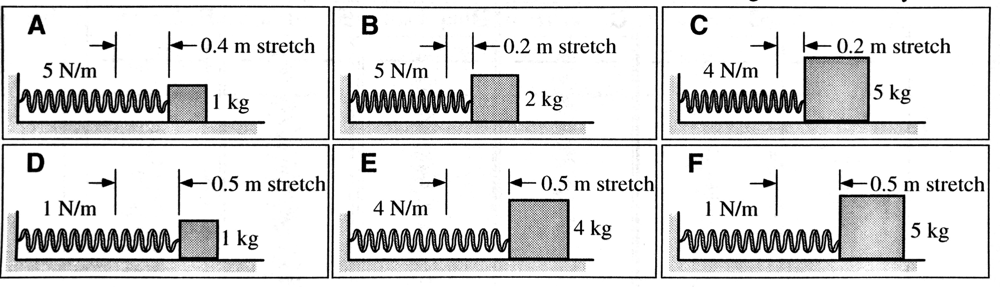
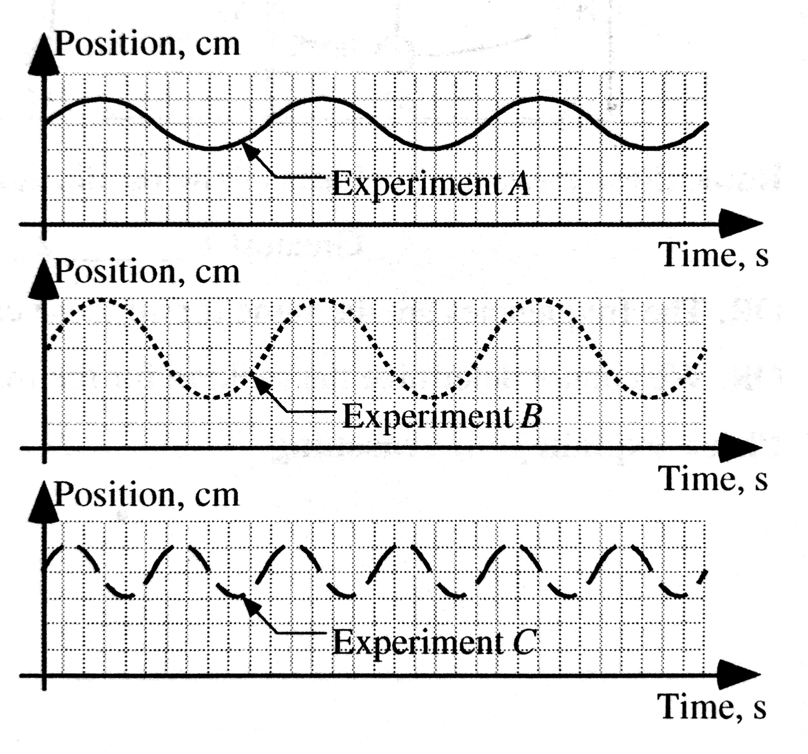

<!-- _class: invert -->

# <!--fit---> Periodic Motion

## <!--fit---> Any motion that repeats itself
### <!---fit---> Oscillation - periodic motion of something moving back-and-forth

<!--
Pendulums of bowling balls have slightly different quantities that allow them to have different periods

Examples: A rocking chair, a swing, the pendulum of a grandfather
clock, the strings on a guitar, the wings of a mosquito all
oscillate. At the atomic level, atoms oscillate inside solids.
At the cosmic level, the entire universe may oscillate in an
ever-repeating cycle of expansion and contraction.
-->

---

# Vibrational Motion

#### Equilibrium Position

The position at which a vibrating object resides when not distrubed. When resting at this position, the sum of the forces that other objects exert on it is zero. During
vibrational motion the object passes back and forth through its position from two opposite directions.

#### Restoring Force

When an object is displaced from equilibrium, some other object exerts a force with a component that always points opposite the direction of the vibrating object's displacement from equilibrium.

This force tends to restore the vibrating object back toward equilibrium.

---

# Vibrational Motion

#### Amplitude

The amplitude of a vibration is the maximum displacement of the vibrating object from its equilibrium position.

---

# Vibrational Motion

#### Period

The period $T$ of a vibrating object is the time interval needed for the object to make one complete vibration--from clock reading when it passes through a position while moving in certain direction until the next clock reading when it passes through that *same* position moving in the *same* direction. Unit of period is the second.

#### Frequency

The frequency $f$ of vibrational motion is the number of complete vibrations of the
system during one second. The frequency is related to period:

$$f = \frac{1}{T} $$

The unit for frequency is the hertz (Hz), where 1 Hz = 1 vib/s = 1 s$^{-1}$

---

#### [Kinematics](http://physics.bu.edu/~duffy/HTML5/mass_on_spring_graphs.html)

<iframe style="width: 100%; height: 90%; overflow: hidden;" src="http://physics.bu.edu/~duffy/HTML5/mass_on_spring_graphs.html" width="100" height="100" scrolling="no">Iframes not supported</iframe>

---

# Simple Harmonic Motion

Defined as periodic motion that produces a sinusoidal position vs. time graph.

Or another textbook definition:

*A object executing simple harmonic motion is subject to a linear restoring force that tends to return the object to its equilibrium position and is linearly proportional to the object’s displacement from its equilibrium position.*

AP Equation:

$$\boxed{x = A \cos(2\pi f t)}$$

Also: $\omega = 2\pi f$ so $x = A \cos(\omega t)$

<!--
$\omega$ is the angular speed, but in terms of SHM we refer to it as the angular frequency

This is NOT the same as frequency -- can think of it as the radian equivalent -- cycles to radians, remember your circle (1 circle is 2 pi radians)
-->

---

#### [Energy](http://physics.bu.edu/~duffy/HTML5/mass_on_spring_energy.html)

<iframe style="width: 100%; height: 90%; overflow: hidden;" src="http://physics.bu.edu/~duffy/HTML5/mass_on_spring_energy.html" width="100" height="100" scrolling="no">Iframes not supported</iframe>

---

# Spring Dynamics

## Period:

$$ \boxed{T_s = 2\pi \sqrt{\frac{m}{k}}} $$

## Frequency:

$$ f_s = \frac{1}{2\pi} \sqrt{\frac{k}{m}} $$

---

# Simple Harmonic Motion

Simple harmonic motion is typified by the motion of a mass on a spring when it is subject to the linear elastic restoring force given by Hooke's Law.

---
<!-- _class: invert -->

# Pendulum:

## Does a pendulum fit into our vibrational motion model?

## What would the damping force be?

## What factors would affect the period?

---
<!-- _class: invert -->

# Period of a Pendulum

Possibe Factors:

  * Gravitational field strength
  * length of string
  * mass of bob

---

<!-- _class: invert -->

# Period of a Pendulum

Possibe Factors:

- Gravitational field strength
- length of string
- ~~mass of bob~~

# $\boxed{T_p = 2\pi \sqrt{\frac{\ell}{g}}}$

---

# What about Friction?

- Would you masses in lab oscillate forever?
- Does this change the period?
- How would the position vs. time graph change?
- This idea is called ***damping***

---

#### [Damping](http://physics.bu.edu/~duffy/HTML5/mass_on_spring_damped.html)

<iframe style="width: 100%; height: 90%; overflow: hidden;" src="http://physics.bu.edu/~duffy/HTML5/mass_on_spring_damped.html" width="100" height="100" scrolling="no">Iframes not supported</iframe>

<!--

Damping will just decrease the the amplitude, but not change the Period
--->

---

# Test Yourself:

The figures below show systems containing a block resting on a frictionless surface and attached to the end of a spring. The springs are stretched to the right by a distance given in each figure and then released from rest. The blocks oscillate back and forth. The mass and force constant are given for each system.

**Rank the systems on the basis of the frequency of vibratory motion.**

---

**Test Yourself:** A frictionless cart of mass $m$ is attached to a spring with spring constant $k$. When the cart is displaced from its rest position and released, it oscillates with period $T$ that is given by $T = 2 \pi \sqrt{\frac{m}{k}}$. The graph of the position of the cart as a function of time is shown below for Experiment A. Graphs for two other experiments are shown below this. The same spring is used in all three experiments. 

Compared to Experiment A, in Experiment B the cart has:

1. twice as much mass
2. four times as much mass
3. one-half the mass
4. one-fourth the mass
5. the same mass

---

**Test Yourself:** A frictionless cart of mass $m$ is attached to a spring with spring constant $k$. When the cart is displaced from its rest position and released, it oscillates with period $T$ that is given by $T = 2 \pi \sqrt{\frac{m}{k}}$. The graph of the position of the cart as a function of time is shown below for Experiment A. Graphs for two other experiments are shown below this. The same spring is used in all three experiments. 

Compared to Experiment A, in Experiment C the cart has:

1. twice as much mass
2. four times as much mass
3. one-half the mass
4. one-fourth the mass
5. the same mass

---

Suppose that for a fourth experiment (Experiment D), the mass used in Experiment A was doubled and the spring was replaced with a spring with double the spring constant. The period in Experiment D would be:

1. twice as much mass
2. four times as much mass
3. one-half the mass
4. one-fourth the mass
5. the same mass

