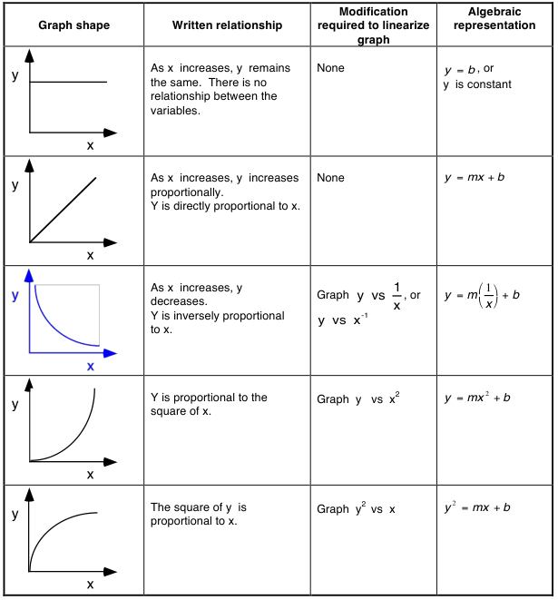

# Motion 🚗 <!--fit--->

## A Descriptive *Model* for Particles 

### AP Physics 2023-24 with Mr. Porter

---
<!-- _class: --->

# Fan Carts

## 1. Observations 
## 2. Questions
## 3. Measurements

---

# Essential Questions 🤔 <!--fit--->

## *Does your object **change** its **velocity***?

## *If it does change velocity, does the **velocity change constantly***?

- What evidence do you need to collect to answer these questions?

---

# Some New Tools 🧰 🛠️ <!--fit-->

---

# Video Upload 📹

1. Record video with you phone 📱
2. Sign into Pivot and Upload Video 📤
3. Scale to something in video to known size 📏
4. Use Built in tools ⏱️

## Tips:

- Take video perpendicular to motion
- Keep video device as still has possible (i.e. put on something, don't hold in hands)

---

# Spark Timer 🎇

1. Tape spark tape to object
2. Pick time setting 
3. Turn on timer & object and send it 

---

<!--fit---> # Essential Questions 🤔 

## *Does your object **change** its **velocity***?

## *If it does change velocity, does the **velocity change constantly***?

- What evidence do you need to collect to answer these questions?

---

# Finding Velocity from Position time Graphs 

❗ Reminder: the slope at a specific time on a position vs. time graph is the **instantaneous velocity** of an object

🤔 How do we find the slope of a curve?

---

# Finding Velocity from Position time Graphs 

<iframe src="https://www.desmos.com/calculator/bfyznrfmgh" width="1150px" height="500px" style="border: 1px solid #ccc" frameborder=0 ></iframe>

---

# Pivot & Rate of Change 

Pivot will calculate these slopes for you with its **rate of change** function. We can accomplish it with a calculated column

**NOTE**: This only works when time intervals are the same (i.e. time between samples is 0.1 s)

---

---

# How does the *Rate of Change* function work?

Calculates slope over three data points and assigns that value to the middle time. 

---

# Create a **Velocity vs. Time** Graph from your Data <!--fit--->

---

# From your **Velocity vs. Time** Graph...

## *Does your object **change** its **velocity***?

## *If it does change velocity, does the **velocity change constantly***?

- What does the slope represent? 
- What does the intercept represent?

---

# What about Position and Time?

## What is the relationship betwen position and time?

## How do we know what curve to pick??

---

# Linearization 

## _Finding the linear approximation of a function_

---

# Why? 

1. Verify a certain relationship (i.e. determine if your selected curve fit is the relationship)
2. You expect your data has a certain relationship and want to determine a parameter. 
3. You are trying to find an unknown relationship between two variables. 

---

# Linearizing allows us to interpret <!--fit--->

# curves as **lines** <!--fit--->

---

# How do we change a curve into a line?

## *By making a test plot*

1. Make a new data column
2. Calculate the expected relationship in that column (i.e. if the graph looks quadratic calculate $x^2$)
3. Make a new plot (i.e. graph $y$ vs. $x^2$)
4. Analyze new linear model 

---

# Cheat Sheet 

---

# Lab Summary 

* Slope of the Velocity vs. Time graph is ***acceleration***
* ***Acceleration*** is measured in m/s/s or m/s$^2$
* ***Slope*** of the ***Position vs. Time$^2$*** is $\frac{1}{2}$ of the ***acceleration***

---

# General Mathematical Models:

* For this lab (with no initial position or initial velocity):
  - $v_x = at$
  - $x = \frac{1}{2}at^2$

* For an object with an initial velocity and initial starting point:
  - $v_x = v_{x0} + at$
  - $x = x_0 + v_{x0}t + \frac{1}{2}at^2$

---

# Defintions & Notes

* ***Displacement*** indicates how far an object ends up from its initial position, regardless of its total distance traveled.
* ***Average velocity*** is displacement divided by the time interval over which that displacement occurred.
* ***Instantaneous velocity*** is how fast an object is moving at a specific moment in time.
* ***Acceleration*** tells how much an object’s speed changes in one second.
  - When an object speeds up, its acceleration is in the direction of motion.
  - When an object slows down, its acceleration is opposite the direction of motion.

---

<!--- _footer: . --->

# **Position-time graphs**

* To determine how far from the detector an object is located, look at the vertical axis of the position-time graph.
* To determine how fast an object is moving, look at the steepness (i.e. the slope) of the position-time graph.
* To determine which way the object is moving, look at which way the position-time graph is sloped.
* A position-time slope like a front slash / means the object is moving away from the detector.
* A position-time slope like a back slash \ means the object is moving toward the detector
* Instantaneous velocity is found by taking the slope of the tangent line to a position-time graph

---

<!--- _footer: . --->

## **Velocity-time graphs**

* To determine how fast an object is moving, look at the vertical axis of the velocity-time graph.
* To determine which way the object is moving, look at whether the velocity-time graph is above or below the horizontal axis.
* An object is moving away from the detector if the velocity-time graph is above the horizontal axis.
* An object is moving toward the detector if the velocity-time graph is below the horizontal axis.
* To determine how far an object travels, determine the area between the velocity-time graph and the horizontal axis.
* On a velocity-time graph it is not possible to determine how far from the detector the object is located.
* Most everyday motion can be represented with straight segments on a velocity-time graph.

---

