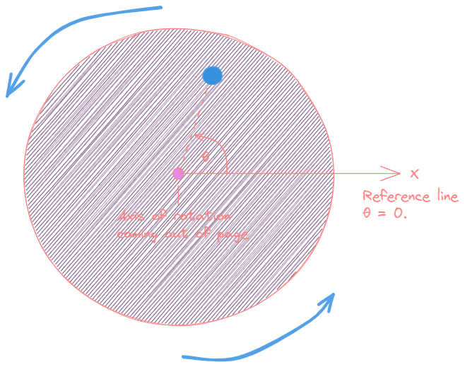

# Rotational Motion 🎡 <!--fit--->

## A Descriptive *Model* for ***Rotating Bodies*** 

### AP Physics 2023-24 with Mr. Porter

---

# Rotational Position $\theta$ (theta)

The **rotational position** **$\theta$** of a point on a rotating object (sometimes called angular position) is defined as an angle in the counterclockwise direction between a reference line (usually the positive x-axis) and a line drawn from the axis of rotation to that point. The units of rotational position can be either degrees or radians.

---

<!---_class: inverse --->

# Measuring Angular Position & Displacement 

* $\Delta s$ ➡️ arc length (distance)
* $r$ ➡️ radius
* $\Delta \theta$ ➡️ angular displacement

## Radians 

- Angular values are most often measured in **radians** 

---

<!---_class: inverse --->

# Radian Visualization 

---

# Some Common Radian measurements: 

- 1 rad = rotate the radius of the circle 
- $\pi$ rad = 1/2 rotation 
- $2\pi$ = 1 rotation 
- $\frac{\pi}{3}$ = 60$^\circ$
- $\frac{\pi}{6}$ = 30$^\circ$

---

# Why use radians?

## Because it makes it easy to convert from angular values to linear equivalents

### If 

$$\Delta \theta = \frac{s}{r}$$

### Then 

$$ s = r \Delta \theta$$

---

# Try representing ⌚

Your analog watch with hour and minute hand reads 3:30. What is the rotational position of each of these hands?
(Use a reference line from the axis of rotation through the 12:00 position. Assume that the hour hand points directly at the 3.)

---

# Try Representing 🕥

What are the angular positions of the clock right now? Estimate in radians. 

---

# Rotational Velocity $\omega$ (omega)

The ***average rotational velocity*** (sometimes called ***angular velocity***) of a turning rigid body is the ratio its change in rotational position $\Delta \theta$ and the time interval $\Delta t$ needed for that change:

$$\omega = \frac{\Delta \theta}{\Delta t}$$

The sign of $\omega$ (omega) is positive for counterclockwise turning and negative for clockwise turning, as see looking along the axis of rotation. *Rotational (angular) speed* is the magnitude of the rotational velocity. The most common units for rotational velocity and speed are radians per second (rad/s) and revolutions per minute (rpm).

---

# Angular vs. Linear (Tangential) Velocity 

---

# Translating Between Angular and Linear Velocity 

$$v = \frac{\Delta s}{\Delta t}$$

Remember, $\Delta \theta = \frac{\Delta s}{r}$, 
so we can substitute in $\Delta s = \Delta \theta r$, 
which gives...

$$v = \frac{r \Delta s}{\Delta t} =r \omega$$

---

# How Fast Does a Car Tire Spin?

## Calculate the angular speed of a 0.300 m radius car tire when the car travels at 15.0 m/s?

---

# Rotational Acceleration 

The average ***rotational acceleration $\alpha$*** (alpha) of a rotating rigid body (sometimes called ***angular acceleration***) is its change in rotational velocity $\Delta \omega$ during a time interval $\Delta t$ divided by that time interval:

$$a = \frac{\Delta \omega}{\Delta t}$$

The unit of rotational acceleration is (rad/s)/s = rad/s$^2$

---

# Translating between linear and rotational...

| Rotational | Linear | Relationship           |
| ---------- | ------ | ---------------------- |
| $\theta$   | $x$    | $\theta = \frac{x}{r}$ |
| $\omega$   | $v$    | $\omega = \frac{v}{r}$ |
| $\alpha$   | $a$    | $\alpha = \frac{a}{r}$ |

---

# Kinematic Equations 

| Rotational                                      | Linear                            |
| ----------------------------------------------- | --------------------------------- |
| $\theta = \bar{\omega}t$                        | $x = \bar{v}t$                    |
| $\omega = \omega_0 + \alpha t$                  | $v=v_0 + at$                      |
| $\Delta \theta = \omega_0 + \frac{1}{2}at^2$    | $\Delta x = v_0t+\frac{1}{2}at^2$ |
| $\omega^2 = \omega_0^2 + 2\alpha \Delta \theta$ | $v^2 = v_0^2 + 2a\Delta x$        |

---

# Rotational Cross Diagram 

|Rotational | Cross | Diagram| 
|---|---|---|
| | $\Delta \theta$ | |
| $\omega_0$ | $\alpha$ | $\omega$ | 
| | $\Delta t$ | | 

--- 

# Rotational Motion Graphs 

- Same idea and concepts as Linear Motion:
  * Position $(\theta)$ vs. Time Slope = Velocity $(\omega)$
  * Velocity $(\omega)$ vs. Time Slope = Acceleration $(\alpha)$
  * Area of Velocity $(\omega)$ vs. Time = Displacement $(\Delta \theta)$