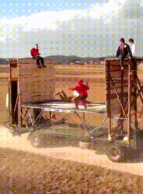
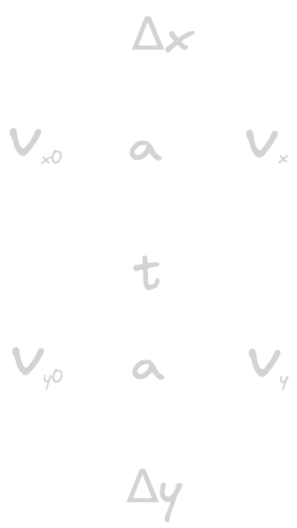
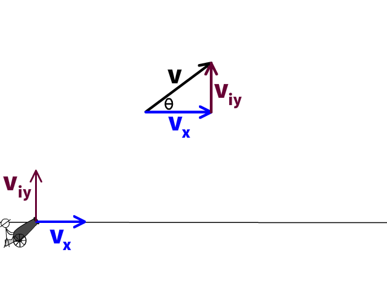
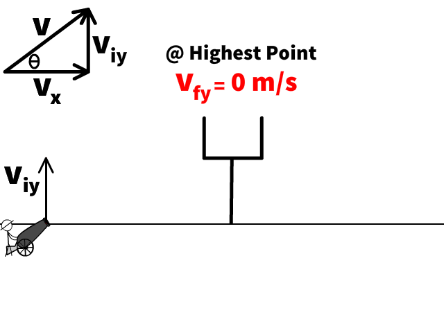

# Two Dimensional Motion <!--fit--->

## AP Physics 

### Mr. Porter

---

# Freefall 

<iframe width="1100" height="515" src="https://www.youtube.com/embed/E43-CfukEgs?si=8EBUCGY2lQHrCsZ1" title="YouTube video player" frameborder="0" allow="accelerometer; autoplay; clipboard-write; encrypted-media; gyroscope; picture-in-picture; web-share" referrerpolicy="strict-origin-when-cross-origin" allowfullscreen></iframe>

---

# Freefall

* An object in **freefall** is on object which is only acted on by the force of gravity
* Therefore, it accelerates at $g$ 
* $g$ is known as _the acceleration due to gravity_ 
* But is best to be called ***gravitational field strength***
* Direction of $g$ is towards the center of the planet (down)

---

<video height = "625" controls src="../videos/freefallfive.mov" title="Title"></video>

---

# Value of $g$ 

* On Earth it is about $9.8$ m/s$^2$
* This varies based on your distance from the center of the Earth, but doesn't vary much beyond $9.78$ to $9.83$ m/s$^2$. 
* On **quizzes and test** <u>including the AP Exam</u> we will round this to $10$ m/s$^2$ to allow for faster calculations. 
    * You will not be marked incorrect for using 9.8 m/s$^2$
* Physics Classroom website, which I often use for HW will use 9.8 m/s$^2$

---

# Freefall Problems 

1. A ball is released from rest from an elevated position and free-falls towards the ground. Assuming negligible air resistance, what is the ball's speed after 4.5 seconds?
2. A ball is released from rest from an elevated position and free-falls towards the ground. If it strikes the ground after 3.0 seconds, then what was the height from which the ball was released? Assume negligible air resistance.
3. A tennis ball cannon projects a ball vertically upward with an initial speed of 50 m/s. Assuming negligible air resistance, with what speed will the ball be moving after 3.0 seconds.

---

# Free Fall Derivation <!--fit--->

## Derive an expression for the amount of time **$t$** it takes an object to fall a vertical distance **$h$** when dropped (released from rest). 

---

# Projectiles 

---

# Projectile Motion 

_Projectile_ => object in the air undergoing free fall motion

 

---

# Horizontal **Projectiles** <!--fit--->

---

Two toy trucks roll off the ends of identical tables. The speeds and masses of the trucks are given.

**Will Truck A be in the air for (i) _a longer time_, (ii) a _shorter time_, or (iii) the _same time_ as Truck B before it reaches the floor?**

Explain your reasoning.

---

Two toy trucks roll off the ends of identical tables. The speeds and masses of the trucks are given.

**Will Truck A be in the air for (i) _a longer time_, (ii) a _shorter time_, or (iii) the _same time_ as Truck B before it reaches the floor?** Explain your reasoning.

---

# **Launcher** Demo <!--fit--->

---

# What are the three possible outcomes?

1) Right ball ($v_x > 0$) hits first 
2) Left ball ($v_x =0$) hits first 
3) Balls hit at the same time 

---

# What does each result imply about the **horizontal velocity's** effect on **flight time**?

1. Right ball ($v_x > 0$) hits first 
2. Left ball ($v_x =0$) hits first 
3. Balls hit at the same time 

---

# Projectiles 

* A ***projectile*** is an object that *only* experiences a gravitational force
* We can separate motion in the $x$ and $y$ planes and solve separately

 

 

 

---

# Projectiles 

---

#  Projectiles 

## X-Plane Motion

- $v_x$ is ***constant***

$$\Delta x = v_x t$$

## Y-Plane Motion 

- constant acceleration $a_y = g$

$$\Delta y = v_{y0}t + \frac{1}{2}gt^2$$

$$v_y = v_{y0} + gt$$

$$v_y^2 = v_{y0}^2 + 2g\Delta y$$

---

# Horizontal Projectiles 

- $v_{y0} = 0 m/s$ => means we treat y-motion as if the object is dropped

---

# Double Cross Diagram 

_A soccer ball is kicked horizontally off a 22.0-meter high hill and lands a distance of 35.0 meters from the edge of the hill. Determine the initial horizontal velocity of the soccer ball._

---

# Practice 

In many locations, old abandoned stone quarries have become filled with water once excavating has been completed. While standing on a quarry wall, a boy tosses a piece of granite into the water below. If he throws the rock horizontally
with a velocity of 3.0 m/s, and it strikes the water 4.5 meters away, how high above the water is the wall?

---

# Practice w/ Table 

Suppose that an airplane flying 60 m/s, at a height of 300 meters, dropped a sack of flour. How far from the point of release would the sack have traveled when it struck the ground? Where will the plane be in relation to the sack when it hits the ground?

---

### 🔑 **Key Ideas**:

## A projectile is an object with the following characteristics:

* The only force acting on it is the gravitational force; it is a free-falling object
* The acceleration is directed downwards and has a magnitude of $9.8 \text{ m/s}^2$
* Once projected, it continues its horizontal motion without any need of a force
* As it travels through the air, its horizontal velocity remains constant
* As it rises, its vertical velocity ($v_y$) decreases; as it falls, its $v_y$ increases

---

# **Think Sheet:** #1-8, 12-14 <!--fit--->

---

# <!--fit---> **Lab:** Marble Mini-Experiment

1. Determine the launch velocity of your marble.

Equipment:

- Ruler track
- Marble
- Carbon paper
- Meterstick

2. Use to predict landing spot from new height (like off top of cabinets)

---

Rank the situations from the ***greatest to least time*** that it will take for the sphere to hit the ground. Make your ranking on a single line, using > and = signs. Ties are possible.

Rank the situations from the ***greatest to the least horizontal distance*** that the sphere will travel. Make your ranking on a single line, using only the > and = signs. Ties are possible.

---

# Projectiles <!--fit--->
# Fired at an **Angle** <!--fit--->

---

# Velocity as a 2-Dimensional Vector

---

# Components 

- The X-axis velocity component ($v_x$) is constant and will not accelerated so it will stay the same the entire flight
- The initial Y-axis velocity component will change as it accelerated by gravity 9.8 m/s² down. This is why we say ($v_{iy}$) and not just $v_y$ because it will change throughout the problem.

---

# Finding Vector Components

Practice: Find the x & y components of the following velocities...

1. A water balloon is launched with a speed of 40 m/s at an angle of 60 degrees to the horizontal.
2. A motorcycle stunt person traveling 70 mi/hr jumps off a ramp at an angle of 35 degrees to the horizontal.
3. A springboard diver jumps with a velocity of 10 m/s at an angle of 80 degrees to the horizontal.

---

# Projectile Fact Reminders

 

---

# **Some Projectile Reminders & Facts:**

* When an object is in free-fall,
  - its **VERTICAL acceleration** is always $g$ or $10 \text{ m/s}^2$ near the surface of the earth.
  - its **HORIZONTAL acceleration** *is always zero*. Meaning the only equation you use for the horizontal motion is $\Delta x=vt$ 
* Velocities in perpendicular directions add with the Pythagorean theorem

* The magnitude of an object's velocity is known as its speed

---

## Some More Reminders from Free Fall 

* $a_y = g = -9.8 \text{ m/s/s}$ &rarr; Always when near the surface of the Earth
* If object is _dropped_ $v_{iy} = 0$ 
* If object is projected upwards it will slow down as it rises. The y-velocity will be zero at its heights point or peak
    * You can treat $v_{fy} =0$ at the peak
* If an object is projected upwards the velocity at which it is projected is equal and magnitude and opposite in direction when it returns to its initial height. 
    * i.e. a ball projected upwards at $+30 \text{m/s}$ will have a downward velocity of $-30 \text{m/s}$ when it returns to its launch height

---

# Problem-Solving Approach

1. Find $v_x$ and $v_{0y}$
2. Make double cross diagram & determine problem solving approach
    - often involves finding flight time first
3. Solve

---

# Together

## A long jumper leaves the ground with an initial velocity of **$12\textrm{ m/s}$** at an angle of **$28\textrm{-degrees}$** above the horizontal. 

Determine 
1. the time of flight 
2. the horizontal distance
3. the peak height of the long-jumper

---

# Thought experiments 🤔 

1. On flat ground, which launch angle will give the maximum range?
2. Can do different angles give the same range? What angles?

---

# Practice Time <!--fit--->

# [Turd the Target 💩](https://www.physicsclassroom.com/Physics-Interactives/Vectors-and-Projectiles/Turd-the-Target-2/Turd-the-Target-2-Interactive) <!--fit--->

---
---

# [Concept Checker](https://www.physicsclassroom.com/Concept-Checkers/Interactives/Projectile-Simulator-3/Concept-Checker) 🤔 ✔️ <!--fit--->

