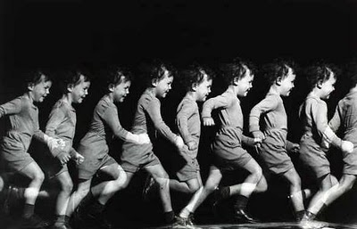
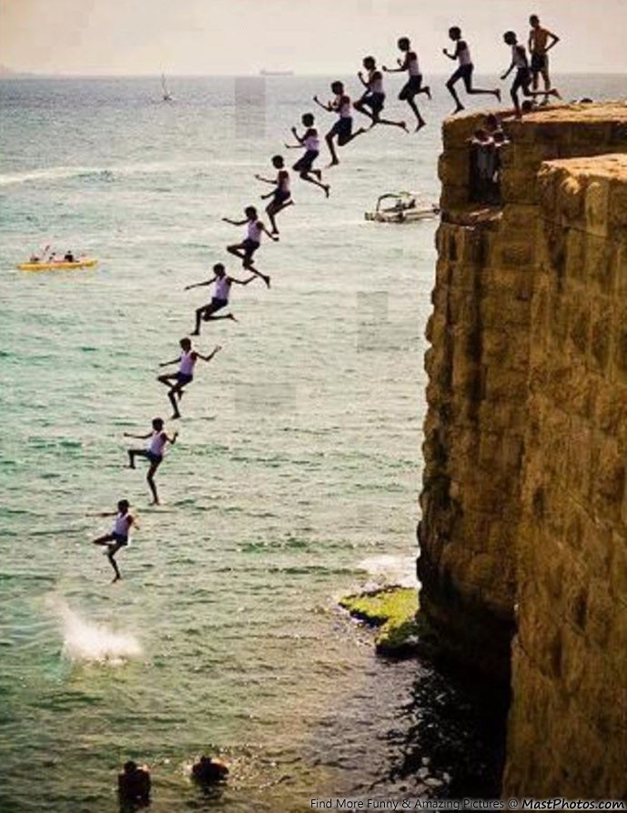
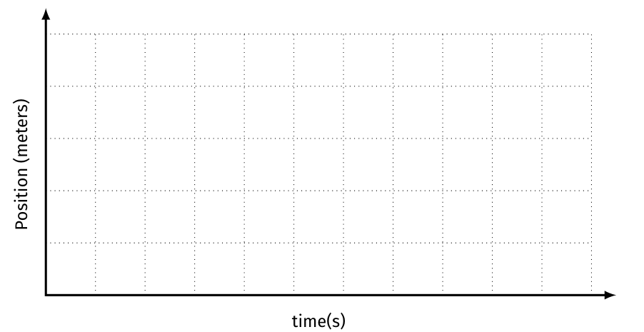

# Motion 🚗 <!--fit--->

## A Descriptive *Model* for Particles 

### AP Physics 2023-24 with Mr. Porter

---

# Lab Results:

* The buggies moved with a ***constant velocity***
    * means that it changed its *position* equal amounts for each equal change in *time*
* ***Velocity*** ($\bar{v}$) is represented by the *slope* of the position vs. time graph
    * how "fast"
    * AND what direction
* ***Speed*** is the steepness of the slope:
    * it tells us the rate that position changes with time
    * steeper slope == faster
* The **initial position** ($x_0$ or $y_0$) of the object is the vertical intercept
    *  it tells us where the object is at clock reading 0.

---

# Mathematical Models 

#### General Mathematical Mode:

$$x = \bar{v}t + x_0$$

#### Specific Mathematical Model (example):

$$x = (25 \textrm{ cm/s})t + 250 \textrm{ cm}$$

#### Narrative Model:

*"The toy car started at a position of 250 cm and moved in the positive direction at a speed of 25 cm/s."*

--- 

# Defining "How Far"

### Who went further? Dorothy or Toto?

---

### Displacement

- Change in position of an object
- $\Delta x = x_f - x_0$
- Includes direction

### Distance

- the **magnitude** (or size) of displacement between two positions
- more often referred to as **distance traveled** which is the total length of the path traveled between two positions

### Position
- Where an object is at any particular time
- "Location"

---

---

# CER in AP Physics:

* ***Claim***:
    * Sentence that answers the question.

* ***Evidence***:
    * Explanation of how the evidence supports the claim.
        * Should include details!
        * Refer back to the question, include any data, diagrams, or graphs.

* ***Reasoning***:
    * Physics principle, such as an equation, law, or definition.
        * This is general, do no include specific details.

---

# Game: Soup, Salad, or Sandwich

1. Write a Claim-Evidence-Reasoning statement arguing whether the shown food is a soup, salad, or a sandwich. 

---

<!-- class: invert --->

# Soup, Salad, or Sandwich?

---

<!-- class: invert --->

# Soup, Salad, or Sandwich?

---
class: invert

# Soup, Salad, or Sandwich?

---
<!-- class:  --->

# Soup, Salad, or Sandwich?

---

# CER 

## Does the object in the image move with a ***constant velocity***?

---

---

---

---

---

---

---

---

# Motion Maps - Represent this pictorially:

---

## Motion Maps

---

---

.png)

---

.png)

---

.png)

.png)

---

## Try it...

.png)

---

.png)

---

## Practice: Complete individually and compare

Given the following position vs. time graph

1. Draw a motion map with one dot for each second
2. Describe the motion in worsds

---

## More Practice 

Given the following motion map, where positions have been recorded with one dot each second, 

1. Draw a position vs. time graph 
2. Describe the motion of the object in words

---

# Motion Sensor Lab <!--fit--->

---

# Mathematical Modeling & Making Predictions 

## Constant Velocity Particle Model 

$$ x = \bar{v}t + x_0 $$ 

* $x$ ➡️ final position 
* $\bar{v}$ :arrow_right: constant velocity 
* $t$ ➡️ time 
* $x_0$ ➡️ initial position 

---

# Analyzing Position-Time (XT) Graphs

### For the following position vs. time graph, consider the positive direction to be north.

1. When is the object moving North? South?
3. When is the object stopped?
4. When is the object North of the origin?
5. What is the velocity of the object at $t = 1$ s? $t = 2.5$ s? $t = 4$ s? When it is at the origin?

---

# Analyzing Position-Time (XT) Graphs

5. When does the obejct change directions?
8. What is the total *distance* the object travels?
9. What is the total *displacement* of the object?
10. What is the *average veloctity* of the object?
11. What is the *average speed* of the object?

---

# Average Velocity 

Dispalcement divided by the change in time. 

$$ \bar{v} = \frac{\Delta x}{\Delta t}$$

_"The average slope of the graph"_

# Average Speed 

Total distance divided by change in time 

$$ |v| = \frac{dist}{\Delta t}$$

---

# Instantaneous Values:

- _"at that moment"_
- Value at a specific time 

## Instantaneous Velocity

- Velocity at a specific time
- The slope of the position vs. time graph ***at that time measurement***

## Instantaneous Speed

- Magnitude of the velocity 

---

# A racecar reaches a speed of **95** m/s after it is **450** meters past the starting line. If the car travels at a constant speed of **95** m/s for the next **12.5** seconds, how far will the care be from the starting line?

1. Sketch and label the situation 
2. Physics diagrams: position vs. time graph, motion map (qualitative)
3. Mathematically model
4. Solve 

---

## Mr. H waits patiently as two beetles race across the **35.8**-cm length of the cereal box. According to Mr. H's estimates, Beetle A averages **0.230** cm/s and Beetle B averages **0.454** cm/s. Beetle A has a **4.1**-cm 'head start' (when Beetle B is at the far edge of the box). What is the separation distance (in cm) between beetles when the first beetle reaches the end of the box?

1. Sketch and label the situation 
2. Physics diagrams: position vs. time graph, motion map (qualitative)
3. Mathematically model
4. Solve 
