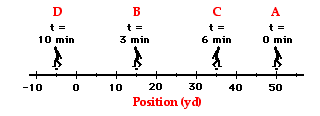
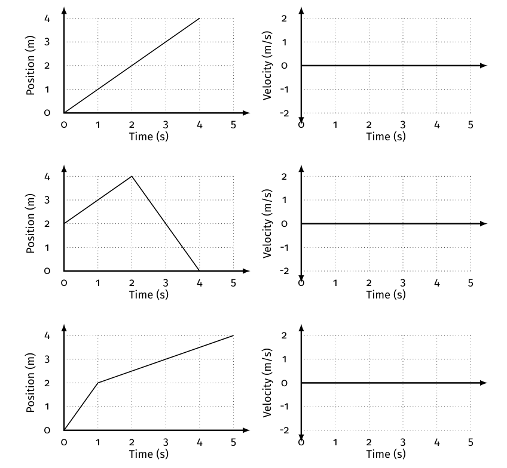

# Motion 🚗 <!--fit--->

## A Descriptive *Model* for Particles 

### Physics with Mr. Porter

---

* A ***constant velocity***
    * means that it changed its *position* equal amounts for each equal change in *time*
* ***Velocity*** ($\bar{v}$) is represented by the *slope* of the position vs. time graph
    * how "fast"
    * AND what direction
* ***Speed*** is the steepness of the slope:
    * it tells us the rate that position changes with time
    * steeper slope == faster
* The **initial position** ($x_0$ or $y_0$) of the object is the vertical intercept
    *  it tells us where the object is at clock reading 0.

---

# Mathematical Models 

#### General Mathematical Mode:

$$x = \bar{v}t + x_0$$

$$\textrm{position} = (\textrm{velociy})*\textrm{time}+ \textrm{initial position}$$

#### Specific Mathematical Model (example):

$$x = (25 \textrm{ cm/s})t + 250 \textrm{ cm}$$

#### Narrative Model:

*"The toy car started at a position of 250 cm and moved in the positive direction at a speed of 25 cm/s."*

--- 

# Defining "How Far"

### Who went further? Dorothy or Toto?

---

### Displacement

- Change in position of an object
- $\Delta x = x_f - x_0$
- Includes direction

### Distance

- the **magnitude** (or size) of displacement between two positions
- more often referred to as **distance traveled** which is the total length of the path traveled between two positions

### Position
- Where an object is at any particular time
- "Location"

---

# Describing Motion 

Each description should include:

* Starting position
* Direction of motion (positive direction, no motion, or negative direction)
* Type of motion (at rest, constant velocity, speeding up, slowing down or some combination of these)
* Relative speed (slow, medium, fast, slower, faster—this is only meaningful with there is more than one part of the motion or when you are comparing two or more objects)

---

# Lets Practice

### Describe the motion of each graph

---

# Lets Practice

### Describe the motion of each graph

---

# Lets Practice

### Describe the motion of each graph

---

# Lets Practice

### Describe the motion of each graph

---

# Lets Practice

### Describe the motion of each graph

---

# Lets Practice

### Describe the motion of each graph

---

# How Far?

## Position vs. Distance vs. Displacement

---

# Scalars vs. Vectors

* **Scalars** are quantities that are fully described by a magnitude (or numerical value) alone.
* **Vectors** are quantities that are fully described by both a magnitude and a direction.

---

# Distance and Displacement

* **Distance** is a **scalar quantity** that refers to "how much ground an object has covered" during its motion.
* **Displacement** is a **vector quantity** that refers to "how far out of place an object is"; it is the object's overall change in position.

---

# Example

A physics teacher walks 4 meters East, 2 meters South, 4 meters West, and finally 2 meters North.

- Distance = 4 m + 2 m + 4 m + 2 m = 12 m
- Displacement = 0 (didn't change position!)

---

# ✔️🤔

The diagram below shows the position of a cross-country skier at various times. At each of the indicated times, the skier turns around and reverses the direction of travel. In other words, the skier moves from A to B to C to D.

What is the Distance and Displacement of the skiier?

---

# ✔️🤔

What is the Distance and Displacement of the skiier?

The skier covers a distance of (180 m + 140 m + 100 m) = 420 m
and has a displacement of 140 m, rightward.

---

# ✔️🤔

Consider a football coach pacing back and forth along the sidelines. The diagram below shows several of coach's positions at various times. At each marked position, the coach makes a "U-turn" and moves in the opposite direction. In other words, the coach moves from position A to B to C to D.
 

What is the coach's resulting displacement and distance of travel? 

---

# ✔️🤔

What is the coach's resulting displacement and distance of travel? 

The coach covers a distance of

(35 yds + 20 yds + 40 yds) = 95 yards
and has a displacement of 55 yards, left.

---

# Average Velocity

$$ v = \frac{\Delta x}{\Delta t}$$

- $v$ -> velocity
- $\Delta x$ -> displacement
- $\Delta t$ -> time duration, or change in time

---

# Example

$$ v = \frac{\Delta x}{\Delta t}$$

---

# Example 2

$$ v = \frac{\Delta x}{\Delta t}$$

---

---

---

---

# Motion Maps

---

# Motion Maps 

 

---

# Motion Maps 

- Each dot represents **one unit of time**
- The numberline is the **position** of the object
- The separation of the dots and length of the arrow represents the **velocity** of the object 
- Stacked dots represent an object that is motionless

---

# Motion Map Practice 

---

# Motion Map Practice 

---

# Motion Map Practice 

---

# Motion Map Practice 

---

# Motion Map Practice 

---

## Practice: Complete individually and compare

Given the following position vs. time graph

1. Draw a motion map with one dot for each second
2. Describe the motion in words

---

## More Practice 

Given the following motion map, where positions have been recorded with one dot each second, 

1. Draw a position vs. time graph 
2. Describe the motion of the object in words

---

# Acceleration

## Acceleration is a ***vector quantity*** that is defined as the rate at which an object ***changes its velocity***. An object is accelerating if it is changing its velocity.

---

# Acceleration 

## is...

- increasing speed
- decreasing speed
- changing direction

 

## is not...

- "going fast"
- only speeding up 

---

# Meaning of Constant Acceleration 

---

# Examples of constant acceleration:

- Free fall motion
- Ball rolling down ramp

---

| **Time  Interval** | **Velocity Change During Interval** | **Ave. Velocity During Interval** | **Distance Traveled  During Interval** | **Total Distance Traveled from 0 s to End of Interval** |
| ---------------------- | ---------------------------------------- | -------------------------------------- | ------------------------------------------ | ------------------------------------------------------------ |
| 0 – 1.0 s              | 0 to ~10 m/s                             | ~5 m/s                                 | ~5 m                                       | ~5 m                                                         |
| 1.0 – 2.0 s            | ~10 to 20 m/s                            | ~15 m/s                                | ~15 m                                      | ~20 m                                                        |
| 2.0 – 3.0 s            | ~20 to 30 m/s                            | ~25 m/s                                | ~25 m                                      | ~45 m                                                        |
| 3.0 – 4.0 s            | ~30 to 40 m/s                            | ~35 m/s                                | ~35 m                                      | ~80 m                                                        |

---

# Calculating Average Acceleration 

$$ \bar{a} = \frac{\Delta \text{velocity}}{\text{time}} = \frac{v_f - v_i}{t}$$

## Example

$$ \bar{a} = \frac{v_f - v_i}{t} = \frac{50 \text{ m/s} - 0 \text{ m/s}}{5 \text{ s}} = \frac{10 \text{ m/s}}{1 \text{ s}}$$ 

### Units

- m/s/s or m/s$^2$
- mi/hr/s
- km/hr/s

---

# Direction of Acceleration 

* When an object is **speeding up** the velocity and acceleration are in the **same direction**
    - v (+) and a (+)
    - v (-) and a (-)
*   When an object is **slowing down** the velocity and acceleration are in the **opposite direction**
    - v (+) and a (-)
    - v (-) and a (+) 

---

# Direction of Acceleration (+)

---

# Direction of Acceleration (-)

---

# Direction of Acceleration 

---

# Velocity vs. Time Graphs <!--fit--->

---

# Area of VT Graph 

- Area "under the curve" represents the displacement (*change in position*) of the object. 
- Areas can be negative because that represents the direction

$$ \Delta x = \bar{v}{t} $$

- Add multiple segments together, including the sign to get the total displacement of a piecewise motion

---

### VT Graphs 

1. Draw the velocity vs. time graph for an object whose motion produced the position vs. time graphs shown below.
2. For many graphs, both the ***slope*** and ***area*** between the line and the horizontal axis have physical meanings. What does the ***slope*** of the position vs. time graph tell you about the motion of an object?

---

### VT Graphs 

3. Complete the following chart and show your work 

| | $\Delta x$ from XT Graph | Area "under the curve"  of VT Graph | 
|---|---|---|
|1 | | | 
|2|||
|3|||

---

## VT Graphs 

 
4. Looking at the velocity vs. time graphs, determine the units for a square of area on the graph. 
5. What does the "*area under the velocity-time graph*" tell you about the motion of the object?

---

# Area of VT Graph

1. Area = $\Delta x$ = $4$ m
1. Area = $\Delta x$ = $-2$ m
1. Area = $\Delta x$ =  $4$ m 

---

