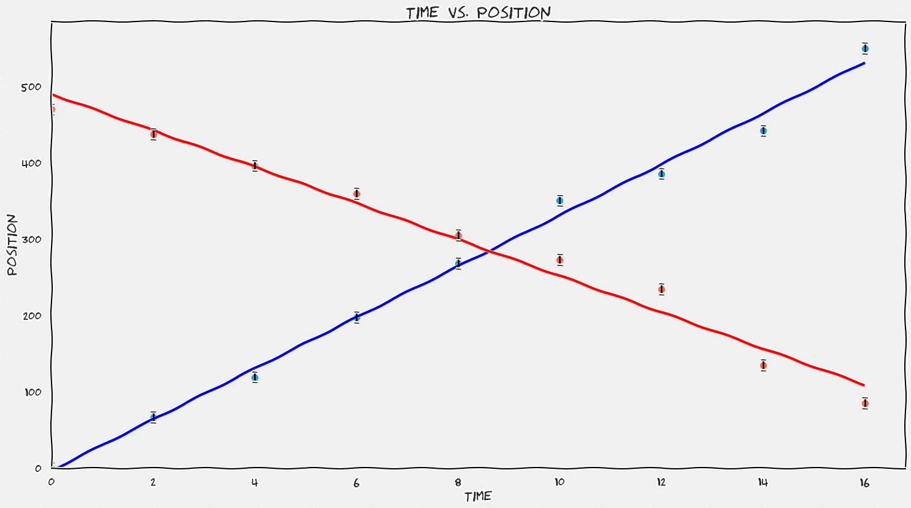
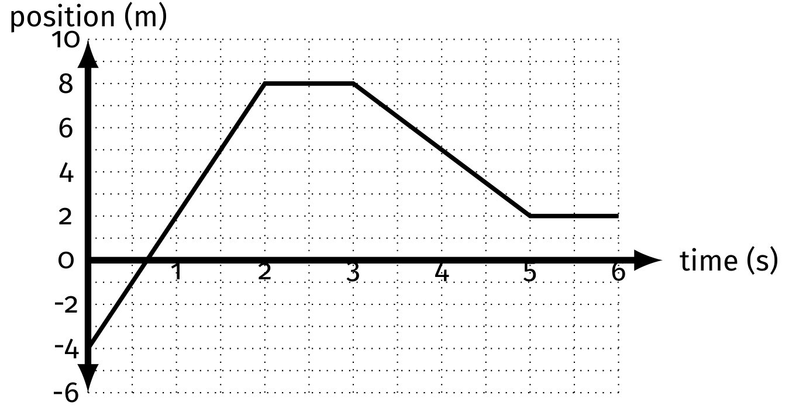
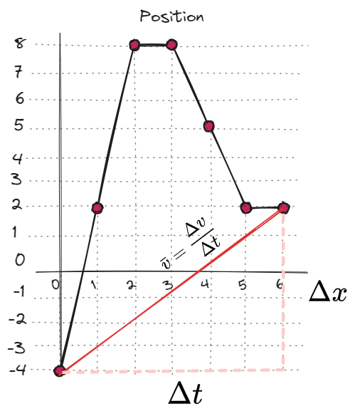
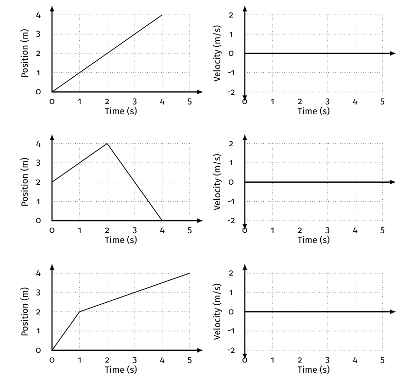
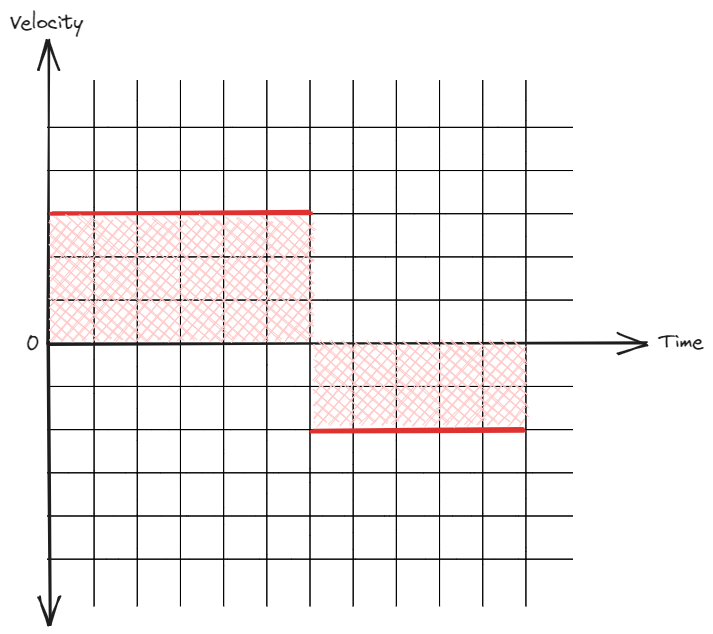
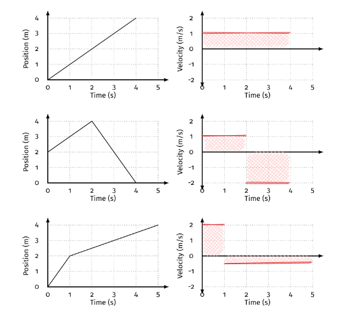
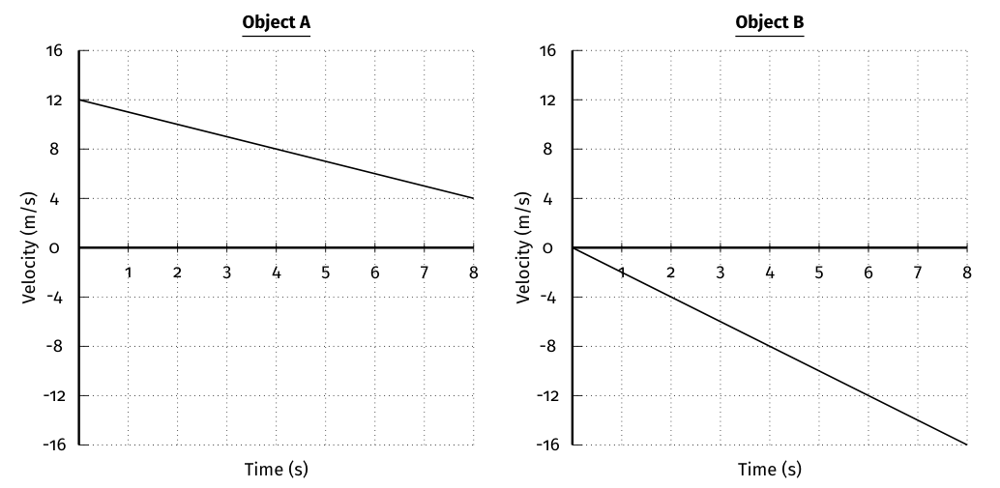
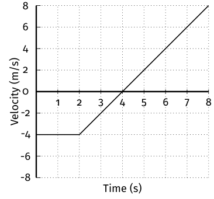
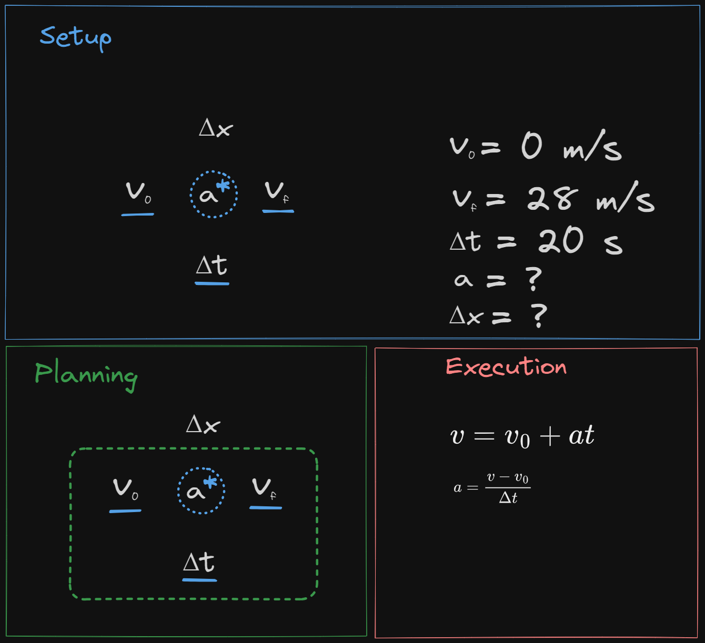
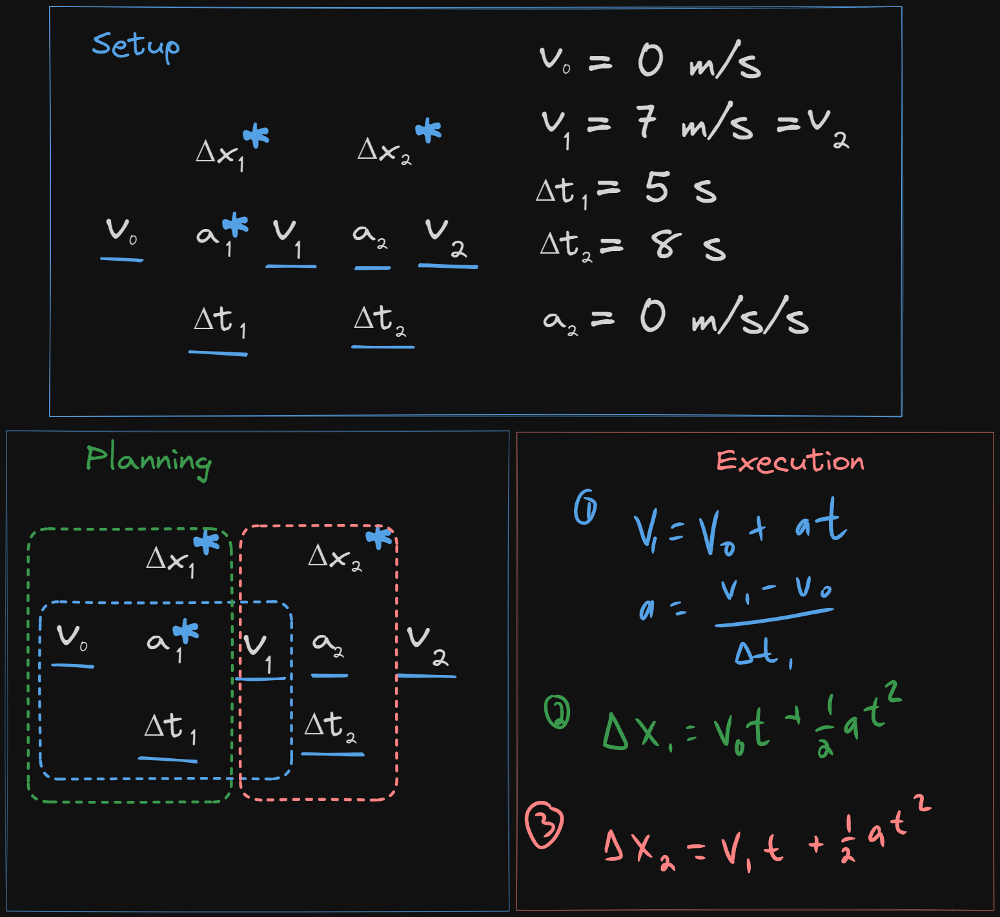

# Motion 🚗 <!--fit--->

## A Descriptive *Model* for Particles 

### AP Physics 2024-25 with Mr. Porter

---

### Contents

1. [Buggy Results](#lab-results)
2. [Average vs. Instantaneous](#average-vs-instantaneous)
3. [Velocity From XT](#finding-velocity-from-position-time-graphs)
3. [Linearization](#linearization)
4. [Linearization Cheat Sheet](#cheat-sheet)
6. [Fan Cart Lab Summary](#lab-summary)
11. [Fan Cart - Mini Lab](#fan-cart---mini-lab)
7. [Kinematic Definitions](#defintions--notes)
8. [Position Time Graphs](#position-time-graphs)
9. [Velocity Time Graphs](#velocity-time-graphs)
10. [Acceleration](#acceleration)
12. [Shapes of Graphs Summary](#shapes-of-graphs---summary)

 

13. [Mathematical Modeling & Predict](#mathematical-modeling--making-predictions)
14. [Velocity Time Graphs](#velocity-vs-time-graphs)
15. [More than Plug & Chug](#physics-is-more-than-plugging-numbers-into-equations)
16. [Kinematic Equations](#kinematic-equations)
17. [Kinematic Cross Diagram](#kinematic-cross-diagram-for-problem-solving)

---
# Buggy Lab 🚗

## Objective: 

* Determine if your toy buggy moves in a <U>consistent manner</u> by developing a relationship between ***position*** and ***time***. 
* Use ***time*** as your independent variable

---

---

---

# Lab Results:

* The buggies moved with a ***constant velocity***
    * means that it changed its *position* equal amounts for each equal change in *time*
* ***Velocity*** ($\bar{v}$) is represented by the *slope* of the position vs. time graph
    * how "fast"
    * AND what direction
* ***Speed*** is the steepness of the slope:
    * it tells us the rate that position changes with time
    * steeper slope == faster
* The **initial position** ($x_0$ or $y_0$) of the object is the vertical intercept
    *  it tells us where the object is at clock reading 0.

---

# Mathematical Models 

#### General Mathematical Mode:

$$x = \bar{v}t + x_0$$

#### Specific Mathematical Model (example):

$$x = (25 \textrm{ cm/s})t + 250 \textrm{ cm}$$

#### Narrative Model:

*"The toy car started at a position of 250 cm and moved in the positive direction at a speed of 25 cm/s."*

--- 

# Defining "How Far"

### Who went further? Dorothy or Toto?

---

# Vector vs. Scalar 

## Vector 

* Physical Quantity that describes *magnitude* (size) and *direction*
* indicated with an ➡️ above the symbol
    * i.e. $\vec{v}$ or $\vec{p}$ or $\Delta\vec{x}$

## Scalar 

* Physical quantity that describes the *magnitude* (size) of something

---

### Displacement

- Change in position of an object
- $\Delta x = x_f - x_0$
- Includes direction (***vector quantity***)

### Distance

- the **magnitude** (or size) of displacement between two positions (***scalar quantity***)
- more often referred to as **distance traveled** which is the total length of the path traveled between two positions

### Position
- Where an object is at any particular time in coordinate system (***vector***)
- "Location"

---

# Speed vs. Velocity:

* **Velocity** is a ***vector*** quantity
    - how fast and what direction
* **Speed** is a ***scalar*** quantity
    - how fast

---

# Analyzing Position-Time (XT) Graphs

### For the following position vs. time graph, consider the positive direction to be north.

1. When is the object moving North? South?
3. When is the object stopped?
4. When is the object North of the origin?
5. What is the velocity of the object at $t = 1$ s? $t = 2.5$ s? $t = 4$ s? When it is at the origin?

---

# Average vs. Instantaneous

* **Average** - what is something over a period of time, $\Delta t$ 
* **Instantaneous** - what is something at that exact moment in time, $t$

---

# Velocity vs. Speed

## Velocity

$$ \bar{v} = \frac{\Delta x}{\Delta t} = \frac{\textrm{displacement}}{\textrm{time duration}}$$

## Speed 

$$ |v| = \frac{\textrm{distance}}{\Delta t}$$

---

# Instantaneous Values:

- _"at that moment"_
- Value at a specific time 

## Instantaneous Velocity

- Velocity at a specific time
- The slope of the position vs. time graph ***at that time measurement***

## Instantaneous Speed

- Magnitude of the velocity 

---

# Visualizing Instantaneous Velocity

---

# Visualizing Instantaneous Velocity

<iframe src="https://www.desmos.com/calculator/bfyznrfmgh" width="1150px" height="500px" style="border: 1px solid #ccc" frameborder=0 ></iframe>

---

# Analyzing Position-Time (XT) Graphs

5. When does the object change directions?
8. What is the total *distance* the object travels?
9. What is the total *displacement* of the object?
10. What is the *average velocity* of the object?
11. What is the *average speed* of the object?

---

# Average Velocity 

Dispalcement divided by the change in time. 

$$ \bar{v} = \frac{\Delta x}{\Delta t}$$

_"The average slope of the graph"_

# Average Speed 

Total distance divided by change in time 

$$ |v| = \frac{dist}{\Delta t}$$

---

# Fan Carts

## 1. Observations 
## 2. Questions
## 3. Measurements

---

<!--- class: invert --->

# Essential Questions 🤔 <!--fit--->

## *Does your the fan cart **change** its **velocity***?

## *If it does change velocity, does the **velocity change constantly***?

- What evidence do you need to collect to answer these questions?

---

# Some New Tools 🧰 🛠️ <!--fit-->

---

# Video Upload 📹

1. Record video with you phone 📱
2. Sign into Pivot and Upload Video 📤
3. Scale to something in video to known size 📏
4. Use Built in tools ⏱️

## Tips:

- Take video perpendicular to motion
- Keep video device as still has possible (i.e. put on something, don't hold in hands)

---

# Spark Timer 🎇

1. Tape spark tape to object
2. Pick time setting 
3. Turn on timer & object and send it 

---

# Essential Questions 🤔 <!--fit--->

## *Does your object **change** its **velocity***?

## *If it does change velocity, does the **velocity change constantly***?

- Collect **position** and **time** data to answer this question

---

# Finding Velocity from Position time Graphs 

❗ Reminder: the slope at a specific time on a position vs. time graph is the **instantaneous velocity** of an object

🤔 How do we find the slope of a curve?

---

# Finding Velocity from Position time Graphs 

<iframe src="https://www.desmos.com/calculator/bfyznrfmgh" width="1150px" height="500px" style="border: 1px solid #ccc" frameborder=0 ></iframe>

---

# Pivot & Rate of Change 

Pivot will calculate these slopes for you with its **rate of change** function. We can accomplish it with a calculated column

**NOTE**: This only works when time intervals are the same (i.e. time between samples is 0.1 s)

---

---

# How does the *Rate of Change* function work?

Calculates slope over three data points and assigns that value to the middle time. 

---

# Create a **Velocity vs. Time** Graph from your Data <!--fit--->

---

# From your **Velocity vs. Time** Graph...

## *Does your object **change** its **velocity***?

## *If it does change velocity, does the **velocity change constantly***?

- What does the slope represent? 
- What does the intercept represent?

---

# What about Position and Time?

## What is the relationship betwen position and time?

## How do we know what curve to pick??

---

# Linearization 

## _Finding the linear approximation of a function_

---

# Why? 

1. Verify a certain relationship (i.e. determine if your selected curve fit is the relationship)
2. You expect your data has a certain relationship and want to determine a parameter. 
3. You are trying to find an unknown relationship between two variables. 

---

# Linearizing allows us to interpret <!--fit--->

# curves as **lines** <!--fit--->

---

# How do we change a curve into a line?

## *By making a test plot*

1. Make a new data column
2. Calculate the expected relationship in that column (i.e. if the graph looks quadratic calculate $x^2$)
3. Make a new plot (i.e. graph $y$ vs. $x^2$)
4. Analyze new linear model 

---

# Cheat Sheet 

---

# Class Data Questions:

1.  What does the VT slope represent?
2. Does the VT graph have a vertical intercept? What does it tell you if it isn't negligible?
3. How does the slope of the XT$^2$ graph compare to the slope of the VT Graph?
    - How do the units compare? Same different?
4. What do you think the slope of the XT$^2$ graph tell you?

---

# Lab Summary 

* Slope of the Velocity vs. Time graph is ***acceleration***
* ***Acceleration*** is measured in m/s/s or m/s$^2$
* ***Slope*** of the ***Position vs. Time$^2$*** is $\frac{1}{2}$ of the ***acceleration***

---

<!--- class: inverse --->

# Fan Cart - Mini Lab

1. Sort Cards to match xt graph to vt graph to description
2. Recreate motion description with fan cart
3. Collect xt data with smart cart & compare to your card sort
4. Adjust sort as you go
5. Fill out chart on whiteboard
    - If it is increasing ($\textuparrow$), decreasing ($\textdownarrow$), or remaining the same ($\leftrightarrow$)
	- And if it is positive ($+$) or negative ($-$)

 

| # | xt slope | v values | vt slope | accel |
|---|---|---|---|---|
|1 | | | | |
|2 | | | | |
|3 | | | | |
|4 | | | | |
|5 | | | | |
|6 | | | | |
|7 | | | | |
|8 | | | | |

---

# Defintions & Notes

* ***Displacement*** indicates how far an object ends up from its initial position, regardless of its total distance traveled.
* ***Average velocity*** is displacement divided by the time interval over which that displacement occurred. Slope of position time graph over a time duration.
* ***Instantaneous velocity*** is how fast an object is moving at a specific moment in time. Slope of position time graph at a specific time.
* ***Acceleration*** tells how much an object’s speed changes in one second.
  - When an object speeds up, its acceleration is in the direction of motion.
  - When an object slows down, its acceleration is opposite the direction of motion.

---

# Thinking about graphical relationships

<iframe src="https://www.desmos.com/calculator/kqgfxguax7" width="1150px" height="700px" style="border: 1px solid #ccc" frameborder=0 ></iframe>

---

# **Position-time graphs**

* To determine how far from the detector an object is located, look at the vertical axis of the position-time graph.
* To determine how fast an object is moving, look at the steepness (i.e. the slope) of the position-time graph.
* To determine which way the object is moving, look at which way the position-time graph is sloped.
* A position-time slope like a front slash ↗️ / means the object is moving away from the detector.
* A position-time slope like a back slash ↘️ \ means the object is moving toward the detector
* Instantaneous velocity is found by taking the slope of the tangent line to a position-time graph

---

## **Velocity-time graphs**

* To determine how fast an object is moving, look at the vertical axis of the velocity-time graph.
* To determine which way the object is moving, look at whether the velocity-time graph is above or below the horizontal axis.
* An object is moving away from the detector if the velocity-time graph is above the horizontal axis.
* An object is moving toward the detector if the velocity-time graph is below the horizontal axis.
* To determine how far an object travels, determine the area between the velocity-time graph and the horizontal axis.
* On a velocity-time graph it is not possible to determine how far from the detector the object is located.
* Most everyday motion can be represented with straight segments on a velocity-time graph.

---

# Acceleration 

* Negative Acceleration **does not** always mean slowing down
* Negative Acceleration means the velocity is changing in the negative direction

---

# Acceleration: Increasing vs. Decreasing Speed 

* ***Speeding Up***: Acceleration and velocity have the ***same*** sign
* ***Slowing Down***: Acceleration and Velocity have ***opposite*** signs

---

<!-- _class: inverse --->
<!-- _footer: .  --->

# Shapes of Graphs 

 

---

<!-- _class: inverse --->
<!-- _footer: .  --->

# Shapes of Graphs 

 

---

<!--- class: invert --->

# Shapes of Graphs - Summary 

---

# General Mathematical Models:

* For this lab (with no initial position or initial velocity):
  - $v_x = at$
  - $x = \frac{1}{2}at^2$

* For an object with an initial velocity and initial starting point:
  * $\boxed{v_x = v_{x0} + at}$
  * $\boxed{x = x_0 + v_{x0}t + \frac{1}{2}at^2}$

---

# Velocity vs. Time Graphs <!--fit--->

---

# VT Graphs 

1. Draw the velocity vs. time graph for an object whose motion produced the position vs. time graphs shown below.
2. For many graphs, both the ***slope*** and ***area*** between the line and the horizontal axis have physical meanings. What does the ***slope*** of the position vs. time graph tell you about the motion of an object?

---

# VT Graphs 

3. Complete the following chart and show your work 

| | $\Delta x$ from XT Graph | Area "under the curve"  of VT Graph | 
|---|---|---|
|1 | | | 
|2|||
|3|||

---

# VT Graphs 

 
4. Looking at the velocity vs. time graphs, determine the units for a square of area on the graph. 
5. What does the "*area under the velocity-time graph*" tell you about the motion of the object?

---

# Area of VT Graph 

- Area "under the curve" represents the displacement (*change in position*) of the object. 
- Areas can be negative because that represents the direction

$$ \Delta x = \bar{v}{t} $$

- Add multiple segments together, including the sign to get the total displacement of a piecewise motion

---

# Area of VT Graph

1. Area = $\Delta x$ = $4$ m
1. Area = $\Delta x$ = $-2$ m
1. Area = $\Delta x$ =  $4$ m 

---

<!--- _footer: .--->
<!--- _class: inverse --->

# VT Graphs 

For each object...

1. Determine the displacement between $4$ and $8$ seconds. 
2. Determine the average acceleration during the first $3$ sec. 
3. Describe the motion in words. 
4. Draw the *position vs. time* graph that goes with the VT Graph.

---

<!--- _class: inverse --->

# VT Graph 2

1. Give a written description of the motion.
2. Determine the displacement of the object from $t = 0$ to $t = 4$ seconds.
3. Determine the displacement of the object from $t = 4$ to $t = 8$ seconds.
4. Determine the displacement of the object from $t = 2$ to $t = 6$ seconds.
5. Determine the object’s acceleration at t = 4 seconds.
---

# Physics is ***more*** than plugging numbers into equations! <!--fit--->

---

# Solve 🧩🤔➡️🔍

A poorly tuned car accelerates from rest to a speed of **28 m/s** in **20 seconds**. What is the acceleration of the car? How far does the car travel in this time?

### 🚨 Remember to: 

1. Sketch and Translate
2. Simplify and Diagram
3. Represent Mathematically
4. Solve + Evaluate

### 🔎 Hint:

Use a graph or graphs to solve the problem.

---

# Multiple Representations:

* ***Verbal***: Describes the motion of the car in a narrative manner.
* ***Pictorial***: A picture shows the initial and final motion of the car.
* ***Diagrammatic***: The picture is simplified and shows the motion of the car over multiple clock readings.
* ***Graphical***: Three representations that show how the position, velocity, and acceleration of the car vary over time.
* ***Mathematical***: Describes the velocity of the car as a function of time and the position of the car as a function of time.

---

# Problem Solving Process:

1. Sketch and Translate
2. Simplify and Diagram
3. Represent Mathematically
4. Solve + Evaluate

---

# 1. Sketch

*  A ***sketch*** of the object or objects at the beginning of the motion, at the end of the motion, and any important points in between where the motion changes (i.e. if the acceleration of the object changes).
*  A ***coordinate system*** Label the axes and the origin (position 0).
*  ***Symbols*** that represent the time, position, and velocity of each object at each moment you have draw above. Use subscripts to depict different times and different objects (i.e. $\vec{v}_{car1,i}$ or $\vec{x}_{2f}$or $t_2$). This step *defines* the symbols that you will use later in calculations.
*  Draw ***arrows*** to show the acceleration and velocity of the object between each position (or write $\vec{a}=0$ or $\vec{v}=0$)

---

# 1. Translate

Now that you have a sketch of the situation you should organize everything you know and want to find. Therefore you should:
*  Make a ***table*** listing all of the symbol values that are known for the problem or that can be determine from simple geometry. Check that the signs are consistent with your sketch and its coordinate system. Also list known relationships, such as $\vec{v_1}=\vec{v_2}$, even if you don't know the values yet. At this point do any unit conversions that are necessary.
*  Make a ***list*** of the unknown quantity or quantities you'll need to answer the question.

---

# 2. Simplify and Diagram (Physics Diagrams)

- From our sketch we will no create physics diagrams...for motion this includes:
  - position vs. time graph
  - velocity vs. time graph (most useful)
  - acceleration vs. time graph

---

# 3. Represent Mathematically

- mathematical description of the process
- turn physics diagrams into equations:
  - use area of v-t to calc displacement
  - use slopes to calculate velos, or accelerations
  - use position functions to find final positions

---

# 4. Solve + Evaluate

- substitute in given quantities and solve!
- Evaluate: does this number make sense? Is it a reasonable solution?

---

# Example:

A poorly tuned car accelerates from rest to a speed of **28 m/s** in **20 seconds**. What is the acceleration of the car? How far does the car travel in this time?

---

# Sketch and Translate

---

# Simplify and Diagram

---

# Represent ➡️ Solve:

---

# Kinematic Equations 

### ...from AP Reference Table

$$\boxed{v_x = v_{x0} + a_x t}$$

$$\boxed{x = x_0 + v_{x0}t + \frac{1}{2}a_xt^2}$$

$$\boxed{v_x^2 = v_{x0}^2 + 2a_x(x-x_0)}$$ 

* the $x$ subscript indicates the plane of motion, these equations also work for $y$ and $z$ planes of motion
* we will often remove that subscript when writing equations involving problems with only one plane of motion: i.e. $v = v_0 + at$ 

---

# Kinematic Equations 

Reminder: $\Delta x = x - x_0$

so...

* $x = x_0 + v_{x0}t + \frac{1}{2}at^2$  **becomes** ➡️  $\Delta x = v_{x0}t + \frac{1}{2}at^2$
* $v^2 = v_{0}^2 + 2a(x-x_0)$ **becomes** ➡️ $v^2 = v_{0}^2 + 2a\Delta x$

---

# Kinematic Cross Diagram for Problem Solving 

---

# Kinematic Cross Diagram 

---

# Identifying Equations 

---

# Non-reference Table Equations 

---

# Using the Cross Diagram 

1) Setup
    1) Write down the cross
    2) Write down the known variables *and* underline those variables in the cross
    3) Star (or circle) the variable that is unknown and is being solved for
2) Planning
    1) Circle the variables that are involved in this problem
    2) Use the equation that involves those four variables 
3) Execution
    1) Solve the problem
    2) You can circle twice: solve for first unknown to use in second equation

---

# Example 

A poorly tuned car accelerates from rest to a speed of **28 m/s** in **20 seconds**. What is the acceleration of the car? How far does the car travel in this time?

---

# More Complicated Example 

Gideon is South's best speed skater. He accelerates from 0.00 m/s to 7 m/s in 5 s and then continues at this constant speed for another 8 s. What is the total distance Gideon skates?

---

# Practice 

A speedboat increases its speed from 14.3 m/s to 31.1 m/s in a distance of 274 m. Determine the time over which this acceleration occurs.

