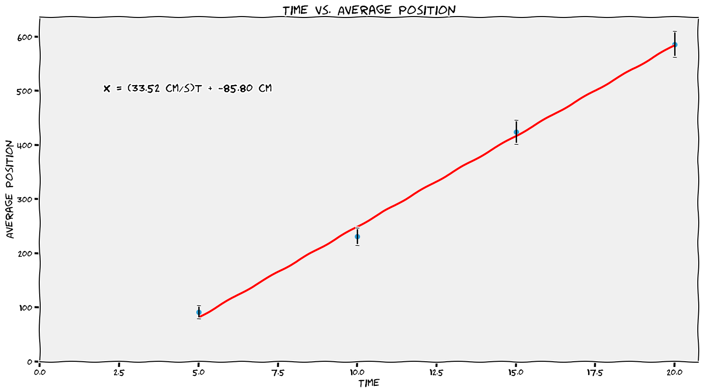

# Motion 🚗 <!--fit--->

## A Descriptive *Model* for Particles 

### AP Physics 2024-25 with Mr. Porter

---

# Buggy Lab 🚗

## Objective: 

* Determine if your toy buggy moves in a <U>consistent manner</u> by developing a relationship between ***position*** and ***time***. 
* Use ***time*** as your independent variable

---

---

---

# Lab Results:

* The buggies moved with a ***constant velocity***
    * means that it changed its *position* equal amounts for each equal change in *time*
* ***Velocity*** ($\bar{v}$) is represented by the *slope* of the position vs. time graph
    * how "fast"
    * AND what direction
* ***Speed*** is the steepness of the slope:
    * it tells us the rate that position changes with time
    * steeper slope == faster
* The **initial position** ($x_0$ or $y_0$) of the object is the vertical intercept
    *  it tells us where the object is at clock reading 0.

---

# Mathematical Models 

#### General Mathematical Mode:

$$x = \bar{v}t + x_0$$

#### Specific Mathematical Model (example):

$$x = (25 \textrm{ cm/s})t + 250 \textrm{ cm}$$

#### Narrative Model:

*"The toy car started at a position of 250 cm and moved in the positive direction at a speed of 25 cm/s."*

--- 

# Defining "How Far"

### Who went further? Dorothy or Toto?

---

# Vector vs. Scalar 

## Vector 

* Physical Quantity that describes *magnitude* (size) and *direction*
* indicated with an ➡️ above the symbol
    * i.e. $\vec{v}$ or $\vec{p}$ or $\Delta\vec{x}$

## Scalar 

* Physical quantity that describes the *magnitude* (size) of something

---

### Displacement

- Change in position of an object
- $\Delta x = x_f - x_0$
- Includes direction (***vector quantity***)

### Distance

- the **magnitude** (or size) of displacement between two positions (***scalar quantity***)
- more often referred to as **distance traveled** which is the total length of the path traveled between two positions

### Position
- Where an object is at any particular time in coordinate system (***vector***)
- "Location"

---

# Speed vs. Velocity:

* **Velocity** is a ***vector*** quantity
    - how fast and what direction
* **Speed** is a ***scalar*** quantity
    - how fast

---

# Analyzing Position-Time (XT) Graphs

### For the following position vs. time graph, consider the positive direction to be north.

1. When is the object moving North? South?
3. When is the object stopped?
4. When is the object North of the origin?
5. What is the velocity of the object at $t = 1$ s? $t = 2.5$ s? $t = 4$ s? When it is at the origin?

---

# Average vs. Instantaneous

* **Average** - what is something over a period of time, $\Delta t$ 
* **Instantaneous** - what is something at that exact moment in time, $t$

---

# Velocity vs. Speed

## Velocity

$$ \bar{v} = \frac{\Delta x}{\Delta t} = \frac{\textrm{displacement}}{\textrm{time duration}}$$

## Speed 

$$ |v| = \frac{\textrm{distance}}{\Delta t}$$

---

# Instantaneous Values:

- _"at that moment"_
- Value at a specific time 

## Instantaneous Velocity

- Velocity at a specific time
- The slope of the position vs. time graph ***at that time measurement***

## Instantaneous Speed

- Magnitude of the velocity 

---

# Visualizing Instantaneous Velocity

---

# Visualizing Instantaneous Velocity

<iframe src="https://www.desmos.com/calculator/bfyznrfmgh" width="1150px" height="500px" style="border: 1px solid #ccc" frameborder=0 ></iframe>

---

# Analyzing Position-Time (XT) Graphs

5. When does the object change directions?
8. What is the total *distance* the object travels?
9. What is the total *displacement* of the object?
10. What is the *average velocity* of the object?
11. What is the *average speed* of the object?

---

# Average Velocity 

Dispalcement divided by the change in time. 

$$ \bar{v} = \frac{\Delta x}{\Delta t}$$

_"The average slope of the graph"_

# Average Speed 

Total distance divided by change in time 

$$ |v| = \frac{dist}{\Delta t}$$

---

# Fan Carts

## 1. Observations 
## 2. Questions
## 3. Measurements

---

<!--- class: invert --->

# Essential Questions 🤔 <!--fit--->

## *Does your the fan cart **change** its **velocity***?

## *If it does change velocity, does the **velocity change constantly***?

- What evidence do you need to collect to answer these questions?

---

# Some New Tools 🧰 🛠️ <!--fit-->

---

# Video Upload 📹

1. Record video with you phone 📱
2. Sign into Pivot and Upload Video 📤
3. Scale to something in video to known size 📏
4. Use Built in tools ⏱️

## Tips:

- Take video perpendicular to motion
- Keep video device as still has possible (i.e. put on something, don't hold in hands)

---

# Spark Timer 🎇

1. Tape spark tape to object
2. Pick time setting 
3. Turn on timer & object and send it 

---

# Essential Questions 🤔 <!--fit--->

## *Does your object **change** its **velocity***?

## *If it does change velocity, does the **velocity change constantly***?

- Collect **position** and **time** data to answer this question

---

# Finding Velocity from Position time Graphs 

❗ Reminder: the slope at a specific time on a position vs. time graph is the **instantaneous velocity** of an object

🤔 How do we find the slope of a curve?

---

# Finding Velocity from Position time Graphs 

<iframe src="https://www.desmos.com/calculator/bfyznrfmgh" width="1150px" height="500px" style="border: 1px solid #ccc" frameborder=0 ></iframe>

---

# Pivot & Rate of Change 

Pivot will calculate these slopes for you with its **rate of change** function. We can accomplish it with a calculated column

**NOTE**: This only works when time intervals are the same (i.e. time between samples is 0.1 s)

---

---

# How does the *Rate of Change* function work?

Calculates slope over three data points and assigns that value to the middle time. 

---

# Create a **Velocity vs. Time** Graph from your Data <!--fit--->

---

# From your **Velocity vs. Time** Graph...

## *Does your object **change** its **velocity***?

## *If it does change velocity, does the **velocity change constantly***?

- What does the slope represent? 
- What does the intercept represent?

---

# What about Position and Time?

## What is the relationship betwen position and time?

## How do we know what curve to pick??

---

# Linearization 

## _Finding the linear approximation of a function_

---

# Why? 

1. Verify a certain relationship (i.e. determine if your selected curve fit is the relationship)
2. You expect your data has a certain relationship and want to determine a parameter. 
3. You are trying to find an unknown relationship between two variables. 

---

# Linearizing allows us to interpret <!--fit--->

# curves as **lines** <!--fit--->

---

# How do we change a curve into a line?

## *By making a test plot*

1. Make a new data column
2. Calculate the expected relationship in that column (i.e. if the graph looks quadratic calculate $x^2$)
3. Make a new plot (i.e. graph $y$ vs. $x^2$)
4. Analyze new linear model 

---

# Cheat Sheet 

---

# Lab Summary 

* Slope of the Velocity vs. Time graph is ***acceleration***
* ***Acceleration*** is measured in m/s/s or m/s$^2$
* ***Slope*** of the ***Position vs. Time$^2$*** is $\frac{1}{2}$ of the ***acceleration***

---

# General Mathematical Models:

* For this lab (with no initial position or initial velocity):
  - $v_x = at$
  - $x = \frac{1}{2}at^2$

* For an object with an initial velocity and initial starting point:
  * $\boxed{v_x = v_{x0} + at}$
  * $\boxed{x = x_0 + v_{x0}t + \frac{1}{2}at^2}$

---

# Defintions & Notes

* ***Displacement*** indicates how far an object ends up from its initial position, regardless of its total distance traveled.
* ***Average velocity*** is displacement divided by the time interval over which that displacement occurred. Slope of position time graph over a time duration.
* ***Instantaneous velocity*** is how fast an object is moving at a specific moment in time. Slope of position time graph at a specific time.
* ***Acceleration*** tells how much an object’s speed changes in one second.
  - When an object speeds up, its acceleration is in the direction of motion.
  - When an object slows down, its acceleration is opposite the direction of motion.

---

# Thinking about graphical relationships

<iframe src="https://www.desmos.com/calculator/kqgfxguax7" width="1150px" height="700px" style="border: 1px solid #ccc" frameborder=0 ></iframe>

---

# **Position-time graphs**

* To determine how far from the detector an object is located, look at the vertical axis of the position-time graph.
* To determine how fast an object is moving, look at the steepness (i.e. the slope) of the position-time graph.
* To determine which way the object is moving, look at which way the position-time graph is sloped.
* A position-time slope like a front slash ↗️ / means the object is moving away from the detector.
* A position-time slope like a back slash ↘️ \ means the object is moving toward the detector
* Instantaneous velocity is found by taking the slope of the tangent line to a position-time graph

---

## **Velocity-time graphs**

* To determine how fast an object is moving, look at the vertical axis of the velocity-time graph.
* To determine which way the object is moving, look at whether the velocity-time graph is above or below the horizontal axis.
* An object is moving away from the detector if the velocity-time graph is above the horizontal axis.
* An object is moving toward the detector if the velocity-time graph is below the horizontal axis.
* To determine how far an object travels, determine the area between the velocity-time graph and the horizontal axis.
* On a velocity-time graph it is not possible to determine how far from the detector the object is located.
* Most everyday motion can be represented with straight segments on a velocity-time graph.

---

# Acceleration 

* Negative Acceleration **does not** always mean slowing down
* Negative Acceleration means the velocity is changing in the negative direction

---

# Acceleration: Increasing vs. Decreasing Speed 

* ***Speeding Up***: Acceleration and velocity have the ***same*** sign
* ***Slowing Down***: Acceleration and Velocity have ***opposite*** signs

---

# Motion Maps - Represent this pictorially:

---

## Motion Maps

---

---

.png)

---

.png)

---

.png)

.png)

---

## Try it...

.png)

---

.png)

---

## Practice: Complete individually and compare

Given the following position vs. time graph

1. Draw a motion map with one dot for each second
2. Describe the motion in worsds

---

## More Practice 

Given the following motion map, where positions have been recorded with one dot each second, 

1. Draw a position vs. time graph 
2. Describe the motion of the object in words

---

# Mathematical Modeling & Making Predictions 

## Constant Velocity Particle Model 

$$ x = \bar{v}t + x_0 $$ 

* $x$ ➡️ final position 
* $\bar{v}$ :arrow_right: constant velocity 
* $t$ ➡️ time 
* $x_0$ ➡️ initial position 

---

# A racecar reaches a speed of **95** m/s after it is **450** meters past the starting line. If the car travels at a constant speed of **95** m/s for the next **12.5** seconds, how far will the care be from the starting line?

1. Sketch and label the situation 
2. Physics diagrams: position vs. time graph, motion map (qualitative)
3. Mathematically model
4. Solve 

---

## Mr. H waits patiently as two beetles race across the **35.8**-cm length of the cereal box. According to Mr. H's estimates, Beetle A averages **0.230** cm/s and Beetle B averages **0.454** cm/s. Beetle A has a **4.1**-cm 'head start' (when Beetle B is at the far edge of the box). What is the separation distance (in cm) between beetles when the first beetle reaches the end of the box?

1. Sketch and label the situation 
2. Physics diagrams: position vs. time graph, motion map (qualitative)
3. Mathematically model
4. Solve 

---

# Velocity vs. Time Graphs <!--fit--->

---

# VT Graphs 

1. Draw the velocity vs. time graph for an object whose motion produced the position vs. time graphs shown below.
2. For many graphs, both the ***slope*** and ***area*** between the line and the horizontal axis have physical meanings. What does the ***slope*** of the position vs. time graph tell you about the motion of an object?

---

# VT Graphs 

3. Complete the following chart and show your work 

| | $\Delta x$ from XT Graph | Area "under the curve"  of VT Graph | 
|---|---|---|
|1 | | | 
|2|||
|3|||

---

# VT Graphs 

 
4. Looking at the velocity vs. time graphs, determine the units for a square of area on the graph. 
5. What does the "*area under the velocity-time graph*" tell you about the motion of the object?

---

# Area of VT Graph 

- Area "under the curve" represents the displacement (*change in position*) of the object. 
- Areas can be negative because that represents the direction

$$ \Delta x = \bar{v}{t} $$

- Add multiple segments together, including the sign to get the total displacement of a piecewise motion

---

# Area of VT Graph

1. Area = $\Delta x$ = $4$ m
1. Area = $\Delta x$ = $-2$ m
1. Area = $\Delta x$ =  $4$ m 

---

# Up Next... <!--fit--->

# [Changing Velocities...](../../../Presentations/APCAPM/talks/CAPM2023.html) <!--fit--->