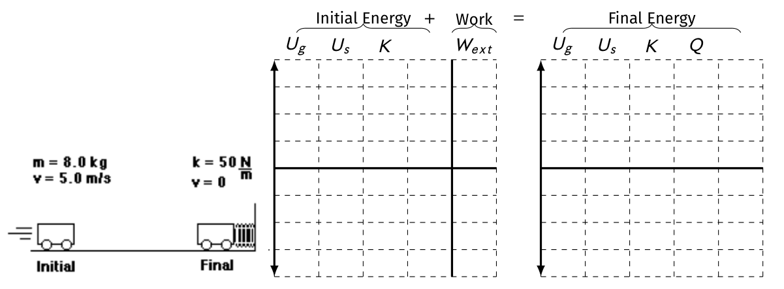
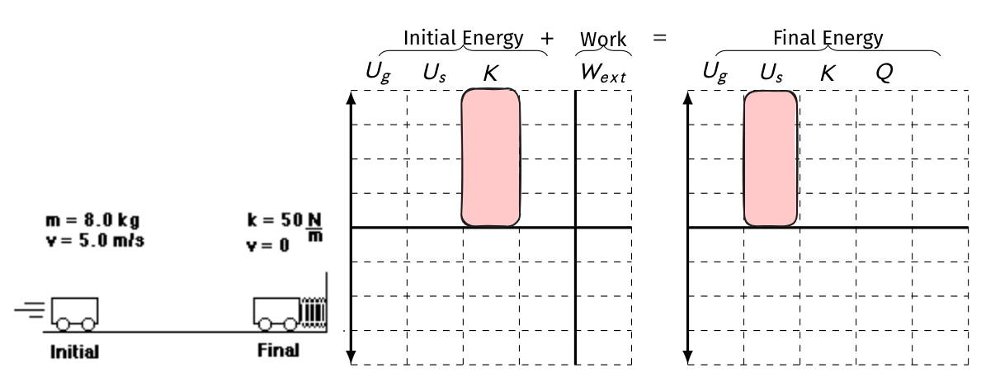

# Energy **Transfer** Model <!--fit--->

## _A model conservation and non-uniform motion_ <!--fit--->

### Mr. Porter - AP Physics 2024

---

# The Bungee Jumper

+ Represent this situation with as well as you can (with as many diagrams as you can)
+ Predict (using your physics diagrams or equations and your designated variables) the lowest height of the mass after it is released

Assume you know the spring constant and mass

---

# How do we use the  <!--fit--->

# word **energy** <!--fit--->

# <!--fit---> in everyday language?

---

# <!--fit---> How is this definition 

# <!--fit---> different than in science?

---

 
> # Physics is a foregin language that sounds like English 

---

# Hot Wheels Car:

On your whiteboards:

* Draw pie charts for where the energy is stored (in what object) at three snapshots:
  * when the launcher is pulled back all the way, but is not released yet
  * when the car is moving, but still touching the launcher
  * when the car is moving and no longer touching the launcher.
* If the energy is stored in more than one object, just divide the pie into slices

---

# Pull-back car

* Draw pie charts for where the energy is stored (in what object) at three snapshots:
  * when the car has been pulled back and is not yet moving
  * then two more when the car is moving and has not yet been stopped

---

# How the energy is stored

Energy is like money...

* **Kinetic Energy** - when energy is stored in ***motion***
* **Spring interaction energy** - energy stored when an object stretches or compresses a spring

---

# Nerf Dart Launcher

* Draw pie charts for how the energy is stored at three snapshots:
  * when the dart is compressing the spring and isn’t moving yet
  * when the dart has just left the gun (no longer touching spring)
  * when the dart is at the maximum height

---

# Pull-back car round 2

- Draw pie charts for how the energy is stored at three snapshots:
  - when the cart has been pulled back but is not moving
  - when the car is moving
  - when the car as stopped

---

# Energy Definitions

## Kinetic Energy:

* **Symbol**: $K$
* **When is the energy stored in this way?** When you have a moving object(s)
* **Notes**: Depends on mass and velocity

---

# Energy Definitions

## Spring Potential Energy:

* **Symbol**: $U_s$
* **When is the energy stored in this way?** object stretches or compresses a spring or another elastic material
* **Notes:** Interaction energy is energy stored in the interaction of two objects. (i.e. Loaded nerf launcher without a dart)

---

# Energy Definitions

## Gravitational Potential Energy:

* **Symbol**: $U_g$
* **When is the energy stored in this way?**: $\Delta y$ in a gravitational field
* **Notes**: Depends on $\Delta y$, a reference line ($y=0$), and the weight of the object

---

# Energy Definitions

## Internal Energy:

* **Symbol**: $Q$
* **When is the energy stored in this way?** particles have a faster random motion
* **Equation**: None
* **Notes**: Often referred to as change in thermal energy, but includes sound vibrations

---

# Energy Definitions

## Mechanical Energy:

* **Symbol**: None
* **When is the energy stored in this way?** $K$ or $U$ present
* **Equation**: $K + U_g + U_s$
* **Notes**: Mechanical Energy is the sum of **all** of the potential and kinetic energies

---

# Energy Definitions

## Work:

_Work is a transfer of energy by a mechanical process (a force exerted on an object or system as it moves through a displacement in the direction of the force)_ The amount of energy transferred in this process is referred to as the work done.

---

# Energy Definitions

## Work:

_Work is a transfer of energy by a mechanical process (a force exerted on an object or system as it moves through a displacement in the direction of the force)._ The amount of energy transferred in this process is referred to as the work done.

* **Symbol**: $W = \Delta E$
* **When is the energy stored in this way?** External force changes the mechanical energy of the system
* **Notes**: Area of Force vs. Displacement Graph

---

# Energy and Systems

*  A single object or a collection of objects can be referred to as a **system**
* Anything outside of the system is part of the **surroundings (environment)**, and interactions between the system and enviroment are **external** interactions

 

* **Work** is the amount of **mechanical energy** transferred **into** or **out of** a system

---

# Work 

## Three 🔑 ingredients: **force**, **displacement**, and **cause.**

### In order for a force to do **work** on an object, there must be a _displacement_ and the force must _cause_ that displacement. 

---

# Work Equation 

- $F$ is the force exerted on the system (N)
- $d$ is the distance over which the force is exerted (m)
- $\theta$ is the angle between $\vec{F}$ and $\Delta \vec{x}$

$$ \boxed{W = F_{\parallel}d = Fd \cos \theta } $$

---

# Work

* Work is scalar, but can be negative
* $W$ has units of joules (J) which is equal to $1 \textrm{ N} \cdot \textrm{m}$
* Only force components parallel to $\Delta \vec{x}$ do work 

---

# Examples

| Work | No Work |
|---|---|
| Horse pulls a plow | A teacher applies a force to a wall and becomes exhausted. |
| A book falls off a table and free falls to the ground. | A waiter carries a tray full of meals above his head by one arm straight across the room at constant speed. |
| A rocket accelerates through space. | Water bottle sits on a table |

---

# Conservative and Nonconservative Forces 

* The work done by a **conservative** force exerted on a system is **path-independent** and obly depends on the intial and final configurations of that system (e.g., gravitational force)
  * For a conservative force, we include the source of the force in the system and associate that force with potential energy.
* The work done by a **nonconservative** force is **path-dependent** (e.g., friction and air resistance)

### Can we get that mechanical energy back?

---

# Work as Area

---

# Cart Launcher 🚀 Lab

🥅: Determine the compression distance of each hoop spring to launch the carts at the ***same*** speed. 

🔍 Model the situation:

- Draw diagrams to model your cart-spring system
- Use equations to solve for the launch speed of your cart
- Determine what we need to measure to make the prediction

---

# Spring Constant 

## How can you determine the **spring constant** of your spring?

---

# Cart Launcher

🥅: Determine the compression distance of your groups spring so that all carts in the classroom are launched at the same speed.

❌ Same Force

---

# Cart Launcher

🥅: Determine the compression distance of your groups spring so that all carts in the classroom are launched at the same speed.

❌ Same Force

❌ Same Distance

---

# Cart Launcher

🥅: Determine the compression distance of your groups spring so that all carts in the classroom are launched at the same speed.

❌ Same Force

❌ Same Distance

❓ What other graphical properties can we try?

---

# 🔺 Area

$$Area = \frac{1}{2}Fx$$ 

and...

$$F_S = kx$$
---

# <!---fit---> Did it work?

---

# <!---fit---> What does the area represent?

# <!---fit---> What would the result be for larger areas? Smaller areas?

# <!---fit---> Describe in your own words.

---

# Work 

<iframe style="border-radius:12px" src="https://open.spotify.com/embed/track/72TFWvU3wUYdUuxejTTIzt?utm_source=generator" width="100%" height="352" frameBorder="0" allowfullscreen="" allow="autoplay; clipboard-write; encrypted-media; fullscreen; picture-in-picture" loading="lazy"></iframe>

---

# What is it?

## **Area** of a **Force vs. displacement** graph is **WORK**

Work is the change in energy of a system...

--- 

# Work 

* Area of Force vs. displacement graph
* $W = \Delta E_T$ 
* For **constant** or average forces: $W = Fd$
* Note: only force **parallel** to displacement does work: $F \cos \theta d = W$

---

# Work 

# **$\boxed{\Delta E = W = F_{\parallel}d = Fd\cos \theta}$** <!--fit--->

---

# Conservation <!--fit--->

---

# Conservation and Isolated System 

### **Isolated System**: System where there are no external forces

---

# Conservation of Cake 🍰 <!--fit--->

## For Fiona's Birthday (Sat) we are cutting an imaginary birthday cake into 21 pieces

What changes? What remains constant?

<!--- Cut cake into 20 pieces:
- Number of pieces did not remain the same
- Average piece size changed 
- total _mass_ remains the same --->

---

# Conservation of Cake 🍰 <!--fit--->

Conservation of Mass:

$$\{ \textrm{initial cake mass} \} + \{\textrm{new mass enerting or leaving system}\} = \{\textrm{final cake mass}\}$$

* What happened to the mass of our isolated cake system?

<!---
- System lost mass
- Environment (hungry students) removed mass from the system
- If we expand the system to the classroom then our mass was conserved
 --->

---

# Conservation of Cake 🍰 <!--fit--->

--- 

# Conservation of **Energy** <!--fit--->

---

# Conservation of Energy 

### _Energy cannot be created or destroyed._ <!--fit--->

---

# Conservation of Energy 

## The energy of **an isolated system** remains constant.

---

# Work and Conservation

## Work-Energy Theorem 

* Always start by defining your object or system 
* The **net work** done by external forces changes the system's **mechanical energy** (Sum of potential and kinetic energies)

---

# Work and Conservation

## Work-Energy Theorem 

- Always start by defining your object or system 
- The **net work** done by external forces changes the system's **mechanical energy** (Sum of potential and kinetic energies)

$$W_{ext} = \Delta K + \Delta U$$
$$W_{ext} = (K_f - K_i) + (U_f - U_i)$$

---

# Energy Bar Graphs 📊  <!--fit--->

---

# Elastic (Spring) Potential Energy 

# **$\boxed{U_s = \frac{1}{2}kx^2}$** <!--fit--->

---

# Kinetic Energy 

# **$\boxed{K = \frac{1}{2}mv^2}$** <!--fit--->

---

# Gravitational Potential Energy 

# **$\boxed{\Delta U_g = mg\Delta y }$** <!--fit--->

---

## Reference Table <!--fit--->

## **Hide-and-seek** 👀 <!--fit--->

Find the equations...

---

## A cart moving at 5 m/s collides with a spring. At the instant the cart is motionless, what is the largest amount that the spring could be compressed? Assume no friction.

---

# Problem Solving Steps:

1. Start with Energy Bar Graph
2. Write Qualitative Energy Conservation Equation
3. Solve **algebraically** BEFORE substituting in numbers
  - this will help you with practice for derivations
4. Plug in numbers and solve

---

# 1. Bar Graph

---

## **2. Energy Conservation Equation**

$$K = U_s$$

---

## **2. Energy Conservation Equation**

$$K = U_s$$

Subtitute Individual Equations 

$$\frac{1}{2} mv^2 = \frac{1}{2}kx^2$$

---

## **2. Energy Conservation Equation**

$$K = U_s$$

Subtitute Individual Equations 

$$\frac{1}{2} mv^2 = \frac{1}{2}kx^2$$

## **3. Solve Algebraically for $x$**

$$mv^2 = kx^2$$

---

## **2. Energy Conservation Equation**

$$K = U_s$$

Subtitute Individual Equations 

$$\frac{1}{2} mv^2 = \frac{1}{2}kx^2$$

## **3. Solve Algebraically for $x$**

$$mv^2 = kx^2$$

$$\frac{mv^2}{k} = x^2$$

---

## **2. Energy Conservation Equation**

$$K = U_s$$

Subtitute Individual Equations 

$$\frac{1}{2} mv^2 = \frac{1}{2}kx^2$$

## **3. Solve Algebraically for $x$**

$$mv^2 = kx^2$$

$$\frac{mv^2}{k} = x^2$$

$$ x = \sqrt{\frac{mv^2}{k}}$$

---

# Plug in numbers and solve 

$$ x = \sqrt{\frac{mv^2}{k}}$$

$$ x = \sqrt{\frac{8 \textrm{ kg} \cdot (5 \textrm{ m/s})^2}{50 \frac{\textrm{ N}}{\textrm{ m}}}}$$

$$ \boxed{x = 2 \textrm{ m}}$$

---

# <!---fit---> Power 🔋 

---

# Power

### **_Power_** is the rate at which work is done. 

$$P = \frac{W}{t} = \frac{Fd}{t} = F\bar{v}$$

- Power is measured in Joules per second (J/s) which is equal to a Watt (W).

---

# <!---fit---> Power up the stairs

---

# Power up the stairs 🏃 🔋

1. Draw an energy bar graph for you moving yourself up the stairs. 
    - Consider: what is your initial and final energy? How can you simplify this motion?
2. Write an equation to determine the amount of work you do moving up the stairs.
3. Determine what you need to measure to calculate your power using the power equation: $P = \frac{W}{t}$ 
4. Go take your measurements in the hall and see who is the most powerful! 

---

# 🚫 Rules:

1. Do not disturb classes or other students in the hall 
2. Spread out to the different staircases (there are 4 by my count) - no more than 2 per group 
3. No skippinng stairs
4. **BE SAFE** and use good judgement