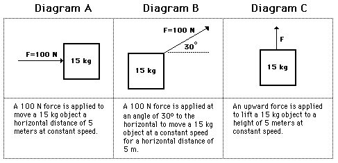
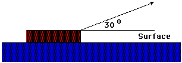
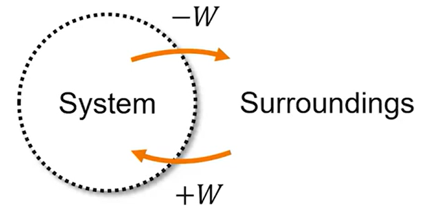

# Energy **Transfer** Model <!--fit--->

## _A model conservation and non-uniform motion_ <!--fit--->

### Mr. Porter - Regents Physics 2025

---

# Energy Definitions

## Work:

### When a **force** acts upon an object to *cause* a **displacement**, it is said that ***work*** was done upon the object. 

---

# Work $W$

## Three 🔑 ingredients: **force**, **displacement**, and **cause.**

### In order for a force to do **work** on an object, there must be a _displacement_ and the force must _cause_ that displacement. 

---

# Work Equation 

- $F$ is the force exerted on the system (N)
- $d$ is the distance over which the force is exerted (m)
- $\theta$ is the angle between $\vec{F}$ and $\Delta \vec{x}$

$$ \boxed{W = Fd = \Delta E_T } $$

Note: 

$$ W = F_{\parallel}d = Fd \cos \theta $$

---

# Work

* Work is scalar, but can be negative
* $W$ has units of joules (J) which is equal to $1 \textrm{ N} \cdot \textrm{m}$
* Only force components parallel to $d$ do work 

---

# Examples

| Work | No Work |
|---|---|
| Horse pulls a plow | A teacher applies a force to a wall and becomes exhausted. |
| A book falls off a table and free falls to the ground. | A waiter carries a tray full of meals above his head by one arm straight across the room at constant speed. |
| A rocket accelerates through space. | Water bottle sits on a table |

---

# Negative Work 

## When forces act on moving objects to *hinder* the displacement

- Car skidding to a stop
- Softball player sliding into second base
- Spiderman stopping a moving train

---

# Examples

---

# Angled Example

### A force of 50 N acts on the block at the angle shown in the diagram. The block moves a horizontal distance of 3.0 m. How much work is done by the applied force?

---

# More than one force:

### A 10-N force is applied to push a block across a friction free surface for a displacement of 5.0 m to the right.

 For each case, indicate which force(s) are doing work upon the object. Then calculate the work done by these forces.

---

# More than one force

### An approximately 2-kg object is pulled upward at constant speed by a 20-N force for a vertical displacement of 5 m. 

 For each case, indicate which force(s) are doing work upon the object. Then calculate the work done by these forces.

---

# Energy Packet Pages 1-4  <!--fit--->

---

# Energy and Systems

*  A single object or a collection of objects can be referred to as a **system**
* Anything outside of the system is part of the **surroundings (environment)**, and interactions between the system and enviroment are **external** interactions

 

* **Work** is the amount of **mechanical energy** transferred **into** or **out of** a system

---

# Work as Area

---

# <!---fit---> Power 🔋 

---

# Power

* When we discuss **work** we consider the *displacement* and *force*, but don't discuss the time it takes to complete the event.
* When we consider the *rate* that we do work it is called **Power**

---

# Power

### **_Power_** is the rate at which work is done. 

$$\boxed{P = \frac{W}{t} = \frac{Fd}{t} = F\bar{v}}$$

- Power is measured in Joules per second (J/s) which is equal to a Watt (W).

---

# <!---fit---> Power up the stairs

---

# Power **Think 🤔** Sheet <!--fit--->

---

# Power up the stairs 🏃 🔋

1. Draw an energy bar graph for you moving yourself up the stairs. 
    - Consider: what is your initial and final energy? How can you simplify this motion?
2. Write an equation to determine the amount of work you do moving up the stairs.
3. Determine what you need to measure to calculate your power using the power equation: $P = \frac{W}{t}$ 
4. Go take your measurements in the hall and see who is the most powerful! 

---

# 🚫 Rules:

1. Do not disturb classes or other students in the hall 
2. Spread out to the different staircases (there are 4 by my count) - no more than 2 per group 
3. No skippinng stairs
4. **BE SAFE** and use good judgement

---

# Hot Wheels Car:

On your whiteboards:

* Draw pie charts for where the energy is stored (in what object) at three snapshots:
  * when the launcher is pulled back all the way, but is not released yet
  * when the car is moving, but still touching the launcher
  * when the car is moving and no longer touching the launcher.
* If the energy is stored in more than one object, just divide the pie into slices

---

# Pull-back car

* Draw pie charts for where the energy is stored (in what object) at three snapshots:
  * when the car has been pulled back and is not yet moving
  * then two more when the car is moving and has not yet been stopped

---

# How the energy is stored

Energy is like money...

* **Kinetic Energy** - when energy is stored in ***motion***
* **Spring Potential Energy** - energy stored when an object stretches or compresses a spring

---

# Nerf Dart Launcher

* Draw pie charts for how the energy is stored at three snapshots:
  * when the dart is compressing the spring and isn’t moving yet
  * when the dart has just left the gun (no longer touching spring)
  * when the dart is at the maximum height

---

# Pull-back car round 2

- Draw pie charts for how the energy is stored at three snapshots:
  - when the cart has been pulled back but is not moving
  - when the car is moving
  - when the car as stopped

---

# Energy Definitions

## Kinetic Energy:

* **Symbol**: $K$
* **When is the energy stored in this way?** When you have a moving object(s)
* **Notes**: Depends on mass and velocity

---

# Energy Definitions

## Spring Potential Energy:

* **Symbol**: $PE_s$
* **When is the energy stored in this way?** object stretches or compresses a spring or another elastic material
* **Notes:** Interaction energy is energy stored in the interaction of two objects. (i.e. Loaded nerf launcher without a dart)

---

# Energy Definitions

## Gravitational Potential Energy:

* **Symbol**: $PE_g$
* **When is the energy stored in this way?**: $\Delta y$ in a gravitational field
* **Notes**: Depends on $\Delta y$, a reference line ($y=0$), and the weight of the object

---

# Energy Definitions

## Internal Energy:

* **Symbol**: $Q$
* **When is the energy stored in this way?** particles have a faster random motion
* **Equation**: None
* **Notes**: Often referred to as change in thermal energy, but includes sound vibrations

---

# Energy Definitions

## Mechanical Energy:

* **Symbol**: None
* **When is the energy stored in this way?** $K$ or $U$ present
* **Equation**: $K + PE_g + PE_s$
* **Notes**: Mechanical Energy is the sum of **all** of the potential and kinetic energies

---

# Conservation <!--fit--->

---

# Conservation and Isolated System 

### **Isolated System**: System where there are no external forces

---

# Conservation of Energy 

### _Energy cannot be created or destroyed._ <!--fit--->

---

# Conservation of Energy 

## The energy of **an isolated system** remains constant.

* This means there are **no external forces doing *work***

---

# Work and Conservation

## Work-Energy Theorem 

* Always start by defining your object or system 
* The **net work** done by external forces changes the system's **mechanical energy** (Sum of potential and kinetic energies)

---

# Work and Conservation

## Work-Energy Theorem 

- Always start by defining your object or system 
- The **net work** done by external forces changes the system's **mechanical energy** (Sum of potential and kinetic energies)

$$\boxed{W = \Delta E_T}$$

or as we will use

$$ E_i \pm W = E_f $$

---

# Energy Bar Graphs 📊  <!--fit--->

---

# Spring Potential Energy 
 
## **$\boxed{PE_s = \frac{1}{2}kx^2}$** <!--fit--->

---

# Kinetic Energy 

## **$\boxed{KE = \frac{1}{2}mv^2}$** <!--fit--->

---

# Gravitational Potential Energy 

## **$\boxed{\Delta PE_g = mg\Delta h }$** <!--fit--->

---

## Reference Table <!--fit--->

## **Hide-and-seek** 👀 <!--fit--->

Find the equations...

---

## A cart moving at 5 m/s collides with a spring. At the instant the cart is motionless, what is the largest amount that the spring could be compressed? Assume no friction.

---

# Problem Solving Steps:

1. Start with Energy Bar Graph
2. Write Qualitative Energy Conservation Equation
3. Solve **algebraically** BEFORE substituting in numbers
  - this will help you with practice for derivations
4. Plug in numbers and solve

---

# 1. Bar Graph

---

## **2. Energy Conservation Equation**

$$K = U_s$$

---

## **2. Energy Conservation Equation**

$$K = U_s$$

Subtitute Individual Equations 

$$\frac{1}{2} mv^2 = \frac{1}{2}kx^2$$

---

## **2. Energy Conservation Equation**

$$K = U_s$$

Subtitute Individual Equations 

$$\frac{1}{2} mv^2 = \frac{1}{2}kx^2$$

## **3. Solve Algebraically for $x$**

$$mv^2 = kx^2$$

---

## **2. Energy Conservation Equation**

$$K = U_s$$

Subtitute Individual Equations 

$$\frac{1}{2} mv^2 = \frac{1}{2}kx^2$$

## **3. Solve Algebraically for $x$**

$$mv^2 = kx^2$$

$$\frac{mv^2}{k} = x^2$$

---

## **2. Energy Conservation Equation**

$$K = U_s$$

Subtitute Individual Equations 

$$\frac{1}{2} mv^2 = \frac{1}{2}kx^2$$

## **3. Solve Algebraically for $x$**

$$mv^2 = kx^2$$

$$\frac{mv^2}{k} = x^2$$

$$ x = \sqrt{\frac{mv^2}{k}}$$

---

# Plug in numbers and solve 

$$ x = \sqrt{\frac{mv^2}{k}}$$

$$ x = \sqrt{\frac{8 \textrm{ kg} \cdot (5 \textrm{ m/s})^2}{50 \frac{\textrm{ N}}{\textrm{ m}}}}$$

$$ \boxed{x = 2 \textrm{ m}}$$

---

# Block Launcher <!--fit--->

---

# Block Launcher Lab

## Objective:

- Determine the coefficient of friction between your block and the table. 

 

## Available Tools

- Spring Scale
- Meterstick
- Electronic Balance

## **Physics:**

- Work-Energy Theorem: What does work to slow the block to a stop?
- What can  you measure? What can you graph where $\mu$ is in the slope?

---

