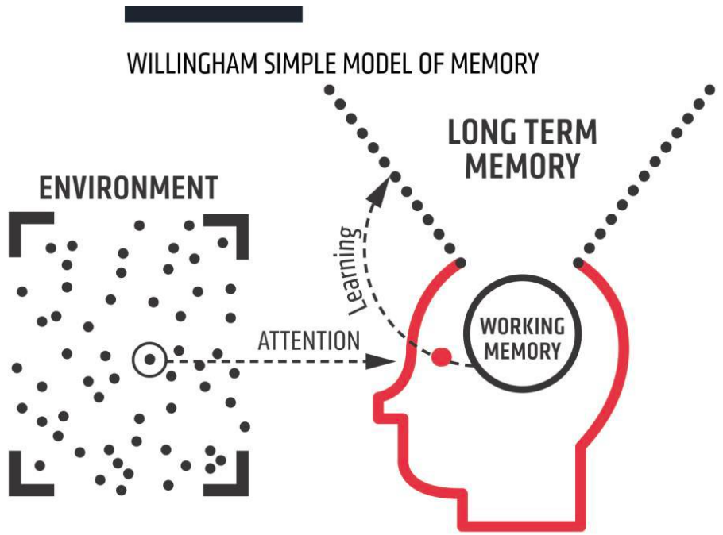

# 🧠 Brain Science <!---fit--->

## 🤔 Learning How to Learn <!---fit--->

### 🏫 Maple Hill HS Physics 

### :man_teacher: Mr. Porter


---

# Learning and the Brain


MORE RESOURCES:

- [Science of Learning](https://www.delmosworld.org/learning)
- [How to Study](https://www.edutopia.org/article/teaching-students-how-study)
- [Where is the evidence learning works](https://journals.physiology.org/doi/epdf/10.1152/advan.00053.2006)


---

# First... what is the point?
- of being here?
- of learning physics?
- of learning anything?

... to 'see it like I see it'.

---

# What is 'learning'?
Learning is a change to your long-term memory.

---

# So is 'learning' all about facts?
No.
You need to know things to be able to do things
When you learn you can
* 'know' new things
* make new connections to old things
* make new connections between old things
* strengthen the connections between any of the things

---

# How to think about your brain
- The things you know about a subject and the way they are connected is called a schema
- You have lots of schemas... they're all different because you know a lot about some things but not others.

---

# How to think about your brain


---

# So what do I need to know about learning?
During lessons I will talk about
1. Attention
2. Working memory
3. Long-term memory

---

# 1. Your attention is THE most precious thing <!--fit--->


---


Watch the video

Pass the ball video with bear walking through

---

# What you need to know about **attention** <!--fit--->
It's **evolution**. 
You are programmed to
- have a **wide, less focussed** view (so you don't get eaten)
- have a **narrow, focussed** view (so you know what to eat)
- notice **new** things (that might help you survive/mate/get fed)

---

# What did we learn
- Our **attention** is precious
(so I will try not to distract you, and this is why the presentation is simple)

---

# 2. Everyone's working memory is limited <!--fit--->


--- 

# What's your 'digit span'?
9 7 5 4 
3 8 2 5
9 4 3 1 8
6 8 2 5 9
9 1 3 8 2 5
6 4 8 3 7 1
7 9 5 8 4 2 3
5 3 1 6 8 4 2
8 6 9 5 1 3 7 2
5 1 7 3 9 8 2 6
7 1 9 3 8 4 2 6 1
1 6 3 8 7 4 9 5 2
9 1 5 2 4 3 8 1 6 2
7 1 5 4 8 5 6 1 9 3

Do all of this in your head

---

# What did we learn
- Our **attention** is precious
- Our **working memory** is limited

---

# What can you do?
- **Reduce** the things going into your brain so that you can focus
- **No other tabs/games open** when you're trying to learn
- There is **NO SUCH THING** as multi-tasking
- There **IS SUCH A THING** as 'switch-mode effect'.

---

# 3. **Thinking** moves things to your long-term memory <!--fit--->



---

# This is a **REALLY GOOD IDEA** <br> because your **LONG TERM** <br> **MEMORY IS HUGE**. <!--fit--->

---

# Here's some questions...
- Where were you last Thanksgiving?
- What are the pictures on the back of a dollar bill?


---


# Most people find it easier to remember things that mean something.
Why?
- You have to think what the words mean.
- When we think about meaning, we remember it more easily.

---

# What did we learn
- Our **attention** is precious
- Our **working memory** is limited
- It's easier to put things with **meaning** into our **long-term memory**

---

...and forgetting is part of learning


---

# From the video earlier
1. Which animal appears?
2. How many players are there on each team? 
3. What color are the balls they are playing with?
4. What is the color of the shirt of the player that leaves?
5. What color is the curtain at the start?
6. What color is the curtain at the end?

---

# From the school last year
1. What was the last topic you studied in science?
2. What were three things you learned in that topic?
3. Describe a problem that you can solve using one of those three things.

---

# Retrieving things upsets the forgetting curve <!--fit--->


---

# Let's try that again...
1. Which animal appears?
2. How many players are there on each team?
3. What color are the balls they are playing with? 
4. What is the color of the shirt of the player that leaves?
5. What color is the curtain at the start?
6. What color is the curtain at the end?

---

# What will we do this year?
To get things securely in your long-term memory and upset the forgetting curve we will do...
- lots of retrieval practice (lots of questions but NOT about grading)
- lots of SLOP – Shed Loads Of Practice (to make strong connections)
- lots of spaced practice (thinking about things from a while ago)
- You'll use your working memory to process new information
- You'll build up your long-term memory to be better at everything.

---

# BIG three things
- Attention - what you think about is what you learn
- Working memory – control what is using it up
- Long-term memory - the more you know the easier it is to learn

---

# How YOU can help yourself
- Do one thing at a time (multi-tasking is an illusion – you're making it harder on your brain by switching between tasks)
- Read books. People perceived as 'smart' have read a lot of books (the research says).
- Be smarter than your smartphone. It's designed to make you watch the screen – see if you can beat it!

---

# Why your phone is particularly addictive to **YOU** <!--fit--->
- Dopamine!!
- Adolescence is the time when brain is making lots more receptors, so it takes more to register.

---

# REALLY important information
- Your brain (and everyone's brain) is 'always on'– it's called the Default Mode Network, or DMN
- What it's doing is looking for lions
- There are no lions
- It doesn't know that
- You can think of it as 'monkey mind' ...
- it's improvising because there are no lions, and it needs something to do.
- (ok, so there's the food/mating thing as well)

---

# Can we do anything?
- The DMN is anti-correlated with the Task Positive Network. The DMN and TPN can't be on at the same time.
- The Task Positive Network is what kicks in when you focus or you're in a 'flow state'.
- That's why the breathing things work, or anything where you are concentrating on something that needs your full attention (like physics homework 😉)

---

# How YOU can help yourself
- Be a successive worker (one thing after another)
- Be a reader of books.
- Be judicious with your attention.
... and remember, there are no lions.

---

# Extras

A couple of brain games to finish...

---

# Say the COLOUR not the word
The first one is yellow not green

This is the Stroop Effect
Why? There are several theories
- You aren't used to recognizing colors, so you are slower (processing speed theory)
- Reading is automatic, recognizing color isn't (automaticity theory) 
- Recognizing color requires more attention, so takes longer (selective attention theory)
- There are different pathways for different types of information, and the pathway for information from reading is stronger (not faster) than the rest, so wins (parallel processing theory)
(so we don't know why)

---

# Look at this for 30 seconds <!--fit--->


---

# ...now look at your hand.

What's going on??
Come up with your own theory for these observations:
- Naming the color takes longer
- You to get it wrong more often

---

# References/credits
- Daniel Willingham - Why don't students like school
- Christopher Chabris and Daniel Simons – Monkey Business Illusion  
- Efrat Furst – Schema diagram
- Hermann Ebbinghaus – Forgetting curve
- Dan Siegel – Pruning video
- Activities: https://www.ambition.org.uk/research-and-insight/learning-curriculum/
- Helen Reynolds – for putting it together! (@helenrey)
```