<style>
.highlighted-line {
  background-color: #ff0;
  display: block;
  margin: 0 -16px;
  padding: 0 16px;
}
</style>

# Coding 💻 <!--fit--->

# Unit 2: Loops, Arrarys, and Media <!--fit--->


---

# Loops 🔁 <!--fit--->

---

# How can we use iteration <!--fit--->

# abstract artwood? <!--fit--->

---

# Casey Reas: artist & co-creator of Processing

<iframe width="1000" height="500" src="https://www.youtube.com/embed/_8DMEHxOLQE?si=gDZ-c9skNrsoXgPk" title="YouTube video player" frameborder="0" allow="accelerometer; autoplay; clipboard-write; encrypted-media; gyroscope; picture-in-picture; web-share" allowfullscreen></iframe>


---

# What are loops and how can I use them to make more efficient programs?

---

# `while()` Loops <!--fit--->

---

# Control Structure, While Loop

* A **control structure** is a block of code that dictates the flow of the code. 
* There are control structures that perform repetition. 
* **Iteration** is the generative process of repeating a set of rules or steps over and over again.
* A **loop** is a sequence of instructions that is repeated until a certain condition is not met.
* A **while loop** loops through a block of code as long a specified condition is true.

---

# While Loop 

<div class = "columns">

<div>

```javascript
//Step 1
var x = 100;

while (x < width){
    ellipse(x, 60, 40, 40);
    x = x + 100;
}
```

</div>


<div>

1. **Initialize** a variable by **declaring** it and giving it a starting value. 

</div>


</div>


---

# While Loop 

<div class = "columns">

<div>

```javascript
var x = 100;

//step 2
while (x < width){
    ellipse(x, 60, 40, 40);
    x = x + 100;
}
```

</div>


<div>

2.  **Check for a condition** - if it’s true, make a block of code happen until it is not true anymore. 

</div>


</div>

---


# While Loop 

<div class = "columns">

<div>

```javascript
var x = 100;

while (x < width){
    ellipse(x, 60, 40, 40);

    //step 3
    x = x + 100;
}
```

</div>


<div>

3. **Iterate the variable** - this involves changing the variable value to get the condition closer to being untrue. If you miss this step, you run the risk of creating an **infinite loop** and having your code run forever! This can crash your program. 

</div>


</div>

---

# While Loop Challenge 


<div class ="columns">

<div>

## Mild

Make a copy of your sketch and use a while loop to draw a row of shapes that:
1. Start at the left end of the canvas 
2. Are drawn 50 pixels apart
3. Are drawn only on the left half of the canvas 


</div>

<div>

## Medium

Use while loops to recreate one of the following:

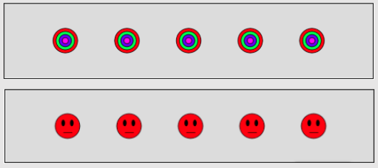

</div>

</div>

---

# `for()` Loops <!--fit--->

---

# `for()` Loop


```javascript
for (var x = 100; x < width; x = x + 100){
    ellipse(x,60,40,40);
}
```

---

# Draw a column

To draw shapes in a column, we will need to change the **`y`** value instead of the **`x`** value. 

Remember that if you want to draw repeated shapes filling the height of the canvas, your condition will be (**`y<height`**), and not **`width`**. 

[Play with example.](https://editor.p5js.org/cs4all/sketches/B1ee5-e4Z)


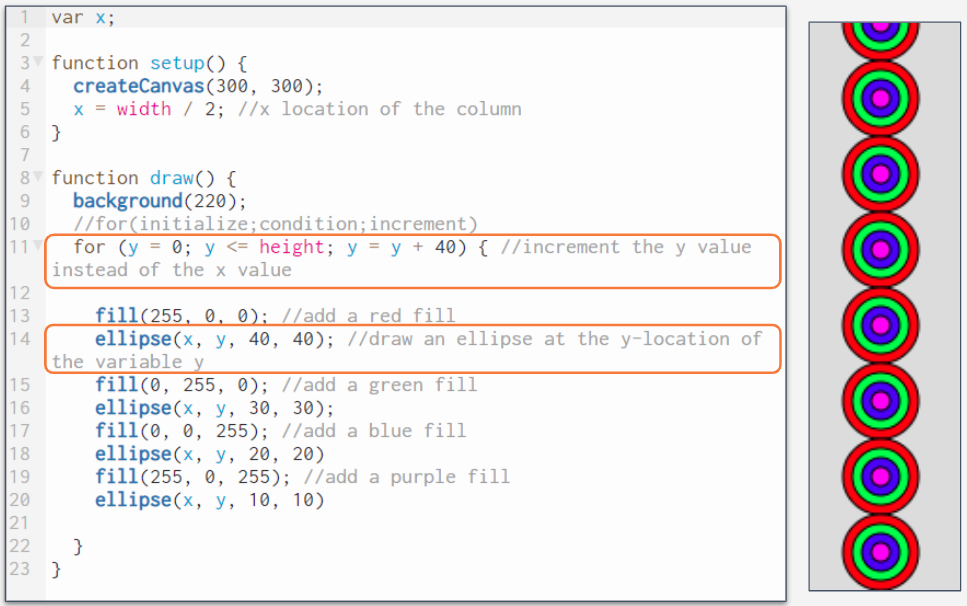


---

# Draw a diagonal line

Incrementing and **`x`** and y value of a repeating shape each loop would result in a diagonal line. The simplest way to do this might be to use the same variable for the **`x`** and **`y`** location of your shapes.

In this example, the **`x`** and **`y`** locations are contained in the variable **`y`**. The first shape is therefore drawn at the **`x=0`** and **`y=0`**. The shapes are incremented by **`40`** as long as **`y <= height`** of the canvas. 


---

# Draw a diagonal line

We can see the diagonal line, but it doesn’t cover the entire canvas. Let’s see what happens if we draw a square canvas so that the width and height are equal.

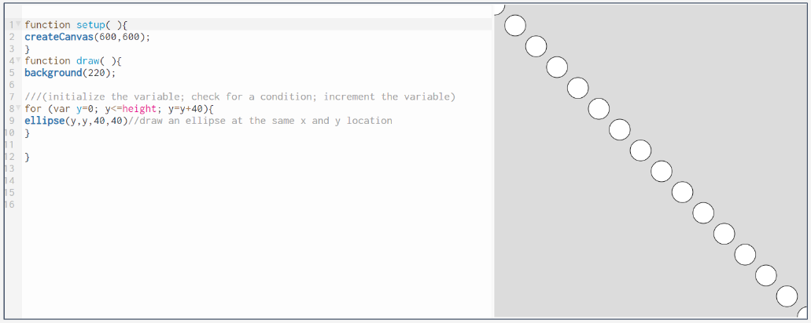

---

# Adjusting the variable inside the loop

Right now our design is symmetrical, but we won’t always have a square canvas. Sometimes we will want to use the same variable to increment multiple values but we will want to adjust the variable for one of the values.

The sketch below has a canvas of 600 x 120 pixels. The width of the canvas is 5 times larger than its height.  How can we keep the canvas width and have the diagonal design occupy the entire canvas? 


---

# Adjusting the variable inside the loop


<div class="columns">

<div>

If I wanted to draw a diagonal line from the upper left corner of the canvas to the lower right, each shape would need to be incremented by **5 times** the number of pixels on the x-axis compared to the y-axis. 

We can achieve this by using only 1 variable. We can use the same variable for the x and y location, but multiply the x location by 5 .


</div>

<div>

```javascript
function draw() {
  background(220);

  /*(initialize the variable; 
  check for a condition; increment the variable) */ 
  for (var y = 0; y <= height; y = y + 10) {
    
    /*draw an ellipse at the same x and y 
    location but multiply y by 5 for the x location  */
    ellipse(y * 5, y, 40, 40);
  }
}

```

</div>

</div>

---


# Arithmetic Operators


| This...   | Is the same as.. | Meaning        | 
| --------- | ---------------- | -------------- |
| x = x +1; | x++;             | Increment by 1 |   
| x = x-1;  | x--;             | Decrement by 1 |    
| x = x+2;  | x += 2;          | Increment by 2 |    
| x = x*3   | x *= 3;          | Multiply by 3  | 


---

# For Loop Challenge # 1

|Mild|Medium|Spicy|
|---|---|---|
|- Draw one row of any shapes.   <br>- Have all shapes be of the same color and size.|- Draw a “+” or column of any shapes.<br>- Distinguish between one and the other by assigning different colors to your shapes.|- Draw an “x” with shapes using multiple for loops.<br>- All shapes have to be evenly distributed in the canvas.<br>- Distinguish between one and the other by assigning different colors to your shapes.|


---

# Using for loops to create <!--fit--->

# variation in your designs <!--fit--->


---

# Variation in For Loops

In the previous section we used our growing values inside of our loops to adjust the location of our shapes, but our growing x value can be used to play with other parameters apart from the ellipse's position.

<div class="columns">

<div>

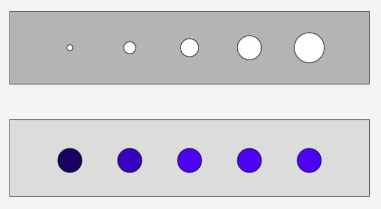

</div>


<div>

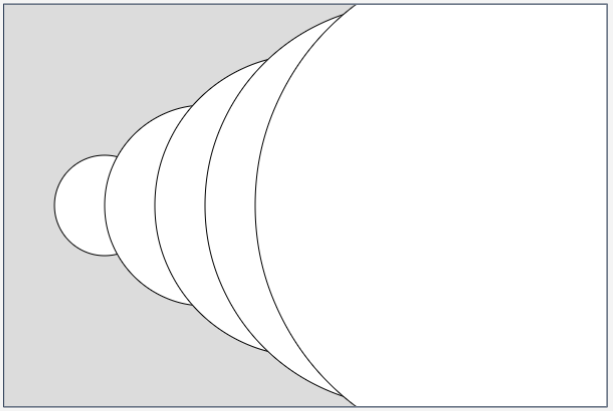

</div>

</div>

---

# Size


In this [example](https://editor.p5js.org/cs4all/sketches/Te4zh2GsD) we’re changing size. 

It’s hard to see, but our ellipse begins at 100 pixels in width and height, and then increments to 200,300, etc. 

Our canvas is only 400 pixels in height, which means that when x=400, the ellipse is already too big for our canvas. 


---

# Size 

[Now](https://editor.p5js.org/cs4all/sketches/ryImVVeEZ), when we divide x by 10 however, the first ellipse is 10 pixels in height and width since x is set to 100 and 100/10=10. In the second loop x=200 and 200/10=20, so our second ellipse is 20 pixels in height and width. 

This process continues and our ellipse grows but at increments that better fit our canvas. 


---

# Color

We can [increment color](https://editor.p5js.org/cs4all/sketches/B1_Qjg_5f) the same way. Use x for any value and divide x to achieve the effect that you want. Play with the values and see what effect you can achieve.  

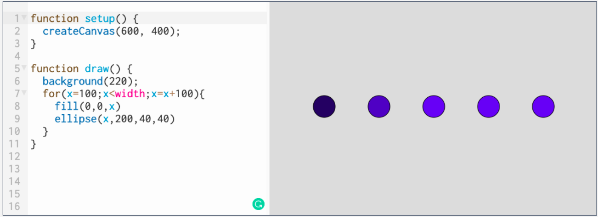

---


# Repetition

We can also use loops to create a specific number of elements and alter a value inside of the loop itself. 

In this [example](https://editor.p5js.org/cs4all/sketches/S1azU4gEW) I wanted to draw 5 ellipses and so I wrote a loop that would run 5 times. I decreased the size of the ellipse inside of the loop so that we will get a smaller circle every time. 

Play with the values to draw more circles or increase the space between them. 

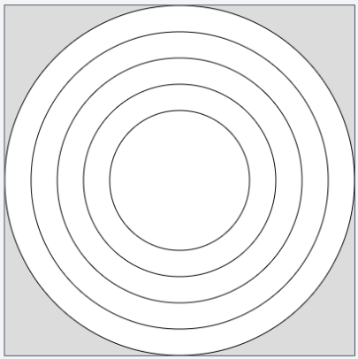

---

# Variation in Action

The [example](https://editor.p5js.org/cs4all/sketches/By6GNmWBW) below iterates on a smiley face design and added a mouth that opens a little bit more with each face that is drawn. 

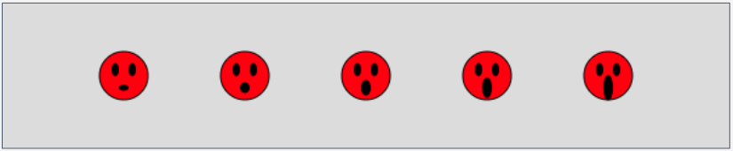

---

# `for()` Loop Challenge 2

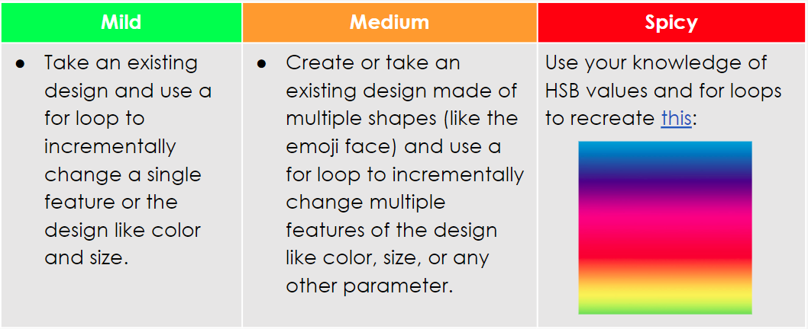

---


# Grid Systems <!--fit--->


---

# Create a Grid

- To create a **grid**, basically we want to draw a **column** of circles for each of the circles in our **row**. 
- When x=20, we want to draw a column at 20, when x= 40, we want to draw a column there too, and so on.

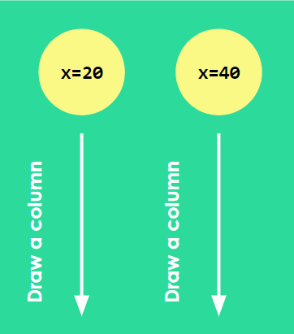

---

# Creating a grid

Take a look at the animation below: each time we draw a circle in the top row (with y = 60), we also draw another two (with y = 90 and y = 120). The value x is incrementing by 30, and each time 30 is added to x, a column is created as well with y incrementing by 30 until it reaches the height of the canvas.


---

# Nested Loops

* There is a short and easy way to do this in code with a “nested for loop.” 
* A **nested loop** means one loop is running inside of the other loop. 
* We’ve been doing this all along by having for loops inside of a draw loop. The for loop repeats a block of code, and the draw loop repeats all of the code that is inside it as well. 
* The draw loop only updates once everything inside of it has been run, including the entire for loop.


---

# Nested `for()` Loop

If we [nested a for loop](https://editor.p5js.org/cs4all/sketches/9ADXr9mSx) inside of another for loop, the same concept would apply. The inner nested loop would run until completed each time the exterior loop is run. 

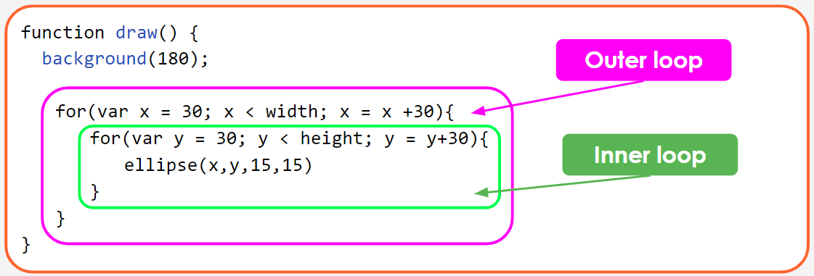

---

# Nested For Loop

The basic syntax:

```javascript
for(var i = 0; i<width; i++){
  for(var j = 0; j< height; j++){
    // Run this block of code
  }
}
```

---

# Nested For Loop

- In this [example](https://editor.p5js.org/cs4all/sketches/9ADXr9mSx), the first time the outer for loop runs, x is 30. Then the inner for loop runs. y starts at 30. A circle is drawn. y is set to 60. The second circle is drawn, 30 px below the first. 
- Then y is set to 90, and a third circle is drawn, 30px below the previous one. 
- Now the inner for loop is done, the outer loop sets x to 60, and the cycle continues.

```javascript
for(var i = 0; i<width; i++){
  for(var j = 0; j< height; j++){
    ellipse(x,y,15,15);
  }
}
```


---

# Nested For Loop


<div class="columns">

<div>

```javascript
function setup() {
	createCanvas(600, 400);
	noStroke();
	fill(255, 200, 100);
}
function draw() {
	background(0);
	for (var x = 25; x < mouseX; x += 50) {
		for (var y = 25; y < height; y += 50) {
			fill(random(255), 0, random(255));
			ellipse(x, y, 25);
		}
	}
}

```

</div>

<div>

What do you think will be the output of this [example](https://editor.p5js.org/cs4all/sketches/ByvTqlmKm)? 

Source: [Dan Shiffman’s Nested Loop Tutorial](https://www.youtube.com/watch?v=1c1_TMdf8b8)

</div>

</div>


---

# Digital Wallpaper <!--fit--->

## Today you’re going to make a digital wallpaper using for loops and the grid system

---

# Digital Wallpaper Inspiration

## You can use the following resources as inspiration:

- [Pattern 1](https://nycdoe-cs4all.github.io/units/1/final_project_examples/level_3) from curriculum
- [Pattern 2](http://printingcode.runemadsen.com/examples/repetition/pattern_simple/) by Rune Madsen.
- [African patterns](https://blog.yizzam.com/african-patterns-meaning-and-symbology/) and their meaning.
- [Andean art](https://www.mosqoy.org/textile-symbols) symbols used in textiles.
- [Islamic art](https://www.theguardian.com/science/alexs-adventures-in-numberland/2015/feb/10/muslim-rule-and-compass-the-magic-of-islamic-geometric-design) pattern tutorial.

---

# Digital Wallpaper


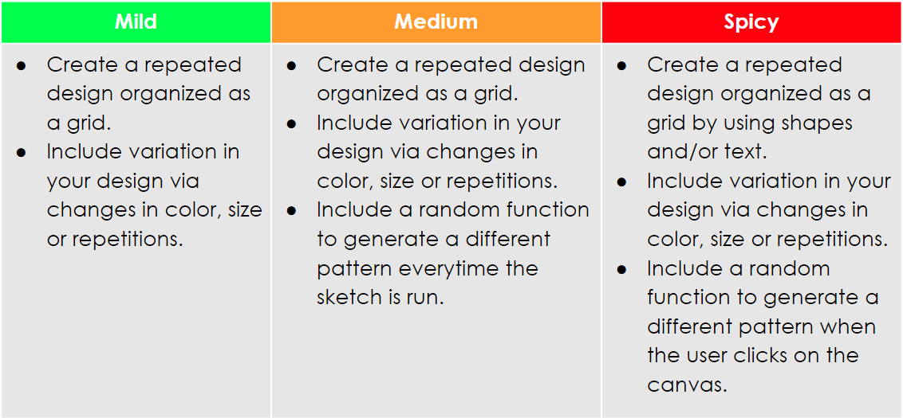

---

# Arrays [] <!--fit--->

---

# Arrays

They are declared like any other variable, with the keyword var followed by the **name** of the variable.  

We initialize an array by **1) listing its elements, separating them with commas, and 2) enclosing this list with brackets.**


`var variableName = [ ];`
 
Ex: `var years = [1920, 1972, 1980, 1996, 2010];`

An array can store **different data types** (boolean, number, string, etc). In JavaScript you can** mix and match** different types of data within a single array.

---


# Arrays IRL - Let's Go Shopping 

Let’s imagine that we are about to go on a trip to a store - let’s say Target.

Call out things we are going to buy! We will compose a list together on the board and figure out how this list could be ordered and used.

<!--- 
Create a list about 10 items long with the group - display it on the board and then talk about one way to organize this list would be to number it, but if we are a computer and numbering, we start by counting at 0. Run through several examples of how the names and numbers can help us identify items in an array. (EX: “If I asked for item 2, what would I want you to go buy?” “If I asked you to find the headphones, where on the list are they?”)

--->

---

# Array Structure 

Each item in an array is called an element, and each item has an index value (or element number) to mark its position within the array. They start from zero and go up. The length of an array is determined by the amount of values it holds.

### `var years = [1920, 1972, 1980, 1996, 2010];`


| `years = `| 1920 | 1972 | 1980 | 1996 | 2010 | 
|---|:---:|:---:|:---:|:---:|:---:|
|array name | 0 | 1 | 2 | 3 | 4 |


--- 

# Introducing CRUD

Arrays are a common computer science structure and there are **four main things programmers often want to do with them**. This is known through the industry as CRUD operations, and today we will focus on three of the four functions.

**CREATE**: Create a new list - this could be an empty list waiting to receive information, or a list that already contains values.

**READ**: View what is in a list - either the list entirely, or single items.

**UPDATE**: Add items to a list.

**DELETE**: Remove an item or items from a list.


---

# Shopping List Code Along

To really get a handle on arrays, let’s turn the shopping list into something that we can use in our code. We are going to go through the following steps:

- Creating our list
- Reading our list in its entirety and for individual items. We will get these to display in the console and on the screen!
- Updating our list with a new value when we make a user interaction happen.

---

# Pulling values from an array 

Let’s say that we have an array with int values (numbers) and we’d like to use them to set the size of a shape. How can we pull those values from the array?

You’ll need to refer to the array name and its index. 

Check out this reference (read the section called Accessing the Elements) and figure out how to pull the value “35” from the following array.


# `var nums = [100, 35, 46, 72];`

---

# Arrays and Length

Luckily arrays can store properties about themselves such as the size or current length of the array. The length 

For example `index == words.length` will give you back the current length of an array called words.

---

# [Example](https://editor.p5js.org/cs4all/sketches/BJwshrRNM) What Happens?

```javascript
var words = ["rainbow", "heart", "purple", "friendship", "love"];

var index = 0;

function setup() {
  createCanvas(400, 400);
}

function draw() {
  background(0);
  fill(255);
  textSize(32);
  text(words[index], 12, 200);
}

function mousePressed() {
  index = index + 1;

  if (index == words.length) {
    index = 0;
  }
}
```

---

# Floor, Random, Length

If we wanted to randomly select which word to display we’ll have to use…. the `random()` function! To do so we’ll need to tell the program to:

1. Pick a random value, no bigger than the length of the array, and assign it to the current index position
2. Make sure that your value is a whole number
3. Update the index position with the new value 

But there’s a problem! The `random()` function will return decimal numbers. Let’s go to our trusty `console.log()` and test `random()` to see if that’s true.

---

# Floor, Random, Length

To get whole numbers we’ll need to also use a function called floor(). This function will take any decimal and it will round it down. Check out this example. Note the use of console.log() for debugging purposes.


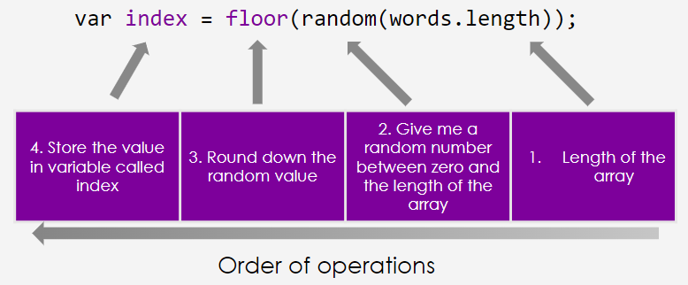

---

<!--- footer: <br>--->

# Javascript Pop Ups 

`alert()`
`alert()` pops up a window with text and asks the user to click OK. It doesn't return any information to the program, but OK must be clicked for the program to continue running.

`confirm()`
`confirm()` pops up a window with text and asks the user to click either OK or CANCEL. It returns *true* (if the user clicks okay) or *false* (if the user clicks cancel) to the program. These results can be **saved to a variable** and used later in the program.

`prompt()`
`prompt()` pops up a window with a text box the user can type into and then submit by clicking OK. *It returns whatever the user entered in the box as a **string*** and can be **saved to a variable** and used later in the program.

---

# Fortune Cookie 🥠 <!--fit--->


---

# Shopping List 🛒 <!--fit--->

---

# Shopping List 

<iframe src="https://editor.p5js.org/mrporterphysics/full/jCoylnG-_" height = "500 px"></iframe>