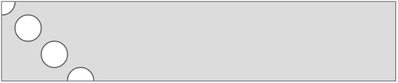

<style>
.highlighted-line {
  background-color: #ff0;
  display: block;
  margin: 0 -16px;
  padding: 0 16px;
}
</style>

# Coding 💻 <!--fit--->

# Unit 2: Loops, Arrarys, and Media <!--fit--->


---

# Loops 🔁 <!--fit--->

---

# How can we use iteration <!--fit--->

# abstract artwood? <!--fit--->

---

# Casey Reas: artist & co-creator of Processing

<iframe width="1000" height="500" src="https://www.youtube.com/embed/_8DMEHxOLQE?si=gDZ-c9skNrsoXgPk" title="YouTube video player" frameborder="0" allow="accelerometer; autoplay; clipboard-write; encrypted-media; gyroscope; picture-in-picture; web-share" allowfullscreen></iframe>


---

# What are loops and how can I use them to make more efficient programs?

---

# `while()` Loops <!--fit--->

---

# Control Structure, While Loop

* A **control structure** is a block of code that dictates the flow of the code. 
* There are control structures that perform repetition. 
* **Iteration** is the generative process of repeating a set of rules or steps over and over again.
* A **loop** is a sequence of instructions that is repeated until a certain condition is not met.
* A **while loop** loops through a block of code as long a specified condition is true.

---

# While Loop 

<div class = "columns">

<div>

```javascript
//Step 1
var x = 100;

while (x < width){
    ellipse(x, 60, 40, 40);
    x = x + 100;
}
```

</div>


<div>

1. **Initialize** a variable by **declaring** it and giving it a starting value. 

</div>


</div>


---

# While Loop 

<div class = "columns">

<div>

```javascript
var x = 100;

//step 2
while (x < width){
    ellipse(x, 60, 40, 40);
    x = x + 100;
}
```

</div>


<div>

2.  **Check for a condition** - if it’s true, make a block of code happen until it is not true anymore. 

</div>


</div>

---


# While Loop 

<div class = "columns">

<div>

```javascript
var x = 100;

while (x < width){
    ellipse(x, 60, 40, 40);

    //step 3
    x = x + 100;
}
```

</div>


<div>

3. **Iterate the variable** - this involves changing the variable value to get the condition closer to being untrue. If you miss this step, you run the risk of creating an **infinite loop** and having your code run forever! This can crash your program. 

</div>


</div>

---

# While Loop Challenge 


<div class ="columns">

<div>

## Mild

Make a copy of your sketch and use a while loop to draw a row of shapes that:
1. Start at the left end of the canvas 
2. Are drawn 50 pixels apart
3. Are drawn only on the left half of the canvas 


</div>

<div>

## Medium

Use while loops to recreate one of the following:


</div>

</div>

---

# `for()` Loops <!--fit--->

---

# `for()` Loop


```javascript
for (var x = 100; x < width; x = x + 100){
    ellipse(x,60,40,40);
}
```

---

# Draw a column

To draw shapes in a column, we will need to change the **`y`** value instead of the **`x`** value. 

Remember that if you want to draw repeated shapes filling the height of the canvas, your condition will be (**`y<height`**), and not **`width`**. 

[Play with example.](https://editor.p5js.org/cs4all/sketches/B1ee5-e4Z)


---

# Draw a diagonal line

Incrementing and **`x`** and y value of a repeating shape each loop would result in a diagonal line. The simplest way to do this might be to use the same variable for the **`x`** and **`y`** location of your shapes.

In this example, the **`x`** and **`y`** locations are contained in the variable **`y`**. The first shape is therefore drawn at the **`x=0`** and **`y=0`**. The shapes are incremented by **`40`** as long as **`y <= height`** of the canvas. 



---

# Draw a diagonal line

We can see the diagonal line, but it doesn’t cover the entire canvas. Let’s see what happens if we draw a square canvas so that the width and height are equal.


---

# Adjusting the variable inside the loop

Right now our design is symmetrical, but we won’t always have a square canvas. Sometimes we will want to use the same variable to increment multiple values but we will want to adjust the variable for one of the values.

The sketch below has a canvas of 600 x 120 pixels. The width of the canvas is 5 times larger than its height.  How can we keep the canvas width and have the diagonal design occupy the entire canvas? 


---

# Adjusting the variable inside the loop


<div class="columns">

<div>

If I wanted to draw a diagonal line from the upper left corner of the canvas to the lower right, each shape would need to be incremented by **5 times** the number of pixels on the x-axis compared to the y-axis. 

We can achieve this by using only 1 variable. We can use the same variable for the x and y location, but multiply the x location by 5 .


</div>

<div>

```javascript
function draw() {
  background(220);

  /*(initialize the variable; 
  check for a condition; increment the variable) */ 
  for (var y = 0; y <= height; y = y + 10) {
    
    /*draw an ellipse at the same x and y 
    location but multiply y by 5 for the x location  */
    ellipse(y * 5, y, 40, 40);
  }
}

```

</div>

</div>

---


# Arithmetic Operators


| This...   | Is the same as.. | Meaning        | 
| --------- | ---------------- | -------------- |
| x = x +1; | x++;             | Increment by 1 |   
| x = x-1;  | x--;             | Decrement by 1 |    
| x = x+2;  | x += 2;          | Increment by 2 |    
| x = x*3   | x *= 3;          | Multiply by 3  | 


---

# For Loop Challenge # 1

|Mild|Medium|Spicy|
|---|---|---|
|- Draw one row of any shapes.   <br>- Have all shapes be of the same color and size.|- Draw a “+” or column of any shapes.<br>- Distinguish between one and the other by assigning different colors to your shapes.|- Draw an “x” with shapes using multiple for loops.<br>- All shapes have to be evenly distributed in the canvas.<br>- Distinguish between one and the other by assigning different colors to your shapes.|


---

# Using for loops to create <!--fit--->

# variation in your designs <!--fit--->


---

# Variation in For Loops

In the previous section we used our growing values inside of our loops to adjust the location of our shapes, but our growing x value can be used to play with other parameters apart from the ellipse's position.

<div class="columns">

<div>


</div>


<div>


</div>

</div>

---

# Size


In this [example](https://editor.p5js.org/cs4all/sketches/Te4zh2GsD) we’re changing size. 

It’s hard to see, but our ellipse begins at 100 pixels in width and height, and then increments to 200,300, etc. 

Our canvas is only 400 pixels in height, which means that when x=400, the ellipse is already too big for our canvas. 


---

# Size 

[Now](https://editor.p5js.org/cs4all/sketches/ryImVVeEZ), when we divide x by 10 however, the first ellipse is 10 pixels in height and width since x is set to 100 and 100/10=10. In the second loop x=200 and 200/10=20, so our second ellipse is 20 pixels in height and width. 

This process continues and our ellipse grows but at increments that better fit our canvas. 


---

# Color

We can [increment color](https://editor.p5js.org/cs4all/sketches/B1_Qjg_5f) the same way. Use x for any value and divide x to achieve the effect that you want. Play with the values and see what effect you can achieve.  


---


# Repetition

We can also use loops to create a specific number of elements and alter a value inside of the loop itself. 

In this [example](https://editor.p5js.org/cs4all/sketches/S1azU4gEW) I wanted to draw 5 ellipses and so I wrote a loop that would run 5 times. I decreased the size of the ellipse inside of the loop so that we will get a smaller circle every time. 

Play with the values to draw more circles or increase the space between them. 


---

# Variation in Action

The [example](https://editor.p5js.org/cs4all/sketches/By6GNmWBW) below iterates on a smiley face design and added a mouth that opens a little bit more with each face that is drawn. 


---

# `for()` Loop Challenge 2


---


# Grid Systems <!--fit--->