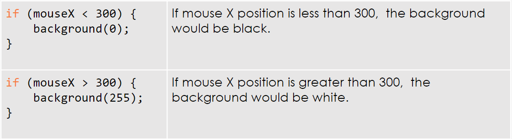

<script type="module">
  import mermaid from 'https://cdn.jsdelivr.net/npm/mermaid@10/dist/mermaid.esm.min.mjs';
  mermaid.initialize({ startOnLoad: true });
</script>

# Coding 💻 <!--fit--->

# Unit 1: Response and Draw <!--fit--->


---

# Conditional Logic <!--fit--->

# **`if()` and `else()` Statments**

---

# Abstraction 🕴🏽

## Decomposition

Ideas, problems, or projects are broken down into component parts to set the stage for deeper analysis.

## Pattern Recognition 

Decomposed component parts are examined to find patterns like similarities, repetition, conditional relationships, or nested relationships.

---

# Algorithms 💃🏽

## Control Flow 

The order in which steps of an algorithm are executed; determined by logical constructs such as IF statements, loops and calls to other procedures.

## Inputs, Variabless & Outputs

How data is passed into (inputs,) manipulated by, used within (variables,) and returned from the algorithm (outputs).

---

# Getting started with conditionals 

## Think about properties people in this room have. Then, write a series of statements in this format “If (property), then (do thing).” Try for at least 3.

### Ex: If you have **painted nails**, then **snap your fingers**.


--- 

<!--- _class: lead --->


# If ________, 

# then________.

# ⬇️

# Conditionals


----

# This is how it works: 

1. Programmers give a computer all the possibilities
2. Computer will check a condition to determine if this condition happened
3. Then, it will deliver the correct result


**This is how a computer makes a decision on which output to perform**

---

# Conditional Statements 

The interactions that we will build in this lesson are going to be based on conditional statements;

# `if this`

# `then that`

If/Then statements make a computer test if something is true, and tell it what to do if it is. It can also tell a program what to do if something is not true.

---

# Boolean Expressions 

Booleans are tests that return a value of true/false. They look look like this;

```javascript

if (boolean expression is true){
    // execute this code
}

```

The boolean expression inside the parentheses is the expression being evaluated. 

If the expression is ***true***, **then** the computer will execute the code inside the curly brackets. If it evaluates to ***false***, the code is not run and the program will continue with the code following the expression.

---

# `if` statement 


---

# Boolean Expressions 

These > (greater than) or < (less than) signs are relational operators. They compare two numbers, which is what we’re going to do in our first conditional statement.





---

# `console.log()` and conditionals

Using the `console.log()` function we can debug and test our different conditionals. To do so, you would add a console.log to print the words “true” when your condition is met.

```javascript
if (mouseX>300){
//do something
console.log(‘true’)
}
```

This is a way for your students to keep track of their conditionals, and to make sure that they’re getting the expected results.


---

### Variables and conditional statements

We can use conditionals to change color, size, and many other values in our sketches. 

In this [example](https://editor.p5js.org/cs4all/sketches/r1C8u6c7-) the fill of a square changes based on the mouse position. 

If the `x` position of the mouse passes the center of the canvas, the fill of the rectangle will turn blue. 


---


# Variables and conditional statements

We can also change custom variables inside conditional statements. In this [example](https://editor.p5js.org/cs4all/sketches/ryn71NT4W), the width and height of the rectangle are determined by a variable called x. That variable is changed inside the conditional statement. 


---

# `else`

If you think about how we speak, we use conditionals all the time.

**“If it’s cold outside, wear a coat.”**
**“If you’re hungry, have a snack.”**

These statements are often followed by **“else”** statements, or **“otherwise**.” 

**“If it’s nice out, play outside, otherwise play inside.”**

---

# `else`

We can do the same in code. The code on the right:  

1. Tells the program to draw a black background if the x position of the mouse is greater than 300
2. Also tells the program what to do if the x position of the mouse is NOT greater than 300


---

# `else`

If the boolean is true, the program will run task 1. 

If the boolean is false, the program will run task 2.


---

# else

In this [example](https://editor.p5js.org/cs4all/sketches/vws_D0Dqn), if the mouse is on the right side of the screen it will draw a red rectangle on the left and if the mouse is on the left side of the screen it will draw a red rectangle on the right.


<iframe src="https://editor.p5js.org/cs4all/sketches/vws_D0Dqn" height ="400 px"></iframe>

---

# `else if`

Since there are often more than two possible conditions that we want to work with, we can instruct the program to perform different tasks based on a range of conditions. 

I might want to tell someone that if it’s cold they should wear a coat, but I also may want to say:

“**If it’s freezing**, wear a coat, 
**else if it’s cold**, wear a jacket, 
**otherwise** just wear a sweater.” 


---

# `else if`

We can do this by adding “else if” to our conditionals between “if” and “else.” 


---

# `else if` statement 


---

# Logical Operators <!--fit--->

---

# And 

In the following [example](https://editor.p5js.org/cs4all/sketches/B1MNwN6E-), the ellipse becomes a square when mouseX is between 200 and 400. While we can’t use “between” in our conditionals, we can tell the program to draw an ellipse when mouseX is greater than 200 AND less than 400.


---

# And 

The syntax to write "**and**" in p5 is two ampersands (`&&`). In this sketch, we draw an ellipse when mouseX is greater than 200, and when mouseX is less than 400. Otherwise (else) we draw a rectangle.


`&&` is used whenever you want the bracketed code to be executed only if both conditions evaluate to true.


---

# Or

When we would like that code to be executed as long as **one of the conditions** evaluates to true, we use "or." The syntax for "or" in p5 is two pipes "`||`". 

In this [example](https://editor.p5js.org/cs4all/sketches/HJFv_E6NW), we have used "or" to set two ranges. if the mouse is hovering within either of them, we’ll draw an ellipse. 


---

# What is Interactivity?


Interactive applications are designed to respond to user input via the keyboard, mouse or other peripherals. Games, websites, and software are examples of interactive applications.

In p5.js we can allow the user to make things happen when they move the mouse, press a key, or click the mouse.

To do so, the use of conditional logic is very important. This is where control flow is crucial. As a programmer and designer you have to make decisions on what your application will do based on conditions and inputs.

---

# Traffic Light Challenge 

### Draw a traffic light that changes based on the mouse position using `else if`. 

You’ll be planning as group, in the next slides we’ll cover how this process is going to play out.


---

# Draw a traffic light


Start by writing **pseudocode** for this program → 

It’s really important to make a plan for your code. Thinking through the design before programming saves time and helps solve complex problems.


---

# Planning with pseudocode

* **Step 1**: Write a basic plan on paper with instructions “Turn on the red light”
* **Step 2**: Translate the basic plan into sentences that more accurately fit the code “Add a red fill then draw an ellipse”
* **Step 3**: Place those sentences as comments into your code
* **Step 4**: Only then write the actual code step by step.

---


# Traffic Light Challenge 

### Draw a traffic light that changes based on the mouse position using `else if`. 

You’ll be planning as group, in the next slides we’ll cover how this process is going to play out.


---

# `dist()` Function <!--fit--->

---

# Using the `dist()` function

dist()calculates the distance between points, giving a starting (x,y) and ending (x,y). 

It accepts four arguments - the x and y coordinates of the first point, and the x and y coordinates of the second point. e.g. dist(x1, y1, x2, y2)

How can we use the dist() function to check if our mouse is inside an ellipse?

[Example](https://editor.p5js.org/cs4all/sketches/4bEb-e2OO)

---

# Functions that return values

We can use `mouseX` and `mouseY` values to calculate the distance between the mouse and the center of the ellipse.


 <div class="columns">
 
 <div>
 
 If the distance between the mouse and the center of the ellipse is ***larger*** than its radius, the mouse is ***outside*** the ellipse.

 
 </div>
 
 
 <div>
 
If the distance between the mouse and the center of the ellipse is ***less*** than its radius, the mouse is ***inside*** the ellipse.

 </div>


 </div>

---

# Code-along: make a rollover button


* **Change the fill of a `rect()` when the mouse is hovering directly over it.** You’ll need to think about the the locations of the beginning and end of the shape on the x and y axis
* **The `mouseX` position needs to be:**
  - greater than the left side of the rect
  - AND less than the right side of the rect
* **AND `mouseY` position needs to be:**
  - greater than the top line of the rect
  - AND less than the bottom line of the rect


---

# Hover Assignment <!--fit--->

---

# Drawing with the Mouse 🖱️ <!--fit--->

---

# Once and Forever (review)

The `setup()` function runs once and the `draw()` function runs repeatedly in a loop. As long as no elements on the canvas are moving, they are being redrawn in the same place over and over which makes it look like a static image. 


---

# Once and Forever

Let’s use `mouseX` and `mouseY` to set the position of an ellipse. 

Place the background function in `setup()`. You will see that every time the `draw()` loop runs, the ellipse is redrawn at the mouse position which is starting to look like a brush in drawing app. 

[Code here.](https://editor.p5js.org/cs4all/sketches/S19N0Drn-)


---

# Draw with a line: `pmouseX` and `pmouseY`

You can tell from our previous example that the program doesn’t run fast enough to draw an ellipse and there are gaps in our ellipses. We can fix this by drawing lines to fill in these gaps by using another set of system variables.. 


---

# Draw with a line: `pmouseX` and `pmouseY`


Built in variables, `pmouseX` and `pmouseY`, hold the previous position of the mouse. 

We can draw with a line by drawing lines between our current mouse position and previous mouse position. 


---

# The `map()` function

Read the code, look at console and then the cursor. What’s the problem here? 


---

# The `map()` function

In that example, the background color gets lighter as you move your mouse across the screen. The problem is that the canvas is already white at 255 even though your canvas is 600px wide

You can solve this with the map function: 

## `map(value, start1, stop1, start2, stop2)`

The map function maps a value from one range to another. 

---


# The `map()` function

The map function uses five arguments:

- The first argument is the current value.
- Arguments two and three are the minimum and maximum of the range the value is in.  
- Arguments four and five are the minimum and maximum of the range the value will be converted to.

## `map(value, start1, stop1, start2, stop2)`


---

# The `map()` function

The solution our problem would be then to map the value of mouseX to the grayscale range.


---

# Pair Programing Challenge

Try using the map function  to  limit the range of the size of the ellipse to 20-150.


---

# Microsoft Paint Project

### Prompt

- Remember the days of Microsoft Paint? When you could click a start bar, open a program that came preloaded on the computer, and just create? Those days were good. Those days were simple. Those days were internet-free and possibly came with very little in the way of design sense.
- We are better today; we have the tools needed to build our very own, p5 Microsoft Paint that looks better than ever before. And so that’s what we are going to do!

--- 

# Microsoft Paint Project

###  Requirements

- Create a program that allows you to draw with the mouse.
- Create at least 4 buttons that will control different aspects of the program, such as color changes.
- Create at least 4 key press reactions that will control different aspects of the program, such as brush type.
- Make sure the user understands how to use your program!

---

# Microsoft Paint Project -  **Extensions**

### Level 2
- At least 5 buttons.
- Create a drawing pen using the mouse ONLY when the mouse is being pressed
- Have one button be a random color

### Level 3
- Make an eraser
- Make a way to clear the canvas
- Make complex brush types, beyond just drawing with different shapes
- Create a website to house your creation