<!-- _class: lead -->

# Best-Fit Lines

### Drawing a line that means something

AP Physics 1

---

# Where we left off

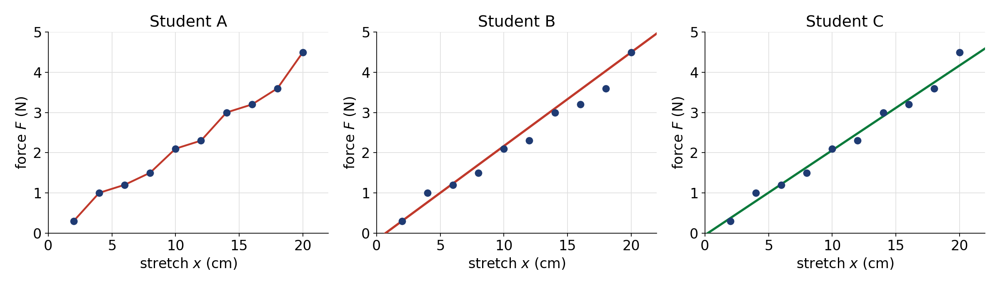

Same data. Three lines. Only one of them is doing the job.

---

# What is a best-fit line *for*?

A best-fit line answers two questions about a data set:

1. **Is there a relationship** between these two variables, and what shape is it?
2. **What would happen at a value I didn't measure?**

Neither question is about any single data point. Both are about the **trend**.

That is the whole idea: the line models the pattern, not the measurements.

---

# Rule 1: do not connect the dots

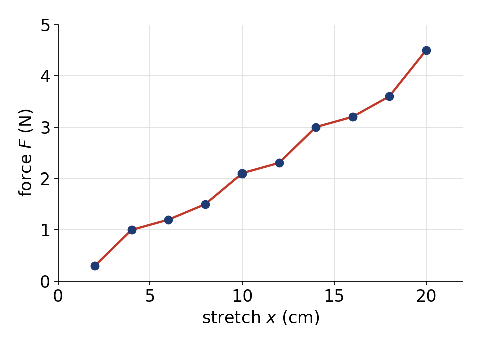

Connecting the dots says *"every wiggle is real."*

But the wiggles come from your ruler, your parallax, your timing — not from the spring.

A best-fit line **smooths through** the uncertainty instead of tracing it.

---

# Rule 2: the line does not have to touch anything

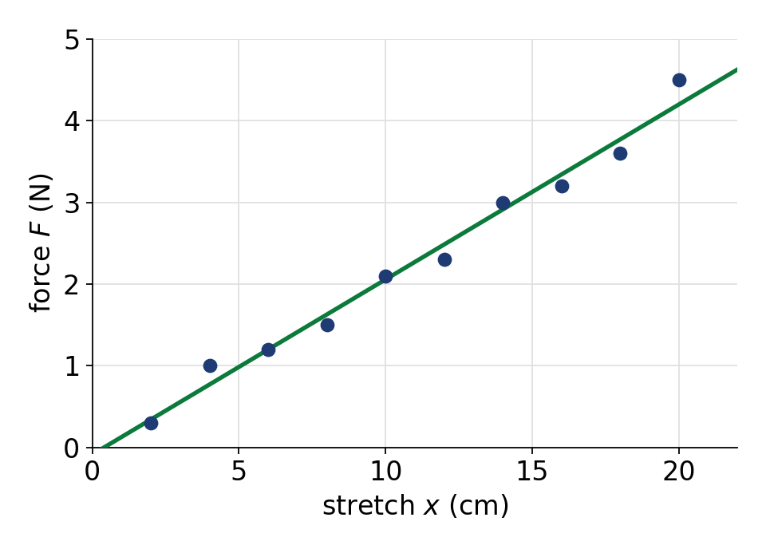

It is completely normal for a best-fit line to miss **every single point**.

What matters instead:

- roughly **equal numbers of points** above and below
- points **evenly spread** along the whole line
- the line stays **close to the data overall**

---

# Before you draw: look

Ask yourself three things first.

- Does this look like a **line**, or a **blob**, or a **curve**?
- Is the trend **positive** (rises to the right) or **negative** (falls to the right)?
- **Blur your eyes.** A thick fuzzy band usually appears — that band is your line.

Your finished line should agree with what you just saw.

---

# Method 1 — Area · Step 1

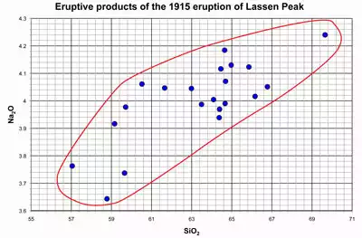

**Draw a smooth shape that encloses all of the data.**

Keep it simple and even — one closed loop around the whole cloud.

No spikes to reach a stray point.

---

# Method 1 — Area · Step 2

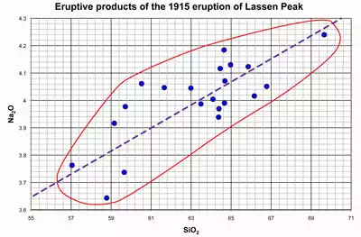

**Cut the shape in half with a straight line.**

Edge to edge, splitting the enclosed area into two equal parts.

Half the area above, half below.

---

# Method 1 — Area · Step 3

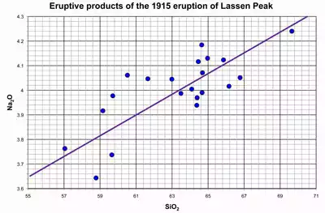

**Erase the shape. Keep the line.**

That is your best-fit line.

Notice it passes through none of the data points — and that is fine.

---

# The shape tells you about your data

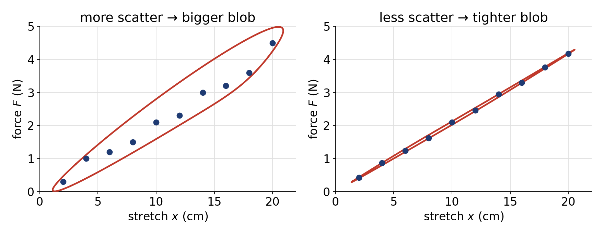

A **fat blob** means noisy data and a less certain line.
A **skinny blob** means precise data and a line you can trust further.

---

# Method 2 — Dividing · Step 1

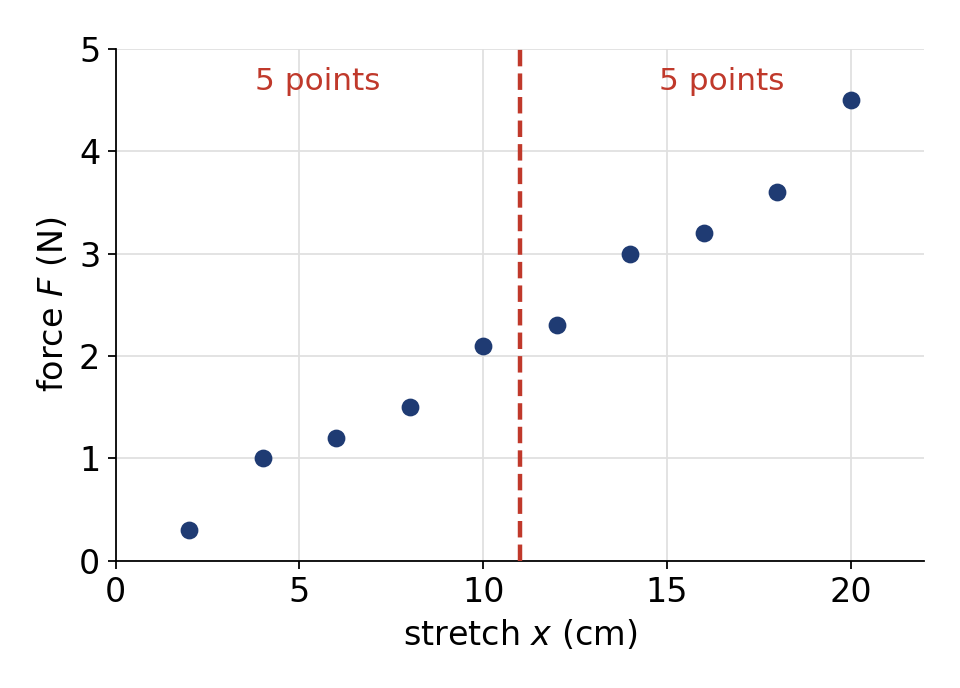

**Split the data into two equal groups.**

Draw a dashed vertical line with the same number of points on each side.

Odd number of points? Do your best — aim for half on each side.

---

# Method 2 — Dividing · Step 2

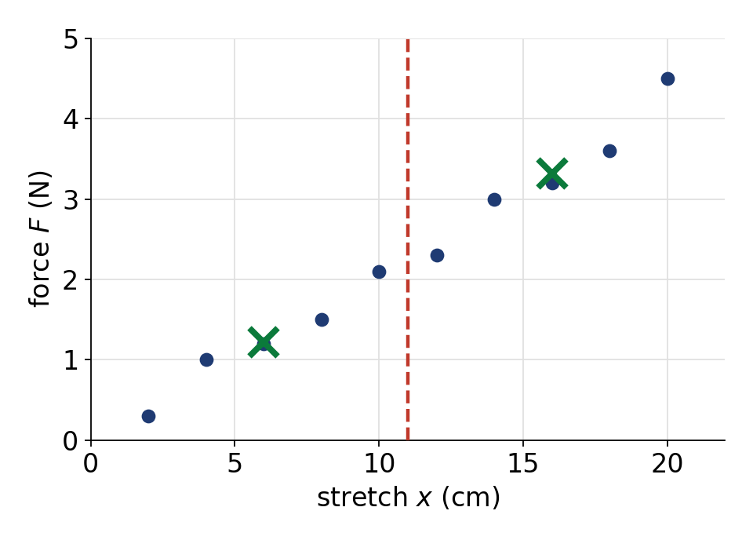

**Mark the center of each group with an ✕.**

Eyeball the middle of each cluster — the balance point, not a data point.

Your partner's ✕ will land somewhere slightly different. Expected.

---

# Method 2 — Dividing · Step 3

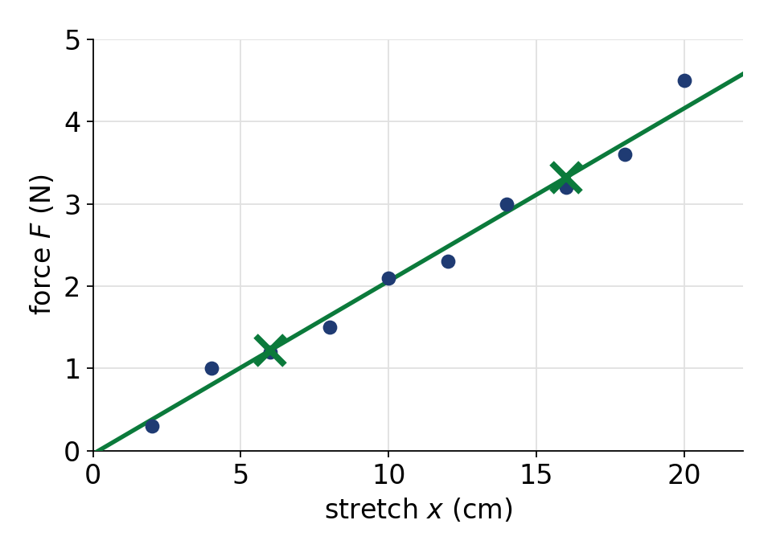

**Connect the two ✕ marks and extend to the edges.**

Done.

*Both methods on this data set gave a slope near $0.21$ N/cm. That agreement is the point — good methods converge.*

---

# Check your line before you use it

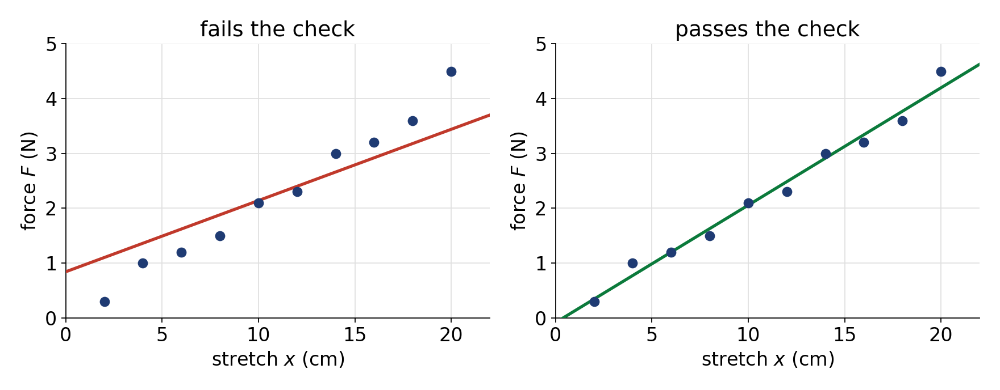

The line on the left has about half the points above and below — but they are **not evenly spread**: everything low is under it, everything high is over it. That is a slope problem.

---

# Why we care: the slope is physics

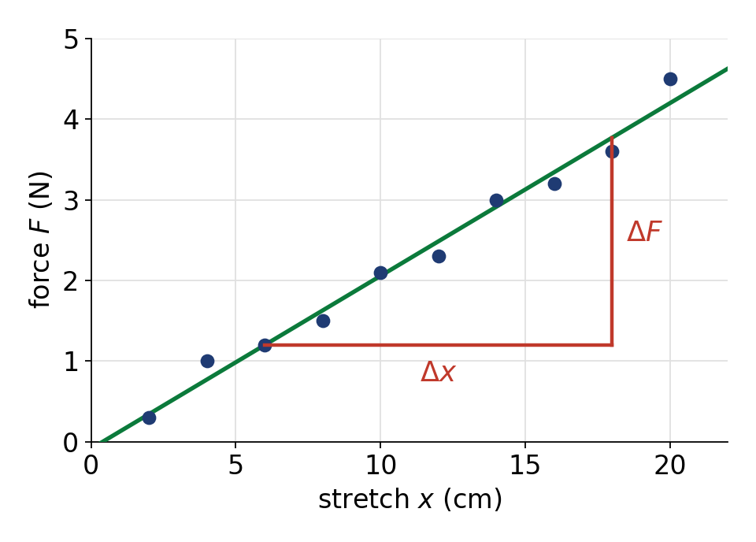

For this spring, $F = kx$, so

$$
k = \frac{\Delta F}{\Delta x} \approx 0.21 \ \frac{\text{N}}{\text{cm}} = 21 \ \frac{\text{N}}{\text{m}}
$$

**Your slope is the spring constant.** A sloppy line is a wrong measurement of $k$.

Take $\Delta F$ and $\Delta x$ from **two points on the line**, far apart — never from two data points.

---

# Why we care: prediction

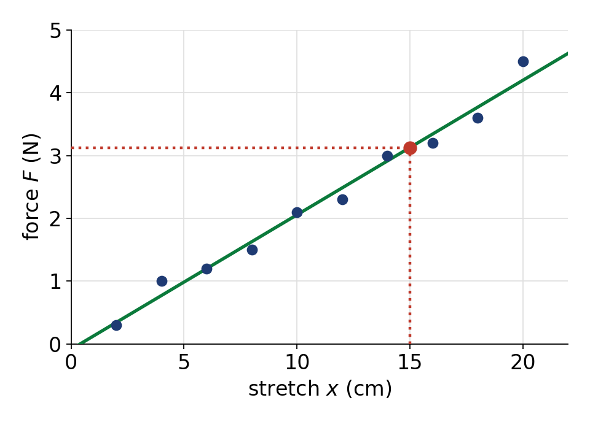

Stretch of $15$ cm was never measured. The line still answers it: $F \approx 3.1$ N.

- **Interpolation** (inside your data) — trustworthy
- **Extrapolation** (outside your data) — risky; the physics may change

---

# Your turn

With your lab partner, on the graph you were given:

1. Use the **area method** to draw a best-fit line.
2. Use the **dividing method** on the same data.
3. Compare the two slopes. How close are they?
4. Compare with the pair next to you. Whose line is better, and how would you decide?

---

<!-- _class: lead -->

# Takeaway

**The line represents the data set. Not the dots.**

 

<small>Method adapted from *The Math You Need, When You Need It* (SERC, Carleton College),
"Constructing a Best-Fit Line," Jennifer Wenner, UW–Oshkosh.
CC BY-NC-SA · serc.carleton.edu/mathyouneed/graphing/bestfit.html</small>
