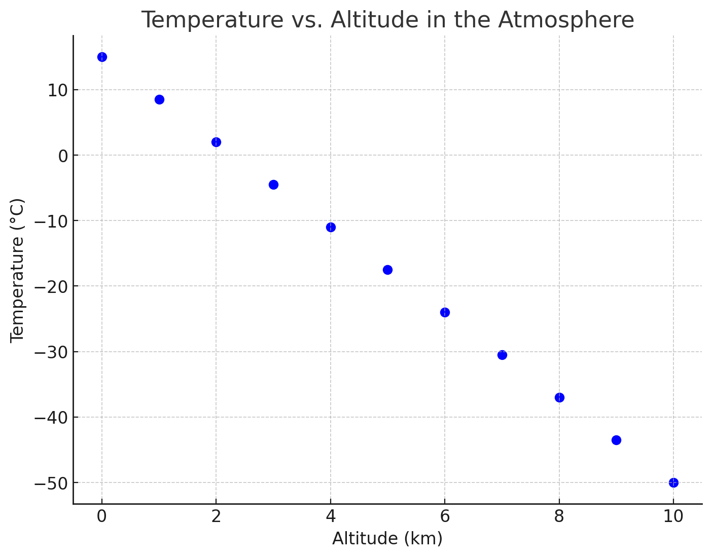
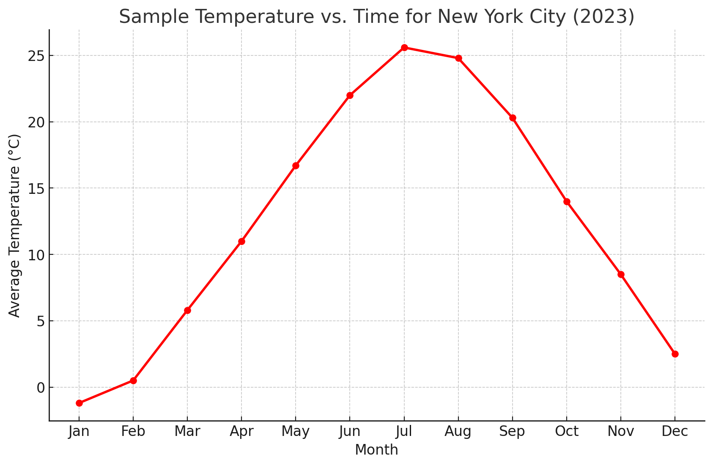
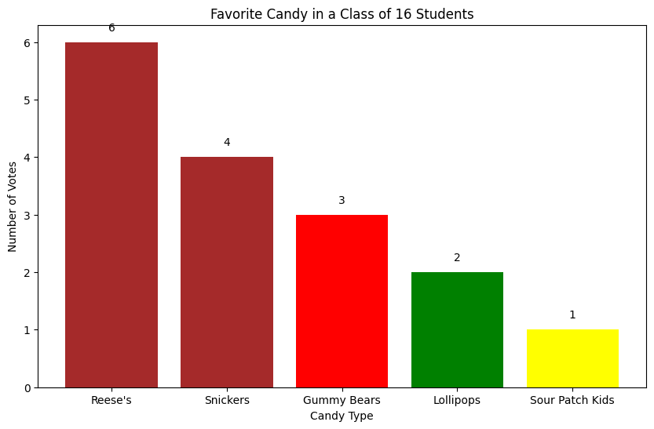
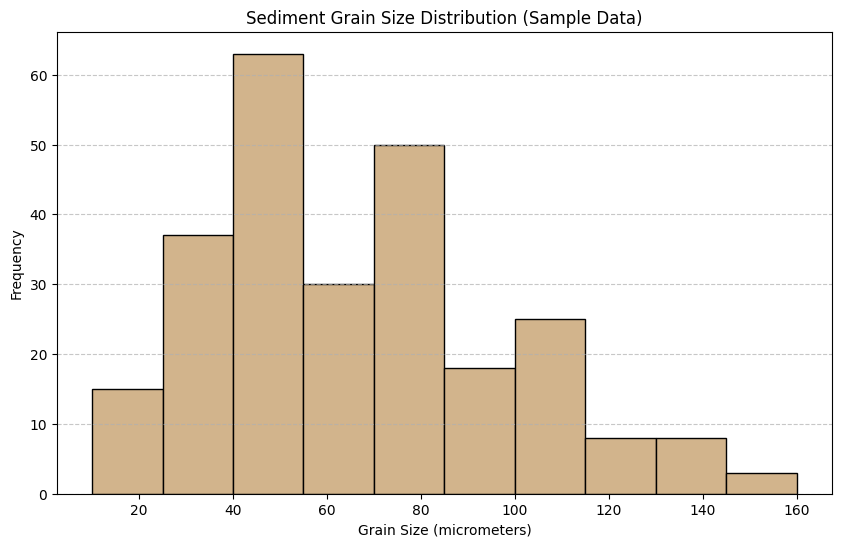

# Graphing Best Practices <!--fit--->

---

## Variable Types

- **Independent Variable**: The variable that is manipulated or changed in an experiment
- **Dependent Variable**: The variable that is measured or observed in an experiment  
- **Controlled Variables**: Variables that are kept constant to ensure a fair test

---

## Types of Graphs

- Scatter Plot
- Line Graph
- Bar Graph 
- Histogram

---

### Scatter Plot
- Plots individual data points
- Shows the relationship between two variables

---

### Line Graph
- Connects data points with line segments
- Shows trends over time or the relationship between variables

---

### Bar Graph
- Uses bars to represent and compare data
- Good for categorical data or showing differences between groups

---

### Histogram
- Shows the distribution of a variable
- Groups data into bins or ranges

---

## Key Takeaways

- Identify the independent, dependent, and controled variables in an experiment
- Choose the appropriate graph type to best represent the data and relationships
- Graphs help scientists visualize and analyze experimental results