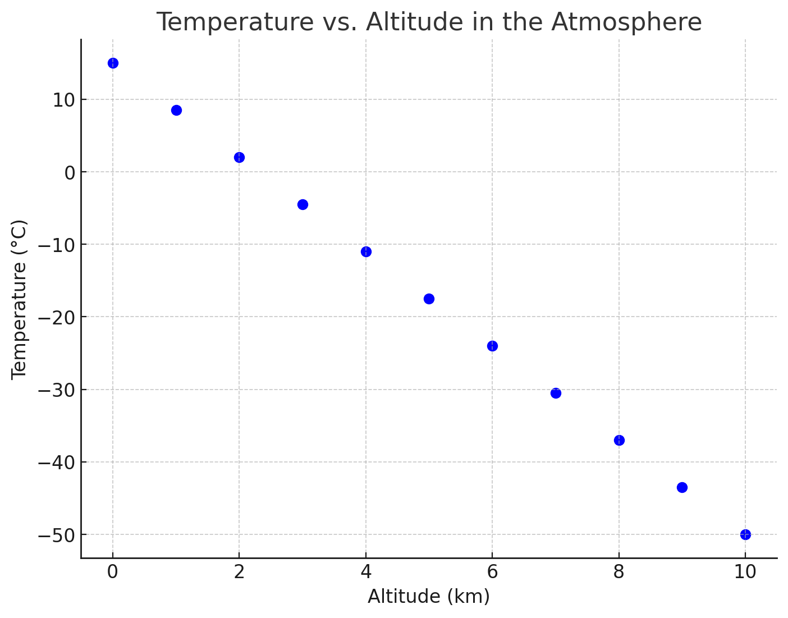
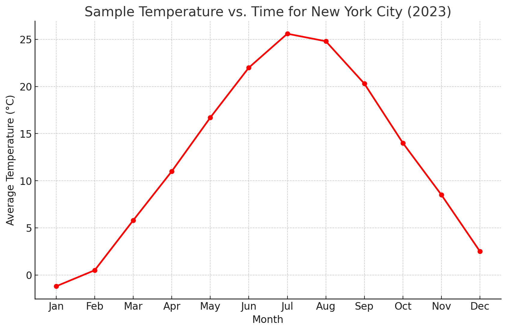
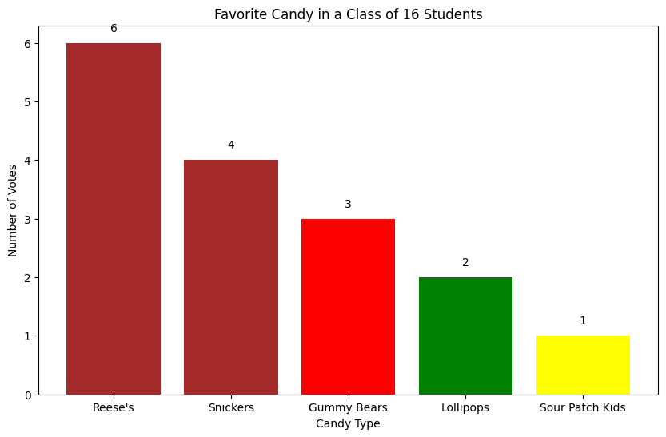
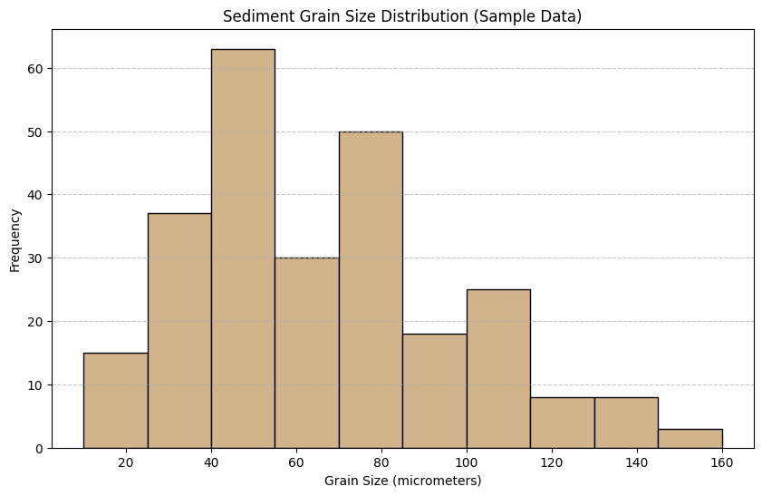

# Graphing Best Practices <!--fit--->

---

## Variable Types

* **Independent Variable**: The variable that is manipulated or changed in an experiment
* **Dependent Variable**: The variable that is measured or observed in an experiment  
* **Controlled Variables**: Variables that are kept constant to ensure a fair test

---

## Types of Graphs

- Scatter Plot
- Line Graph
- Bar Graph 
- Histogram

---

### Scatter Plot
- Plots individual data points
- Shows the relationship between two variables

---

### Line Graph
- Connects data points with line segments
- Shows trends over time or the relationship between variables

---

### Bar Graph
- Uses bars to represent and compare data
- Good for categorical data or showing differences between groups

---

### Histogram
- Shows the distribution of a variable
- Groups data into bins or ranges

---

## Key Takeaways

1) Identify the independent, dependent, and controled variables in an experiment
2) Choose the appropriate graph type to best represent the data and relationships
3) Graphs help scientists visualize and analyze experimental results

---

# Practice - Graphing Review <!--fit--->

### _Complete and hand in_

---

# Measurement Olympics <!--fit--->

# 🏃 🏋️ 🏊 🌬️  🥇 <!--fit--->

---

# Measurement Events <!--fit--->

## Event 1: Long Jump 🏃

## Event 2: Reaction Time ⏱️ 

## Event 3: Lung Capacity 🌬️

## Event 4: Cool Down 🧊 🌡️

---

# Station 1: Long Jump 🏃

## Compare student's height to their average long jump

1. Measure your height
2. Measure three long jumps
3. Calculate your average jump 
4. Record in **class data table** on Canvas

---

# Station 2: Reaction Time ⏱️

## Make a bar graph representing each group members average reaction time for their dominant and non-dominant hand 

1. Hold ruler above your partners hand, and *without warning* drop the ruler. Your partner should catch the ruler. 
2. Use the calculator in the group spreadsheet to convert the distance the ruler fell into a time
3. Record 3 trials for your dominant and non-dominant hand. Average the times. 
4. Make your bar graph

---

# Station 4: Lung Capacity 🌬️

#### Make a histogram of balloon cirumferences that we can inflate the balloons to with **one breath**

1. Get **your own balloon** -- YOU ONLY GET 1 BALLOON 
2. Take a big breath and inflate the balloon as much as you can with 1 exhale. 
3. Pinch the balloon so no air comes out. 
4. Tie it, or hold it while partner measures the **maximum** circumference of the balloon. 
4. Record in the class data table in the class spreadsheet. 

---

# Station 4: Cool Down 🧊 🌡️

## Compare the cooling rate of water when different number of ice cubes are added to water. 

1. Fill each beaker in your group up the same amount using the tap water.
2. Add in different amounts of ice cubes according to the data table. 
3. Record the temperature each minute for 10 minutes 
4. Graph each cups temperature on the graph. 

