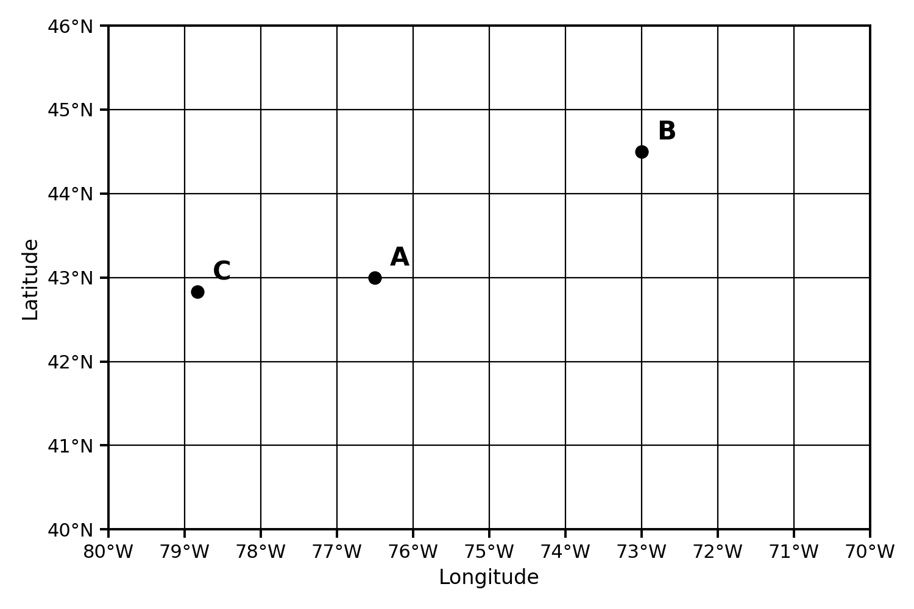
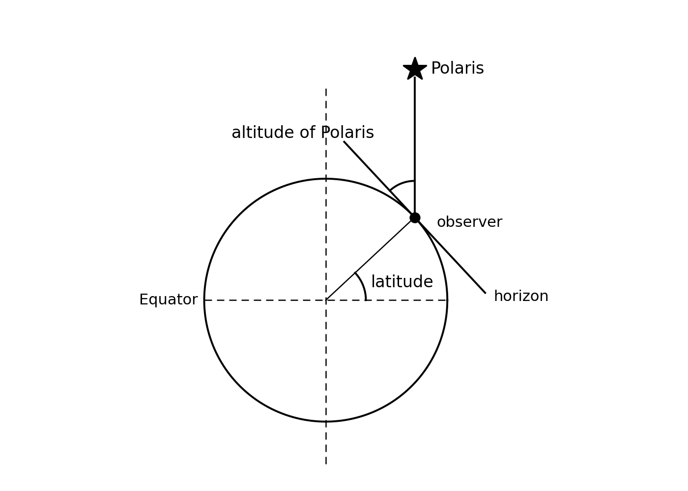

<!-- _class: title-slide -->
<!-- _paginate: false -->

# 🌍 Earth's Coordinates

## Earth Science

### How do we locate things on Earth?

<!--
LESSON GOAL: Students can state and locate positions on Earth using latitude
and longitude in degrees and minutes, explain the Polaris–latitude
relationship, and connect longitude to time zones.

MATERIALS: 2024 ESRT (Generalized Bedrock Geology of New York State, pp. 2-3),
guided notes packet, projected world grid.

TIMING: One 40-minute period, or the first half of an 80-minute block with the
practice set as the back half.

OPENER: Put the driving question on the board and take 60 seconds of turn-and-talk.
"If you had to tell someone exactly where you are standing right now — and they
had no phone, no GPS, no address — what would you tell them?" Collect two or three
responses. Students usually reach for landmarks or distances from a known place.
That is exactly what a coordinate system replaces.
-->

---

# The problem with landmarks

**Directions by landmark**

- "Two miles past the old barn"
- Depends on knowing the barn
- Changes when the barn falls down
- Useless in the middle of an ocean

**Directions by coordinate**

- "42°38′ N, 73°45′ W"
- Works anywhere on the planet
- Never changes
- Same answer for every person

A **coordinate system** gives every point on Earth one unique address built from
a grid of intersecting lines.

<!--
TEACHER MOVE: Run this as a fast contrast, not a lecture. Two minutes maximum.

EXPECTED STUDENT RESPONSES: Students often propose an address or a GPS pin. Push
on both — an address requires a street grid that exists only where people live,
and a GPS pin is *already* latitude and longitude, which is the point of the lesson.

KEY POINT TO SURFACE: The grid has to be built from something that does not move.
That is why the system is anchored to Earth's rotation: the poles and the equator
come from the axis of rotation, not from human decisions. The prime meridian is the
one piece that *was* a human decision (Greenwich, 1884) — worth naming, because
students ask.

TRANSITION: "So let's build that grid."
-->

---

# Earth's coordinate system

To locate a position on Earth we use a system of **two sets of intersecting lines**.

### Latitude

- Run **east–west**, measured **north–south**
- **Parallel** — never touch
- Measured from the **equator (0°)**
- Range: **0° to 90° N or S**

### Longitude

- Run **north–south**, measured **east–west**
- **Meet at the poles**
- Measured from the **prime meridian (0°)**
- Range: **0° to 180° E or W**

Latitude lines are *parallel*; longitude lines are *not*. Longitude lines converge —
they are farthest apart at the equator and meet at the poles.

<!--
TEACHER MOVE: Build this on the board as you say it rather than revealing the
whole slide. Draw the circle, mark the axis, then the equator, then two parallels,
then the meridians converging at the poles.

COMMON MISCONCEPTION #1: "Latitude lines run north-south because they measure
north-south." The line runs east-west; the *measurement* is north-south. Give
students the mnemonic they will actually keep: latitude lines are flat, like the
rungs of a ladder.

COMMON MISCONCEPTION #2: Students expect latitude to go to 180° like longitude.
Ask why it stops at 90°: because you have run out of Earth — you are at the pole.
Longitude goes to 180° because you can travel halfway around in either direction.

CHECK: "Which set of lines are parallel?" (latitude) "Which set meets at a point?"
(longitude) Cold-call two students.
-->

---

# Reading the global grid

| Line | Name | Value | What it separates |
|------|------|-------|-------------------|
| **Latitude 0°** | Equator | 0° | Northern / Southern Hemisphere |
| **Latitude 90° N** | North Pole | 90° N | — |
| **Latitude 90° S** | South Pole | 90° S | — |
| **Longitude 0°** | Prime Meridian | 0° | Eastern / Western Hemisphere |
| **Longitude 180°** | International Date Line | 180° | — |

Every coordinate needs **a number AND a direction**. 43° is not a location.
43° **N** is a line; 43° N, 76° W is a point.

<!--
TEACHER MOVE: Project a world grid map (the Nearpod grid map, or the ESRT NYS map
for the regional version). Have students put a finger on the equator, then the prime
meridian, then the point where they cross (0°, 0° — in the Gulf of Guinea, off West Africa).

CONFERRING QUESTION while circulating: "What hemisphere are we in? How do you know
from the map, not from memory?"

KEY POINT TO SURFACE: Latitude is always written first, then longitude. This is the
single most common formatting error on the Regents. Students who write "76° W, 43° N"
have located a point in the middle of nowhere or nowhere at all.

DIFFERENTIATION: For students who need it, the hemisphere check is mechanical —
above the equator is N, below is S; left of the prime meridian (in the Western
Hemisphere) is W, right is E.
-->

---

# Degrees and minutes

Between each whole degree there are **60 minutes**, written with a prime symbol: **′**

$$1° = 60' \qquad 30' = \tfrac{1}{2}° \qquad 10' = \tfrac{1}{6}°$$

**Estimating on a map**

- Halfway between degree lines ≈ **30′**
- One-third of the way ≈ **20′**
- We estimate to the nearest **10 minutes**

**Worked example**

Syracuse, NY sits just below 43° N and just past 76° W:

**43° N, 76°10′ W**

<!--
TEACHER MOVE: This is the procedural heart of the lesson and where students lose
points on the Regents. Model the estimation out loud on a projected ESRT: "I need
Syracuse. It's sitting right on the 43° parallel, so latitude is 43° N. For longitude,
it's a little past the 76° meridian, maybe a sixth of the way, so about 10 minutes —
76°10′ W."

COMMON MISCONCEPTION: Students treat minutes as decimals. 76.5° is NOT 76°50′ —
it is 76°30′. Do this one explicitly; it catches a third of the class. Half a degree
is thirty minutes because an hour analogy holds: 30 minutes is half an hour.

ANALOGY THAT WORKS: A clock. Sixty minutes in a degree, sixty minutes in an hour.
Half past is :30 on both.

EXPECTED STUDENT RESPONSES: Some will ask about seconds. Yes — 60 seconds in a
minute — but the Regents only requires degrees and minutes, estimated to the
nearest 10′.

TIMING: 6-8 minutes including the worked example.
-->

---

# Your turn: read the grid

> **Give the latitude and longitude of A, B, and C to the nearest 10 minutes.**

<!--
TEACHER MOVE: Silent independent work for 3 minutes, then partner check, then
reveal. Students record these in the guided notes.

ANSWERS:
  A = 43°00′ N, 76°30′ W  (Syracuse area)
  B = 44°30′ N, 73°00′ W  (Plattsburgh / Lake Champlain area)
  C = 42°50′ N, 78°50′ W  (Buffalo area)

LOOK FOR: Students who reverse latitude and longitude, drop the hemisphere letter,
or write 76.5° W instead of 76°30′ W. All three are the errors that cost points.

CONFERRING QUESTION: "How did you decide on the minutes?" You want to hear
fraction-of-the-gap reasoning, not guessing.

EXTENSION for early finishers: "These are three real New York cities. Find them on
the ESRT bedrock map and name them."

TRANSITION: "Latitude and longitude are both just angles. Here's how sailors
measured one of them for four hundred years, with no instruments but a stick."
-->

---

<!-- _class: phase-title -->

# Latitude and Polaris

## How can you find your latitude with your eyes?

<!--
SEGMENT GOAL: Students explain why the altitude of Polaris equals the observer's
latitude, and predict how that altitude changes as an observer moves.

TIMING: 10 minutes.

HOOK: "You are on a ship in 1650. No GPS, no radio, no landmarks — just ocean.
You can still find your latitude to within a degree. How?"
-->

---

# Latitude and Polaris

**Polaris** — the North Star — sits almost directly above Earth's **axis of rotation**.

Because of that, the **altitude** (angle above the horizon) of Polaris **equals the
observer's latitude**.

Polaris is only visible in the **Northern Hemisphere**.

<!--
TEACHER MOVE: Work the geometry with the diagram. The line of sight to Polaris is
effectively parallel to Earth's axis because Polaris is so far away. The horizon is
tangent to Earth at the observer. Those two facts force the altitude angle to equal
the latitude angle.

CHECK THE EXTREMES — this is the move that makes it stick:
  At the North Pole (90° N), Polaris is directly overhead — altitude 90°. ✅
  At the equator (0° N), Polaris sits on the horizon — altitude 0°. ✅
  In the Southern Hemisphere, Polaris is below the horizon — you cannot see it. ✅
Walk all three. Students who can reconstruct the extremes never forget the rule.

COMMON MISCONCEPTION: "Polaris is the brightest star." It is not — it is about 48th.
It matters because of *where* it is, not how bright.

SECOND MISCONCEPTION: Students think Polaris has always been and will always be the
pole star. Earth's axis precesses on a ~26,000-year cycle; Vega gets a turn. Mention
only if you have time — it is enrichment, not Regents content.

CONNECTION: Ties directly to the ESRT latitude scale and to any Regents question
showing an observer sighting Polaris with a protractor or astrolabe.
-->

---

# Moving changes what you see

### Travel north

Polaris climbs **higher** in the sky.
Latitude **increases**.

### Travel south

Polaris drops **lower**.
Latitude **decreases**.

### Travel east or west

The altitude of Polaris **does not change**.
Latitude **stays the same**.

Moving 1° of latitude changes the altitude of Polaris by exactly 1°.
That is about **111 km (69 miles)** of travel on the ground.

<!--
TEACHER MOVE: Quick-fire prediction round. "I'm in Albany and Polaris is at 42°.
I drive to Montreal. Higher or lower?" (Higher — 45°.) "I drive to Buffalo."
(Same — Buffalo and Albany are nearly the same latitude, ~42-43°.) "I fly to Miami."
(Lower — about 26°.)

WHY BUFFALO MATTERS: It is the east-west case, and it is the one students miss.
New York State is wide enough east to west that students assume something must change.
Latitude does not. Longitude does.

REGENTS LINK: Questions of the form "An observer travels from X to Y; how does the
altitude of Polaris change?" appear on nearly every exam. The whole skill is deciding
whether the motion had a north-south component.

FORMATIVE CHECK: Thumbs up / down / sideways for higher / lower / same on three
more scenarios of your choosing.
-->

---

<!-- _class: phase-title -->

# Longitude and Time

## Why does the clock change when you fly west?

<!--
SEGMENT GOAL: Students connect Earth's rotation rate to the 15°-per-hour spacing of
time zones and compute time differences from longitude differences.

TIMING: 10-12 minutes.
-->

---

# Longitude and time zones

Meridians are counted **east and west of the prime meridian** until they meet at **180°**,
the **International Date Line**.

$$\frac{360°\ \text{of rotation}}{24\ \text{hours}} = 15°\ \text{per hour}$$

Time zones are **15° of longitude wide**, and each one represents **1 hour** of time.

Real time-zone boundaries are jagged, not straight. They bend around state, national,
and island borders for political convenience — the 15° rule is the physics underneath.

<!--
TEACHER MOVE: Derive the 15° rather than announcing it. "Earth turns all the way
around — 360° — in how long? So how far does it turn in one hour?" Let a student do
the division out loud.

KEY POINT TO SURFACE: This is a direct consequence of rotation. The same rotation
that gives us day and night gives us time zones. It is not an arbitrary convention;
the *boundaries* are conventional, the *spacing* is not.

EXPECTED STUDENT RESPONSES: Someone will bring up daylight saving time, or the fact
that China uses one time zone for the whole country. Both are true and both are
political decisions layered on top of the physics. Acknowledge and move on.

CONFERRING QUESTION: "If a place is 45° of longitude east of us, how many hours
different is its clock?" (3 hours — and ahead, not behind.)
-->

---

# Which way does the clock go?

### Traveling **east**

Clocks move **ahead** (later).
The sun rises there first.

*New York → London: +5 hours*

### Traveling **west**

Clocks move **back** (earlier).

*New York → Denver: −2 hours*

**Worked example.** Albany is 74° W. Denver is 105° W.

$$105° - 74° = 31° \qquad \frac{31°}{15°/\text{h}} \approx 2\ \text{hours}$$

Denver is west of Albany, so Denver's clock is **2 hours behind**.

<!--
TEACHER MOVE: Anchor the direction with rotation, not memorization. Earth rotates
west to east, so eastern locations rotate into sunlight first — their clocks are ahead.
Demonstrate with a globe and a lamp if you have one out; a fist and the projector
beam works too.

COMMON MISCONCEPTION: Students reverse it, reasoning that "east is ahead on the map."
That happens to give the right answer, but for the wrong reason, and it collapses on
the date line. Push for the rotation explanation.

WORK THE MATH: 31 ÷ 15 = 2.07, which rounds to 2 hours. Note for students that the
answer is approximate because Denver's actual zone boundary is not exactly at a
multiple of 15°.

DIFFERENTIATION: Struggling students can use the two-step recipe —
(1) subtract the longitudes, (2) divide by 15, (3) decide ahead or behind by direction.
Post it.

EXTENSION: "What happens when you cross the International Date Line?" You change
the *date*, not just the hour — westbound you lose a day, eastbound you gain one.
-->

---

# Quick check

**1.** The angle from the horizon to Polaris is equal to the ________ of the observer.

- latitude
- longitude

**2.** Meridians are 15° apart, so time zones are separated by

- 4 hours
- 24 hours
- 1 hour

**3.** A ship sails due east across the Atlantic. The altitude of Polaris will

- increase
- decrease
- stay the same

**4.** How many minutes are in 1° of latitude?

- 10
- 60
- 100

<!--
ANSWERS: 1 — latitude. 2 — 1 hour. 3 — stay the same. 4 — 60.

TEACHER MOVE: Run as whiteboards or a Nearpod poll. All four at once, 90 seconds,
then reveal one at a time and ask for reasoning on any item where the class split.

LISTEN FOR on #3: "Sailing east is an east-west motion, and east-west motion doesn't
change latitude, and Polaris tracks latitude." That full chain is the target response.
Accept "latitude stays the same" but push one student to give the reason.

IF #2 SPLITS: Re-derive 360 ÷ 24 on the board. If students chose 4 hours, they may
have divided 60 by 15 — a plausible wrong move worth naming out loud.
-->

---

# Vocabulary

**Latitude** — angular distance north or south of the equator, 0° to 90°

**Longitude** — angular distance east or west of the prime meridian, 0° to 180°

**Equator** — the 0° line of latitude, halfway between the poles

**Prime meridian** — the 0° line of longitude, through Greenwich, England

**Parallel** — another name for a line of latitude

**Meridian** — another name for a line of longitude

**Altitude** — the angle of an object above the horizon

**International Date Line** — the 180° meridian, where the calendar date changes

<!--
TEACHER MOVE: Do not read this slide aloud. It is a reference page for the notes and
for studying. Point students to it and move on.

DIFFERENTIATION: Students who need vocabulary support should have these eight terms
pre-printed in their guided notes rather than copying them down.

STUDY NOTE for students: The pairs matter — parallel/latitude and meridian/longitude.
Regents questions use the formal terms interchangeably with the common ones.
-->

---

# Exit ticket

> **1.** Give the latitude and longitude of Albany, NY to the nearest 10 minutes
> using the ESRT bedrock geology map.
>
> **2.** An observer measures the altitude of Polaris as 30°. What is their latitude,
> and which hemisphere are they in?
>
> **3.** Explain, in one sentence, why time zones are 15° of longitude wide.

<!--
ANSWERS:
1. Albany ≈ 42°40′ N, 73°45′ W. Accept 42°40′-42°50′ N and 73°40′-73°50′ W.
2. 30° N latitude, Northern Hemisphere. The hemisphere is forced — Polaris is not
   visible from the Southern Hemisphere at all.
3. Earth rotates 360° in 24 hours, which is 15° per hour, so each 15° of longitude
   corresponds to one hour of time.

TEACHER MOVE: Collect as students leave. Question 2 is the diagnostic one — if
students give the latitude but miss the hemisphere, they have memorized the rule
without understanding where Polaris can be seen from.

NEXT LESSON: Elevation and topographic maps — the third coordinate. We can now
locate any point on the surface; next we add how far above sea level it sits.
-->
