<!-- _class: lead -->
<!-- _paginate: false -->
<!-- _header: '' -->

# Topographic Mapping

## Fields, isolines, profiles, and gradient

---

<!-- _class: split wide -->

# Why maps have lines on them

- A topographic map shows a **three-dimensional** landscape on a **two-dimensional** sheet of paper
- Slice the mountain at even elevations, look straight down at the slices, and you get **contour lines**
- Each line traces one elevation all the way around the landform

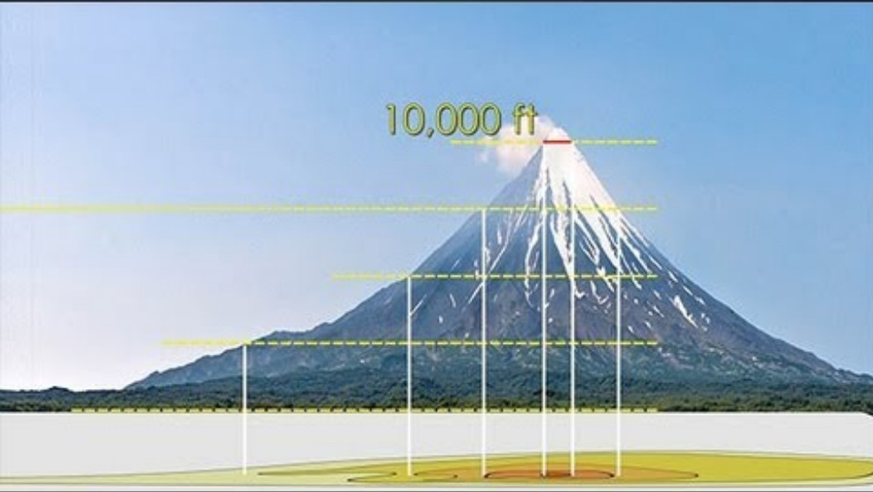

---

# Mapping the Earth: terms

- **Field** — any region of space that has a measurable value of a given quantity at every point
- **Isoline** — a line connecting points of **equal value**
- **Isotherm** — a line connecting points of equal **temperature**
- **Isobar** — a line connecting points of equal **pressure**
- **Contour line** — a line connecting points of equal **elevation**

> *Iso-* means "equal." Change the ending, change the quantity being mapped — the rules for drawing the lines never change.

---

<!-- _class: split wide -->

# How to draw an isoline

1. Connect dots of **equal value**, using the interval stated in the directions
2. Where the exact value isn't printed, **estimate** where it falls between a higher point and a lower point
3. Bring every isoline all the way to the **edge of the field**

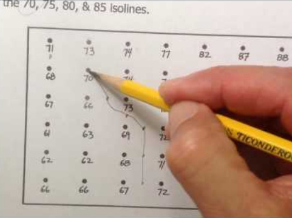

---

# Rules isolines never break

- Isolines **never cross** each other — one point can't have two values
- Isolines **never split** or branch
- Isolines close into loops or run off the edge of the map
- Values change **in order** — you can't skip from 40 to 60 without a 50 in between
- Lines **close together** = value changing quickly
- Lines **far apart** = value changing slowly

---

<!-- _class: split narrow -->

# Practice: draw the isotherms

- Surface temperature field for the central U.S.
- Draw contours **every 10 °F**
- Then reveal the answers and check your work
- `courseware.e-education.psu.edu` → meteo101 → Lesson 2 contour tool

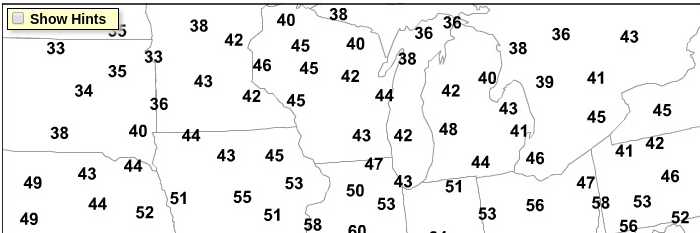

---

<!-- _class: split -->

# Map scale and direction

**Map scale** — the ratio between distance on the map and actual distance on Earth's surface.

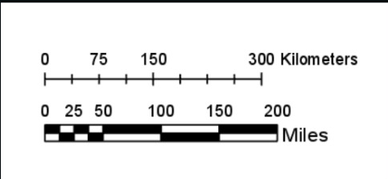

**Cardinal directions** — north, south, east, west, and any combination (NE, SW, …).

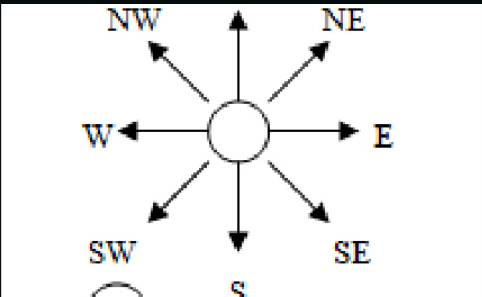

---

<!-- _class: split wide -->

# Making a profile — steps 1 and 2

1. Line the edge of a piece of **scrap paper** up with the two points on your map
2. Mark the **two endpoints** on the scrap paper, plus **every contour line** that falls between them

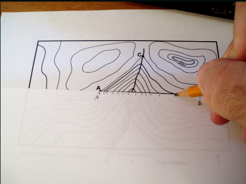

---

<!-- _class: split -->

3. Write the **value** of every mark you made on the scrap paper.

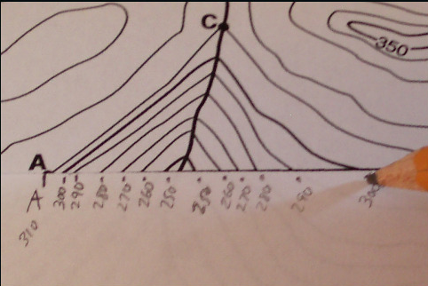

4. Line the paper edge up with the **x-axis** (first point at the origin) and plot each elevation against the **y-axis**.

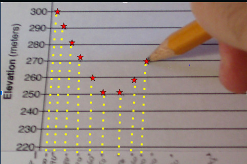

---

<!-- _class: split -->

# Connect the dots

## Join your points with a **smooth curve** — this is the side view of the land along the line

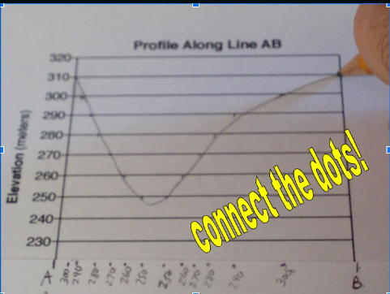

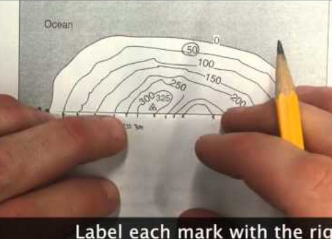

---

<!-- _class: split narrow -->

# Round out your peaks

- The land keeps rising past the last contour line you crossed, so a hilltop is **rounded**, not pointed
- Valley bottoms get rounded for the same reason
- **Straight lines and sharp points receive no credit**

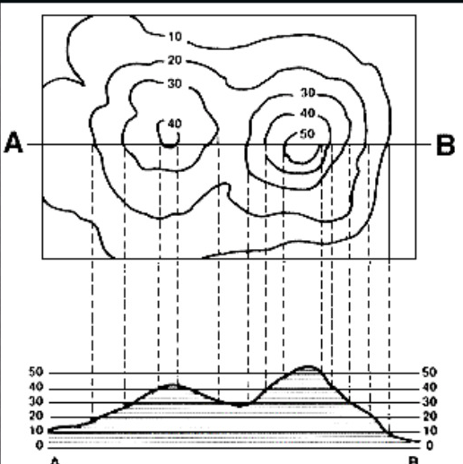

---

<!-- _class: split narrow -->

# Contour lines over a stream

- Contour lines **bend** where they cross a stream
- The bend makes a **"V" that points upstream**
- Water flows **downhill**, so the stream flows **opposite** the direction the V points
- Streams run from **high** elevation toward **low** elevation

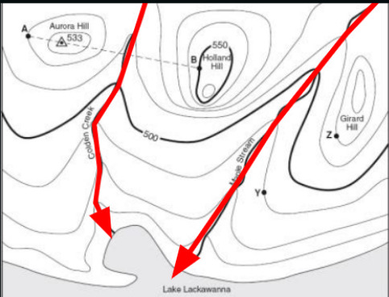

---

# Gradient

- $\text{Gradient} = \dfrac{\text{change in field value}}{\text{distance}}$
- Describes how **steep** a slope is
- The **closer** the isolines are in a given distance, the **larger** the gradient

---

# Gradient example

Point A is at **123 feet**. Point B is at **20 feet**. The two points are **2 miles** apart. What is the gradient?

$$\text{Gradient} = \frac{\text{change in field value}}{\text{distance}} = \frac{123\ \text{ft} - 20\ \text{ft}}{2\ \text{mi}} = \frac{103\ \text{ft}}{2\ \text{mi}} = 51.5\ \text{ft/mi}$$

> **DON'T FORGET UNITS!** Equation → substitution → answer with units, every time.

---

<!-- _class: lead -->

# Draw It

## Your turn

---

# Try this one

Point A elevation: **260 feet**
Point B elevation: **10 feet**
Distance between the points: **3 miles**

**Find the gradient.** Show the equation, the substitution, and the units.

---

# Check yourself

$$\text{Gradient} = \frac{260\ \text{ft} - 10\ \text{ft}}{3\ \text{mi}} = \frac{250\ \text{ft}}{3\ \text{mi}} \approx 83.3\ \text{ft/mi}$$

- Equation comes from **page 1 of the ESRT**
- Subtract **low from high** for the change in field value
- Units are **feet per mile** — the unit tells you it's a rate

---

# Before you leave

1. What does a contour line connect?
2. Two maps show the same hill. On map X the contours are crowded; on map Y they are spread out. Which hill is steeper, and why?
3. A stream crosses a contour line. Which way does the V point?
4. Why must a profile have a rounded top instead of a sharp peak?
