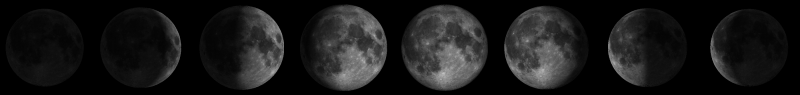
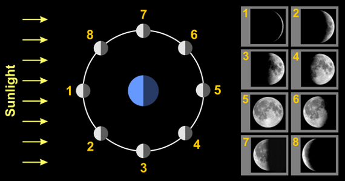
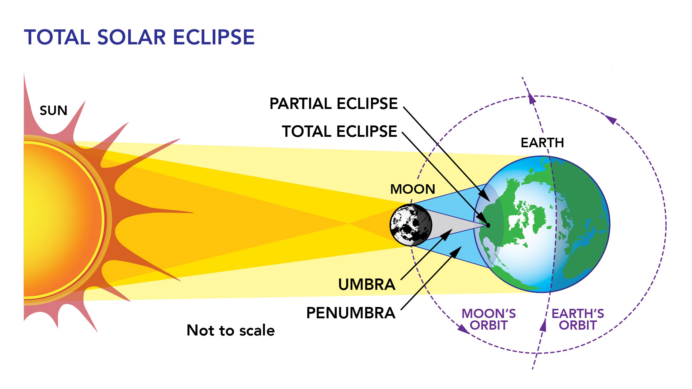
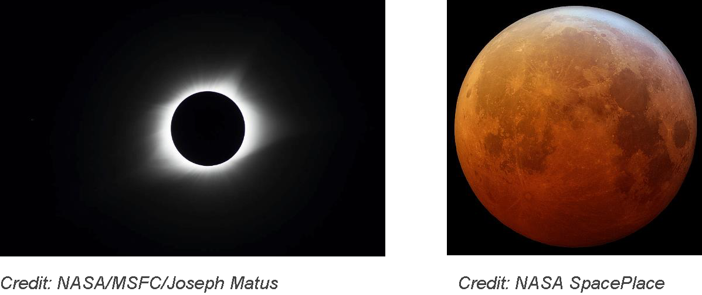
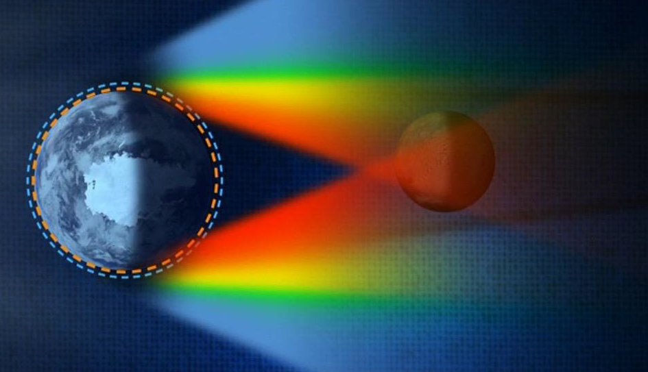

<!-- _class: title-slide -->

# 🌙 The Earth–Moon System

## Phases · Geometry · Eclipses · Tides

### How does the geometry of three bodies — Sun, Earth, Moon — produce everything we see in the sky and feel in the sea?

<!--
UNIT OVERVIEW: This deck supports the NAAP Lunar Phase Simulator lab and extends it to eclipses and tides.
DRIVING QUESTION: Given any two of (phase, time, location in the sky), can we determine the third?
PERFORMANCE EXPECTATION: Develop and use a model of the Earth-Sun-Moon system to describe cyclic patterns of lunar phases, eclipses of the sun and moon, and seasons.
TIMING: ~3-4 class periods of instruction + lab time
MATERIALS: NAAP Lunar Phase Simulator, foam ball + flashlight optional, this deck, guided notes
LAUNCH: Start by asking "Has the moon ever surprised you? What were you doing when you noticed it?" Capture responses on chart paper.
-->

---

# What we'll figure out

By the end of this unit you should be able to:

1. **Explain** what causes the phases of the moon (and what *doesn't*)
2. **Predict** the phase of the moon given the date, or the date given the phase
3. **Determine** when a given phase rises, transits, and sets
4. **Distinguish** lunar eclipses from solar eclipses and explain why we don't get them every month
5. **Connect** the position of the Moon and Sun to the daily and monthly cycle of tides

The whole unit hangs on **one big idea**: the Sun, Earth, and Moon are three bodies in motion, and their relative geometry explains nearly everything you observe.

<!--
TEACHER MOVE: Read these objectives aloud — they map directly to the lab and to the guided notes.
TRANSITION: "Before we look at the geometry, let's settle a famous misconception."
-->

---

<!-- _class: phase-title -->

# PART 1
## Moon Phases — What Causes Them?

<!--
PHASE GOAL: Students leave knowing phases are caused by Sun-Earth-Moon GEOMETRY, not by Earth's shadow.
GROUPING: Whole class, with quick turn-and-talks
TIMING: ~25 minutes
ROUTINE: Use a foam ball + flashlight demo if available — even better, do it with the room lights off.
-->

---

# Is there a "dark side" of the moon?

**The common answer:** Yes — there's a permanently dark side we never see.

**The astronomer's answer:** *It depends what you mean by "dark."*

- The **far side** is the side we never see from Earth — but it gets just as much sunlight as the near side.
- The **night side** is whichever half is currently facing away from the Sun. That half *is* dark — but it's constantly changing as the Moon orbits.

**Pink Floyd lied to you.** There is no permanently dark side of the Moon. Every part of the lunar surface gets ~14 days of sunlight followed by ~14 days of night.

<!--
TEACHER MOVE: Take a quick poll BEFORE revealing the answer. "How many of you think there's a permanent dark side?" Record the count. Come back to it after the demo.
COMMON MISCONCEPTION: Many students conflate "far side" with "dark side." These are different things.
KEY POINT TO SURFACE: Phases are NOT caused by Earth's shadow. The dark part of the Moon during phases is its own night side.
EXPECTED RESPONSES: Students may insist on the dark side because of pop culture. Use the foam ball demo to demonstrate.
-->

---

# Why we always see the same side

The Moon **rotates on its axis** at exactly the same rate it **orbits Earth**.

- Both take about **27.3 days** (the sidereal month).
- This is called **synchronous rotation** or **tidal locking**.
- The result: the same hemisphere always faces Earth.

The Moon is *not* "not rotating." It's rotating *just enough* to keep the same face toward us.

**Tidal locking** is common in the solar system. Almost all major moons are tidally locked to their planets. Earth's tides on the Moon (when it was younger and partly molten) are what locked it in place.

<!--
TEACHER MOVE: Do the "walk around a chair" demo. Have a student walk around a chair while always facing the chair. Ask the class: "Did the student rotate?" They will likely say no. Have the student walk again, this time facing the same wall the entire time (not turning to face the chair). Now compare: in the first case, the student DID rotate — once per orbit.
EXPECTED RESPONSES: Students often think the Moon doesn't rotate. The demo flips this intuition.
TRANSITION: "OK — so the Moon's rotation isn't what causes phases. What does?"
-->

---

# The geometry that causes phases

The Moon's **phase** depends only on the **angle** between the Sun, Earth, and Moon.

**Half of the Moon is always lit by the Sun** — that doesn't change.

What changes is **how much of the lit half we can see from Earth.**

When the Moon is...
- **between** Earth and Sun → we see the unlit side → **new moon**
- **opposite** the Sun from Earth → we see the lit side → **full moon**
- **at 90°** to the Sun → we see half lit, half dark → **quarter moon**

**Phases are about geometry, not shadow.** Earth's shadow only falls on the Moon during a *lunar eclipse* — and that's a separate thing entirely.

<!--
TEACHER MOVE: This is the conceptual heart of the unit. Slow down. Use the foam ball + flashlight demo.
DEMO: Hold a styrofoam ball at arm's length. Have a flashlight (the "Sun") shining on it from one direction. Slowly rotate yourself (you are "Earth") and watch the ball. As the ball moves to different positions relative to you and the light, you see different phases. The ball is ALWAYS half-lit — what changes is your viewing angle.
KEY POINT TO SURFACE: Half the Moon is always lit. The phase is about what we see from Earth.
DIFFERENTIATION: For students who struggle, do the demo individually with them after class.
-->

---

# The eight phases

| # | Phase | What you see | Direction in cycle |
|---|-------|--------------|--------------------|
| 1 | **New** | Nothing — Moon between us and Sun | Start |
| 2 | Waxing crescent | Thin sliver, lit on right | Growing |
| 3 | **First quarter** | Right half lit | Growing |
| 4 | Waxing gibbous | Mostly lit, dark on left | Growing |
| 5 | **Full** | Whole disk lit | Maximum |
| 6 | Waning gibbous | Mostly lit, dark on right | Shrinking |
| 7 | **Last (third) quarter** | Left half lit | Shrinking |
| 8 | Waning crescent | Thin sliver, lit on left | Shrinking |

*Bold rows are the four **primary phases**. Others are **intermediate**.*

<!--
TEACHER MOVE: Have students recite the cycle aloud once or twice. Pattern recognition matters.
KEY POINT TO SURFACE: New → Full takes ~14.75 days; Full → New takes another ~14.75 days; total ~29.5 days.
TIMING: ~3 minutes
NORTHERN HEMISPHERE NOTE: All "lit on the right" / "lit on the left" descriptions assume Northern Hemisphere observers. Southern Hemisphere observers see the mirror image.
-->

---

---

# Two pairs of vocabulary words

**Waxing** — the lit fraction is *increasing* (new → full). The word means "growing" — same root as "wax-and-wane."

**Waning** — the lit fraction is *decreasing* (full → new).

**Crescent** — *less than half* of the disk is lit (a thin or fattening sliver).

**Gibbous** — *more than half* of the disk is lit (Latin for "humped" or "rounded").

Combine them: **waxing crescent**, **waxing gibbous**, **waning gibbous**, **waning crescent.** Two adjectives describe each non-primary phase.

<!--
TEACHER MOVE: Connect to the etymology box in the lab — "wax" as a verb meaning "grow," "gibbous" meaning "humped." Many students have only seen "wax" as a noun (candle wax) or as a verb meaning "to apply wax."
EXPECTED STUDENT RESPONSES: Some students will know "wax and wane" from another context. Capitalize on that.
TIMING: ~3 minutes
-->

---

# Which side is lit?

In the **Northern Hemisphere**:

**Waxing** half (new → full)
- Right side is lit
- Dark side shrinks from right to left
- "Lighting up from the right"

**Waning** half (full → new)
- Left side is lit
- Dark side grows from right to left
- "Lighting down from the right"

**Trick to remember**: the **terminator** (the line dividing light and dark) always moves from **right to left** across the Moon's face — slowly, over the whole month.

<!--
TEACHER MOVE: Draw this on the board. Show the terminator moving right-to-left as you redraw the moon at successive phases.
COMMON MISCONCEPTION: Students often think the lit side just "switches" between phases. It moves gradually.
DIFFERENTIATION: Students from the Southern Hemisphere (or with family there) will see the opposite. Acknowledge this — they're not wrong.
-->

---

# Percent illumination

How much of the disk we see lit, expressed as a percentage:

| Phase | % Illuminated |
|-------|---------------|
| New | 0% |
| Waxing/waning crescent | 1–49% |
| First/last quarter | **50%** |
| Waxing/waning gibbous | 51–99% |
| Full | 100% |

**Why is it called "first quarter" if it's half lit?** Because at first quarter, the Moon has completed one *quarter* of its orbit. The "quarter" refers to the orbit, not the lit fraction.

<!--
TEACHER MOVE: This is one of the most reliable misconception traps. Address it head-on.
EXPECTED STUDENT RESPONSES: "But it's half lit!" — yes, exactly. "Quarter" describes orbital position.
KEY POINT TO SURFACE: The Moon's orbit has 4 quarters: new → first quarter → full → last quarter → new.
-->

---

# How long is one cycle?

The complete phase cycle takes about **29.5 days**.

This is called the **synodic month** (or "lunation").

- New → Full: ~14.75 days
- Full → New: ~14.75 days
- One week ≈ ¼ of a cycle

**Synodic month** — Time for the Moon to return to the same phase (e.g., new to new). About **29.5 days**.

**Sidereal month** — Time for the Moon to complete one orbit relative to the stars. About **27.3 days**.

**Why are these different?** While the Moon orbits Earth, Earth has moved partway around the Sun. The Moon needs an extra ~2 days to "catch up" to the same phase angle.

<!--
TEACHER MOVE: Don't dwell too long on sidereal vs synodic — name it, define it, and move on. Students will see this distinction more in astronomy classes.
DIFFERENTIATION: For advanced students, ask "How does this connect to the length of a 'month' in the calendar?"
TIMING: ~5 minutes
-->

---

# Direction of orbit and rotation

Looking down on the **North Pole** of the Earth–Moon system:

🌍 **Earth rotates** counter-clockwise

🌙 **Moon orbits** counter-clockwise

☀️ **Earth orbits the Sun** counter-clockwise

**It's all counter-clockwise** when viewed from above the North Pole. This is convention — and a big help for solving lab problems.

<!--
TEACHER MOVE: This is essential for the lab. The Moon-bisector demo and all horizon-diagram problems depend on knowing the direction.
DEMO: Stand at the front of the room, hold your fist as Earth, walk around with another fist as the Moon. Demonstrate counter-clockwise from above. Then flip and show clockwise from BELOW (south pole) — same motion, different viewing direction.
TRANSITION: "Now let's connect the geometry to TIME."
-->

---

<!-- _class: phase-title -->

# PART 2
## Time, Geometry, and the Sky

<!--
PHASE GOAL: Students learn that time of day = position of Sun in the sky, and rising/setting times of the Moon depend on its phase.
GROUPING: Whole class with student volunteers for demos
TIMING: ~30 minutes
ROUTINE: This section pairs with Pages 3-6 of the lab (Time of Day, Rising/Setting, Horizon Diagram, Witness/Detective).
-->

---

# Time of day = position of the Sun

The Sun's apparent motion across the sky is caused by **Earth's rotation** (not the Sun moving).

Earth rotates **counter-clockwise** when viewed from above the North Pole.

| Sun's position | Local time |
|----------------|------------|
| Below eastern horizon | Night → about to rise |
| **On eastern horizon** | **6:00 AM (sunrise)** |
| **On the meridian (south, highest point)** | **12:00 PM (noon)** |
| **On western horizon** | **6:00 PM (sunset)** |
| Below the Earth (opposite side from observer) | **12:00 AM (midnight)** |

These six-hour-apart times are simplifications. Real sunrise/sunset times shift with the seasons (because Earth's axis is tilted 23.5°).

<!--
TEACHER MOVE: Use the diagram on Page 3 of the lab. Show the stick figure rotating around the Earth in the simulator.
KEY POINT TO SURFACE: The Sun isn't moving (much). Earth is rotating, sweeping the stick-figure observer through different orientations relative to the Sun.
COMMON MISCONCEPTION: Many students believe the Sun rises and sets due to the Sun moving across the sky.
EXPECTED RESPONSES: Some students may ask about daylight saving time, time zones, etc. Note these are conventions on top of astronomical time.
-->

---

# The horizon diagram

A **horizon diagram** shows what the sky looks like to one observer at one moment. It's like an upside-down bowl over the observer's head.

Key reference points:
- **Zenith** — straight up (90° altitude)
- **Nadir** — straight down (below the observer)
- **Meridian** — N–S line passing overhead
- **Horizon** — where sky meets ground (0° altitude)
- **Cardinal directions** — N, E, S, W

**Altitude** — angle above the horizon, 0° to 90°

**Azimuth** — compass direction (N=0°, E=90°, S=180°, W=270°)

**Celestial equator** — line across the sky from due east, through south at moderate altitude, to due west. Where the Sun and Moon are *on average*.

<!--
TEACHER MOVE: Have students stand up, face south, and physically point at the zenith, then the meridian (which runs through their zenith from N to S), then the horizon.
ROUTINE: Practice with quick-fire prompts: "Point to the eastern horizon!" "Point to your zenith!" "Where would the Sun be at 9 AM?"
EXPECTED STUDENT RESPONSES: Students often confuse altitude (degrees above horizon) with azimuth (direction).
TRANSITION: "Now let's combine the horizon diagram with what we know about phases."
-->

---

# Rising, transit, setting

Every object in the sky has three key moments:

**Rising** — the object crosses the **eastern** horizon (going up).

**Transit** (or **meridian crossing**) — the object crosses the meridian (highest point in the sky).

**Setting** — the object crosses the **western** horizon (going down).

**Rule**: Anything in the sky rises in the **east** and sets in the **west** because Earth rotates **west to east**. The objects aren't really moving — *we* are.

<!--
TEACHER MOVE: Connect this back to the Sun. "We just said the Sun rises at 6 AM and sets at 6 PM." Now apply the same logic to the Moon.
COMMON MISCONCEPTION: Students think every object rises due east and sets due west. In reality, only objects on the celestial equator do exactly that. The Sun, for example, rises north of east in summer and south of east in winter (in the Northern Hemisphere).
-->

---

# Moon rise, transit, set times

| Phase | Rises | Transits | Sets |
|-------|-------|----------|------|
| **New** | 6 AM | 12 PM (noon) | 6 PM |
| Waxing crescent | 9 AM | 3 PM | 9 PM |
| **First quarter** | 12 PM (noon) | 6 PM | 12 AM (midnight) |
| Waxing gibbous | 3 PM | 9 PM | 3 AM |
| **Full** | 6 PM | 12 AM (midnight) | 6 AM |
| Waning gibbous | 9 PM | 3 AM | 9 AM |
| **Last quarter** | 12 AM (midnight) | 6 AM | 12 PM (noon) |
| Waning crescent | 3 AM | 9 AM | 3 PM |

**Pattern**: Rising, transit, and setting are **6 hours apart** for each phase — and each phase rises **3 hours later** than the previous one.

<!--
TEACHER MOVE: Don't ask students to memorize this whole table. Have them memorize the FOUR PRIMARY ROWS, then derive the others.
EXPECTED STUDENT RESPONSES: "How are we supposed to remember this?" — show them the pattern: each phase shifts ~50 minutes later per day, ~3 hours later per primary phase.
KEY POINT TO SURFACE: A FULL MOON RISES AT SUNSET. This is the single most useful fact in the whole table.
-->

---

# The Phase–Time–Location Triangle

**Big idea**: Given any **two** of the following three pieces of information, you can determine the **third**:

1. The Moon's **phase**
2. The **time** of day
3. The Moon's **location** in the sky

This is the central tool of the lab — and the central skill of this unit.

<!--
TEACHER MOVE: Draw a triangle on the board with the three corners labeled "PHASE," "TIME," "LOCATION." Cover any one corner — students must determine it from the other two. This becomes the routine for the rest of the unit.
ROUTINE: "Two of these, and you can find the third." Use this phrasing repeatedly.
TRANSITION: "Let's see this in action with a famous detective story."
-->

---

# The Witness and the Detective

> **Sherlock Holmes** is investigating a crime that took place at **3 AM**, far from any street lamps. A witness claims he recognized the perpetrator by **the light of a first quarter moon**. Should Holmes believe him?

We know two things:

1. **Phase**: First quarter
2. **Time**: 3 AM

We need to find: **Where is the Moon in the sky at 3 AM?**

<!--
TEACHER MOVE: This is the central application. Set it up as a mystery. "Holmes is going to solve this with astronomy." Don't reveal the answer yet — work it out together.
ROUTINE: Have students fill in their guided notes step-by-step alongside.
TRANSITION: "Let's set up the geometry."
-->

---

# Solving the Holmes problem

**Step 1**: Where is the Moon for first quarter? *90° east of the Sun in its orbit (counter-clockwise from above).*

**Step 2**: Where is the observer at 3 AM? *On the night side of Earth, opposite the noon position — about 45° past midnight rotating toward sunrise.*

**Step 3**: Combine on a horizon diagram.

**Result**: At 3 AM, a first quarter moon has already **set** (it set at midnight). It's below the western horizon — the witness could not see it.

The witness is **lying** — or at least mistaken. There was no moonlight at 3 AM that night.

<!--
TEACHER MOVE: Walk through this on the board with diagrams. Have students walk through it on the simulator immediately after.
KEY POINT TO SURFACE: The witness's testimony fails on astronomical grounds — Holmes solves the case with geometry.
EXTENSION: "What phase WOULD have given the witness moonlight at 3 AM?" (Answer: full moon, waning gibbous, or last quarter)
TIMING: ~5 minutes for the full reasoning
-->

---

<!-- _class: phase-title -->

# PART 3
## Eclipses

<!--
PHASE GOAL: Students distinguish solar from lunar eclipses, explain why they're rare, and identify the geometry that produces each type.
GROUPING: Whole class
TIMING: ~25 minutes
MATERIALS: Optional — eclipse glasses, video of total solar eclipse
ROUTINE: Connect back to the geometry from Part 1. Eclipses happen when the geometry is JUST RIGHT.
-->

---

# Why don't we get an eclipse every month?

If the Moon passes between Earth and Sun every new moon, why don't we get a solar eclipse every month?

The Moon's orbit is **tilted ~5°** relative to Earth's orbit around the Sun (the **ecliptic plane**).

Most months, the Moon passes **above** or **below** the Sun (from our viewpoint) at new moon, and **above** or **below** Earth's shadow at full moon.

Eclipses only happen when the new or full moon occurs **near a node** — one of the two points where the Moon's orbit crosses the ecliptic.

We get **2–5 eclipses per year** (a mix of solar and lunar) — not 24.

<!--
TEACHER MOVE: Hold up a frisbee at an angle to demonstrate the 5° tilt. Most months the Moon "misses" the Sun-Earth line.
COMMON MISCONCEPTION: Students often assume the Moon's orbit is in the same plane as Earth's orbit. It isn't — and that's the whole reason eclipses are rare.
KEY POINT TO SURFACE: Eclipses require alignment in BOTH dimensions — phase (new/full) AND position (at a node).
TRANSITION: "Now let's look at each type."
-->

---

---

# Solar eclipse: Moon blocks the Sun

**Geometry**: Moon **between** Sun and Earth. The Moon's shadow falls on Earth.

**Phase**: Always **new moon**.

**Who sees it**: Only people in the narrow path of the Moon's shadow (a few hundred km wide).

**Duration**: A few minutes of totality at any one location.

**Umbra** — the dark inner shadow. From inside the umbra, the Sun is fully blocked.

**Penumbra** — the lighter outer shadow. From inside the penumbra, the Sun is only partially blocked.

<!--
TEACHER MOVE: Reference the August 2017 and April 2024 total solar eclipses. Some students may have witnessed totality.
DEMO: Use a small ball (Moon) and a larger ball (Earth) with a flashlight. The small ball casts a tiny shadow on the larger ball — only a small region experiences totality.
EXPECTED RESPONSES: Students may have stories from the 2024 eclipse — let them share briefly.
TIMING: ~5 minutes
-->

---

---

# Three types of solar eclipse

| Type | What you see | Why |
|------|--------------|-----|
| **Total** | Sun is *completely* blocked; corona visible | Observer in the umbra; Moon close enough to fully cover the Sun |
| **Partial** | Sun is *partly* blocked | Observer in the penumbra |
| **Annular** | A "ring of fire" — Sun's edge visible around the Moon | Moon is at apogee (farthest from Earth), so it's too small to fully cover the Sun |

**Never look at a partial solar eclipse without proper eye protection.** Eclipse glasses (ISO 12312-2) are essential. Even 99% coverage will burn your retinas.

The only safe time to look directly is during *totality* of a total eclipse — and only in the few minutes when the Sun is fully blocked.

<!--
TEACHER MOVE: Emphasize eye safety. Many students don't realize how dangerous looking at the Sun is even during a partial eclipse.
KEY POINT TO SURFACE: Annular eclipses happen because the Moon's orbit is elliptical — its angular size varies.
TRANSITION: "Now flip the geometry — what about lunar eclipses?"
-->

---

# Lunar eclipse: Earth blocks the Sun

**Geometry**: Earth **between** Sun and Moon. Earth's shadow falls on the Moon.

**Phase**: Always **full moon**.

**Who sees it**: Anyone on the night side of Earth — which is half the planet.

**Duration**: Up to several hours.

Lunar eclipses are seen by **far more people** than solar eclipses — but they're less dramatic. Earth's shadow on the Moon doesn't darken the sky around you.

<!--
TEACHER MOVE: Make the comparison explicit. Solar = small shadow on Earth; Lunar = big shadow on Moon.
COMMON MISCONCEPTION: Students sometimes think lunar eclipses cause phases. They don't. Phases are monthly; lunar eclipses are rare.
EXPECTED RESPONSES: Some students may have seen the "blood moon" totality. Let them describe what they saw.
-->

---

---

<iframe width="1100" height="600" src="https://www.youtube.com/embed/mbT50-rppaU?si=9V23LcvojLJPUnjJ" title="YouTube video player" frameborder="0" allow="accelerometer; autoplay; clipboard-write; encrypted-media; gyroscope; picture-in-picture; web-share" referrerpolicy="strict-origin-when-cross-origin" allowfullscreen></iframe>

---

# Three types of lunar eclipse

| Type | What you see | Why |
|------|--------------|-----|
| **Total** | Whole Moon passes through Earth's umbra; turns deep red ("blood moon") | Sunlight is *refracted* through Earth's atmosphere — only red wavelengths reach the Moon |
| **Partial** | Part of the Moon enters the umbra; appears bitten | Imperfect alignment |
| **Penumbral** | Moon enters only the penumbra; subtle dimming, often unnoticed | Far from a node — barely an eclipse |

**Why is a totally eclipsed moon red?** It's seeing the light from every sunrise and sunset on Earth at once — refracted through our atmosphere, with the blue light scattered away.

<!--
TEACHER MOVE: This is a good place to connect to atmospheric science (Rayleigh scattering — blue light scatters more, red light passes through). Same physics as why sunsets are red.
DIFFERENTIATION: For advanced students, ask "What would a 'lunar eclipse' look like to an astronaut on the Moon?" (Answer: a total solar eclipse with the Earth blocking the Sun, ringed by every sunrise and sunset on Earth.)
TIMING: ~5 minutes
-->

---

# Solar vs. lunar eclipse — side by side

**Solar Eclipse**
- Phase: **New moon**
- Geometry: Moon → Earth → ☀️
- Earth's shadow? No — *Moon's* shadow on Earth
- Duration: minutes
- Visible from: small region
- Looking at it: dangerous without glasses

**Lunar Eclipse**
- Phase: **Full moon**
- Geometry: ☀️ → Earth → Moon
- Earth's shadow? Yes — on the Moon
- Duration: hours
- Visible from: half of Earth
- Looking at it: completely safe

**Memory hook**: Solar eclipse = Sun gets covered (Moon in front of Sun). Lunar eclipse = Moon gets darkened (Earth's shadow on Moon).

<!--
TEACHER MOVE: This side-by-side is the most testable content in this section. Have students fill in their notes and quiz them.
TRANSITION: "OK — geometry of phases ✓, geometry of eclipses ✓. Now let's look at how the Moon affects something we can FEEL — the tides."
-->

---

<!-- _class: phase-title -->

# PART 4
## Tides

<!--
PHASE GOAL: Students explain the cause of two tidal bulges, predict spring vs neap tides from phase, and connect tides to gravity and geometry.
GROUPING: Whole class with quick demos
TIMING: ~25 minutes
ROUTINE: Connect to the rest of the unit — tides depend on the SAME Earth-Moon-Sun geometry as phases and eclipses.
-->

---

# What causes tides?

The Moon's **gravity** pulls on Earth — but the pull is **stronger on the near side** of Earth than on the far side, because gravity weakens with distance.

This **difference in gravitational pull** across Earth is what creates tides — not gravity itself.

**Tides are caused by *differential* gravity** — the difference in pull on the near vs. far sides of Earth.

<!--
TEACHER MOVE: This is subtle. The Moon's gravity at Earth's surface is tiny. What matters is that gravity drops off with distance, so the Moon pulls slightly harder on water on the near side and slightly less hard on water on the far side.
COMMON MISCONCEPTION: Students think the Moon "pulls the water up." That's only half the story. The other bulge — on the far side — needs explanation.
TRANSITION: "Two bulges, not one. Let's see why."
-->

---

# The two tidal bulges

Earth has **two tidal bulges** — one on the side facing the Moon, one on the **opposite** side.

**Near-side bulge**: The Moon pulls water (and Earth) toward itself; water is closer to the Moon, so it gets pulled *more* than the solid Earth → bulge points toward the Moon.

**Far-side bulge**: On the far side, Earth gets pulled toward the Moon *more* than the water; the water effectively "lags behind" → bulge points away from the Moon.

As Earth rotates, every coastline passes through both bulges every 24 hours and 50 minutes — giving us **two high tides** and **two low tides** every day.

<!--
TEACHER MOVE: Draw the two bulges on the board. The cleanest analogy: imagine three runners — water on the near side, solid Earth, water on the far side. The Moon "calls" them to come closer. The near runner runs fastest, Earth runs medium, the far runner runs slowest. The result: water bunches up on the near side AND lags behind on the far side.
COMMON MISCONCEPTION: This is famously hard. Students intuitively grasp the near-side bulge but not the far-side bulge. Spend time here.
DIFFERENTIATION: For advanced students: "If you used your fingers to model differential gravity, the near-side water 'falls toward' the Moon faster than Earth, the far-side water 'falls toward' the Moon slower than Earth — both end up bulging away from Earth's center."
-->

---

# The daily tidal cycle

In a typical 24h 50min lunar day, a coastline experiences:

- **2 high tides** (~12h 25min apart)
- **2 low tides** (~12h 25min apart)
- High and low alternate every ~6h 12min

Why **24h 50min** instead of exactly 24 hours? Because while Earth rotates, the Moon has moved a bit further along in its orbit. Earth has to rotate a few extra minutes to "catch up" to the Moon's new position.

**Tides shift by ~50 minutes each day.** If high tide is at 6:00 AM today, it'll be around 6:50 AM tomorrow — and roughly that hour-of-day will repeat each lunar month.

<!--
TEACHER MOVE: Connect this to actual NOAA tide tables — a great extension activity is to have students find their local tide table and predict tides for the next week.
EXPECTED STUDENT RESPONSES: "Why doesn't this match the tide chart at the beach?" — local geography (bay shape, channel depth) creates large variations from the simple model.
KEY POINT TO SURFACE: The simple two-bulge model gets the patterns right; real tides are heavily modified by local geography.
-->

---

# The Sun also pulls

The **Sun** also pulls on Earth's water — but its tidal effect is only about **half** as strong as the Moon's.

**Why is the Sun's tide weaker, even though the Sun is way more massive?** Because *tidal force* depends on the **difference** in gravity across Earth — and that difference falls off as $\frac{1}{r^3}$, not $\frac{1}{r^2}$. The Sun is much farther, so the gravity gradient across Earth is much shallower.

But the Sun's tidal effect is not negligible. When the Sun's pull lines up with the Moon's, tides are **bigger**. When the two are at right angles, tides are **smaller**.

<!--
TEACHER MOVE: This is a key opportunity to revisit gravity. The Sun has WAY more gravity at Earth, but the difference between near and far side is small.
DIFFERENTIATION: For advanced students, the 1/r³ dependence of tidal force is a worthwhile derivation. For Regents-level, just state it.
TRANSITION: "When does the Sun line up with the Moon? Look at our phase chart..."
-->

---

# Spring tides — the biggest tides

**Spring tides** happen at **new moon** and **full moon**.

The Sun, Earth, and Moon are in a straight line, so the Sun's tidal pull *adds* to the Moon's.

Result:
- **Higher** high tides
- **Lower** low tides
- The biggest tidal range of the month

"Spring" doesn't refer to the season — it comes from the Old English *springan*, "to leap up." The water springs higher than usual.

<!--
TEACHER MOVE: Many students assume "spring tide" means "spring season tide." Bust this misconception immediately.
EXPECTED STUDENT RESPONSES: "But it's October — how can there be spring tides?" Spring tides happen TWICE A MONTH, year-round.
KEY POINT TO SURFACE: Spring tides require ALIGNMENT (syzygy) — Sun, Earth, Moon in a line. New OR full both work.
-->

---

# Neap tides — the smallest tides

**Neap tides** happen at **first quarter** and **last quarter**.

The Sun and Moon are at **right angles** as seen from Earth. The Sun's tidal pull *partially cancels* the Moon's.

Result:
- **Lower** high tides
- **Higher** low tides
- The smallest tidal range of the month

The word "neap" is much older than recorded English. Best guess: it derives from a word meaning "without power" or "low."

<!--
TEACHER MOVE: Pair this with the spring tide slide. Side by side: alignment makes big tides; perpendicular makes small tides.
KEY POINT TO SURFACE: Spring → new + full = aligned; Neap → quarter phases = perpendicular. The tidal cycle has the same period as the phase cycle: ~29.5 days, with 2 spring and 2 neap each cycle.
-->

---

# Spring vs neap — visual summary

| Tide type | Phase | Sun-Earth-Moon angle | Tidal range |
|-----------|-------|---------------------|-------------|
| **Spring** | New or full | 0° or 180° (aligned) | Largest |
| **Neap** | First or last quarter | 90° (perpendicular) | Smallest |

**Pattern in time**: Each lunar month has **2 spring tides** (about 2 weeks apart) and **2 neap tides** (between the springs). The cycle of tidal range follows the cycle of phases.

<!--
TEACHER MOVE: Close the loop. The same Sun-Earth-Moon geometry that drives PHASES also drives ECLIPSES (when alignment is perfect at a node) and TIDES (range varies with alignment).
KEY POINT TO SURFACE: Geometry → phases, eclipses, AND tides. One framework explains all three.
TRANSITION: "Let's pull it all together."
-->

---

<!-- _class: phase-title -->

# PART 5
## Synthesis & Connections

<!--
PHASE GOAL: Students see how phases, eclipses, and tides all derive from the same Earth-Moon-Sun geometry.
TIMING: ~10 minutes
ROUTINE: Use this section to launch into the lab portion of the unit, where students will manipulate the simulator.
-->

---

# Everything from one geometry

**Three bodies. One geometry. All these phenomena.**

| Geometry condition | Phenomenon |
|--------------------|------------|
| Sun, Earth, Moon at any angle | Phase of the Moon |
| Sun, Moon, Earth aligned at a node | Solar eclipse |
| Sun, Earth, Moon aligned at a node | Lunar eclipse |
| Sun, Earth, Moon aligned (any node, all year) | Spring tides |
| Sun, Earth, Moon at 90° | Neap tides |

The same physical setup — three orbiting bodies — generates the entire cycle of monthly phenomena we observe in the sky and feel in the sea.

<!--
TEACHER MOVE: This is the synthesis. Read down the table and have students confirm each row.
KEY POINT TO SURFACE: A unified geometry framework is the goal. Students should leave able to predict phenomena from geometric reasoning.
TRANSITION: "You're now ready for the lab — the NAAP Lunar Phase Simulator will let you test all of this for yourself."
-->

---

# Cycles within cycles

| Cycle | Period |
|-------|--------|
| Earth's rotation (day/night) | ~24 hours |
| Lunar day (high-tide cycle) | ~24h 50min |
| Time between high tides | ~12h 25min |
| Sidereal month (orbit relative to stars) | ~27.3 days |
| Synodic month (phase cycle) | ~29.5 days |
| Eclipse season | ~6 months |
| Earth's orbit (year) | ~365.25 days |

Each cycle has a *cause* in the geometry. Knowing the cycle period tells you something about the underlying motion.

<!--
TEACHER MOVE: Quick reference for students. They should be able to identify what causes each cycle.
DIFFERENTIATION: For advanced students, "Why is the eclipse season ~6 months?" — because the line of nodes (where the Moon's orbit crosses the ecliptic) takes ~6 months to swing back into alignment with the Sun.
-->

---

# Common questions you should now be able to answer

1. **The moon was full last night. Will it be full tonight?** *No — the phase changes every day. It's now starting to wane.*

2. **You see a thin crescent moon in the western sky just after sunset. Is it waxing or waning?** *Waxing crescent — only the waxing phases are visible just after sunset.*

3. **Why don't we have an eclipse every full moon?** *The Moon's orbit is tilted ~5° — most full moons miss Earth's shadow.*

4. **A bay has a high tide at 7 AM Tuesday. When is the next high tide?** *About 7:25 PM Tuesday (12h 25min later).*

5. **It's the night of a new moon. What kind of tides should we expect?** *Spring tides — biggest of the month.*

<!--
TEACHER MOVE: Use these as exit-ticket questions or as a warm-up next class.
ROUTINE: Students should write the answers in their guided notes and check with a partner.
-->

---

# Key vocabulary — Phases

**Phase** — the visible shape of the Moon's lit side.

**Synodic month** — 29.5 days, time between same phases.

**Sidereal month** — 27.3 days, one orbit relative to stars.

**Waxing / waning** — phase fraction increasing / decreasing.

**Crescent / gibbous** — less than / more than half-lit.

**Terminator** — the boundary between day and night on the Moon.

**Tidal locking** — Moon's rotation period equals its orbital period.

**Far side** — the hemisphere of the Moon never visible from Earth.

<!--
TEACHER MOVE: Use this for a vocab quiz or as a study reference.
-->

---

# Key vocabulary — Geometry & Eclipses

**Horizon** — the line where the sky meets the ground (0° altitude).

**Zenith** — directly overhead (90° altitude).

**Meridian** — the imaginary N–S line through the zenith.

**Altitude** — angle above the horizon.

**Transit (meridian crossing)** — when an object crosses the meridian.

**Umbra** — the dark inner shadow during an eclipse.

**Penumbra** — the lighter outer shadow during an eclipse.

**Node** — where the Moon's tilted orbit crosses the ecliptic plane.

**Ecliptic** — the plane of Earth's orbit around the Sun.

---

# Key vocabulary — Tides

**Tide** — periodic rise and fall of sea level caused by gravity from the Moon and Sun.

**Tidal bulge** — water "bulges" on near and far sides of Earth relative to the Moon.

**High tide / low tide** — peak / trough of the tidal cycle.

**Tidal range** — the difference in water level between high and low tide.

**Spring tide** — large tidal range; happens at new and full moon.

**Neap tide** — small tidal range; happens at first and last quarter.

**Lunar day** — 24h 50min — the time between successive moonrises (or successive high tides).

<!--
TEACHER MOVE: Final vocabulary slide. Use as a study reference.
TRANSITION: "Now you're ready for the NAAP Lunar Phase Simulator lab. The lab will give you hands-on practice with everything we've covered — especially the phase-time-location triangle."
-->

---

<!-- _class: title-slide -->

# 🌙 Onward to the lab!

## NAAP Lunar Phase Simulator

### Bring all of this with you — the geometry will make sense now.

<!--
CLOSING: Send students into the lab with confidence. They have the conceptual framework. The lab is for testing and refining their understanding.
ASSESSMENT: Use the lab questions as the formative assessment for this content.
-->
