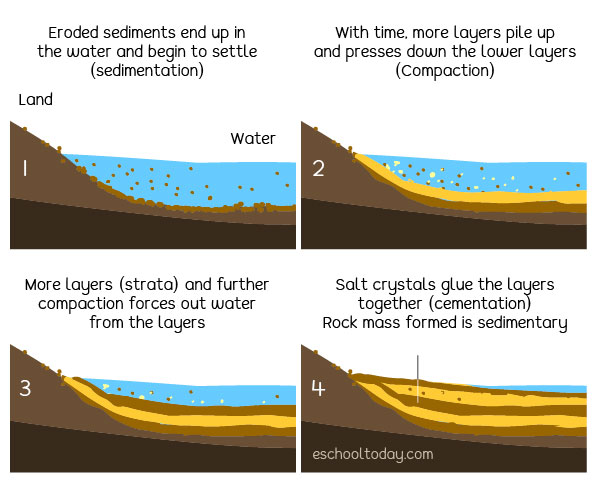
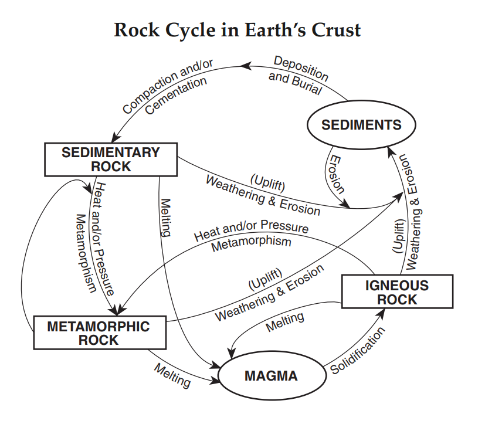
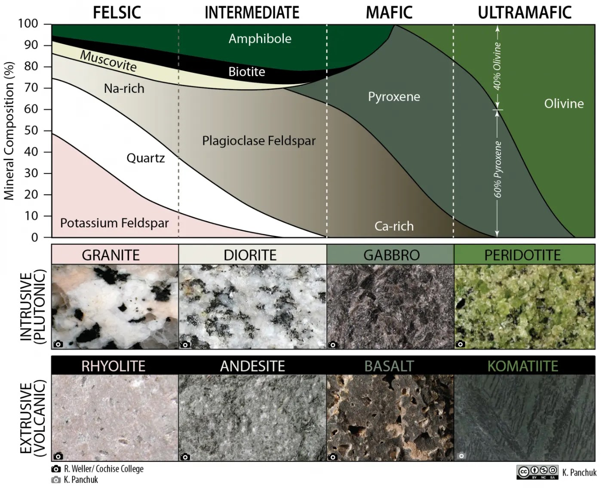
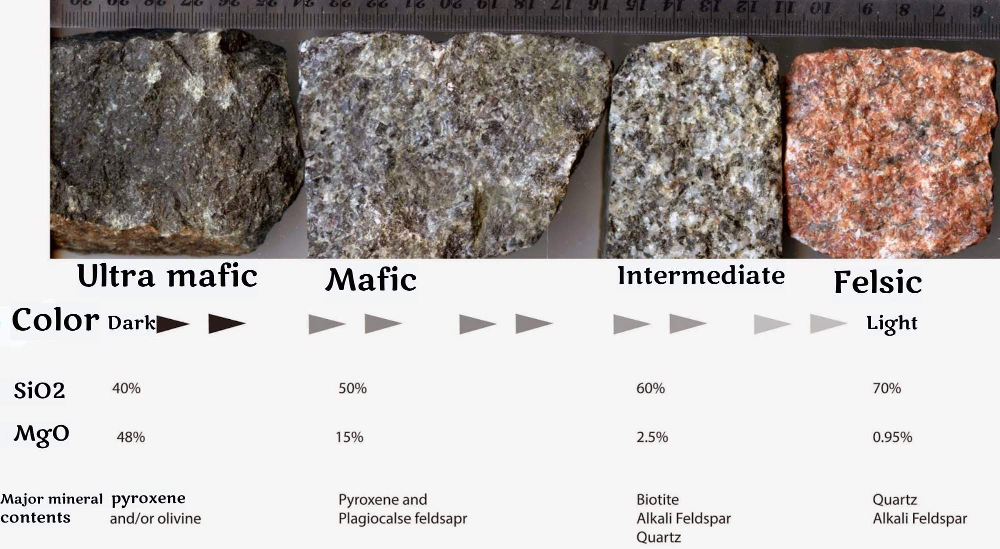
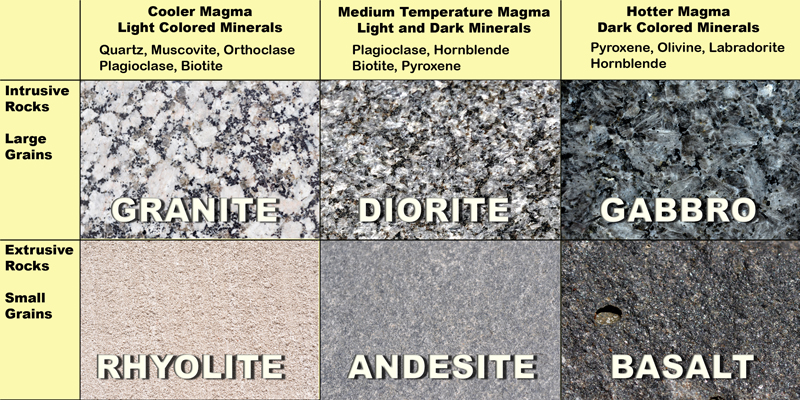
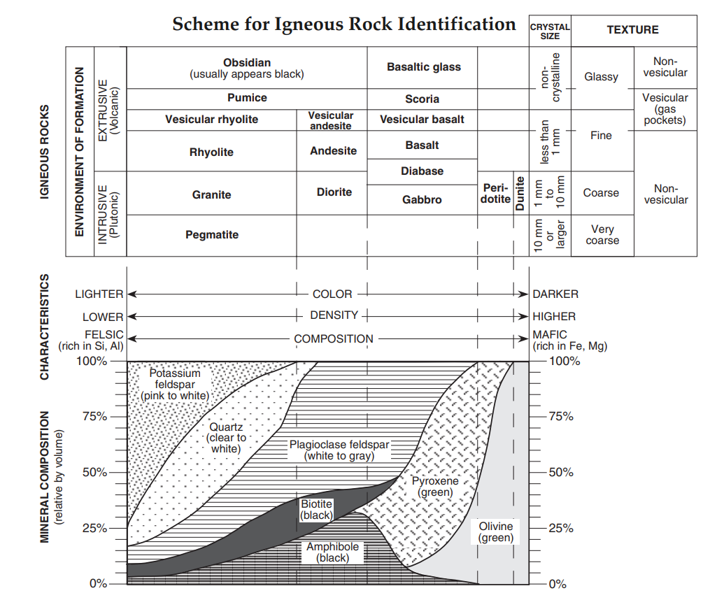
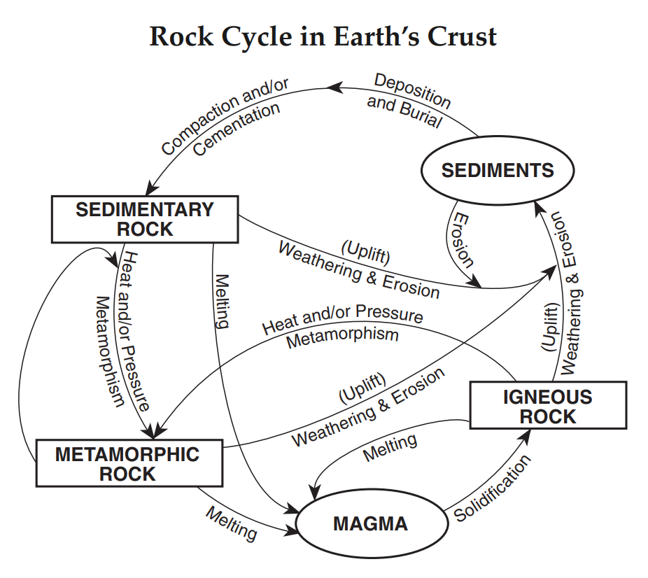

# Rocks:

## Sedimentary, Igneous, and Metamorphic

---

# What are Sedimentary Rocks?

- Rocks formed from accumulated sediments
- Make up about 75% of rocks at Earth's surface
- Record Earth's history like pages in a book
- Form in layers called strata

---

# Three Main Types

1) **Clastic** (from rock fragments)
   - Formed from weathered rock pieces
   - Examples: sandstone, shale

2) **Chemical** (from precipitation)
   - Formed from dissolved minerals
   - Examples: rock salt, some limestones

3) **Organic** (from living things)
   - Formed from plant/animal remains
   - Examples: coal, some limestones

---

# The Formation Process

1) Weathering breaks down rocks
2) Erosion moves particles
3) Deposition lays down sediments
4) Compaction squeezes sediments
5) Cementation binds particles together

---

# Clastic Sedimentary Rocks

Based on particle size (largest to smallest):
- Conglomerate (rounded pebbles)
- Breccia (angular fragments)
- Sandstone (sand grains)
- Siltstone (silt particles)
- Shale (clay particles)

---

---

# Chemical Sedimentary Rocks

Form when minerals precipitate from solution:
- Rock salt (evaporation)
- Travertine (hot springs)
- Some limestones (marine precipitation)

Key process: **Evaporation** or **Chemical Precipitation**

---

# Organic Sedimentary Rocks

Formed from remains of organisms:
- Coal (plant material)
- Chalk (microscopic shells)
- Reef limestone (coral remains)

Key process: **Accumulation** and **Preservation** of organic matter

---

# Importance of Sedimentary Rocks

- Contain fossils -> Earth's history
- Hold oil and gas deposits
- Major building materials
- Form aquifers for groundwater
- Record ancient environments

---

# Questions to Consider

1. Why are sedimentary rocks usually found in layers?
2. How can we use sedimentary rocks to learn about past environments?
3. Why are fossils almost always found in sedimentary rocks?
4. How do human activities impact sedimentary processes today?

---

# Lab Review

## Review Rocks and Classification

1. Get your rock bag
2. Put them back in order
3. We will review as a class (some bags have slighly different rocks)

**Yes, I got some wrong yesterday, lets fix that**

*it is okay to be wrong sometimes, we learn from that*

---

# Formation (ESRT page 6):

---

# Lab Review

## Formation Methods:

1) Clastic Rocks:
    - Weathering & Erosion -> Deposition and Burial -> Compaction and/or Cementation
2) Crystalline:
    - Chemical Formation: Minerals dissolve in water -> solution becomes concentrated -> crystals grown and accumulate -> compaction and cementation occurs
3) Organic:
    - Organisms die and are buried -> material is compressed -> some recrystalization may occur -> C&C occurs

---

# Igneous Rocks

## Formation, Types, and Classification

---

# What are Igneous Rocks?

- Formed from cooling and crystallization of magma or lava
- Name comes from Latin "ignis" meaning fire
- Make up most of Earth's crust
- Can form both underground and at the surface

---

# Two Main Categories

1) **Intrusive** (Plutonic)
   - Forms underground
   - Slow cooling → large crystals
   - Examples: granite, gabbro
2) **Extrusive** (Volcanic)
   - Forms at the surface
   - Rapid cooling → small crystals or glass
   - Examples: basalt, obsidian

---

## The Formation Process

1) Rock melts due to:
   - Increased temperature
   - Decreased pressure
   - Addition of volatiles

2) Magma rises due to:
   - Lower density than surroundings
   - Pressure differences
   - Tectonic activity

3) Crystallization occurs as magma cools

---

## Composition of Igneous Rocks

Classified by silica content:

- **Felsic** (>65% silica)
  - Light-colored
  - Lower density
  - Example: granite

- **Mafic** (<50% silica)
  - Dark-colored
  - Higher density
  - Example: basalt

---

# Important Igneous Rocks

**Intrusive:**
- Granite, Diorite, Gabbro, Peridotite

**Extrusive:**
- Basalt, Obsidian, Pumice,  Rhyolite

---

# Importance of Igneous Rocks

- Form new crustal material
- Create valuable mineral deposits
- Build volcanic islands
- Provide geothermal energy
- Create fertile soils
- Source of building materials

---

# ESRT Page 6: Igneous Rocks

---

# Igneous vs. Sedimentary Rocks: A Comparison

**Igneous Rocks:**
- Form from cooling magma/lava
- Interlocking crystals
- No layers or fossils
- Form primarily through heat
- Can form deep underground or at surface

 

**Sedimentary Rocks:**
- Form from accumulated sediments
- Cemented particles or precipitates
- Occur in layers
- Contain fossils
- Form at Earth's surface or shallow depths

---

# The Rock Cycle

---

# What is the Rock Cycle?

The rock cycle is the continuous process through which:
- Earth materials change form
- Rocks transform from one type to another
- Matter and energy flow through Earth systems

---

# ESRT: page 6

---

# Three Major Rock Types

**Igneous Rocks**
- Formed from cooling magma or lava
- Examples: granite, basalt

**Sedimentary Rocks**
- Formed from compressed sediments
- Examples: sandstone, limestone

**Metamorphic Rocks**
- Formed when existing rocks are changed by heat and pressure
- Examples: marble, schist

---

### Driving Forces of the Rock Cycle

The rock cycle is powered by:

1. **Earth's Internal Heat**
   - Drives plate tectonics
   - Creates magma

2. **Solar Energy**
   - Drives the water cycle
   - Powers weather and erosion

3. **Gravity**
   - Causes materials to move downhill
   - Compacts sediments
   

---

# Processes in the Rock Cycle

**Constructive Processes:**
- Volcanism
- Mountain building
- Crystallization
- Cementation
- Recrystallization

 

**Destructive Processes:**
- Weathering (physical & chemical)
- Erosion
- Melting
- Dissolution

---

# Igneous Rocks in the Cycle

**Formation**:
1. Melting of existing rock
2. Cooling and crystallization

**Pathways**:
- **To Sedimentary:** Weathering ->  Erosion -> Deposition
- **To Metamorphic:** Heat + Pressure (without melting)

---

# Sedimentary Rocks in the Cycle

**Formation**:
1. Weathering of existing rock
2. Transport & deposition
3. Compaction & cementation

**Pathways**:
- **To Igneous:** Deep burial -> Melting
- **To Metamorphic:** Heat + Pressure

Examples in New York State:
- Devonian shales of Finger Lakes region
- Potsdam Sandstone

---

# Metamorphic Rocks in the Cycle

**Formation**:
1. Subjecting existing rock to heat and pressure
2. Recrystallization without melting

**Pathways**:
- **To Igneous:** More heat → Melting
- **To Sedimentary:** Uplift → Weathering → Erosion → Deposition

Examples in New York State:
- Manhattan Schist
- Adirondack marble and gneiss

---

# New York State Rock Cycle Evidence

- **Adirondack Mountains**
  - Metamorphic core
  - Sedimentary rock borders
  
- **Catskill Mountains**
  - Sedimentary rocks (sandstone, shale)
  - Evidence of ancient river deltas
  
- **Hudson Highlands**
  - Metamorphic rocks exposed by erosion

---

# Rates of Change

Rock cycle processes occur at different timescales:

**Rapid** (human timescale)
- Volcanic eruptions
- Landslides
- Floods

**Gradual** (geologic timescale)
- Mountain building
- Metamorphism
- Most sedimentary rock formation

---

# Human Impacts on the Rock Cycle

Humans accelerate or alter natural processes:

- Mining and quarrying
- Construction and land use changes
- Acid rain and pollution effects
- Dam construction changing sediment transport
- Climate change affecting weathering rates

