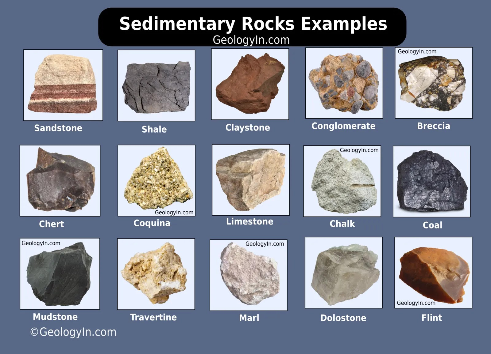

# Rocks:

## Sedimentary, Igneous, and Metamorphic

---

# What are Sedimentary Rocks?

- Rocks formed from accumulated sediments
- Make up about 75% of rocks at Earth's surface
- Record Earth's history like pages in a book
- Form in layers called strata

---

# Three Main Types

1) **Clastic** (from rock fragments)
   - Formed from weathered rock pieces
   - Examples: sandstone, shale

2) **Chemical** (from precipitation)
   - Formed from dissolved minerals
   - Examples: rock salt, some limestones

3) **Organic** (from living things)
   - Formed from plant/animal remains
   - Examples: coal, some limestones

---

# The Formation Process

1) Weathering breaks down rocks
2) Erosion moves particles
3) Deposition lays down sediments
4) Compaction squeezes sediments
5) Cementation binds particles together

---

# Clastic Sedimentary Rocks

Based on particle size (largest to smallest):
- Conglomerate (rounded pebbles)
- Breccia (angular fragments)
- Sandstone (sand grains)
- Siltstone (silt particles)
- Shale (clay particles)

---

---

# Chemical Sedimentary Rocks

Form when minerals precipitate from solution:
- Rock salt (evaporation)
- Travertine (hot springs)
- Some limestones (marine precipitation)

Key process: **Evaporation** or **Chemical Precipitation**

---

# Organic Sedimentary Rocks

Formed from remains of organisms:
- Coal (plant material)
- Chalk (microscopic shells)
- Reef limestone (coral remains)

Key process: **Accumulation** and **Preservation** of organic matter

---

# Importance of Sedimentary Rocks

- Contain fossils -> Earth's history
- Hold oil and gas deposits
- Major building materials
- Form aquifers for groundwater
- Record ancient environments

---

# Questions to Consider

1. Why are sedimentary rocks usually found in layers?
2. How can we use sedimentary rocks to learn about past environments?
3. Why are fossils almost always found in sedimentary rocks?
4. How do human activities impact sedimentary processes today?

---

# Lab Review

## Review Rocks and Classification

1. Get your rock bag
2. Put them back in order
3. We will review as a class (some bags have slighly different rocks)

**Yes, I got some wrong yesterday, lets fix that**

*it is okay to be wrong sometimes, we learn from that*

---

# Formation (ESRT page 6):

---

# Lab Review

## Formation Methods:

1) Clastic Rocks:
    - Weathering & Erosion -> Deposition and Burial -> Compaction and/or Cementation
2) Crystalline:
    - Chemical Formation: Minerals dissolve in water -> solution becomes concentrated -> crystals grown and accumulate -> compaction and cementation occurs
3) Organic:
    - Organisms die and are buried -> material is compressed -> some recrystalization may occur -> C&C occurs