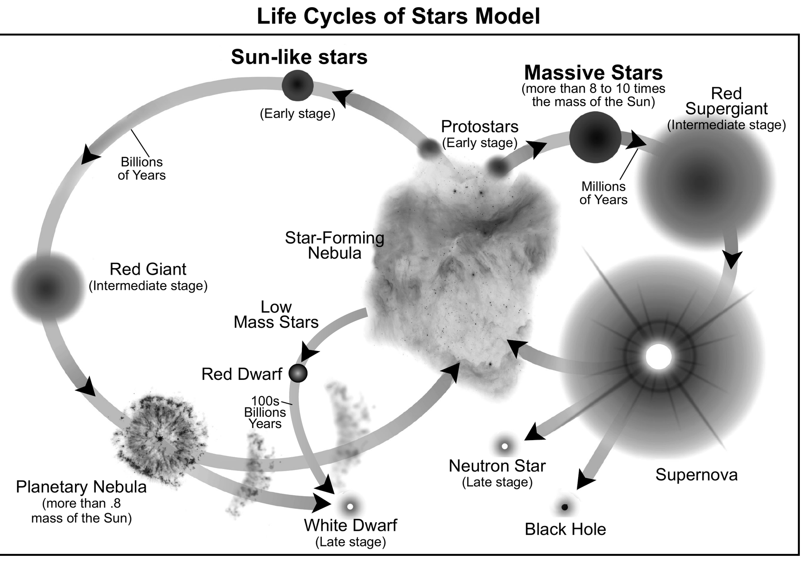
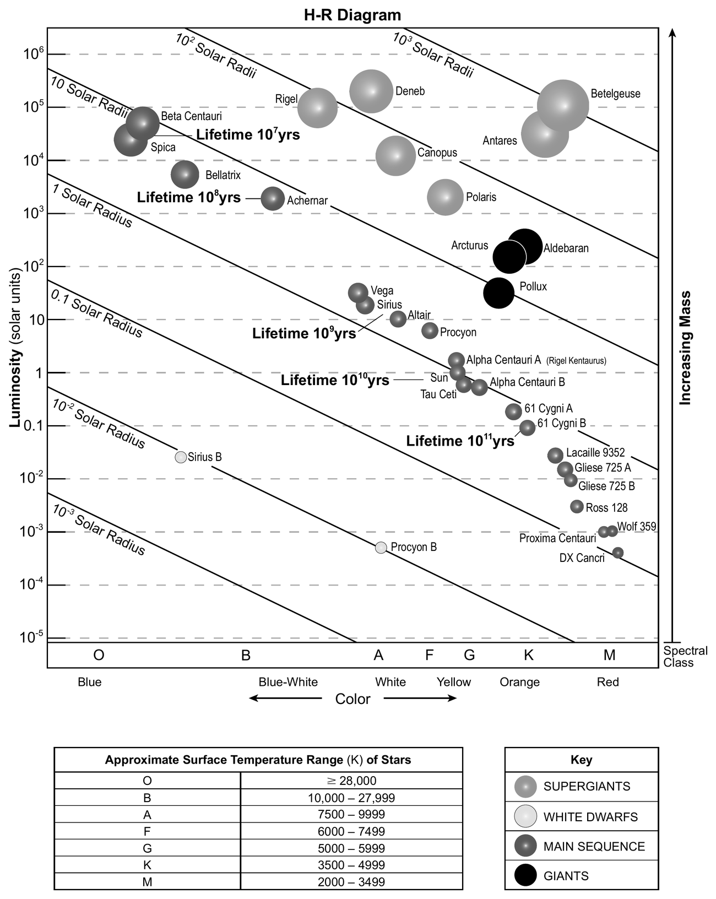
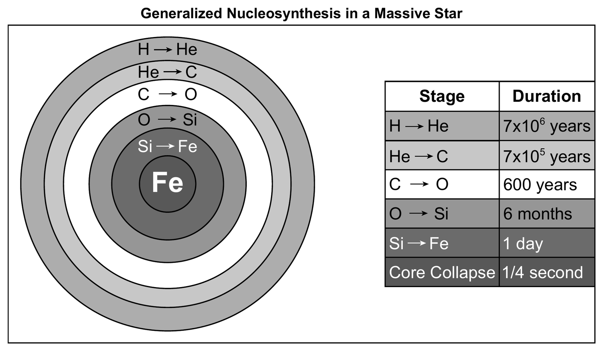

<!-- _class: title-slide -->

# ✨ Star Life Cycles
## Guided Notes — Unit 1: Discovering New Worlds
### Lesson 2 review · what controls a star's life · reading the H–R diagram · where the elements came from

<!--
WHAT THIS DECK IS: the projection companion to the guided-notes packet "Guided Notes: Star Life Cycles" (ess-u1-guided-notes-stars.pdf). Slides follow the packet Part for Part. Students fill in their blanks as each slide comes up.
NOT the teaching deck. The 5E instruction lives in U1_Discovering_New_Worlds_L2_Slides. This is end-of-unit consolidation: content knowledge only.
EVERY BLANK ANSWER is shown in gold. Advance, let students write, then discuss.
STANDARDS: ESS1.A(1) ~10-billion-year life span · ESS1.A(2) spectra AND brightness · ESS1.A(4) fusion makes nuclei up to iron, supernovae make the rest · PS3.D(1) fusion releases the energy reaching Earth · CCC5(5) atoms not conserved, protons+neutrons are.
REFERENCE TABLES: three figures here come straight from the NYS ESRT (2026 Rev. Edition) — the same booklet students get on the exam. Say that every time one appears.
TIMING: about one class period at pace, two if you work the questions.
-->

---

# How to Use This

**You have:** the packet *Guided Notes: Star Life Cycles*

**On screen:** the same content, Part for Part

Anything shown like this goes in a blank on your sheet.

Three diagrams in this deck are from your **Reference Tables**. You will have them on the exam — learn where things sit on them.

---

<!-- _class: phase-title -->

# PART A
## What We Can Observe From Earth

---

# What We Can Measure

PACKET PART A

To the naked eye every star is a tiny white dot. With a telescope above the atmosphere — **Hubble**, launched 1990 — we measure far more:

1. Its **spectrum** → what it is made of
2. Its **color** → its temperature
3. Its **luminosity** → how much energy it gives off

**Luminosity** — the **rate** at which a star releases energy (energy per **second**), as a multiple of the Sun.

100 = a hundred times the Sun's output per second. 0.01 = one hundredth.

Hubble's image of **Omega Centauri** showed stars of different colors, sizes and brightnesses — but their spectra showed hydrogen and helium, just like our Sun.

<!--
PACKET: Part A, five blanks.
LUMINOSITY IS THE TERM L1 DEFERRED. The L1 bundle says students don't need it yet but it is central here. If anyone asks for the Sun's energy output from L1 — that quantity was its luminosity.
PACKET QUESTION 1: same elements, so a bigger star has MORE of them — more mass, more fuel. That sets up Part B.
-->

---

# Spectra from the Omega Centauri Cluster

PACKET PART A

Cluster star A

Cluster star B

Cluster star C

&#9728;&#65039; our Sun

400450500550600650700 nm

Three stars from the cluster, plus our Sun. They differ in color, size and brightness — but every one shows dark lines at the **same wavelengths**: hydrogen and helium.

<!--
PACKET: Part A, the Omega Centauri spectra.
THE POINT STUDENTS MUST LEAVE WITH: stars across the cluster are made of the SAME two elements. Composition is not the variable. Something else must explain why stars differ — and Part B reveals it is MASS.
LINES SHOWN: hydrogen 410, 434, 486, 656 nm; helium 447, 471, 492, 502, 588, 668 nm. The same set matched against the Sun in Lesson 1.
ESS1.A(2): spectra AND brightness identify composition, movement and distance.
-->

---

<!-- _class: phase-title -->

# PART B
## Mass Controls the Life Span

---

# The Life Cycles of Stars Model

PACKET PART B

NYS Earth &amp; Space Sciences Reference Tables, 2026 Rev. Edition

<!--
PACKET: Part B figure.
BOTH PATHS START IN THE SAME NEBULA. What separates them is MASS — more than 8 to 10 solar masses takes the right-hand path.
READ THE TIME LABELS ALOUD: "Billions of Years" on the Sun-like path, "Millions of Years" on the massive path, "100s Billions Years" for red dwarfs. That contrast is the whole lesson in one figure.
-->

---

<!-- _class: lt3 -->

# Stage Sequences and Timing

PACKET PART B

| Group | Mass (M☉) | Stages |
|---|---|---|
| **Low mass** (our Sun) | 0.2 – 6 | Main Sequence → Red Giant → **White Dwarf** |
| **High mass** | 10, 20 | Main Sequence → Red Giant → **supernova** → Neutron Star |
| **Highest mass** | 30, 40 | Main Sequence → Red Giant → Blue Giant → **supernova** → Black Hole |

| Mass (M☉) | Time on the main sequence |
|---|---|
| 1 (our Sun) | about 9 billion years |
| 4 | about 179 million years |
| 10 | about 19.5 million years |
| 40 | about 4.9 million years |

<!--
PACKET: Part B, both tables.
~90% OF A STAR'S LIFE is on the main sequence — the stage where size, temperature and luminosity change very little. That is what "stable" means here.
THE PATTERN: as mass goes UP, life span goes DOWN and properties change FASTER.
PACKET QUESTIONS 2 AND 3: why 40x the fuel yet a shorter life (surprising — Part F answers it), and the Sun at 4.6 of ~9 billion main-sequence years, so roughly halfway.
-->

---

<!-- _class: phase-title -->

# PART C
## The Hertzsprung–Russell Diagram

---

# The H–R Diagram

PACKET PART C

**Five things it gives you:**

1. **Luminosity** — $10^{-5}$ to $10^{6}$ solar units
2. **Temperature** — as **spectral class** O B A F G K M. It runs backwards
3. **Color** — blue hot, red cool
4. The **Lifetime** lines — read life span straight off
5. The **Solar Radii** lines — read a star's **size**, which is never plotted. The right-hand arrow shows **increasing mass**

NYS Earth &amp; Space Sciences Reference Tables, 2026 Rev. Edition

<!--
PACKET: Part C, "Five things this diagram gives you."
THE KEY, lower right, is how the four star types are told apart — by circle SHADING, not by labelled zones. Students must check it before classifying anything.
THE REVERSED AXIS costs marks every year. Say it twice.
-->

---

<!-- _class: lt4 -->

# Reading the Main Sequence

PACKET PART C

About 90% of all stars fall along one diagonal band — the **main sequence**.

- Hotter stars are **more** luminous
- **Blue** stars — hottest, most massive, shortest lives
- **Red** stars — coolest, least massive, longest lives

Stars the size of our Sun **or smaller** have life spans of over 10 billion years.

| Star | Spectral class | Color | Type |
|---|---|---|---|
| **the Sun** | G | yellow | main sequence |
| **Betelgeuse** | M | red | supergiant |
| **Aldebaran** | K | orange | giant |
| **Sirius B** | A/B | white | white dwarf |

<!--
PACKET: Part C blanks plus question 5's table.
PACKET QUESTIONS 6 AND 7 use the isolines: Sirius vs Sirius B on the Solar Radii lines (1 vs 10^-2 solar radius, hence the thousandfold luminosity gap), and the Sun vs Rigel on the Lifetime lines (10^10 vs 10^7 years).
-->

---

<!-- _class: phase-title -->

# PART D
## Why Stars Are Stable

---

<!-- _class: lt2 lt3 -->

# Gravity vs. Fusion

PACKET PART D

| | Gravity | Fusion force |
|---|---|---|
| **Direction** | Pulls **inward**, toward the center | Pushes **outward**, from the core |
| **Source** | Every object with mass. **More mass → more gravity** | Energy released when hydrogen nuclei fuse into helium |
| **Alone it would** | Collapse the star in on itself | Blast the star's matter into space |

**Equilibrium** — the two forces are equal and balance. The star barely changes size, temperature or luminosity. **That is the main sequence.**

So when a star shrinks or expands, the forces are **no longer equal**.

<!--
PACKET: Part D, one blank.
THE CHAIN STUDENTS MISS: gravity pulls hydrogen together → particles collide more often and harder → that causes FUSION. Gravity causes the very thing that opposes it.
-->

---

<!-- _class: phase-title -->

# PART E
## The Forces at Each Stage

---

<!-- _class: lt1 lt3 -->

# Which Force Wins, and When

PACKET PART E

| Stage | Which force wins? | What happens to the star |
|---|---|---|
| **Dust cloud → new star** | **Gravity** — no fusion yet | Collapses inward; heats up until fusion starts |
| **Main sequence** | **Neither** — equilibrium | Stays about the same, for billions of years |
| **Red giant** | **Fusion force** | Expands enormously; temperature and luminosity swing |
| **White dwarf, neutron star, black hole** | **Gravity** — the fuel is gone | Collapses to extreme density |

When the fuel runs out, fusion stops — but **gravity does not**. With nothing pushing out, gravity wins completely. That is why these remnants are the **densest objects in the universe**.

<!--
PACKET: Part E.
THE ENDING IS A COLLAPSE, NOT A FADE. Students expect "runs out of fuel" to mean the star just goes dark. Make the asymmetry explicit: fusion can stop, gravity cannot.
PACKET QUESTIONS 9 AND 10: why constant size (equilibrium), and why Earth needed a MAIN SEQUENCE star for billions of years, not just a bright one.
-->

---

<!-- _class: phase-title -->

# PART F
## Why Mass Sets the Rate

---

# Resolving the Puzzle

PACKET PART F

more mass &nbsp;→&nbsp; more gravity &nbsp;→&nbsp; particles collide harder and more often &nbsp;→&nbsp; **faster rate of fusion**

A 40 M☉ star *does* start with far more hydrogen. But its enormous gravity makes it fuse that hydrogen so much faster that it runs out **first**.

*More fuel — but a far bigger fire.*

This also explains **luminosity**: faster fusion = more energy per second. The most massive stars sit at the top of the main sequence.

And the population: there are **more** low-mass stars because they use fuel so slowly that they last much longer.

<!--
PACKET: Part F, three blanks.
THIS IS THE PAYOFF of the puzzle set in Part B. Make sure students connect it back explicitly — the surprise and its resolution are two halves of one idea.
-->

---

<!-- _class: phase-title -->

# PART G
## Where the Elements Came From

---

# Nucleosynthesis in a Massive Star

PACKET PART G

NYS Earth &amp; Space Sciences Reference Tables, 2026 Rev. Edition

<!--
PACKET: Part G figure.
READ THE DURATION COLUMN DOWNWARD: 7x10^6 years for H→He, 7x10^5 for He→C, 600 years for C→O, 6 MONTHS for O→Si, ONE DAY for Si→Fe, a QUARTER SECOND for core collapse.
ASK: "What is happening to the time as you go down?" then "What comes right after that quarter second?" — the supernova.
WHY IT ACCELERATES: heavier elements release less energy per reaction, so the star must burn them faster to hold itself up. (Beyond the assessment boundary — offer only if asked.)
-->

---

# The Iron Ceiling — and Beyond

PACKET PART G

During the main sequence a star fuses hydrogen into helium. Then helium, then heavier elements — until it reaches iron.

Fusing anything heavier than iron **absorbs** more energy than it releases. A star's core cannot do it, no matter how much gravity it has.

A **supernova** releases more energy in seconds than the star made in its entire life — enough to fuse the elements **heavier than iron**, and scatter them into space.

Every atom in your body heavier than helium was made inside a star. The gold in a ring was made in an **exploding** one.

<!--
PACKET: Part G, "The iron ceiling" and "Beyond iron."
ESS1.A(4) verbatim: "nuclear fusion within stars produces all atomic nuclei lighter than and including iron... Heavier elements are produced when certain massive stars achieve a supernova stage and explode."
THE MORE MASSIVE THE STAR, the heavier the elements it can reach.
-->

---

# What Is Conserved

PACKET PART G

| Reaction | Before | p + n before | After | p + n after |
|---|---|---|---|---|
| Fusion of hydrogen | hydrogen-1 + hydrogen-2 | **3** | helium-3 | **3** |
| Fusion of helium | helium-3 + helium-4 | **7** | beryllium-7 | **7** |
| Beryllium + helium | beryllium-8 + helium-4 | **12** | carbon-12 | **12** |
| Carbon + helium | carbon-12 + helium-4 | **16** | oxygen-16 | **16** |

Types of atoms: not conserved — new elements are created.

Total **protons + neutrons**: **conserved** — every row matches.

<!--
PACKET: Part G, conservation box. One blank.
CCC5(5) verbatim: "In nuclear processes, atoms are not conserved, but the total number of protons plus neutrons is conserved."
CONTRAST WITH L1 (packet question 12): a chemical reaction only rearranges atoms — same atoms before and after, no new elements.
-->

---

<!-- _class: phase-title -->

# PART H
## Stars Not on the Main Sequence

---

# Luminosity Depends on Two Things

PACKET PART H

A star's luminosity depends on its temperature **and** its size.

So a star can be very luminous by being very **hot** — or by being very **large**.

| Star | Temperature | Luminosity | Therefore it must be… |
|---|---|---|---|
| **Betelgeuse** | 3,000 K (*cool*) | 9,000 Suns (*very bright*) | **enormous** — a supergiant |
| **LP 033276** | 11,100 K (*hot*) | 0.0001 Suns (*very dim*) | **tiny** — a white dwarf |

On an H–R diagram, star size increases toward the upper right. Size is never plotted — but it can always be deduced.

<!--
PACKET: Part H, three blanks.
THE REASONING BOTH WAYS: same temperature + more luminous = bigger. Same luminosity + cooler = bigger.
WATCH FOR: students reading white dwarfs as "cool" because they sit low. Low means low LUMINOSITY. Sirius B is hotter than the Sun — low and left means hot and dim, therefore small.
PACKET QUESTION 15: Betelgeuse is a poor habitability candidate on two counts — off the main sequence, and far too short-lived.
-->

---

<!-- _class: phase-title -->

# PART I
## Vocabulary

---

<!-- _class: lefttable compact -->

# Vocabulary (1 of 2)

| Term | Definition |
|---|---|
| **Luminosity** | The rate at which a star releases energy (per second), compared to the Sun |
| **Solar mass (M☉)** | The mass of our Sun, used as the unit for other stars |
| **Main sequence** | The long, stable stage where a star fuses hydrogen and gravity balances fusion force |
| **Equilibrium** | Inward gravity and outward fusion force are equal |
| **H–R diagram** | Luminosity against surface temperature. Temperature runs backwards; both axes are powers of ten |
| **Red giant** | A late stage where fusion force exceeds gravity and the star expands enormously |

---

<!-- _class: lefttable compact -->

# Vocabulary (2 of 2)

| Term | Definition |
|---|---|
| **Supergiant** | A very large, very luminous star — bright despite a low surface temperature |
| **White dwarf** | The small, dense, dim remnant left when a low-mass star's fuel is gone |
| **Neutron star** | The extremely dense remnant left after a high-mass star's supernova |
| **Supernova** | The explosion of a massive star, briefly releasing more energy than it made in its whole life |
| **Nucleosynthesis** | The formation of new atomic nuclei by fusion inside stars |
| **Stability** | Properties changing very little over a long time |

---

# The Four Statements to Know Cold

1. A star's **mass** controls its life span and its stability — more mass means a *shorter*, less stable life.

2. A star is stable when gravity and fusion force are in **equilibrium**. That is what the main sequence is.

3. The study of stars' light **spectra and brightness** tells us what stars are made of, how they move, and how far away they are.

4. Fusion in stars makes every element up to and including **iron**; elements heavier than iron are made in **supernovae**.

<!--
PACKET: Part I closing box.
THESE FOUR ARE THE DCIs in student language: ESS1.A(1), PS3.D(1)/equilibrium, ESS1.A(2), ESS1.A(4).
UP NEXT: Planets and Orbits — is the exoplanet the right distance from its star?
-->
