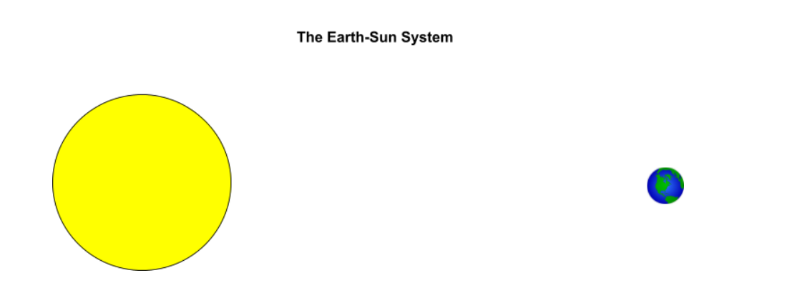

# Origin of the Universe 🪐 <!--fit---> 

---

# ⚓ Phenomenon <!--fit--->

---

<iframe width="1100" height="615" src="https://www.youtube.com/embed/c8aFcHFu8QM?si=6N1dSPSmcGE75Ad6" title="YouTube video player" frameborder="0" allow="accelerometer; autoplay; clipboard-write; encrypted-media; gyroscope; picture-in-picture; web-share" referrerpolicy="strict-origin-when-cross-origin" allowfullscreen></iframe>

<!---
- Identify 2-3 species and the environment in which they live
- Why do you think each species lives in that enviroment
 --->

---

# There are a variety of species on Earth and each is adapted to live in a particular environment. As I’m sure you are aware, planet Earth has been experiencing a lot of environmental stress and scientists are concerned with how this might impact species on Earth, including humans.

---

<iframe width="1100" height="615" src="https://www.youtube.com/embed/u6GRYrv2e3M?si=-nP7Z5cbpM4bKxOm" title="YouTube video player" frameborder="0" allow="accelerometer; autoplay; clipboard-write; encrypted-media; gyroscope; picture-in-picture; web-share" referrerpolicy="strict-origin-when-cross-origin" allowfullscreen></iframe>

<!--- 
- What are the important details from the video that tell the story of what is starting to happen to planet Earth
--->

---

## Our Earth, for 12,000 years has been an ideal place for humans and other life to evolve. Now rising global temperatures have caused sea-levels to rise, and an increase in  floods and droughts, all forcing groups of people to leave their homes  There is also a rapid decline in populations of species worldwide that many scientists are referring to as the “Sixth Mass Extinction.” Our Earth is becoming less and less welcoming due to human impact, and our population is continuing to increase! 

## What are your initial ideas for what we can do to stop what is occurring to planet Earth and ensure the survival of humans and other species?

## What can humans do to survive as a species if we are not successful in stopping the negative changes to planet Earth?

---

# Primary Texts 

1. Read through the 3 texts in the packet
2. Return to each text and make your annotations (circle 3 details related to phenomenon)
3. Share with your group 
4. Discuss as a group, and develop a story, what is the phenomenon in these texts?

### What is happening to planet Earth?

### 👀 Focus on the **phenomenon**, not your predictions

<!---
- What is happening to Planet Earth
- Why do you tihnk this detail is important?
--->

---

# Brainstorm 🧠 ⛈️ solutions to <!--fit--->

# ensure the survival of humans <!--fit--->

- jot down some of your ideas silently

---

# Share 🗣️ with your lab table <!--fit--->

## Agree on 2-3 possible solutions to share to the class 

<!---
Circulate and Ask...
- Did your group memebers and you circle the same ideas?
- What was Earth like before these things were occurring?
- What will Earth be like if this all continues?

Brainstorm:
- What are your initial ideaas for what we can do to stop what is occurring to planet Earth and ensure the survival of humans and other species?
- What can humans do to survive if we are not successful in stopping the negative changes to planet Earth?

--->

---

# *Hunting for Earth 2.0* <!--fit--->

---

# Hunting for Eath 2.0 

## If the Earth could no longer sustain human life, where could we go? Imagine that you belong to a committee of scientists that has been asked to explore the universe for an Earth like planet that may be habitable by humans. Your task is to convince the scientific community, congress, the president, your family and friends, basically the whole world, that the exoplanet you detect is worth the funding necessary to investigate it further and perhaps try to reach it one day. 

---

<iframe width="1100" height="615" src="https://www.youtube.com/embed/d9x9RRc0RoU?si=y5TZFswP4Pmd92bA" title="YouTube video player" frameborder="0" allow="accelerometer; autoplay; clipboard-write; encrypted-media; gyroscope; picture-in-picture; web-share" referrerpolicy="strict-origin-when-cross-origin" allowfullscreen></iframe>

<!---- Show the first two minutes and fifty seconds of the How many Planets? Video.
After watching the video, highlight for students that there are a tremendous number of planets that they can investigate, so they will have to come up with a criteria for what makes a planet Earth-like in order to narrow down the search. 
--->

---

# Earth's Timeline

## Work with your table partner to answer the following questions

- How long after Earth’s formation did it take for life to appear on Earth?
- What about more complex life? 
- What factors do you think contributed to it taking that long?

<!---
In order to find another Earth-like planet, we’re going to start by thinking about what we know about why Earth has been a place where life took hold and evolved.
--->

---

# Earth's Timeline 

#  
#  
#  
#  
#  

<!--- _class: inverse--->

.png>)

<!---

In order to find another Earth-like planet, we’re going to start by thinking about what we know about why Earth has been a place where life took hold and evolved.

- How long after Earth’s formation did it take for life to appear on Earth?
- What about more complex life? 
- What factors do you think contributed to it taking that long?
--->

--- 

# Earth-Sun System

## What makes Earth habitable? What are the ideal conditions for life?

## Draw ✏️ the Earth-Sun system and add to it expplaining why Earth is ideal for life.

<!---
Use what we surfaced from the timeline of life on Earth and what you already know about the conditions necessary for humans and other life to live and thrive to explain why planet Earth has been such an ideal place for life to evolve for such a long time.
--->

---

# Share 🗣️ Out

## What makes Earth habitable? What are the ideal conditions for life?

### Find a whiteboard space in the classroom and put your ideas and or drawings on the board 

---

<!--- _class: inverse--->

# Rotation 🔁 and Observe <!--fit--->

## 1. Add ✔️ next to ideas you agree with 
## 2. Add a ➕ next to ideas you want to add to your board 
## 3. Add a ❓ next to ideas you have questions about and write your question to the side

---

# What do we need to investigate in order to find an Earth-like planet where humans and other species might be able to live?

<!---
Think about your initial explanation for why planet Earth has been such an ideal place for life to exist and thrive. Then generate questions you would like to further investigate to find another Earth-like planet. 
--->

---

# Share 🗣️ Out <!--fit--->

# Organzie your group's questions on ExcaliDraw 

---

# Exploring the <!--fit--->

# 🌎 Origin 🪐 🌠 <!--fit--->

# of the Universe <!--fit--->

---

### **Questions**

- Does the planet have a sun?
- Is there air or an atmosphere on the planet?
- What is the gravity on the planet?
- What kind of weather does the planet have?
- Is there water on the planet?
- Does the planet already have life on it?
- Is the planet near a black hole?
- How far is the planet to the nearest star? 
- What kinds of life can the planet sustain?

 

- Does the planet have day and night?
- Are there seasons on the planet?
- What is the landscape of the planet like?
- Does the planet have a moon?
- What is the temperature like on the planet?
- How fast is the planet moving?
- How long as the planet existed?
- Does the planet have stable conditions for life to exist?

---

### **Questions**

- Does the planet have a sun?
- Is there air or an atmosphere on the planet?
- What is the gravity on the planet?
- What kind of weather does the planet have?
- Is there water on the planet?
- Does the planet already have life on it?
- Is the planet near a black hole?
- How far is the planet to the nearest star? 
- What kinds of life can the planet sustain?

 

- Does the planet have day and night?
- Are there seasons on the planet?
- What is the landscape of the planet like?
- Does the planet have a moon?
- What is the temperature like on the planet?
- How fast is the planet moving?
- ####  ***How long as the planet existed?***
- Does the planet have stable conditions for life to exist?

---

<!--- footer: Engage --->

# What is the universe and how did it begin? <!--fit--->

# Has it changed over time? If so, how? <!--fit--->

---

# Write down the statement you are most confident about and explain your thinking. 

### 1. Share your rumor with a partner. SAY it out loud to a partner and LISTEN as they read theirs. 
### 2. Exchange your post-it note
### 3. Explain your new rumor to a new partner. 

Exchange with as many people as possible 

---

- What do you notice about the sound?
- How can you explain the change in the siren's sound?

<iframe width="1150" height="500" src="https://www.youtube.com/embed/P8wx2ckyENk?si=b-aYxXkE-lChs0M8&amp;start=42" title="YouTube video player" frameborder="0" allow="accelerometer; autoplay; clipboard-write; encrypted-media; gyroscope; picture-in-picture; web-share" referrerpolicy="strict-origin-when-cross-origin" allowfullscreen></iframe>

---

# Domino Share

1. One Reporter from each table 
2. Share out table to table like dominos 

---

<!--- footer: 🔍 Explore  --->

# Explore 🔍 <!--fit---> 

---

# Explore: 

## What’s Going on With the Light Spectra of Other Galaxies?

1. With table partner go through Models 1 & 2
    - **Model 1**: What happens to sound waves when they travel from their source to an observer?
    - **Model 2**:  What is the relationship between the pitch of a sound and its wavelength?
2. Complete See-Think-Wonder ***individually*** and then share with table. 
3. Finish Summary of Models 2&3 as a table
4. Check with Mr. Porter
5. Start Model 3 with Table Partner

---

# **Model 3**:  What is the relationship between the pitch of a sound and its wavelength?

## 🤔 How do your observations of lightwaves relate to what you learned about sound waves?
## 🤔 What is the relationship between frequency of light waves and the color an observer perceives? 

---