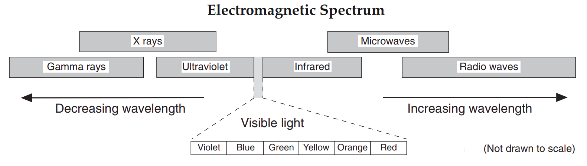

# Origin of the Universe 🪐 <!--fit---> 

---

# ⚓ Phenomenon <!--fit--->

---

<iframe width="1100" height="615" src="https://www.youtube.com/embed/c8aFcHFu8QM?si=6N1dSPSmcGE75Ad6" title="YouTube video player" frameborder="0" allow="accelerometer; autoplay; clipboard-write; encrypted-media; gyroscope; picture-in-picture; web-share" referrerpolicy="strict-origin-when-cross-origin" allowfullscreen></iframe>

<!---
- Identify 2-3 species and the environment in which they live
- Why do you think each species lives in that enviroment
 --->

---

<iframe width="1100" height="615" src="https://www.youtube.com/embed/u6GRYrv2e3M?si=-nP7Z5cbpM4bKxOm" title="YouTube video player" frameborder="0" allow="accelerometer; autoplay; clipboard-write; encrypted-media; gyroscope; picture-in-picture; web-share" referrerpolicy="strict-origin-when-cross-origin" allowfullscreen></iframe>

<!--- 

# There are a variety of species on Earth and each is adapted to live in a particular environment. As I’m sure you are aware, planet Earth has been experiencing a lot of environmental stress and scientists are concerned with how this might impact species on Earth, including humans.

- What are the important details from the video that tell the story of what is starting to happen to planet Earth
--->

---

### Our Earth, for 12,000 years has been an ideal place for humans and other life to evolve. Now rising global temperatures have caused sea-levels to rise, and an increase in  floods and droughts, all forcing groups of people to leave their homes  There is also a rapid decline in populations of species worldwide that many scientists are referring to as the “Sixth Mass Extinction.” Our Earth is becoming less and less welcoming due to human impact, and our population is continuing to increase! 

### **1. What are your initial ideas for what we can do to stop what is occurring to planet Earth and ensure the survival of humans and other species?**

### **2. What can humans do to survive as a species if we are not successful in stopping the negative changes to planet Earth?**

---

# Primary Texts 

1. Read through the 3 texts in the packet
2. Return to each text and make your annotations (circle 3 details related to phenomenon)
3. Share with your group 
4. Discuss as a group, and develop a story, what is the phenomenon in these texts?

### What is happening to planet Earth?

### 👀 Focus on the **phenomenon**, not your predictions

<!---
- What is happening to Planet Earth
- Why do you tihnk this detail is important?
--->

---

# Brainstorm 🧠 ⛈️ solutions to <!--fit--->

# ensure the survival of humans <!--fit--->

- jot down some of your ideas silently

---

# Share 🗣️ with your lab table <!--fit--->

## Agree on 2-3 possible solutions to share to the class 

<!---
Circulate and Ask...
- Did your group memebers and you circle the same ideas?
- What was Earth like before these things were occurring?
- What will Earth be like if this all continues?

Brainstorm:
- What are your initial ideaas for what we can do to stop what is occurring to planet Earth and ensure the survival of humans and other species?
- What can humans do to survive if we are not successful in stopping the negative changes to planet Earth?

--->

---

# *Hunting for Earth 2.0* <!--fit--->

---

# Hunting for Eath 2.0 

## If the Earth could no longer sustain human life, where could we go? Imagine that you belong to a committee of scientists that has been asked to explore the universe for an Earth like planet that may be habitable by humans. Your task is to convince the scientific community, congress, the president, your family and friends, basically the whole world, that the exoplanet you detect is worth the funding necessary to investigate it further and perhaps try to reach it one day. 

---

<iframe width="1100" height="615" src="https://www.youtube.com/embed/d9x9RRc0RoU?si=y5TZFswP4Pmd92bA" title="YouTube video player" frameborder="0" allow="accelerometer; autoplay; clipboard-write; encrypted-media; gyroscope; picture-in-picture; web-share" referrerpolicy="strict-origin-when-cross-origin" allowfullscreen></iframe>

<!---- Show the first two minutes and fifty seconds of the How many Planets? Video.
After watching the video, highlight for students that there are a tremendous number of planets that they can investigate, so they will have to come up with a criteria for what makes a planet Earth-like in order to narrow down the search. 
--->

---

# Earth's Timeline

## Work with your table partner to answer the following questions

- How long after Earth’s formation did it take for life to appear on Earth?
- What about more complex life? 
- What factors do you think contributed to it taking that long?

<!---
In order to find another Earth-like planet, we’re going to start by thinking about what we know about why Earth has been a place where life took hold and evolved.
--->

---

# Earth's Timeline 

#  
#  
#  
#  
#  

<!--- _class: inverse--->

.png>)

<!---

In order to find another Earth-like planet, we’re going to start by thinking about what we know about why Earth has been a place where life took hold and evolved.

- How long after Earth’s formation did it take for life to appear on Earth?
- What about more complex life? 
- What factors do you think contributed to it taking that long?
--->

--- 

# Earth-Sun System

## What makes Earth habitable? What are the ideal conditions for life?

## Draw ✏️ the Earth-Sun system and add to it expplaining why Earth is ideal for life.

<!---
Use what we surfaced from the timeline of life on Earth and what you already know about the conditions necessary for humans and other life to live and thrive to explain why planet Earth has been such an ideal place for life to evolve for such a long time.
--->

---

# Share 🗣️ Out

## What makes Earth habitable? What are the ideal conditions for life?

### Find a whiteboard space in the classroom and put your ideas and or drawings on the board 

---

<!--- _class: inverse--->

# Rotation 🔁 and Observe <!--fit--->

## 1. Add ✔️ next to ideas you agree with 
## 2. Add a ➕ next to ideas you want to add to your board 
## 3. Add a ❓ next to ideas you have questions about and write your question to the side

---

# What do we need to investigate in order to find an Earth-like planet where humans and other species might be able to live?

<!---
Think about your initial explanation for why planet Earth has been such an ideal place for life to exist and thrive. Then generate questions you would like to further investigate to find another Earth-like planet. 
--->

---

# Share 🗣️ Out <!--fit--->

# Organzie your group's questions on ExcaliDraw 

---

# Exploring the <!--fit--->

# 🌎 Origin 🪐 🌠 <!--fit--->

# of the Universe <!--fit--->

---

### **Questions**

- Does the planet have a sun?
- Is there air or an atmosphere on the planet?
- What is the gravity on the planet?
- What kind of weather does the planet have?
- Is there water on the planet?
- Does the planet already have life on it?
- Is the planet near a black hole?
- How far is the planet to the nearest star? 
- What kinds of life can the planet sustain?

 

- Does the planet have day and night?
- Are there seasons on the planet?
- What is the landscape of the planet like?
- Does the planet have a moon?
- What is the temperature like on the planet?
- How fast is the planet moving?
- How long as the planet existed?
- Does the planet have stable conditions for life to exist?

---

### **Questions**

- Does the planet have a sun?
- Is there air or an atmosphere on the planet?
- What is the gravity on the planet?
- What kind of weather does the planet have?
- Is there water on the planet?
- Does the planet already have life on it?
- Is the planet near a black hole?
- How far is the planet to the nearest star? 
- What kinds of life can the planet sustain?

 

- Does the planet have day and night?
- Are there seasons on the planet?
- What is the landscape of the planet like?
- Does the planet have a moon?
- What is the temperature like on the planet?
- How fast is the planet moving?
- ####  ***How long as the planet existed?***
- Does the planet have stable conditions for life to exist?

---

<!--- footer: Engage --->

# What is the universe and how did it begin? <!--fit--->

# Has it changed over time? If so, how? <!--fit--->

---

# Write down the statement you are most confident about and explain your thinking. 

### 1. Share your rumor with a partner. SAY it out loud to a partner and LISTEN as they read theirs. 
### 2. Exchange your post-it note
### 3. Explain your new rumor to a new partner. 

Exchange with as many people as possible 

---

- What do you notice about the sound?
- How can you explain the change in the siren's sound?

<iframe width="1150" height="500" src="https://www.youtube.com/embed/P8wx2ckyENk?si=b-aYxXkE-lChs0M8&amp;start=42" title="YouTube video player" frameborder="0" allow="accelerometer; autoplay; clipboard-write; encrypted-media; gyroscope; picture-in-picture; web-share" referrerpolicy="strict-origin-when-cross-origin" allowfullscreen></iframe>

---

# Domino Share

1. One Reporter from each table 
2. Share out table to table like dominos 

---

<!--- footer: 🔍 Explore  --->

# Explore 🔍 <!--fit---> 

---

# Explore 

---

# Explore: 

## What’s Going on With the Light Spectra of Other Galaxies?

1. With table partner go through Models 1 & 2
    - **Model 1**: What happens to sound waves when they travel from their source to an observer?
    - **Model 2**:  What is the relationship between the pitch of a sound and its wavelength?
2. Complete See-Think-Wonder ***individually*** and then share with table. 
3. Finish Summary of Models 2&3 as a table
4. Check with Mr. Porter
5. Start Model 3 with Table Partner

---

# **Engage**: _How did the universe begin?_

# **Explore**: _Are galaxies moving towards/away/or not at all from Earth?_

## Explore Models:
  - What happens to Waves (sound and light) when the source is moving
  - What is a spectrum?
  - What is an absorption spectrum?
  - What is redshift vs. blue shift?
  - What is 

---

# Doppler Effect 

* The *Doppler Effect* is observed when the source or the observer of a wave is moving.
* When the source and observer are moving <mark>closer together</mark> the frequency of the wave is <mark>increased</mark>. 
* When the source and observer are **moving further** apart the frequency of the wave is **decreased**. 

---

<!--- _class: inverse --->

# Doppler Visualization 

 
 
 
 
 
 
 
 
 
 
 
 

---

# Sound Waves & Light Waves

<iframe src="https://phet.colorado.edu/sims/html/waves-intro/latest/waves-intro_all.html" style="border:0px #ffffff none;" name="myiFrame" scrolling="no" frameborder="0" marginheight="0px" marginwidth="0px" height="800px" width="1150px" allowfullscreen></iframe>

---

# Electromagnetic Spectrum

 

* The <mark>*electromagnetic spectrum*</mark> is the complete range of frequencies and wavelengths of electromagnetic waves.

---

---

# Electromagnetic Spectrum

          

---

---

# Electromagnetic Spectrum - ES Ref Table

---

---

<!---
The dark lines throughout the spectrum are caused by absorption of light by various elements in the Sun's atmosphere. This dark-line absorption spectrum is sort of like a fingerprint of the Sun; it provides scientists with lots of information about the chemical composition of the Sun and even about the temperature of different regions of the solar atmosphere.
--->

---

# Explore 

- What patterns do we noticed about the absorption spectra?
- What differences do you noticed about each spectra?
- Is there a relationship between the absorption line wavelengths and the distance from Earth? If so what is it?

---

# Model 1:

<!---
The moving blue sound source emits sound waves at a constant frequency.
The emitted sound waves are shown as black circular lines. These circles can be understood to represent the crests of the sound waves.

The stationary black microphone is the receiver of the sound waves. It flashes green when it receives a sound wave's crest. The computer plays a snare drum hit sound to indicate when the microphone hears a sound wave crest.

The wave crests moving to the right are smashed together because the moving source somewhat catches up with a newly released crest before it emits another crest. This makes the leading wave crests closer together than they would be if the source were standing still. Also, this smashing together makes more wave crest go by the microphone per second than would go by per second if the source were standing still. The total effect is that the leading waves have a smaller wavelength (the distance between crests) and a higher frequency than they would have if the source were standing still.

The wave crests moving to the left are stretched out because the moving source moves away in the opposite direction  from a new crest before emitting the next crest. Relative to the situation where the source were standing still, these trailing wave crests are further apart, and they go by the microphone less times per second. So, the trailing waves are increased in wavelength and decreased in frequency. 
--->

---

# Model 2

- What happens to the pitch as the frequency increases?
- What happens to the wavelength as the frequency increases?
- How does this relate to the doppler effect?

 

<iframe src="https://contrib.pbslearningmedia.org/WGBH/buac20/buac20-int-wavesfreq/index.html" style="border:0px #ffffff none;" name="myiFrame" scrolling="no" frameborder="0" marginheight="0px" marginwidth="0px" height="500px" width="550px" allowfullscreen></iframe>

---

# Model 3

**Goal of this activity**: The perceived change in frequency of sound waves you heard as the sirens came toward and away from you is called the doppler effect. In this investigation you will use a computer simulation to investigate the change in frequency and wavelength of light. 

The doppler effect influences all waves, like sound or light. In the case of light, instead of perceiving changes in pitch (like sound), we perceive changes in color. If something of a particular color is moving at a very high speed away or towards us, you will see a wave associated with a different color. This is the case with objects in the universe, they move at a really high speed. Let’s work on this simulator to understand this better. 

---

# **Model 3**:  What is the relationship between the pitch of a sound and its wavelength?

## 🤔 How do your observations of lightwaves relate to what you learned about sound waves?
## 🤔 What is the relationship between frequency of light waves and the color an observer perceives? 

---

# Explain ✍️ <!--fit--->

---

<!--- footer: ✍️ Explain --->

# Explain ✍️ 

# What Does the Light Spectra of Galaxies Tell Us?

Universe: Static, Contracting, or Expanding?

As you remember, as a result of the Doppler effect, if galaxies were moving away from us, the wavelengths would become (hint: shorter or longer?)__________________. If this was the case, then the absorption lines would move toward the ___________ color (hint: red or blue?). Take a look at the light spectra of galaxies you observed at the beginning of this investigation, then with your group members generate and sort ideas that will help you respond to the question: Is the universe static, contracting, or expanding?

---

# Explain ✍️

- What patterns do we noticed about the absorption spectra?
- What differences do you noticed about each spectra?
- Is there a relationship between the absorption line wavelengths and the distance from Earth? If so what is it?

---

# Find 3️⃣ people to share <!--fit--->
# your initial explanation <!--fit---> 
# with and write it in your packet.  <!--fit--->

---

# Claim 💡 

## The universe is... (expanding, contracting, or static)

# Evidence 🔍 

## My evidence is...(data from our three models)

# Reasoning 🧠

## The scientific concept(s) that link my evidence to the claim is...

---

# 🗣️ Share CER Statements <!--fit--->

---

# Explain ✍️

## ***On your own*** fill out the summary task in your packet

---

# Explain ✍️ Doppler Mini Lab

  

VIOLET - 390-455 nm

BLUE - 455-492 nm

GREEN - 492-577 nm

YELLOW - 577-597 nm

ORANGE - 597-622 nm

RED - 622-700 nm

 

| SPECTRUM                 | LOC. OF SPEC. LINES (nm) |
| ------------------------ | ------------------------------- |
| Standard Spec.      | 420, 450, 530, 640, 656         |
| Virgo A Galaxy           | 440, 470, 550, 660, 676         |
| Coma Pinwheel      | 470, 500, 580, 690, 706         |
| Andromeda          | 380, 410, 490, 600, 616         |
| Cetus A Galaxy           | 430, 460, 540, 650, 666         |
| M65 Spiral   | 620, 650, 730, 840, 856         |

---

# Regents Practice 💪 <!--fit--->

## Complete Practice in Canvas

---

# Explain ✍️

# Explanding Universe 🎈

## With your table partner complete the balloon activity in your packet

---

<!--- footer: ➕ Elaborate --->

# Elaborate ➕

## What ideas do you have about the start of the universe after the balloon modeling experience yesterday?

### How did the universe start? What did it look like?

---

# Elaborate ➕

# 🎯 **Today's Goal**: Students apply their understanding of the  **electromagnetic spectrum** and **doppler effect** by _analyzing and interpreting data_ from a model for **Cosmic Background Microwave** Radiation and explaining why it serves as further evidence for the Big Bang Theory.

---

# Elaborate ➕

# If the universe is expanding what can we conclude about what it was like over 13  billion years ago?

---

# Beginning  of Time... <!--fit--->

# Scientists believe that

# **All** matter in the universe was contained in a single point! This contained an ***unimaginable*** amount of energy. This point would have ***emitted light 🔦***. 

---

# Beginning of Time... <!--fit--->

# What evidence should we look for to support scientists' hypothesis about the beginning of the universe?

1. How should the universe have started?
2. What lightwaves should be on the **outer** edge of the universe (long or short wavelengths)?
3. How has the temperature of the universe changed?

---

# Electromagnetic Spectrum

## What lightwaves should be on the **outer** edge of the universe (long or short wavelengths)?

---

# Today's Outline:

1. What were the conditions of the early universe (hug analogy)?
2. 🧩 Crosscutting Concept: **Law of Conservation of Matter and Energy**
_The law of conservation of matter and energy states that within a closed system, matter and energy can change form, but the total amount of matter and energy is constant._
    1. Prediction: what happened to energy and matter after the Big Bang?
3. Wavelength Interactive
4. Reading - Cosmic Times

---

**Claim:** _At the beginning of time, the universe was extremely small, hot, and dense but has been expanding ever since._

| Evidence | Reasoning |
| ------------------- | ----------------------- |
| Redshift in the spectra of galaxies                                                                                                                | Redshift means the source of the light and observer are moving away from each other.                   |
| The detection of microwave background radiation all over the universe.                                                                             | The edge of the universe should have the longest wavelengths. Microwaves have the longest wavelengths. |
| The composition of stars and interstellar gases is about 74% hydrogen and 25% helium, while heavier elements make up less than 2% of the universe. | The composition of the universe is nearly the same as predicted initial conditions of the universe.    |

---

# Big Bang Theory 💥 - Summary <!--fit--->

---

# The Universe is approximately **13.7 billion years old**  <!--fit--->

---

# What is the Big Bang?

- The **Big Bang** is the leading explanation of how the universe began.
- It was **not an explosion**, but a rapid expansion from a hot, dense state.
- The universe continues to expand from this moment.

---

# The Early Universe

- The early universe was incredibly hot and dense.
- **Subatomic particles** like protons, neutrons, and electrons formed during the first seconds.
- As the universe cooled, particles combined to form simple atoms like hydrogen and helium.

---

# Cosmic Microwave Background (CMB)

- **Cosmic Microwave Background** is the "afterglow" of the Big Bang.
- Discovered in 1965 by Penzias and Wilson.
- It provides strong evidence for the Big Bang, showing that the universe was once in a very hot, dense state.

---

# Expansion of the Universe

- The universe continues to expand today.
- Galaxies are moving away from each other, as observed through **redshift**.
- **Edwin Hubble's** observations in the 1920s confirmed that the universe is expanding.

---

## Doppler Effect

- The **Doppler Effect**: A change in the frequency of sound, light, or other waves as the source and observer move toward (or away from) each other.

---

# Redshift and Blueshift <!--fit--->

---

# What is Redshift?

- **Redshift** occurs when light from an object is shifted to longer wavelengths (toward the red part of the spectrum).
- It happens when the source of light is moving **away** from the observer.
- **Hubble’s Law**: The faster a galaxy is moving away, the more its light is redshifted, providing evidence for the expansion of the universe.

---

# What is Blueshift?

- **Blueshift** occurs when light from an object is shifted to shorter wavelengths (toward the blue part of the spectrum).
- It happens when the source of light is moving **toward** the observer.
  
---

# Redshift and the Expanding Universe

- **Redshift** is critical evidence for the **expansion of the universe**.
- As galaxies move away from us, their light is redshifted.
- This supports the **Big Bang Theory**, showing that the universe is still expanding from an initial point.

---

# Dark Energy and the Future of the Universe

- **Dark Energy** is believed to drive the accelerated expansion of the universe.
- The future of the universe depends on how dark energy behaves:
  1. Continued expansion leading to a cold, empty universe.
  2. Or, a "Big Crunch" if gravity overcomes the expansion.

---

# Summary

* The **Big Bang Theory** explains the origin of the universe and its expansion.
* **CMB** is a key piece of evidence supporting the theory.
* The universe is expanding, and **dark energy** plays a crucial role in its future.

---

# ***Practice*** Quiz 💻 <!--fit--->

---

# Is it probable that there is life on other planets?

<iframe width="1100" height="615" src="https://www.youtube.com/embed/d9x9RRc0RoU?si=y5TZFswP4Pmd92bA" title="YouTube video player" frameborder="0" allow="accelerometer; autoplay; clipboard-write; encrypted-media; gyroscope; picture-in-picture; web-share" referrerpolicy="strict-origin-when-cross-origin" allowfullscreen></iframe>