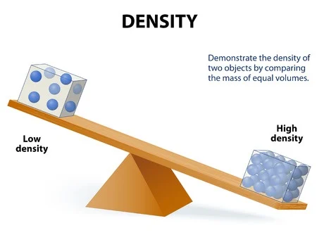
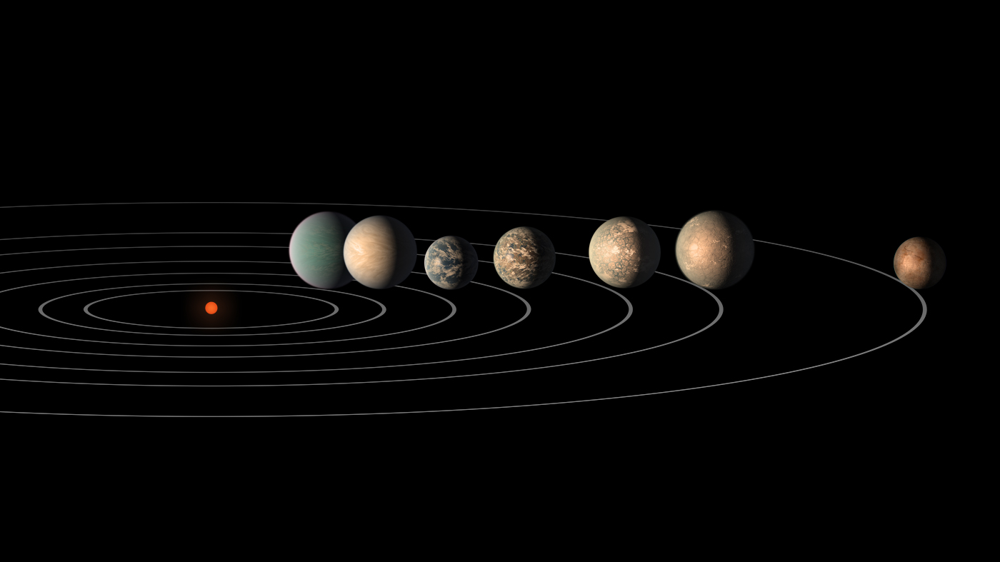
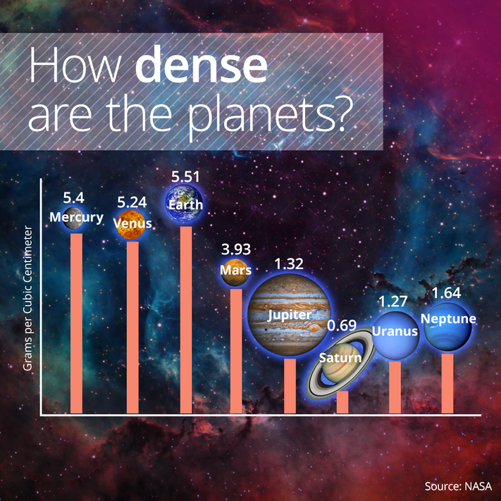
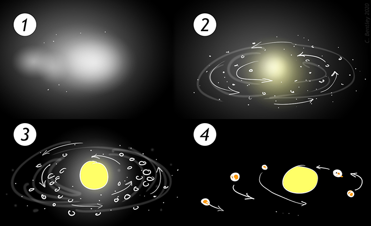
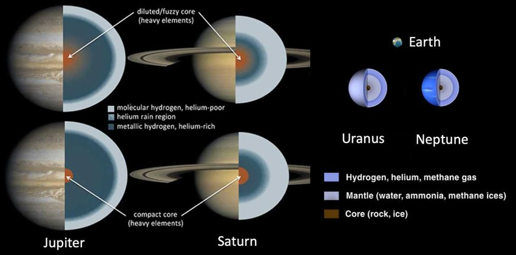

# Structure of the Solar System 

## Regents Earth Science

### 2024-25

---

# What is an Earth-like Planet?

# **Start by looking at our Solar System**

---

# Organzie you planet cards based on their distance from the Sun. 

## 1. Find patterns in the planets data

## 2. Fill out See-Think-Wonder based on the patterns you find

---

# See-Think-Wonder

* smaller planets are closest to the Sun & larger planets are furthest
* denser planets are closest to the Sun & less dense planets are furthest
* low mass planets are closest to the Sun & high mass planets are furthest
* planet temperature decreases as you move further from the Sun
* planets near the Sun are composed of rocks and metals while planets further from the Sun are composed of ice and gas 

### What are some possible explanations for our patterns?

---

# What is density?

### Question to investigate
Do cubes of exactly the same size and shape, have the same mass?

### Expected results
_The metal cube will have a greater mass than the wood or plastic cube._

### **How can two objects, which are exactly the same size and shape, have a different mass?**

---

## What is Density?

- Density = Mass ÷ Volume
- Measured in kg/m³ or g/cm³
- Determines if an object will sink or float
- Key factor in the structure of our solar system

---

## Density Formula

$$\Huge{d =\frac{m}{v}}$$

---

## Understanding Density

- Two objects can have the same mass but different volumes
- Example: 1kg of feathers vs 1kg of lead
- The lead has a higher density because it occupies less space

---

## Density in Everyday Life

- Ice floating on water
- Hot air balloons rising
- Layering of liquids in a glass
- Oil floating on water in a spill
- Helium balloons rising in air

---

## Density in Our Solar System

- Planets are arranged by density
- Inner planets: mostly rock and metal (higher density)
- Outer planets: mostly gas and ice (lower density)

---

## Density of Planets (g/cm³)

1. Earth: 5.51
2. Mercury: 5.43
3. Venus: 5.24
4. Mars: 3.93

 

5. Jupiter: 1.33
6. Saturn: 0.69 
7. Uranus: 1.27
8. Neptune: 1.64

---

## Why This Arrangement?

- Solar nebula theory
- Heavier elements concentrated near the Sun
- Lighter elements pushed to outer regions
- Gravity and heat play roles in planet formation

---

## Density and Planet Composition

- Rocky planets (inner): dense materials like iron, nickel, silicates
- Gas giants (outer): mainly hydrogen and helium
- Ice giants (Uranus, Neptune): water, ammonia, methane ices

---

# Explore 🔍 <!--fit--->

## The Effect of Temperature On Different Materials <!--fit--->

### States of Matter Simulator

---

### Explore 🔍 - Consider

- What do you notice is the same about the materials when they are in a solid state? Liquid state? Gas state?
- What do you notice is different about the materials when they are in a solid state Liquid state? Gas state?
- Do you notice any differences in densities of materials when they are in their solid state?
- What is the same about the behavior of materials’ atoms or molecules when you increase their temperature? What is different?
- What is the same about the behavior of materials’ atoms or molecules when decrease their temperature? What is different?
- What did you notice when comparing the temperature at which each material became a solid?

---

