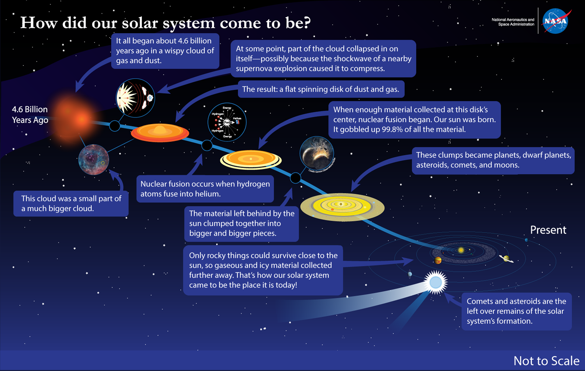
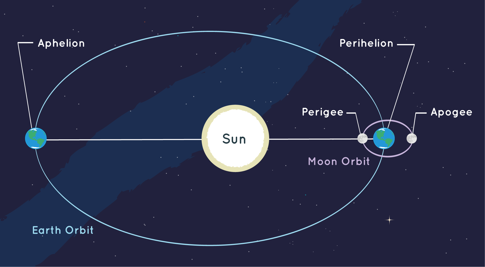
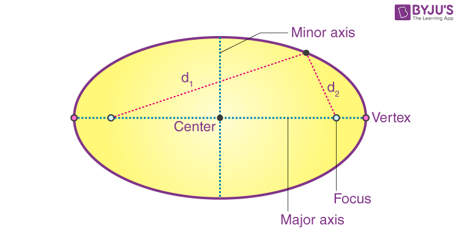

# Structure of the Solar System 

## Regents Earth Science

### 2024-25

---

# What is an Earth-like Planet?

# **Start by looking at our Solar System**

---

# Organzie you planet cards based on their distance from the Sun. 

## 1. Find patterns in the planets data

## 2. Fill out See-Think-Wonder based on the patterns you find

---

# See-Think-Wonder

* smaller planets are closest to the Sun & larger planets are furthest
* denser planets are closest to the Sun & less dense planets are furthest
* low mass planets are closest to the Sun & high mass planets are furthest
* planet temperature decreases as you move further from the Sun
* planets near the Sun are composed of rocks and metals while planets further from the Sun are composed of ice and gas 

### What are some possible explanations for our patterns?

---

# What is density?

### Question to investigate
Do cubes of exactly the same size and shape, have the same mass?

### Expected results
_The metal cube will have a greater mass than the wood or plastic cube._

### **How can two objects, which are exactly the same size and shape, have a different mass?**

---

## What is Density?

- Density = Mass ÷ Volume
- Measured in kg/m³ or g/cm³
- Determines if an object will sink or float
- Key factor in the structure of our solar system

---

## Density Formula

$$\Huge{d =\frac{m}{v}}$$

---

## Understanding Density

- Two objects can have the same mass but different volumes
- Example: 1kg of feathers vs 1kg of lead
- The lead has a higher density because it occupies less space

---

## Density in Everyday Life

- Ice floating on water
- Hot air balloons rising
- Layering of liquids in a glass
- Oil floating on water in a spill
- Helium balloons rising in air

---

## Density in Our Solar System

- Planets are arranged by density
- Inner planets: mostly rock and metal (higher density)
- Outer planets: mostly gas and ice (lower density)

---

## Density of Planets (g/cm³)

1. Earth: 5.51
2. Mercury: 5.43
3. Venus: 5.24
4. Mars: 3.93

 

5. Jupiter: 1.33
6. Saturn: 0.69 
7. Uranus: 1.27
8. Neptune: 1.64

---

## Why This Arrangement?

- Solar nebula theory
- Heavier elements concentrated near the Sun
- Lighter elements pushed to outer regions
- Gravity and heat play roles in planet formation

---

## Density and Planet Composition

- Rocky planets (inner): dense materials like iron, nickel, silicates
- Gas giants (outer): mainly hydrogen and helium
- Ice giants (Uranus, Neptune): water, ammonia, methane ices

---

# Explore 🔍 <!--fit--->

## The Effect of Temperature On Different Materials <!--fit--->

### States of Matter Simulator

---

### Explore 🔍 - Consider

- What do you notice is the same about the materials when they are in a solid state? Liquid state? Gas state?
- What do you notice is different about the materials when they are in a solid state Liquid state? Gas state?
- Do you notice any differences in densities of materials when they are in their solid state?
- What is the same about the behavior of materials’ atoms or molecules when you increase their temperature? What is different?
- What is the same about the behavior of materials’ atoms or molecules when decrease their temperature? What is different?
- What did you notice when comparing the temperature at which each material became a solid?

---

# Explain 🗣️ 

## How does condensation temperature explain the formation of our solar system? Why are the inner planets rocky and the outer planets gaseous?

 

### Densities 

1. Earth: 5.51
2. Mercury: 5.43
3. Venus: 5.24
4. Mars: 3.93
5. Jupiter: 1.33
6. Saturn: 0.69 
7. Uranus: 1.27
8. Neptune: 1.64

---

# Explain 2: Share Out 🗣️

Write your analysis answers on a whiteboard and be prepared to share out as a group.

---

# States of Matter

**Condensation**: Gas :arrow_right: Liquid

**Solidification**: Liquid :arrow_right: Solid

* Occurs at different temperature for different materials

---

<video controls="controls" width = "1150" src="../Unit 1 Origin/buac20-vid-planetsborn.mp4"></video>

---

---

# Composition of Planets in the Solar System

1) Planetary Nebula collapses and creates the sun. 
2) Temperature is not uniform so different materials condense at different temperatures. Divided by the _frost line_
3) Heavy elements condensed into rocks to form the inner, or Terrestrial Planets
4) Outside of the frost line cooler hydrogen compounds form ice

---

# [Reading: How Planets Form](https://lasp.colorado.edu/outerplanets/solsys_planets.php) <!--fit--->

---

# Elaborate: What makes the Jovian Planets so gassy?

---

# Orbital Motion <!--fit--->

---

# Silent Writing ✍️ 

## What are the characteristics of orbits in our solar system? What’s the same about them? What’s different?

---

# Post-it

## On a Post-It note, write down the characteristic that you are most confident about or is most interesting.

---

# Rumors 

1. Say your rumor outloud to a partner
2. Listen to their rumor
3. EXCHANGE post it notes (the rumor)
4. Find a new partner to share your new rumor to

### Share with as many people in the class as you can in **:stopwatch: 3 minutes**

---

# Class Share

## What was the best rumor your heard?

---

# Graphing

## How does the amount of time it takes for an object to orbit around the Sun change with distance from the Sun?

---

# Graphing Data 

| Planet | Average Dist. from the Sun (AU) | Period of Revolution (Years) | 
|---|---|---|
| Earth | 1 | 1 | 
| Juptier | 5.203 | 11.864 | 
| Saturn | 9.539 | 29.456 |
| Uranus | 19.18 | 84.07 |
| Neptune | 30.06 | 164.81 | 

---

# Orbit Simulator

- What patterns do you notice in the relationship do you see between the velocity at which an object orbits and its distance from the Sun?
- What happens to planet X when you vary its distance from the Sun? What patterns do you observe?
- What is the shape of most of the orbits in our solar system? Are there any exceptions?
- What are some ways that the motion of an object with a less circular (more oval like) orbit is different than one with a very circular orbit? (velocity varies more, temperature changes more)

---

# Orbit Simulator Controls

1. Adjust the controls of the planet (distance and velocity) to try and match the orbits of the different planets
2. What patterns do you notice in the relationship do you see between the velocity at which an object orbits and its distance from the Sun?
3. What is the shape of most of the orbits in our solar system? Are there any exceptions?
4. What are some ways that the motion of an object with a less circular (more oval like) orbit is different than one with a very circular orbit? (velocity varies more, temperature changes more)

--- 

# Kepler's Laws 

1. Law of Orbits: 
    * All planets orbit in ellipses
    * Sun at one focus
2. Law of Equal Areas
    * Planets Sweep out equal areas in equal times
    * Speed Varies in Orbit, faster closer to the Sun
3. Law of Periods
    * $T^2 = a^3$
    * Longer orbital paths = longer orbital periods
    * Double Distance, the period more than doubles

---

# Side Story

Johannes Kepler

 

Tycho Brahe

<!--- 

Ah yes - this is the fascinating story of Kepler and Tycho Brahe! Let me create some slides about this historical drama.

# The Drama Behind Kepler's Laws: Tycho Brahe's Data

---

## Tycho Brahe (1546-1601)

### The Master Observer
* Danish nobleman and astronomer
* Built Uraniborg - world's best observatory
* Created most accurate astronomical data of his time
* Observed without telescopes - used massive instruments
* Spent 20+ years collecting precise planetary data
* Especially detailed observations of Mars

---

## The Partnership

### How They Met:
* 1600: Kepler becomes Brahe's assistant in Prague
* Brahe was Imperial Mathematician to Rudolf II
* Kepler was a brilliant mathematician but poor observer
* Brahe had data but needed mathematical analysis

### The Arrangement:
* Brahe gave Kepler limited access to data
* Only shared Mars observations at first
* Kept most data secret - his life's work
* Wanted Kepler to prove Brahe's own model of the universe

---

## The Drama

### Brahe's Sudden Death:
* October 1601: Brahe dies suddenly
* Possibly from mercury poisoning
* Modern tests confirmed mercury in his beard

### The Data Transfer:
* Kepler quickly takes possession of data
* Claims he was named Brahe's successor
* Brahe's family disputes this
* Legal battles over ownership begin

---

## The Controversy

### Did Kepler "Steal" the Data?
* Technically inherited position of Imperial Mathematician
* But may have taken more data than intended
* Brahe's family tried to reclaim the observations
* Kepler refused to return all materials

### Modern Perspective:
* Not exactly theft, but ethically questionable
* Kepler did credit Brahe extensively
* Called himself "standing on the shoulders of giants"
* Without Kepler's analysis, data might have been wasted

---

## The Legacy

### The Perfect Partnership (After Death):
* Brahe: World's best naked-eye observer
* Kepler: Brilliant mathematical analyst
* Together (though not as planned) revolutionized astronomy

### The Result:
* Kepler spent 20+ years analyzing Brahe's data
* Particularly Mars data led to discovery of elliptical orbits
* Published the three laws between 1609-1619
* Changed our understanding of the solar system forever

Would you like me to expand on any part of this historical drama? There are more details about their relationship and the subsequent legal battles if you're interested!
--->

---

# Elliptical Orbits <!--fit--->

---

# Revolution 

* The motion of one body around another body
* Example: Earth's yearly journey around the Sun 

---

# Orbit 

* The path that one object takes as it revolves around another object
* In our solar system: paths planets take around the Sun

---

# Ellipse 

* A closed curve where the sum of distances from any point on the curve to two fixed points (foci) is constant
* All planetary orbits are elliptical

---

# Eccentricity

* A measure of how much an ellipse deviates from being perfectly circular
* Describes how "stretched out" or "squashed" an ellipse is

---

# Eccentricity

## Formula: 

$$\textrm{Eccentricity} = \frac{\textrm{distance between foci}}{\textrm{length of major axis}}$$

---

# Eccentricity 

* Always between 0 and 1
* 0 ➡️ Perfect Circle ⭕
* 1 ➡️ Straight line |
* Most Planetary orbits are closer to 0
    * Earth: 0.017
    * Venus: 0.007 
    * Mercury: 0.206 

---

# Label Your Ellipse

---

# The Sun's Role

* One focus of every planetary orbit is occupied by the Sun
* This is due to the Sun's gravitational influence

---

# Orbital Points

## Perihelion

* The point in orbit closest to the Sun
* Planet moves fastest at this point

## Aphelion

* The point in orbit farthest from the Sun
* Planet moves slowest at this point

---

# How to draw an ellipse

 

---

# Ellipse Lab <!--fit--->

## :dart: Goal: Mathematially Model Ellipses <!--fit--->