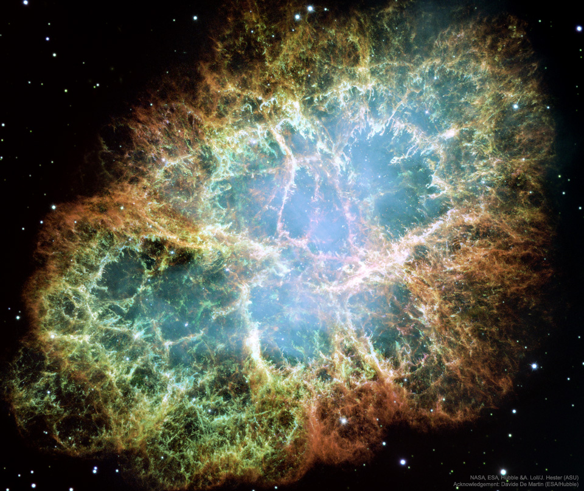
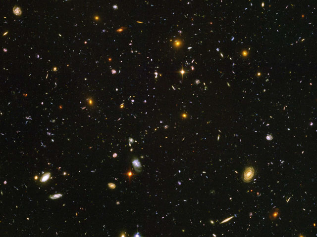
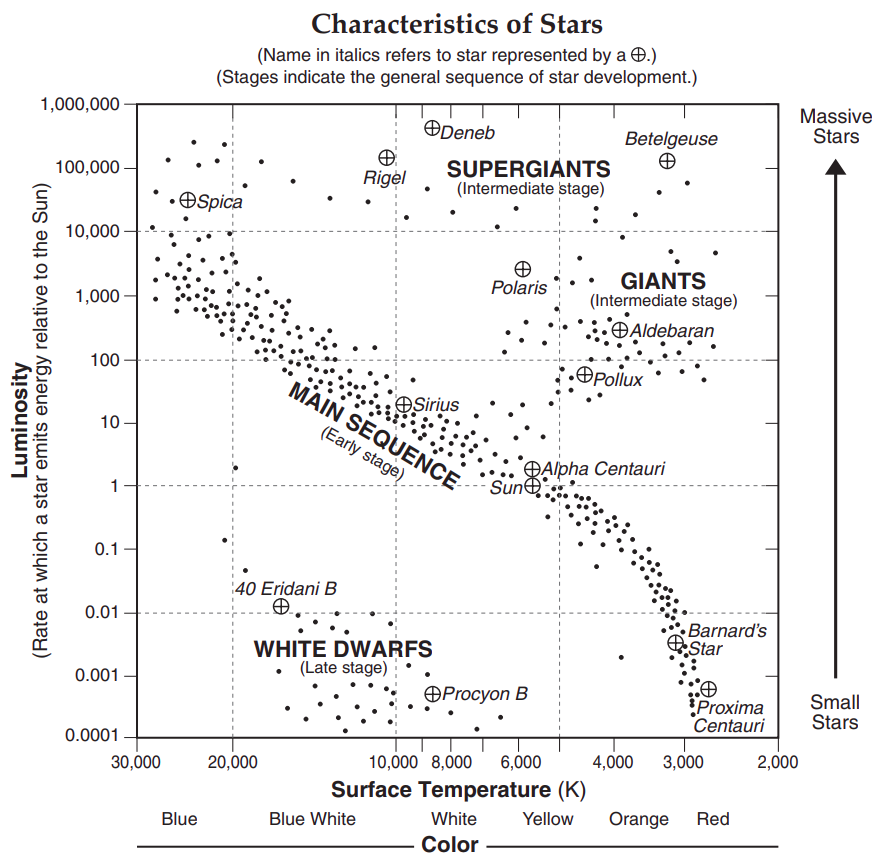
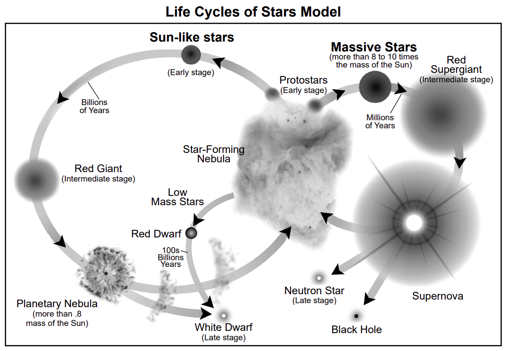

# Stellar Evolution <!--fit--->

## Origins of the Universe

### Regents Earth Science

---

# ***Where would we go***? <!--fit--->

### Are there other stars in the universe like our sun?

### Do stars have a lifetime? Is there a pattern?

---

# Crab Nebula Debuts 🦀

---

# Share 🗣️ <!--fit--->

## What is a supernova?

## How would you describe the supernova image?

---

<iframe width="1200" height="705" src="https://www.youtube.com/embed/aysiMbgml5g?si=vQvooz82QrX2zcTU" title="YouTube video player" frameborder="0" allow="accelerometer; autoplay; clipboard-write; encrypted-media; gyroscope; picture-in-picture; web-share" referrerpolicy="strict-origin-when-cross-origin" allowfullscreen></iframe>

--- 

# Explore 🔎 <!--fit--->

## What Properties of Stars Give Us Clues About Their Life Spans?

---

# Hubble Image

          

<!---

What did the first galaxies look like? To help answer this question, the Hubble Space Telescope has just finished taking the Hubble Ultra Deep Field (HUDF), the deepest image of the universe ever taken in visible light. Pictured above, the HUDF shows a sampling of the oldest galaxies ever seen, galaxies that formed just after the dark ages, 13 billion years ago, when the universe was only 5 percent of its present age. The Hubble Space Telescope's NICMOS and new ACS cameras took the image. Staring nearly 3 months at the same spot, the HUDF is four times more sensitive, in some colors, than the original Hubble Deep Field (HDF). Astronomers the world over will likely study the HUDF for years to come to better understand how stars and galaxies formed in the early universe.

WHAT DO YOU OBSERVE?

WHAT DO YOU OBSERVE IN THE SPECRTRA

The stars are different colors
The stars are different sizes 
The stars vary in brightness
The stars are different shapes and we see much more detail 
The sample spectra of stars indicates they are made of hydrogen and helium just like our Sun
The difference in color is caused by temperature
The difference in size has to do with distance
The difference in brightness has to do with distance

--->

---

# A Definition:

### **Luminosity** - energy radiated by a star per second, the power output of a star

---

### Herzsprung-Russell Diagram

- On Earth Science Reference Table
- Tells us about stars' temperature, luminosity and classification
- Luminosity value is in refernce to ***our sun***

---

### Simulation

- We are going to go through each question and document our answers
- Play with the simulation on your own, then share your answer with your table partner
- I will take a volunteer to share to the class

 

<iframe src="https://astro.unl.edu/smartphone/HRDiagram/" style="border:0px #ffffff none;" name="myiFrame" scrolling="no" frameborder="0" marginheight="0px" marginwidth="0px" height="700px" width="500px" allowfullscreen></iframe>

---

# Lifecycle of a Star Simulation 

## Star in a box 

---

# Star in a Box

## Lifecycle of Our Sun

1) Main Sequence
2) Red Giant
3) White Dwarf

---

# Star in a Box

1. Run Simulation for all masses
2. Record different lifecycles
3. Sort Star masses into different cycle categories

---

# Star in a box 

## Fill out chart for each star grouping 

---

---

# How can we use the properties we observe about stars to make predictions about their lifespan? 

---

# Think - Pair - Share

1. What properties in stars allow us to make predictions about their life cycles?
2. What kind of stars live the longest and most stable lives? Are there observable properties that allow us to identify these stars?
3. How should this be considered in our search for an Earth-like planet where humans could live?

---

# We know what...but why and how?

# We can predict, now lets explain

---

* The mass of stars allow us to make predictions about their life cycles.
* Properties like color, temperature, and luminosity give us clues about a stars mass.
* The lower the star's mass, the shorter and more stable its life cycle is.
* Stars up to a solar mass of 1 are stable in the main sequence longer than it took for life to exist and evolve on Earth.
* Stars that have reached stages after the main sequence change a lot. Temperature and luminosity change so much, it would destroy life if it existed on any  planet revolving around it.

---

# Text: _Forces Within a Star_ 

- Circle any information that you think will help explain why a star’s size increases over time
- Underline any information that you think will help explain why a star’s size decreases over time
- Box any information that you don’t understand or have questions about. Jot those questions in the margin.

---

# Nuclear Fusion 

<iframe width="900" height="500" src="https://www.youtube.com/embed/O3wRlPNAnrA?si=7Gmbz9z9JKEFSBJe" title="YouTube video player" frameborder="0" allow="accelerometer; autoplay; clipboard-write; encrypted-media; gyroscope; picture-in-picture; web-share" referrerpolicy="strict-origin-when-cross-origin" allowfullscreen></iframe>

---

### _Forces Within a Star_ &  Gravity
- There is a direct relationship between mass and gravitational pull
- Gravity affects the size of a star by pulling gasses inward toward the center of mass

---

#### _Forces Within a Star_ & Nuclear Fusion

- When gravity pulls hydrogen gas particles together within a star, they collide more frequently and with more force, which leads to nuclear fusion
- A small percentage of the mass from the hydrogen gas is lost when it’s fused into helium, because it is converted into tremendous amounts of energy. 
- This energy is much more than what was required to make the fusion happen 
- This net gain in energy from nuclear fusion in the core pushes outward

---

#### Star formation by collapse of molecular clouds

<iframe width="900" height="515" src="https://www.youtube.com/embed/YbdwTwB8jtc?si=vn_pbEDb5sgRX4NW" title="YouTube video player" frameborder="0" allow="accelerometer; autoplay; clipboard-write; encrypted-media; gyroscope; picture-in-picture; web-share" referrerpolicy="strict-origin-when-cross-origin" allowfullscreen></iframe>

<!---

timestamps:
molecular cloud : 0:03
molecular cloud begins to collapse : 0:34
proto star eats other proto star : 0:46
proto star begins to grow quickly : 0:57
proto star eats its own brother : 1:15
simulation finishes : 1:34

--->

---

# Dying Stars 

<iframe width="900" height="500" src="https://www.youtube.com/embed/_dD7u_D20T8?si=JZH5wnaGjbeH3itm" title="YouTube video player" frameborder="0" allow="accelerometer; autoplay; clipboard-write; encrypted-media; gyroscope; picture-in-picture; web-share" referrerpolicy="strict-origin-when-cross-origin" allowfullscreen></iframe>