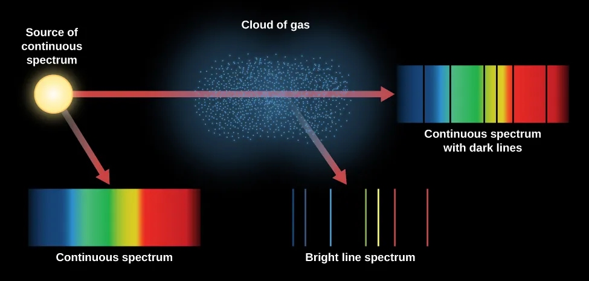

# The Sun 🌞 <!--fit--->

## Unit 1: Discovering New Worlds  
#### Mr. Porter | Maple Hill Jr./Sr. High School

---

<!-- Lesson Objectives -->
## Today’s Goals

- Connect our curiosity about exoplanets and our own Sun  
- Share and discuss our ideas about how the Sun provides energy  
- Begin investigating sunlight using scientific tools and evidence  
- Practice making claims based on patterns in data

---

<!-- Engage: Driving Question -->
## Engage: Why Focus on the Sun?

- During our Driving Question Board launch, we wondered:
  - *Does the exoplanet have a Sun like ours?*
  - *How does the Sun provide the right amount of energy for life?*
- We need to understand our own Sun before we can compare it to others.

---

<!-- Engage: Surfacing Ideas 

TEACHER NOTE: Give students a minute to think and jot ideas.  

Encourage all students to participate, including using accessible methods for blind students (e.g., audio, Braille).

POSSIBLE ANSWERS
It’s very bright.
It’s yellow or white.
It’s very large compared to Earth.
It’s very hot.

-->
## Engage: What Do You Know About the Sun?

**Instructions:**
1. Imagine the Sun. Jot down everything that comes to mind.
2. Share your ideas with a partner.
3. As a class, we’ll use the “Rumors” routine to surface and categorize our ideas.

---

<!-- Engage: Observing the Sun 

TEACHER NOTE: This is the brainstorming handout prompt.  

Remind students to connect their ideas to prior experience or observations.

It looks like lava.
It has flames shooting out of it .
There’re explosions in it.
Some parts are darker than others.
It seems to have gas in it.

-->
## Engage: Observing the Sun

- We’ll watch NASA telescope footage of the Sun.
- As you watch, write down any new observations you notice.

---

<iframe width="1100" height="615" src="https://www.youtube.com/embed/UJTo1Hc8fAk?si=S4-YPXPDuAYByk3-" title="YouTube video player" frameborder="0" allow="accelerometer; autoplay; clipboard-write; encrypted-media; gyroscope; picture-in-picture; web-share" referrerpolicy="strict-origin-when-cross-origin" allowfullscreen></iframe>

---

<!-- Engage: Connecting to Energy 

TEACHER NOTE: Encourage students to connect to phenomena they know (e.g., fire, light bulbs, chemical reactions).

-->
## Engage: How Does the Sun Provide So Much Energy?

**Your Task:**  
- Brainstorm 2–5 ideas for how the Sun provides energy (see your handout).
- For each idea, write what you’ve seen or learned that supports your thinking.

---

<!--

TEACHER NOTE: Encourage students to connect to phenomena they know (e.g., fire, light bulbs, chemical reactions).

-->

## Engage: Surfacing Student Ideas
- Read the investigative phenomenon at the top of your handout
- Discuss with a partner:
    - What other phenomena do you know that are associated with a lot of energy?
    - How is that energy produced?
-  Write your best idea about how the Sun works on a sticky note

---

<!--

TEACHER NOTE: Use this slide to prompt metacognition about scientific investigation.  

Ask: Can we take apart the Sun? What can we measure from Earth?

-->

## Engage: How Do We Figure Out How the Sun Works?
- How do we usually figure out how something works?
    - Take it apart?
    - Learn what it’s made of?
    - See how the parts work together?
    - Can we do this with the Sun?
    -  What can we observe from Earth?

---

<!-- Explore: Investigating Light from the Sun -->
## Explore: Investigating Light from the Sun

We can’t take apart the Sun, but we can observe it from Earth!

**Today’s Investigation:**  
- Learn how a spectroscopy telescope works using a simulator
- Analyze sunlight and compare it to light from gases in the lab

---

<!-- Explore: What Does a Spectrometer Tell Us? -->
## Explore: Using a Spectrometer

**Instructions:**
1. Use the [Three Views Spectrum Demonstrator Simulation](https://astro.unl.edu/classaction/animations/light/threeviewsspectra.html).
    - Note: Link posted on **Canvas**
2. Observe the spectrum from a light bulb.
3. Observe the spectrum after light passes through a gas cloud.
4. Record your observations and explanations on your handout.

---

<!-- Explore: Observing Sunlight -->
## Explore: What Do We See in Sunlight?

- Astronomers use a spectrometer to collect data from the Sun.
- Examine the spectra from three different Sun observations.

**Look for Patterns:**  
- What do you notice about the spectra?  
- Are there features that repeat?  
- What might cause these patterns?

---

# What is the **electromagnetic spectrum**?

* Full range of electromagnetic radiation
* Divided into bands
    - separated by characteristics such as how they are produced

---

---

<!-- Explore: Comparing Sun & Lab Spectra -->
## Explore: Comparing Sun & Lab Spectra

- Compare the Sun’s spectrum to spectra from hydrogen, helium, nitrogen, and oxygen gases.
- Use the “See-Think-Wonder” chart on your handout:
  - **See:** What patterns do you observe?
  - **Think:** What could these patterns mean?
  - **Wonder:** What questions do you have?

---

<!-- Explore: Making Connections -->
## Explore: What Can We Infer?

- What connections can you make between the Sun’s spectrum and the spectra of different gases?
- What does this tell you about what the Sun is made of?
- Be ready to share your ideas and evidence with the class.

---

<!-- Next Steps -->
## What’s Next?

- We’ll use our evidence and observations to develop a claim about the Sun’s composition.
- Keep thinking about:  
  - What patterns do you see?
  - What evidence supports your ideas?
  - What questions do you still have?

---

---

<!--
TEACHER NOTE: Title slide for Explain phase.  
You may want to add your name, class, and date.
-->
# How the Sun Works: Explain  
Earth & Space Science – Unit 1

---

<!--
TEACHER NOTE: Use this slide to introduce the purpose of the Explain phase.
-->
## Explain: Making Sense of the Evidence

- Use patterns in data to develop a claim about the Sun’s composition
- Practice supporting claims with scientific evidence
- Work toward a class consensus about how the Sun works

---

<!--
TEACHER NOTE: Reconnect to the driving question.  
Prompt students to recall what they are trying to figure out.
-->
## What Are We Trying to Figure Out?

- Does the exoplanet have a Sun like ours?
- What is our Sun made of, and how does it release energy?
- What counts as an evidence-based claim in science?

---

<!--
TEACHER NOTE: Facilitate a class discussion about what counts as evidence.  
Encourage students to share their thinking and experiences from Engage/Explore.
-->
## What Counts as an Evidence-Based Claim?

- Information from a reliable source or experiment
- Evidence from an investigation or data
- Not just someone’s opinion
- Agreement among scientists
- Patterns in data can serve as evidence

---

<!--
TEACHER NOTE: Remind students to refer back to the class poster or board of ideas from Engage.
-->
## Using Evidence to Support or Revise Our Ideas

- Review your observations from the Explore phase
- Does your evidence support your initial ideas?
- Do you need to revise your thinking?

---

<!--
TEACHER NOTE: This is the sequencing card sort.  
Encourage students to work in pairs or small groups.
-->
## Organize Evidence: How Do We Know What the Sun is Made Of?

**Instructions:**  
1. Work with your group to sequence the evidence cards from the sunlight investigation  
2. Put the cards in an order that shows how we can determine the Sun’s composition  
3. Be ready to explain your reasoning

---

<!--
TEACHER NOTE: Circulate and listen for key ideas as students work.  
Prompt students to cite specific evidence and patterns.
-->
## Look & Listen For

- White light contains many wavelengths (colors)
- A spectrometer separates light into its component wavelengths
- When white light passes through a gas, some wavelengths are absorbed (black lines)
- Each gas has a unique pattern of absorption lines
- The Sun’s spectrum matches the patterns for hydrogen and helium

---

<!--
TEACHER NOTE: Students write a scientific explanation (CER) about the Sun’s composition.  
Offer scaffolds as needed.
-->
## Write a Scientific Explanation

**Prompt:**  
- What is the Sun made of? How do you know?

**Use the CER (Claim-Evidence-Reasoning) approach:**  
- **Claim:** What do you think the Sun is composed of?  
- **Evidence:** What data supports your claim?  
- **Reasoning:** How does your evidence support your claim?

---

<!--
TEACHER NOTE: Sample conferring questions to guide students' explanations.
-->
## Conferring Prompts

- Why does the evidence tell us the Sun is composed of hydrogen and helium?
- What patterns did you use as evidence?
- How do you know there is a pattern?
- What makes your explanation convincing?

---

<!--
TEACHER NOTE: Scaffold for students who need support.  
Encourage use of the CER chart or sentence starters.
-->
## Need Help Getting Started?

- Use the CER chart on your handout
- Try sentence starters:
  - “The Sun is composed of…”
  - “The evidence for this is…”
  - “This evidence supports my claim because…”

---

<!--
TEACHER NOTE: Class consensus routine.  
Select groups to share explanations that move the class forward.
-->
## Class Consensus Discussion

- Groups share their scientific explanations
- Listen for:
  - Use of patterns as evidence
  - Clear reasoning linking evidence to claim
- As a class, discuss and agree on the best-supported claim

---

<!--
TEACHER NOTE: Key points to ensure are surfaced during discussion.
-->
## Take Time for These Key Points

- The Sun is made mostly of hydrogen and helium
- We know this from spectra data and patterns
- Patterns in evidence are a useful lens for figuring out other things in space science

---

<!--
TEACHER NOTE: Encourage students to reflect on their learning and the process.
-->
## Reflection & Summary

- What did you learn about making evidence-based claims?
- How did using patterns in data help you figure out what the Sun is made of?
- What questions do you still have about the Sun?

---

<!--
TEACHER NOTE: Use as an exit ticket or homework prompt.
-->
## Exit Ticket

- What is one thing you learned about how scientists use evidence to make claims?
- What is one question you still have about the Sun or its energy?

---

---

<!--
TEACHER NOTE: Title slide for Elaborate & Evaluate.  
You may want to add your name, class, and date.
-->
# How the Sun Works:  
Elaborate & Evaluate  
Earth & Space Science – Unit 1

---

<!--
TEACHER NOTE: Introduce the purpose of the Elaborate phase.
-->
## Elaborate: Explaining How the Sun Releases Energy

- Use evidence and reasoning to explain the process that releases the Sun’s energy
- Compare chemical and nuclear reactions as possible sources
- Connect the scale and duration of energy release to scientific explanations

---

<!--
TEACHER NOTE: Remind students of their earlier ideas about explosions, burning, and chemical reactions.
-->
## Revisiting Our Ideas

- We know the Sun is made of hydrogen and helium
- But how do these elements release so much energy for so long?
- Let’s analyze the evidence for two possible processes:
  - Chemical reactions
  - Nuclear reactions

---

<!--
TEACHER NOTE: Students analyze the data table comparing chemical and nuclear processes.
-->
## Analyze the Evidence

**Possible Energy-Releasing Processes in the Sun:**
- **Chemical:**  
  - Small amount of energy per reaction  
  - Would only power the Sun for ~50,000 years
- **Nuclear (Fusion):**  
  - Much more energy per reaction  
  - Can power the Sun for ~10 billion years

---

<!--
TEACHER NOTE: Students use claim and data cards to sort evidence and reasoning.
-->
## Card Sort: Which Process Powers the Sun?

**Instructions:**  
1. Work with your partner to sort the claim and data cards  
2. Decide which evidence supports chemical or nuclear reactions  
3. Add your reasoning to the cards as needed

---

<!--
TEACHER NOTE: Circulate and use conferring prompts to push student thinking.
-->
## Conferring Prompts

- What made you decide this card supports your claim?
- Is there evidence that can support both claims?
- Which claim has stronger evidence?
- How does the scale of energy and time help you decide?

---

<!--
TEACHER NOTE: Students write a scientific explanation for how the Sun releases energy.
-->
## Write Your Scientific Explanation

**Prompt:**  
- Is the Sun’s energy released by chemical or nuclear reactions?  
- Use evidence and reasoning to support your claim

---

<!--
TEACHER NOTE: Encourage students to reflect on what makes evidence strong.
-->
## What Counts as an Evidence-Based Claim?

- Information from a reliable source
- Evidence from an experiment or investigation
- Not just an opinion
- Patterns in data can count as evidence
- Claims can be revised based on new evidence

---

<!--
TEACHER NOTE: Transition to Evaluate phase.  
Students will revise and critique their models and make predictions.
-->
## Evaluate: Revising and Predicting

- Revise your model of how the Sun works based on new evidence
- Use your model to predict what will happen to

---

# <!--fit---> SLIDES

---

<!-- _class: lead -->
# How the Sun Works
Energy, Light, and the Solar Interior

- Course: Earth & Space Science (Grade 9)
- Standards: NYSSLS/NGSS (HS-ESS1-1, HS-ESS1-2, HS-ESS1-3; HS-PS3-1, HS-PS3-3; SEP, CCC)
- Driving Question: How do we know what’s happening inside the Sun if we can’t see it?

---

## Learning Targets
By the end of this lesson, you will be able to:
- Explain how matter converts to energy (E = mc²) and how fusion powers the Sun. (DCI PS3, ESS1)
- Describe how light behaves (wave vs. photon) and how spectra reveal composition and motion. (DCI PS4)
- Summarize energy transport inside the Sun (radiation, convection) and hydrostatic equilibrium. (ESS1)
- Interpret how helioseismology and neutrinos give evidence of the solar interior. (SEP: Analyzing data)

---

## Standards Alignment (Teacher Slide)
- HS-ESS1-1: Develop a model of the Sun–Earth system; explain solar energy source.
- HS-ESS1-2: Construct explanations from spectral data for star properties.
- HS-ESS1-3: Communicate how observations (spectra, neutrinos, pulsations) infer stellar interiors.
- HS-PS3-1: Create computational model showing energy transfer (E = mc²).
- SEPs: Developing & using models; Analyzing & interpreting data; Constructing explanations.
- CCCs: Energy & Matter; Patterns; Scale, Proportion & Quantity.

---

## Anchor Phenomenon
Why does the Sun shine steadily for billions of years—and how do we know what’s inside?

Think–Pair–Share:
- If we can’t see the Sun’s core, what evidence could scientists use?
- What kinds of data can travel out of the Sun?

---

## Light: Waves and Photons (Maxwell)
- Light is an electromagnetic wave: oscillating electric and magnetic fields.
- All EM waves move at speed of light in a vacuum.
- Light can also behave as particles (photons) with energy E = h·f.

Notes:
- c = 3.0 × 10^8 m/s
- Frequency (f) and wavelength (λ) relate by c = λf

---

## The Electromagnetic Spectrum
- Spectrum ranges from gamma rays (highest energy) to radio (lowest).
- Different bands interact differently with Earth’s atmosphere.

Prompt:
- Why do we need space telescopes for UV/X-ray/gamma observations?

---

---

## Spectra: Our Decoder Ring
- Continuous spectrum: hot dense sources.
- Absorption lines: cool thin gas in front of a continuous source.
- Emission lines: excited thin gas emits discrete wavelengths.

  

 

---

## Atomic Structure and Energy Levels (Bohr)
- Electrons occupy discrete energy levels.
- Absorption: electron jumps up by absorbing specific photon.
- Emission: electron falls and emits a photon with exact energy difference.

Key idea:
- Each element has a unique spec fingerprint.

---

---

## Energy in the Sun: E = mc² (Einstein)
- Matter converts to energy: E = mc²
- Even small mass loss → huge energy output.
- Sun’s luminosity can be sustained by converting ~4 million tons of mass to energy per second.

Quick calc:
- If 1 kg H fuses and 0.0071 kg becomes energy, E ≈ 6.4 × 10^14 J.

---

## Fusion in the Sun: Proton–Proton Chain
- Net: 4 H → He-4 + energy (photons + neutrinos)
- Steps: p + p → D + e⁺ + ν; D + p → He-3 + γ; He-3 + He-3 → He-4 + p + p
- Requires ~15 million K in core to overcome electrical repulsion.

 

---

## The Solar Interior: Structure & Stability
- Hydrostatic equilibrium: inward gravity balanced by outward gas pressure.
- Core (~0–0.25 R☉): fusion, T ≈ 15 million K, high density.
- Radiative zone (~0.25–0.7 R☉): energy moves via photon absorption/reemission.
- Convection zone (~0.7–1.0 R☉): energy transported by rising hot gas, sinking cool gas.

---

## Energy Transport and Random Walk
- Photons in radiative zone travel ~centimeters before absorption.
- Random walk takes ~100,000–1,000,000 years to reach surface.
- Neutrinos escape in ~2 seconds.

---

## Convection Near the Surface
- Rising hot gas, sinking cool gas form convection cells.
- Drives granulation and surface dynamics.

Think further:
- How could convection affect solar variability we measure at Earth?

---

## Observing the Interior: Helioseismology
- The Sun “pulsates” in many modes; surface velocities change in ~5-minute cycles.
- Sound waves traverse the Sun in ~1 hour; reveal temperature, density, rotation patterns.

Findings:
- Convection extends inward ~30% of radius.
- Differential rotation in convection zone; more solid-body rotation below.

---

## Sunspots: Subsurface Flow
- Strong magnetic fields block upward heat flow → cooler spots.
- Downflows act as a plug; surrounding hot gas deflects sideways then rises nearby.
- Explains slight increase in total solar output during high sunspot activity.

---

## Observing the Interior: Neutrinos
- Neutrinos from fusion escape directly; Earth is nearly transparent to them.
- Early chlorine experiments detected 1/3 the expected number → “solar neutrino problem.”
- Solution: neutrino oscillations (three flavors) confirmed; total flux matches models.

---

## Apply: Spectral Evidence Station Rotation
- Station 1: Identify elements from emission-line spectra (pattern matching).
- Station 2: Doppler shift calculations for red/blueshifted lines.
- Station 3: Blackbody curves—estimate peak wavelength and temperature (Wien’s law).
- Station 4: Model hydrostatic equilibrium with balloon analogy and claim–evidence–reasoning.

Materials:
- Printed spectra, rulers, calculators, sticky notes.

---

## Practice Problems (Quick)
1) A hydrogen line (656.3 nm) is observed at 656.6 nm. What’s the radial velocity?
- v = c × Δλ/λ

2) A star’s peak wavelength is 520 nm. Estimate surface temperature (Wien’s law).
- T ≈ (3 × 10^6 nm·K) / λ_max

3) If 0.0071 kg of mass converts to energy, compute E.
- E = mc²

---

## Exit Ticket (2–3 min)
- One observation that directly probes the Sun’s interior.
- One way spectra tell us about composition or motion.
- One model or mechanism that keeps the Sun stable.

---

## Homework/Extension
- Research: How does the CNO cycle differ from the p–p chain? In what stars is it dominant?
- Optional: Explore helioseismology visualizations; summarize one key finding in 3–4 sentences.

---

## Vocabulary
- Photon, wavelength, frequency, spectrum
- Emission/absorption lines, Doppler effect
- Hydrostatic equilibrium, radiative zone, convection zone
- Proton–proton chain, neutrino, oscillation

---

## Accessibility & UDL Notes (Teacher)
- Use alt text for all visuals.
- Offer sentence frames for CER tasks.
- Provide tactile/embossed line spectra (for TVI support) or sonified data options.
- Allow calculator and formula cards; chunk problems.

---

## References
OpenStax Astronomy 2e, Sections:
- 5.1 The Behavior of Light
- 5.2 The Electromagnetic Spectrum
- 5.3 Spectroscopy in Astronomy
- 5.4 The Structure of the Atom
- 5.5 Formation of Spectral Lines
- 5.6 The Doppler Effect
- 16.1 Sources of Sunshine
- 16.2 Mass, Energy, and Relativity
- 16.3 The Solar Interior: Theory
- 16.4 The Solar Interior: Observations